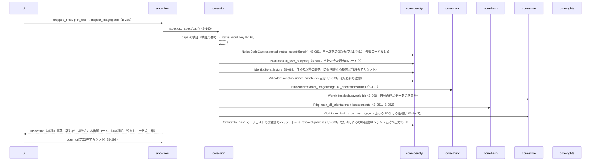
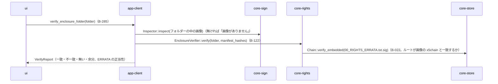
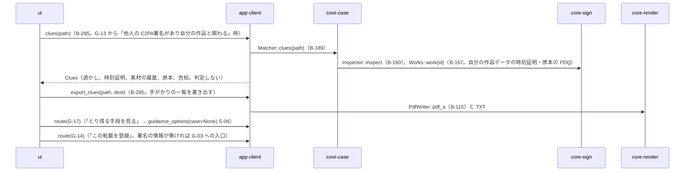

# S-04 確かめる（G-13）・手がかりの比較（G-24）

由来：第3章 10.2、第2章 4.1・4.4・5.1、第5章 3.4、第6章 4.1、第10章 G-13・G-24。記録を残さない（第10章 G-13）。

## S-04a 画像を確かめる

## S-04b 同封文書のフォルダーを確かめる（第5章 3.4）

## S-04c 手がかりの比較（G-24）

## 抜け（追って見つけ、直した）
- 第2章 4.4「手がかりの一覧は、証拠一式に加えて書き出せる」の形（TXT か PDF か）が仕様に無い → 第6章 3.4 の報告書と同じ（TXT と PDF/A-3u）とし、core-case.md の `Bundle::export_bundle(include_clues)` が受ける。G-24 単独の「手がかりの取り出し」は app-client の `export_clues` が同じ形で書く（本ファイル）。第2章 4.4 に「形は第6章 3.4 の報告書と同じ」を足した。
- G-13 の「取り消し済みの承認書のハッシュを持つ出力の印」（第2章 5.1）に要る「マニフェストの承認書のハッシュ → 承認書の番号」の引き方が core-identity の `Grants` に無かった → core-identity.md の `Grants` に `by_hash(sha256) Option<Document>` を足した。
