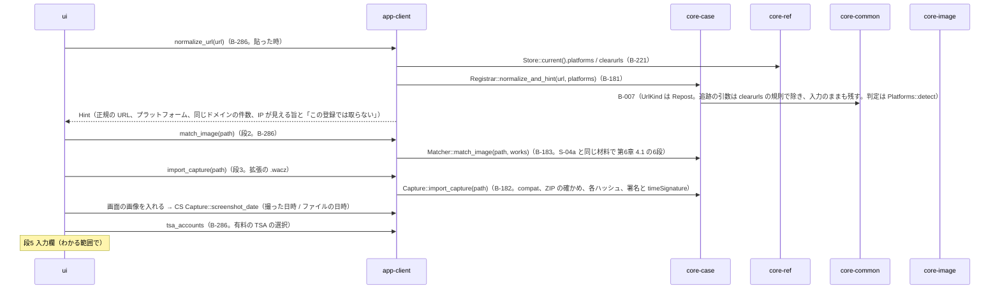
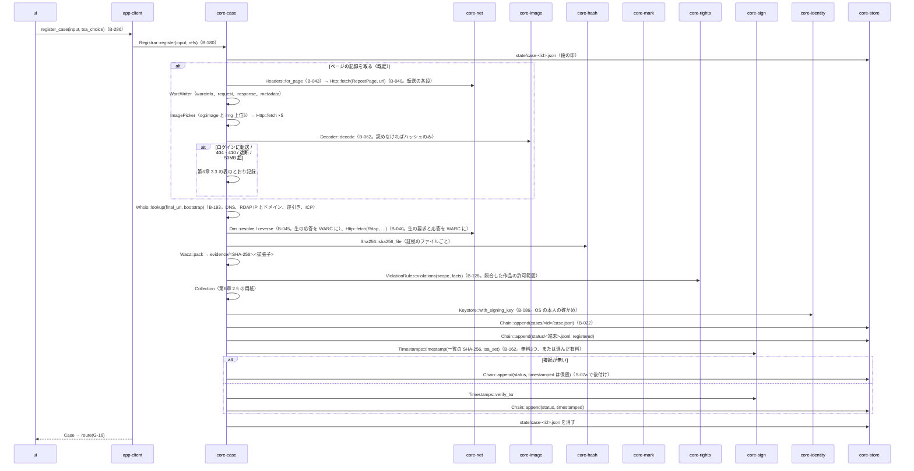
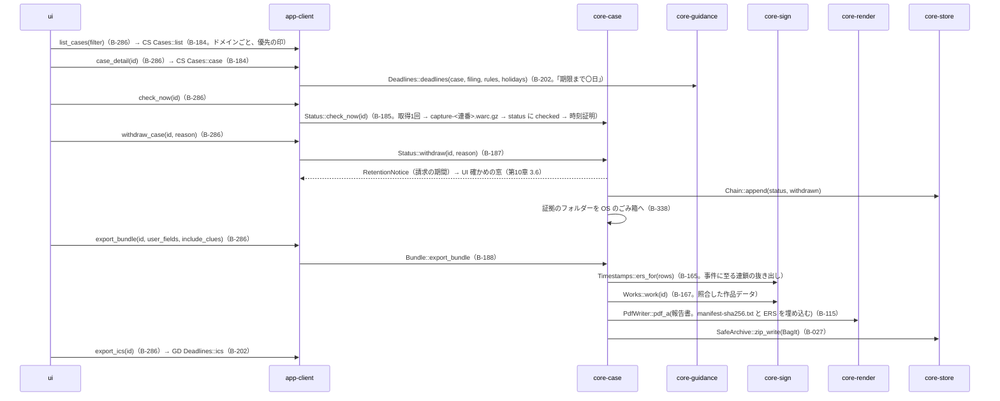

# S-05 転載の登録（G-14）、事件（G-15・G-16）

由来：第1章 7.3、第6章 2.1（段1〜6）・2.2・2.2.1・2.2.2・2.4・2.5・3.2・3.3・3.4・4・5・6・7、第10章 G-14〜G-16。

## S-05a 登録の画面（段1〜5）

## S-05b 登録する（段6。段ごとに state/ に印）

## S-05c 事件の一覧・詳細・今の状態・取り下げ・証拠一式

## 抜け（追って見つけ、直した）
- `register` の `refs`（参照情報の窓口の一覧・判定の表・RDAP のブートストラップ・`tsa.json`）を app-client が渡す形は core-case.md の依存にあるが、`Registrar::register` の引数名が `refs: RefBundle` で core-ref の型を指していた → core-case は core-ref に依存しないので、要る表だけの型 `CaseRefs { platforms, rdap_bootstrap, tsa }` に改めた（core-case.md の図）。
- 証拠の合計 1GB の確かめ（第6章 2.4）が段6の流れの中で「どこで止めるか」不明 → `Cases::evidence_size` を取得の前（ページの記録の上限と画面の画像の合計の見積もり）と取得の後（実測）の2回呼び、超えれば取り込みを断って「別の事件として」と示す（core-case.md の `Registrar::register` の注記に足した）。
- 事件の「時刻証明の保留」（G-14 の状態）を次の接続で後付けする道が core-sign の `attach_pending_timestamps`（作品データの保留）にしか無かった → `attach_pending_timestamps` は事件の状況の追記の保留も対象にする（core-sign.md の B-163 に注記。対象の列挙は core-case の `Cases` から受ける）。
