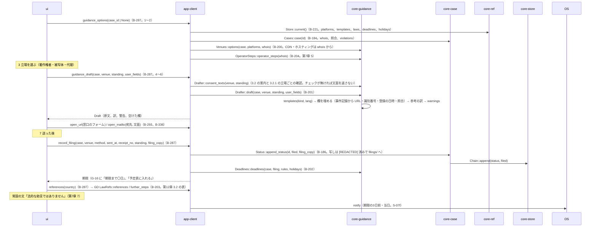

# S-06 対処の案内（G-17）

由来：第7章 3.1〜3.4・5・6.1・6.3・7、第6章 6.1、第12章 3.2、第10章 G-17。

## 抜け（追って見つけ、直した）
- 申立ての写しの `[REDACTED]` 化（第6章 6.1）を誰が行うか：利用者の欄を知るのは core-guidance（`Draft.user_fields`）で、保存は core-case → `Drafter::draft` が「写し用の文面」（利用者の欄を `[REDACTED]` に置き換えた版）も返し、app-client がそれを `append_status` の `filing_copy` に渡す。core-guidance.md の `Draft` に `redacted_copy: String` を足した。
- 事業者の応答（`response`）・削除・再掲載の記録は G-16 から `append_status` を直接呼ぶ（G-17 を通らない）。app-client.md の B-286 の命令に `record_status(id, kind, fields)` が無かった → 足した（`record_filing` は G-17 用、`record_status` は G-16 用）。
