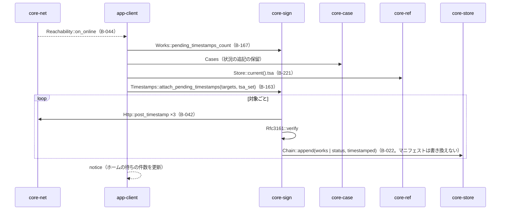
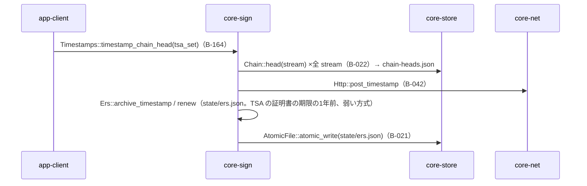
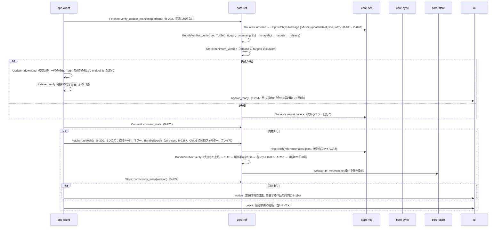
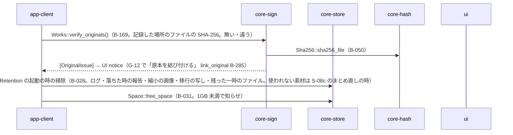
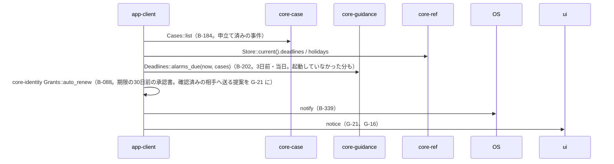

# S-07 裏の待ち行列（画面の操作なしに動くもの）

由来：第1章 7（裏の順）、7.5、7.9、第3章 4（保留と後付け、束ねた時刻証明、ERS）、第8章 3.4・4・5.5、第9章 4.1〜4.4、第2章 4.2、第1章 8.4、第7章 6.3、第11章 5.3。起点は S-01b（起動）、`Scheduler`（core-net B-044。24時間ごと・1時間ごと・回線の復帰）、閉じる時。

## S-07a 時刻証明の後付け（接続の時）

## S-07b 束ねた時刻証明と ERS（1日1回と接続のたび）

## S-07c 更新の案内と参照情報（起動時と24時間ごと）

## S-07d 原本の確かめ・保持の掃除・空き

## S-07e 自動の控え（1時間ごとと閉じる時）→ S-08a
## S-07f 期限の知らせ（起動時と毎日）

## 抜け（追って見つけ、直した）
- 後付けの時刻証明に `tsa_set` が要るが、`attach_pending_timestamps` の引数に無かった → core-sign.md の B-163 の引数に `tsa_set` を足した（S-05 で足した `targets` と並べる）。
- 「期限の知らせの毎日の起点」が仕様に無い（第7章 6.3 は VALARM の時刻と「起動していなかった分は次の起動で」だけ） → 起動中は core-net の `Scheduler` の24時間の刻みで `alarms_due` を回す（第1章 7 の裏の順の末尾に「毎日」と足した）。
- `Sources::ordered` の並びを更新の部品に渡す（第9章 4.3 の `endpoints`）のは app-client → app-client.md の `Updater::download` の注記に「`Sources::ordered` を endpoints に渡す」を足した。
