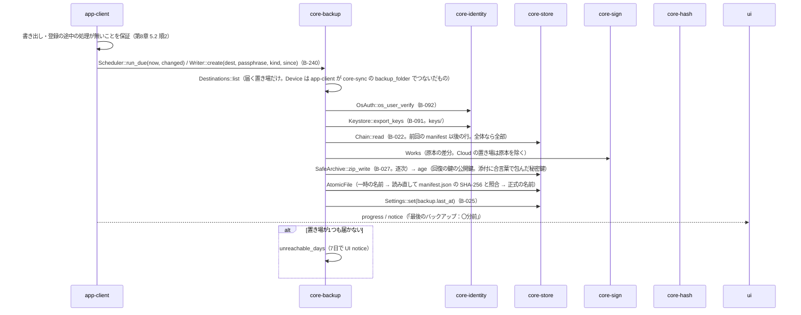
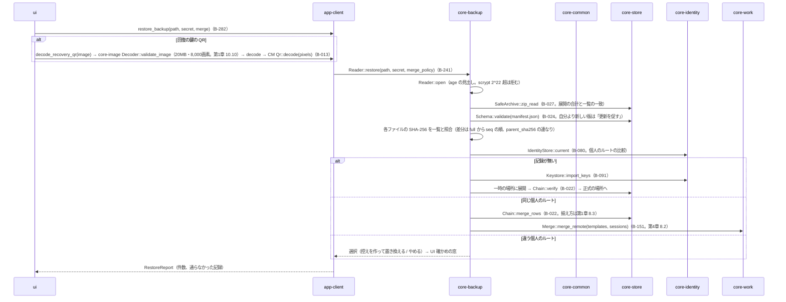
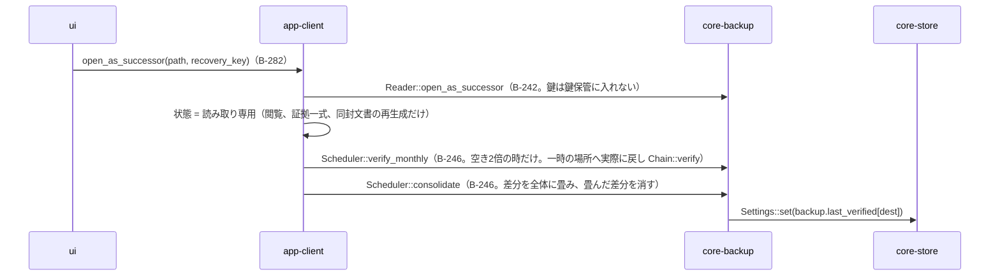

# S-08 控え（作る、戻す、引き継ぎとして開く、月1の確かめ）

由来：第8章 5.1〜5.3・5.5・5.6・8、第1章 7.7、第10章 G-05・G-06。

## S-08a 作る（手動 B-240 create、自動 run_due、閉じる時）

## S-08b 戻す（G-06）

## S-08c 引き継ぎとして開く・月1の確かめ・まとめ直し

## 抜け（追って見つけ、直した）
- 「引き継ぎとして開く」の状態が第1章 7 の7つの状態に無い（第1章 13 と第8章 5.3 にはある） → 第1章 7 の状態に「引き継ぎ（読み取り専用。第8章 5.3）」を足して8つにした。app-client.md の `AppState` に `Successor` を足した。
- 戻す時の「自分より新しいアプリで作った控え」の判定は manifest.json の `record_versions` と `app_version` → core-store の `Schema::validate` ではなく core-backup が比べる（図のとおり）。core-backup.md の `Reader::open` の注記に足した。
