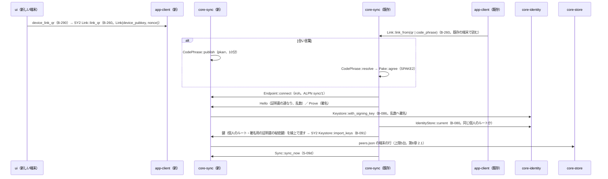
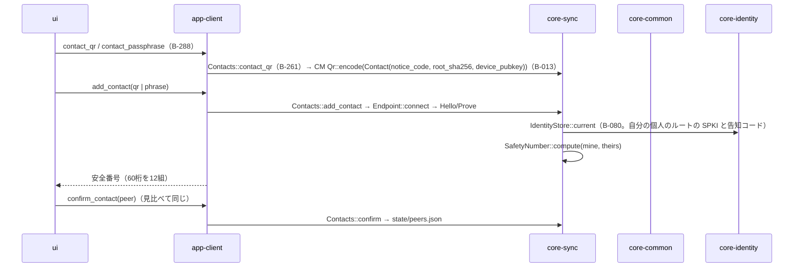
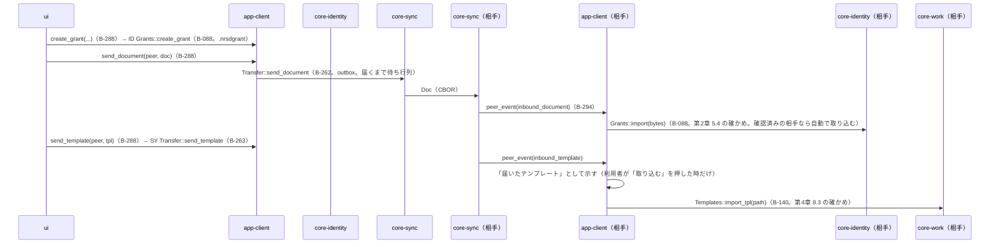
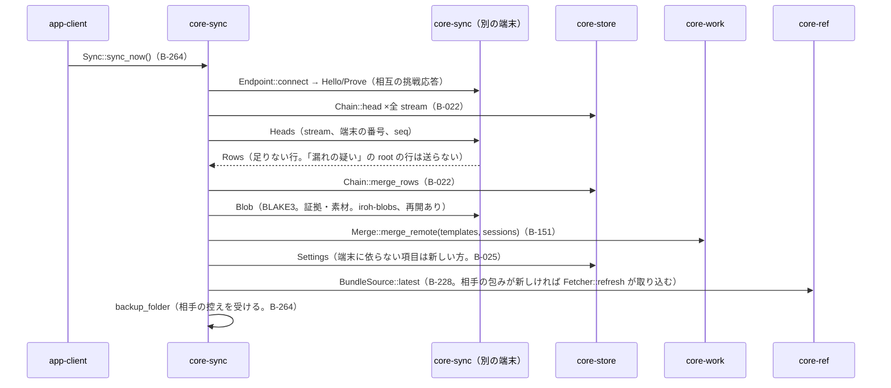

# S-09 端末のリンク、相手の追加、書類の送付、揃え、受信

由来：第8章 5.4、第2章 5.5・5.4、第4章 8.3、第10章 G-18・G-20。

## S-09a 端末のリンク（G-20「端末」）

## S-09b 相手の追加（G-18）

## S-09c 書類・テンプレートの送付と受信

## S-09d 揃え（sync_now。起動時、接続時、相手の端末からの接続）

## 抜け（追って見つけ、直した）
- 端末のリンクで「鍵をどう新しい端末へ渡すか」が第8章 5.4 に無い（Signal のリンクは鍵を渡す。「同じ個人のルートと署名用の証明書を使う」は第1章 13・第2章 7.3） → 第8章 5.4 の端末どうしの手順に「リンクの確かめの後、既存の端末が個人のルートと署名用の証明書の鍵を線上（端から端まで暗号化）で渡し、新しい端末は鍵保管に入れる（控えからの戻しと同じ結果）」を足した。core-sync.md の `Link::link_from` の注記と、core-identity の `Keystore::import_keys` の使う側に sync を足した。
- 相手の端末からの接続（自分が受ける側）の起点が app-client のページに無かった → `Endpoint::accept` は core-sync が起動中に常に待ち、受けた出来事を `peer_event` で app-client に渡す。app-client.md の B-294 `peer_event` の注記に「inbound_document、inbound_template、sync_request」を足した。
