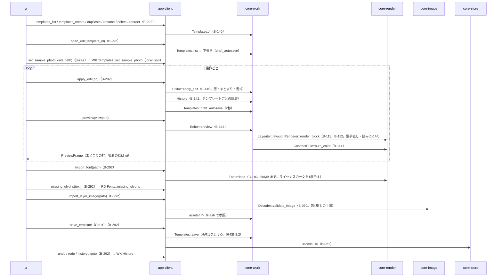
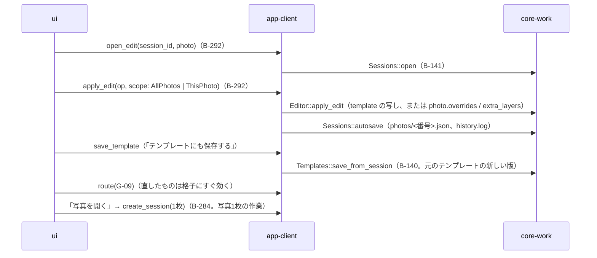
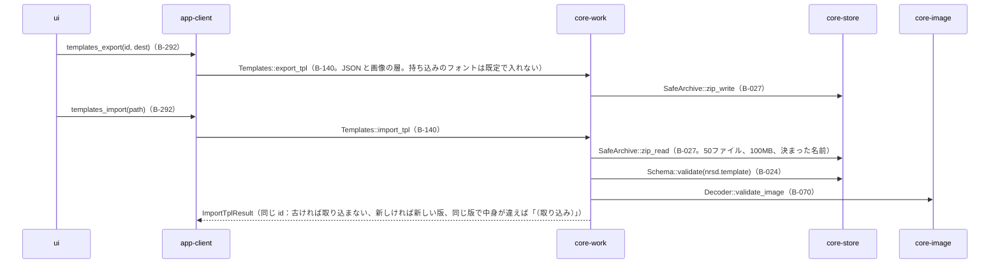

# S-10 画像編集（G-25）とテンプレート

由来：第4章 4・8・9・10・11・13、第10章 G-25、第4章 6.4（フォント）、5（画像の層）。

## S-10a テンプレートを直す

## S-10b 作業を直す（G-09 の「可視署名を直す」、「写真を開く」）

## S-10c 受け渡し（.nrsdtpl）

## 抜け（追って見つけ、直した）
- 画像の層の素材の置き場 `assets/` への保存と参照の数え方（第1章 8.4「使われなくなった持ち込みの素材」）が core-work のページに無かった → core-work.md の `Templates` に `assets_gc_candidates() [Hash]` を足した。消す時機は第1章 8.4 のとおり控えのまとめ直しの時で、core-backup の `consolidate` が候補を集めて core-store の `Retention::sweep_assets` に渡す（core-store.md の B-028）。
- 「要手直し」の状態の付け替え（第4章 12.2 の状態の移り）を誰が行うか → `Editor::apply_edit` の後に core-work が `Layouter::layout` の issues で `PhotoStatus` を更新する（core-work.md の `Editor::apply_edit` の注記）。
