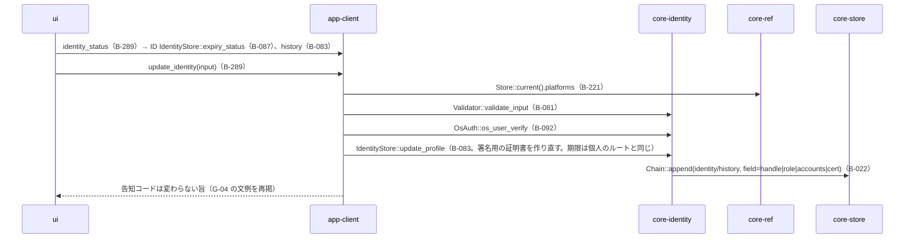
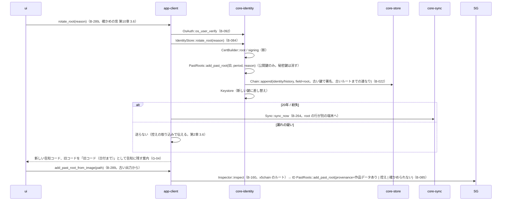
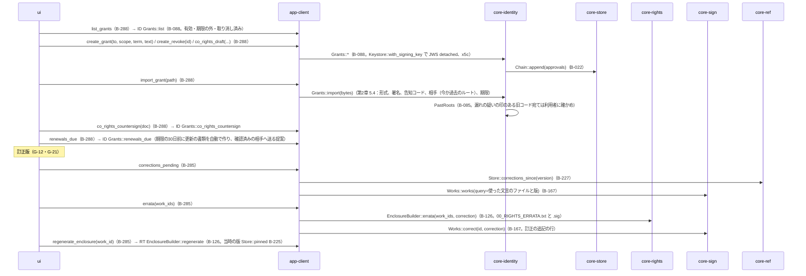

# S-11 署名の情報の変更、作り直し、承認と共同の権利、訂正版

由来：第2章 3.4・3.6・5.1〜5.4・6・7.2、第5章 2.4、第10章 G-18・G-19、第3章 10.2 の訂正。

## S-11a 署名の情報の変更（G-19）

## S-11b 個人のルートの作り直し（20年、紛失、漏れの疑い）

## S-11c 承認・共同の権利（G-18）、訂正版の同封文書

## 抜け（追って見つけ、直した）
- `Works::works(query)` で「使った文言のファイルの SHA-256」から引く索引が core-sign のデータ設計に無い（作品データの `rights` 欄にはある） → `WorkIndex`（core-store B-029）に `lookup_by_text_hash(sha256)` を足した（core-store.md）。
- 承認書の更新の書類（`renews`）を「自動で作る」（第2章 5.1）の起点が裏の待ち行列に無かった → S-07f と同じ刻みで `Grants::renewals_due` を回し、作った書類を G-21 で示す（第1章 7 の裏の順の末尾「期限の知らせ」に「承認書の更新の提案（第2章 5.1）」を足した）。
