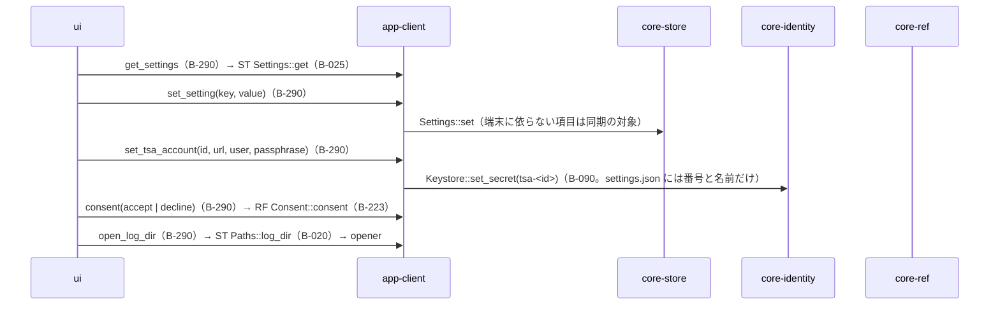
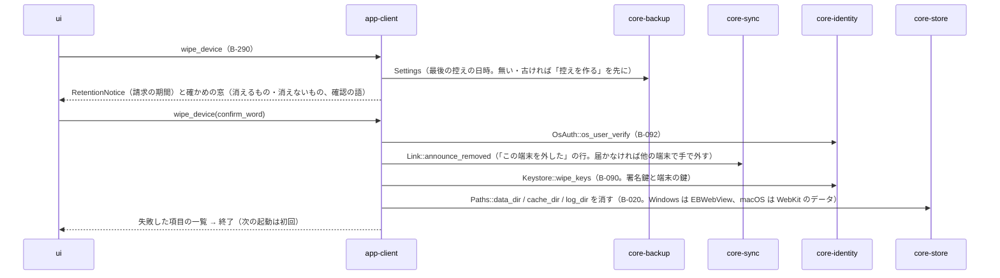
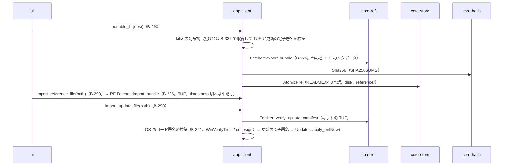
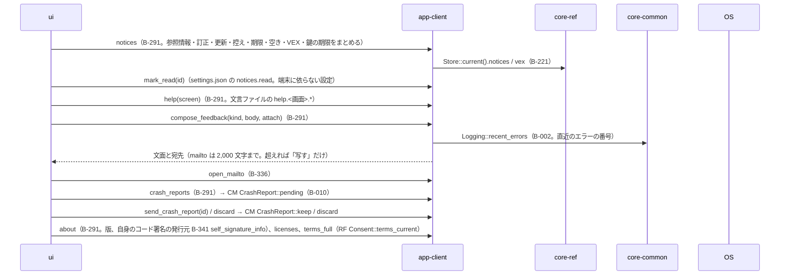

# S-12 設定、記録の消去、持ち出しキット、参照情報と更新のファイルからの取り込み、指摘、このアプリについて

由来：第10章 10・9・G-20〜G-23、第9章 2.3・4.5・5、第1章 10.3、第12章 5・6。

## S-12a 設定（G-20）

## S-12b この端末の記録を消す（第9章 2.3）

## S-12c 持ち出しキット・ファイルからの取り込み（第9章 5、4.5）

## S-12d お知らせ・ヘルプ・指摘・このアプリについて（G-21〜G-23）

## 抜け（追って見つけ、直した）
- お知らせの既読が「端末に依らない設定」（第10章 10 の保存の項）なのに、app-client のデータ設計では `state/read-notices.json`（端末ごと）にしていた → `settings.json` の `notices.read`（端末に依らない）に改め、app-client.md のデータ設計の行を直した。
- 「この端末を外した」の行の送り先（core-sync の操作名）が core-sync のページに無かった → core-sync.md の `Link` に `announce_removed()`（devices の連鎖の行として送る）を足した。
