# app-client（殻。Tauri の命令、状態機械、起動と裏の待ち行列、OS との接点）

## 受ける節
- 第1章：[6.1 アプリの層](../../../../docs/jp/design/01_基本設計書_全体構成.md#61-アプリの層)、[6.2 画面と中心の間](../../../../docs/jp/design/01_基本設計書_全体構成.md#62-画面と中心の間)、[7 実行時の場面](../../../../docs/jp/design/01_基本設計書_全体構成.md#7-実行時の場面)（起動の順序と8つの状態、7.1〜7.9）、[9.3 単一起動](../../../../docs/jp/design/01_基本設計書_全体構成.md#93-単一起動)
- [第2章 2.1 入力の手順](../../../../docs/jp/design/02_基本設計書_署名の情報と照合.md#21-入力の手順)
- 第9章：[2.3 「この端末の記録を消す」の手順](../../../../docs/jp/design/09_基本設計書_配布と更新.md#23-この端末の記録を消すの手順)、[4.1 流れと状態](../../../../docs/jp/design/09_基本設計書_配布と更新.md#41-流れと状態)、[4.5 失敗と乗っ取り](../../../../docs/jp/design/09_基本設計書_配布と更新.md#45-失敗と乗っ取り)、[5 入手経路](../../../../docs/jp/design/09_基本設計書_配布と更新.md#5-入手経路)（持ち出しキットの作成）
- [第10章 8 OS との統合](../../../../docs/jp/design/10_基本設計書_画面とデザイン.md#8-os-との統合)
- [第1章 13 端末と人](../../../../docs/jp/design/01_基本設計書_全体構成.md#13-端末と人)（複数の端末・引き継ぎ・確かめるだけ使う人の状態。控えの中身は core-backup、揃えは core-sync）
- 読むだけ：第10章 3.1・3.2（画面と遷移。命令の群は画面に対応）、第1章 10.6（入力の確かめ）、第11章 4.1（Tauri のプラグイン）。

## 依存
- 下：全ブロック（[core-common](core-common.md)、[core-store](core-store.md)、[core-net](core-net.md)、[core-hash](core-hash.md)（SHA256SUMS）、[core-image](core-image.md)（QR の画像の確かめ）、[core-render](core-render.md)（手がかりの PDF）、[core-identity](core-identity.md)、[core-mark](core-mark.md)、[core-sign](core-sign.md)、[core-rights](core-rights.md)、[core-work](core-work.md)、[core-case](core-case.md)、[core-guidance](core-guidance.md)、[core-ref](core-ref.md)、[core-backup](core-backup.md)、[core-sync](core-sync.md)）。業務の判断を持たず、命令を受けて業務のブロックに渡し、知らせを画面へ送る（第1章 6.1）。
- 上：[ui](ui.md)（命令を呼び、知らせを購読する。依存の逆転は `Event` の型を本ブロックが定める）。
- Linux の鍵保管の合言葉（第2章 7.5）の強さは、core-identity が core-backup に依存しないため、本ブロックが先に `PassphrasePolicy::check`（B-245）を通してから `Keystore::unlock` に渡す。
- 外部との境界：B-331（配布物の取得。Tauri の更新の部品）、B-336（opener：`mailto:`、URL、`.ics`）、B-339（OS の通知）、B-340（deep-link、保存のフォルダーの監視）、B-341（OS のコード署名の検証）。
- ブロックをまたぐ配線は本ブロックが行う：参照情報（core-ref）を core-case・core-guidance・core-identity へ渡す、個人のルートの作り直し（core-identity）の行を core-sync の揃えに乗せる、拡張の `.wacz` を core-case へ、`Device` の控えの置き場を core-sync の `backup_folder` から core-backup へ、`RetentionNotice`（消す前の請求の期間）を ui へ。

## クラス図

```mermaid
classDiagram
  class AppState {
    <<enumeration>>
    BeforeFirstRun
    VerifyOnly
    NoConsent
    Normal
    Over20Years
    BelowMinimumVersion
    MigrationFailed
    Successor  %% 引き継ぎとして開く（読み取り専用。第8章 5.3）
  }
  class Startup {
    +run() AppState  %% 直列：CPU → 単一起動 → --crash-handler の子プロセス（CrashReport::init）→ update-pending → running の印 → 設定・同意・規約の変更 → 移行 → 最低限の版 → 署名の情報と鍵保管 → 画面
    +crash_handler_main()  %% --crash-handler で起動された時の入口（minidumper の server）
    +second_instance(args)  %% 2つ目の起動から受けた写真・フォルダー
  }
  class BackgroundJobs {
    +schedule_all()  %% 起動の後に core-net の Scheduler（B-044）へ第1章 7 の裏の順で schedule する。待ち行列はそこ（本ブロックは持たない）。種類は core-net の JobKind
  }
  class Commands {
    +startup_cmds()  %% B-280
    +identity_cmds()  %% B-281、B-289
    +backup_cmds()  %% B-282
    +home_cmds()  %% B-283
    +export_cmds()  %% B-284
    +works_cmds()  %% B-285
    +case_cmds()  %% B-286
    +guidance_cmds()  %% B-287
    +grants_and_contacts_cmds()  %% B-288
    +settings_cmds()  %% B-290
    +notices_help_about_cmds()  %% B-291
    +template_edit_cmds()  %% B-292
    +os_cmds()  %% B-293
  }
  class Guard {
    +check_state(cmd, state) Result  %% 状態で呼べる命令を絞る
    +validate(input) Result  %% 第1章 10.6
    +scope(path) Result  %% Tauri の scopes
  }
  class Events {
    +emit(e: Event)
  }
  class Event {
    <<enumeration>>
    Progress
    Notice
    SaveState
    UpdateReady
    StartupPrompt
    DroppedFiles
    PeerEvent
  }
  class Updater {
    +check() Option~Available~  %% 起動時と24時間ごと
    +download(available) Staged  %% 空き2倍、一時の場所。core-net の Sources::ordered を更新の部品の endpoints に渡す。従量制の回線では取らない（設定。Reachability::is_metered）。全体30分・500MB（第1章 4.2）は更新の部品の timeout で時間を、大きさは取得後の実測で超えれば捨てる（部品に上限の設定が無い。要実測）
    +verify(staged) Result  %% TUF（core-ref）→ 更新の電子署名
    +apply_on(trigger: Close | Now | NextStart)
    +import_update_file(path) Result  %% 持ち出しキット。500MB まで、コード署名も
  }
  class OsBridge {
    +deep_link(url) Result  %% c2pa4cosplayer://import?path=…
    +watch_folder(path)
    +drop(paths, screen)
    +notify(kind, text)  %% 完了と期限だけ
    +open_url(url)
    +open_mailto(to, subject, body)
    +pick_files(filter) [Path]
    +pick_folder() Path
  }
  class Wipe {
    +retention_notice() RetentionNotice
    +wipe_device(confirm_word) Report  %% 第9章 2.3 の順
  }
  class PortableKit {
    +portable_kit(dest) Path  %% dist/、reference/、SHA256SUMS
  }
  Startup --> AppState
  Startup ..> BackgroundJobs

  Commands ..> Guard
  Commands ..> Events
  Events --> Event
  Commands ..> Updater
  Commands ..> OsBridge
  Commands ..> Wipe
  Commands ..> PortableKit
```

## 橋（このブロックが所有する命令と知らせ。ui が呼ぶ）
|番号|命令|画面|由来|
|---|---|---|---|
|B-280|`get_startup_state`、`set_language`、`get_terms`、`record_consent`|G-01、G-02|第1章 7.1|
|B-281|`validate_identity_input`、`identity_draft_save`／`load`、`create_identity`、`keystore_status`、`set_keystore_passphrase`、`unlock_keystore`、`notice_code`、`notice_texts(level, lang, platform)`|G-03、G-04|第2章 2.1|
|B-282|`backup_destinations`、`add_destination`、`remove_destination`、`check_passphrase`、`set_backup_options(include_originals)`、`create_backup`、`set_backup_schedule`、`emergency_kit`、`restore_backup(path, secret, merge)`、`decode_recovery_qr(image)`、`open_as_successor`|G-05、G-06|第1章 7.7|
|B-283|`home_summary`、`recover_after_crash`、`pending_timestamps`、`session_rename`、`session_delete`|G-07|第1章 7.8、7.9|
|B-284|`probe_photos`、`create_session`、`open_session`、`list_presets`、`session_grid`、`auto_place_all`、`bulk_edit`、`adopt_template_version`、`get_scope_options`、`available_countries`、`set_scope`、`preview_enclosure`、`precheck`、`start_export`、`cancel_export`、`export_result`、`platform_residual(preset)`、`open_output_folder`|G-08〜G-11|第1章 7.2|
|B-285|`list_works`、`work_detail`、`regenerate_enclosure`、`corrections_pending`、`errata`、`correct_work`、`record_published`、`link_original`、`search_urls`、`inspect_image`、`match_image`、`verify_enclosure_folder`、`clues`、`export_clues`|G-12、G-13、G-24|第1章 7.4|
|B-286|`normalize_url`、`match_image`、`import_capture`、`register_case`、`tsa_accounts`、`list_cases`、`case_detail`、`check_now`、`record_status(id, kind, fields)`（事業者の応答・削除・再掲載）、`export_bundle`、`withdraw_case`、`case_deadlines`、`export_ics`|G-14〜G-16|第1章 7.3、第6章 6.1|
|B-287|`guidance_options`、`guidance_draft`、`record_filing`、`references`、`operator_steps`|G-17|第7章|
|B-288|`list_grants`、`create_grant`、`create_revoke`、`co_rights_draft`、`co_rights_countersign`、`import_grant`、`renewals_due`、`send_document`、`contact_qr`、`contact_passphrase`、`add_contact`、`safety_number`、`confirm_contact`、`remove_contact`、`send_template`|G-18|第2章 5|
|B-289|`identity_status`、`update_identity`、`rotate_root`（作り直しの行を `sync_now` で他の端末へ）、`identity_history`、`add_past_root_from_image`|G-19|第2章 3.4、3.6|
|B-290|`get_settings`、`set_setting`、`open_log_dir`、`device_link_qr`、`link_device`、`devices`、`remove_device`、`portable_kit`、`import_update_file`、`import_reference_file`、`set_tsa_account`／`remove_tsa_account`（鍵保管へ。`settings.json` には番号と名前だけ）、`wipe_device`、`consent`|G-20|第9章 2.3、5、第10章 10|
|B-291|`notices`（参照情報・訂正・更新・控え・期限・空き・VEX・鍵の期限をまとめる）、`mark_read`、`help(screen)`、`compose_feedback`、`open_mailto`、`crash_reports`、`send_crash_report`、`about`（自身のコード署名の発行元を含む）、`licenses`、`terms_full`|G-21〜G-23|第10章 6.3、9|
|B-292|`templates_*`、`open_edit`、`preview`、`apply_edit`、`undo`、`redo`、`history`、`goto`、`import_layer_image`、`import_font`、`missing_glyphs`、`set_sample_photo`、`save_template`|G-25|第4章 9、13|
|B-293|`open_url`、`pick_files`／`pick_folder`|全画面|第1章 6.2、第10章 8|
|B-294|知らせ：`progress`、`notice`、`save_state`、`update_ready`、`startup_prompt`、`dropped_files`、`peer_event`（`inbound_document`・`inbound_template`・`sync_request`。core-sync の `Endpoint::accept` から）（CPU の窓だけは画面の前に OS の dialog）|全画面|第1章 6.2|
|B-295|起動時の値 `webview_info { user_agent, accept_language, lang }`|—|第1章 6.2|
- 命令と型は境界の一覧（本ページの表と各ブロックの橋）から生成する（第1章 6.2、第11章 8.1。P-13）。

## 算法（trait の後ろ）
- 本ブロックは算法を持たない。CPU の確かめ（第11章 3.1）と単一起動（tauri-plugin-single-instance）は部品の呼び出し。

## データ設計（このブロックが形を持つ記録）
|記録|形|欄|由来|
|---|---|---|---|
|`state/running`|空のファイル|起動で作り、正しく閉じた時に消す|第8章 2.1、第1章 7.8|
|`state/update-pending`|空のファイル|OS の終了で置き、次の起動で入れ替えてから消す|第9章 4.1|
|`consent.json`（`nrsd.consent/1`）|JSON|同意した規約の版、日時、言語|第12章 4.3、第2章 2.1|
|`identity/draft.json`（`nrsd.identity_draft/1`。書くのは core-identity の `Draft`）|JSON|初回の入力の途中（第2章 2.1「途中でやめても」）|第2章 2.1、第8章 2.1|
|既読のお知らせ|`settings.json` の `notices.read`（端末に依らない。core-store の `Settings`）|お知らせの番号と既読の日時|第10章 10|
|`kits/`（キャッシュ）|フォルダー|持ち出しキット用の配布物の写し（1版）|第9章 5|
