# app-operator（殻。運営者ツール M-01・M-02。利用者に配らない別の実行物）

## 受ける節
- [第1章 19 運営者ツール](../../../../docs/jp/design/01_基本設計書_全体構成.md#19-運営者ツール)（M-01 参照情報、M-02 リリースの電子署名、原稿の形、オフラインの PC からの持ち出し）
- 読むだけ：第8章 3.4（包みの形。所有は core-ref）、3.5（主の枝の規則）、第9章 4.3（TUF のメタデータ）、6.1（リリースの手順）、DD-9-4（鍵の置き場）、第11章 7.1（`reference/`、`tools/`）。

## 依存
- 使う下のブロック：core-common、core-store（ZIP、`AtomicFile`）、core-hash、core-net（IANA のブートストラップの取得。M-01 の PC だけ）、[core-ref](core-ref.md)（`Writer::write_bundle`・`diff_bundle`・`iana_bootstrap_diff`・`budget_check`・`mark_errata`、`BundleSigner` の trait、TUF のメタデータの生成と検証）、core-render（原稿の差し込みの確かめ）。
- 依存の逆転：`BundleSigner` は core-ref が定義し、本ブロックがハードウェアトークン（yubikey の PIV。署名のたびに PIN）で実装する。
- 外部：tauri-cli（`tauri signer sign`）、git（電子署名つきのコミットと引き込みの要求）、ハードウェアトークン、USB（M-02 は網に出ない）。
- 上：なし。画面は本ブロックの中（Tauri の別の実行物。識別子 `jp.nrsd.c2pa4cosplayer.operator`）。

## クラス図

```mermaid
classDiagram
  class Workspace {
    +Path clone  %% 公開リポジトリの手元の写し
    +open(path) Workspace
    +sources() Sources  %% reference/src/ の YAML・Markdown
  }
  class Editor {
    +edit_table(file: Yaml, row_id, lang) 
    +edit_text(file: Markdown)
    +validate() [Issue]  %% 欄の欠け、差し込みの名前、3言語の揃い
  }
  class BundleBuilder {
    +build(sources, version) RefBundle  %% 原稿（YAML・Markdown）から core-ref の形へ。差分・予算・訂正の印・書き出しは core-ref の Writer（B-229・B-310）を呼ぶだけ
  }
  class IanaBootstrap {
    +fetch() Files  %% core-net の Http::fetch。差分は core-ref の Writer::iana_bootstrap_diff
  }
  class TokenSigner {
    +sign(bytes) (Sig, Attestation)  %% BundleSigner の実装。主・予備のトークン
    +sign_targets(role: reference | release, targets) Metadata
    +sign_root(root) Metadata
  }
  class Publisher {
    +commit_and_pr(workspace, message)  %% 電子署名つき
    +export_usb(items, dest) Path  %% manifest-sha256.txt と一緒に
  }
  class ReleaseSigner {
    +verify_hashes(artifacts, sums) Result
    +sign_update(artifact, version) Sig  %% tauri signer sign、合言葉で暗号化した鍵
    +make_app_tar_gz(app) Path
    +make_update_json(artifacts, sigs, notes) Json  %% 第9章 4.3 の形
  }
  Editor ..> Workspace
  BundleBuilder ..> Workspace
  BundleBuilder ..> TokenSigner
  Publisher ..> Workspace
  ReleaseSigner ..> TokenSigner
```

## 橋（このブロックが所有する操作）
|番号|操作|相手|由来|
|---|---|---|---|
|B-310|`TokenSigner::sign`（`BundleSigner` の実装）。M-01 は core-ref の `diff_bundle`・`iana_bootstrap_diff`・`budget_check`・訂正の印を呼ぶ|core-ref|第8章 3.4|
|B-311|`ReleaseSigner`（`tauri signer sign --app-version`、`.app.tar.gz`、更新の案内）|tauri-cli|第9章 4.3、6.1|

## 算法
- 本ブロックは算法を持たない。包みの形・TUF の検証は core-ref、ハッシュは core-hash。

## データ設計
|記録・出力|形|欄|由来|
|---|---|---|---|
|`reference/src/`（リポジトリ）|YAML（表。1表1ファイル、行の鍵は番号、`ja:`・`zh:`・`en:`）、Markdown（長い文。1文書1言語1ファイル）、そのままの形式（RDAP のブートストラップ、ClearURLs、VEX）|第1章 19|第1章 19|
|包み `reference/<版>/`、`latest.json`、`tuf/`|core-ref の形|第8章 3.4、第9章 4.3|第8章 3.4|
|USB の持ち出し|`release/` の `.sig`・更新の案内・`targets.json`、`manifest-sha256.txt`|第1章 19|第1章 19|
|運営者の PC の設定（`jp.nrsd.c2pa4cosplayer.operator` の下）|JSON|clone の場所、トークンの選択（主・予備）、更新の電子署名の鍵の置き場（合言葉で暗号化したファイル）|第1章 19、第9章 DD-9-4|
