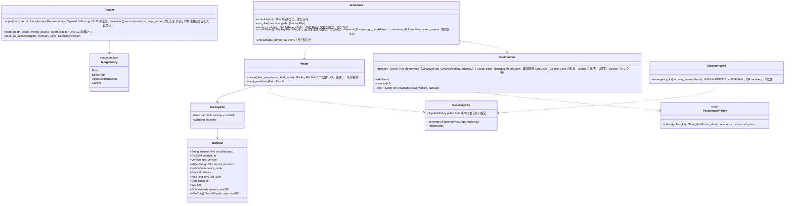

# core-backup（業務。控えの作成・戻し・置き場・自動の控え・緊急キット）

## 受ける節
- [第2章 7.3 複数の端末](../../../../docs/jp/design/02_基本設計書_署名の情報と照合.md#73-複数の端末)
- 第8章：[5.1 形式](../../../../docs/jp/design/08_基本設計書_リポジトリとデータ管理.md#51-形式)、[5.2 作り方](../../../../docs/jp/design/08_基本設計書_リポジトリとデータ管理.md#52-作り方)、[5.3 戻し方（取り込み）](../../../../docs/jp/design/08_基本設計書_リポジトリとデータ管理.md#53-戻し方取り込み)、[5.5 控えの置き場と自動の控え](../../../../docs/jp/design/08_基本設計書_リポジトリとデータ管理.md#55-控えの置き場と自動の控え)、[5.6 控えの置き方の案内](../../../../docs/jp/design/08_基本設計書_リポジトリとデータ管理.md#56-控えの置き方の案内)、[8 失敗の扱い](../../../../docs/jp/design/08_基本設計書_リポジトリとデータ管理.md#8-失敗の扱い)
- 読むだけ：第8章 2.1「配置」の「控えに含む」の列（何を入れるか）、5.4 の揃え方（統合は core-work の `Merge` と core-store の `Chain` による）。

## 依存
- 下：[core-common](core-common.md)（`Qr`・`AppUrl::Recovery`、`Clock`、エラー番号）、[core-store](core-store.md)（`Chain`（揃え・検証）、`AtomicFile`、ZIP の確かめ、`Space`、`Settings`（回復の鍵の公開鍵、最後の控えの日時、置き場）、`Retention::sweep_assets`）、[core-hash](core-hash.md)（SHA-256）、[core-identity](core-identity.md)（`current`、`export_keys`／`import_keys`、`os_user_verify`）、[core-render](core-render.md)（緊急キットの PDF/A-2u＋PDF/UA-1）、[core-work](core-work.md)（`Merge::merge_remote`（テンプレート・作業の統合）、`Templates::assets_gc_candidates`）、[core-sign](core-sign.md)（`Works`：原本の差分の見積もり）。
- 上：[app-client](app-client.md)（G-05、G-07 ホームの「最後のバックアップ」、G-20 設定、起動時の `run_due`、閉じる時）。`Device` の置き場は [core-sync](core-sync.md) の `backup_folder` を app-client がつなぐ（本ブロックは core-sync に依存しない）。
- 外部：OS の取り外せる媒体の検出と Cloud の同期フォルダーの既定の場所（第8章 5.5。OS の API を直接呼ぶのは本ブロック）。

## クラス図

## 橋（このブロックが所有する操作）
|番号|操作（上の図）|使う側|由来|
|---|---|---|---|
|B-240|`Writer::create`、`Scheduler::schedule`、`run_due`|app-client|第8章 5.2、5.5|
|B-241|`Reader::restore`|app-client|第8章 5.3|
|B-242|`Reader::open_as_successor`|app-client|第8章 5.3、第1章 13|
|B-243|`EmergencyKit::emergency_kit`|app-client|第8章 5.1|
|B-244|`Destinations`（`detect`・`add`・`remove`・`list`。最初の `add` で `RecoveryKey::generate`）|app-client|第8章 5.5、5.1|
|B-245|`PassphrasePolicy::check`|app-client|第8章 5.2|
|B-246|`Scheduler::verify_monthly`、`consolidate`|app-client|第8章 5.5、5.6|

## 算法（trait の後ろ）
|trait|実装|切り替え|由来|
|---|---|---|---|
|`PassphrasePolicy`|zxcvbn の方式、同梱の一覧（10万件）、長さ（15字。緊急キットを印刷した人は8字）|初期値の定数|第8章 5.2|
|控えの暗号|age（scrypt 2^18、回復の鍵の X25519 への暗号化と、秘密鍵を合言葉で包んだ添付）|固定|第8章 5.1|
|差分の選び方|前回の `manifest.json` 以後の新しい連鎖の行と新しい証拠・原本。Cloud の置き場は原本を除く|`Dest.kind`|第8章 5.5|

## データ設計
|記録・出力|形|欄|由来|
|---|---|---|---|
|`backup-<日時>-<seq>.nrsdbak`|age（外側）＋ZIP（`manifest.json`、`keys/`、`data/`）＋回復の鍵の秘密鍵を合言葉で包んだ添付|`Manifest` の欄|第8章 5.1、5.6|
|緊急キット|PDF/A-2u＋PDF/UA-1、1枚、3言語|第8章 5.1 の緊急キットの中身|第8章 5.1|
|設定（core-store の `Settings` に置く。端末に依らない）|—|回復の鍵の公開鍵、置き場の一覧、最後の控えの日時、最後に検証が通った日時（置き場ごと）|第8章 5.5、第10章 10|
|`state/backup-progress.json`（`nrsd.backup_progress/1`）|JSON|作成中の一時の名前、戻し中の一時の場所（中断の掃除に使う）|第8章 8、第1章 7.8|
