# core-case（業務。転載の登録、証拠の保全、事件記録と状況、証拠一式）

## 受ける節
- 第2章：[4.3 告知先アカウントの乗っ取り](../../../../docs/jp/design/02_基本設計書_署名の情報と照合.md#43-告知先アカウントの乗っ取り)、[4.4 権利者を装う者が現れた場合の手がかり](../../../../docs/jp/design/02_基本設計書_署名の情報と照合.md#44-権利者を装う者が現れた場合の手がかり)
- 第6章：[2.1 手順](../../../../docs/jp/design/06_基本設計書_登録と証拠保全.md#21-手順)、[2.2 スクリプトを実行しない取得](../../../../docs/jp/design/06_基本設計書_登録と証拠保全.md#22-スクリプトを実行しない取得)（2.2.1 WARC と WACZ、2.2.2 画面の画像と拡張の受け口）、[2.3 取っておくべき証拠の入力欄](../../../../docs/jp/design/06_基本設計書_登録と証拠保全.md#23-取っておくべき証拠の入力欄)、[2.4 登録データの項目](../../../../docs/jp/design/06_基本設計書_登録と証拠保全.md#24-登録データの項目)、[2.5 収集の記録](../../../../docs/jp/design/06_基本設計書_登録と証拠保全.md#25-収集の記録)、[2.6 第2段からの受け口](../../../../docs/jp/design/06_基本設計書_登録と証拠保全.md#26-第2段からの受け口)、[3.1 後日示すべき事項との対応](../../../../docs/jp/design/06_基本設計書_登録と証拠保全.md#31-後日示すべき事項との対応設計計画書-103)、[3.2 時刻証明](../../../../docs/jp/design/06_基本設計書_登録と証拠保全.md#32-時刻証明)、[3.3 取得の失敗](../../../../docs/jp/design/06_基本設計書_登録と証拠保全.md#33-取得の失敗)、[3.4 書き出し](../../../../docs/jp/design/06_基本設計書_登録と証拠保全.md#34-書き出し)、[4.1 一致度の示し方](../../../../docs/jp/design/06_基本設計書_登録と証拠保全.md#41-一致度の示し方)、[4.2 何に抵触しているか](../../../../docs/jp/design/06_基本設計書_登録と証拠保全.md#42-何に抵触しているか)、[5 誰が、どこで（④）](../../../../docs/jp/design/06_基本設計書_登録と証拠保全.md#5-誰がどこで④)、[6.1 状況の記録](../../../../docs/jp/design/06_基本設計書_登録と証拠保全.md#61-状況の記録)、[6.2 今の状態の確かめ](../../../../docs/jp/design/06_基本設計書_登録と証拠保全.md#62-今の状態の確かめ)、[7 訂正](../../../../docs/jp/design/06_基本設計書_登録と証拠保全.md#7-訂正)、[8 一覧と手段](../../../../docs/jp/design/06_基本設計書_登録と証拠保全.md#8-一覧と手段)
- [第7章 6.2 共同での対応と優先](../../../../docs/jp/design/07_基本設計書_法的対応ガイダンス.md#62-共同での対応と優先)（「優先」の印の付け方）
- 拡張 P-14（`extension/`）の出力の形は第6章 2.2.1・2.2.2。本ブロックはその取り込み側。

## 依存
- 下：[core-common](core-common.md)（URL の正規化、識別番号、`Clock`、エラー番号）、[core-store](core-store.md)（`Chain`、`AtomicFile`、ZIP の確かめ、ごみ箱、`Space`）、[core-net](core-net.md)（`Http::fetch`（`Target::RepostPage`、`Target::Rdap`。転送の各段は `Response.exchanges`）、`Dns::resolve`／`reverse`（B-045。生の応答）、`Scheduler`）、[core-hash](core-hash.md)（SHA-256、PDQ、ISCC）、[core-image](core-image.md)（取得した画像の読み込み、画面の画像の日時）、[core-identity](core-identity.md)（`with_signing_key`、告知コード）、[core-mark](core-mark.md)（透かしの読み出し）、[core-render](core-render.md)（報告書の PDF/A-3u、検証の手順書の文面の差し込み）、[core-rights](core-rights.md)（許可範囲の照らし合わせ：第5章 2.3 の規則）、[core-sign](core-sign.md)（`Inspector::inspect`、`Timestamps::timestamp`・`verify_tsr`・`ers_for`、`Works`）。
- 参照情報（窓口の一覧、プラットフォームの判定の表、RDAP のブートストラップ、`tsa.json`）は呼ぶ側が [core-ref](core-ref.md) から取って渡す（本ブロックは core-ref に依存しない。表の行の型と判定は core-common の B-007）。
- 上：[core-guidance](core-guidance.md)（`case`、`list`、`append_status`、`whois`、`deadlines`）、[app-client](app-client.md)、[core-backup](core-backup.md)（`cases/` の列挙）。
- 外部との境界：転載ページ（B-334）、RDAP・DNS（B-333）、TSA（B-332。core-sign 経由）、OS のごみ箱（B-338）、拡張（P-14。deep-link と保存のフォルダーの監視は app-client が受け、`import_capture` に渡す）。

## クラス図

```mermaid
classDiagram
  class Case {
    +CaseId id
    +Source source  %% Manual | Auto
    +Urls urls  %% input, normalized, final
    +Platform platform
    +[WorkRef] work_refs
    +[Evidence] evidence
    +Option~Whois~ whois
    +UserNotes user_notes
    +Option~RightsRef~ rights_ref
    +[Violation] violations
    +Signer signer
    +Rfc3339 created_at
    +ClockStamp clock
    +ChainLink chain
    +Collection collection  %% 2.5 の用紙
    +bool page_capture_declined
  }
  class Evidence {
    +String original_name  %% 一覧にだけ
    +EvidenceKind kind  %% Warc | Wacz | Screenshot | Image | RdapWarc
    +Hash sha256
    +u64 size
    +Provenance provenance  %% UserProvided | AppFetched | Extension
    +Rfc3339 taken_at
    +Option~DateSource~ date_source  %% Exif | FileMtime | None。登録の日時と24時間以上違えば確かめを求める（2.2.2）
    +bool truncated  %% 50MB で打ち切った（3.3）
  }
  class Input {
    +String url
    +Option~ImageInput~ image  %% File(path) | Url（取得は段6）
    +Option~Path~ screenshot
    +Option~Path~ wacz
    +bool capture_page  %% 既定 真
    +UserNotes notes
    +TsaChoice tsa  %% Free | Paid(id)
    +Rfc3339 screen_opened_at  %% 収集の開始（2.5）
  }
  class UserNotes {
    +Option~String~ account  %% 転載者のアカウント名・表示名
    +Option~String~ posted_at_shown
    +Option~String~ counts  %% 閲覧数・いいね等
    +[CommercialKind] commercial  %% PaidDistribution | Advertising | Merchandise | AiTraining | NoneOrUnknown
    +[Url] other_posts
    +Option~String~ free_text
  }
  class Collection {
    +String collector_handle
    +NoticeCode collector_code
    +Rfc3339 started_at
    +Rfc3339 finished_at
    +[Url] target_urls
    +[IpAddr] server_ips
    +[(String, Hash)] evidence_hashes
    +Hash evidence_hashes_sha256  %% 時刻証明の対象
    +String app_version
    +String tool_version
    +Option~Duration~ clock_skew
    +Option~ExtensionInfo~ extension  %% 版、ブラウザの名前と版、記録した日時
  }
  class FetchOutcome {
    <<enumeration>>
    Ok Gone LoginRedirect Unreachable TooLarge  %% 第6章 3.3 の表
  }
  class StatusRow {
    +StatusKind kind  %% registered filed response removed reposted checked timestamped withdrawn
    +Rfc3339 at
    +Option~Filing~ filing  %% 窓口、方法、受付の番号、立場、写しの SHA-256
    +Option~CheckResult~ check  %% HTTP の状態、本文のハッシュ、画像の有無、WARC の SHA-256
    +Option~[TsResponse]~ timestamps
    +Option~WithdrawReason~ reason
    +ChainLink chain
  }
  class Registrar {
    +register(input: Input, refs: CaseRefs) Result~Case, Event~  %% 段6。段ごとに state/ に印。evidence_size を取得の前（見積もり）と後（実測）に確かめ、1GB を超えれば断る
    +CaseRefs refs  %% platforms、rdap_bootstrap、tsa（core-ref の型を知らない）
    +normalize_and_hint(url, platforms) Hint
    +resume_pending() [Case]
    +accept_auto(registration) Result~Case~
    +search_urls(work) [Url]
  }
  class Capture {
    +fetch_page(url) (WarcFile, FetchOutcome)  %% 2.2：GET、html5ever で og:image と img（srcset の最大）上位5、転送の各段を request/response に
    +import_capture(path) Captured  %% .wacz の確かめ、compat.yaml、ハッシュ、署名と timeSignature
    +screenshot_date(path) (Rfc3339, DateSource)
  }
  class WarcWriter {
    +begin(path) WarcWriter
    +warcinfo(software)
    +request(req)
    +response(resp)
    +metadata(fields)
    +resource(uri, bytes)
    +finish() Hash
  }
  class Wacz {
    +pack(warcs, pages, screenshots) WaczFile
    +unpack(path, limits) Unpacked
    +sign(datapackage_digest, signer, ts) 
    +verify(path) Verified
  }
  class Matcher {
    +match_image(path, works) MatchResult  %% 透かし → PDQ → ISCC。4.1 の6段
    +clues(path) Clues  %% 第2章 4.4 の5つ
    +violations(work, notes, rights) [Violation]
  }
  class Whois {
    +lookup(final_url, bootstrap) WhoisResult  %% DNS、RDAP（IP とドメイン）、逆引き、ICP
  }
  class Status {
    +append_status(id, row: StatusRow, filing_copy: Option~String~)
    +check_now(id) StatusRow  %% 6.2
    +withdraw(id, reason) RetentionNotice
    +deadlines(id, rules) [VTodo]
    +ics(id) Bytes
  }
  class Bundle {
    +export_bundle(id, user_fields, include_clues) Path  %% BagIt、ZIP、報告書 TXT と PDF/A-3u、手順書、ERS
  }
  class Cases {
    +case(id) Case
    +list(filter) [DomainSummary]  %% ドメインごと、件数、最初・最後、状況、優先の印
    +verify_evidence_files() [Missing]
    +evidence_size(id) u64  %% 1GB の上限
  }
  Registrar --> Case
  Registrar ..> Capture
  Registrar ..> Matcher
  Registrar ..> Whois
  Registrar ..> Status
  Capture ..> WarcWriter
  Capture ..> Wacz
  Status --> StatusRow
  Bundle ..> Cases
  Cases --> Case
  Case --> Evidence
  Case --> Collection
  Registrar ..> Input
  Input --> UserNotes
  Capture --> FetchOutcome
```

## 橋（このブロックが所有する操作）
|番号|操作（上の図）|使う側|由来|
|---|---|---|---|
|B-180|`Registrar::register`|app-client|第6章 2.1、2.4|
|B-181|`Registrar::normalize_and_hint`|app-client|第6章 2.1、第2章 2.3|
|B-182|`Capture::import_capture`|app-client|第6章 2.2.2、第1章 4.1|
|B-183|`Matcher::match_image`|app-client|第6章 4.1|
|B-184|`Cases::case`、`list`|app-client・guidance|第6章 8、第10章 G-15|
|B-185|`Status::check_now`|app-client|第6章 6.2|
|B-186|`Status::append_status`|app-client・guidance|第6章 6.1、第7章 6.1|
|B-187|`Status::withdraw`（返す `RetentionNotice` を ui が示す）|app-client|第6章 7|
|B-188|`Bundle::export_bundle`|app-client|第6章 3.4|
|B-189|`Matcher::clues`|app-client|第2章 4.4|
|B-190|`Status::deadlines`、`ics`|app-client|第6章 6.1、第7章 6.3|
|B-191|`Registrar::accept_auto`|app-client|第6章 2.6|
|B-192|`Registrar::search_urls`|app-client|第6章 2.1、第10章 G-12|
|B-193|`Whois::lookup`|guidance|第6章 5、第7章 5|
|B-194|`Registrar::resume_pending`|app-client|第1章 7.8、第6章 2.1|
|B-195|`Cases::verify_evidence_files`|app-client|第8章 4、第6章 7|

## 算法（trait の後ろ）
|trait|実装|切り替え|由来|
|---|---|---|---|
|`MatchLevel`（一致度の段）|透かし → PDQ 0〜15 → 16〜31 → ISCC → 他人の番号 → 確認できない|しきい値は初期値の定数|第6章 4.1|
|`ImagePicker`（取得する画像の選び方）|`og:image` と ``（`srcset` の最大）を大きさの順に5件|定数|第6章 2.2|
|`WorkRefOrder`|透かしの一致 → PDQ の距離 → 新しい順、原本の SHA-256 で束ねる|固定|第6章 4.1|

## データ設計（このブロックが形を持つ記録と出力）
|記録|形|欄|由来|
|---|---|---|---|
|`cases/<事件の番号>/case.json`＋`.sig`（`nrsd.case/1`。連鎖）|JSON|第6章 2.4 の表（`Case`）、2.5 の収集の記録|第6章 2.4、2.5|
|`cases/<事件の番号>/status/<端末の番号>.jsonl`＋`.sig`（`nrsd.status/1`。連鎖）|JSON Lines|第6章 6.1（`StatusRow`。時刻証明の応答もここ）|第6章 6.1、3.2|
|`cases/<事件の番号>/evidence/<SHA-256>.<拡張子>`|ファイル|WARC（`capture-<連番>.warc.gz`）、WACZ、画面の画像、取得した画像|第6章 2.4、2.2.1|
|`cases/<事件の番号>/filings/<UUID v7>.txt`|TXT|申立ての写し（`[REDACTED]` 済み）|第6章 6.1|
|`state/case-<事件の番号>.json`（`nrsd.case_progress/1`）|JSON|段6の済んだ段の印（保全、記録、保存、時刻証明）|第6章 2.1、第1章 7.8|
|出力：証拠一式|`evidence-<事件の番号>-<日時>.zip`（BagIt。`data/`、`manifest-sha256.txt`、`bag-info.txt`、`tagmanifest-sha256.txt`）|第6章 3.4 の中身|第6章 3.4|
|出力：`.ics`|VTODO|期限（第7章 6.3）|第6章 6.1|
- `Whois` は `case.json` の `whois` 欄に入れ、生の要求と応答は WARC の `RdapWarc` として `evidence/` に置く（第6章 5）。
