# core-common（基盤）

## 受ける節
- [第1章 8.2 識別子の体系](../../../../docs/jp/design/01_基本設計書_全体構成.md#82-識別子の体系)、[8.6 多言語のファイル名と文字](../../../../docs/jp/design/01_基本設計書_全体構成.md#86-多言語のファイル名と文字)、[10.3 エラー](../../../../docs/jp/design/01_基本設計書_全体構成.md#103-エラー)、[10.4 操作の記録（ログ）](../../../../docs/jp/design/01_基本設計書_全体構成.md#104-操作の記録ログ)、[10.5 並行処理](../../../../docs/jp/design/01_基本設計書_全体構成.md#105-並行処理)、[10.7 時刻](../../../../docs/jp/design/01_基本設計書_全体構成.md#107-時刻)、[10.10 URL と QR の形](../../../../docs/jp/design/01_基本設計書_全体構成.md#1010-url-と-qr-の形)
- [第2章 2.4 告知コードの作り方](../../../../docs/jp/design/02_基本設計書_署名の情報と照合.md#24-告知コードの作り方)
- 役割と外部の部品：[第11章 7.1](../../../../docs/jp/design/11_基本設計書_開発基盤.md#71-rust-の部品の分け方)

## 依存
- 下：なし。上：全ブロックが依存する。tauri に依存しない。

## クラス図

```mermaid
classDiagram
  class WorkId {
    +u64 bits61
    +from_bits(u64) WorkId
    +parse(text) Result~WorkId, Fault~
    +display() String  %% 5-5-3 の13文字。CRC-4 を下位に
    +to_bits() u64
  }
  class NoticeCode {
    +from_spki_der(bytes) NoticeCode  %% 第2章 2.4
    +parse(text) Result~NoticeCode, Fault~
    +display() String  %% NRSD-XXXXX-XXXXX-XXXXX-XXXXX
  }
  class DeviceId {
    +from_pubkey(Ed25519) DeviceId  %% SHA-256 の先頭40ビット、Base32 8文字
    +display() String
  }
  class Base32 {
    <<module>>
    +encode(bits) String
    +decode(text) Result~bits, Fault~  %% I・L→1、O→0、小文字→大文字
  }
  class Crc4 {
    <<module>>
    +g704(bits61) u4
  }
  class Category {
    <<enumeration>>
    IMG SIG TSA NET STO REF UPD CAS BAK INP SYN AUT
  }
  class Event {
    +Category category
    +u16 number  %% 正常系の事象（台帳の「正常系」の行）
    +Vec~Arg~ args  %% 文言の差し込みの値。文は画面が当てる
    +key() String  %% err.NNN.what / .safe / .next
  }
  class Fault {
    +Category category
    +u16 number  %% 異常検出（台帳の「異常検出」の行。未登録は NNN-000 と検出した場所）
    +String detail  %% 記録にだけ書く
    +raise() Fault  %% 記録に書き、CrashReport::request（子プロセスに minidump を頼む）。原本と記録を守る側に倒すのは呼ぶ側
  }
  class ClockStamp {
    +Rfc3339 wall
    +Option~Duration~ skew
    +u64 mono
    +bool estimated
    +bool jumped  %% 「時計が変わった」印
  }
  class Clock {
    +init(state_dir)  %% clock.json と seq の置き場。app-client が渡す
    +now_utc() Rfc3339
    +now_estimated() Estimated  %% ずれで補正。印つき
    +stamp() ClockStamp  %% 記録の行に入れる値（core-store の Row、第6章 2.4 の clock）
    +set_skew(sample: Duration)  %% TSA の genTime − 要求の時刻。直近10回、state/clock.json
    +monotonic_seq() u64
    +detect_jump() Option~Jump~  %% 壁の時計の巻き戻り・飛び
    +check_wall(last_record_at: Rfc3339) Option~Fault~  %% ビルドの日時より前、前回の記録より前は異常
  }
  class SkewEstimator {
    <<trait>>
    +estimate(samples: [Duration]) Duration
  }
  class UrlKind {
    <<enumeration>>
    Account  %% 問い合わせと断片を除く
    Repost  %% 入力のままを残し、ClearURLs の規則で正規の形
    Venue  %% 窓口の URL
  }
  class UrlNormalizer {
    <<trait>>
    +normalize(input, kind: UrlKind, rules: TrackingRules) Result~NormalizedUrl, Event~  %% 短縮 URL は展開しない
  }
  class NormalizedUrl {
    +String canonical
    +String as_entered
    +String host_punycode
    +String host_unicode
    +String path
    +bool mixed_script  %% UTS #39。表示に注意を添える
  }
  class PlatformRule {
    +PlatformId id
    +[HostPattern] hosts
    +[PathPattern] paths  %% 投稿・プロフィールの経路の型（第7章 2.1 の行）
  }
  class Platforms {
    <<module>>
    +detect(url: NormalizedUrl, table: [PlatformRule]) Option~(PlatformId, PathKind)~  %% 当たらなければ一般のサイト。表は呼ぶ側が渡す
  }
  class AppUrl {
    <<enumeration>>
    Import(path)  %% OS の URL の方式だけ。QR には載せない
    Contact(code, root_hash, dev_pub)
    Link(dev_pub, nonce16)
    Recovery(age_key)
    +parse(text) Result~AppUrl, Event~  %% 方式・種類・値の形を確かめる
    +to_url() String  %% c2pa4cosplayer://<種類>?<名前>=<値>
  }
  class Qr {
    <<module>>
    +encode(AppUrl) Png  %% ISO/IEC 18004、誤り訂正 M、バイトモード。Import は拒む
    +decode(pixels: Pixels8) Result~AppUrl, Event~  %% 画像の読み込みと上限（10.6）は呼ぶ側が core-image で
  }
  class Pixels8 {
    +u32 width
    +u32 height
    +Bytes rgb  %% RGB 8ビット、行の順。画素の面の共通の型（core-hash・core-mark が受ける。core-image の Image が作る）
  }
  class Progress {
    +u32 done
    +u32 total
    +Option~Seconds~ eta
  }
  class Cancel {
    +is_requested() bool
    +request()
  }
  class CrashReport {
    +init(handler: ChildProcess)  %% app-client が --crash-handler の子プロセスを起動して渡す
    +request(extra: CrashExtra) Path  %% 異常検出の時に子プロセスへ要求
    +on_crash(extra)  %% OS の例外。子プロセスが書く
    +pending() [Report]
    +discard(id)
    +keep(id)
    +set_last_operation(kind)  %% 直前の操作の種類
  }
  class CrashExtra {
    +String app_version
    +String os
    +Option~String~ error_number  %% 未登録は NNN-000 と検出した場所
    +String last_operation_kind
  }
  class Secret~T~ {
    +expose() &T  %% zeroize。Debug・ログに出ない
  }
  class Logging {
    <<module>>
    +init_logging(dir)  %% tracing の JSON Lines、英語、info。NRSD_LOG=debug。10MB で切り替え、合計50MB
    +recent_errors(n) [String]  %% 新しい方から10件（初期値）
    +path_for_log(path) String  %% ファイル名だけ
    +url_for_log(url) String  %% 問い合わせの部分を落とす
  }
  class Text {
    <<module>>
    +text(key, args, lang) String  %% 文言ファイルの core.<ブロック>.<名前>（第10章 5）。formatjs_icu_messageformat
  }
  class Ids {
    <<module>>
    +new_id_v7() Uuid
    +case_id() String
    +sanitize_filename(name) String
  }
  WorkId ..> Base32
  WorkId ..> Crc4
  NoticeCode ..> Base32
  DeviceId ..> Base32
  Clock ..> SkewEstimator
  Clock --> ClockStamp
  Qr ..> AppUrl
  Platforms ..> PlatformRule
  UrlNormalizer ..> UrlKind
  Event ..> Category
  Fault ..> Category
  Fault ..> CrashReport
```

## 橋（このブロックが所有する操作。番号は境界の通し番号）
|番号|操作（上の図）|使う側|由来|
|---|---|---|---|
|B-001|`Event`・`Fault`・`Category`|全部|第1章 10.3|
|B-002|`Logging`、`Secret<T>`|全部|第1章 10.4|
|B-004|`WorkId`、`Base32`|sign・identity・mark・app-client|第1章 8.2、第2章 2.4|
|B-005|`NoticeCode`|identity・sign・sync|第2章 2.4|
|B-006|`Clock`、`ClockStamp`（記録の行の `clock`）|全部|第1章 10.7|
|B-007|`UrlNormalizer`（`UrlKind` と規則は使う側が渡す）、`Platforms::detect`、`PlatformRule`（`platforms.json` の行の形。core-ref が読んでこの型にする）|identity・case・ref|第1章 10.10、第7章 2.1|
|B-008|`Ids::new_id_v7`、`case_id`|store・case・work・identity|第1章 8.2|
|B-009|`Text::text`（差し込みの規則 `{name}`・`{{ }}` を含む）|rights・case・backup・sign・guidance|第1章 10.3|
|B-010|`CrashReport`|app-client|第1章 10.3、第10章 9|
|B-011|`Ids::sanitize_filename`|sign・work・store|第1章 8.6|
|B-012|`Progress`、`Cancel`|全部|第1章 10.5|
|B-013|`Qr`、`AppUrl`（QR の中身と OS の URL の方式の4種）|backup・sync・app-client|第1章 10.10|
|B-014|`Pixels8`（画素の面の共通の型。core-hash・core-mark は core-image に依存せずこれを受ける）|hash・mark・image|第3章 5、6|
- `DeviceId` の値は core-identity が端末の鍵から作る（B-023）。本ブロックは形と表示だけ。
- `Ids::sanitize_filename` は NFC に正規化してから OS で使えない文字を `_` にする（第1章 8.6）。出力の名前の規則（第3章 10.1）は core-sign の `NameSanitizer` が上に重ねる。
- `CrashReport` の子プロセス（`--crash-handler`）は app-client が起動の最初に立て、`init` に渡す（第1章 10.3）。
- 本ブロックは置き場（第1章 9.1）を知らない（core-store が上にある）。`Logging::init_logging(dir)`、`CrashReport::init`、`Clock::init(state_dir)`（`state/clock.json`・`state/seq`）の置き場は app-client が core-store の `Paths` から渡す。

## 算法（trait の後ろ。選択は `algo.rs` の1か所）
|trait|実装|切り替え|由来|
|---|---|---|---|
|`SkewEstimator`|中央値、外れ値の除外|固定|第1章 10.7|
|`UrlNormalizer`|WHATWG URL、UTS #46、ClearURLs の規則|規則は参照情報|第1章 10.10|

## データ設計（このブロックが書く記録）
|記録|置き場|形|欄の定義|
|---|---|---|---|
|操作の記録（ログ）|記録の場所の `logs/`（10MB で切り替え、合計50MB。90日の削除は core-store の `Retention::sweep`）|JSON Lines（tracing）|[第1章 10.4](../../../../docs/jp/design/01_基本設計書_全体構成.md#104-操作の記録ログ)|
|落ちた時の報告|`crashes/<UUID v7>/`：`minidump.dmp`、`extra.json`（`CrashExtra` の4欄）|Breakpad と同じ形|[第1章 10.3](../../../../docs/jp/design/01_基本設計書_全体構成.md#103-エラー)|
|時計のずれの標本|`state/clock.json`：`samples[]`（`requested_at`、`gen_time`、`tsa`）|JSON|[第1章 10.7](../../../../docs/jp/design/01_基本設計書_全体構成.md#107-時刻)、[第8章 2.1](../../../../docs/jp/design/08_基本設計書_リポジトリとデータ管理.md#21-配置)|
|エラーの台帳（型の生成元）|`dev/errors.yaml`（P-13）。`Category` と番号はビルド時にここから生成|YAML|第1章 10.3（上の行と同じ節）|
- 記録の中の値の形：識別番号は13文字の表示、告知コードは28文字、端末の番号は8文字、時刻は RFC 3339 UTC（推定の時刻は `estimated: true` の印）。
