# core-guidance（業務。窓口の候補、申立ての下書き、期限、各国法の参照先、運営者の特定の手順）

## 受ける節
- 第7章：[3.1 ひな形の種類](../../../../docs/jp/design/07_基本設計書_法的対応ガイダンス.md#31-ひな形の種類)、[3.2 個人情報が相手に渡ることの案内](../../../../docs/jp/design/07_基本設計書_法的対応ガイダンス.md#32-個人情報が相手に渡ることの案内)、[3.3 ひな形の中身](../../../../docs/jp/design/07_基本設計書_法的対応ガイダンス.md#33-ひな形の中身)（3.3.4 肖像・プライバシー、3.3.5 ホスティング・CDN）、[3.4 申し出る者の立場](../../../../docs/jp/design/07_基本設計書_法的対応ガイダンス.md#34-申し出る者の立場)、[5 運営者の特定](../../../../docs/jp/design/07_基本設計書_法的対応ガイダンス.md#5-運営者の特定)、[6.3 手続の期限の表示](../../../../docs/jp/design/07_基本設計書_法的対応ガイダンス.md#63-手続の期限の表示)
- [第12章 3.2 利用者の任意（本システムは案内のみ）](../../../../docs/jp/design/12_基本設計書_法務との接点.md#32-利用者の任意本システムは案内のみ)
- 読むだけの節（所有は参照情報 P-7）：第7章 2.1「初版の窓口の一覧」、3.3.1〜3.3.3（ひな形の本文）、4「各国法の参照先」。形は第8章 3.4 の `platforms.json`・`templates/`・`laws.json`・`deadlines.json`・`holidays.json`。

## 依存
- 下：[core-common](core-common.md)（差し込みの規則 `{field}`、`Clock`、言語）、[core-ref](core-ref.md)（`Reference::current()` から上の各ファイル）、[core-case](core-case.md)（`Cases::case`、`Status::append_status`、`Whois::lookup` の結果）。
- 上：[app-client](app-client.md)。画面は G-16（事件の詳細）、G-17（対処の案内）、G-24（手がかりの比較。事件が無い時の `options`）。
- 利用者が入れる欄（氏名、住所、電話、電子メール、元の投稿の URL、署名）は本ブロックを通るだけで、どの記録にも書かない（第7章 3.1）。保存するのは core-case の申立ての写し（`[REDACTED]` 済み。第6章 6.1）だけ。

## クラス図

```mermaid
classDiagram
  class Venue {
    +VenueId id
    +String name
    +VenueKind kind  %% Platform | Cdn | Hosting | Generic
    +NoticeType notice  %% Copyright | Portrait
    +Country country
    +Method method  %% WebForm(url) | Email(addr)
    +bool jp_article22  %% 第22条の方法による窓口
    +String note
    +[Url] sources
  }
  class Venues {
    +options(case: Option~Case~, platforms, whois) [Venue]  %% 無ければ一般の手段
  }
  class Standing {
    <<enumeration>>
    CopyrightHolder
    Subject
    Authorized
  }
  class Drafter {
    +templates(kind, lang) Template  %% 前書き（kind, standing, venue_kinds, version, reviewed_*）
    +draft(case, venue, standing, user_fields) Draft
    +consent_texts(venue, standing) [String]  %% 3.2 の個人情報の案内と 3.2.1 の立場ごとの確認の文
  }
  class Field {
    +String name
    +FieldKind kind  %% Text | Choice(options)（様式Ａの「侵害されたとする権利」は選択。既定は公衆送信権）
    +bool required
  }
  class Draft {
    +String text  %% 窓口の国の言語
    +String translation  %% 画面の言語の参考の訳
    +[Warning] warnings  %% 照合が弱い（4.1 の3つの結果）、立場と種類の不一致、代理の資料
    +[String] consent_texts
    +[Field] user_fields  %% 空けた欄
    +[AttachmentHint] attachments  %% 添える証拠（第6章 3.4 の中身から）と、著作権者等であることの確認の資料（3.3.3 の表）
    +String redacted_copy  %% 利用者の欄を [REDACTED] にした写し（core-case の filings/ 用）
  }
  class DeadlineCalendar {
    <<trait>>
    +due(trigger_at, rule, holidays) Date
  }
  class Deadlines {
    +deadlines(case, filing, rules, holidays) [Deadline]
    +ics(case) Bytes
    +alarms_due(now, cases) [Deadline]  %% 3日前・当日
  }
  class Deadline {
    +DeadlineId id
    +Date due
    +String basis
    +Text text
    +Trigger trigger
    +Text overdue_advice  %% 過ぎた時の対応（事業者への問い合わせ、専門家への相談。6.3）
  }
  class LawRefs {
    +references(country, laws) [LawRef]
    +further_steps(country) [Registration]  %% 第12章 3.2 の表
  }
  class OperatorSteps {
    +operator_steps(whois) [Step]  %% 第7章 5 の表：CDN、ICP、断念
  }
  Venues --> Venue
  Drafter --> Draft
  Drafter ..> Standing
  Deadlines --> Deadline
  Draft --> Field
  Deadlines ..> DeadlineCalendar
```

## 橋（このブロックが所有する操作）
|番号|操作（上の図）|使う側|由来|
|---|---|---|---|
|B-200|`Venues::options`|app-client|第7章 2、5|
|B-201|`Drafter::draft`（`consent_texts` を含む `Draft`）|app-client|第7章 3|
|B-202|`Deadlines::deadlines`、`ics`、`alarms_due`|app-client|第7章 6.3|
|B-203|`LawRefs::references`、`further_steps`|app-client|第7章 4、第12章 3.2|
|B-204|`OperatorSteps::operator_steps`|app-client|第7章 5|

## 算法（trait の後ろ）
|trait|実装|切り替え|由来|
|---|---|---|---|
|`DeadlineCalendar`|暦日は日数を足す。営業日は土日と `holidays.json` の国の祝日を除いて数える|`deadlines.json` の `unit`|第7章 6.3|
|ひな形の選び方|立場 × 窓口の種類 × 国 → `templates/<種類>.<言語>.md`（被写体は `portrait`、CDN・ホスティングは `hosting`、第22条の窓口は `jp_form_a`）|参照情報の前書き `standing`・`venue_kinds`|第7章 3.1、3.4|

## データ設計
- 本ブロックは端末に記録を持たない。読む形は参照情報（第8章 3.4）、書く先は core-case の状況の追記（B-186）だけ。
|出力|形|欄|由来|
|---|---|---|---|
|申立ての文面|TXT（原文と参考の訳）|ひな形の欄を埋めたもの。アプリに保存しない|第7章 3.3|
|`.ics`|iCalendar（RFC 5545）|第7章 6.3 の VTODO と VALARM|第7章 6.3|
