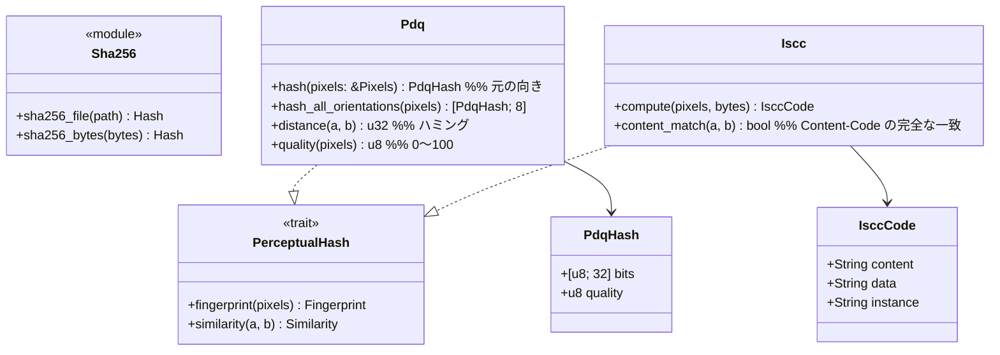

# core-hash（業務）

## 受ける節
- [第3章 6 照合用ハッシュ](../../../../docs/jp/design/03_基本設計書_署名処理.md#6-照合用ハッシュ)（PDQ、ISCC、距離の目安、8方向、画質の点）
- 役割と外部の部品：[第11章 7.1](../../../../docs/jp/design/11_基本設計書_開発基盤.md#71-rust-の部品の分け方)

## 依存
- 下：[core-common](core-common.md)。

## クラス図

## 橋（このブロックが所有する操作）
|番号|操作（上の図）|使う側|由来|
|---|---|---|---|
|B-050|`Sha256`|sign・case・work・backup・rights・image・app-client（SHA256SUMS）|第3章 2|
|B-051|`Pdq`|sign・case|第3章 6、第6章 4|
|B-052|`Iscc`|sign・case|第3章 6|
- しきい値（距離15・31、画質50）は本ブロックが持たない。判定は core-case の `MatchPolicy`。
- `Pixels` は core-common の `Pixels8`（B-014）。core-image の `Image` から作り、呼ぶ側が渡す（core-hash は core-image に依存しない）。

## 算法（trait の後ろ）
|trait|実装|切り替え|由来|
|---|---|---|---|
|`PerceptualHash`|PDQ（pdqhash。本家の試験値と一致しなければ pdq-rs）、ISCC（iscc-lib）|両方を常に計算|第3章 6、第11章 DD-11-4|

## データ設計
- 本ブロックは記録を書かない。値の形：PDQ は256ビット（16進64文字）と画質の点、ISCC は ISO 24138 の文字列3つ。記録先は作品データ（第3章 7.2。core-sign の頁）と事件記録（第6章 2.4。core-case の頁）。
