# core-identity（業務。署名の情報、証明書、鍵保管、告知コード、書類）

## 受ける節
- [第2章 2.3 入力の確かめ](../../../../docs/jp/design/02_基本設計書_署名の情報と照合.md#23-入力の確かめ)、[3.1 構成](../../../../docs/jp/design/02_基本設計書_署名の情報と照合.md#31-構成)、[3.2 署名用の証明書の要件](../../../../docs/jp/design/02_基本設計書_署名の情報と照合.md#32-署名用の証明書の要件c2pa-の仕様)、[3.4 期限と入力の誤り](../../../../docs/jp/design/02_基本設計書_署名の情報と照合.md#34-期限と入力の誤り)、[3.5 各項目](../../../../docs/jp/design/02_基本設計書_署名の情報と照合.md#35-各項目)、[3.6 過去の個人のルート](../../../../docs/jp/design/02_基本設計書_署名の情報と照合.md#36-過去の個人のルート)、[4.1 告知先アカウントとの照合](../../../../docs/jp/design/02_基本設計書_署名の情報と照合.md#41-告知先アカウントとの照合)、[5.1 承認書](../../../../docs/jp/design/02_基本設計書_署名の情報と照合.md#51-承認書)、[5.2 共同の権利](../../../../docs/jp/design/02_基本設計書_署名の情報と照合.md#52-共同の権利撮影者とコスプレイヤー)、[5.3 書類の形式](../../../../docs/jp/design/02_基本設計書_署名の情報と照合.md#53-書類の形式)、[5.4 書類の確かめ](../../../../docs/jp/design/02_基本設計書_署名の情報と照合.md#54-書類の確かめ)、[6 権利者情報](../../../../docs/jp/design/02_基本設計書_署名の情報と照合.md#6-権利者情報)、[7.1 生成と保管](../../../../docs/jp/design/02_基本設計書_署名の情報と照合.md#71-生成と保管)、[7.2 紛失・漏れ](../../../../docs/jp/design/02_基本設計書_署名の情報と照合.md#72-紛失漏れ)、[7.4 アプリの利用の時の認証](../../../../docs/jp/design/02_基本設計書_署名の情報と照合.md#74-アプリの利用の時の認証)、[7.5 OS ごとの保管の方式](../../../../docs/jp/design/02_基本設計書_署名の情報と照合.md#75-os-ごとの保管の方式)、[7.6 使う時の扱い](../../../../docs/jp/design/02_基本設計書_署名の情報と照合.md#76-使う時の扱い)、[8 失敗の扱い](../../../../docs/jp/design/02_基本設計書_署名の情報と照合.md#8-失敗の扱い)
- 役割と外部の部品：[第11章 7.1](../../../../docs/jp/design/11_基本設計書_開発基盤.md#71-rust-の部品の分け方)

## 依存
- 下：[core-common](core-common.md)（`NoticeCode`、`WorkId`、`UrlNormalizer`、`Platforms::detect`、`PlatformRule`、`Ids`）、[core-store](core-store.md)（`Chain`、`AtomicFile`、`Paths`、`Schema`）。
- 依存の逆転：core-store の `RecordSigner` を本ブロックが実装して渡す（`sign` は署名用の証明書の鍵、`own_roots` は今と過去の個人のルート、`device_id` は端末の鍵から）。
- core-ref に依存しない：投稿先の判定の表は呼ぶ側（app-client）が B-221 から渡す。
- 外部との境界 B-337（OS の鍵保管、OS の本人の確かめ）。

## クラス図

```mermaid
classDiagram
  class Input {
    +String handle
    +Role role
    +[String] accounts
  }
  class Normalized {
    +String handle
    +Role role
    +[NormalizedUrl] accounts
  }
  class FieldError {
    +Field field
    +Event reason
  }
  class Validator {
    +validate_input(input, platforms: [PlatformRule]) Result~Normalized, [FieldError]~  %% 判定は core-common の Platforms::detect
    +skeleton(name) String
    +restriction_level(name) Level
  }
  class Draft {
    +draft_save(input)
    +draft_load() Option~Input~
  }
  class Identity {
    +CertChain cert_chain
    +NoticeCode notice_code
    +String handle
    +Role role
    +[NormalizedUrl] accounts
    +Serial signing_serial
  }
  class IdentityStore {
    +current() Identity
    +create(n: Normalized) Identity
    +update_profile(n: Normalized) Identity
    +rotate_root(reason: RotateReason) HistoryRow
    +history() [Change]
    +expiry_status() ExpiryStatus  %% epoch.json（初めて時刻証明を得た日、無ければ作った日）から19年・20年
    +set_epoch(first_timestamp: Date)  %% 初回だけ。extend_root（notAfter を40年後に）→ 署名用の証明書も同じ鍵で作り直す → 履歴に cert の行（第2章 3.1）
  }
  class RotateReason {
    <<enumeration>>
    TwentyYears LostWithoutBackup SuspectedLeak
  }
  class ExpiryStatus {
    <<enumeration>>
    Ok Warn19 Stop20
  }
  class CertBuilder {
    +root(handle, not_after) Cert  %% 第2章 3.5：自己署名、cA 真・経路0、keyCertSign、SKI は公開鍵の SHA-1、通し番号は128ビットの乱数、notBefore 2020-01-01、2050年以降は GeneralizedTime
    +signing(root, handle, accounts: [Url]) Cert  %% cA 偽、digitalSignature、EKU c2pa-kp-claimSigning + id-kp-documentSigning、SAN は入力の順の URI、AKI は root の SKI
    +extend_root(root, new_not_after) Cert
  }
  class PastRoots {
    +is_own_root(cert) Option~Period~
    +past_roots() [PastRoot]
    +add_past_root(cert, period, reason, provenance: Provenance)
  }
  class PastRoot {
    +Cert cert
    +NoticeCode notice_code
    +Period period
    +RotateReason reason
    +bool suspected_leak
    +bool unverifiable
  }
  class Keystore {
    +status() KeystoreStatus
    +unlock(passphrase)
    +with_signing_key(reason, f)
    +begin_batch()
    +end_batch()
    +export_keys() Secret~Pkcs8~
    +import_keys(Secret~Pkcs8~)
    +device_key() Ed25519
    +device_id() DeviceId
    +set_secret(name, Secret)
    +get_secret(name) Secret
    +delete_secret(name)
    +wipe_keys()
  }
  class OsAuth {
    +os_user_verify(reason) bool  %% LAContext.evaluatePolicy / IUserConsentVerifierInterop / polkit。設定（G-20）で切れる。OS が対応しなければ真。自動の処理は呼ばない（第2章 7.4）
  }
  class Grants {
    +create_grant(to: NoticeCode, scope, term, text) Document  %% 期限の既定90日、文は500文字まで
    +create_revoke(target_id) Document
    +co_rights_draft(...) Document
    +co_rights_countersign(doc) Document
    +import(bytes) ImportResult  %% 第2章 5.4 の5つの確かめ。結果と日時を approvals/<端末>.jsonl に
    +list() [Document]
    +renewals_due() [Document]  %% 期限の30日前
    +auto_renew() [Document]  %% 30日前に renews つきの新しい承認書を自動で作る（第2章 5.1）。送るのは app-client が core-sync で
    +active_for(root_fp, shoot, date) [Document]  %% 撮影の名前は NFC・前後の空白を除き大文字小文字を区別しない完全一致、期限は暦の日で両端を含む（第2章 5.3）
    +is_revoked(grant_id) bool
    +by_hash(sha256) Option~Document~  %% マニフェストの承認書のハッシュから引く（G-13 の印）
  }
  class Document {
    +Kind kind
    +Uuid id
    +Issuer issuer
    +Option~Counterparty~ counterparty
    +Option~Scope~ scope
    +Option~Term~ term
    +String text
    +Rfc3339 created_at
    +Option~Uuid~ renews
    +[Jws] signatures
  }
  class ImportResult {
    <<enumeration>>
    Imported(Document) NotForMe Invalid(Event) OutOfTerm(Document) SuspectedLeakCode(Document)
  }
  class NoticeCodeCalc {
    <<module>>
    +expected_notice_code(cert_chain) Option~NoticeCode~
  }
  IdentityStore --> Identity
  IdentityStore ..> CertBuilder
  IdentityStore ..> Keystore
  IdentityStore ..> PastRoots
  IdentityStore ..> Validator
  Grants --> Document
  Grants --> ImportResult
  Grants ..> PastRoots
  Grants ..> NoticeCodeCalc
  Keystore ..> OsAuth
```

## 橋（このブロックが所有する操作）
|番号|操作（上の図）|使う側|由来|
|---|---|---|---|
|B-080|`IdentityStore::current`|sign・case・backup・sync・app-client|第2章 2、3|
|B-081|`Validator::validate_input`、`Draft`|app-client|第2章 2.3|
|B-082|`IdentityStore::create`（個人のルート・署名用の証明書・端末の鍵の3つを作る）|app-client|第2章 3、7.1|
|B-083|`IdentityStore::update_profile`、`history`|app-client|第2章 3.4、6|
|B-084|`IdentityStore::rotate_root`|app-client|第2章 3.6、6、7.2|
|B-085|`PastRoots`|sign・store・app-client|第2章 3.6|
|B-086|`Keystore::with_signing_key`、`begin_batch`／`end_batch`|sign・case・store（`RecordSigner` の実装の中）|第2章 7.4、7.6|
|B-087|`IdentityStore::expiry_status`、`set_epoch`|app-client・sign|第2章 3.4、8|
|B-088|`Grants`|app-client・sync・sign|第2章 5、5.3|
|B-089|`NoticeCodeCalc::expected_notice_code`|sign・case・P-6（同じ計算）|第2章 4.1、DD-2-9|
|B-090|`Keystore`（状態、解除、端末の鍵、秘密の項目、消去）|app-client・sync|第2章 7.5、8|
|B-091|`Keystore::export_keys`／`import_keys`|backup・sync（端末のリンクで線上で渡す）|第2章 7.1、第8章 5.4|
|B-092|`OsAuth::os_user_verify`|backup・sync・app-client|第2章 7.4|
|B-093|`Validator::skeleton`、`restriction_level`|sign|第2章 2.3、4.1|

## 算法
- 切り替える算法は無い。証明書の各項目（3.5）、告知コードの計算（core-common）、UTS #39（unicode-security）は固定。

## データ設計（このブロックが形を持つ記録）
|記録|形|欄|由来|
|---|---|---|---|
|`identity/draft.json`（`nrsd.identity_draft/1`）|JSON|`Input` の3欄|第2章 2.1|
|`identity/` の証明書|PEM/DER|個人のルートと署名用の証明書（3.5 の列）。鍵は OS の鍵保管|第2章 3、7.5|
|`identity/epoch.json`（`nrsd.epoch/1`）|JSON|`first_timestamp_date`、`root_created_at`|第2章 3.4|
|`identity/history/<端末の番号>.jsonl`＋`.sig`（`nrsd.history/1`。連鎖）|JSON Lines|第2章 6 の5欄。`root` の行は新しいルートの証明書・理由・日時を持ち、古い鍵で署名|第2章 6、3.6|
|`identity/past_roots/<SKI>.json`（`nrsd.past_root/1`）|JSON|`PastRoot` の6欄|第2章 3.6|
|`approvals/<端末の番号>.jsonl`＋`.sig`（取り込みの行。連鎖）|JSON Lines|`doc_id`、`kind`、`imported_at`、`result`、`out_of_term`|第2章 5.4|
|`approvals/docs/<kind>-<id>.nrsdgrant`（`nrsd.grant/1`）|JSON|`Document` の欄（第2章 5.3 の表）|第2章 5.3|
|OS の鍵保管の項目|第2章 7.5 の4種|PKCS#8、Ed25519、TSA のアカウント|第2章 7.5|
|鍵のファイル（Secret Service の無い Linux）|age|鍵2つ|第2章 7.5|
