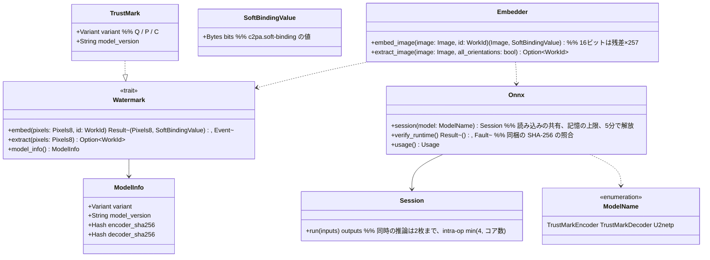

# core-mark（業務。不可視透かし、ONNX ランタイムの共有）

## 受ける節
- [第3章 5 不可視透かし](../../../../docs/jp/design/03_基本設計書_署名処理.md#5-不可視透かし)（方式、8方向の読み出し、推論の上限、同梱の照合、16ビット、処理時間）
- 役割と外部の部品：[第11章 7.1](../../../../docs/jp/design/11_基本設計書_開発基盤.md#71-rust-の部品の分け方)、[DD-11-14](../../../../docs/jp/design/11_基本設計書_開発基盤.md#1-設計上の決定の一覧)

## 依存
- 下：[core-common](core-common.md)（`WorkId`、`Fault`、`Pixels8`）、[core-image](core-image.md)（`Image`、`ColorEngine::to_8bit`：16ビットの残差の扱い）。
- ONNX ランタイムの読み込みと共有は本ブロックが持ち、core-work の自動配置（u2netp）も `Onnx::session` を使う（モデルは使う方だけ読む。第3章 5）。

## クラス図

## 橋（このブロックが所有する操作）
|番号|操作（上の図）|使う側|由来|
|---|---|---|---|
|B-100|`Embedder::embed_image`、`Watermark::model_info`|sign|第3章 5|
|B-101|`Embedder::extract_image`（照合は8方向、読み戻しは元の向きだけ）|sign・case|第3章 5、第6章 4|
|B-102|`Onnx::session`|work・app-client（起動の時の遅延の読み込み）|第3章 5|
|B-103|`Onnx::verify_runtime`|app-client|第3章 5、DD-11-14|
- 透かしの variant とモデルの版は出力の作品データ・事件記録の `app` に記録する（core-sign・core-case が `model_info()` から写す）。
- `Onnx::session(model)` は透かしと自動配置のモデルを同時に持たない（使う方を読み、他方を解放する。第4章 14.4）。ONNX ランタイムは動的に読み込む（ort の `load-dynamic`）。`verify_runtime` が合わなければ `Fault`（異常検出）で、透かしのない出力はしない（第3章 5）。

## 算法（trait の後ろ）
|trait|実装|切り替え|由来|
|---|---|---|---|
|`Watermark`|TrustMark Q（既定）・P・C|実測で決め、版ごとに固定（出力に記録）|第3章 DD-3-2、5|

## データ設計
- 本ブロックは記録を書かない。同梱の素材（P-8）：`assets/models/encoder_Q.onnx`・`decoder_Q.onnx`（第11章 4.3）、ONNX ランタイムの共有の部品。期待する SHA-256 は `assets/manifest.json`（第11章 6）からビルド時に埋め込む。
- 値の形：`SoftBindingValue` は埋め込んだビット列（TrustMark BCH_5 のデータ部の61ビット）。マニフェストへの記録は core-sign（第3章 3.1）。
