# core-net（基盤）

## 受ける節
- [第1章 4.2 外部とのやり取り](../../../../docs/jp/design/01_基本設計書_全体構成.md#42-外部とのやり取り)（相手の表、時間切れと上限、再試行、取得先の並び、代理サーバー、TLS、従量制の判定）
- 役割と外部の部品：[第11章 7.1](../../../../docs/jp/design/11_基本設計書_開発基盤.md#71-rust-の部品の分け方)

## 依存
- 下：[core-common](core-common.md)。
- 外部との境界：B-330〜B-334 の HTTP はすべて本ブロックを通る（直接の接続 B-335 は core-sync の iroh、鍵保管 B-337 は core-identity）。

## クラス図

```mermaid
classDiagram
  class Target {
    <<enumeration>>
    PublicPage Mirror Tsa Rdap Dns RepostPage Direct Dht  %% 第1章 4.2 の表の行。Direct・Dht は core-sync が Limits だけ使う
  }
  class Limits {
    +Duration connect
    +Duration total
    +u64 max_bytes
    +u8 max_redirects  %% TSA の POST は 0
    +for_target(Target) Limits  %% 第1章 4.2 の表の値（本ブロックの定数。1か所）
  }
  class RawExchange {
    +Bytes request_head  %% WARC の request の記録用
    +Bytes response_head
    +Url url
  }
  class Response {
    +Bytes body
    +Headers headers
    +Url final_url
    +IpAddr ip
    +Option~String~ tls_subject
    +Option~String~ tls_issuer
    +[RawExchange] exchanges  %% 転送の各段（第6章 2.2.1）
  }
  class Http {
    +fetch(target: Target, url, headers: Headers) Result~Response, Event~  %% 流しながら上限で切る
    +post_timestamp(tsa_url, request_der, auth: Option~Basic~) Result~Bytes, Event~  %% 転送に従わない。有料の TSA は Basic（第3章 4）
  }
  class DnsAnswer {
    +[IpAddr] a
    +[IpAddr] aaaa
    +[String] ptr
    +Bytes raw  %% 応答の生データ（証拠）
  }
  class Dns {
    +resolve(name) Result~DnsAnswer, Event~  %% hickory-resolver、OS の DNS サーバー、接続5秒・全体10秒
    +reverse(ip) Result~DnsAnswer, Event~
  }
  class Headers {
    +for_page(user_agent, accept_language) Headers  %% Cookie・Referer を送らない
    +for_app() Headers  %% c2pa4cosplayer/<版>
  }
  class Sources {
    +ordered() [Source]
    +report_failure(source)
    +report_bad_content(source)
    +mark_checked(kind: Ref | Update)  %% fetch-state.json の last_ref_check / last_update_check
  }
  class Source {
    +Url base
    +u32 failures
    +Rfc3339 last_checked
  }
  class Reachability {
    +on_online(callback)  %% macOS NWPathMonitor、Windows INetworkListManager、Linux NetworkManager の D-Bus
    +is_online() bool
    +is_metered() bool  %% GetConnectionCost、NWPath.isExpensive/isConstrained、connection.metered
  }
  class RetryPolicy {
    <<trait>>
    +delays(target) [Duration]  %% 1・4・16秒（揺らぎ）、以後は回線の復帰と1時間ごと
  }
  class Scheduler {
    +schedule(kind: JobKind, job)
    +run_pending()  %% 1本の待ち行列。優先の順は第1章 7。利用者の処理の邪魔をしない
    +every(Duration, kind, job)  %% 1時間ごと・24時間ごと・毎日の刻み
  }
  class JobKind {
    <<enumeration>>
    CleanupAfterCrash VerifyChains PendingTimestamps ChainHeadTimestamp RefAndUpdate VerifyOriginals VerifyEvidence Retention Backup DeviceSync Alarms Renewals  %% 第1章 7 の裏の順
  }
  class Proxy {
    <<module>>
    +system_proxy() Option~ProxyConf~  %% WinHTTP、macOS、環境変数
  }
  class Tls {
    <<module>>
    +platform_verifier() Verifier  %% rustls-platform-verifier
  }
  Http ..> Target
  Http ..> Limits
  Http --> RawExchange
  Dns --> DnsAnswer
  Http --> Response
  Http ..> Headers
  Http ..> Proxy
  Http ..> Tls
  Sources --> Source
  Scheduler ..> RetryPolicy
  Scheduler ..> Reachability
  Scheduler ..> JobKind
```

## 橋（このブロックが所有する操作）
|番号|操作（上の図）|使う側|由来|
|---|---|---|---|
|B-040|`Http::fetch`|ref・case|第1章 4.2|
|B-041|`Sources`|ref・app-client|第1章 4.2|
|B-042|`Http::post_timestamp`|sign|第3章 4|
|B-043|`Headers::for_page`|case|第1章 4.2、第6章 DD-6-8|
|B-044|`Reachability`、`RetryPolicy`、`Scheduler`（裏の処理の唯一の待ち行列。app-client はここに `schedule` する）|ref・sign・case・sync・app-client|第1章 4.2、10.5、7|
|B-045|`Dns::resolve`／`reverse`（生の応答つき）|case|第1章 4.2、第6章 5|
|B-046|`Limits::for_target`（`Direct`・`Dht` の時間切れ）|sync|第1章 4.2|
- `Limits` の値は `Target` ごとに第1章 4.2 の表から取る（本ブロックが持つ定数。呼ぶ側は `Target` を渡すだけ）。
- 転載ページの取得は本ブロックが本文を流しながら上限で切る（第1章 4.2「応答は流しながら書き」）。描画も解釈もしない（解釈は core-case）。

## 算法（trait の後ろ）
|trait|実装|切り替え|由来|
|---|---|---|---|
|`RetryPolicy`|AWS の exponential backoff と同じ3回、以後は回線の復帰の事象と1時間ごと。時刻証明は再び試さず次の TSA（core-sign の `TsaStrategy`）、転載ページは1回だけ|初期値の定数|第1章 4.2|

## データ設計（このブロックが形を持つ記録）
|記録|形|欄|由来|
|---|---|---|---|
|`state/fetch-state.json`（`nrsd.fetch_state/1`）|JSON|`sources[]`（`Source` の3欄）、`last_ref_check`、`last_update_check`|第1章 4.2、第8章 2.1|
- 待ち行列（`Scheduler`）は記憶の上だけ。保留の処理そのもの（時刻証明の保留、控えの予定）は各持ち主の記録にあり、起動のたびに持ち主が `schedule` し直す。
