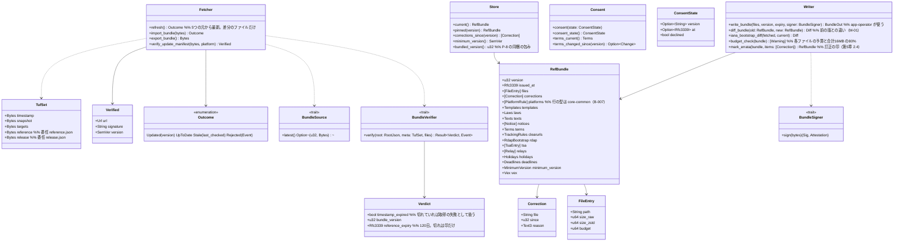

# core-ref（業務。参照情報の包みと更新の案内の取得・TUF の検証）

## 受ける節
- [第8章 3.4 参照情報の包み](../../../../docs/jp/design/08_基本設計書_リポジトリとデータ管理.md#34-参照情報の包み)（ファイルの一覧、検証の5段、5つの取得の元、同梱の包み、訂正の印）
- [第9章 4.2 古い版の利用者（更新の強制）](../../../../docs/jp/design/09_基本設計書_配布と更新.md#42-古い版の利用者更新の強制)、[4.3 更新の案内（静的な JSON）の形](../../../../docs/jp/design/09_基本設計書_配布と更新.md#43-更新の案内静的な-jsonの形)（TUF の役割・期限・置き場）
- [第12章 3.1 NRSD の役務の利用に必須のもの](../../../../docs/jp/design/12_基本設計書_法務との接点.md#31-nrsd-の役務の利用に必須のもの)（同意の記録）
- 役割と外部の部品：[第11章 7.1](../../../../docs/jp/design/11_基本設計書_開発基盤.md#71-rust-の部品の分け方)

## 依存
- 下：[core-common](core-common.md)、[core-store](core-store.md)（`Schema`、`AtomicFile`、`Paths`）、[core-net](core-net.md)（`Http::fetch`、`Sources`、`Scheduler`）。
- 依存の逆転：`BundleSource` を本ブロックが定義し core-sync が実装（別の端末・相手からの包み）。`BundleSigner` を本ブロックが定義し app-operator が実装（ハードウェアトークンの署名）。
- 外部との境界 B-330（公開ページ・ミラーからの HTTPS GET。core-net 経由）。

## クラス図

## 橋（このブロックが所有する操作）
|番号|操作（上の図）|使う側|由来|
|---|---|---|---|
|B-220|`Fetcher::refresh`|app-client|第8章 3.4|
|B-221|`Store::current`（各表）|rights・guidance・work・app-client（case・identity へは app-client が渡す）|第8章 3.4、第7章、第5章、第12章|
|B-222|`Fetcher::verify_update_manifest`|app-client|第9章 4.3|
|B-223|`Consent`（`refresh` だけが同意に従う。更新の案内の検証は同意に依らない）|app-client|第12章 3.1、4.3|
|B-224|`Store::minimum_version`|app-client|第9章 4.2|
|B-225|`Store::pinned`|work|第5章 4|
|B-226|`Fetcher::import_bundle`・`export_bundle`（ファイル・同期・持ち出しキット。初回の起動は同梱の包みをこれで取り込む）|app-client・sync|第8章 3.4|
|B-227|`Store::corrections_since`|app-client・rights|第8章 3.4|
|B-228|`BundleSource`（定義。実装は core-sync）|sync|第8章 3.4|
|B-229|`RefBundle` の形と `Writer::write_bundle`|app-operator|第8章 3.4|
|B-310 の一部|`BundleSigner`（定義。実装は app-operator）|app-operator|第8章 3.4|
- 投稿先の判定は core-common の `Platforms::detect`（B-007）が行い、本ブロックは `platforms.json` を core-common の `[PlatformRule]` に読むだけ。使う側（core-identity B-081、core-case B-181）は表を渡す（同じ判定を2か所に持たない）。

## 算法（trait の後ろ）
|trait|実装|切り替え|由来|
|---|---|---|---|
|`BundleVerifier`|tough（TUF 1.0 の順：root → timestamp → snapshot → targets → 委任）。root は同梱の初版から版の連なりで更新|固定|第8章 3.4、第9章 4.3|

## データ設計（このブロックが形を持つ記録）
|記録|形|欄|由来|
|---|---|---|---|
|`reference/<版>/index.json`（`nrsd.reference/1`）|JSON|`schema`、`version`、`issued_at`、`files[]`（`FileEntry`）、`corrections[]`（`Correction`）|第8章 3.4|
|`reference/<版>/` の各ファイル（`nrsd.ref.<名前>/1`）|JSON（zstd で取得、展開して置く）・Markdown|`platforms`（1行：`id`、`name`（3言語）、`hosts[]`、`paths[]`、`profile_limit`、`c2pa_survives`、`windows{copyright, portrait}`（`url`、`method`、`jp_art22`、`notes`）、`sources`、`checked_at`。第7章 2.1）、`laws`（第7章 4）、`deadlines`・`holidays`（第7章 6.3）、`tsa`（`id`、`name`、`url`、`roots`（PEM）、`kind`（`free`・`paid`）、`auth`（`none`・`basic`）、`order`。第3章 4）、`relays`（`url`、`region`、`operator`）、`notices`（番号、日付、種類、3言語の題と本文、期限）、`terms`（版、効力の日）、`minimum_version`（`app`、`reason`、`date`）、`clearurls`、`rdap-bootstrap/`、`vex`（CSAF 2.0）、`templates/<種類>.<言語>.md`（第7章 3.3）、`texts/`（第5章 3.7）|第8章 3.4、第7章 2.1・3.3・4・6.3、第9章 4.2、第11章 5.3|
|`reference/latest.json`|JSON|`version`、`index_sha256`（信頼の根拠にしない）|第8章 3.4|
|`tuf/`（取得した TUF のメタデータの写し：`root.json` の版の連なり、`timestamp`・`snapshot`・`targets`・`reference`・`release`）|JSON|TUF の仕様 1.0 の形|第9章 4.3|
|`consent.json`（`nrsd.consent/1`）|JSON|`ConsentState` の3欄|第12章 3.1|
|同梱の包み（P-8）|`reference/` の初版と `root.json` の初版|同上|第8章 3.4|
- `Store::minimum_version` は参照情報の `minimum-version.json` と更新の案内の TUF（委任 `release` の targets の custom）の両方を読み、大きい方を返す（第9章 4.2。同意せず参照情報を取らない利用者にも届く）。
- `Writer::write_bundle` は各ファイル（zstd）、`index.json`、`latest.json`、委任 `reference` の `targets.json`（`BundleSigner` で署名）を作る。`snapshot.json`・`timestamp.json` は CI の `tuf-online` が署名し直す（第11章 DD-11-13。P-10）。
- 最後の確かめの日時（`fetch-state.json` の `last_ref_check`・`last_update_check`）は core-net の `Sources::mark_checked` で書く。
- 更新の案内（`update/latest.json`。`nrsd.update_manifest/1`）の欄は第9章 4.3 の表。本ブロックは検証して `Verified` を返すだけで、配布物の取得と入れ替えは app-client（Tauri の更新の部品）。
- 印：`Verdict.timestamp_expired` は取得の失敗（手元を使う）、`reference_expiry` 超過は「参照情報が古い」の知らせ（第8章 3.4 の表の5）、同期・ファイルから届いた包みは `stale_check: date` の印（第8章 3.4）。
