# core-render（業務。フォント、文字の組み立て、描画、配置、合成、PDF）

## 受ける節
- [第1章 10.11 PDF の文書](../../../../docs/jp/design/01_基本設計書_全体構成.md#1011-pdf-の文書)
- [第4章 3.2 書式](../../../../docs/jp/design/04_基本設計書_画像編集と一括適用.md#32-書式)、[3.3 縦書き](../../../../docs/jp/design/04_基本設計書_画像編集と一括適用.md#33-縦書き)、[3.4 足りない字](../../../../docs/jp/design/04_基本設計書_画像編集と一括適用.md#34-足りない字)、[3.5 描画](../../../../docs/jp/design/04_基本設計書_画像編集と一括適用.md#35-描画)、[6.2 代わりのフォントの並び](../../../../docs/jp/design/04_基本設計書_画像編集と一括適用.md#62-代わりのフォントの並び)、[6.4 持ち込みのフォント](../../../../docs/jp/design/04_基本設計書_画像編集と一括適用.md#64-持ち込みのフォント)、[7.1 位置と大きさ](../../../../docs/jp/design/04_基本設計書_画像編集と一括適用.md#71-位置と大きさ)、[7.3 収まらない場合](../../../../docs/jp/design/04_基本設計書_画像編集と一括適用.md#73-収まらない場合)、[7.4 敷き詰め](../../../../docs/jp/design/04_基本設計書_画像編集と一括適用.md#74-敷き詰め)
- 役割と外部の部品：[第11章 7.1](../../../../docs/jp/design/11_基本設計書_開発基盤.md#71-rust-の部品の分け方)

## 依存
- 下：[core-common](core-common.md)、[core-image](core-image.md)（`Image`、`ColorEngine`：描いた透過の画像を写真の色空間とビット数に合わせる）。
- テンプレート・作業の構造（層、まとまり、差し込み）は core-work が持ち、本ブロックは `TemplateSnapshot`（組み立てに要る写し）を受け取るだけ。

## クラス図

```mermaid
classDiagram
  class Fonts {
    +load(path) Result~FontId, Event~  %% TTF・OTF、50MB まで。参照は家族名と SHA-256
    +bundled() [FontId]
    +fallback_chain(direction, lang) [FontId]  %% 6.2 の既定（中国語は LXGW WenKai を先頭）
    +missing_glyphs(text, chain: [FontId]) [char]
    +supports_vertical(font) bool  %% vert を持たないフォント（Caveat）は縦書きの主のフォントに選べない（3.3）
    +resolve(family, sha256) Option~FontId~  %% 無ければ None → Layout の Issue::FontMissing
  }
  class Color {
    +opposite() Color  %% 白↔黒、他は明るさの反対の白か黒（3.2「文字の色の反対」）
  }
  class Tiling {
    +Pattern pattern  %% Grid | Diagonal（既定）
    +f32 angle  %% −45〜45、既定 −30
    +(f32, f32) spacing  %% 短辺の 10〜60%、既定 25%
    +f32 opacity  %% 10〜100%、既定 20%
  }
  class Issue {
    <<enumeration>>
    TooSmall  %% 字が 1.5% 未満（7.3）
    LowContrast  %% 3:1 未満。縁取りを自動で付けた上で印（3.2）
    MissingGlyph  %% どのフォントにも無い字（3.4）
    UndrawableGlyph  %% COLRv1 の描けない塗り（6.3）
    FontMissing  %% 持ち込みのフォントが無い端末（6.4）
  }
  class TextStyle {
    +[FontId] fonts
    +Weight weight
    +f32 size_ratio  %% 短辺に対する割合
    +ColorSpec color  %% 固定 | Auto
    +Align align
    +f32 line_height
    +f32 letter_spacing
    +Option~Outline~ outline
    +Option~Shadow~ shadow
    +Option~Plate~ plate
    +Direction direction  %% 横書き | 縦書き
    +bool tcy  %% 縦中横（2桁までの数字。縦書きの時）
    +f32 rotation
    +f32 opacity
  }
  class Shaper {
    <<trait>>
    +shape(text, style: TextStyle) ShapedLines  %% 字素ごとの代わり、UAX #9、縦書きは自作
  }
  class Layout {
    +[PlacedBlock] blocks
    +[Issue] issues  %% 要手直し（1.5% 未満）、読みにくい
  }
  class PlacedBlock {
    +BlockId block
    +Anchor anchor  %% 9点
    +Margin margin
    +Rect bounds_px
    +f32 scale  %% 40% を超えた時の縮み
    +Tiling tiling  %% 1か所 | 敷き詰め
  }
  class Layouter {
    +layout(snapshot: TemplateSnapshot, overrides, photo: Size, inserts: Inserts) Layout
  }
  class Renderer {
    +render_block(layout: Layout, block: BlockId) RgbaImage  %% 板 → 影（ガウス、σ＝ぼかし/2）→ 縁取り（round join・cap）→ 塗り。絵文字は COLRv1。1/4画素。低コントラストなら縁取りを自動で足す
    +render_tile(layout, block) RgbaImage  %% 敷き詰めの1つ分（7.4）
    +composite(photo: Image, layers: [(RgbaImage, Pos)]) Image  %% sRGB 8ビットの透過を写真の色空間・ビット数に変換して重ねる（core-image の ColorEngine）。敷き詰めは並べる
  }
  class ContrastRule {
    <<trait>>
    +auto_color(bg: Pixels) Color  %% 相対輝度 0.179 の境
    +contrast_ratio(a: Color, b: Color) f32
  }
  class PdfWriter {
    <<trait>>
    +pdf_a(doc: PdfDocument) Result~Bytes, Fault~  %% PDF/A-2u・3u、PDF/UA-1、検証に通らなければ異常検出
  }
  class PdfDocument {
    +[Section] sections  %% 見出し・段落・表・図（代替の文つき）
    +[EmbeddedFile] embedded  %% AssociationKind
    +Archival level
  }
  Layouter --> Layout
  Layouter ..> Shaper
  Layouter ..> Fonts
  Layout --> PlacedBlock
  Layout --> Issue
  PlacedBlock --> Tiling
  TextStyle --> Color
  Renderer ..> Layout
  Renderer ..> ContrastRule
  Renderer ..> TextStyle
  PdfWriter ..> PdfDocument
```

## 橋（このブロックが所有する操作）
|番号|操作（上の図）|使う側|由来|
|---|---|---|---|
|B-110|`Fonts`|work|第4章 6、3.4|
|B-111|`Layouter::layout`|work|第4章 7.1、7.3、7.4|
|B-112|`Renderer::render_block`|work|第4章 3.5、6.3|
|B-113|`Renderer::composite`|sign|第4章 3.5|
|B-114|`ContrastRule`|work|第4章 3.2|
|B-115|`PdfWriter::pdf_a`|backup・case・app-client（手がかりの書き出し）|第1章 10.11|
- 敷き詰めは繰り返しの1つ分を一度だけ描いて並べる（第4章 7.4）。回転の中心はまとまりの中心（第4章 3.5）。

## 算法（trait の後ろ）
|trait|実装|切り替え|由来|
|---|---|---|---|
|`Shaper`|HarfRust。縦書き（`vert`、vhea・vmtx、英数字の回転、縦中横）は自作|固定|第4章 3.3|
|`ContrastRule`|WCAG の相対輝度とコントラスト比|初期値の定数（3:1 で縁取りを自動）|第4章 3.2|
|`PdfWriter`|krilla（veraPDF でも CI で検証）。代わりは printpdf|固定|第1章 10.11、第11章 12|

## データ設計
- 本ブロックは記録を書かない。持ち込みのフォントのファイルは `assets/`（SHA-256 の名前。第8章 2.1）に core-work が置き、本ブロックはパスを受けて読む。
- `TextStyle` の欄と範囲・既定は第4章 3.2 の表、`PlacedBlock` の基準点・余白・縮みは 7.1・7.3、敷き詰めの欄は 7.4 の表。テンプレートの記録（`nrsd.template/2`）の中でこれらを持つのは core-work（第4章 15.1）。
