# core-rights（業務。許可範囲、同封文書、権利の記載、告知の文例）

## 受ける節
- [第2章 2.2 告知コードを掲げる場所の上限](../../../../docs/jp/design/02_基本設計書_署名の情報と照合.md#22-告知コードを掲げる場所の上限)
- [第3章 3.3 権利表示の言語](../../../../docs/jp/design/03_基本設計書_署名処理.md#33-権利表示の言語)、[3.6 ファイルの権利の記載](../../../../docs/jp/design/03_基本設計書_署名処理.md#36-ファイルの権利の記載iptc-の写真のメタデータ)
- [第5章 2.1 選択肢](../../../../docs/jp/design/05_基本設計書_権利文書.md#21-選択肢o-04許可範囲の選択肢-の決定)、[2.3 画像との紐付け](../../../../docs/jp/design/05_基本設計書_権利文書.md#23-画像との紐付け)、[2.4 販売後の変更](../../../../docs/jp/design/05_基本設計書_権利文書.md#24-販売後の変更)、[3.1 構成](../../../../docs/jp/design/05_基本設計書_権利文書.md#31-構成)、[3.2 共通部の骨子](../../../../docs/jp/design/05_基本設計書_権利文書.md#32-共通部の骨子)、[3.4 書き換えの検出](../../../../docs/jp/design/05_基本設計書_権利文書.md#34-書き換えの検出)、[3.6 機械が読める許可範囲（ODRL）](../../../../docs/jp/design/05_基本設計書_権利文書.md#36-機械が読める許可範囲odrl)、[3.8 国と言語の符号](../../../../docs/jp/design/05_基本設計書_権利文書.md#38-国と言語の符号)、[5 国](../../../../docs/jp/design/05_基本設計書_権利文書.md#5-国)、[6.1 文例の段](../../../../docs/jp/design/05_基本設計書_権利文書.md#61-文例の段)
- 役割と外部の部品：[第11章 7.1](../../../../docs/jp/design/11_基本設計書_開発基盤.md#71-rust-の部品の分け方)

## 依存
- 下：[core-common](core-common.md)（`Text::text`、`NoticeCode`、`WorkId`）、[core-store](core-store.md)（`Chain::sign_embedded`：訂正版の署名）、[core-hash](core-hash.md)（同封文書の SHA-256）、[core-ref](core-ref.md)（文言 `texts/`、文例、投稿先の表、`pinned` の版）。
- 設定に依存しない：同封する国・言語は呼ぶ側（core-sign・app-client）が設定から読んで渡す。
- 訂正版：影響する作品の列挙は app-client（core-sign の作品データと core-ref の `corrections_since` から）、生成は本ブロック、署名は core-store の `sign_embedded`（`RecordSigner` は core-identity）。

## クラス図

```mermaid
classDiagram
  class PermittedScope {
    +Base base  %% P1 | P2
    +[Addon] addons  %% A1 A2 A3
    +short() String  %% P2+A1+A2
    +always_included() [Condition]
    +sns_default() PermittedScope  %% SNS 用の既定「P1 相当：閲覧のみ、転載禁止」（第5章 2.1、第3章 8.2）
  }
  class Enclosure {
    +[EnclosureFile] files  %% 00_RIGHTS_README.txt、00_RIGHTS_<国>.txt、00_RIGHTS.json
    +[(String, Hash)] hashes
  }
  class EnclosureBuilder {
    +build(scope, countries: [Country], holder: Holder, batch_id: Uuid, work_ids: [WorkId], ref_pinned: RefBundle) Enclosure
    +regenerate(work: WorkData) Enclosure
    +errata(work_ids, correction: Correction) (ErrataFile, Jws)
  }
  class Holder {
    +String handle
    +NoticeCode notice_code
    +[Url] accounts
    +Option~Party~ grantor  %% 承認を受けた者の出力
    +Option~Party~ co_rights_holder
  }
  class Odrl {
    <<module>>
    +offer(scope, batch_id, holder, work_ids) JsonLd  %% 第5章 3.6 の対応
  }
  class EnclosureVerifier {
    +verify(folder: Path, manifest_hashes: [(String, Hash)]) VerifyReport  %% 一致・不一致・無い・余分、ERRATA の正当性
  }
  class Deed {
    <<module>>
    +deed(scope, lang) DeedTable  %% できる・条件・できない
  }
  class RightsText {
    <<module>>
    +rights_fields(stream, scope, lang, holder, title) RightsFields  %% XMP・EXIF・cawg.metadata・cawg.training-mining の値
    +notice_texts(level, lang, handle, code, platform, profile_limit: Option~u32~, registration: Option) String  %% 短・中・長（第5章 6.1）。上限は platforms の列を呼ぶ側が渡す（第2章 2.2）
    +license_short(scope) String
  }
  class ViolationRules {
    <<trait>>
    +violations(scope, facts: RepostFacts) [ViolationCandidate]
  }
  class RepostFacts {
    +bool paid
    +bool public
    +bool c2pa_missing
    +bool pixels_identical_to_delivery
    +PlatformC2paSurvival survival
  }
  EnclosureBuilder --> Enclosure
  EnclosureBuilder ..> Odrl
  EnclosureBuilder ..> Holder
  EnclosureBuilder ..> PermittedScope
  EnclosureVerifier --> VerifyReport
  ViolationRules ..> RepostFacts
  ViolationRules ..> PermittedScope
```

## 橋（このブロックが所有する操作）
|番号|操作（上の図）|使う側|由来|
|---|---|---|---|
|B-120|`PermittedScope`|work・sign・case・app-client|第5章 2.1|
|B-121|`EnclosureBuilder::build`|sign|第5章 3、4、3.1|
|B-122|`EnclosureVerifier::verify`|sign・app-client|第5章 3.4|
|B-123|`RightsText::notice_texts`（投稿先の上限は表の列から）|app-client|第5章 6|
|B-124|`RightsText::rights_fields`|sign|第3章 3.3、3.6|
|B-125|`Deed::deed`|app-client・P-6（同じ表）|第5章 3.1|
|B-126|`EnclosureBuilder::regenerate`、`errata`|app-client|第5章 2.4、4|
|B-127|`RightsText::license_short`|work|第5章 2.1|
|B-128|`ViolationRules::violations`|case|第5章 2.3|

## 算法（trait の後ろ）
|trait|実装|切り替え|由来|
|---|---|---|---|
|`ViolationRules`|第5章 2.3 の候補の規則（許可範囲外の公開、商用の利用、照合データの除去の条件）|固定|第5章 2.3|

## データ設計（このブロックが形を持つもの。端末の記録ではなく出力）
|出力|形|欄|由来|
|---|---|---|---|
|`00_RIGHTS_README.txt`|TXT（UTF-8、BOM なし、CRLF）。日・中・英|第5章 3.2 の10項目|第5章 3.1、3.2|
|`00_RIGHTS_<国>.txt`|TXT|国別部（文言は参照情報 `texts/`。P-7）|第5章 3.1、3.3|
|`00_RIGHTS.json`|ODRL 2.2 JSON-LD（Offer）|第5章 3.6 の表と例。`uid`・`assigner`・`target` の URI は `https://c2pa4cosplayer.nrsd.jp/id/…`|第5章 3.6|
|`00_RIGHTS_ERRATA.txt`＋`.sig`|TXT、JWS detached|先頭に元と訂正版の SHA-256、差分、署名|第5章 2.4、3.4|
|`RightsFields`（XMP・EXIF の値）|core-image の型|第3章 3.6 の表の欄|第3章 3.6|
- 許可範囲の記録先は作品データ `rights`（core-sign の頁）とマニフェスト `jp.nrsd.rights`・`cawg.metadata`・`cawg.training-mining`（第3章 3.1）。
- 同封文書の本文は参照情報の `texts/common.<言語>.md`・`texts/country.<国>.<言語>.md`（第5章 4）の差し込み `{handle}`・`{account}`・`{scope}`・`{url}` を埋めて作る（規則は第4章 3.1 と同じ。core-work の差し込みの規則を本ブロックは使わず、同じ規則を core-common の `Text` 側に置く）。
