# core-sign（業務。C2PA署名、時刻証明と ERS、書き出しの流れ、作品データ）

## 受ける節
- [第2章 4.2 原本](../../../../docs/jp/design/02_基本設計書_署名の情報と照合.md#42-原本)、[4.6 他人の C2PA署名がある画像を書き出す場合](../../../../docs/jp/design/02_基本設計書_署名の情報と照合.md#46-他人の-c2pa署名がある画像を書き出す場合)
- 第3章：[1 設計上の決定の一覧](../../../../docs/jp/design/03_基本設計書_署名処理.md#1-設計上の決定の一覧)、[3.1 記録する項目](../../../../docs/jp/design/03_基本設計書_署名処理.md#31-記録する項目)、[3.2 記録しない項目](../../../../docs/jp/design/03_基本設計書_署名処理.md#32-記録しない項目)、[3.4 操作の記録](../../../../docs/jp/design/03_基本設計書_署名処理.md#34-操作の記録)、[3.5 時刻証明の置き場](../../../../docs/jp/design/03_基本設計書_署名処理.md#35-時刻証明の置き場)、[3.7 形式ごとの埋め込み](../../../../docs/jp/design/03_基本設計書_署名処理.md#37-形式ごとの埋め込み)、[3.8 素材のマニフェストの墨消し](../../../../docs/jp/design/03_基本設計書_署名処理.md#38-素材のマニフェストの墨消し)、[4 時刻証明](../../../../docs/jp/design/03_基本設計書_署名処理.md#4-時刻証明)、[7.1 識別番号](../../../../docs/jp/design/03_基本設計書_署名処理.md#71-識別番号)、[7.2 作品データの項目](../../../../docs/jp/design/03_基本設計書_署名処理.md#72-作品データの項目o-10作品データの記録の形式-の決定)、[8.1 順序](../../../../docs/jp/design/03_基本設計書_署名処理.md#81-順序)、[8.2 系統の差](../../../../docs/jp/design/03_基本設計書_署名処理.md#82-系統の差)、[9 一括処理](../../../../docs/jp/design/03_基本設計書_署名処理.md#9-一括処理)、[10.1 名前と構成](../../../../docs/jp/design/03_基本設計書_署名処理.md#101-名前と構成)、[10.2 利用者による確認](../../../../docs/jp/design/03_基本設計書_署名処理.md#102-利用者による確認)、[11 失敗の扱い](../../../../docs/jp/design/03_基本設計書_署名処理.md#11-失敗の扱い)
- 役割と外部の部品：[第11章 7.1](../../../../docs/jp/design/11_基本設計書_開発基盤.md#71-rust-の部品の分け方)

## 依存
- 下：[core-common](core-common.md)、[core-store](core-store.md)（`Chain`、`AtomicFile`、`WorkIndex`、`Space`）、[core-net](core-net.md)（`post_timestamp`、`Scheduler`）、[core-hash](core-hash.md)、[core-image](core-image.md)、[core-identity](core-identity.md)（`current`、`with_signing_key`、`PastRoots`、`Grants::is_revoked`、`skeleton`、`expected_notice_code`）、[core-mark](core-mark.md)、[core-render](core-render.md)（`composite`）、[core-rights](core-rights.md)（`EnclosureBuilder::build`、`RightsText::rights_fields`、`EnclosureVerifier::verify`）、[core-work](core-work.md)（`export_plan`、`render_export`、`mark_exported`、`parallelism`）。
- 外部との境界 B-332（TSA。core-net 経由）。
- 承認書の取り消しの確かめ（第2章 5.4「一括の書き出しの開始の時」）は app-client が `Grants::is_revoked` で開始の時に1回行い、本ブロックは写真ごとには確かめない。
- `InsertContext`（差し込み）は本ブロックが作品の識別番号を足して core-work に渡す。TSA の一覧 `tsa.json` は呼ぶ側が参照情報から渡す（本ブロックは core-ref に依存しない）。

## クラス図

```mermaid
classDiagram
  class WorkData {
    +WorkId id
    +Stream stream
    +Original original
    +Output output
    +Bytes manifest
    +Rights rights
    +Option~CoRights~ co_rights
    +Signer signer
    +Tsa tsa
    +AppInfo app
    +Rfc3339 created_at
    +ClockStamp clock
    +Option~WorkId~ duplicate_of
    +[Ingredient] ingredients
  }
  class Original {
    +Hash sha256
    +Format format
    +Size px
    +Option~PdqHash~ pdq
    +Path path
    +[OriginalVersion] versions  %% 現像し直し、現像前の RAW
    +Option~Rfc3339~ date_time_original
  }
  class Output {
    +Hash sha256
    +Format format
    +Size px
    +PdqHash pdq
    +IsccCode iscc
    +String file_name
    +String original_name
    +Option~NameFix~ name_fix
    +[Path] locations
  }
  class Tsa {
    +TsaState state  %% Attached | Pending
    +[TsResponse] responses
  }
  class Rights {
    +ScopeId scope_id
    +u32 scope_version
    +Option~[(String, Hash)]~ enclosure_hashes  %% 受け渡し用だけ
    +u32 ref_version
    +[(String, Hash)] text_file_hashes  %% 使った文言のファイル（第5章 4）
  }
  class NrsdRights {
    +WorkId work_id
    +IsccCode iscc
    +Hash original_sha256
    +Size original_px
    +ScopeId scope_id
    +u32 scope_version
    +Option~Hash~ enclosure_sha256
    +Option~String~ co_rights_holder
    +Option~String~ grantor
    +u32 ref_version
    +[(String, Hash)] text_file_hashes
    +Option~String~ shoot  %% 撮影名（元のファイル名は入れない）
  }
  class ExistingSignature {
    <<enumeration>>
    None
    OwnRoot  %% ①今か過去の個人のルート → 素材として取り込む
    ToolOnly  %% ②カメラ・現像ソフト（身元の記録なし）→ parentOf、墨消し
    KnownParty  %% ③承認書・共同の権利の書面のある相手 → 記名
    Stranger  %% ④関係のない他人の身元 → 処理しない
    Tampered  %% ⑤改ざんの番号 → 処理しない
  }
  class Exporter {
    +export_one(session, item: ExportItem, scope, tsa_set: [TsaEntry], enclosure: Option~Enclosure~) Result~WorkData, Event~  %% 8.1 の段1〜14
    +cleanup_after_crash() Report
    +queue() ExportQueue
  }
  class ExportQueue {
    +[(Uuid session, PresetId)] items
    +push(...)
    +pop_next() Option~...~
  }
  class Inspector {
    +inspect(path) Inspection  %% 検証の番号、署名者、期待される告知コード、自分のルートか、素材、透かし、PDQ
    +status_word_key(code) String
    +verify_readback(temp_path, expected: WorkData) Result
  }
  class Inspection {
    +ExistingSignature existing  %% 第3章 2 の表の①〜⑤（outsideValidity は止めずに印）
    +[StatusCode] validation_codes
    +Option~SignerInfo~ signer
    +Option~NoticeCode~ expected_notice_code
    +Option~Period~ own_root
    +[IngredientInfo] ingredients
    +Option~WorkId~ watermark_id
    +Option~PdqHash~ pdq
    +bool similar_handle  %% UTS #39 skeleton の一致
  }
  class Timestamps {
    +timestamp(hash, tsa_set: [TsaEntry]) TsResponses  %% 3つに並行、最初の1つ
    +verify_tsr(response, hash) Result
    +attach_pending_timestamps() Report
    +timestamp_chain_head() Result
    +ers_update() EvidenceRecord
    +ers_for(rows: Range) EvidenceRecord
  }
  class TsaStrategy {
    <<trait>>
    +pick(tsa_set) [TsaEntry]
  }
  class Rfc3161 {
    <<module>>
    +request(hash, nonce) Der
    +verify(response: Der, hash, roots) TsInfo  %% der・x509-cert・cms
  }
  class Ers {
    <<module>>
    +archive_timestamp(hashes) EvidenceRecord  %% RFC 4998
    +renew(record, new_ts) EvidenceRecord
  }
  class ManifestBuilder {
    +build(photo: Image, ctx, ingredients, redactions, rights: NrsdRights) ManifestDefinition  %% 3.1 のアサーション、3.4 の操作（allActionsIncluded 真）、3.8 の墨消し、cawg.identity（撮影者 cawg.creator、コスプレイヤー jp.nrsd.subject、承認を受けた者 cawg.publisher）、claim_generator、title は可搬の名前
    +sign_with_timestamp(def, bytes, tsa_set) Bytes  %% c2pa の Signer の時刻証明の入口に Rfc3161 を渡す（3.5 の sigTst2）
  }
  class Works {
    +works(query) [WorkData]
    +work(id) WorkData
    +correct(id, correction: Correction)
    +record_published(id, published: Published)
    +link_original(id, path) Result
    +pending_timestamps_count() u32
    +verify_originals() [OriginalIssue]
    +record_original_version(id, sha256, path)
    +find_original(sha256, roots: [Path]) Option~Path~
  }
  class OriginalIssue {
    +WorkId work_id
    +IssueKind kind  %% Missing | Changed（SHA-256 が違う）| Unreadable
    +Path recorded_path
  }
  class Naming {
    +plan_names(session, items) [(Path temp, Path final)]  %% 10.1、3つの OS の検査、連番。入れ子のフォルダーは出力に同じ入れ子を写す（第3章 9）。フォルダーの衝突は _2、_3
    +write_index(folder, rows) Path  %% 00_INDEX.txt（3言語の見出し。連番・識別番号・元の名前・撮影名）
  }
  class NameSanitizer {
    <<trait>>
    +fix(path) (Path, Option~NameFix~)
  }
  class SizeFitter {
    <<trait>>
    +fit(image, preset) EncodeSettings  %% 5MB 超は品質を2ずつ、下限80
  }
  Exporter --> WorkData
  Exporter ..> ManifestBuilder
  Exporter ..> Timestamps
  Exporter ..> Naming
  Exporter ..> Inspector
  Exporter ..> SizeFitter
  Exporter --> ExportQueue
  Timestamps ..> Rfc3161
  Timestamps ..> Ers
  Timestamps ..> TsaStrategy
  Naming ..> NameSanitizer
  Works --> WorkData
  WorkData --> Original
  WorkData --> Output
  WorkData --> Tsa
  WorkData --> Rights
  ManifestBuilder --> NrsdRights
  Inspection --> ExistingSignature
  Inspector --> Inspection
```

## 橋（このブロックが所有する操作）
|番号|操作（上の図）|使う側|由来|
|---|---|---|---|
|B-160|`Inspector::inspect`|app-client・case|第3章 10.2、第2章 4.6|
|B-161|`Exporter::export_one`|app-client|第3章 8.1、7.2|
|B-162|`Timestamps::timestamp`、`verify_tsr`（`tsa_set` は呼ぶ側が参照情報から）|case|第3章 4|
|B-163|`Timestamps::attach_pending_timestamps(targets, tsa_set)`（作品データの保留と、事件の状況の追記の保留。対象は呼ぶ側が `Works`・core-case の `Cases` から集めて渡す）|app-client|第3章 4、第6章 3.2|
|B-164|`Timestamps::timestamp_chain_head`、`ers_update`|app-client|第3章 4|
|B-165|`Timestamps::ers_for`|case|第3章 4|
|B-166|`Inspector::status_word_key`|app-client|第3章 10.2|
|B-167|`Works`（検索・詳細・訂正・元の投稿・原本の結び付け・保留の数）|app-client・backup|第3章 7.2、第2章 4.2|
|B-168|`Exporter::cleanup_after_crash`|app-client|第3章 9|
|B-169|`Works::verify_originals`、`record_original_version`、`find_original`|app-client・case・backup|第2章 4.2|

## 算法（trait の後ろ）
|trait|実装|切り替え|由来|
|---|---|---|---|
|`TsaStrategy`|`tsa.json` の順に3つへ並行、最初の1つを `sigTst2`、残りを作品データ|`tsa.json` の順|第3章 4|
|`NameSanitizer`|3つの OS の上限・予約語・NFC/NFD の衝突|固定|第3章 10.1|
|`SizeFitter`|品質を2ずつ下げる（下限80）|初期値の定数|第4章 14.1|

## データ設計（このブロックが形を持つ記録と出力）
|記録|形|欄|由来|
|---|---|---|---|
|`works/<年>/<一括処理の番号>.jsonl`＋`.sig`（`nrsd.work/1`。連鎖）|JSON Lines|第3章 7.2 の表（`WorkData`。訂正 `correction`・元の投稿 `published` は追記の行）|第3章 7.2|
|`state/export-queue.json`（`nrsd.export_queue/1`）|JSON|`items[]`（作業の番号、型）、一時の名前の一覧|第3章 9|
|`state/ers.json`（`nrsd.ers/1`）|JSON|EvidenceRecord の保存と次の更新の予定|第3章 4|
|`chain-heads.json`（`nrsd.chain_heads/1`）|JSON|束ねた時刻証明の対象（各 stream の先端のハッシュ）|第3章 4、第8章 2.1|
|出力：受け渡し用のフォルダー|`<日付>_<撮影名>_delivery/`：画像（`<撮影名>-<連番>-<識別番号>.<拡張子>`）、同封文書（core-rights）、`00_INDEX.txt`|第3章 10.1|第3章 10.1|
|出力：SNS 用のフォルダー|`<日付>_<撮影名>_sns/<型>/<元の名前>_<識別番号>.<拡張子>`|第3章 10.1|第3章 10.1|
|マニフェスト（出力の中）|JUMBF（c2pa）|第3章 3.1 のアサーション、3.4 の操作、`sigTst2` の時刻証明|第3章 3|
- `app` 欄に残す算法の記録：透かしの variant とモデルの版（core-mark の `model_info`）、色の変換の部品と版、PDQ のしきい値（第3章 7.2）。
