# core-store（基盤）

## 受ける節
- [第1章 8.1 データの一覧](../../../../docs/jp/design/01_基本設計書_全体構成.md#81-データの一覧)、[8.3 形式と版](../../../../docs/jp/design/01_基本設計書_全体構成.md#83-形式と版)、[8.4 保持と削除](../../../../docs/jp/design/01_基本設計書_全体構成.md#84-保持と削除)、[9.1 OS ごとの置き場所](../../../../docs/jp/design/01_基本設計書_全体構成.md#91-os-ごとの置き場所)、[10.1 データのモデル](../../../../docs/jp/design/01_基本設計書_全体構成.md#101-データのモデル)、[10.2 保存](../../../../docs/jp/design/01_基本設計書_全体構成.md#102-保存)、[10.8 言語と国](../../../../docs/jp/design/01_基本設計書_全体構成.md#108-言語と国)、[10.9 版の互換性](../../../../docs/jp/design/01_基本設計書_全体構成.md#109-版の互換性)
- [第8章 2.1 配置](../../../../docs/jp/design/08_基本設計書_リポジトリとデータ管理.md#21-配置)、[2.2 端末の外に出ないこと](../../../../docs/jp/design/08_基本設計書_リポジトリとデータ管理.md#22-端末の外に出ないこと)、[4 完全性](../../../../docs/jp/design/08_基本設計書_リポジトリとデータ管理.md#4-完全性)、[6.1 端末の容量の目安](../../../../docs/jp/design/08_基本設計書_リポジトリとデータ管理.md#61-端末の容量の目安)
- [第9章 4.4 記録の形式の移行](../../../../docs/jp/design/09_基本設計書_配布と更新.md#44-記録の形式の移行)、[第10章 10 設定](../../../../docs/jp/design/10_基本設計書_画面とデザイン.md#10-設定)
- 役割と外部の部品：[第11章 7.1](../../../../docs/jp/design/11_基本設計書_開発基盤.md#71-rust-の部品の分け方)

## 依存
- 下：[core-common](core-common.md)。
- 依存の逆転：`RecordSigner` を本ブロックが定義し、core-identity が実装して渡す（署名・自分のルート・端末の番号）。

## クラス図

```mermaid
classDiagram
  class Paths {
    +data_dir() Path
    +cache_dir() Path
    +log_dir() Path
    +ensure_layout()  %% 第8章 2.1 のフォルダーを作る
  }
  class AtomicFile {
    <<module>>
    +atomic_write(path, bytes) Result  %% ~$<名前>.tmp → sync_all → MoveFileExW(REPLACE_EXISTING|WRITE_THROUGH) / rename → フォルダーの fsync
    +rename_final(temp, final) Result
    +sweep_temps(root) [Path]  %% 起動の時に残った ~$*.tmp を消す（第1章 8.4、7.8）。出力フォルダーは対象外（core-sign）
  }
  class Jcs {
    <<module>>
    +canonicalize(json) Bytes  %% RFC 8785。部品（serde_json_canonicalizer）
    +canonicalize_ref(json) Bytes  %% 自前の最小の実装。CI で両者の一致と RFC の試験ベクトル
  }
  class Jws {
    +Header protected  %% alg: ES256、x5c（署名用と個人のルート）、sigT（JAdES）
    +Bytes signature  %% detached。本文は JCS の出力
  }
  class RecordSigner {
    <<trait>>
    +sign(bytes) Jws
    +own_roots() [Cert]
    +device_id() DeviceId
  }
  class ChainRead {
    +[Row] rows
    +Option~u64~ broken_after  %% 「連鎖が切れた」印（隔離した行の seq）
  }
  class Chain {
    +append(stream, body: Json) Row
    +read(stream) ChainRead
    +head(stream) Hash
    +verify(stream) ChainReport
    +quarantine(row)
    +write_head(stream)
    +check_head(stream) Result
    +merge_rows(stream, rows: [Row]) MergeReport
    +sign_embedded(json) Json
    +verify_embedded(json) EmbeddedSigner
  }
  class Row {
    +Hash prev
    +u64 seq
    +DeviceId device
    +ClockStamp clock  %% core-common B-006
    +Json body
    +Jws sig
  }
  class Head {
    +u64 seq
    +Hash last_bytes_sha256
    +Jws sig
  }
  class EmbeddedSigner {
    +Cert signer_root
    +NoticeCode notice_code
  }
  class MergeReport {
    +u32 added
    +[Conflict] conflicts
  }
  class MergePolicy {
    <<trait>>
    +resolve(local: Row, remote: Row) Resolution
  }
  class Schema {
    +validate(schema_id, json) Result
    +version_of(json) Version
    +migrate_all() MigrationReport  %% 第9章 4.4 の①〜④：空きの確かめ → migration-backup/ へ写す → 移行 → 検証（署名・件数・版）
    +rollback(from_backup) Result  %% 失敗の時。以後は読み取り専用
    +migration_backup() Path
    +schema_json(schema_id) bytes
    +list() [SchemaId]
  }
  class SettingEntry {
    +Value value
    +Rfc3339 updated_at
    +DeviceId device
  }
  class Settings {
    +get(key) Value
    +set(key, value)  %% updated_at と device を付けて保存
    +is_device_scoped(key) bool  %% device. の接頭辞
    +merge_remote(entries: [SettingEntry])  %% 端末に依らない項目は新しい方（第10章 10）
  }
  class RunMarker {
    +start()
    +clean_exit()
    +last_exit_was_clean() bool
  }
  class SafeArchive {
    +zip_write(entries, limits) Path
    +zip_read(path, limits) [Entry]
  }
  class ZipLimits {
    +u32 max_entries
    +u64 max_total_bytes
  }
  class Retention {
    +sweep() [Removed]  %% 起動の時：ログ90日、落ちた時の報告10件・30日、縮小の画像1GB超、移行の写し30日、残った一時のファイル（AtomicFile::sweep_temps）
    +sweep_assets(unreferenced: [Hash]) [Removed]  %% 控えのまとめ直しの時だけ（第1章 8.4）。候補は core-backup が core-work から集める
  }
  class WorkIndex {
    +lookup(work_id) Location
    +lookup_by_hash(sha256) [WorkId]
    +lookup_by_text_hash(sha256) [WorkId]  %% 使った文言のファイルから（訂正版の列挙。第5章 2.4）
    +rebuild()
  }
  class SessionLock {
    +acquire(dir) Lock
    +is_stale() bool
    +release()
  }
  class Space {
    <<module>>
    +free_space(path) u64
  }
  class Startup {
    <<module>>
    +verify_all_on_startup() ChainReport  %% 先端から。state/last-verify に日時を置き、1日1回まで
  }
  Chain --> Row
  Chain --> Head
  Chain --> ChainRead
  Chain ..> RecordSigner
  Chain ..> Jcs
  Chain ..> Jws
  Chain ..> MergePolicy
  Chain ..> AtomicFile
  Chain ..> Schema
  Settings --> SettingEntry
  Settings ..> AtomicFile
  WorkIndex ..> Chain
  Retention ..> Paths
  SafeArchive ..> ZipLimits
```

## 橋（このブロックが所有する操作）
|番号|操作（上の図）|使う側|由来|
|---|---|---|---|
|B-020|`Paths`|書き手の全部、app-client|第1章 9.1、第8章 2.1|
|B-021|`AtomicFile`|書き手の全部|第1章 10.2|
|B-022|`Chain`（追記・読み・検証・先端・隔離・揃え・JSON の中の署名）|sign・case・identity・sync・backup・rights|第1章 8.3、第8章 4、第2章 DD-2-10|
|B-023|`RecordSigner`（定義。実装は core-identity）|identity|第1章 8.3|
|B-024|`Schema`|書き手の全部|第1章 8.3、10.9、第9章 4.4|
|B-025|`Settings`|読み手の全部|第10章 10、第1章 10.8|
|B-026|`RunMarker`|app-client|第8章 2.1|
|B-027|`SafeArchive`|work・backup・case・app-client|第1章 10.2|
|B-028|`Retention::sweep`（起動の時）、`sweep_assets(unreferenced)`（控えのまとめ直しの時。候補は core-backup が core-work の `assets_gc_candidates` から渡す）|app-client・backup|第1章 8.4、第8章 6.1|
|B-033|`Jcs`、`Jws`（記録の電子署名の形。承認書の `signatures`・WACZ の署名も同じ形）|identity・case・sign・rights|第1章 8.3|
|B-029|`WorkIndex`|case・sign|第8章 2.1|
|B-030|`SessionLock`|work|第1章 10.2|
|B-031|`Space::free_space`|work・backup・sign|第8章 6.1|
|B-032|`Startup::verify_all_on_startup`|app-client|第8章 4|
- `verify_embedded` が返すルートと告知コードを誰のものと見るかは使う側（core-identity B-085・B-089）。

## 算法（trait の後ろ）
|trait|実装|切り替え|由来|
|---|---|---|---|
|`MergePolicy`|第1章 8.3 の揃えの規則|固定|第1章 8.3|

## データ設計（このブロックが形を持つ記録）
- 置き場と書き手は第8章 2.1 の表、`schema` の名前と JSON Schema の置き場は第1章 8.3。他のブロックが本文を定義する記録は、そのブロックの頁。

|記録|形|欄|由来|
|---|---|---|---|
|連鎖の行（全 `.jsonl`）|JSON Lines。1行 = `Row`|`prev`、`seq`、`device`、`clock`（core-common の `ClockStamp`。時刻証明は本文か `timestamped` の行）、本文、`sig`|第1章 8.3、10.7|
|先端の記録 `<stream>.sig`|JSON|`seq`、`sha256`、`sig`（`Head`）|第1章 8.3|
|隔離 `<stream>/quarantine/`|元の行のまま|—|第1章 8.3|
|`settings.json`（`nrsd.settings/1`）|JSON|第10章 10 の表の `区分.項目` → `{value, updated_at, device}`。端末ごとの項目は `device.` の接頭辞|第10章 10|
|`works/index.json`（`nrsd.work_index/1`）|JSON|`by_work_id{識別番号 → file, line}`、`by_sha256{ハッシュ → [識別番号]}`、`by_text_sha256{文言のファイルのハッシュ → [識別番号]}`|第8章 2.1|
|`state/running`、`state/seq`、`state/last-verify`|印、整数、日時|`seq` は core-common の `Clock::monotonic_seq` が書く（置き場は app-client が `Clock::init(state_dir)` で渡す）|第8章 2.1|
|`migration-backup/<元の版>/`|元のファイルの写し|—|第9章 4.4|
|`state/` の他のファイル|JSON・印|欄は持ち主の頁（common・net・sign・app-client）|第8章 2.1|
- 上限の初期値は第1章 8.4 と第8章 6.1。
- 作業の版の控え（5つを超えた古いもの。第1章 8.4、第4章 11.4）は `sessions/` の中の事柄なので core-work の `Sessions` が消す。本ブロックの `sweep` は `sessions/` に触れない。
