# core-sync（業務。端末のリンクと同期、確認済みの相手と書類の直接の受け渡し）

## 受ける節
- [第2章 5.5 相手の追加（書類の受け渡し）](../../../../docs/jp/design/02_基本設計書_署名の情報と照合.md#55-相手の追加書類の受け渡し)
- [第8章 5.4 端末どうしの同期](../../../../docs/jp/design/08_基本設計書_リポジトリとデータ管理.md#54-端末どうしの同期)
- 読むだけ：第1章 10.10（QR の `link`・`contact`。形は core-common）、第1章 12（中継の一覧 `relays.json`。形は core-ref）、第8章 5.5（端末が控えの置き場になる）。

## 依存
- 下：[core-common](core-common.md)（`Qr`・`AppUrl::Link`・`AppUrl::Contact`、`Clock`）、[core-store](core-store.md)（`Chain`：先端の交換と足りない行の追記・検証。`Settings::merge_remote`：端末に依らない項目）、[core-net](core-net.md)（`Reachability`、`Scheduler`、`Limits::for_target`（Direct・Dht）、中継を使わない設定の読み）、[core-identity](core-identity.md)（`current`（個人のルートと署名用の証明書の連なり）、`Keystore`（端末の鍵。`with_signing_key` で乱数への署名。`export_keys`／`import_keys` でリンクの時の鍵の受け渡し）、`Grants`（書類の取り込み）、`os_user_verify`）、[core-ref](core-ref.md)（`relays.json`、`BundleSource` の実装）、[core-work](core-work.md)（`Merge::merge_remote`）。
- 上：[app-client](app-client.md)（G-18 相手、G-20 端末、起動時の `sync_now`、届いた書類・テンプレートの知らせ）。[core-backup](core-backup.md) の `Device` の置き場は app-client が `backup_folder` でつなぐ。
- 外部との境界 B-335（直接の接続：iroh の QUIC、公開の中継、pkarr の DHT）。HTTP は通らないので core-net の `Http` は使わない。

## クラス図

```mermaid
classDiagram
  class Endpoint {
    +NodeId node  %% 端末の公開鍵
    +start(relays, relay_mode) Endpoint  %% iroh。ALPN c2pa4cosplayer/sync/1
    +connect(peer: NodeId) Conn
    +accept() Conn
  }
  class Link {
    +link_qr() Qr  %% 新しい端末に出す
    +link_from(src: Qr | CodePhrase) Result~Device~  %% 確かめの後、鍵（export_keys）を線上で渡す
    +devices() [Device]  %% 上限5台
    +remove_device(id)
    +announce_removed()  %% 「この端末を外した」の行（記録の消去の前。第9章 2.3）
    +challenge(conn) Result  %% 証明書の連なりと乱数への署名の相互の確かめ
  }
  class Device {
    +DeviceId id
    +NodeId node
    +String name
    +Option~Rfc3339~ last_synced
  }
  class CodePhrase {
    +String phrase  %% 番号1つと PGP の語表の2語
    +new() CodePhrase
    +publish(node, ttl: 10min)  %% Argon2id → Ed25519 → pkarr
    +resolve(phrase) NodeId
  }
  class Pake {
    <<trait>>
    +agree(conn, phrase) SessionKey  %% SPAKE2（RFC 9382）
  }
  class Contacts {
    +contact_qr() Qr
    +contact_passphrase() CodePhrase
    +add_contact(src: Qr | CodePhrase) Pending
    +safety_number(peer) String  %% 60桁を5桁×12
    +confirm(peer)
    +peers() [Peer]
    +remove(peer)
  }
  class Peer {
    +PeerId id
    +NodeId node
    +NoticeCode notice_code
    +PeerState state  %% Pending | Confirmed
  }
  class SafetyNumber {
    <<trait>>
    +compute(mine, theirs) String  %% SHA-512 ×5200、先頭30バイト
  }
  class Transfer {
    +send_document(peer, doc: Document) Result  %% 届くまで待ち行列
    +send_template(peer, tpl: Path) Result
    +receive(conn) Inbound  %% 書類は Grants::import へ、テンプレートは「届いたテンプレート」
    +outbox() [Queued]
  }
  class Sync {
    +sync_now() SyncReport  %% 先端の交換 → 足りない行 → blobs → Merge
    +backup_folder() Path  %% 相手の端末の控えを受ける
    +exchange_heads(conn) [(Stream, DeviceId, u64)]
  }
  class SyncReport {
    +[(DeviceId, u32)] rows_received
    +u32 blobs_received
    +[Conflict] conflicts  %% 同じ device・seq で中身が違う行（第1章 8.3）
    +Option~u32~ bundle_version_offered  %% 相手の参照情報の版（BundleSource）
  }
  class Blobs {
    +fetch(conn, hash: Blake3) Path  %% iroh-blobs。途中から再開
  }
  Link ..> Endpoint
  Link ..> CodePhrase
  Link ..> Pake
  Link --> Device
  Contacts ..> Endpoint
  Contacts ..> CodePhrase
  Contacts ..> SafetyNumber
  Contacts --> Peer
  Transfer ..> Endpoint
  Sync ..> Endpoint
  Sync ..> Blobs
```

## 橋（このブロックが所有する操作）
|番号|操作（上の図）|使う側|由来|
|---|---|---|---|
|B-260|`Link`（`link_qr`・`link_from`・`devices`・`remove_device`）|app-client|第8章 5.4、第10章 G-20|
|B-261|`Contacts`（QR・合い言葉・追加・安全番号・確認・一覧・削除）|app-client|第2章 5.5|
|B-262|`Transfer::send_document`（届いたものは `Grants::import` へ）|app-client|第2章 5.5|
|B-263|`Transfer::send_template`|app-client|第8章 5.4|
|B-264|`Sync::sync_now`、`backup_folder`|app-client|第8章 5.4|

## 算法（trait の後ろ）
|trait|実装|切り替え|由来|
|---|---|---|---|
|`SafetyNumber`|Signal 方式（版 0、個人のルートの SPKI、告知コード → SHA-512 ×5200 → 30桁 ×2 → 60桁）|固定|第2章 5.5|
|`CodePhrase`|Magic Wormhole の形。Argon2id で Ed25519 の種、pkarr（BEP 44）に10分の記録|固定|第8章 5.4|
|`Pake`|SPAKE2（RFC 9382）|固定|第8章 5.4|
|転送|QUIC の直接の接続（iroh）、中継は NAT の穴あけだけ、大きいものは iroh-blobs（BLAKE3）|中継を使わない設定（G-20）|第8章 5.4|

## データ設計
|記録|形|欄|由来|
|---|---|---|---|
|`peers.json`（`nrsd.peers/1`。最上位。控えに含む・同期しない）|JSON|端末：`Device` の欄（端末の番号、公開鍵、名前、リンクした日時、最後に同期した日時、控えの置き場）。相手：`Peer` の欄（告知コード、ルートの SHA-256、名前、確認の日時、知っている端末の番号）|第8章 2.1、5.4、第2章 5.5|
|`state/outbox/`（`nrsd.outbox/1`）|書類・テンプレートの待ち行列（相手ごと）|送り先、ファイルの SHA-256、作った日時|第2章 5.5|
|端末の鍵（鍵保管。core-identity）|—|iroh の `NodeId` の秘密鍵は端末の鍵（第2章 7.1）から導く|第2章 7.1、第8章 5.4|
|線上の形|CBOR（ALPN `c2pa4cosplayer/sync/1`）|`Hello`（証明書の連なり、乱数）、`Prove`（署名）、`Heads`、`Rows`、`Blob`（BLAKE3）、`Doc`、`Tpl`|第8章 5.4|
