# ui（画面 P-3。WebView の HTML・CSS・TypeScript。表示と入力だけ）

## 受ける節
- 第10章：[2.1 方向](../../../../docs/jp/design/10_基本設計書_画面とデザイン.md#21-方向大一案)、[2.2 フォント](../../../../docs/jp/design/10_基本設計書_画面とデザイン.md#22-フォント)、[2.3 色](../../../../docs/jp/design/10_基本設計書_画面とデザイン.md#23-色)、[2.5 文字の大きさと間隔の段階](../../../../docs/jp/design/10_基本設計書_画面とデザイン.md#25-文字の大きさと間隔の段階)、[2.6 部品の一覧](../../../../docs/jp/design/10_基本設計書_画面とデザイン.md#26-部品の一覧)、[2.7 見やすさの定義](../../../../docs/jp/design/10_基本設計書_画面とデザイン.md#27-見やすさの定義wcag-22)、[3.1 画面の一覧](../../../../docs/jp/design/10_基本設計書_画面とデザイン.md#31-画面の一覧)、[3.2 遷移](../../../../docs/jp/design/10_基本設計書_画面とデザイン.md#32-遷移)、[3.3 主な画面の配置](../../../../docs/jp/design/10_基本設計書_画面とデザイン.md#33-主な画面の配置大一案)、[3.4 大量の一覧の表示](../../../../docs/jp/design/10_基本設計書_画面とデザイン.md#34-大量の一覧の表示)、[3.5 画面ごとの仕様](../../../../docs/jp/design/10_基本設計書_画面とデザイン.md#35-画面ごとの仕様)（G-01〜G-25）、[3.6 確かめの窓の一覧](../../../../docs/jp/design/10_基本設計書_画面とデザイン.md#36-確かめの窓の一覧)、[3.7 知らせの一覧](../../../../docs/jp/design/10_基本設計書_画面とデザイン.md#37-知らせの一覧)、[5 言語](../../../../docs/jp/design/10_基本設計書_画面とデザイン.md#5-言語)、[6.1 初回の案内](../../../../docs/jp/design/10_基本設計書_画面とデザイン.md#61-初回の案内)、[6.2 法的な案内](../../../../docs/jp/design/10_基本設計書_画面とデザイン.md#62-法的な案内)、[6.3 エラーとヘルプ](../../../../docs/jp/design/10_基本設計書_画面とデザイン.md#63-エラーとヘルプ)、[7 表示への配慮](../../../../docs/jp/design/10_基本設計書_画面とデザイン.md#7-表示への配慮)、[9 指摘の受け口](../../../../docs/jp/design/10_基本設計書_画面とデザイン.md#9-指摘の受け口)
- 第4章：[9.1 選ぶ・動かす](../../../../docs/jp/design/04_基本設計書_画像編集と一括適用.md#91-選ぶ動かす)、[9.2 表示](../../../../docs/jp/design/04_基本設計書_画像編集と一括適用.md#92-表示)、[9.3 キーの割り当ての一覧](../../../../docs/jp/design/04_基本設計書_画像編集と一括適用.md#93-キーの割り当ての一覧)、[10.5 履歴の一覧](../../../../docs/jp/design/04_基本設計書_画像編集と一括適用.md#105-履歴の一覧)、[13.1 画像編集の画面の2つの状態](../../../../docs/jp/design/04_基本設計書_画像編集と一括適用.md#131-画像編集の画面の2つの状態)
- [第3章 10.3 投稿先・Cloud での残存](../../../../docs/jp/design/03_基本設計書_署名処理.md#103-投稿先cloud-での残存)（G-11 の一言）、[第5章 2.2 非技術者向けの説明](../../../../docs/jp/design/05_基本設計書_権利文書.md#22-非技術者向けの説明)、[6.2 権利性の照合との関係](../../../../docs/jp/design/05_基本設計書_権利文書.md#62-権利性の照合との関係)（G-04 の案内）、[第7章 6.1 流れ](../../../../docs/jp/design/07_基本設計書_法的対応ガイダンス.md#61-流れ)、[7 線引き](../../../../docs/jp/design/07_基本設計書_法的対応ガイダンス.md#7-線引き)（G-17 の常設の文）、[第12章 6 画面へ戻すもの](../../../../docs/jp/design/12_基本設計書_法務との接点.md#6-画面へ戻すもの)
- 画面の文として受ける節：[第2章 3.3 検証器での見え方](../../../../docs/jp/design/02_基本設計書_署名の情報と照合.md#33-検証器での見え方)（G-13 の案内）、[4.5 導入前の写真](../../../../docs/jp/design/02_基本設計書_署名の情報と照合.md#45-導入前の写真)（G-01・G-22 の文）。
- 読むだけ：第10章 4（要件と画面の対応）、10（設定の項目。値は app-client の `get_settings`）、第1章 6.2（CSP、許可、外部の文字の扱い）。

## 依存
- 下：[app-client](app-client.md) だけ（Tauri の命令 B-280〜B-293 を呼び、B-294 の知らせを購読し、B-295 を起動時に渡す）。Rust の中心へは直接触れない。ファイル・通信・鍵・描画の処理を持たない（第1章 6.1）。
- 画面の中で行う処理は、表示と入力の確かめ（欄の形の検査。業務の確かめは中心）、一覧の仮想化、編集の画面での要素のドラッグ（描画は中心の `composite` の結果を重ねる。第4章 9.4）、`Intl` による日付・数値の表示、文言の当てはめ。
- 外部：文言ファイル（P-4。ICU MessageFormat の JSON。B-323）、生成した命令の型と許可の一覧（P-13。B-324）、同梱のフォント・案内役の画像（P-8）。
- 依存の逆転：知らせ（`Event`）の型は app-client が定め、ui が購読する。

## クラス図（画面の側の構造。TypeScript のモジュール）

```mermaid
classDiagram
  class App {
    +boot(webview_info)  %% B-295 → get_startup_state → 状態で最初の画面
    +route(screen: ScreenId, params)
  }
  class Router {
    +go(screen, params)
    +back()
    +can_open(screen, app_state) bool  %% 第10章 3.2 の条件、第1章 7 の8状態
  }
  class ScreenId {
    <<enumeration>>
    G01_Welcome
    G02_Consent
    G03_Identity
    G04_Notice
    G05_BackupSetup
    G06_Restore
    G07_Home
    G08_ExportSelect
    G09_BulkApply
    G10_Scope
    G11_ExportRun
    G12_Works
    G13_Verify
    G14_Register
    G15_Cases
    G16_CaseDetail
    G17_Guidance
    G18_GrantsContacts
    G19_KeysNotice
    G20_Settings
    G21_Notices
    G22_Help
    G23_About
    G24_Clues
    G25_Editor
  }
  class Api {
    <<generated>>
    +invoke(cmd, args) Promise  %% P-13 から生成。B-280〜B-293 の型
  }
  class EventBus {
    +on(kind: Event, handler)  %% progress, notice, save_state, update_ready, startup_prompt, dropped_files, peer_event
  }
  class Store {
    +AppState app_state
    +Settings settings
    +[Notice] notices
    +Map~ScreenId,ScreenState~ screens  %% 入力の途中の値
  }
  class I18n {
    +t(key, args) string  %% intl-messageformat、<画面>.<部品>.<役割>、err.<番号>.*
    +set_language(lang)
    +lang_attr(lang) string  %% ja / zh-Hans / en
    +format_date(utc, tz) string  %% 時差を必ず添える
  }
  class Theme {
    +tokens  %% 第10章 2.3 の名前。値を部品に直書きしない
    +mode: Light | Dark | System
    +scale: 0.9..2.0  %% Tauri の zoomHotkeysEnabled は使わない（第10章 2.5）
    +reduce_motion bool
    +privacy_mask bool  %% 告知先アカウントと事件の URL を伏せる（第10章 7）
    +min_window 1024x700  %% これより小さい窓では左のナビをアイコンだけに（第10章 3.3）
  }
  class Components {
    PrimaryButton
    SecondaryButton
    DangerButton
    Field
    Choice
    Stepper
    Grid
    Table
    Banner
    ConfirmDialog
    Progress
    Mascot
  }
  class VirtualList {
    +render(visible_range)  %% 第10章 3.4
  }
  class EditorMode {
    <<enumeration>>
    EditTemplate  %% 「テンプレートを直す」
    EditSession  %% 「作業を直す」（この作業のすべての写真 / この写真だけ の切り替え）
  }
  class HistoryPanel {
    +list()  %% 新しい順、段を押すとそこまで戻る（第4章 10.5）
  }
  class ScopeCard {
    +render(scope)  %% 一文の説明と、できること・できないことの絵つきの例（第5章 2.2）
  }
  class EditorCanvas {
    +EditorMode mode
    +select(ids, additive)
    +drag(delta)
    +resize(handle, delta)
    +rotate(delta, snap15)
    +snap(guides)
    +zoom(level)  %% 等倍は原寸から描き直しを要求
    +compare_before_after(held)
    +numeric_inputs(pos, size, rot)  %% 第4章 9.1
    +keymap  %% 第4章 9.3
  }
  class Dialogs {
    +confirm(kind) Promise~Choice~  %% 第10章 3.6 の一覧。既定は取り消せない側にしない
  }
  class Notices {
    +banner(notice)  %% 自動で消さない
    +list()
  }
  class A11y {
    +focus_order(screen)
    +lang_attrs()
    +contrast_check()  %% CI。第10章 2.7
  }
  App --> Router
  App --> Store
  App ..> Api
  App ..> EventBus
  Router --> ScreenId
  Components ..> Theme
  Components ..> I18n
  EditorCanvas ..> Api
  EditorCanvas --> EditorMode
  Dialogs ..> I18n
  Notices ..> EventBus
```

## 画面の収め方（画面 × 呼ぶ命令 × 受ける知らせ × 開ける状態）
- 中心の側のシーケンス（S-01〜S-12）が画面に着く所をここに収める。状態は第1章 7 の8つ（初回の前・確かめるだけ・同意なし・通常・20年超・最低限の版未満・移行の失敗・引き継ぎ）。開ける状態の条件は第10章 3.2、読み取り専用の状態で使えるものは第8章 5.3・第9章 4.2・4.4。
|画面|呼ぶ命令（app-client の表）|受ける知らせ|開ける状態|
|---|---|---|---|
|G-01〜G-02|B-280|—|初回の前（G-01 は確かめるだけの入口も）|
|G-03〜G-04|B-281|—|初回の前、通常（G-19 から直す時）|
|G-05〜G-06|B-282|progress、dropped_files（G-06）|初回の前（G-06 は G-01 から）、通常、最低限の版未満（控えの作成だけ）、引き継ぎ（G-05 は不可）|
|G-07|B-283|notice（上端の帯）、update_ready、dropped_files|通常、同意なし、20年超（書き出し・登録の入口は押せない）、最低限の版未満（同左）、移行の失敗・引き継ぎ（読むだけ）|
|G-08〜G-11|B-284、B-292（G-09 の手直し）|progress、save_state、notice（要手直し・空き）|通常、同意なし|
|G-12|B-285|notice（原本の結び付け、訂正版）|通常、同意なし、20年超、最低限の版未満、移行の失敗・引き継ぎ（読むだけ。同封文書の再生成は可）|
|G-13|B-285、B-293|dropped_files|すべての状態（記録を残さない）|
|G-14〜G-16|B-286、B-293|progress（取得・時刻証明）、dropped_files（G-14）、notice（期限）|通常、同意なし（G-14〜G-16）。20年超・最低限の版未満は G-14 不可、G-16 の証拠一式の取り出しは可。移行の失敗・引き継ぎは G-15・G-16 を読むだけ（取り出しは可）|
|G-17|B-287、B-293|—|通常、同意なし（参照情報は手元の版。古ければ上端に知らせ）|
|G-18|B-288|peer_event（書類・テンプレートが届いた）|通常、同意なし|
|G-19|B-289|notice（鍵の期限）|通常、同意なし、20年超（作り直しの入口）|
|G-20|B-290|peer_event（相手の端末からの接続）、notice|通常、同意なし、20年超、最低限の版未満（持ち出しキット・ファイルからの更新）。移行の失敗・引き継ぎは読むだけ|
|G-21〜G-23|B-291、B-293|notice|すべての状態（G-21 は初回の前は規約の変更の時だけ）|
|G-24|B-285|—|G-13 と同じ|
|G-25|B-292、B-293|save_state、notice（保存の失敗）|通常、同意なし|
|起動の窓（画面の前）|—|startup_prompt（合言葉）、OS の dialog（CPU）|—|
- 画面に足す要求が来た時は、まずこの表の行（命令・知らせ・状態）を足し、次に app-client の表（B-28x）、次に中心のページの橋の順で下へ降りる。

## 橋
- 本ブロックは橋を所有しない（呼ぶ側）。呼ぶ命令と購読する知らせは [app-client](app-client.md) の表（B-280〜B-295）。
- 外部の形：文言ファイル（B-323。鍵の付け方は第10章 5）、生成した命令の型と許可の一覧（B-324。P-13）。

## 算法（画面の側に残るもの）
|事柄|実装|由来|
|---|---|---|
|色のコントラスト|CI で第10章 2.3 の全組み合わせを WCAG の式で計算し、7:1・3:1 を確かめる|第10章 2.7|
|一覧の仮想化|見えている行だけ描く。縮小画像は中心のキャッシュの URL（`asset://`）|第10章 3.4|
|吸着・揃え・数で入れる|第4章 9.1 の表のとおり（0.1%・1%・0.5%・15度）|第4章 9.1|
|表示の拡大|第4章 9.2。縮小の画像の倍率を超えたら中心に原寸の切り出しを頼む|第4章 9.2、9.4|

## データ設計（画面の側に置くもの）
|データ|置き場|中身|由来|
|---|---|---|---|
|入力の途中の値|記憶（`Store.screens`）。G-03 の下書きだけは命令で中心に保存|欄の値|第2章 2.1|
|既読のお知らせ、窓の大きさ|中心（`settings.json`、tauri-plugin-window-state）|—|第10章 10|
|文言|`i18n/<lang>.json`（P-4）|ICU MessageFormat|第10章 5|
|テーマの値|CSS の変数（第10章 2.3 の名前）|色、間隔（4画素の段階）、文字の段階|第10章 2.3、2.5|
- 画面は記録を持たない。localStorage 等は使わない（記録はすべて中心。第1章 6.1）。
