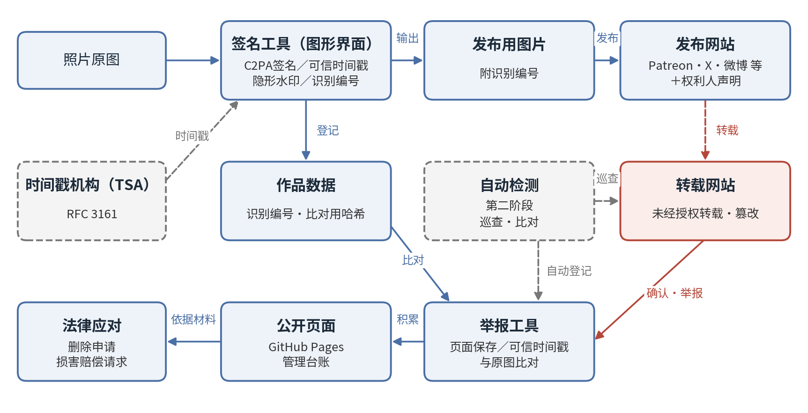
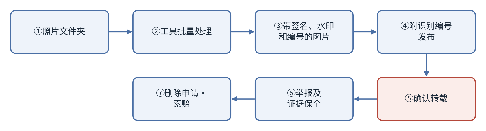

# Cosplay照片防盗图工具 企划草案

2026-09-24 · 石川宗  
Word版: [Cosplay照片防盗图工具 企划草案.docx](Cosplay照片防盗图工具%20企划草案.docx)

© 2026 株式会社流山ソフトウェア開発（NRSD）负责开发者　石川宗　本企划草案以及根据本企划开发的软件，其著作权归株式会社流山ソフトウェア開発（NRSD）所有。（目前不明示许可证类型）但本企划所采用的第三方标准、算法及软件的权利，归各自的权利人所有（参见第14节）。

---

## 1. 背景及目的

本企划旨在使Cosplay照片的著作者及被摄者（以下称“权利人”）能够以较少的负担，对违背著作者意愿的转载及其他违法转载行为进行检测、证明和法律应对。所开发的工具将在GitHub上于许可证规定的范围内免费公开。

Cosplay是一项需要在服装、假发、道具、国际运费等方面投入相当费用的活动，照片既是其成果，在某些情况下也是权利人的收入来源。然而，未经授权的转载行为十分普遍，转载者中将转载视为“分享”的人不在少数。由于转载者人数众多，可见个人权利人放弃应对的情况。

本企划旨在减轻主张权利所需的负担，使个人权利人也能做好主张权利所需的准备，并为使用同一机制的权利人共同应对奠定基础。

## 2. 基本方针

目前，从技术上阻止违背著作者意愿的转载及其他违法转载行为本身仍有困难，本系统作为其前期阶段，旨在实现“检测、证明、威慑”。

- **检测**：以机器方式检测签名或水印被去除的图片，或经过篡改的图片。
- **证明**：以第三方可验证的形式，证明该图片为权利人最先发布的原图。
- **威慑**：事先明示权利及应对意图，并附上对照编号发布，使浏览者能够识别未经授权的转载。

去除签名或水印的行为本身，可能构成删除权利管理信息的违法行为［16］［19］［20］。因此，签名也可能成为证明去除者存在故意的材料。

## 3. 生效前提：在各发布平台上发布声明

**本系统的效力，以权利人本人在发布作品的所有网站上声明其对未经授权转载的应对方针为前提。** 仅附加签名和对照编号，并不能向浏览者及各平台表明权利人具有应对的意图。

声明中应载明以下事项：

- 权利归属（著作权及肖像权）
- 未经授权的转载以及去除签名和水印可能构成违法
- 确认存在未经授权的转载时，将提出删除申请并要求损害赔偿
- 对照编号的含义及确认照片是否为正版的方法
- 作品登记号（如已取得）

声明应发布在Patreon、X、Instagram、微博、小红书等所有发布作品的网站上。未发布声明时，转载者仍有主张不知道权利人意愿或出于分享目的的余地。发布声明后，转载即成为违背权利人明示意愿的行为，预计在证明故意及请求赔偿方面将更为有利。

## 4. 系统概要

本系统的构成如图1所示。

图1　系统构成图

每张照片均通过以下三个层级附加信息，即使其中任一层级被去除，也能够参照原图的记录。

|层级|内容|功能|
|---|---|---|
|C2PA签名［1］［3］［4］|基于国际标准的数字签名。记录作者、日期时间及识别编号，并附加基于RFC 3161的可信时间戳［8］|可检测像素级的篡改。第三方可在现有的公开验证网站上进行验证［15］|
|隐形水印|嵌入像素中的不可见信息（拟采用TrustMark等开源实现）［9］［10］［11］|即使签名在社交平台等处被去除，也能从图片参照原图的记录|
|比对用哈希|PDQ等感知哈希及图像特征［12］［13］|对经过重新压缩、缩放或裁剪的转载图片也能进行比对|

识别编号按作品逐一发放，并同时记录在C2PA清单及文件名中。文件名中的编号供权利人发布时参照；即使各平台更改了文件名，也可通过清单及水印进行比对。

处理流程如图2所示。

图2　处理流程

本处理不会改变照片的外观。

## 5. 使用者的作业

使用者需进行的作业如下。

|类别|作业内容|实施时间|
|---|---|---|
|准备|将照片或文件夹拖放至工具（也可从右键菜单执行）|每次发布前|
|发布|将文件名中附带的识别编号填写在配文中|每次发布时|
|声明|在所有发布作品的网站的个人主页上发布载明权利及应对意图的声明（本系统生效的前提；将提供英文及中文范文）|每个网站首次|
|举报|确认存在转载时，在举报页面登记该网址|确认转载时|
|应对|根据积累的记录，提出删除申请或损害赔偿请求|由权利人判断|

确认转载时无需立即应对。通过举报，证据即得到保全，之后可集中进行应对。

## 6. 工具构成

株式会社流山ソフトウェア開発（NRSD）的开发范围为签名工具、举报工具及部署在GitHub上的公开页面，以及将其相互联动的功能。

1. **签名工具（图形界面）**
   - 通过拖放照片或文件夹，输出附有C2PA签名、可信时间戳、隐形水印及识别编号的发布用图片。
   - 在Windows中，于资源管理器的右键菜单中登记“C2PA签名并导出”项目。
   - 识别编号附于文件名的开头或结尾，并将同一编号记录在清单中。
   - 以c2pa-python［14］为基础实现。
2. **举报工具**
   - 提供供权利人登记已确认转载的网址及图片的页面。
   - 登记的同时，自动保存该页面、对其哈希附加可信时间戳，并与原图进行比对。
3. **公开页面（GitHub Pages）**
   - 将被举报的转载页面及图片与签名者的作品编号相对应并加以积累。
   - 作为日后法律应对的管理台账发挥作用。

举报的登记仅限签名者本人，第三方不得登记。

## 7. 转载的举报及证据保全

证据在举报的同时自动保全，并附加可信时间戳，使其在转载页面被删除后仍可作为可用的记录。

- **可信时间戳**：git的提交时间为自行申报，不具有证明力，因此对所保存页面的哈希取得基于RFC 3161［8］的时间戳，并一并保存其证书。
- **比对结果的记录**：从转载图片中读取水印，并记录通过感知哈希与原图比对的结果。
- **各国证据的补强**：在中国，杭州、北京及广州的互联网法院认可记录在区块链上的电子证据［18］，因此通过中国境内的可信时间戳服务进行保全，被认为有助于当地的程序。在日本，可考虑使用公证文书或法律证据用的记录服务。
- **运营者的查明**：对于中国境内的网站，可通过依法须显示的ICP备案号［22］调查运营主体。对于境外网站，通过WHOIS及ASN调查［23］查明托管服务商，并向其滥用举报窗口发出通知。

公开页面的显示文字，默认采用“权利人举报为未经授权转载”“签名不一致”等事实性描述。

## 8. 权利的表明及法律应对

事先明示权利及应对意图，并标注登记号，是威慑及法律应对的前提。上述事项均无需高额费用。

- **权利的明示**：明示照片的著作权（根据与摄影师的合同持有或共有的部分）及被摄者本人的肖像权。无论摄影师为何人，肖像权均可由本人主张［17］。
- **法律依据的明示**：未经授权的转载可能侵犯著作权及肖像权，此外，去除签名或水印可能另行构成删除权利管理信息的违法行为［16］［19］［20］。根据中国《著作权法》，对故意侵权规定了赔偿数额一倍以上五倍以下的惩罚性赔偿，法定赔偿上限为500万元［16］。在美国，根据DMCA第1202条，在某些情况下无需证明实际损失即可请求法定赔偿［19］。
- **应对意图的表明**：表明在确认签名缺失或被篡改，或被扩散时，将提出删除申请并要求损害赔偿。表明的内容仅限于实际能够执行的范围。
- **登记号的标注**：中国版权保护中心的作品登记在作品发表后亦可申请，其登记证书在中国法院被广泛用作权利归属的证据。登记号应与作品一同展示［21］。
- **申请渠道**：微博、小红书、Bilibili等平台的侵权投诉窗口，向美国服务商发出的DMCA通知，以及向服务器服务商及运营者发出的通知。
- **共同应对**：使用同一机制的权利人增多后，可针对同一转载者或经营者提出大量申请。中国设有共同诉讼及代表人诉讼制度，在日本，提起大量小额诉讼也可能成为有效手段。

优先应对的对象为制作周边商品、有偿销售、挪用于广告、收录于AI训练数据等商业性利用。

## 9. 运营及责任范围

工具将在GitHub上公开，希望使用者可将其Fork并自行承担责任进行运营。NRSD对各Fork的运营结果不承担责任。

- **原始版本**：由NRSD制作并公开。AYA女士可选择以项目参与者身份加入原始版本，或自行Fork并运营。
- **Fork的运营**：签名者与被举报转载网站之间对应关系的准确性，由各Fork的运营者负责保证。
- **NRSD的提供范围**：签名工具、举报工具、公开页面、其联动功能以及获取识别编号的图形界面。运营方法由各使用者自行判断。

**关于法律应对的范围**：与本系统运营相关的法律诉讼，由本公司的专属律师统一应对。但这并不用于保护使用者的权利。针对未经授权转载的删除申请及损害赔偿请求，须由各使用者作为权利人自行提出。

## 10. 限制及注意事项

本系统并不能消除未经授权的转载本身，其效果仅限于导入工具后发布的照片。

- 导入前已发布的照片未附加签名及水印，对此应通过保存原始数据及作品登记来证明权利。
- 对于境外转载者，预计多数情况下仅能止于删除。但即便如此，采取了权利保护措施的记录仍将保留。
- 对于摄影师并非权利人本人的照片，应事先与摄影师确认权利归属。
- C2PA的验证图标可能被误认为AI生成的标识，因此应在声明中说明其表示真实性。

## 11. 实施项目

无论AYA女士是否使用，NRSD均将开发本工具。

- 签名工具：C2PA签名、可信时间戳、水印及识别编号的批量处理以及图形界面
- 右键菜单登记（Windows）
- 举报工具：网址登记、页面保存、可信时间戳及比对
- 公开页面：部署至GitHub Pages及举报数据的积累
- 声明范文（英文及中文）
- 申请文本的自动生成
- 在GitHub上公开并通知AYA女士

## 12. 第二阶段：自动检测应用

作为后续计划，将开发一款在网络上巡查、自动检测未经授权转载的图片及其刊载网站的自主型应用。第一阶段的工具以确认转载后进行举报为前提，而第二阶段则将检测本身自动化。

- **巡查**：定期巡查图片搜索结果及公开页面，收集作为比对对象的图片。
- **比对**：通过读取水印、PDQ等感知哈希及图像特征，与已登记的作品进行比对。
- **联动**：将匹配的图片自动登记到第一阶段的举报工具中，并完成证据保全及可信时间戳的附加。
- **待研究事项**：需要登录的社交平台及反爬措施较强的网站（微博、小红书等）的处理方式、与各网站服务条款的关系，以及巡查所需的负载及费用。

## 13. 本资料的定位及文件体系

本企划草案是设计计划的起草文件，资料按以下顺序编制。

1. **企划草案**（本资料）：构想及基本方针
2. **设计计划**：将本企划草案具体化，确定开发范围及实施内容
3. **设计书**：系统整体的架构及方式
4. **详细设计书**：各功能的实现规格

**设计计划由株式会社流山ソフトウェア開発（NRSD）发布。**

## 14. 第三方权利及许可

本企划所采用的标准、算法及软件的权利，归各自的权利人所有。NRSD享有权利的范围仅限于NRSD根据本企划独自开发的部分，第三方构成要素应按照各权利人规定的许可或使用条件使用。

|构成要素|权利人|许可・使用条件|参照|
|---|---|---|---|
|C2PA技术规范|C2PA（Coalition for Content Provenance and Authenticity）|C2PA规定的使用条件|［1］|
|c2pa-python|Content Authenticity Initiative|MIT License 及 Apache License 2.0|［14］|
|TrustMark|Adobe|MIT License|［9］［10］|
|PDQ|Meta Platforms|BSD License（ThreatExchange代码库）|［12］|
|RFC 3161、5280、8949、9052|IETF Trust|IETF规定的使用条件|［3］［4］［5］［8］|
|ISO/IEC 19566-5（JUMBF）|ISO、IEC|ISO及IEC规定的使用条件|［6］|

公开时，应将各构成要素的许可条款及著作权声明随软件一并提供，并确认其与NRSD所定许可的兼容性。由于第三方构成要素的使用条件可能发生变更，应在设计计划中确认最新条件。

## 15. 参考文献（技术背景及法律索引）

正文中［ ］内的编号对应以下文献。

### 来源证明及数字签名

［1］C2PA, *Content Credentials: C2PA Technical Specification*, Version 2.2. https://spec.c2pa.org/specifications/specifications/2.2/specs/C2PA_Specification.html（相关：第4节、第6节）

［2］C2PA Technical Working Group, *C2PA Content Credentials Explained: Addressing Common Questions and Updates*，2025年9月. https://c2pa.org/wp-content/uploads/sites/33/2025/10/content_credentials_wp_0925.pdf（相关：第4节）

［3］IETF RFC 5280, *Internet X.509 Public Key Infrastructure Certificate and CRL Profile*. https://www.rfc-editor.org/rfc/rfc5280（相关：第4节）

［4］IETF RFC 9052, *CBOR Object Signing and Encryption (COSE): Structures and Process*. https://www.rfc-editor.org/rfc/rfc9052（相关：第4节）

［5］IETF RFC 8949, *Concise Binary Object Representation (CBOR)*. https://www.rfc-editor.org/rfc/rfc8949（相关：第4节）

［6］ISO/IEC 19566-5, *JPEG Systems — Part 5: JPEG Universal Metadata Box Format (JUMBF)*.（相关：第4节）

［7］NIST FIPS 180-4, *Secure Hash Standard (SHS)*. https://nvlpubs.nist.gov/nistpubs/FIPS/NIST.FIPS.180-4.pdf（相关：第4节、第7节）

### 可信时间戳

［8］IETF RFC 3161, *Internet X.509 Public Key Infrastructure Time-Stamp Protocol (TSP)*. https://www.rfc-editor.org/rfc/rfc3161（相关：第4节、第6节、第7节）

### 隐形水印

［9］T. Bui, S. Agarwal, J. Collomosse, *TrustMark: Universal Watermarking for Arbitrary Resolution Images*, arXiv:2311.18297. https://arxiv.org/abs/2311.18297（相关：第4节）

［10］Adobe，TrustMark官方实现（MIT许可证）. https://github.com/adobe/trustmark（相关：第4节、第6节）

［11］Content Authenticity Initiative, *TrustMark FAQ*（作为C2PA认可水印方式的定位）. https://opensource.contentauthenticity.org/docs/trustmark/FAQ（相关：第4节）

### 基于感知哈希的比对

［12］Meta, *The TMK+PDQF Video-Hashing Algorithm and the PDQ Image Similarity Algorithm*（hashing.pdf）. https://github.com/facebook/ThreatExchange/blob/main/hashing/hashing.pdf（相关：第4节、第7节、第12节）

［13］*PDQ & TMK+PDQF – A Test Drive of Facebook’s Perceptual Hashing Algorithms*, arXiv:1912.07745. https://arxiv.org/abs/1912.07745（相关：第4节、第12节）

### 实现及验证

［14］Content Authenticity Initiative, c2pa-python. https://github.com/contentauth/c2pa-python（相关：第6节）

［15］Content Authenticity Initiative，Content Credentials验证网站. https://verify.contentauthenticity.org（相关：第4节）

### 法律及制度

［16］《中华人民共和国著作权法》（2020年修正）第十二条（作品登记）、第五十一条（权利管理信息）、第五十四条（损害赔偿）. WIPO Lex: https://www.wipo.int/wipolex/zh/legislation/details/21065（相关：第2节、第8节）

［17］《中华人民共和国民法典》第一千零一十八条、第一千零一十九条（肖像权）.（相关：第8节）

［18］《最高人民法院关于互联网法院审理案件若干问题的规定》（法释〔2018〕16号）第十一条. https://www.court.gov.cn/fabu/xiangqing/116981.html（相关：第7节）

［19］17 U.S.C. §1202（著作权管理信息的完整性）、§1203（民事救济）. https://www.law.cornell.edu/uscode/text/17/1202 、https://www.law.cornell.edu/uscode/text/17/1203（相关：第2节、第8节）

［20］日本《著作权法》（昭和45年法律第48号）第2条第1款第21项（权利管理信息）、第113条（视为侵权的行为）. https://laws.e-gov.go.jp/law/345AC0000000048（相关：第2节、第8节）

［21］中国版权保护中心（作品登记）. https://www.ccopyright.com.cn（相关：第8节）

［22］工业和信息化部ICP/IP地址/域名信息备案管理系统. https://beian.miit.gov.cn（相关：第7节）

［23］ICANN Lookup（RDAP/WHOIS）. https://lookup.icann.org（相关：第7节）
