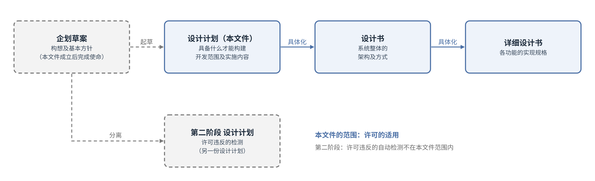
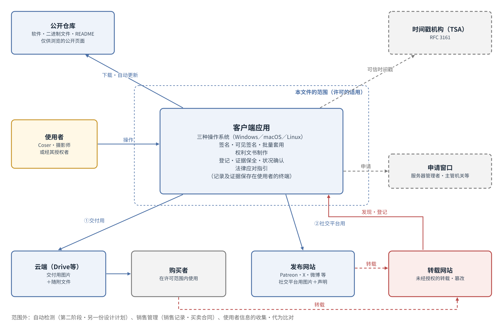
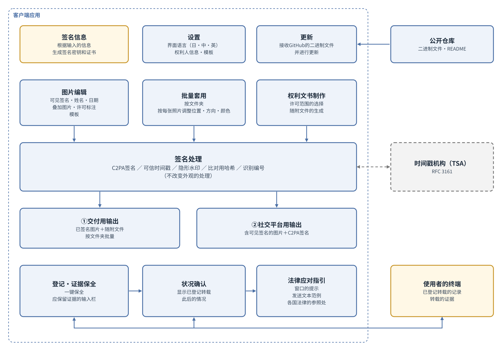
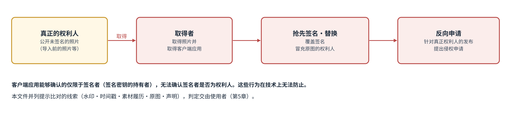
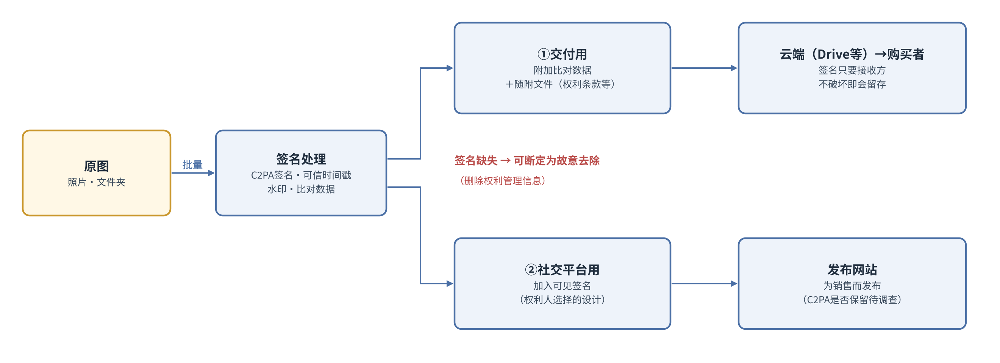
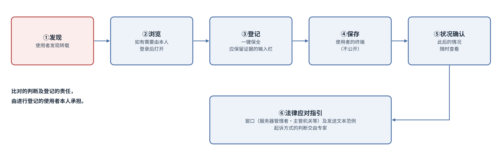
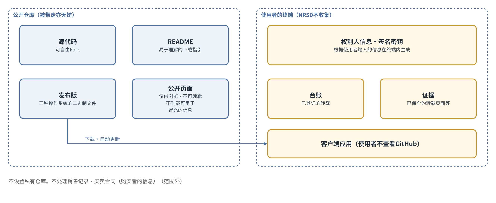

# Cosplay照片防盗图工具 设计计划书

第2版（草案）　2026-09-29 · 石川宗  
株式会社流山ソフトウェア開発（NRSD）  
Word版: [Cosplay照片防盗图工具 设计计划书.docx](Cosplay照片防盗图工具%20设计计划书.docx)

© 2026 株式会社流山ソフトウェア開発（NRSD）负责开发者　石川宗　本设计计划书以及根据本设计计划书开发的软件，其著作权归株式会社流山ソフトウェア開発（NRSD）所有。但本设计计划书中拟采用的第三方标准、算法及软件的权利，归各自的权利人所有（参见第17章）。

---

## 修订记录

|版次|日期|内容|编写|
|---|---|---|---|
|第1版（草案）|2026-09-29|以企划草案（2026-09-24）为起草文件新建|石川宗|
|第2版（草案）|2026-09-29|修改为本系统不收集使用者的信息、在客户端应用内完成全部处理。C2PA签名的证书由使用者输入的信息在终端内生成，不需要认证机构。冒充权利人者视为无法排除，改为提示比对的线索。废除私有仓库，记录及证据保存在使用者的终端。识别编号由客户端应用发放并自动记录在C2PA清单中，是否附加在文件名中由使用者选择（第1章至第5章、第7章、第10章、第12章至第16章）|石川宗|
|第2版（草案）|2026-09-30|订正第18章参考文献［20］的条款编号（日本《著作权法》中权利管理信息的定义自2018年修改后为第2条第1款第22项，第21项为技术性利用限制手段）|石川宗|

## 第1章　本文件的定位

### 1.1　本文件的目的

本文件针对“Cosplay照片防盗图工具”（以下称“本系统”），在编写设计书之前，定义需要具备哪些条件才能构建本系统。

本文件逐项列出并确定：使用者是谁，使用者如何、何时使用本系统，在哪些平台上运行，以什么作为开发基础，以及如何管理公开、分发及运营。

本文件并不规定实现方法。实现方法交由设计书规定；本文件明确设计书应作为前提的事项，以及应在设计书阶段详细调查的事项。

### 1.2　文件体系

企划草案对本系统的文件体系规定如下。

> 本企划草案是设计计划的起草文件，资料按以下顺序编制。企划草案（本资料）：构想及基本方针　设计计划：将本企划草案具体化，确定开发范围及实施内容　设计书：系统整体的架构及方式　详细设计书：各功能的实现规格
> （企划草案 第13节）

本文件相当于该体系中的“设计计划”。本文件与各文件的关系如图1所示。

图1　文件体系

企划草案第12节作为本系统第二阶段所记载的自动检测应用，作为与本文件不同的另一份设计计划处理（参见第13章）。

### 1.3　与企划草案的关系

企划草案是促成本文件起草的文件。本文件成立后，企划草案即完成其使命，其效力应次于本文件。

企划草案与本文件的记载不一致时，以本文件的记载为准。企划草案各节在本文件中如何处理，见第16章的对照表。

本文件引用企划草案的记载时，明示其为引用，并注明引用出处的节。

### 1.4　记载的区分

本文件按以下区分记载各事项。

|区分|含义|
|---|---|
|决定|本文件中已确定的事项。设计书应以此为前提|
|【需设计】|本文件仅规定要求、其实现方法必须由设计书规定的事项。目前尚无对策的事项|
|待调查|应在设计书阶段调查事实，并根据其结果规定实现方法的事项（一览见第14章）|
|未决|在本文件阶段保留结论的事项，以及尚未决定是否采用的候选（一览见第15章）|
|移交设计书|在计划阶段仅确认项目的存在，其内容由设计书规定的事项|

各章的决定事项按“D-章号-序号”的形式编号，以便从设计书中引用。

### 1.5　用语的定义

本文件所使用用语的含义如下。

|用语|含义|
|---|---|
|本系统|本文件所针对的系统整体。由客户端应用及公开仓库构成|
|客户端应用|在使用者的终端上运行的本系统软件|
|权利人|照片的著作者及被摄者（依企划草案第1节的定义）|
|使用者|使用本系统者。即权利人，或经其中任一方授权者（第3章规定）|
|签名者|持有签名密钥，并通过客户端应用对图片进行签名者|
|原图|权利人持有的、公开前的照片数据（包括RAW、未加工的数据及未公开的照片）|
|比对|将图像与权利人的记录（比对数据、原件、声明等）相对照，获取是否为同一作品以及谁是权利人的线索。本系统提供比对的手段，但不代为进行比对（第5章）|
|比对数据|为与原图比对而附加于图片的信息。包括C2PA签名（清单）、隐形水印及识别编号|
|比对用哈希|感知哈希及图像特征。不附加于图片，而是为比对而记录（记录位置为使用者的终端。记录格式未决。O-10“作品数据的记录格式”）|
|识别编号|由客户端应用按作品逐一发放，并自动记录在C2PA清单中的编号。是否同时附加在保存的文件名之后，由使用者在保存时选择（企划草案第4节的识别编号。文件名中的记录由本文件修改。见第16章）|
|交付用图片|通过销售交付给购买者的图片|
|社交平台用图片|为销售而发布到发布网站的图片。加入可见签名|
|可见签名|以肉眼可见的形式加入图片上的权利人姓名、账号名、日期、叠加图片、许可标注及其他标示|
|许可范围|对于交付用图片，权利人许可购买者使用的范围|
|权利文书|载明许可范围及有关权利的条款的文书|
|随附文件|与交付用图片一同附上的权利文书及其他文件|
|声明|权利人在发布作品的所有网站上发布的、对未经授权转载的应对方针（依企划草案第3节）|
|声明所在账号|权利人发布声明的、在发布网站等处的权利人本人的账号|
|转载者|违背权利人的意愿转载图片者|
|违法者|未经权利人许可公开图片，或超出许可范围使用图片，并给权利人造成损害者。不问其是否为购买者|
|登记|使用者将发现的转载记录到客户端应用中（相当于企划草案中的“举报”）|
|权利人信息|表示谁是权利人的信息（昵称、声明所在账号等）。由使用者输入，记录在C2PA签名的证书及图像中。本系统不收集|
|证据保全|在登记的同时，留下供日后应对使用的记录|
|公开仓库|公开本系统软件的GitHub仓库|

## 第2章　目的及范围

### 2.1　目的

企划草案对本系统的目的规定如下。

> 本企划旨在使Cosplay照片的著作者及被摄者（以下称“权利人”）能够以较少的负担，对违背著作者意愿的转载及其他违法转载行为进行检测、证明和法律应对。
> （企划草案 第1节）

本文件继承该目的，并对本系统所要保护的对象规定如下。

- 本系统所保护的，是权利人对其自身照片所享有的权利（著作权及肖像权）。
- 本系统通过许可的适用，即使权利人处于能够在照片上表示权利、规定许可范围、并对超出该范围的使用主张权利的状态，来保护该权利。

本系统的软件本身（源代码及二进制文件）并非本系统保护的对象。因为即使软件被复制或被带走，权利人的权利也不会受到损害。他人冒充权利人，在技术上无法防止。本系统在怀疑有冒充时提示比对的线索，使权利人能够证明自己的权利（参见第5章）。

### 2.2　基本方针

企划草案将本系统的基本方针规定为“检测、证明、威慑”。

> 目前，从技术上阻止违背著作者意愿的转载及其他违法转载行为本身仍有困难，本系统作为其前期阶段，旨在实现“检测、证明、威慑”。
> （企划草案 第2节）

本文件将其中的威慑定位为本系统的最大价值。因为我们认为，表明权利人表示权利、明示许可范围、并具有在适当时候采取应对的意图和手段，在实际采取应对之前，就具有使人打消转载念头的效果。

实际应对未能奏效时，应将其作为课题转入下一步改进；需要法律判断的事项，应咨询专家（参见第11章）。

### 2.3　本文件的范围

本文件所针对的范围为许可的适用。具体而言，以下事项属于范围之内。

- C2PA签名所需信息的输入，以及比对线索的提示（第5章）
- 对图片的签名、比对数据的附加及可见签名的加入（第7章）
- 图片编辑界面、批量套用及权利文书制作界面（第8章）
- 许可范围的选择及随附文件的生成（第9章）
- 使用者本人对转载的登记、证据保全及状况确认（第10章）
- 法律应对的指引（第11章）
- 公开仓库的管理、分发及更新（第12章）

本系统的范围如图2所示。

图2　系统的范围

### 2.4　范围之外

以下事项属于本文件的范围之外。

|范围之外的事项|理由|处理|
|---|---|---|
|自动检测（巡查网络并自动检测转载）|与许可的适用轴线不同，属于许可违反的检测|作为另一份设计计划（第13章）|
|销售管理（销售记录、买卖合同及购买者信息的管理）|本系统的目的是阻止侵权，而非销售管理|不处理。需要者应Fork公开仓库并加以改造，其结果NRSD概不过问|
|诉讼及其他法律程序的代理及法律判断|本系统并不能代替法律专家|不进行。仅限于提示窗口（第11章）|
|购买者的特定|如第9章所规定，追究的对象为违法者，不问其是否为购买者|不进行|
|使用者信息的收集，以及代为比对|本系统提供比对的手段，但不代为进行比对。不收集使用者的信息，在客户端应用内完成|不进行（第5章）|

### 2.5　对企划草案中限制的继承

企划草案第10节所载的以下限制，在本文件中亦予以继承。

> 本系统并不能消除未经授权的转载本身，其效果仅限于导入工具后发布的照片。
> （企划草案 第10节）

- 导入前已发布的照片未附加签名及比对数据。对于这些照片，应通过保存原图及作品登记来证明权利（依企划草案第10节）。
- 导入前已发布的照片，可能成为第5章所示冒充行为的对象。

### 2.6　本章的决定事项

|编号|决定事项|
|---|---|
|D-2-1|本系统所保护的，是权利人对其自身照片所享有的权利（著作权及肖像权）|
|D-2-2|本系统的范围为许可的适用|
|D-2-3|本系统的最大价值为威慑|
|D-2-4|自动检测作为另一份设计计划|
|D-2-5|不处理销售管理。需要者应Fork并加以改造，其结果NRSD概不过问|
|D-2-6|不进行法律程序的代理及法律判断|

## 第3章　相关人员及使用者

### 3.1　相关人员

将与本系统相关的人按人的种类整理，共有以下5种。

|种类|与本系统的关系|本系统之内或之外|
|---|---|---|
|Coser（被摄者）|享有肖像权。进行照片的销售及发布|之内（使用者）|
|摄影师|享有著作权（根据与Coser的合同，归属可能不同）|之内（使用者）|
|转载者|违背权利人的意愿转载图片。经权利人授权而转载者不属于转载者，作为站在权利人一方者处理|之外|
|浏览者|在发布网站上，通过配文及声明识别照片是否为正版。签名的验证通过现有的公开验证网站进行［15］|之外|
|运营者（NRSD、Fork的运营者）|是制作本系统者，在设计上始终存在|不在系统中定义|

此外，发布网站、转载网站的运营者、托管服务商、时间戳机构、法院、申请窗口及其他组织也与本系统相关，但这些不是人，作为本系统外部的组织处理。

### 3.2　使用者的定义

本系统的使用者为图片的权利人，以及经其中任一方授权者。即，使用者为Coser、摄影师，或经其中任一方授权者。

该定义由以下整理导出。

- 浏览者不使用本系统，而是通过发布网站及现有的公开验证网站达成目的，因此处于本系统之外。
- 运营者是本系统的制作者，无需在系统中定义。
- 未经授权而转载者不使用本系统。经授权者是站在Coser或摄影师一方的人。
- 因此，使用本系统者限于图片的权利人及经其授权者。

### 3.3　使用者的实际情况

使用者按具有以下特征处理。

- 使用者不是技术人员。不以理解GitHub为前提，使用者须能够在不查看GitHub的情况下使用本系统。
- 使用者跨越国家存在。除日本、中国及英语圈外，也设想居住在加拿大等国的使用者。
- 使用者喜爱角色及可爱的事物。外观不佳的软件不会被使用（参见第8章）。
- 使用者为销售照片而在社交平台上发布，并通过云端（Google Drive等）共享将已售照片交付给购买者。

#### 3.3.1　使用者的示例

NRSD于2026年9月确认的某位使用者（居住在加拿大的Coser）的示例如下。这是使用者实际情况的一个示例，并作为本文件各章的依据之一。

- 在支援服务（Patreon）上以英语开展活动。
- 在发布的图片上，以手写风格的文字加入账号名及支援服务（包括面向中国的支援服务）的所在，作为可见签名。
- 可见签名放置在不遮挡被摄者的背景部分，并按每张照片调整位置、方向（横排，或旋转90度的竖排）及颜色（根据背景采用白色或黑色）。
- 逐张调整可见签名的作业需要花费功夫。
- 通过云端（Google Drive）共享，将原尺寸图片交付给支持者。

### 3.4　前提

以下事项不进行访谈，作为前提构建本系统。

- 交付的实际情况（途径、格式及尺寸）、可见签名的实际情况，以及与摄影师的权利关系，均按由Coser本人掌握处理。
- 前提存在不足时，应在使用者能够使用本系统之后，根据使用者的指正加以改进。在无法使用的状态下进行访谈，使用者也无法理解所谈为何事。

### 3.5　非预期的相关人员

除第3.1节所列者外，冒充权利人者也可能使用本系统。此类人在技术上无法排除。本文件在第5章中规定此类人出现时比对的处理方式。

### 3.6　本章的决定事项

|编号|决定事项|
|---|---|
|D-3-1|使用者为图片的权利人（Coser及摄影师），以及经其中任一方授权者|
|D-3-2|浏览者及运营者不在本系统中定义|
|D-3-3|使用者须能够在不查看GitHub的情况下使用本系统|
|D-3-4|以交付、可见签名及与摄影师的权利关系由Coser本人掌握为前提构建|
|D-3-5|不进行访谈，根据可以使用后的指正加以改进|
|D-3-6|以无法排除冒充权利人者为前提，在第5章中规定比对的处理方式|

## 第4章　系统的整体情况

### 4.1　构成要素

本系统由以下要素构成。

|构成要素|作用|
|---|---|
|客户端应用|在使用者的终端上运行，进行签名、可见签名、批量套用、权利文书的制作、登记、证据保全、状况确认及法律应对的指引。将权利人信息、签名密钥、作品数据、已登记转载的记录及证据保存在使用者的终端|
|公开仓库|存放源代码、二进制文件、README及仅供浏览的公开页面|
|外部组织|时间戳机构、发布网站、云端、申请窗口等。本系统利用这些组织，或引导使用者前往|

### 4.2　系统模块

将客户端应用的内部按功能的集合（模块）划分，如图3所示。图3表示在本文件阶段所能设想的构成，各模块的方式由设计书规定。

图3　系统模块

|模块|功能|相关章|
|---|---|---|
|签名信息|根据使用者输入的信息，在终端内生成C2PA签名所用的签名密钥及证书|第5章“C2PA签名所需的信息及冒充权利人者”|
|设置|管理界面语言及模板|第8章“界面及易用性”、第9章“权利文书及语言”|
|更新|接收公开仓库的二进制文件，更新客户端应用|第12章“仓库的管理、分发及更新”|
|图片编辑|将可见签名、姓名、日期、叠加图片及许可标注作为模板制作并套用|第8章“界面及易用性”|
|批量套用|按文件夹处理，并按每张照片调整位置、方向及颜色|第8章“界面及易用性”|
|权利文书制作|选择许可范围，生成随附文件|第9章“权利文书及语言”|
|签名处理|附加或记录C2PA签名、可信时间戳、隐形水印、比对用哈希及识别编号|第7章“照片的形态及处理流程”|
|交付用输出|将已签名的图片与随附文件按文件夹批量输出|第7章“照片的形态及处理流程”、第9章“权利文书及语言”|
|社交平台用输出|对加入可见签名的图片附加C2PA签名后输出|第7章“照片的形态及处理流程”|
|登记及证据保全|登记发现的转载，并保全证据（保存在使用者的终端）|第10章“转载的登记、证据保全及状况确认”|
|状况确认|显示已登记的转载此后的情况|第10章“转载的登记、证据保全及状况确认”|
|法律应对指引|显示窗口、发送文本的范例及各国法律的参照处|第11章“法律应对的支持范围”|

### 4.3　使用的场景

使用者使用客户端应用的场景如下。

|场景|使用者的作业|实施时间|
|---|---|---|
|准备|输入C2PA签名所需的信息，准备可见签名的模板|首次，以及每次变更时|
|声明|在发布作品的所有网站上发布声明（依企划草案第3节）|每个网站首次|
|销售|批量处理交付用文件夹，并与随附文件一同上传至云端|每次销售时|
|发布|制作社交平台用图片，并发布到发布网站|每次发布时|
|登记|发现转载时，通过客户端应用登记|发现转载时|
|确认|确认已登记转载的状况|随时|
|应对|按照指引，由权利人本人提出申请或采取其他应对|由权利人判断|

企划草案第5节规定，确认转载时无需立即应对。本文件继承这一点。

> 确认转载时无需立即应对。通过举报，证据即得到保全，之后可集中进行应对。
> （企划草案 第5节）

## 第5章　C2PA签名所需的信息及冒充权利人者

### 5.1　C2PA签名所需的信息

C2PA签名通过X.509格式的证书及与之对应的签名密钥进行［1］。C2PA技术规范并未要求签名所用证书的发放者具备特定资格。

使用者未必了解C2PA签名所需的信息（证书的内容）。本系统根据使用者在输入栏中填写的信息（昵称、声明所在账号等），在客户端应用内生成签名密钥和证书。

本系统不收集使用者的信息。签名密钥、证书及输入的信息仅保存在使用者的终端内。使用本系统时，不要求登记电子邮件地址或其他信息。

以这种方式生成的证书所作的签名，可以在现有的公开验证网站上确认未被篡改（有效），但签名者不会显示为经C2PA信任列表担保（受信任）［24］。

### 5.2　冒充权利人者

任何人都可以从公开仓库取得并使用客户端应用（参见第12章）。因此，持有他人照片者可以进行以下行为。该流程如图4所示。

- 对权利人尚未签名的照片（导入前已发布的照片、泄露的原图等），先于权利人进行C2PA签名。
- 从权利人已进行C2PA签名的图像中去除或覆盖签名，替换为自己的签名。
- 以利用本系统制作的记录为依据，针对真正的权利人的发布提出侵权申请。

图4　冒充权利人者的行为

这些行为在技术上无法防止。本文件不以防止这些行为为目标，而以在发生时提示权利人证明自身权利的线索为目标。

### 5.3　本人性与权利性

在处理这一问题时，本文件将应确认的事项区分为以下两项。

|区分|应确认的事项|线索|
|---|---|---|
|本人性|谁进行了签名|签名所用的证书（包括使用者输入的信息）|
|权利性|签名者是否为该照片的权利人（或经其授权者）|在声明所在账号（仅本人可写入）上揭示签名密钥的指纹等，并与证书进行比对|

仅凭本人性无法证明权利性。因为这无法防止取得他人照片者以自己的证书抢先签名。

作为权利性线索所列的与声明所在账号的比对，利用的是企划草案第3节作为生效前提的声明。权利人在发布作品的所有网站的个人主页上发布声明。在该处同时揭示签名密钥的指纹等，看到图像的任何人都可以比对确认“该账号的持有者即为该签名密钥的持有者”。由于个人主页仅本人可写入，冒充者无法通过针对真正权利人账号的这一比对。但是，冒充者在自己的账号上发布图像并揭示自己的指纹的情形，以及真正权利人的账号被盗用的情形，不在此限。对于前者，哪个账号最先发布了该照片可作为线索（第5.5节）。

本系统提供该比对的手段（算法），但不代为进行比对。比对结果由进行比对者判断。

### 5.4　基于持有原图的证明

持有原图（RAW、未加工的数据及同一次拍摄中未公开的照片）本身，就可能成为权利性的证据。仅对公开用图片进行签名，会输给抢先签名者，但原图只有权利人持有。设计书应将证明持有原图的方法作为比对线索之一加以规定。

### 5.5　签名被覆盖时比对的处理

对他人覆盖C2PA签名并附上自己签名的图像进行比对时，本系统将以下线索并列提示，不判定哪一方为权利人。

|线索|所示内容|
|---|---|
|隐形水印|嵌入像素的识别编号，即使C2PA签名被替换也会保留。如与替换者清单中的记录不一致，即为替换的痕迹|
|可信时间戳|使用者终端中保存的记录（识别编号与可信时间戳的组合）如早于替换者的签名，则表明这一点|
|素材的履历|如替换者保留了原来的清单，则显示原来的签名者|
|原图|只有权利人持有RAW、更大的图像等|
|声明|哪一方的签名密钥与最初发布该照片的账号上的声明一致|

判断及应对（参见第11章）由使用者决定。

### 5.6　待调查

- 关于C2PA签名用证书：在终端内生成的证书应满足的要求，以及对C2PA信任列表的对应（I-01“C2PA签名用证书”）
- 声明所在账号与签名密钥的比对，在各发布网站上是否可行（I-02“声明所在账号与签名密钥的比对”）

C2PA运营着符合性计划（Conformance Program），其信任列表（C2PA Trust List）于2025年年中取代临时信任列表（Interim Trust List）而启用［24］。

### 5.7　本章的决定事项

|编号|决定事项|
|---|---|
|D-5-1|本系统不确认使用者，不收集使用者的信息。使用本系统不要求登记|
|D-5-2|C2PA签名的证书，根据使用者输入的信息在客户端应用内生成。不需要认证机构|
|D-5-3|冒充权利人者的行为（抢先签名、替换签名及反向申请）视为无法防止，提示比对的线索。不作判定|
|D-5-4|将本人性与权利性区分处理|
|D-5-5|本系统提供比对的手段，但不代为进行比对|

## 第6章　平台及开发基础

### 6.1　平台

客户端应用为在Windows、macOS及Linux三种操作系统上运行的桌面应用。即使包括图片编辑界面，图形界面也不会变得复杂，判断对三种操作系统的支持不会造成过大负担。

本系统不作为网站构建。未经授权的转载，是由于照片被上传到网络上而产生的问题。若将本系统再次放到网络上，本系统本身将不可避免地成为攻击对象。

此外，企划草案第6节规定了在Windows右键菜单中的登记。本文件将支持的操作系统扩展为三种，是否设置右键菜单等各操作系统的集成功能，由设计书决定。

### 6.2　开发基础

开发基础在本文件中不固定为特定的库。在计划阶段固定实现所用的库，只会缩小选择范围，没有任何益处。

企划草案第6节有以下记载。

> 以c2pa-python［14］为基础实现。
> （企划草案 第6节）

该记载并非出于固定实现基础的意图。本文件不继承该记载。

开发基础由设计书从满足以下条件者中选定。

|条件|理由|
|---|---|
|能在三种操作系统上运行|依第6.1节|
|能自由设计外观|使用者不使用外观不佳的软件（第8章）|
|便于处理图片编辑|需要图片编辑界面及批量套用（第8章）|
|能处理C2PA签名、隐形水印及比对用哈希|需要签名处理（第7章）|
|具备或能够加入自我更新的机制|依第12章|

### 6.3　开发基础的候选

2026年9月29日确认的各构成要素的情况如下。

|构成要素|已确认的事实|
|---|---|
|c2pa-python|用于从Python使用c2pa-rs（Rust实现）的组件。MIT License及Apache License 2.0［14］|
|TrustMark|有Python（使用PyTorch）、JavaScript（使用ONNX，仅读取）及Rust的实现。MIT License［10］|
|PDQ|官方有C++、PHP、Python、Java及WASM的实现。Rust及C#为第三方实现。BSD License［12］［25］|
|Tauri|界面用HTML及CSS制作，处理用Rust编写。支持Windows、macOS及Linux，具备自我更新功能。MIT License或Apache License 2.0［26］|

根据这些事实，界面用HTML及CSS制作从而可自由设计外观、处理侧使用c2pa-rs及TrustMark的Rust实现的构成（基于Tauri的构成），是满足第6.2节条件的候选。但这仅为候选，是否采用由设计书决定（参见第15章）。

即使界面用HTML及CSS制作，界面也仅在使用者的终端内显示，并不公开到互联网上。因此，这与第6.1节“不作为网站构建”的方针并不矛盾。

### 6.4　本章的决定事项

|编号|决定事项|
|---|---|
|D-6-1|客户端应用为在Windows、macOS及Linux上运行的桌面应用|
|D-6-2|本系统不作为网站构建|
|D-6-3|开发基础在本文件中不固定为特定的库。不继承企划草案第6节中有关c2pa-python的记载|
|D-6-4|开发基础由设计书从满足第6.2节条件者中选定|

## 第7章　照片的形态及处理流程

### 7.1　C2PA签名

本系统对输出的所有图片附加C2PA签名。

企划草案第4节规定通过C2PA签名、隐形水印及比对用哈希三个层级附加信息。本文件继承这一点。此外，企划草案第4节的图1表示将识别编号及比对用哈希作为“作品数据”登记的构成，本文件将其记录位置定为使用者的终端（D-12-3“权利人信息、签名密钥、作品数据、台账及证据保存在使用者的终端，NRSD不收集”），记录格式作为未决（O-10“作品数据的记录格式”）。识别编号由客户端应用发放，并自动记录在C2PA清单中。是否同时附加在保存的文件名之后，由使用者在保存时选择；识别编号也在客户端应用的界面上显示（D-7-7“识别编号由客户端应用发放，并自动记录在C2PA清单中。是否附加在文件名之后，由使用者在保存时选择”）。

下表引用自企划草案第4节的表。

|层级|内容|功能|
|---|---|---|
|C2PA签名［1］［3］［4］|基于国际标准的数字签名。记录作者、日期时间及识别编号，并附加基于RFC 3161的可信时间戳［8］|可检测像素级的篡改。第三方可在现有的公开验证网站上进行验证［15］|
|隐形水印|嵌入像素中的不可见信息（拟采用TrustMark等开源实现）［9］［10］［11］|即使签名在社交平台等处被去除，也能从图片参照原图的记录|
|比对用哈希|PDQ等感知哈希及图像特征［12］［13］|对经过重新压缩、缩放或裁剪的转载图片也能进行比对|

### 7.2　两条流程

本系统根据照片的用途，设置以下两条流程。处理流程如图5所示。

图5　处理流程

|项目|①交付用|②社交平台用|
|---|---|---|
|目的|通过销售将图片交付给购买者|为销售而发布到发布网站|
|途径|通过云端（Google Drive等）共享，按文件夹批量交付|发布到发布网站（Patreon、X、微博等）|
|C2PA签名|附加|附加|
|比对数据|附加于所有图片|附加|
|可见签名|未决（O-11“交付用图片的可见签名”）|加入（权利人选择的设计）|
|随附文件|附上（第9章）|不附上|
|签名的留存|只要接收方不故意去除即会留存|可能被发布网站去除（待调查）|

### 7.3　交付用流程

使用者通过云端将已售图片直接交付给购买者。在此途径中，附加于图片的签名只要接收方不故意去除即会留存。

因此，交付的图片中签名缺失时，可以断定是接收方故意去除的。去除签名或水印的行为本身，可能构成删除权利管理信息的违法行为［16］［19］［20］［27］。

已售图片若没有C2PA签名，购买该图片者即可冒充权利人。目前，使用者与购买者之间有关权利的约定，在任何地方都没有写明。本系统通过对交付用图片附加C2PA签名及比对数据，并以随附文件表明权利的归属，来应对这一问题（参见第9章）。

### 7.4　社交平台用流程

使用者在社交平台上发布，是为了销售照片。因此，社交平台用图片需要加入表明权利归属的可见签名。在社交平台用图片上，权利人的姓名以肉眼可见的程度显示并无不可。

可见签名的内容及设计由权利人选择。可见签名的制作及套用，通过图片编辑界面及批量套用进行（参见第8章）。

发布网站在上传时是保留还是去除C2PA签名，不经调查无从得知。存在去除签名的网站是完全可以想见的。在社交平台用流程中，应在C2PA签名之外，提供通过可见签名及隐形水印保护权利的手段。

### 7.5　待调查

- 各发布网站及Cloud在上传时是否保留C2PA签名（I-03“发布网站及Cloud对C2PA签名的保留”）

### 7.6　本章的决定事项

|编号|决定事项|
|---|---|
|D-7-1|对输出的所有图片附加C2PA签名|
|D-7-2|继承企划草案第4节的三个层级（C2PA签名、隐形水印、比对用哈希）|
|D-7-3|设置①交付用及②社交平台用两条流程|
|D-7-4|对交付用图片附加比对数据，并附上随附文件|
|D-7-5|对社交平台用图片加入权利人选择的设计的可见签名|
|D-7-6|签名的缺失，按可以断定为接收方故意去除处理|
|D-7-7|识别编号由客户端应用发放，并自动记录在C2PA清单中。是否附加在文件名之后，由使用者在保存时选择|

## 第8章　界面及易用性

### 8.1　外观

客户端应用应具有良好的外观。作为使用者的Coser喜爱角色及可爱的事物。外观不佳的软件，即使功能出色也不会被使用。

外观作为与本系统效力直接相关的要求处理。因为若不被使用者使用，签名和声明都不会被附加，第2.2节所规定的威慑也无法发挥作用。

### 8.2　界面

客户端应用应具备以下界面。

|界面|目的|主要要求|
|---|---|---|
|图片编辑界面|制作社交平台用图片的可见签名|能以权利人喜爱的设计，将姓名、日期、叠加图片及许可标注作为模板制作并套用|
|批量套用|按文件夹处理|能将模板批量套用于文件夹内的图片。能按每张照片调整位置、方向及颜色|
|权利文书制作界面|选择许可范围，制作随附文件|能以单选按钮等易于理解的方法，选择对所售图片授予多大范围的权利|

登记（第10章）、状况确认（第10章）、法律应对的指引（第11章）及其他功能以何种界面构成，由设计书决定。各界面的详细内容也由设计书决定。

### 8.3　编辑与批量套用的兼顾

能够逐张编辑图片的界面与按文件夹批量套用的功能，乍看是相互矛盾的要求。本文件通过将在编辑界面中制作的设计保存为模板，并使该模板既能逐张套用、也能按文件夹套用，来兼顾两者。

如第3.3.1节的示例所示，使用者按每张照片调整可见签名的位置、方向及颜色。即使在批量套用中，也须能够按每张照片调整避开被摄者的位置及与背景相配的颜色。

### 8.4　本章的决定事项

|编号|决定事项|
|---|---|
|D-8-1|客户端应用应具有良好的外观。外观作为与本系统效力直接相关的要求处理|
|D-8-2|具备图片编辑界面、批量套用及权利文书制作界面。其他界面的构成由设计书决定|
|D-8-3|将在编辑界面中制作的设计作为模板，既能逐张套用，也能按文件夹套用|
|D-8-4|即使在批量套用中，也能按每张照片调整位置、方向及颜色|
|D-8-5|界面的详细内容由设计书决定|

## 第9章　权利文书及语言

### 9.1　许可范围的选择

权利有多种类型。权利人应在销售时，选择对所售图片向购买者授予多大范围的权利。选择在权利文书制作界面中，以单选按钮等易于理解的方法进行（参见第8章）。

作为选项设置的权利类型，由设计书决定。

销售时选择的许可范围，将成为日后登记转载时判断该转载“抵触了什么”的基准（参见第10章）。

### 9.2　随附文件

为销售而按文件夹上传至云端的图片，应附上载明以下事项的随附文件。

- 有关权利的条款（包括购买不转移权利的意旨）
- 许可范围
- 不得擅自将图片转交他人的一句话
- 比对数据被删除后在许可范围之外使用时，权利人可能采取何种手段
- 何种行为可能被追究何种责任

随附文件也用于帮助对权利认识不足者。可以认为，大多数购买者并不认为购买图片就能连同权利一并取得。随附文件不作为措辞强硬的合同，而是作为陈述事实的文件处理。即使担心写入随附文件会影响销售，只要在交付的目录中表明了权利的背景即可。

随附文件中“不得擅自将图片转交他人”的一句话若在转交过程中缺失，并非权利人的过失所致。

### 9.3　针对的国家

权利文书的内容，因国家（法域）而非语言而异。即使同属英语圈，美国、英国、加拿大及澳大利亚的法律也各不相同。因此，“英语”这一区分，作为权利文书的区分并不成立。

本文件对权利文书针对的国家规定如下。

- 将涵盖所有国家的信息作为链接目标公开。
- 仅对购买者中常见的国籍，以文本形式附上文稿。
- 不根据所选购买者的国家改变文稿。

购买者中常见的国籍，按由权利人本人掌握处理。在Patreon等销售平台上能够在多大程度上知道购买者的国家，由NRSD通过实际使用加以确认（I-07“购买者国家的掌握”）。

### 9.4　追究的对象

本系统中追究的对象，是公开图片并给权利人造成损害的违法者。不问其是否为购买者。

直接追究购买图片者并不现实。因为图片也可能通过USB等方式被复制和转交。若直接追究违法者，就无需特定购买者，权利人销售时的手续也不会增加。

发生转载时，转载网站服务器的所在，按通过调查可以查明处理。调查后仍无法查明时，放弃对该转载的应对。

### 9.5　准据法的思路（参考）

在确定权利文书的措辞时，以下述思路作为参考。以下并非法律意见，在确定措辞之前须经专家确认。

|层级|内容|准据法的思路|
|---|---|---|
|许可范围（合同）|许可什么|由当事人选择准据法较为普遍，可以考虑明记以销售者的国家为准据法。许可范围的内容本身，可以采用不依赖于国家的写法|
|侵权（许可范围之外的使用）|被追究什么|适用要求保护的国家的法律（《伯尔尼公约》第五条第二款［28］）。由于事先无法知道侵权将在何处发生，因此无法事先固定国家|

《伯尔尼公约》规定，在联盟各国享有和行使著作权不需要履行任何手续［28］。此外，《世界知识产权组织版权条约》第十二条规定，缔约方有义务对未经许可去除或改变权利管理信息等行为提供法律救济［27］。企划草案第2节所列的中国、美国及日本的规定［16］［19］［20］，均与此相对应。

### 9.6　适用的示例

通过以下示例确认本章的思路。

- 居住在加拿大的Coser，通过美国企业的机制（Patreon等）销售图片，并通过Google Drive交付。
- 购买者居住在中国。
- 购买者擅自在中国的服务器上搭建网站，使不特定多数人能够下载图片。

在该示例中，侵权是因在中国的服务器上公开而产生的。按照本文件的思路，该侵权依中国法律追究。加拿大及中国均为伯尔尼联盟成员国，加拿大著作者的作品在中国同样受到保护。销售机制属于美国企业，以及交付使用了Google Drive，均不决定侵权所适用的法律。

可以追究的事项包括：著作权侵权（未经许可的公开及传播）、已去除比对数据时的删除权利管理信息［16］，以及被摄者本人的肖像权［17］。应对的步骤可以考虑：按企划草案第7节的方法（ICP备案号［22］等）查明运营者、通知删除，以及必要时向法院提起诉讼。作品登记［21］可能补强表明权利归属的证据。

在该示例中，合同（许可范围）主要可以认为发挥如下作用：驳回“既然买了，就以为可以使用”的主张，并作为表明故意的材料。

这些条款编号及程序依据企划草案的参考文献及NRSD的调查，在确定措辞之前须经专家确认。

### 9.7　界面的语言

客户端应用的界面语言为日语、中文及英语。对其他语言有要求时，日后追加。

### 9.8　本章的决定事项

|编号|决定事项|
|---|---|
|D-9-1|权利人在销售时选择授予多大范围的权利|
|D-9-2|以销售时选择的许可范围，作为判断转载抵触了什么的基准|
|D-9-3|对交付用图片附上载明第9.2节所定事项的随附文件|
|D-9-4|随附文件中加入不得擅自将图片转交他人的一句话。其缺失并非权利人的过失所致|
|D-9-5|将涵盖所有国家的信息作为链接目标公开，仅对购买者中常见的国籍附上文本文稿|
|D-9-6|追究的对象为违法者，不问其是否为购买者|
|D-9-7|服务器的所在按通过调查可以查明处理，无法查明时放弃|
|D-9-8|界面语言为日语、中文及英语，根据要求追加|

## 第10章　转载的登记、证据保全及状况确认

### 10.1　定位

使用者自行发现并登记转载的功能，包含在本文件的范围（许可的适用）之内。发现自己的照片被擅自公开的使用者，若不能当场主张权利，附加签名就失去了意义，本系统也将毫无用处。

该功能与由机器巡查网络检测转载的自动检测（第13章）轴线不同。登记是使用者本人适用许可的行为。

### 10.2　登记的流程

登记的流程如图6所示。

图6　登记及证据保全的流程

- 使用者发现转载。
- 如为需要登录的页面，由使用者本人登录后浏览。不要求客户端应用取得需要登录的页面。
- 使用者通过客户端应用一键登记。登记的同时保全证据。使用者无需知道哪些是作为证据所必需的。
- 在登记界面中设置提示“这类证据也最好保留”的输入栏。保留多少证据，交由使用者本人决定。
- 已保全的证据保存在使用者的终端。
- 使用者可以随时通过客户端应用查看已登记的转载此后的情况。
- 采取应对时，按照法律应对的指引（第11章）进行。

### 10.3　日后应表明的事项

证据保全，是指在发现的时点，留下能在日后主张权利时表明当时发生了什么的状态。日后应表明的事项为以下5项。

|编号|应表明的事项|保留的内容|保留的时点|
|---|---|---|---|
|①|是自己的作品|C2PA签名、可信时间戳、原图|签名时（已存在）|
|②|何时、在何处被公开|转载页面的记录及其可信时间戳|登记时|
|③|是同一图片|基于水印及比对用哈希的比对结果|登记时|
|④|由谁、在何处公开|有关服务器及运营者的信息|登记时|
|⑤|属于许可范围之外的使用|销售时选择的许可范围、随附文件及声明|销售及声明时（已存在）|

①及⑤通过此前的作业已在手中。②至④在转载页面被删除后便无法事后取得，因此须在发现的时点保留。

具体取得哪些内容（画面的记录、时间、地址、各媒体缺失了什么等），由设计书决定。

企划草案第7节对可信时间戳规定如下。本文件继承这一点。

> 可信时间戳：git的提交时间为自行申报，不具有证明力，因此对所保存页面的哈希取得基于RFC 3161［8］的时间戳，并一并保存其证书。
> （企划草案 第7节）

企划草案第7节所列的各国证据的补强（中国互联网法院的区块链电子证据［18］；日本的公证文书或法律证据用的记录服务）及运营者的查明（ICP备案号［22］；WHOIS及ASN调查［23］），在设计书规定证据保全及法律应对指引的方式时予以参照。

### 10.4　责任

经过重新压缩或裁剪后，比对的结果只能停留在概率层面。但进行登记的是作为人的使用者。比对的判断及登记的责任，由进行登记的使用者本人承担。

### 10.5　证据的保存位置

已保全的证据保存在使用者的终端，不予公开。本系统不收集证据。需要将证据交给专家等时，由使用者导出后交付。因为若公开证据，在使用者一方发生错误登记或其他过失时，使用者反而可能被起诉。

销售记录及买卖合同（购买者的信息）不由本系统处理（第2.4节）。

### 10.6　负担的分担

由发现者一人追踪转载此后的去向，在负担上是不合理的。本系统将使用者登记的转载在终端内汇总为一览，提示其此后的状况及可采取手段的选项，以减轻这一负担。采取哪种手段由使用者判断。自动检测（第13章）的构想也源于此。

转载网站在多数情况下刊载的不是一名、而是多名权利人的照片。若其他使用者能够参照某位使用者登记的转载网站信息，其他权利人就更容易找到自己的照片。但这需要收集使用者的信息，与本文件不收集使用者信息的方针（第5章）不相容。在本文件的范围内，不在使用者之间共享。共享及对著作者的通知，在第二阶段的设计计划中处理（参见第13章）。

### 10.7　本章的决定事项

|编号|决定事项|
|---|---|
|D-10-1|使用者本人对转载的登记，包含在本文件的范围之内|
|D-10-2|登记通过客户端应用一键进行，同时保全证据|
|D-10-3|需要登录的页面，由使用者本人登录后取得|
|D-10-4|设置提示应保留证据的输入栏|
|D-10-5|取得的具体项目由设计书决定|
|D-10-6|比对的判断及登记的责任，由进行登记的使用者本人承担|
|D-10-7|证据保存在使用者的终端，不予公开。本系统不收集证据|
|D-10-8|能够在客户端应用中随时查看已登记转载的状况|
|D-10-9|已登记转载的信息在使用者的终端汇总为一览，并提示可采取手段的选项。不在使用者之间共享（在第二阶段中处理）|

## 第11章　法律应对的支持范围

### 11.1　支持的范围

本系统并不能代替法律专家，不判断应如何追究侵权。企划草案第9节在规定与本系统运营相关的法律诉讼由NRSD的专属律师应对之后，规定如下。本文件继承这一点。

> 但这并不用于保护使用者的权利。针对未经授权转载的删除申请及损害赔偿请求，须由各使用者作为权利人自行提出。
> （企划草案 第9节）

另一方面，提示窗口是可以做到的。本系统应向登记了转载的使用者提示以下指引。这些是一般性事项，通过调查可以核实其正误。

- 申请窗口（发布网站的侵权投诉窗口、主管信息的机关、服务器的管理者等）
- 向窗口发送的文本范例（向服务器管理者发送的电子邮件范例等）
- 各国法律的参照处

企划草案第8节将申请渠道列举如下。本文件继承这一点。

> 申请渠道：微博、小红书、Bilibili等平台的侵权投诉窗口，向美国服务商发出的DMCA通知，以及向服务器服务商及运营者发出的通知。
> （企划草案 第8节）

### 11.2　各国法律的参照处

各国法律以涵盖“所有”国家的框架，作为参照信息加以积累。由于一次性备齐全部并不现实，应随着实现的推进逐步全面补充。

### 11.3　威慑的思路

应对的手段，若不能实际使用便没有意义。但是，具备手段并怀有在适当时候采取应对的意图，其本身就构成威慑。本系统的最大价值正在于这种威慑（第2.2节）。

实际应对未能奏效时，应将其作为课题转入下一步，并咨询专家。

### 11.4　本章的决定事项

|编号|决定事项|
|---|---|
|D-11-1|不判断如何追究侵权|
|D-11-2|将窗口、发送文本的范例及各国法律的参照处作为指引提示|
|D-11-3|各国法律以“所有”国家的框架作为参照处积累，并随每次实现补充|

## 第12章　仓库的管理、分发及更新

### 12.1　仓库的构成

本系统设置公开仓库，不设置私有仓库。其构成如图7所示。

图7　公开仓库与使用者的终端

|存放位置|存放内容|公开|
|---|---|---|
|公开仓库|源代码、二进制文件（发布版）、README及公开页面|公开。被带走亦无妨|
|使用者的终端|权利人信息（谁是权利人）、签名密钥、作品数据（识别编号及比对用哈希）、已登记转载的记录（台账）及转载的证据|不公开。NRSD不收集|

本系统的软件本身被带走并无妨碍。应保护的是第2.1节所规定的权利人的权利，为此所需的信息仅保存在使用者的终端内。

此外，公开仓库无法禁止Fork［29］。在本文件的构成中，无需阻止公开仓库被Fork。

### 12.2　公开页面

不妨碍公开页面被浏览。公开页面不可编辑，且不刊载可用于冒充的信息。公开页面刊载的内容由设计书决定。

### 12.3　与企划草案中Fork运营的关系

企划草案第9节规定，希望使用者Fork并自行承担责任进行运营。

> 工具将在GitHub上公开，希望使用者可将其Fork并自行承担责任进行运营。NRSD对各Fork的运营结果不承担责任。
> （企划草案 第9节）

本文件要求使用者不是技术人员，且能够在不查看GitHub的情况下使用本系统（第3章）。因此，不以使用者本人Fork并运营为前提。Fork由打算改造本系统者进行，NRSD对各Fork的运营结果不承担责任。

企划草案第1节规定，工具“于许可证规定的范围内”免费公开。公开的范围由许可证规定。应保护的信息仅保存在使用者的终端内，因此公开软件不会使其受损。

### 12.4　分发

使用者从GitHub的链接下载客户端应用。通过将公开仓库首页的README写得易于理解，即使不了解GitHub的使用者也能够下载。

### 12.5　更新

客户端应用应加入接收公开仓库二进制文件的更新并自我更新的机制。使用者无需为更新进行任何操作。

### 12.6　待调查

- 能否从中国大陆连接GitHub（包括公开页面）（I-04“从中国大陆连接GitHub”）
- macOS及Windows上的代码签名（未签名时的操作系统警告及费用）（I-05“代码签名”）

### 12.7　本章的决定事项

|编号|决定事项|
|---|---|
|D-12-1|设置公开仓库。不设置私有仓库|
|D-12-2|公开软件，不阻止其被带走|
|D-12-3|权利人信息、签名密钥、作品数据、台账及证据保存在使用者的终端，NRSD不收集|
|D-12-4|公开页面可浏览、不可编辑，且不刊载可用于冒充的信息|
|D-12-5|不以使用者本人进行Fork运营为前提|
|D-12-6|从GitHub的链接分发，并将README写得易于理解|
|D-12-7|客户端应用接收公开仓库的二进制文件并自我更新|

## 第13章　第二阶段的处理

企划草案第12节规定，作为第二阶段，开发一款在网络上巡查、自动检测未经授权转载的图片及其刊载网站的自主型应用。

本文件将第二阶段作为与本文件不同的另一份设计计划处理。本文件处理许可的适用，第二阶段处理许可违反的检测。因为两者轴线不同。

第二阶段的设计计划，以基于本文件的第一阶段成果为前提。由于第二阶段检测到的转载预计将登记到第10章的登记机制中，登记机制应设计为留有日后接受来自自动检测的登记的余地。

企划草案第12节所列的待研究事项（需要登录的社交平台及反爬措施较强的网站的处理方式、与各网站服务条款的关系，以及巡查所需的负载及费用），在第二阶段的设计计划中处理。

在第二阶段中，如设置由著作者以外的人将转载告知著作者的机制，则可能需要请求登记电子邮件地址等联系方式。其必要性、登记画面及信息的处理，在第二阶段的设计计划中处理。

|编号|决定事项|
|---|---|
|D-13-1|第二阶段作为另一份设计计划|
|D-13-2|登记机制应设计为留有日后接受来自自动检测的登记的余地|
|D-13-3|用于通知著作者的联系方式的登记，在第二阶段的设计计划中处理|

## 第14章　待调查事项

以下事项应在设计书阶段调查事实，并根据其结果规定实现方法。

|编号|事项|相关章|调查的内容|结果影响的事项|
|---|---|---|---|---|
|I-01|C2PA签名用证书|第5章“C2PA签名所需的信息及冒充权利人者”|在终端内生成的证书应满足的要求，以及对C2PA信任列表的对应|在现有公开验证网站上的显示|
|I-02|声明所在账号与签名密钥的比对|第5章“C2PA签名所需的信息及冒充权利人者”|能否在各发布网站的个人主页上揭示签名密钥的指纹等并进行比对|比对线索的提示方式|
|I-03|发布网站及Cloud对C2PA签名的保留|第7章“照片的形态及处理流程”|各发布网站及Cloud（Google Drive等）在上传时保留还是去除C2PA签名|社交平台用流程中的保护手段，以及签名缺失的处理（D-7-6“签名的缺失，按可以断定为接收方故意去除处理”）|
|I-04|从中国大陆连接GitHub|第12章“仓库的管理、分发及更新”|能否从中国大陆进行分发及更新|分发及更新的途径|
|I-05|代码签名|第12章“仓库的管理、分发及更新”|macOS及Windows上操作系统对未签名应用发出的警告内容，以及签名所需的费用|分发的形态及费用|
|I-06|各国权利的差异|第9章“权利文书及语言”、第11章“法律应对的支持范围”|各国在著作权、肖像权及权利管理信息保护方面的差异|随附文件、参照处及法律应对的指引|
|I-07|购买者国家的掌握|第9章“权利文书及语言”|在Patreon等平台上能够在多大程度上知道购买者的国家（由NRSD通过实际使用确认）|随附文稿的国籍|
|I-08|权利文书的措辞|第9章“权利文书及语言”|由专家确认权利文书及随附文件的措辞|随附文件|

## 第15章　未决事项

以下事项是在本文件阶段保留结论的事项，或尚未决定是否采用的候选。

|编号|事项|相关章|现状|
|---|---|---|---|
|O-01|比对线索的提示方式|第5章“C2PA签名所需的信息及冒充权利人者”|本系统不确认本人性及权利性（D-5-1“本系统不确认使用者，不收集使用者的信息。使用本系统不要求登记”）。与声明所在账号的比对等线索的提示方式，根据I-02的结果由设计书决定|
|O-02|开发基础|第6章“平台及开发基础”|以基于Tauri的构成为候选。由设计书决定|
|O-03|准据法的思路|第9章“权利文书及语言”|以区分许可范围（合同）与侵权的思路作为参考。根据I-06及I-08的结果决定|
|O-04|许可范围的选项|第9章“权利文书及语言”|作为权利类型设置的选项，由设计书决定|
|O-05|公开页面的刊载内容|第12章“仓库的管理、分发及更新”|仅规定了可浏览、不可编辑、不刊载可用于冒充的信息。内容由设计书决定|
|O-06|转载网站信息的共享|第10章“转载的登记、证据保全及状况确认”|第2版中删除。不在使用者之间共享（D-10-9“已登记转载的信息在使用者的终端汇总为一览，并提示可采取手段的选项。不在使用者之间共享（在第二阶段中处理）”）|
|O-07|各操作系统的集成功能|第6章“平台及开发基础”|是否设置右键菜单等，由设计书决定|
|O-08|识别编号的发放主体|第7章“照片的形态及处理流程”|第2版中决定。由客户端应用发放（D-7-7“识别编号由客户端应用发放，并自动记录在C2PA清单中。是否附加在文件名之后，由使用者在保存时选择”）|
|O-09|NRSD的许可证类型|第17章“第三方权利及许可”|企划草案中为“目前不明示许可证类型”。在公开之前决定|
|O-10|作品数据的记录格式|第7章“照片的形态及处理流程”|识别编号及比对用哈希记录在使用者的终端（D-12-3“权利人信息、签名密钥、作品数据、台账及证据保存在使用者的终端，NRSD不收集”）。记录的格式由设计书决定|
|O-11|交付用图片的可见签名|第7章“照片的形态及处理流程”|决定是否在交付用图片中加入可见签名|

## 第16章　与企划草案的对照

企划草案各节在本文件中的处理如下所示。“继承”指继承企划草案的记载，“变更”指由本文件加以修改，“分离”指移至另一份设计计划。

|企划草案|记载要旨|处理|本文件|
|---|---|---|---|
|开头|著作权的归属、不明示许可证类型|继承|封面、第15章“未决事项”（O-09“NRSD的许可证类型”）|
|第1节|背景及目的|继承（将保护对象具体化）|第2.1节“目的”|
|第2节|基本方针（检测、证明、威慑）|继承（以威慑为最大价值）|第2.2节“基本方针”|
|第3节|在各发布平台上发布声明|继承（作为权利性比对的线索）|第4.3节“使用的场景”、第5.3节“本人性与权利性”|
|第4节|通过三个层级附加信息、识别编号、处理流程|继承（增加两条流程）|第7章“照片的形态及处理流程”|
|第4节|识别编号同时记录在C2PA清单及文件名中|变更（自动记录在清单中；是否附加在文件名中由使用者选择；识别编号也在客户端应用的界面上显示）|第1.5节“用语的定义”、第7.1节“C2PA签名”|
|第5节|使用者的作业|变更（增加销售、可见签名、权利文书的制作）|第4.3节“使用的场景”|
|第6节|签名工具（Windows的右键菜单）|变更（扩展到三种操作系统）|第6.1节“平台”|
|第6节|以c2pa-python为基础实现|变更（不固定）|第6.2节“开发基础”|
|第6节|在公开页面积累转载页面及图片|变更（证据保存在使用者的终端）|第10.5节“证据的保存位置”、第12章“仓库的管理、分发及更新”|
|第6节|举报的登记仅限签名者本人|变更（登记记录在各使用者自己的终端内，因此不会发生第三方向其他使用者的记录登记的情况；冒充权利人者通过比对处理）|第5章“C2PA签名所需的信息及冒充权利人者”、第10章“转载的登记、证据保全及状况确认”|
|第7节|转载的举报及证据保全|继承（保存位置设为使用者的终端，取得项目移交设计书）|第10章“转载的登记、证据保全及状况确认”|
|第8节|权利的表明及法律应对|继承（支持范围限于指引）|第9章“权利文书及语言”、第11章“法律应对的支持范围”|
|第9节|通过Fork各自运营|变更（不以使用者进行Fork运营为前提）|第12.3节“与企划草案中Fork运营的关系”|
|第9节|与本系统运营相关的法律诉讼由专属律师应对|继承（与针对使用者权利受侵害的应对不同，本文件不作变更）|第11.1节“支持的范围”|
|第10节|限制及注意事项|继承|第2.5节“对企划草案中限制的继承”|
|第11节|实施项目|变更（增加图片编辑界面、权利文书制作界面、自动更新等）|第8章“界面及易用性”、第12章“仓库的管理、分发及更新”|
|第11节|申请文本的自动生成|变更（作为法律应对指引中的文本范例）|第11章“法律应对的支持范围”|
|第12节|第二阶段：自动检测应用|分离|第13章“第二阶段的处理”|
|第13节|文件体系|继承|第1.2节“文件体系”|
|第14节|第三方权利及许可|继承（确认最新条件）|第17章“第三方权利及许可”|
|第15节|参考文献|继承（追加）|第18章“参考文献”|

按照本文件的决定对企划草案第11节的实施项目加以修改后，如下所示。

|实施项目|处理|
|---|---|
|签名工具：C2PA签名、可信时间戳、水印及识别编号的批量处理以及图形界面|继承（支持三种操作系统）|
|右键菜单登记（Windows）|移交设计书（O-07“各操作系统的集成功能”）|
|举报工具：网址登记、页面保存、可信时间戳及比对|继承（作为登记、证据保全及状况确认）|
|公开页面：部署至GitHub Pages及举报数据的积累|变更（公开页面仅供浏览，证据保存在使用者的终端）|
|声明范文（英文及中文）|继承|
|申请文本的自动生成|变更（作为指引中的文本范例）|
|在GitHub上公开并通知使用者|继承（包括通过README分发）|
|图片编辑界面、批量套用|追加|
|权利文书制作界面及随附文件|追加|
|C2PA签名所需信息的输入，以及比对线索的提示|追加|
|自我更新|追加|
|法律应对的指引及各国法律的参照处|追加|

## 第17章　第三方权利及许可

企划草案第14节对第三方构成要素的使用条件规定如下。

> 由于第三方构成要素的使用条件可能发生变更，应在设计计划中确认最新条件。
> （企划草案 第14节）

据此，2026年9月29日确认的结果如下。本文件中拟采用的标准、算法及软件的权利，归各自的权利人所有。

|构成要素|权利人|许可・使用条件|确认结果|参照|
|---|---|---|---|---|
|C2PA技术规范|C2PA（Coalition for Content Provenance and Authenticity）|C2PA规定的使用条件|最新版为2.4（企划草案参照2.2）|［1］|
|c2pa-python|Content Authenticity Initiative|MIT License 及 Apache License 2.0|无变更。为从Python使用c2pa-rs的组件|［14］|
|TrustMark|Adobe|MIT License|无变更。有Python、JavaScript及Rust的实现|［9］［10］|
|PDQ|Meta Platforms|BSD License（ThreatExchange代码库）|无变更|［12］［25］|
|RFC 3161、5280、8949、9052|IETF Trust|IETF规定的使用条件|—|［3］［4］［5］［8］|
|ISO/IEC 19566-5（JUMBF）|ISO、IEC|ISO及IEC规定的使用条件|—|［6］|
|Tauri（候选）|Tauri Apps Contributors（The Tauri Programme in the Commons Conservancy）|MIT License 或 Apache License 2.0|是否采用由设计书决定（O-02“开发基础”）|［26］|

公开时，应将各构成要素的许可条款及著作权声明随软件一并提供，并确认其与NRSD所定许可的兼容性。因开发基础的选定（O-02“开发基础”）而增加构成要素时，应在设计书中追加至本表。

## 第18章　参考文献

正文中［ ］内的编号对应以下文献。［1］至［23］继承自企划草案第15节的文献，［24］以后为本文件追加的文献。

#### 来源证明及数字签名

［1］C2PA, Content Credentials: C2PA Technical Specification, Version 2.2. https://spec.c2pa.org/specifications/specifications/2.2/specs/C2PA_Specification.html（相关：第7章、第17章。截至2026年9月29日的最新版为2.4）

［2］C2PA Technical Working Group, C2PA Content Credentials Explained: Addressing Common Questions and Updates，2025年9月. https://c2pa.org/wp-content/uploads/sites/33/2025/10/content_credentials_wp_0925.pdf（相关：第7章）

［3］IETF RFC 5280, Internet X.509 Public Key Infrastructure Certificate and CRL Profile. https://www.rfc-editor.org/rfc/rfc5280（相关：第7章、第17章）

［4］IETF RFC 9052, CBOR Object Signing and Encryption (COSE): Structures and Process. https://www.rfc-editor.org/rfc/rfc9052（相关：第7章、第17章）

［5］IETF RFC 8949, Concise Binary Object Representation (CBOR). https://www.rfc-editor.org/rfc/rfc8949（相关：第17章）

［6］ISO/IEC 19566-5, JPEG Systems — Part 5: JPEG Universal Metadata Box Format (JUMBF).（相关：第17章）

［7］NIST FIPS 180-4, Secure Hash Standard (SHS). https://nvlpubs.nist.gov/nistpubs/FIPS/NIST.FIPS.180-4.pdf（相关：第10章）

#### 可信时间戳

［8］IETF RFC 3161, Internet X.509 Public Key Infrastructure Time-Stamp Protocol (TSP). https://www.rfc-editor.org/rfc/rfc3161（相关：第7章、第10章、第17章）

#### 隐形水印

［9］T. Bui, S. Agarwal, J. Collomosse, TrustMark: Universal Watermarking for Arbitrary Resolution Images, arXiv:2311.18297. https://arxiv.org/abs/2311.18297（相关：第7章、第17章）

［10］Adobe，TrustMark官方实现（MIT许可证）. https://github.com/adobe/trustmark（相关：第6章、第7章、第17章）

［11］Content Authenticity Initiative, TrustMark FAQ（作为C2PA认可水印方式的定位）. https://opensource.contentauthenticity.org/docs/trustmark/FAQ（相关：第7章）

#### 基于感知哈希的比对

［12］Meta, The TMK+PDQF Video-Hashing Algorithm and the PDQ Image Similarity Algorithm（hashing.pdf）. https://github.com/facebook/ThreatExchange/blob/main/hashing/hashing.pdf（相关：第6章、第7章、第17章）

［13］PDQ & TMK+PDQF – A Test Drive of Facebook’s Perceptual Hashing Algorithms, arXiv:1912.07745. https://arxiv.org/abs/1912.07745（相关：第7章）

#### 实现及验证

［14］Content Authenticity Initiative, c2pa-python. https://github.com/contentauth/c2pa-python（相关：第6章、第17章）

［15］Content Authenticity Initiative，Content Credentials验证网站. https://verify.contentauthenticity.org（相关：第3章、第7章）

#### 法律及制度

［16］《中华人民共和国著作权法》（2020年修正）第十二条（作品登记）、第五十一条（权利管理信息）、第五十四条（损害赔偿）. WIPO Lex: https://www.wipo.int/wipolex/zh/legislation/details/21065（相关：第7章、第9章）

［17］《中华人民共和国民法典》第一千零一十八条、第一千零一十九条（肖像权）.（相关：第9章）

［18］《最高人民法院关于互联网法院审理案件若干问题的规定》（法释〔2018〕16号）第十一条. https://www.court.gov.cn/fabu/xiangqing/116981.html（相关：第10章）

［19］17 U.S.C. §1202（著作权管理信息的完整性）、§1203（民事救济）. https://www.law.cornell.edu/uscode/text/17/1202 、https://www.law.cornell.edu/uscode/text/17/1203（相关：第7章、第9章）

［20］日本《著作权法》（昭和45年法律第48号）第2条第1款第22项（权利管理信息）、第113条（视为侵权的行为）. https://laws.e-gov.go.jp/law/345AC0000000048（相关：第7章、第9章）

［21］中国版权保护中心（作品登记）. https://www.ccopyright.com.cn（相关：第9章）

［22］工业和信息化部ICP/IP地址/域名信息备案管理系统. https://beian.miit.gov.cn（相关：第9章、第10章）

［23］ICANN Lookup（RDAP/WHOIS）. https://lookup.icann.org（相关：第10章）

#### 本文件追加的文献

［24］C2PA, Conformance Program 及 C2PA Trust List. https://c2pa.org/conformance/（相关：第5章）

［25］Meta, ThreatExchange LICENSE（BSD License）. https://github.com/facebook/ThreatExchange/blob/main/LICENSE（相关：第6章、第17章）

［26］Tauri. https://github.com/tauri-apps/tauri（相关：第6章、第17章）

［27］《世界知识产权组织版权条约》（WIPO Copyright Treaty）第十二条（关于权利管理信息的义务）. https://www.wipo.int/wipolex/en/text/295166（相关：第7章、第9章）

［28］《保护文学和艺术作品伯尔尼公约》第五条. https://www.wipo.int/wipolex/en/text/283698（相关：第9章）

［29］GitHub Docs, Managing the forking policy for your repository. https://docs.github.com/en/repositories/managing-your-repositorys-settings-and-features/managing-repository-settings/managing-the-forking-policy-for-your-repository（相关：第12章）
