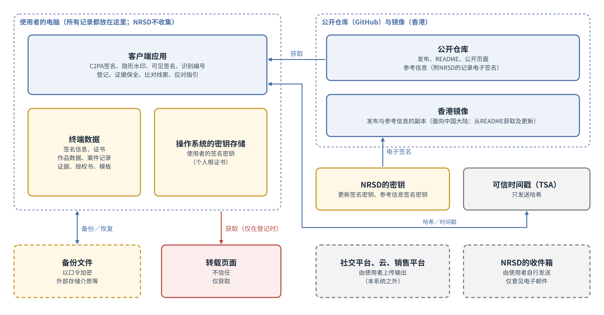
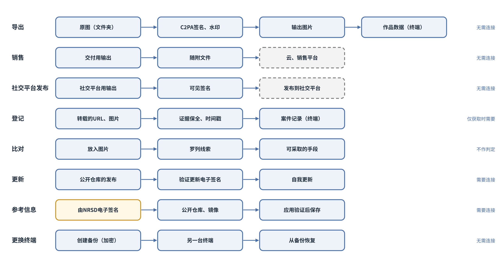
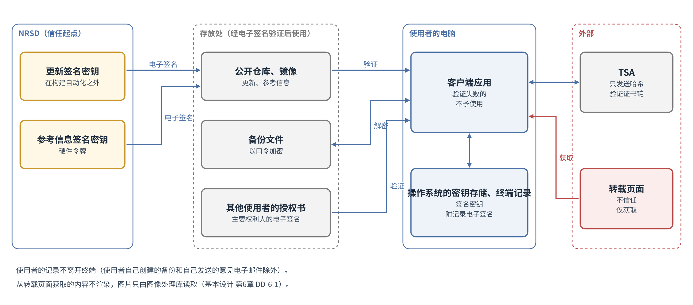

# 基本设计书 第1章 整体结构

Cosplay照片防盗图工具  第1版（草案）  2026-09-29 · 石川宗  
株式会社流山ソフトウェア開発（NRSD）  
Word版: [01_基本设计书_整体结构.docx](01_基本设计书_整体结构.docx)

© 2026 株式会社流山ソフトウェア開発（NRSD）负责开发者　石川宗　本文件的著作权归株式会社流山ソフトウェア開発（NRSD）所有。本文件所引用的第三方标准、软件、法令解说等的权利归各权利人所有。本文件为日文原文的译本，如有不一致，以日文原文为准。

---

## 本文件的定位

- 细化概要设计书第1章。本章是全章的前提，其他各章遵循本章的结构、数据的所在、标识符、信任的边界、横贯的方针。
- 本章的节的划分参照描述软件结构的公开模板arc42的12节（目的与目标、约束、背景与范围、解决的方针、构成要素、运行时的场景、部署、横贯的思路、决定、质量的要求、风险、用语集）。本章基于研讨备忘“第1章 整体结构的研讨”（NRSD内部的研讨记录，不随本文件分发。作为设计依据的事实，已连同出处写在本文件的各节中）。
- 承接的决定如下表。

|编号|种类|内容|
|---|---|---|
|D-2-1|决定|本系统所保护的，是权利人对其自身照片所享有的权利（著作权及肖像权）|
|D-2-2|决定|本系统的范围为许可的适用|
|D-2-3|决定|本系统的最大价值为威慑|
|D-2-4|决定|自动检测作为另一份设计计划|
|D-2-5|决定|不处理销售管理。需要者应Fork并加以改造，其结果NRSD概不过问|
|D-2-6|决定|不进行法律程序的代理及法律判断|
|D-3-2|决定|浏览者及运营者不在本系统中定义|
|D-3-3|决定|使用者须能够在不查看GitHub的情况下使用本系统|
|D-5-1|决定|本系统不确认使用者，不收集使用者的信息。使用本系统不要求登记|
|D-5-5|决定|本系统提供比对的手段，但不代为进行比对|
|D-6-1|决定|客户端应用为在Windows、macOS及Linux上运行的桌面应用|
|D-6-2|决定|本系统不作为网站构建|
|D-12-1|决定|设置公开仓库。不设置私有仓库|
|D-12-3|决定|权利人信息、签名密钥、作品数据、台账及证据保存在使用者的终端，NRSD不收集|
|D-13-1|决定|第二阶段作为另一份设计计划|
|D-13-3|决定|用于通知著作者的联系方式的登记，在第二阶段的设计计划中处理|
|A-6|项目划分中发现的遗漏|针对假应用的准备|
|A-9|项目划分中发现的遗漏|费用，以及GitHub的容量限制|
|A-10|项目划分中发现的遗漏|从设计计划书的决定到设计的对应表|
|A-14|项目划分中发现的遗漏|NRSD的立场与使用条款|
|A-17|项目划分中发现的遗漏|数据的跨境传输（第2版决定NRSD不接收使用者的信息，前提已不存在）|

- 记法：“［需实测］”表示通过收发、实现来确认的事项（并写出假设与判定标准）。“（初始值）”表示没有可作依据的外部数值、在运营开始时设定的值。
- 用语汇总在16“用语集”中。

## 1. 设计决定的一览

|编号|决定|理由|被否定的方案|
|---|---|---|---|
|DD-1-1|本系统由客户端应用（包括使用者终端上的数据）与公开仓库（分发物、参考信息、公开页面）构成。NRSD持有为分发物与参考信息附加电子签名的密钥|设计计划书 D-12-1“设置公开仓库。不设置私有仓库”、D-12-3“权利人信息、签名密钥、作品数据、台账及证据保存在使用者的终端，NRSD不收集”|把记录放在私有仓库的方案（设计计划书第1版。会变成收集使用者的信息）|
|DD-1-2|NRSD不设常驻运行的服务器，不具有接收使用者信息的途径（使用者自行发送的意见电子邮件除外。第10章 DD-10-6“意见由使用者用自己的电子邮件发送”、第12章 5“隐私政策”）|设计计划书 D-6-2“本系统不作为网站构建”、D-5-1“本系统不确认使用者，不收集使用者的信息。使用本系统不要求登记”|设置签名、登记用服务器的方案|
|DD-1-3|C2PA签名的证书根据使用者输入的信息在客户端应用中生成。不使用认证机构|设计计划书 D-5-2“C2PA签名的证书，根据使用者输入的信息在客户端应用内生成。不需要认证机构”。C2PA技术规范不要求证书的发行者具备资格|NRSD成为认证机构的方案（设计计划书第1版阶段的设计。把计划书的候选误当作必需）|
|DD-1-4|记录（作品数据、案件记录、证据、模板、作业、授权书）全部放在使用者的终端上。终端的迁移与故障的准备，以使用者创建的备份文件进行|设计计划书 D-10-7“证据保存在使用者的终端，不予公开。本系统不收集证据”、D-12-3“权利人信息、签名密钥、作品数据、台账及证据保存在使用者的终端，NRSD不收集”|自动同步（需要外部的存放处）|
|DD-1-5|需要完整性的记录（作品数据、案件记录、授权书）以使用者的密钥附加记录电子签名，读取时验证|检测来自终端之外对记录的改写（接触终端的他人、损坏的文件、被动过手脚的备份文件）。记录电子签名由使用者本人的密钥进行，因此使用者可以改写后重新签名。对第三方（专家、服务商）证明记录在当时已存在的，是外部TSA的可信时间戳（第3章 4“可信时间戳”、第6章 3.2“可信时间戳”）。离线生成的作品数据在事后补加之前没有可信时间戳|不附电子签名保存的方案|
|DD-1-6|参考信息（窗口、文字示例、各国法律的参考、随附文件的文字）附NRSD的记录电子签名后放在公开仓库与镜像中，应用获取并验证|不等应用更新就能送达窗口与法令的变化。通往中国大陆的途径（设计计划书 I-04“从中国大陆连接GitHub”）|只嵌入应用的方案（更新要等应用更新）|
|DD-1-7|应用可以离线进行C2PA签名、编辑、导出、登记的记录。可信时间戳、参考信息与更新的获取、转载页面的获取在连接时进行|拍摄后的作业不依赖网络|以常时连接为前提的方案|
|DD-1-8|界面（WebView）只负责显示与输入，文字的绘制、图像处理、文件的读写、通信、密钥的操作全部在Rust核心中进行。从界面能调用的命令限于许可的命令|Tauri的安全机制在界面与核心之间设置信任边界（Tauri官方的安全指南）。界面显示外部文字时的危险不波及核心。在核心中绘制，3种操作系统的结果相同（第4章 DD-4-5“文字的排版与绘制在预览和导出中使用同一Rust机制”）|在界面中处理图像的方案（结果因操作系统而异。界面的弱点波及记录）|
|DD-1-9|所有记录的保存，都按先写入临时文件、写入存储介质后再替换名称的步骤进行|不留下写到一半而损坏的记录（质量目标1）|直接覆盖的方案|
|DD-1-10|数据放在操作系统按使用者区分的、不同步的位置（Windows为Local的AppData）。可重新生成的内容（缩略图等）放在操作系统的缓存位置|Windows的Roaming的AppData在组织的电脑上会被同步，放入数GB的证据会变重|放在Roaming的AppData的方案|
|DD-1-11|每台机器只启动一个应用。第二次启动时让第一个窗口到前台后结束|防止两个应用同时写同一记录|允许多次启动、按记录加锁的方案（第4章 11.7“同时打开”的作业锁作为单一启动的补充保留）|

## 2. 目的与质量的目标

### 2.1 目的

- 本系统使Cosplay照片的权利人能够在照片上标示权利（C2PA签名、可见签名、随附文件）、规定许可范围、登记转载并留下证据、在适当时采取应对（设计计划书 第2章“目的及范围”）。

### 2.2 利害关系者

|者|与本系统的关系|关心|
|---|---|---|
|Cosplayer（使用者）|对照片进行C2PA签名、销售、发布、应对转载|省事、外观好、不损坏照片|
|摄影者（使用者）|同上。有时与Cosplayer共有权利|署名正确地载明|
|经授权者（使用者）|经权利人授权进行C2PA签名、发布|知道授权的范围|
|购买者（外部）|收到交付用图片与随附文件|知道可以做什么|
|浏览者（外部）|看到发布内容，识别是否为正版照片|知道核验的方法|
|转载者（对方）|擅自转载|—（威慑的对象）|
|冒充权利人者（对方）|对他人的照片抢先C2PA签名等|—（以比对线索应对。第2章）|
|NRSD（运营）|制作并分发应用。维护参考信息|保护密钥、控制费用、责任的范围|
|法律专家（外部）|收到证据包。确认文字|证据的验证步骤|
|发布网站、云、申诉窗口（外部组织）|图片的存放处、申诉的接收方|—|

### 2.3 质量的目标（按优先顺序）

|顺序|目标|ISO/IEC 25010:2023的特性|理由|
|---|---|---|---|
|1|不丢失、不损坏原图与记录|可靠性、安全性|照片是使用者的收入来源，证据是日后请求所需。一旦丢失无法挽回|
|2|非技术人员能不迷惑地使用|易用性|不被使用就起不到威慑（设计计划书 8.1“外观”）|
|3|不收集、不泄露使用者的信息|安全性|设计计划书 D-5-1“本系统不确认使用者，不收集使用者的信息。使用本系统不要求登记”是本系统的前提|
|4|输出能通过第三方验证，并能发现篡改|功能适合性|否则C2PA签名就失去意义|
|5|在3种操作系统上结果相同|兼容性、灵活性|使用者更换终端，输出也不变|

- 性能在不损害上述5项的范围内满足（14.1）。
- 目标冲突时，采用顺序靠前者。例：即使为了自动保存（目标1）写入增加，也优先于速度。

## 3. 约束

|种类|约束|出处|
|---|---|---|
|技术|Windows、macOS、Linux的桌面应用|设计计划书 D-6-1“客户端应用为在Windows、macOS及Linux上运行的桌面应用”|
|技术|不作为网站构建。不设常驻运行的服务器|D-6-2“本系统不作为网站构建”、DD-1-2“NRSD不设服务器，不接收使用者的信息（使用者自行发送的意见电子邮件除外）”|
|技术|不收集使用者的信息。不要求登记|D-5-1“本系统不确认使用者，不收集使用者的信息。使用本系统不要求登记”|
|技术|主要作业可离线进行|DD-1-7“离线也能进行C2PA签名、编辑、输出、登记”|
|技术|附带的素材（字体、模型）采用允许再分发的许可证|第4章 6“字体与表情符号”、第11章|
|技术|可运行的机器：Windows 10/11与Linux（glibc 2.35以上）为支持x86-64-v3的CPU，macOS为14以上的Apple CPU的机器。Intel的Mac不在对象内|第11章 3.1“支持的操作系统下限”（取决于ONNX Runtime的支持）|
|组织|NRSD不持有认证机构的许可|NRSD的决定（2026-09-29）|
|组织|NRSD不是法律专家。不进行法律判断|设计计划书 D-2-6“不进行法律程序的代理及法律判断”|
|组织|NRSD的开发与运营体制规模小。截至2026-09-30，开发、设计、运营由一名负责开发者承担，没有委托的设计师（第10章 DD-10-2“设计由NRSD的负责开发者进行并自行判定”）。是否增加人员属于NRSD的判断|—|

## 4. 背景与范围

### 4.1 构成要素

|构成要素|持有|不持有|运行的场所|
|---|---|---|---|
|客户端应用|使用者的签名密钥（操作系统的密钥存储）、证书、权利人信息（输入的值）、设置、模板、作业、作品数据、案件记录、证据、授权书、获取的参考信息|其他使用者的数据|使用者的电脑（Windows、macOS、Linux）|
|公开仓库|源代码、发布（分发物）、README、公开页面、参考信息（附记录电子签名）|个人信息、每个使用者的信息|GitHub（公开）|
|香港镜像|公开仓库的发布与参考信息的副本|个人信息|对象存储（仅静态分发）|
|运营者工具|参考信息的编辑、对分发物的电子签名|使用者的信息|M-01“参考信息”在NRSD的管理用电脑上（联网。参考信息签名密钥在硬件令牌中）。M-02“发布电子签名”在不联网的运营者电脑上（更新签名密钥）|
|NRSD的密钥|更新签名密钥、参考信息签名密钥|使用者的信息|不联网的运营者电脑（更新签名密钥）、硬件令牌（参考信息签名密钥）|

图1-1 构成要素与连接

- 边界之外：第二阶段（自动检测。包括为通知著作者的联系方式登记。设计计划书 D-13-3“用于通知著作者的联系方式的登记，在第二阶段的设计计划中处理”）、销售管理、原作的权利（概要设计书“本系统保护的与不保护的”）、法律判断与代理（第7章“法律应对指引”）、使用者信息的收集、代为比对与判定（设计计划书 D-5-5“本系统提供比对的手段，但不代为进行比对”）。

### 4.2 与外部的交互

- 应用本身与终端之外交互的，限于下表的对象。应用不进行表中没有的发送（质量目标3）。WebView2（Windows）向Microsoft发送的必需诊断数据、操作系统进行的SmartScreen与Gatekeeper的核验等，由操作系统与界面部件进行的发送，依各公司的方针（Microsoft“WebView2的数据与隐私”）。隐私政策中载明此事（第12章 5.2“向终端之外发送的一览”）。

|对象|方式|发送的内容|接收的内容|超时与上限（初始值）|失败时|
|---|---|---|---|---|---|
|公开仓库（GitHub）|HTTPS的GET|仅获取请求|更新清单（JSON）、分发物、参考信息与记录电子签名|连接10秒。更新清单与参考信息整体120秒、1MB以内。分发物整体30分钟（初始值。为使从中国大陆经镜像的慢速线路也能获取）、500MB以内|尝试镜像。都不行则下次启动时再试|
|香港镜像|HTTPS的GET|同上|同上|同上|—|
|时间戳服务机构（TSA）|HTTP或HTTPS的POST（RFC 3161）|仅哈希（时间戳请求）|时间戳响应|连接10秒、整体30秒、响应1MB以内|尝试下一个TSA（第3章 4“可信时间戳”）。全部不行则挂起，连接时补加|
|RDAP|HTTPS的GET|要查询的域名、IP地址|注册信息（JSON）|连接10秒、整体30秒、响应1MB以内|记录为无结果，并显示手动查询的方法|
|DNS|操作系统的名称解析|要查询的域名|IP地址|依操作系统的设置|同上|
|转载页面|HTTP或HTTPS的GET（仅限使用者登记的URL。仅在登记时（默认。使用者可对该次登记关闭）与按下“确认当前状态”时）|获取请求（对方能看到使用者的IP地址。不自报本系统之名，请求头与WebView的值一致。第6章 DD-6-8“获取的请求不自报本系统之名”）|页面的HTML与图片|连接10秒、整体60秒、每页50MB以内、重定向5次以内|记录未能获取，以使用者的屏幕截图补充（第6章）|
|电子邮件软件|把mailto的URL交给操作系统|意见的文字（使用者确认后）|—|—|使文字与收件地址可复制（第10章 9“意见受理渠道”）|
|操作系统的密钥存储|操作系统的API|签名密钥的保存与取出|—|—|第2章 7“签名密钥”|

- 本系统不与发布网站、云、申诉窗口直接交互。窗口在使用者按下时用操作系统的默认浏览器打开。
- 获取转载页面时，对方网站能看到使用者的IP地址。获取前显示一次（11.2的威胁）。

## 5. 解决的方针

|质量的目标|方针|本章、其他章|
|---|---|---|
|1 不丢失、不损坏|原图只读。记录从临时文件替换。作业自动保存。建议使用备份文件（加密）|DD-1-9“记录先完整写入临时文件再替换”、第4章 11“作业（编辑中途的状态）”、第8章 5“备份文件”|
|2 不迷惑地使用|一个窗口、步骤的显示、向导角色、错误的格式。不让人看到GitHub|第10章|
|3 不收集、不泄露|不设服务器。对外发送限于4.2的表。记录只放在终端上。日志中不写秘密|DD-1-2“NRSD不设服务器，不接收使用者的信息（使用者自行发送的意见电子邮件除外）”、10.4|
|4 能通过验证|遵循C2PA规范的部件（c2pa-rs）、可信时间戳、记录电子签名|第3章、DD-1-5“终端的记录附记录电子签名并加以验证”|
|5 结果相同|绘制、颜色转换、导出用Rust的同一部件进行。不使用操作系统的字体|DD-1-8“界面只负责显示与输入，处理在Rust核心中进行”、第4章|

## 6. 构成要素的内容

### 6.1 应用的层

|层|部件|负责|不负责|
|---|---|---|---|
|界面|WebView（HTML、CSS、TypeScript）|显示与输入。进度的显示|文字的绘制、图像处理、文件、通信、密钥的操作|
|命令|Tauri的命令|接收界面的请求，确认输入（10.6），交给业务部件。长时间处理向界面发送进度通知|业务的判断|
|业务|签名信息、导出（签名处理）、编辑（绘制）、作业、权利文书、登记与证据、比对、参考信息、更新、备份、设置|各章的功能|记录的写法、通信的细节|
|基础|保存、密钥存储、通信、图像的读写、模型的运行、可信时间戳、日志|横贯的功能（10）|业务的判断|

- 与部件（crate）的对应见第11章 7.1“Rust组件的划分”。

### 6.2 界面与核心之间

- 界面只能调用许可的命令（以Tauri的capabilities与permissions按窗口许可）。文件读写的范围限于应用的数据位置，以及使用者每次选择的文件与文件夹（Tauri的scopes）。
- 界面禁止加载外部资源（以CSP只加载应用内的资源）。外部的URL在使用者按下时用操作系统的默认浏览器打开。
- 来自外部的文字（转载页面的标题、文件名、模板名、参考信息的文字）只作为文字显示，不作为HTML解释。
- 长时间处理（导出、登记、自动布局、备份）在核心的后台处理中进行，把进度通知（第几张、剩余的估计）发送到界面。接受来自界面的取消。

## 7. 运行时的场景

- 显示各场景的正常步骤与失败时的处理。细节放在各章，本章显示跨章的顺序。

图1-2 数据的流向

### 7.1 首次启动

|顺序|处理|失败时|
|---|---|---|
|1|按操作系统的语言选择语言（日语、中文、英语，其他为英语）|—|
|2|显示使用条款与隐私政策并取得同意（第10章 G-02“同意”）。条款适用于NRSD的服务（参考信息的提供）|不同意时不获取参考信息（只使用附带的信息包）。C2PA签名、编辑、导出、登记、核验、记录的查看与取出、更新可以使用（第12章 DD-12-3“同意只限制参考信息的获取”）|
|3|输入签名信息，生成个人根证书与签名用证书，保存密钥（第2章 2“C2PA签名所需信息的输入”）|无法写入密钥存储时显示理由，不前进（没有密钥就无法签名）|
|4|显示声明码与文例（G-04“发布声明”）|—|
|5|建议创建备份文件（G-05“创建备份”）|不创建也可前进|

### 7.2 批量导出

|顺序|处理|失败时|
|---|---|---|
|1|选择照片与用途。创建作业（第4章 11“作业（编辑中途的状态）”）|对无法读取的照片加标记后排除|
|2|缩略图与自动布局（第4章 7.2“自动布局”）|—|
|3|调整（第4章 9“编辑的操作”）。作业自动保存|保存失败时通知|
|4|许可范围（交付用。第5章）|—|
|5|导出：按照片，以处理顺序（第3章 8“处理的顺序与系统”）用临时名称写出输出，记录作品数据，确定输出的名称（按此顺序，没有记录的输出不会以正式名称留下）|一张失败则列入一览，其他继续。中途停止时已导出的已被记录，可从中途继续导出|
|6|可信时间戳（无连接时挂起，连接时补加）|所有TSA都不响应则挂起|

### 7.3 登记转载

|顺序|处理|失败时|
|---|---|---|
|1|放入URL、转载图片、屏幕截图（第6章）|—|
|2|比对（水印、哈希）|无法读取则记录“无法比对”|
|3|获取转载页面（每次登记默认进行。登记界面显示对方网站能看到IP地址，使用者可对该次登记关闭。第6章 2.1“步骤”）|无法获取则加以记录，以屏幕截图补充|
|4|RDAP、DNS的查询|记录为无结果|
|5|创建案件记录、记录电子签名、证据包的可信时间戳|中途停止时从各步骤的状态继续（8.2）|

### 7.4 比对（出现冒充权利人者时）

|顺序|处理|失败时|
|---|---|---|
|1|放入图片（第10章 G-13“核验”）|—|
|2|C2PA签名的验证、水印的读取、比对用哈希的计算|无法读取的项目显示为“无”|
|3|罗列线索（第2章 4.4“冒充权利人者出现时的线索”）。不作判定|—|

### 7.5 参考信息的获取

|顺序|处理|失败时|
|---|---|---|
|1|在启动时与每24小时（初始值），确认公开页面（GitHub Pages。`https://<组织>.github.io/<仓库>/reference/latest.json`）上参考信息的版本。不使用raw.githubusercontent.com（有报告称在中国大陆被阻断、DNS被污染。调查资料“GitHub与分发”）。获取来源的顺序（公开页面，其次香港镜像的`reference/`）把失败的来源移到后面（与更新相同。第9章 4.3“更新说明（静态JSON）的形式”）|尝试镜像|
|2|有新版本则获取，进行信息包的验证（大小、电子签名、版本号大于本地、各文件的SHA-256、期限）（第8章 3.4“参考信息包”）|验证失败则不使用，继续使用本地的版本。超过期限的本地版本继续使用并加以通知|
|3|替换本地的版本（按DD-1-9“记录先完整写入临时文件再替换”的步骤）|—|

### 7.6 更新

- 依第9章 4“更新”。验证更新电子签名，失败则不适用。

### 7.7 备份的创建与恢复

- 依第8章 5“备份文件”。备份文件以临时名称创建，完成后再改名。

### 7.8 异常退出后的启动

|顺序|处理|
|---|---|
|1|启动时确认“使用中”的记录。上次未正常关闭时，进行以下处理|
|2|作业：确认能以最后保存的版本打开，并显示“从中途打开”（第4章 11.5“异常结束之后”）|
|3|导出：删除以临时名称残留的输出，与已导出的记录核对|
|4|登记：中途步骤的案件记录，从已记录的步骤继续|
|5|验证记录电子签名，通知不一致的记录|

### 7.9 离线导出与事后的可信时间戳

- 导出时不附可信时间戳，在作品数据中记录“等待时间戳”。连接时，对输出的SHA-256获取可信时间戳并附到作品数据上（第3章 DD-3-5“可信时间戳在C2PA签名时获取，离线时事后获取”）。主页显示等待的件数。

## 8. 数据

### 8.1 数据的一览

|数据|生成来源|保存位置|公开|写入者|完整性的保护|
|---|---|---|---|---|---|
|原图|使用者（拍摄、显像）|使用者的电脑（本系统只读取）|不公开|—|—|
|权利人信息（昵称、角色、声明所在账号）|使用者的输入|证书、终端|证书中载明的范围与经C2PA签名的图片一同公开|使用者|—|
|使用者的签名密钥|应用|操作系统的密钥存储|秘密|—|—|
|使用者的证书|应用|终端、输出图片的清单|包含在清单中|使用者|使用者的密钥|
|输出图片（交付用）|应用|从使用者的电脑到云|分发给购买者|使用者|C2PA签名|
|输出图片（社交平台用）|应用|从使用者的电脑到发布网站|公开|使用者|C2PA签名（以在发布网站不留存为前提）与隐形水印|
|作品数据|应用|终端|不公开|使用者|记录电子签名|
|案件记录（登记）|应用|终端|不公开|使用者|记录电子签名|
|证据（获取物）|应用、使用者|终端|不公开|使用者|在案件记录中记录哈希，并附可信时间戳|
|授权书|主要权利人的应用|双方的终端|不公开（要点载入经授权者输出的清单中）|主要权利人|记录电子签名|
|模板|使用者|终端|不公开|使用者|—|
|作业（编辑中途的状态）|应用（自动保存）|终端|不公开|使用者|—（不复制照片，记录位置与SHA-256）|
|导入的素材（字体、图片）|使用者|终端|不公开|使用者|以SHA-256引用|
|随附文件|应用（由参考信息的文字生成）|输出文件夹|购买者|使用者|在清单中记录哈希（第5章）|
|参考信息|NRSD|公开仓库、镜像、终端上的副本|公开|NRSD|NRSD的记录电子签名|
|设置|使用者|终端|不公开|使用者|—|
|备份文件|应用|使用者选择的位置（外部存储介质等）|不公开|使用者|以口令加密并检测篡改（第8章）|
|缩略图|应用|操作系统的缓存位置|不公开|应用|—（可重新生成）|
|操作日志|应用|操作系统的日志位置|不公开|应用|—|

### 8.2 标识符的体系

|标识符|格式|发放|唯一性|
|---|---|---|---|
|识别编号|61位的随机数。直接放入隐形水印（TrustMark BCH_5的数据部分）。显示时，把61位的值放在高位、该值的4位校验（生成多项式x^4＋x＋1的CRC-4）放在低位，所得65位从高位起每5位转换为Crockford Base32的13个字符，按5、5、3个字符分隔（例：值0x1604F408204C92C5、校验4为`P0KT0-G82CJ-B2M`）。一个值的写法唯一确定，4位校验不符的写法视为无效，显示“识别编号可能输入有误”|应用（导出时）|见下方注记|
|声明码|将使用者个人根证书密钥（第2章 3.1“构成”）的公钥的SHA-256的前100位，以Crockford的Base32（第2章 DD-2-7“声明码与识别编号统一使用Crockford Base32”）转为20个字符，加上`NRSD-`并每5个字符分隔（28个字符）|应用（首次输入时）|100位下偶然一致可以忽略|
|案件编号|`C`后接UUID v7|应用|冲突可以忽略|
|作业、模板、批量处理的编号|UUID v7|应用|冲突可以忽略|
|错误编号|分类（3个英文字母）与3位序号（例：`SIG-012`）|设计（10.3）|—|

- 识别编号按作品（导出的一个文件）发放一个。同一张照片分别导出为X用、Instagram用、交付用时，各为不同的识别编号，是否为同一张照片由作品数据中原图的SHA-256得知。同一识别编号记录在隐形水印、C2PA签名的清单、文件名（使用者选择附加时）、可见签名（使用插入字段时）、作品数据、案件记录中。它是设计计划书 1.5“用语的定义”的“识别编号”，企划草案的“比对编号”（附在发布内容上、供浏览者识别擅自转载的编号。第2节、第3节）与“作品编号”（把举报的转载与作品对应的编号。第6节）也是同一值。
- 唯一性：61位随机数相互重复的概率，即使作品达到1千万件也约为5万分之1（n²/2⁶²。10¹⁴÷4.6×10¹⁸）。发放时确认与本地的作品数据不重复。与其他使用者的重复，因为没有中央的台账而不作确认。比对时以识别编号与签名者的组合区分作品。
- 若把显示缩短为高位的一部分，就不再唯一（40位时作品50万件约有一成的概率重复）。它是浏览者作为比对编号使用的编号，因此不缩短。
- 作品登记号（公共登记的编号）不是本系统发放的编号，作为使用者写在声明、可见签名中的字符串处理。

### 8.3 格式与版本

- 记录为JSON（UTF-8，键为英文字母）。各记录持有`schema`（例：作品数据为`nrsd.work/1`，作业为`nrsd.session/1`）。
- 提升版本时，应用保留读取旧版本的处理，在应用更新后的首次启动时迁移到新版本。迁移前记录的副本按第9章 4.4“记录格式的迁移”的步骤保留。
- 应用读到比自身更新版本的记录时，不改写只读取，并提示更新。
- 记录电子签名在把JSON规范化（RFC 8785 JCS）之后，以签名用证书密钥的ECDSA P-256进行，放在另一个文件（`.sig`）中。`.sig`附上签名用证书与个人根证书（第2章 DD-2-10“记录电子签名用签名用证书的密钥附加，并附上证书链”）。但授权书、撤销书、共同权利的书面文件以一个文件授受，因此签名放在JSON中的`signatures`里（第2章 5.3“文书的格式”）。

### 8.4 保留与删除

- 所有记录都在使用者的终端上，只要使用者不删除就保留。应用自动删除的仅限以下内容：操作日志（90天。初始值）、缩略图（删除作业时，以及缓存超过1GB时的旧的部分。第8章 6.1“终端容量的估计”）、作业版本备份中超过5个的旧的部分（第4章 11.4“版本的备份”）、异常退出后残留的临时文件（7.8）、记录格式迁移的副本（30天。第9章 4.4“记录格式的迁移”）。使用者的记录（作品数据、案件记录、证据、模板、授权书）不自动删除。
- 删除案件记录、证据之前，显示损害赔偿请求的期间（日本、中国均为自知道时起3年、自行为时起20年，美国为自请求发生起3年。法务调查 L-20“损害赔偿请求的期间（日、中、美）”），并建议导出。
- NRSD不持有使用者的数据，因此NRSD方面不产生保留与删除的方针。

### 8.5 秘密信息的一览

|秘密|存放位置|泄露时|
|---|---|---|
|使用者的签名密钥|操作系统的密钥存储（Windows凭据管理器与DPAPI、macOS钥匙串、Linux的Secret Service。没有Secret Service的Linux为以口令加密的密钥文件。第2章 7.5“各操作系统的保管方式”）。在备份文件中以使用者的口令加密|使用者重新生成密钥，重新发布声明码（第2章 7“签名密钥”）|
|备份文件的口令|使用者的记忆（应用不保存）|持有备份文件者可能读取。创建新的备份，删除旧的备份|
|参考信息签名密钥|硬件令牌（NRSD的管理用电脑）|可能被分发伪造的参考信息。通过应用的更新分发新的公钥（第9章）|
|应用的更新签名密钥|把Tauri的签名密钥文件（以口令加密）放在不联网的运营者电脑上。纸质备份放在保险柜中（第9章 DD-9-4“更新签名密钥放在CI之外，代码签名的凭据放在CI的机密中”）|可能被分发伪造的更新。丢失则无法分发更新（第9章）|
|代码签名的凭据（Windows）|Artifact Signing的签名权限（具有Azure Artifact Signing签名者角色的凭据。CI的机密，限于发布环境。第11章 8.3“机密的处理”）。证书本身在服务之中，不交给NRSD|可能被制作经正确代码签名的伪造分发物。使凭据失效，并向Artifact Signing的窗口报告（第13章 H-44“CI或GitHub组织被劫持时，可能有经正确代码签名的伪造分发物被放入正式发布”）|
|代码签名的凭据（macOS）|Developer ID Application的证书与私钥（.p12及其口令）、公证所用的App Store Connect的API密钥。CI的机密（限于发布环境）。原件在运营者的管理用电脑上|可能被制作经正确签名、公证的伪造分发物。请求Apple吊销证书（第13章 H-44“CI或GitHub组织被劫持时，可能有经正确代码签名的伪造分发物被放入正式发布”）|
|香港镜像的写入密钥|阿里云RAM用户的AccessKey（仅对该存储桶的写入权限）。运营者的管理用电脑（第9章 6.1“步骤”的6。复制由运营者进行）|镜像的内容可能被改写。分发物与参考信息以电子签名验证因此不会被适用，但更新清单的改写以版本核对防止（第9章 DD-9-2“更新通过Tauri的机制获取，并核对更新清单与电子签名中的版本”）。使密钥失效并重新生成|
|GitHub组织所有者的账号|通行密钥或安全密钥（2个以上）、基于时间的一次性码、纸质的恢复码（第8章 3.5“GitHub账号与仓库的保护”）|公开仓库、发布、公开页面（包括README的SHA-256）可能被改写（第13章 H-44“CI或GitHub组织被劫持时，可能有经正确代码签名的伪造分发物被放入正式发布”）。向GitHub报告，找回账号|

### 8.6 多语言的文件名与文字

- 文件名以UTF-8（规范化为NFC）处理。操作系统不能使用的字符（Windows的`\ / : * ? " < > |`等）替换为`_`。
- 应用在其数据位置中创建的文件与文件夹的名称为英文数字（编号），使用者输入的名称放在JSON中。导出输出的名称（使用拍摄名、原文件名）依第3章 10.1“名称与构成”。

## 9. 部署

### 9.1 各操作系统的存放位置

|存放的内容|位置（Tauri的名称）|Windows|macOS|Linux|
|---|---|---|---|---|
|记录、作业、证据、模板、导入的素材、设置、获取的参考信息|app_local_data_dir|Local的AppData下应用的编号|~/Library/Application Support下|$XDG_DATA_HOME（没有则~/.local/share）下|
|缩略图等可重新生成的内容|app_cache_dir|Local的AppData下|~/Library/Caches下|$XDG_CACHE_HOME（没有则~/.cache）下|
|操作日志|app_log_dir|Local的AppData下的logs|~/Library/Logs下|local_data_dir下的logs|
|签名密钥|操作系统的密钥存储|凭据管理器与DPAPI|钥匙串|Secret Service（没有时为app_local_data_dir下以口令加密的密钥文件。第2章 7.5“各操作系统的保管方式”）|

- 出处：Tauri的PathResolver的说明。
- 不使用Roaming的AppData（app_data_dir在Windows上的位置）（DD-1-10“数据放在不同步的、按使用者区分的位置”）。
- 存放位置内的配置在第8章 2.1“配置”中规定。

### 9.2 安装

- 每个操作系统一个分发物（第9章 DD-9-1“每个操作系统一个分发物，并进行代码签名”）。为不需要管理员权限、按使用者的安装。

### 9.3 单一启动

- 每台机器只启动一个（DD-1-11“每台机器只启动一个应用”）。使用Tauri的单一启动插件（tauri-plugin-single-instance。支持Windows、macOS、Linux，在Linux上使用DBus。第二次启动通知第一个后结束。插件必须最先注册）。出处：Tauri官方的指南（v2.tauri.app/plugin/single-instance）。
- 第二次启动时如传入了照片、文件夹（把文件拖到窗口等），由第一个接收。

## 10. 横贯的思路

### 10.1 数据的模型

|对象|持有|与其他的关系|
|---|---|---|
|签名信息|昵称、角色、声明所在账号、证书、声明码|作品、授权书、案件的签名者|
|模板|组、图层、格式、素材|作业持有副本|
|作业|照片的列表、调整、导出的预设、履历|从一个作业产生作品|
|作品（作品数据）|识别编号、原图的SHA-256、输出的SHA-256、PDQ、可信时间戳、许可范围、随附文件的哈希|被案件引用|
|案件（案件记录）|转载的URL、状况的履历、证据包|引用作品（比对的结果）|
|证据|获取物、屏幕截图、哈希列表、可信时间戳|属于案件|
|授权书|主要权利人、经授权者、范围、期间|作品签名者权利的依据|
|参考信息|窗口、文字、各国法律的参考、随附文件的文字、版本|供权利文书、指引使用|

### 10.2 保存

- 所有记录都按DD-1-9“记录先完整写入临时文件再替换”的步骤写入：写入临时文件，写入存储介质（`File::sync_all`），替换名称（Windows为带替换已有与直写指定的`MoveFileExW`，macOS与Linux为`rename`），macOS与Linux还把文件夹写入存储介质。出处与理由见第4章 11.3“保存的方法”。
- 需要完整性的记录（作品数据、案件记录、授权书）附加记录电子签名（DD-1-5“终端的记录附记录电子签名并加以验证”）。读取时验证，不一致则不使用并通知。
- 两个处理不同时写同一记录。每个记录确定一个写入的处理，其他处理委托写入者。

### 10.3 错误

- 错误持有分类与编号（8.2）、给使用者的文字、给日志的文字。

|分类|内容|
|---|---|
|`IMG`|图像的读写|
|`SIG`|C2PA签名、证书、密钥|
|`TSA`|可信时间戳|
|`NET`|通信|
|`STO`|保存、容量|
|`REF`|参考信息|
|`UPD`|更新|
|`CAS`|登记、证据|
|`BAK`|备份文件|
|`INP`|输入的确认|

- 给使用者的显示依第10章 DD-10-8“统一错误显示的格式”的格式（发生了什么、原图与记录是否无恙、接下来要做什么、编号）。
- 编号的一览（编号、分类、原因、给使用者的文字、接下来要做什么）在实现时制作，与界面的文字文件（第11章 DD-11-8“国际化通过文字文件进行”）以同样的3种语言持有。

### 10.4 操作日志

- 目的：使用者提意见（第10章 9“意见受理渠道”）时，使用者自己可以附上的原因线索。应用不自动发送。
- 写入：时间（UTC）、应用的版本、处理的种类、错误编号、件数与所需时间。
- 不写入：签名密钥、口令、证据的内容、转载页面的内容、照片位置的全部（只写文件名）、权利人信息、URL的查询部分。
- 大小：每个文件10MB切换，合计50MB以内（初始值）。保留90天（初始值）。
- 使用者可从设置打开日志的位置（以便附到意见中）。

### 10.5 并行处理

- 长时间处理（导出、自动布局、登记、备份）在核心的后台处理中进行，不冻结界面。通知进度，可以取消。
- 一次运行的长时间处理每种一个（不同时进行两个导出）。不同种类可以并行（导出期间可以登记）。
- 图像处理的并行数依第4章 14.4“大的图像与并行的处理”的公式。

### 10.6 来自外部输入的确认

|输入|上限与确认（初始值）|章|
|---|---|---|
|照片|1亿像素、每张200MB以内。按内容判定格式（而不是扩展名）|第3章、第4章|
|图片图层的图片|20MB、长宽各8,000像素以内。仅PNG、JPEG|第4章 5“图像图层”|
|导入的字体|50MB以内。仅TTF、OTF|第4章 6.4“带入的字体”|
|模板文件|ZIP中的文件50个、解压后合计100MB以内，名称中不含`..`|第4章 8.3“交接（导出与导入）”|
|备份文件|以口令的加密认证检测篡改。解压后的大小须与其中的清单一致|第8章 5“备份文件”|
|参考信息|1MB以内。验证记录电子签名|7.5|
|更新|验证更新电子签名|第9章|
|转载页面|50MB以内、重定向5次以内、超时60秒。不渲染、不执行脚本|第6章 DD-6-1“转载页面在不执行脚本的情况下获取”|
|TSA的响应|1MB以内。验证证书链|第3章|
|RDAP的响应|1MB以内|第6章|

- 图像的像素数在分配内存之前，从文件头的长宽确认（防范解压炸弹。Rust的image的长宽上限严格生效）。

### 10.7 时间

- 不信任终端的时钟。作为证据的时间以RFC 3161的可信时间戳表示。
- 记录中以UTC的ISO 8601书写，显示时转换为使用者所在地区的时间并附时差（例：UTC+9）。

### 10.8 语言与国家

- “界面的语言”与“权利文书的对象国”作为不同的设置持有（R-1-7-2“界面的语言与权利文书的国家分开处理”）。
- 界面的文字放在各语言的文字文件（第11章 DD-11-8“国际化通过文字文件进行”）中，不直接写在界面上。

### 10.9 版本的兼容

- 应用的版本、记录`schema`的版本、C2PA规范的版本（第3章 DD-3-7“C2PA规范的版本随c2pa-rs的版本”）、参考信息的版本分别持有。

## 11. 信任与威胁

### 11.1 信任的边界

|边界|跨越的内容|验证|
|---|---|---|
|界面与核心之间|命令与结果|仅许可的命令。确认输入（DD-1-8“界面只负责显示与输入，处理在Rust核心中进行”、10.6）|
|应用与公开仓库、镜像之间|更新、参考信息|更新验证更新电子签名，参考信息验证NRSD的记录电子签名。失败则不使用|
|应用与TSA之间|哈希、时间戳响应|验证TSA的证书链。只发送哈希|
|应用与转载页面之间|获取物|不信任。不执行脚本，不渲染（第6章）|
|应用与终端上的文件之间|记录、证据|读取时验证记录电子签名与哈希（DD-1-5“终端的记录附记录电子签名并加以验证”）|
|应用与其他使用者之间|授权书、模板文件|授权书验证主要权利人的记录电子签名。模板确认格式与大小|

图1-3 信任的边界

### 11.2 威胁的一览

- 对每个要素（使用者、界面、应用的核心、终端的记录、操作系统的密钥存储、备份文件、公开仓库与镜像、TSA、转载页面、NRSD的运营者工具与密钥），套用STRIDE的6个分类（冒充、篡改、否认、信息泄露、拒绝服务、权限提升。Microsoft的威胁分类）进行识别。

|编号|分类|威胁|攻击者|目标资产|对策|剩余的缺口|
|---|---|---|---|---|---|---|
|T-1|冒充|冒充权利人抢先C2PA签名，或替换C2PA签名|得到他人照片者|权利性|比对的线索（第2章）|无法防止（第13章）|
|T-2|冒充|把真正权利人的发布当作转载，向服务商申诉|同上|真正权利人的发布|线索与可采取的手段（第2章、第7章）|本系统之外的申诉无法防止|
|T-3|冒充|分发假应用|第三方|签名密钥、记录|代码签名、正式的获取途径（第9章）|从README以外获取的使用者|
|T-4|冒充|盗取使用者的签名密钥进行C2PA签名|侵入终端者|本人性|操作系统的密钥存储、重新生成密钥（第2章）|终端被完全侵入时|
|T-5|信息泄露|盗取并读取备份文件|得到文件者|签名密钥、记录|以口令加密（第8章）|弱口令|
|T-6|篡改|改写终端上的记录|接触终端者|案件记录、证据|记录电子签名（DD-1-5“终端的记录附记录电子签名并加以验证”）|连同签名密钥被夺取时|
|T-7|冒充、篡改|分发伪造的参考信息、更新|劫持公开仓库者|全体使用者|电子签名的验证（第8章 3.4“参考信息包”、第9章 4“更新”）|签名密钥本身的泄露|
|T-8|权限提升|盗取NRSD的密钥|内部、外部|全体使用者|更新签名密钥在不联网的电脑上，参考信息签名密钥在硬件令牌中，二者都在构建自动化之外（第9章 DD-9-4“更新签名密钥放在CI之外，代码签名的凭据放在CI的机密中”）|密钥本身被盗时（第13章 H-22“NRSD的密钥（更新、参考信息）被盗时，可能被分发伪造的更新、参考信息”）|
|T-9|权限提升|获取转载页面时接触恶意内容|恶意网站|使用者的终端|不执行脚本的获取（第6章）|在使用者自己的浏览器中的浏览|
|T-10|冒充|伪造的时间戳响应|通信途中的人|时间的证明|验证TSA的证书链（第3章）|—|
|T-11|篡改|篡改导入的模板、备份文件的内容|交付文件者|应用的核心、记录|确认格式与大小（10.6）。备份以加密认证检测篡改|—|
|T-12|否认|NRSD事后否认其分发的参考信息的内容|NRSD|使用者申诉的依据|版本与记录电子签名保留在使用者的终端上（7.5）|—|
|T-13|信息泄露|获取转载页面时，对方网站能看到使用者的IP地址|转载网站的运营者|使用者的所在|登记时默认获取，登记前加以显示。使用者可对该次登记关闭（4.2、第6章 2.1“步骤”）|获取时可见（第13章 H-26“获取转载页面的记录时（登记的默认），对方网站能看到使用者的IP地址”）|
|T-14|信息泄露|操作日志中出现密钥、证据、个人信息|看到日志者|秘密、个人信息|规定日志中不写的项目（10.4）|—|
|T-15|拒绝服务|巨大图片、解压炸弹（图片、模板、备份的ZIP）|交付文件者|应用的核心|像素数、文件数、解压后大小的上限（10.6）|—|
|T-16|拒绝服务|转载页面的巨大响应、反复重定向、响应延迟|恶意网站|应用的核心|超时、大小上限、重定向次数上限（4.2）|—|
|T-17|权限提升|界面显示的外部文字触发界面的命令|植入外部文字者|界面、核心|不把外部文字作为HTML解释，以CSP禁止加载外部资源（6.2）|—|
|T-18|权限提升|从界面调用读写任意文件的命令|劫持界面者|终端的文件|命令的许可制、文件范围的限制（6.2）|—|
|T-19|权限提升|以恶意字体、图片攻击应用核心的漏洞|交付文件者|应用的核心|以Rust的部件读取，限定格式与大小（10.6）|部件的未知漏洞|
|T-20|篡改|持续返回旧的正确参考信息包，或回退到旧版本（冻结、版本回退）|劫持镜像、通信途径者|应用（参考信息）|信息包的版本号（不接受比本地旧的）与期限（超过则通知）（第8章 3.4“参考信息包”）|冻结期间新的窗口无法送达|
|T-21|信息泄露|从转载页面的获取请求中，转载者得知正在收集证据|转载页面的运营者|案件（证据保全）|获取请求不自报本系统之名。发送的请求头保留在WARC中（第6章 DD-6-8“获取的请求不自报本系统之名”）。VPN的说明|对方能看到IP地址（H-26“获取转载页面的记录时（登记的默认），对方网站能看到使用者的IP地址”）|
|T-22|冒充、篡改|劫持CI或GitHub组织，把经正确代码签名的伪造分发物放入正式发布，并改写README的SHA-256|劫持CI、所有者账号者|新获取的使用者|更新电子签名在CI之外（对现有使用者的更新无效）。所有者的双重认证与多种认证手段、主分支与标签的规则、不可更改的发布（第8章 3.5“GitHub账号与仓库的保护”）。发布的机密限于发布环境（第11章 8.3“机密的处理”）|新获取者只能以操作系统的代码签名与README的SHA-256识别，两者都被夺取时无法识别（第13章 H-44“CI或GitHub组织被劫持时，可能有经正确代码签名的伪造分发物被放入正式发布”）|
|T-23|篡改|改写公开页面的“核验声明码”页面，显示伪造的声明码|劫持GitHub组织者|进行比对的浏览者|所有者的双重认证、主分支的规则（第8章 3.5“GitHub账号与仓库的保护”）。同样的计算也可在应用的G-13“核验”中进行，计算方法是公开的（第2章 2.4“声明码的生成方法”）|组织被夺取时（第13章 H-44“CI或GitHub组织被劫持时，可能有经正确代码签名的伪造分发物被放入正式发布”）|

## 12. 对外部的依赖

|外部|停止时|
|---|---|
|TSA|继续C2PA签名，挂起可信时间戳。依次尝试多个TSA（第3章）|
|GitHub|更新与参考信息从镜像获取。记录在终端上，作业不停止|
|香港镜像|从GitHub获取|
|发布网站|本系统之外|
|操作系统的密钥存储|无法签名。显示理由（第2章）|

## 13. 终端与人

- 终端的丢失、故障（R-1-6-1“为终端的丢失、故障做准备，使用者能导出记录并在另一台终端导入”）：记录与签名密钥只在终端上。使用者定期创建备份文件（第8章 5“备份文件”），放在外部存储介质等上。应用在上次备份30天（初始值）后在主页显示建议。在新终端上导入，即可找回签名密钥、声明码、记录。没有备份时重新生成密钥，重新发布声明码（第2章 7“签名密钥”）。
- 多台终端（R-1-6-2“一个人能使用多台终端”）：在另一台终端上导入备份文件，使用同一签名密钥（只需一个声明码）。在两台机器上并行生成记录时的合并依第8章 5“备份文件”。
- 授权关系与权利的转移（R-1-6-3“能处理权利的转移与终止（包括撤销授权）”）：授权书的发放与撤销（第2章 5“授权与共同权利”）。权利人的变更，由新的权利人以本人的信息进行C2PA签名。过去的作品数据不转移。

## 14. 质量的要求

### 14.1 规模与性能的目标

|项目|目标|依据|
|---|---|---|
|一次批量处理|一个文件夹最多500张（初始值）|以一次拍摄的交付为设想|
|图片的大小|最大1亿像素、每张200MB（初始值）|以中画幅、高像素机显像的输出为设想|
|每张的处理时间（C2PA签名、隐形水印、哈希计算的合计）|在一般电脑的CPU上10秒以内|［需实测］TrustMark的CPU推理时间（第3章）|
|500张（2,400万像素）社交平台用的导出|30分钟以内（初始值）|［需实测］|
|每位使用者的证据|每年200件，每件20MB以内（初始值）|终端容量的参考值（第8章 6“容量”）|
|应用的启动|10秒以内可以操作（初始值）|［需实测］|

- “一般电脑”指4核以上的CPU（支持x86-64-v3者，或Apple CPU）、16GB内存、SSD（初始值）。
- 偏离目标时设计上的处理：启动超过10秒时，把ONNX Runtime与模型、附带字体的加载推迟到首次使用时（导出、打开编辑界面时）。500张社交平台用的导出超过30分钟时，重新考虑同时处理的张数（第4章 14.4“大的图像与并行的处理”）与水印的variant（第3章 5“隐形水印”）。每张超过10秒时也同样。

### 14.2 质量的场景

- 是否满足各场景的确认方法（测试的步骤与合格的判定）在测试文件中规定。本节只显示针对各质量目标、设计应回应的场景与响应。

|目标|场景|要求的响应|
|---|---|---|
|1|导出途中电脑断电|原图不变。已导出的已被记录，可从中途继续导出。作业的变更最多丢失最后2秒|
|1|保存记录途中应用崩溃|记录以旧版本或新版本之一留下，没有损坏的记录|
|1|从备份文件恢复到另一台终端|签名密钥与全部记录恢复，所有记录电子签名都通过验证|
|2|首次的使用者在没有说明的情况下完成首次输入与声明的发布|5人中有4人完成|
|3|计数应用向外部发送的内容|只有4.2的表中的对象与内容|
|4|在公开的验证网站上核验导出的图片|C2PA签名显示为有效（不显示为受信任。第2章 3.3“在验证器中的显示”）|
|4|改变导出图片的一个像素|验证显示篡改|
|5|在3种操作系统上导出同一作业|像素值的差在1以内|
|性能|将500张导出为X用|30分钟以内（14.1）|

## 15. 风险

|风险|影响|准备|
|---|---|---|
|自行实现竖排排版|工作量增加，容易出错|决定测试的文句加以确认（第4章 3.3“竖排”）|
|HarfRust、vello_cpu等部件尚年轻|升级版本时可能损坏|固定版本，升级时测试（第11章）|
|moxcms颜色的准确性|颜色偏移|与lcms2比较（第4章 14.2“处理”）|
|TrustMark的水印在社交平台重新压缩后无法读取|比对的线索减少|实测（第3章）|
|GitHub账号被停用|分发停止|镜像与其他托管（第8章 7“对GitHub的依赖”）|
|从中国大陆无法访问|中国的使用者无法获取、更新|香港镜像（从README中文部分的直接获取，以及更新、参考信息的获取。第8章 3.6“香港镜像的运营”、第9章 5“获取途径”）|
|代码签名的信誉（Windows的SmartScreen）|初期会出现警告|说明（第9章）|
|分发物较大（字体约71MB、模型约70MB（TrustMark约65MB、u2netp约4.6MB）、ONNX Runtime）|获取费时|LXGW WenKai采用Lite版（第4章 6.1“同捆的字体”）。判定为300MB以下（第9章 2.1“各操作系统的分发物”）|
|NRSD的体制规模小|密钥与参考信息的维护停止|密钥备份的步骤（第9章）。体制属于NRSD的判断|

## 16. 用语集

|用语|含义|
|---|---|
|C2PA签名|附加在图片上的密码学签名（依C2PA技术规范的清单签名）|
|可见签名|描绘在照片像素上的名称、署名（第4章）|
|记录电子签名|附加在作品数据、案件记录、授权书、参考信息上的密码学签名|
|代码签名|在分发物上附加操作系统所核验的签名（第9章）|
|更新电子签名|以NRSD的更新签名密钥附加在更新分发物上的签名（第9章）|
|个人根证书|在使用者终端上生成、发行签名用证书的证书（第2章）|
|声明码|把个人根证书公钥的指纹缩短后的字符串。发布在声明所在账号上（第2章）|
|识别编号|每件作品的编号。放入水印、清单等（8.2）|
|作业|把编辑中途的状态汇总在一起的对象（第4章 11“作业（编辑中途的状态）”）|
|模板|可见签名的组与图层的样式（第4章 8“模板”）|
|组、图层|可见签名布局的单位，以及其中文字、图片的要素（第4章 4“组与图层”）|
|作品数据|已导出作品的记录（第3章）|
|案件、案件记录|已登记的转载及其记录（第6章）|
|证据包|案件的获取物、屏幕截图、哈希列表、可信时间戳（第6章）|
|参考信息|窗口、文字示例、各国法律的参考、随附文件的文字（DD-1-6“参考信息由NRSD电子签名后放在公开仓库与镜像中”）|
|备份文件|把签名密钥与全部记录以口令加密的一个文件（第8章）|
|授权书|主要权利人授予授权的记录（第2章 5“授权与共同权利”）|

## 17. 与要求的对应

|要求编号|要求的内容|本章承接的节|
|---|---|---|
|R-1-1-1|各构成要素持有什么、不持有什么是唯一确定的|4.1“构成要素”、6“构成要素的内容”|
|R-1-1-2|明示第二阶段、销售管理、原作的权利、使用者信息的收集在边界之外|4.1“构成要素”|
|R-1-2-1|对所有数据，生成来源、保存位置、公开或不公开、写入者都已确定|8.1“数据的一览”|
|R-1-2-2|标识符的体系与数据格式的版本已确定|8.2“标识符的体系”、8.3“格式与版本”|
|R-1-2-3|秘密信息（使用者的签名密钥、NRSD的密钥）的存放位置已列成一览|8.5“秘密信息的一览”|
|R-1-2-4|保留与删除的方针已确定|8.4“保留与删除”|
|R-1-2-5|能处理多语言的文件名与文字|8.6“多语言的文件名与文字”|
|R-1-3-1|签名、销售、社交平台发布、登记、更新、参考信息分发的各流程从起点到终点不中断|7“运行时的场景”|
|R-1-3-2|即使部分失败，也不留下数据的不一致|7“运行时的场景”、10.2“保存”|
|R-1-3-3|可离线进行的作业与需要连接的作业有所区分，离线时可以挂起|4.2“与外部的交互”、7.9“离线导出与事后的可信时间戳”|
|R-1-4-1|信任的边界用图表示|11.1“信任的边界”|
|R-1-4-2|有威胁（冒充、假应用、密钥被盗、篡改）的一览|11.2“威胁的一览”|
|R-1-5-1|TSA、GitHub、发布网站停止时的行为已确定|12“对外部的依赖”|
|R-1-6-1|为终端的丢失、故障做准备，使用者能导出记录并在另一台终端导入|13“终端与人”|
|R-1-6-2|一个人能使用多台终端|13“终端与人”|
|R-1-6-3|能处理权利的转移与终止（包括撤销授权）|13“终端与人”|
|R-1-7-1|规模与性能的目标、故障时的处理、记录（操作日志）、版本的兼容、时间的处理在全章共通|10“横贯的思路”、14“质量的要求”|
|R-1-7-2|界面的语言与权利文书的国家分开处理|10.8“语言与国家”|
|R-1-8-1|NRSD的参与点、运营体制、故障时的联系已确定|18“运营”|
|R-1-8-2|运营费用及其负担者已确定|18“运营”|
|R-1-9-1|有构成图、数据流图、信任边界图|4.1“构成要素”（图1-1）、7“运行时的场景”（图1-2）、11.1“信任的边界”（图1-3）|
|R-1-9-2|有从设计计划书的决定编号到本文件要求编号的对应表|第13章 1.2“从设计计划书的决定到概要设计书、基本设计的对应”|
|R-1-9-3|有章的依赖表与进入基本设计的顺序（见下）|概要设计书 1-9“图与对应”、20“章的依赖”|
|R-1-10-1|NRSD能进行发布、参考信息的维护、意见的受理|19“运营者工具”|
|R-1-10-2|运营者功能本身不成为伪造更新、伪造参考信息的途径|19“运营者工具”|

## 18. 运营

### 18.1 NRSD的参与点与体制

|作业|频度|负责|
|---|---|---|
|参考信息的维护（窗口、文字、法令）|每季度，以及每次变更时|NRSD的运营负责人（权利文书的文字经专家确认。第5章）|
|意见的受理（第10章 9“意见受理渠道”）|随时。7日内（初始值）回复已收到|NRSD的运营负责人|
|发布|随时|NRSD的开发负责人|
|密钥的管理（更新签名密钥的密钥文件与纸质备份、参考信息签名密钥的硬件令牌）|每年确认一次（初始值）|NRSD的代表|

- 运营负责人、开发负责人、代表是角色的名称，截至2026-09-30由一名负责开发者兼任全部（3“约束”）。GitHub组织的所有者，以值得信任的另一个人作为第二人（第8章 DD-8-9“以GitHub组织与不可更改的发布加以保护”）。在能设置第二人之前，以一名所有者运营，登记多种认证手段，把恢复码以纸质放在另一处，并在手边保留公开仓库的副本（第8章 3.5“GitHub账号与仓库的保护”）。不把本人的第二个账号设为所有者（免费账号每人限一个（GitHub使用条款B.3），GitHub的建议是“两个以上的人”）。无法恢复组织的风险作为缺口声明（第13章 H-45“GitHub组织的所有者只有一人期间，若其失去全部认证手段与恢复手段，组织将无法恢复”）。
- NRSD不进行使用者的接纳、证书的发行、记录的保管。

### 18.2 运营费用（公开初期的参考值。2026年9月调查）

|项目|费用|出处|
|---|---|---|
|Apple Developer Program（macOS的代码签名与公证）|每年99美元|调查资料“GitHub与分发”|
|Azure Artifact Signing（Windows的代码签名）|每月9.99美元（5,000次）。需要有偿的Azure合同（按量计费等），免费、试用的合同不能使用|同上，Microsoft“Artifact Signing FAQ”|
|GitHub（公开仓库）|公开仓库的Actions标准运行环境免费|同上|
|香港镜像（对象存储）|对外传输每月5GB以内免费。超出部分为阿里云的单价（［需估算］）。公式见第8章 6.3“镜像费用的估算”|第8章 6.3“镜像费用的估算”|
|可信时间戳（C2PA签名时）|免费的TSA（DigiCert等）|调查资料“签名处理的技术要素”|
|硬件令牌（参考信息签名密钥。具有PIV的ECC P-256者）|YubiKey 5系列每个58美元（2026-09 Yubico的销售页面）。包括备用共2个|Yubico的销售页面、第8章 3.4“参考信息包”|
|放置更新签名密钥的不联网电脑|使用现有的电脑（是否新购属于NRSD的判断）|第9章 DD-9-4“更新签名密钥放在CI之外，代码签名的凭据放在CI的机密中”|
|权利文书文字的专家确认|［需估算］按国家，每次修订文字时|第5章|

- 负担者：NRSD（本系统免费。如法务调查 L-10“法律事务的处理（非律师执业）（日）”所述，不从使用者收取对价是非律师执业界线的前提）。

### 18.3 NRSD的密钥事故

|步骤|要做的事|
|---|---|
|1 察觉|密钥文件、纸质备份、硬件令牌的丢失，电脑被劫持的嫌疑，不认识的更新电子签名、参考信息包|
|2 停止|停止公开仓库中更新清单与参考信息包的公开（与第9章 6.5“发布了有错误的版本时”的1相同）|
|3 通知|在公开页面上通知事故的日期时间、影响（应怀疑哪个期间的更新、参考信息）、使用者要做的事（从README重新安装）。应用的通知（G-21“通知”）载于参考信息包中（第8章 3.4“参考信息包”），因此参考信息签名密钥事故期间不使用，而以装入新密钥的应用版本的变更说明（更新时显示。第9章 4.1“流程与状态”的步骤6）通知。更新签名密钥的事故，以新的参考信息包的通知进行通知|
|4 替换|生成新的密钥，发布装入新公钥的应用版本。更新签名密钥的事故，现有使用者从README手动重新安装（第9章 4.5“失败与盗用”）。参考信息签名密钥的事故，以更新签名密钥分发装入新公钥的应用版本，并发布以新密钥签名的信息包（版本号以新密钥从1开始计数）。新版本的应用不接受旧密钥的信息包（第8章 3.4“参考信息包”）。不采用以旧密钥提高“最低版本”的步骤（丢失密钥时无法签名，泄露时攻击者可以用大的版本号抢先）|
|5 记录|把事故的经过与处理记入运营的记录|

- 故障时的联系：以公开页面与应用的通知（第10章 G-21“通知”）通知。

## 19. 运营者工具

- 以与客户端应用相同的基础制作的另一个可执行程序，不分发给使用者。

|编号|界面|能做的事|
|---|---|---|
|M-01|参考信息|窗口、文字、各国法律、随附文件文字的版本编辑，与前一版本差异的确认，记录电子签名与公开|
|M-02|发布电子签名|分发物哈希的确认、更新电子签名（在不联网的运营者电脑上，使用以口令加密的更新签名密钥。第9章 DD-9-4“更新签名密钥放在CI之外，代码签名的凭据放在CI的机密中”）|

- 使用密钥的操作只在运营者的电脑上进行。M-01“参考信息”在运营者的管理用电脑上进行（联网。参考信息签名密钥在硬件令牌中，每次签名都输入PIN），M-02“发布电子签名”在不联网的运营者电脑上进行（更新签名密钥）。CI不持有任何一方的密钥（R-1-10-2“运营者功能本身不成为伪造更新、伪造参考信息的途径”）。意见以电子邮件接收，不在运营者工具中处理（第10章 9“意见受理渠道”）。

## 20. 章的依赖

- 依概要设计书 1-9“图与对应”的依赖表。本章的DD-1-3（在终端生成证书）与DD-1-4（记录放在终端上）同时约束第2章“签名信息与比对”与第8章“仓库与数据管理”。DD-1-8（界面与核心的分工）约束第10章与第11章。

## 21. 本章声明的缺口

- 冒充权利人者抢先C2PA签名、替换签名（T-1“冒充权利人抢先C2PA签名，或替换C2PA签名”）无法防止。只能显示比对的线索。
- 终端被完全侵入时，无法防止重新生成签名密钥之前的C2PA签名（T-4“盗取使用者的签名密钥进行C2PA签名”）。
- 没有创建备份文件的使用者丢失终端时，会失去记录与证据。
- 从README以外的途径获取的假应用无法防止（T-3“分发假应用”）。
- NRSD的密钥（更新、参考信息）被盗时，在替换密钥之前可能被分发伪造的更新、参考信息（T-8“盗取NRSD的密钥”、第13章 H-22“NRSD的密钥（更新、参考信息）被盗时，可能被分发伪造的更新、参考信息”）。
- CI或GitHub组织被劫持时，可能有经正确代码签名的伪造分发物被放入正式发布（T-22“劫持CI或GitHub组织，将经正确代码签名的伪造分发物放入正式发布”、第13章 H-44“CI或GitHub组织被劫持时，可能有经正确代码签名的伪造分发物被放入正式发布”）。
- GitHub组织的所有者只有一人期间，若其失去全部认证与恢复手段，组织将无法恢复（第13章 H-45“GitHub组织的所有者只有一人期间，若其失去全部认证手段与恢复手段，组织将无法恢复”）。
- 获取转载页面的记录时（登记的默认），对方网站能看到使用者的IP地址（T-13“获取转载页面时，对方网站能看到使用者的IP地址”）。

## 22. 对其他章、概要设计书的订正

- 第4章 11.8“放置处”：缩略图不放在`sessions/<作业编号>/thumbs/`，而放在操作系统的缓存位置（DD-1-10“数据放在不同步的、按使用者区分的位置”）。
- 第8章 2.1“配置”：存放位置为app_local_data_dir（不用Roaming）。
- 第10章：把DD-1-8“界面只负责显示与输入，处理在Rust核心中进行”的界面与核心的分工作为界面设计的前提。
- 第11章：在部件中加入tauri-plugin-single-instance。
- 第13章：威胁为从T-1“冒充权利人抢先C2PA签名，或替换C2PA签名”到T-23“改写公开页面的“核验声明码”页面，显示伪造的声明码”的23件。
