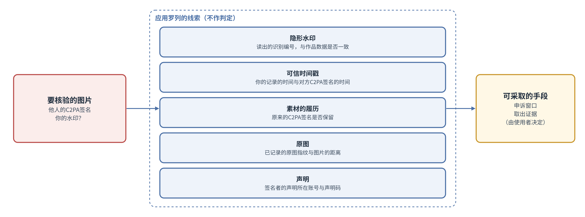

# 基本设计书 第2章 签名信息与比对

Cosplay照片防盗图工具  第1版（草案）  2026-09-29 · 石川宗  
株式会社流山ソフトウェア開発（NRSD）  
Word版: [02_基本设计书_签名信息与比对.docx](02_基本设计书_签名信息与比对.docx)

© 2026 株式会社流山ソフトウェア開発（NRSD）负责开发者　石川宗　本文件的著作权归株式会社流山ソフトウェア開発（NRSD）所有。本文件所引用的第三方标准、软件、法令解说等的权利归各权利人所有。本文件为日文原文的译本，如有不一致，以日文原文为准。

---

## 本文件的定位

- 细化概要设计书第2章。本章规定C2PA签名所需信息的输入与核对、声明码的生成方法、个人根证书与签名用证书的各项目、比对的手段与线索、授权与共同权利的文书、签名密钥的生成、保管、使用与重新生成。与第8章（终端的数据）同时设计。
- 本章基于研讨备忘“第2章 签名信息与比对、第8章 仓库与数据管理的研讨”（NRSD内部的研讨记录，不随本文件分发。作为设计依据的事实，已连同出处写在本文件的各节中）。
- 承接的决定如下表。

|编号|种类|内容|
|---|---|---|
|D-3-1|决定|使用者为图片的权利人（Coser及摄影师），以及经其中任一方授权者|
|D-3-6|决定|以无法排除冒充权利人者为前提，在第5章中规定比对的处理方式|
|D-5-1|决定|本系统不确认使用者，不收集使用者的信息。使用本系统不要求登记|
|D-5-2|决定|C2PA签名的证书，根据使用者输入的信息在客户端应用内生成。不需要认证机构|
|D-5-3|决定|冒充权利人者的行为（抢先签名、替换签名及反向申请）视为无法防止，提示比对的线索。不作判定|
|D-5-4|决定|将本人性与权利性区分处理|
|D-5-5|决定|本系统提供比对的手段，但不代为进行比对|
|I-01|待调查|C2PA签名用证书|
|I-02|待调查|声明所在账号与签名密钥的比对|
|O-01|未决（在基本设计 第2章 4“比对的手段与线索”中决定）|比对线索的提示方式|
|A-4|项目划分中发现的遗漏|错误登记的订正，以及被冒充的真正权利人的救济|
|A-7|项目划分中发现的遗漏|使用者身份确认信息的处理（第2版决定不进行身份确认，前提已不存在）|
|A-15|项目划分中发现的遗漏|C2PA签名中出现真实姓名的风险|

## 1. 设计决定的一览

|编号|决定|理由|被否定的方案|
|---|---|---|---|
|DD-2-1|为C2PA签名要求使用者输入的仅为网名、角色、声明所在账号（任意个数）。不要求电子邮件及其他登记|设计计划书 D-5-1“本系统不确认使用者，不收集使用者的信息。使用本系统不要求登记”、D-5-2“C2PA签名的证书，根据使用者输入的信息在客户端应用内生成。不需要认证机构”。放入证书的信息以此即足够|登记电子邮件的方案（第1版的基本设计）|
|DD-2-2|应用在终端中生成“个人根证书”（密钥与自签名的证书）及由其发行的“签名用证书”（末端证书）两级。C2PA签名以签名用证书进行|C2PA规范将可用于C2PA签名的证书限于末端证书。将个人根证书分开后，即使变更输入，声明码（个人根证书的指纹）也不变|一张自签名证书（每次变更输入声明码都会改变）|
|DD-2-3|权利性的线索，是揭示在声明所在账号的个人资料中的声明码。应用提供比对的手段（显示预期的声明码、打开声明所在账号），结果由进行比对者判断|设计计划书 5.3“本人性与权利性”。个人资料只有本人能写入|由NRSD确认声明揭示的方案（会变成代为比对）|
|DD-2-4|冒充权利人者出现时，应用并列显示设计计划书5.5的线索（隐形水印、可信时间戳、素材的履历、原图、声明），不作判定|设计计划书 D-5-3“冒充权利人者的行为（抢先签名、替换签名及反向申请）视为无法防止，提示比对的线索。不作判定”、D-5-5“本系统提供比对的手段，但不代为进行比对”|由应用判定“哪一方是权利人”的方案|
|DD-2-5|签名密钥放在操作系统的密钥存储中。Windows为凭据管理器的“此电脑”保存。没有Secret Service的Linux，放在以口令加密的密钥文件（age格式）中。终端的迁移使用备份文件（第8章 5“备份文件”）。不使用操作系统的硬件密钥（Secure Enclave、TPM）|不把记录集中到终端之外。硬件密钥无法取出，迁移到其他终端时声明码会改变。Windows的“也迁移到其他电脑”的保存，在组织的电脑上密钥会迁移。Linux的内核密钥存储在重启后消失|把密钥托付给外部的方案。使用硬件密钥的方案|
|DD-2-6|授权与共同权利以文书文件（把JSON与记录电子签名合为一体）表示。经授权者导入文书，在其输出的清单中放入文书的要旨|无需服务器，第三方即可确认“主要权利人的授权”。可以通过聊天应用等作为一个文件交接|以NRSD的登记簿管理关系的方案（第1版）|
|DD-2-7|声明码与识别编号的字符集统一为Crockford Base32（不使用I、L、O、U）|减少误读（1与I、0与O）。第1稿未规定声明码的字符集|RFC 4648的Base32（按第1稿的写法字符顺序不确定）|
|DD-2-8|网名规范化为NFC，不接受控制字符与改变文字方向的字符|防止以改变方向的字符（U+202E等）伪装显示|原样接受的方案|
|DD-2-9|在C2PA签名的证书链（COSE的`x5chain`）中，在签名用证书之后放入个人根证书|声明码根据个人根证书的公钥计算（2.4）。C2PA 2.4的14.5“X.509 Certificates”规定信任起点（根）的证书不宜放入`x5chain`（should not）。这以验证方已持有起点为前提。本系统的个人根证书不在任何人的信任列表中，不放入则谁都无法从图片计算声明码。这不是禁止（shall not），因此说明理由后放入。验证方不会仅因`x5chain`中有自签名证书就将其加入信任起点（RFC 9360的规定），因此放入也不构成伪造信任|不放入的方案（无法从图片计算声明码）。根据签名用证书的Authority Key Identifier计算的方案（无法验证到根证书的链，他人可以制作写有相同值的证书）|
|DD-2-10|记录电子签名（作品数据、案件记录、授权书、撤销书、共同权利的书面文件）以签名用证书的密钥附加，并在记录中附上签名用证书与个人根证书|个人根证书的Key Usage仅为keyCertSign（3.5），以根证书的密钥对记录签名违反密钥的用途。签名用证书会因输入的变更或个人根证书的重新生成而更换（3.4），但凭附在记录上的证书链，旧的记录也能验证到个人根证书（包括过去的个人根证书。3.6）|以个人根证书的密钥对记录签名的方案（第2稿。违反密钥的用途）|
|DD-2-11|个人根证书的有效期为生成后40年，对生成后超过20年的个人根证书停止C2PA签名并要求重新生成。签名用证书的期限与发行它的个人根证书的期限相同。重新生成前的个人根证书作为“过去的个人根证书”留在终端，用于核验自己的旧输出、旧声明码与旧记录（3.6）。由此，任何图片的C2PA签名，自签名起至少20年内在一般的验证器中显示为有效|本系统可信时间戳的TSA不在C2PA的TSA信任列表中，C2PA 2.x的验证器会忽略该可信时间戳，按核验时点的时刻检查签名用证书与个人根证书的有效期（C2PA 2.4的15.8.2。期外则以`claimSignature.outsideValidity`判为不合格）。规范中没有有效期的上限（14.5.1.1）。20年取与损害赔偿请求期间的最长期间（法务调查 L-20“损害赔偿请求的期间（日、中、美）”中的“自行为时起20年”）相同的长度。但请求期间自侵害行为（转载）时起算，本文件的20年自签名时起算，因此对签名后经过较长时间的转载，C2PA签名可能在请求期间结束之前就显示为不合格（第13章 H-18“C2PA的验证器不把本系统的可信时间戳当作受信任的时间，而以核验时点的时间查看证书期限；超过个人根证书期限（生成后40年）的图片会被一般验证器显示为不合格”）。即使在该情况下，RFC 3161的可信时间戳与作品数据仍作为签名时刻的证据留存。信任列表中的TSA（SSL.com等）的免费使用，被说明为以C2PA合规的记录为前提（第3章 4“可信时间戳”），没有允许未登记使用的明文|签名用证书为1年、在到期前重新生成的方案（第2稿。重新生成前的图片全部在1年后不合格）。未登记使用信任列表中的TSA的方案（没有满足使用条件的依据）|

## 2. C2PA签名所需信息的输入

### 2.1 输入的步骤

|步|使用者的操作（应用）|应用的处理|
|---|---|---|
|1|阅读并同意使用条款（第12章“与法务的接点”）|在终端记录所同意的版本与日期时间|
|2|输入网名、角色（Cosplayer、摄影者、经授权者）、声明所在账号的URL（任意个数）|核对输入（2.3）。生成个人根证书的密钥并放入密钥存储（7）。生成声明码（2.4）。生成签名用证书（3）|
|3|把声明码揭示在声明所在账号的个人资料（或置顶帖子）中（声明的文字示例见第5章 6“声明的支援”）|在界面上显示各发布网站的揭示步骤|
|4|（任意）创建备份文件（第8章 5“备份文件”）|—|

- 要求的输入仅此而已。应用不把输入发送到终端之外。
- 每个输入栏都说明“用于什么、放在哪里”（第10章 G-03“签名信息”）。网名与声明所在账号放入证书，与已C2PA签名的图片一同公开。角色放入清单。
- 中途停止，输入也保存在终端中，下次启动时可从中断处继续输入。

### 2.2 揭示声明码处的上限

|发布网站|个人资料的上限|出处|28个字符的声明码与一句简短的声明|
|---|---|---|---|
|X|160个字符|X的帮助“How to customize your X profile”|可容纳|
|Instagram|150个字符|Instagram的帮助“Add a bio to your Instagram profile”|可容纳|
|小红书|约100字（未能确认官方记载）|解说文章 diantuoyi.com|可容纳|
|微博|未能确认|—|［需实测：在编辑界面确认。假设：70字左右可容纳］|

- 在容纳不下的发布网站上，把声明与声明码放在置顶帖子中。只有本人能置顶，与个人资料起相同的作用。

### 2.3 输入的核对

|输入|核对（初始值）|未通过核对时|
|---|---|---|
|网名|1至50个字符。规范化为NFC。不接受控制字符（U+0000至U+001F、U+007F至U+009F）、改变文字方向的字符（U+202A至U+202E、U+2066至U+2069、U+200E、U+200F）、零宽字符（U+200B至U+200D、U+FEFF）。去除前后的空白|在栏下显示理由，不进入下一步|
|角色|Cosplayer、摄影者、经授权者之一|—|
|声明所在账号|以`https://`开头的URL。长度至500个字符。主机名改为小写，去除查询（`?`之后）与片段（`#`之后）。对主要发布网站（X、Instagram、微博、小红书、Patreon、pixiv、pixivFANBOX、Bilibili）的主机名核对形式并加上发布网站的标记。其他主机名，显示一句确认的提示后接受|不接受`http://`等。形式不符的主要发布网站的URL，显示示例|

- 同一URL输入两次时合并为一个。
- 不设真实姓名的输入栏（6）。即使网名看似真实姓名也不作判定。在栏的说明中写明最好不要显示真实姓名（A-15“C2PA签名中出现真实姓名的风险”）。

### 2.4 声明码的生成方法

1. 把个人根证书的公钥变为SubjectPublicKeyInfo的DER形式。
2. 计算其SHA-256。
3. 取出开头的100位。
4. 以Crockford Base32（`0123456789ABCDEFGHJKMNPQRSTVWXYZ`）变为20个字符（每5位，从高位开始）。
5. 在开头加上`NRSD-`，把20个字符每5个字符以`-`分隔（形式：`NRSD-XXXXX-XXXXX-XXXXX-XXXXX`，28个字符）。
- 读取时，把小写读作大写，把I、L读作1，把O读作0（Crockford Base32的规定）。
- 100位的理由：即使使用者有1亿人，偶然一致的概率约为2⁻⁴⁸（n²/2¹⁰¹），可以忽略。加长会占用个人资料的字数（2.2）。
- 样本值：在实现时，把由固定的测试密钥计算出的值载入本文件与测试文件。

## 3. 证书

### 3.1 构成

|证书|内容|有效期（初始值）|
|---|---|---|
|个人根证书|自签名。认证机构的证书（Basic Constraints的cA为真）。主体为网名|40年（DD-2-11“证书有效期的长度使任何图片自签名起20年内都显示为有效”）|
|签名用证书|由个人根证书发行的末端证书。遵循C2PA规范的要求（3.2）|至发行它的个人根证书到期为止（同上）|

- 密钥的种类为ECDSA P-256（C2PA、CAWG的ES256）。

### 3.2 签名用证书的要求（C2PA规范）

- 是X.509证书。可用于C2PA签名的是末端证书（cA为假）。
- 具有Key Usage并设为critical，设置digitalSignature。不设置keyCertSign。
- 具有Extended Key Usage，放入`c2pa-kp-claimSigning`（1.3.6.1.4.1.62558.2.1）与`id-kp-documentSigning`（1.3.6.1.5.5.7.3.36）（后者为与旧验证器兼容）。不放入anyExtendedKeyUsage。
- C2PA Trust List自2.2起限于`c2pa-kp-claimSigning`的证书（C2PA技术规范2.2的修订记录）。本系统的证书不在Trust List中（3.3）。
- 出处的确认（2026-09-29、2026-09-30）：在C2PA技术规范2.4（2.2亦同）14.5.1.1“General Requirements”的原文中，确认了签名算法（ecdsa-with-SHA256等）、曲线（prime256v1等）、版本3、Basic Constraints与keyCertSign的关系、非自签名证书的Authority Key Identifier（必须）、认证机构证书的Subject Key Identifier（必须）、Key Usage（推荐critical，digitalSignature）、末端证书的Extended Key Usage（必须，不可使用anyExtendedKeyUsage）。14.4.1把C2PA Trust List列入`c2pa-kp-claimSigning`（1.3.6.1.4.1.62558.2.1）的信任起点，推荐让使用者能够添加其他起点，并记载了以前的版本曾要求`id-kp-documentSigning`（1.3.6.1.5.5.7.3.36）等。3.5的各项目与此相符。

### 3.3 在验证器中的显示

- 在一般的验证网站上显示为“Valid（没有篡改，但签名者未获保证）”（调查资料“C2PA证书与本人性”）。签名者一栏显示证书中的网名。
- C2PA规范2.4的14.4推荐验证器让使用者添加信任起点。使用者也可以公开自己的个人根证书（任意。本系统不保管）。

### 3.4 期限与输入的错误

- 验证器对期限的处理：本系统的可信时间戳在C2PA的验证器中不被当作可信的时刻（第3章 4“可信时间戳”）。验证器仅在核验时点的时刻处于签名用证书与个人根证书的有效期之内时，才把C2PA签名显示为有效，期外则以`claimSignature.outsideValidity`判为不合格（C2PA 2.4的15.8.2）。因此使签名用证书的期限与个人根证书相同，并把个人根证书的期限取长（DD-2-11“证书有效期的长度使任何图片自签名起20年内都显示为有效”）。
- 修改网名、声明所在账号时，只重新生成签名用证书（期限与个人根证书相同）。修改前制作的图片的C2PA签名，保持修改前的证书，在个人根证书到期前显示为有效。
- 个人根证书生成19年后提示重新生成，对超过20年的个人根证书停止C2PA签名，在重新生成之前不开始导出（8“失败的处理”）。由此，任何图片自签名起至少20年（个人根证书的剩余期间）显示为有效。重新生成后声明码会改变，因此提示重新揭示，并在声明中把旧码作为“旧码（至某日）”保留（3.6）。以旧的个人根证书签名的图片，在旧的个人根证书到期（生成后40年）前显示为有效。
- 证书的日期：2050年以后的日期，在X.509中以GeneralizedTime形式书写（RFC 5280的4.1.2.5）。rcgen支持这一点。［需实测］c2pa-rs与公开页面“核对声明码”页的解析器能够读取notAfter在2050年以后的证书。
- 超过旧的个人根证书期限的图片，在一般的验证器中显示为不合格（第13章 H-18“C2PA的验证器不把本系统的可信时间戳当作受信任的时间，而以核验时点的时间查看证书期限；超过个人根证书期限（生成后40年）的图片会被一般验证器显示为不合格”）。RFC 3161的可信时间戳与作品数据作为签名时刻的证据留存。

### 3.5 各项目

|项目|个人根证书|签名用证书|
|---|---|---|
|版本|3|3|
|序列号|128位的随机数（正数）|128位的随机数（正数）|
|签名算法|ecdsa-with-SHA256|ecdsa-with-SHA256（以个人根证书的密钥签名）|
|发行者|与主体相同（自签名）|个人根证书的主体|
|主体|CN＝网名|CN＝网名|
|有效期|自生成日期时间起40年|自生成日期时间起，至个人根证书到期为止|
|公钥|ECDSA P-256|ECDSA P-256（与个人根证书不同的密钥）|
|Basic Constraints|critical、cA＝真、路径长度0|critical、cA＝假|
|Key Usage|critical、keyCertSign|critical、digitalSignature|
|Extended Key Usage|无|`c2pa-kp-claimSigning`、`id-kp-documentSigning`|
|Subject Alternative Name|无|URI：声明所在账号（按输入的顺序）|
|Subject Key Identifier|公钥的SHA-1（RFC 5280的方法1）|同左|
|Authority Key Identifier|无|个人根证书的Subject Key Identifier|

- 主体中不放入组织名、国名、电子邮件（因为不要求输入。DD-2-1“C2PA签名所需的输入仅为昵称、角色、声明所在账号”）。
- 序列号用随机数，是为了使同一个人根证书下重新生成的证书编号不重复。
- 证书以rcgen生成（第11章 4.1“Rust的组件”）。［需实测］以生成的两级证书，c2pa-rs能制作C2PA签名，验证结果为“有效（签名者不在信任列表中）”。

### 3.6 过去的个人根证书

- 重新生成个人根证书时（每20年的重新生成、无备份的丢失、密钥泄露的嫌疑），把重新生成前的个人根证书（仅公钥。私钥删除）、其声明码、使用期间、重新生成的理由留在终端的`identity/past_roots/`中（第8章 2.1“配置”）。包含在备份文件中。
- 用途：

|场景|过去的个人根证书的用法|
|---|---|
|把自己的旧输出作为素材导入（第3章 2“输入”的①）|以当前的个人根证书或任一过去的个人根证书签名的C2PA签名，作为自己的C2PA签名处理|
|核验（第10章 G-13“核验”）|对以过去的个人根证书签名的图片，显示“这是您以前的声明码（期间）的C2PA签名”|
|授权书、共同权利的书面文件的导入（5.4“文书的核对”的“对方”）|若文书对方的声明码与当前的声明码或任一过去的声明码一致，则作为发给自己的文书导入。发给带有泄露嫌疑标记的旧码的文书，显示标记后请使用者确认|
|记录电子签名的核验（第1章 DD-1-5“终端的记录附记录电子签名并加以验证”）|确认附在旧记录上的证书链中的个人根证书，与当前或过去的个人根证书一致|

- 声明：在重新生成的确认窗口（第10章 3.6“确认窗口的一览”）中，提示揭示新码，并在声明中把旧码作为“旧码（至某日）”保留。若声明中留有旧码，第三方也能把旧作品与声明比对。

## 4. 比对的手段与线索

### 4.1 与声明所在账号的比对

- 把图片放入“核验”界面（第10章 G-13“核验”）后，应用根据C2PA签名的证书，显示签名者的网名、声明所在账号（SAN）、预期的声明码（根据放入`x5chain`的个人根证书按2.4的步骤计算。DD-2-9“在x5chain中放入个人根证书”），并显示打开声明所在账号的按钮。
- 使用者（或任何人）打开个人资料，亲眼确认声明码是否一致。应用不判定一致与否（D-5-5“本系统提供比对的手段，但不代为进行比对”）。
- 把比对的步骤放在公开页面上（第8章 3.3“公开页面（O-05“公开页面的刊载内容”的决定）”），使没有应用的人（浏览者、服务商）也能比对。放在公开页面上的步骤：

  1. 在公开页面的“核对声明码”页打开图片。此页只在浏览器中读取图片（不发送到任何地方。公开页面是静态页面，不违反不设服务器的方针），根据C2PA签名证书链末尾的个人根证书计算并显示声明码。本应用的“核验”也显示相同内容。

  2. 无需手工计算（2.4的步骤是对页面与应用所做处理的说明）。

  3. 打开签名者证书中的声明所在账号（URL），查看个人资料或置顶帖子中是否有相同的声明码。

  4. 若有，则成为“此账号的持有者即此签名密钥的持有者”的线索。若没有，则不成为线索。

### 4.2 原图

- 导出时，把原图的SHA-256与PDQ记录在作品数据中，并附加可信时间戳（第3章“签名处理”）。发生争议时，可以通过出示SHA-256相同的文件，证明自记录之前即持有原图。
- 属于原图的内容（设计计划书 1.5“用语的定义”：公开前的照片数据）：摄影者为RAW、显影前的数据、同一次拍摄中未公开的照片。Cosplayer为从摄影者处收到的未公开的照片。摄影者的授权书、共同权利的书面文件不是原图，作为权利依据的线索另行显示（5）。通过销售交付的图片（购买者也持有）不属于原图。

### 4.3 声明所在账号被盗用

- 盗用者可能把个人资料中的声明码改写为自己的。夺回账号的使用者重新揭示声明码。应用可以把使用者作品数据的可信时间戳（盗用前的日期时间）作为线索显示。本系统不检测盗用。

### 4.4 冒充权利人者出现时的线索

- 把被认为是使用者作品的图片放入“核验”界面后，应用并列显示以下内容。不作判定。

图2-1 比对的线索

|线索|应用显示的内容|
|---|---|
|隐形水印|从图片读出的识别编号、使用者的作品数据中有无该识别编号、是否与清单的记录（`c2pa.soft-binding`的值）不符|
|可信时间戳|使用者作品数据的可信时间戳的日期时间，与图片C2PA签名的可信时间戳的日期时间|
|素材的履历|清单的素材（ingredient）中是否留有使用者的C2PA签名|
|原图|使用者作品数据中记录的原图的SHA-256、PDQ，与图片的PDQ的距离|
|声明|图片C2PA签名的签名者的声明所在账号与预期的声明码（4.1），使用者自己的声明码|

- 显示方式的示例：“此图片带有您的水印（识别编号 P0KT0-G82CJ-B2M），并附有另一签名者（网名 sample_cos）的C2PA签名。您的作品数据的可信时间戳为2026-09-01，此图片C2PA签名的可信时间戳为2026-09-15。”
- 使用者根据线索可以采取的手段（申诉等）在第7章“法律应对指引”中显示。
- 线索的一览可以加入证据包（第6章）导出。

### 4.5 导入前的照片

- 在使用本系统之前公开的照片，没有隐形水印、作品数据、可信时间戳。能显示的线索限于原图（4.2）与公开的事实（发布网站的日期时间等）。在第13章“设计的验证”中作为缺口声明。

### 4.6 导出带有他人C2PA签名的图片时

- 对于带有具他人身份记录（CAWG的`cawg.identity`、本系统的`jp.nrsd.rights`）的C2PA签名的图片，除已导入与该人的授权书、共同权利的书面文件的情况外，应用不予导出。这是为了不让应用本身被用于替换签名。但无法防止在其他软件中替换。
- 带有相机或显影、编辑软件的C2PA签名（不具有人的身份记录）的图片可以导出。之前的C2PA签名作为素材（parentOf）留在履历中，不会消失（第3章 2“输入”）。即使摄影者使用支持C2PA的相机或Lightroom等的Content Credentials，也能以本系统导出。素材清单中可能包含位置、机型、序列号的元数据会被涂黑而不公开（第3章 3.8“素材清单的涂黑”）。

## 5. 授权与共同权利

### 5.1 授权书

- 在主要权利人（Cosplayer或摄影者）的应用中制作。记载内容如5.3的表。
- 经授权者导入授权书。在其输出清单的`jp.nrsd.rights`中放入授权书的要旨（主要权利人的网名与声明码、范围、期限、授权书的哈希），并把授权书本身也作为素材附上。第三方可以与主要权利人的声明码比对。
- 撤销：主要权利人制作撤销书，交给经授权者。没有把撤销告知第三方的中央机制（本系统不收集信息）。由主要权利人通过声明告知。建议把期限设短（默认1年。初始值）。

### 5.2 共同权利（摄影者与Cosplayer）

- 双方交换彼此的声明码（个人根证书的指纹），制作共同权利的书面文件，双方都导入。
- 制作方法：一方制作书面文件的草稿并附加记录电子签名，交给对方。对方确认内容后加上自己的记录电子签名并交回。双方都导入。
- 导出时，进行C2PA签名的是操作者本人。共同权利人在清单中署名，并放入共同权利书面文件的哈希（第3章）。可以通过可见签名的插入字段（第4章 3.1“内容与插入字段”）绘入共同权利人的名字。
- 摄影者与权利人本人不同的照片的权利归属，应事先与摄影者确认（企划草案第10节）。本系统把此确认的结果作为书面文件记录，不判定权利归属本身（设计计划书 D-3-4“以交付、可见签名及与摄影师的权利关系由Coser本人掌握为前提构建”）。

### 5.3 文书的格式

- 文书为一个文件（扩展名为本应用专用。例：`.nrsdgrant`），内容为JSON（`schema: nrsd.grant/1`）。把记录电子签名（以JCS规范化，ECDSA P-256）放入JSON中的`signatures`。

|项目|授权书|撤销书|共同权利的书面文件|
|---|---|---|---|
|`kind`|`grant`|`revoke`|`co_rights`|
|`id`|UUID v7|UUID v7|UUID v7|
|发行者|主要权利人的网名、签名用证书与个人根证书、声明码|同左|双方的网名、签名用证书与个人根证书、声明码、角色|
|对方|接受授权者的网名与声明码|所撤销授权书的`id`|—|
|范围|全部作品，或以拍摄的名称、期间限定|—|全部作品，或以拍摄的名称、期间限定|
|期限|开始日与结束日（默认1年）|撤销的生效日|开始日与结束日（也可选无）|
|条件的文字|自由的文字（至500个字符）|理由（任意）|权利划分方式的文字（至500个字符）|
|制作日期时间|UTC|UTC|UTC|
|记录电子签名|主要权利人签名用证书的密钥（DD-2-10“记录电子签名用签名用证书的密钥附加，并附上证书链”）|同左|双方签名用证书的密钥|

### 5.4 文书的核对

|核对事项|方法|未通过时|
|---|---|---|
|格式|`schema`与各项目的形式|不导入|
|记录电子签名|以签名用证书的公钥验证，并确认签名用证书是由个人根证书发行的（制作文书时处于证书的有效期内）|不导入|
|声明码|根据文书中的个人根证书计算出的声明码，与文书中写明的声明码一致|不导入|
|对方|授权书对方的声明码，与导入的使用者当前的声明码或过去的个人根证书的声明码（3.6“过去的个人根证书”）中的任一个一致|显示“不是发给您的”而不导入。发给带有泄露嫌疑标记的旧码的文书，显示标记后请使用者确认|
|期限|开始日与结束日|若在期限外，导入但加上“期限外”的标记|

- 导入的文书放在`approvals/`中（第8章 2.1“配置”）。记录核对的结果与导入的日期时间。
- 文书发行者的声明码是否揭示在发行者的声明所在账号中，由使用者确认（应用显示打开声明所在账号的按钮）。

## 6. 权利人信息

- 公开的范围（R-2-5-1“放在图片上（被公开）的范围已确定”）：证书的主体（网名）与SAN（声明所在账号），清单中的角色。这些与已C2PA签名的图片一同公开。没有其他输入。
- 真实姓名（R-2-5-2“真实姓名不会在签名、界面上被无意公开”）：不设输入栏。证书、清单中不载入姓名。使用者在申诉（第7章）中使用姓名时，由使用者自己输入，本系统不保存。
- 变更的履历（R-2-5-3“变更的履历留在终端上”）：每次变更输入时，在终端记录变更的日期时间与前后的值（包括重新生成的证书的一览）。履历追加到`identity/history.jsonl`中（第8章 2.1“配置”），可在第10章 G-19“密钥与声明码”中查看。

## 7. 签名密钥

### 7.1 生成与保管

- 在终端生成ECDSA P-256的密钥（随机数使用操作系统的密码学随机数）。生成个人根证书的密钥与签名用证书的密钥两个。
- 保管于操作系统的密钥存储（7.5）。不在界面上显示密钥。
- 密钥仅在以使用者的口令加密的备份文件（第8章 5“备份文件”）中才离开终端。

### 7.2 丢失与泄露

|事件|步骤|过去的C2PA签名|
|---|---|---|
|终端的丢失、故障（有备份）|在新终端导入备份文件。声明码不变|保持有效|
|终端的丢失、故障（无备份）|生成新的个人根证书，在声明所在账号上重新揭示新的声明码。建议在声明中把旧码作为“旧码（至重新揭示之日）”保留。如手头有旧的输出，可从其C2PA签名中取出旧的个人根证书，加入“过去的个人根证书”（3.6）|保持有效。若声明中不保留旧码，以旧声明码的密钥做的C2PA签名在与声明的比对中将不再一致（第13章 H-43“更换声明码后（每20年的重新生成、无备份的丢失、泄露嫌疑），如声明中不保留旧码，旧作品的声明码比对就不再一致”）。可信时间戳早于重新揭示之日可作为线索|
|密钥泄露的嫌疑|生成新的个人根证书，重新揭示声明码。在声明中写明“旧码自（该日期）起不再使用”。旧的个人根证书加上“泄露嫌疑（日期）”的标记留在“过去的个人根证书”中（3.6）|以泄露的密钥做的C2PA签名，在旧的个人根证书到期（生成后最长40年）前，在一般的验证器中显示为有效（不具有吊销机制）。带有可信时间戳的C2PA签名，若时刻晚于泄露嫌疑的日期，第三方可以与声明比对而加以怀疑。没有可信时间戳的C2PA签名，无法分辨是泄露之前还是之后（第13章 H-13“终端被完全侵入时，无法防止密钥重新生成前的C2PA签名；以泄露的密钥进行的C2PA签名，在旧个人根证书的期限（最长40年）前显示为有效”）|

- 不持有吊销列表（CRL）。重新揭示声明码，起到对第三方告知吊销的作用。

### 7.3 多个终端

- 在其他终端导入备份文件，使用相同的个人根证书与签名用证书（第1章 13“终端与人”）。

### 7.4 使用应用时的认证

- 密钥由操作系统的密钥存储通过操作系统使用者的登录加以保护（Windows、Linux的Secret Service在登录状态下可不显示确认窗口而读取。macOS取决于钥匙串的许可。7.5）。不设应用独有的密码（为不增加非技术人员的负担）。仅在创建、导入备份文件时，以及没有Secret Service的Linux（7.5）时要求口令。

### 7.5 各操作系统的保管方式

|操作系统|保管|设置|注意|
|---|---|---|---|
|Windows|凭据管理器的通用凭据|保存类型为“此电脑”（LOCAL_MACHINE）。每项至2,560字节（Microsoft的CREDENTIAL说明）。P-256的密钥（PKCS#8约140字节）可容纳|“也迁移到其他电脑”（ENTERPRISE）会随漫游配置文件迁移到其他电脑，因此不使用|
|macOS|钥匙串的通用密码项目|以应用的代码签名限定可读取的范围|［需实测］同一开发者签名的应用更新后，仍能不显示确认窗口而读取|
|Linux（有Secret Service）|Secret Service（GNOME Keyring、KWallet等。D-Bus）|—|—|
|Linux（无Secret Service）|把以口令加密的密钥文件（age格式，scrypt 2^18）放在应用的数据位置|启动时要求口令|内核的密钥存储（keyutils）在重启后消失，因此不使用（man7.org的keyrings说明）|

- 组件为keyring的crate（4.2.0。第11章 DD-11-6“密钥放在操作系统的密钥存储中”）。Windows使用keyring的Windows用保管组件（windows-native-keyring-store 1.1.0，MIT OR Apache-2.0）。该组件所创建凭据的默认保存类型为Enterprise（也迁移到其他电脑），在创建项目时向`persistence`的指定传入`Local`（此电脑），即以LOCAL_MACHINE保存（于2026-09-30确认了组件源码的说明与实现）。本系统必定传入`Local`。对已有项目读取并确认其保存类型，若不是`Local`则重新创建。
- 不使用硬件密钥（macOS的Secure Enclave、Windows的TPM）。因为密钥无法取出，迁移到其他终端时声明码会改变（DD-2-5“签名密钥放在操作系统的密钥存储中，迁移使用备份文件”）。

### 7.6 使用时的处理

- 密钥在签名之前才从密钥存储读取，使用完毕后从内存中清除（zeroize的crate）。批量导出期间保持到导出结束，结束后清除。
- 不把密钥写入操作的记录（日志）（第1章 10.4“操作日志”）。
- 无法从密钥存储读取时（操作系统拒绝、密钥不存在），不开始签名，显示理由与下一步要做的事（确认密钥存储、从备份恢复）。

## 8. 失败的处理

|事件|通知方式|使用者要做的事|
|---|---|---|
|无法写入密钥存储（首次）|显示理由，不进入下一步|确认操作系统的密钥存储。Linux安装Secret Service，或选择以口令保护的保管|
|无法从密钥存储读取|不开始签名并显示理由（第1章 10.3“错误”的`SIG`编号）|确认，或从备份恢复|
|个人根证书生成后已过19年|启动时提示在1年内重新生成（不停止导出）|以1次操作重新生成，显示新的声明码|
|个人根证书生成后已过20年|停止C2PA签名，不开始导出。显示理由（“以此密钥签名的图片，无法保持自签名起20年的有效”）与重新生成（DD-2-11“证书有效期的长度使任何图片自签名起20年内都显示为有效”）|以1次操作重新生成。提示在声明中保留旧码（3.6）|
|导入的文书未通过核对|不导入并显示理由（5.4）|向对方确认|
|输入未通过核对|在栏下显示理由（2.3）|修改|

## 9. 与界面的关系

|功能|界面|
|---|---|
|输入（2）|第10章 G-03“签名信息”|
|声明的揭示（2.2）|第10章 G-04“发布声明”|
|比对（4）|第10章 G-13“核验”、G-24“线索比较”|
|授权、共同权利（5）|第10章 G-18“授权与共同权利”|
|密钥与声明码、变更的履历（6、7）|第10章 G-19“密钥与声明码”|

## 10. 与要求的对应

|要求的编号|要求的内容|本文件中承接的节|
|---|---|---|
|R-2-1-1|能从图片的C2PA签名确认签名者（放入证书的信息）|3“证书”|
|R-2-1-2|对证书的期限、更新以及输入的错误有所准备|3.4“期限与输入的错误”、2.3“输入的核对”|
|R-2-2-1|具有任何人都能通过与声明所在账号的比对，确认签名者与该照片权利人之间联系的手段|2.4“声明码的生成方法”、4.1“与声明所在账号的比对”|
|R-2-2-2|能把持有原图用作线索|4.2“原图”|
|R-2-2-3|对声明所在账号被盗用时有所准备|4.3“声明所在账号被盗用”|
|R-2-3-1|发生抢先签名、签名替换、反向申诉时，能并列显示比对的线索（不作判定）|4.4“冒充权利人者出现时的线索”、4.6“导出带有他人C2PA签名的图片时”|
|R-2-3-2|对导入前的照片，示明能显示的线索与不能显示的范围（不能显示的部分在第13章声明）|4.5“导入前的照片”|
|R-2-3-3|能根据线索知道真正的权利人可以采取的手段（第7章）|4.4“冒充权利人者出现时的线索”|
|R-2-4-1|非技术人员能完成C2PA签名所需信息的输入（判定的标准在基本设计中规定）|2“C2PA签名所需信息的输入”（判定的标准为第10章 2.4“判定”的使用者试用）|
|R-2-4-2|能进行授权的授予、范围、期限、撤销|5.1“授权书”、5.3“文书的格式”、5.4“文书的核对”|
|R-2-4-3|摄影者与Cosplayer能处理同一照片|5.2“共同权利（摄影者与Cosplayer）”|
|R-2-5-1|载于图片上（公开）的范围已确定|6“权利人信息”|
|R-2-5-2|真实姓名不会在签名、界面上无意中公开|6“权利人信息”、2.3“输入的核对”|
|R-2-5-3|变更的履历留在终端|6“权利人信息”|
|R-2-6-1|被安全地保管，处理中也受到保护|7.1“生成与保管”、7.5“各操作系统的保管方式”、7.6“使用时的处理”|
|R-2-6-2|丢失、泄露时能重新生成密钥、重新揭示声明，过去签名的处理已确定|7.2“丢失与泄露”|
|R-2-6-3|能在多个终端使用|7.3“多个终端”|

## 11. 本章声明的缺口

- 冒充权利人者抢先的C2PA签名、替换、反向申诉无法防止。应用仅限于显示线索，不作判定（D-5-3“冒充权利人者的行为（抢先签名、替换签名及反向申请）视为无法防止，提示比对的线索。不作判定”）。
- 由于不确认使用者，输入的网名、声明所在账号是否属于本人，由进行声明码比对者确认。不进行比对的浏览者无法识别虚假的签名者。
- 对导入前公开的照片能显示的线索，限于原图与公开的事实。
- 没有把授权的撤销告知第三方的中央机制。
- 由于本系统的构成（在终端生成，不使用认证机构。设计计划书 D-5-2“C2PA签名的证书，根据使用者输入的信息在客户端应用内生成。不需要认证机构”），个人根证书不在C2PA Trust List中。在一般的验证网站上仅止于“Valid（没有篡改）”而不会成为“Trusted”，签名者不获保证。
- 把个人根证书放入`x5chain`，不遵循C2PA 2.4的“不宜放入”（第13章 H-42“将个人根证书放入C2PA签名的证书链（x5chain），不符合C2PA 2.4的“不宜放入””。DD-2-9“在x5chain中放入个人根证书”）。［需实测］c2pa-rs与一般的验证网站把此证书链的图片显示为Valid。
- 在没有备份的情况下丢失终端并重新揭示声明码，旧作品的声明比对将不再一致（第13章 H-43“更换声明码后（每20年的重新生成、无备份的丢失、泄露嫌疑），如声明中不保留旧码，旧作品的声明码比对就不再一致”）。提示在声明中把旧码作为“旧码（至某日）”保留（7.2）。
- 在没有Secret Service的Linux上，每次启动都需要口令。
- 超过旧的个人根证书期限（生成后40年）的图片，在一般的验证器中显示为不合格。以泄露的密钥做的C2PA签名，在旧的个人根证书到期前显示为有效（3.4、7.2）。

## 12. 对其他章、概要设计书的订正

- 第1章 8.2“标识符的体系”：写明声明码的字符集为Crockford Base32（DD-2-7“声明码与识别编号统一使用Crockford Base32”）。
- 第8章 5“备份文件”：备份文件的格式为age（第8章 DD-8-3“更换终端与故障的准备通过备份文件（age格式）进行”）。改正第1稿的Argon2id与AES-256-GCM的组合。
- 第11章 4.1“Rust的组件”：把argon2、aes-gcm改为age，并加上zeroize。
