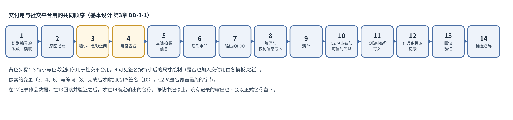

# 基本设计书 第3章 签名处理

Cosplay照片防盗图工具  第1版（草案）  2026-09-29 · 石川宗  
株式会社流山ソフトウェア開発（NRSD）  
Word版: [03_基本设计书_签名处理.docx](03_基本设计书_签名处理.docx)

© 2026 株式会社流山ソフトウェア開発（NRSD）负责开发者　石川宗　本文件的著作权归株式会社流山ソフトウェア開発（NRSD）所有。本文件所引用的第三方标准、软件、法令解说等的权利归各权利人所有。本文件为日文原文的译本，如有不一致，以日文原文为准。

---

## 本文件的定位

- 细化概要设计书第3章。章名“签名处理”是设计计划书 4.2“系统模块”中区块的名称，指C2PA签名、可信时间戳、隐形水印、比对用哈希、识别编号的赋予与记录。与第5章（许可范围的记录）、第11章（库、运行环境）往返（第3章与第5章、第3章与第11章）。
- 承接的决定如下表（设计计划书第2版的决定、待调查、未决，以及项目划分中发现的遗漏）。设计计划书的决定、待调查、未决的文字依第13章 1.2“从设计计划书的决定到概要设计书、基本设计的对应”与概要设计书的去向表（本章不转载，只载编号与项目划分中发现的遗漏）。

|编号|种类|内容|
|---|---|---|
|A-3|项目划分中发现的遗漏|确认C2PA签名在云中是否留存|
|A-8|项目划分中发现的遗漏|拍摄信息（位置信息等）的去除|
|A-15|项目划分中发现的遗漏|C2PA签名中出现真实姓名的风险|

- 参照的内容如下表。

|参照对象|参照的事项|
|---|---|
|调查资料“签名处理的技术要素”|C2PA、TrustMark、PDQ组件的事实|
|调查资料“发布网站与云端的C2PA保留”|在发布网站与云端C2PA签名是否保留|
|法务调查 L-1“权利管理信息的去除、改变（日）”至L-4“权利管理信息的保护（条约）（国际）”|权利管理信息的删除、改变（日本、中国、美国、条约）|
|第1章 8.2“标识符的体系”|识别编号的格式|
|第2章 3“证书”|签名用证书|
|第11章“开发基础”|用于C2PA、水印、PDQ、图像读写的组件|

## 1. 设计决定的一览

|编号|决定|理由|被否定的方案|
|---|---|---|---|
|DD-3-1|处理的顺序为：“发行识别编号并读入，其次原图的指纹，其次（仅社交平台用）缩小与色彩空间的转换，其次可见签名（放入时。按缩小后的尺寸绘制），其次删除拍摄信息，其次隐形水印，其次输出的PDQ，其次编码（变为JPEG等的字节）与文件的权利记载（3.6），其次制作清单，其次C2PA签名（附可信时间戳。把清单嵌入编码后的字节），其次以临时名称写入，其次输出的SHA-256，其次记录作品数据，其次读回的验证，其次确定输出的名称”|C2PA的硬绑定是对最终的字节计算的，因此改变像素的处理（可见签名、缩小、水印）、编码与XMP的写入全部在C2PA签名之前完成。水印按最终的尺寸嵌入（不因缩小而损伤水印）|先嵌入水印后缩小的方案|
|DD-3-2|水印为TrustMark variant Q，纠错为BCH_5（数据61位），在数据部分放入识别编号（第1章 8.2“标识符的体系”）。若［需实测］显示社交平台再压缩后的读出率未达到标准，则切换为variant P或C|列在C2PA软绑定的一览中（com.adobe.trustmark.Q。调查资料“签名处理的技术要素”第2节）。61位可容纳识别编号，并可纠正至多5位的错误（TrustMark的datalayer.py）|BCH_SUPER（40位。编号空间变窄而不再唯一。第1章 8.2“标识符的体系”）|
|DD-3-3|清单中记录使用者的网名、识别编号、许可范围、随附文件的哈希、共同权利人、水印的有无，不记录姓名、位置信息、设备的序列号、电子邮件。著作者名、著作权标示、使用条件放在`cawg.metadata`中，著作者的身份放在`cawg.identity`中，本系统特有的项目放在`jp.nrsd.rights`中|在满足作为权利管理信息的要求（法务调查 L-1“权利管理信息的去除、改变（日）”：关于著作权等的信息，用于电子计算机管理的信息）的同时，不公开个人信息（A-15“C2PA签名中出现真实姓名的风险”）。C2PA 2.x的`c2pa.metadata`只允许固定的项目，无法放入著作者名、著作权标示（C2PA规范2.4附录B.2）。`cawg.metadata`不受此限制（CAWG metadata 1.0）|把著作者名等放入`c2pa.metadata`的方案（违反规范）|
|DD-3-4|对原图，无论能否读取像素都记录文件的SHA-256，并作为清单的素材（ingredient）载入原图的SHA-256|只有持有原图者，日后才能出示SHA-256相同的文件（第2章 4.2“原图”，持有原图的证明）。原图本身不包含在输出中|载入原图缩略图的方案（原图的内容会泄露）|
|DD-3-5|可信时间戳在C2PA签名时取得（在线时）。离线的输出不附可信时间戳而进行C2PA签名，在下次连接时就输出的SHA-256取得可信时间戳，附加到作品数据中|兼顾D-7-1“对输出的所有图片附加C2PA签名”（所有输出都有C2PA签名）与DD-1-7“离线也能进行C2PA签名、编辑、输出、登记”（离线也能作业）|离线时不进行C2PA签名的方案|
|DD-3-6|交付用图片是否放入可见签名（O-11“交付用图片的可见签名”），通过让每个可见签名模板具有“交付用也放入”的设置来决定。不设应用层面的默认|是否放入取决于可见签名的设计（大小、位置、内容）（NRSD的判断）。既有仅用于社交平台的低调设计，也有可以放入交付用图片的设计|由应用默认放入/不放入的方案|
|DD-3-7|C2PA规范的版本，遵循所采用的c2pa-rs版本输出的版本，与应用的版本一起记录。验证接受2.x的清单|自行选择规范的版本会与SDK不一致。2.4为最新（设计计划书 第17章“第三方权利及许可”）|—|
|DD-3-8|在输出的文件中，与C2PA清单分开，以XMP写入IPTC照片元数据的权利项目（作者、署名行、著作权标示、权利信息的URL、使用条件、许可的咨询处），并使EXIF的Artist与Copyright为相同的内容。在C2PA签名之前写入|摄影行业的工具（显影软件、操作系统的文件属性显示）与搜索（Google图片搜索的许可显示）读取的是IPTC、XMP、EXIF的项目，而不是C2PA清单。对不读取C2PA的对象也能传达权利人。C2PA的硬绑定作用于文件的字节，因此在签名之前写完|只写在清单中（cawg.metadata）的方案（不读取C2PA的工具看不到）|

## 2. 输入

|输入|处理|
|---|---|
|JPEG、PNG、TIFF、WebP|读取像素并处理|
|RAW、HEIC、其他|不读取像素。作为原图记录SHA-256（仅原图的指纹）。提示不能用于输出（第11章 DD-11-5“图片的读写使用image crate”）|
|损坏的图片|跳过该1张，在一览中显示理由。批量处理继续|
|过大的图片（超过1亿像素，或超过200MB）|跳过该1张，显示理由（第1章 14.1“规模与性能的目标”）|
|灰度、带Alpha、CMYK|灰度扩展为RGB处理，输出也为RGB（位数保持）。Alpha保留，水印与可见签名放入RGB的平面。CMYK的TIFF不读取像素，仅取原图的指纹，并引导显像为sRGB、Adobe RGB的照片后使用|
|已有C2PA签名的图片|验证清单，按以下方式处理（第2章 4.6“导出带有他人C2PA签名的图片时”）。①自己（当前的个人根证书，或过去的个人根证书。第2章 3.6“过去的个人根证书”）的C2PA签名：作为素材导入，把履历连接到新的输出。②相机、显影或编辑软件（支持C2PA的相机、Lightroom与Photoshop的Content Credentials等）的C2PA签名中，不具有人的身份记录（CAWG的身份记录`cawg.identity`、本系统的`jp.nrsd.rights`）者：作为素材（parentOf）导入，不删除之前的C2PA签名而连接到履历。之前的签名者对验证者可见。素材的清单会同捆在输出的清单集合中公开，因此对素材清单中可能包含位置、机型、序列号的元数据断言（`c2pa.metadata`、旧版的`stds.exif`与`stds.iptc`）进行涂黑（3.8“素材清单的涂黑”）。③具有他人身份记录的C2PA签名，且已导入与该人的授权书、共同权利的书面文件（第2章 5“授权与共同权利”）时：作为素材导入，并为该人署名。④具有他人身份记录的C2PA签名，且没有关系时：不处理（为了不让应用被用于抢先的C2PA签名、替换。D-5-3“冒充权利人者的行为（抢先签名、替换签名及反向申请）视为无法防止，提示比对的线索。不作判定”）。显示“有他人的C2PA签名”的理由。⑤清单中有表示篡改的编号（`claimSignature.mismatch`、`assertion.dataHash.mismatch`等。10.2）时：不处理（在无法确认来历的图片上叠加C2PA签名，与覆盖他人C2PA签名的行为无法区分）。提示使用者从原图重新处理。签名者不在信任列表中（`signingCredential.untrusted`）不是Valid的条件（C2PA 2.4的14.3.5“Valid Manifest”），不作为停止处理的理由（使用者自己过去的输出也带有此编号）。处于证书有效期之外（`claimSignature.outsideValidity`）不表示篡改，按①至④处理，并显示“签名所用证书的期限已过”（第2章 3.4“期限与输入的错误”）|
|方向（EXIF的Orientation）|把像素旋转为正确的方向后处理，在输出中把Orientation设为“原样”|
|色彩（ICC配置文件）|保留。没有ICC且EXIF的ColorSpace为Uncalibrated、InteropIndex为`R03`的照片视为Adobe RGB（Exif的规约。DCF的扩展色彩空间）。不是sRGB时也不转换（第4章的社交平台用输出转换为sRGB。第4章 14.3“缩小、颜色的转换、JPEG的导出”）|

- 内存的上限：读取像素之前，根据文件头的长宽与位数算出一张的内存估计（长×宽×每像素的字节数。8位的RGBA为4，16位的RGBA为8），并以该值给出读取的上限（image默认的上限512MiB不够16位的大照片。1亿像素在RGBA8下约381MiB、RGBA16下约763MiB。60,000,000像素则约229MiB与约458MiB）。
- 威胁T-19（权限提升）：以恶意字体、图片攻击应用核心的漏洞。攻击者：交付文件者。目标资产：应用的核心。剩余的缺口：部件的未知漏洞

## 3. C2PA清单

### 3.1 记录的项目

|断言|内容|
|---|---|
|c2pa.hash.data|对输出字节的硬绑定（由SDK计算）|
|c2pa.actions.v2|3.4表中的操作。对每个操作记录本应用的名称与版本|
|c2pa.ingredient.v3|原图：关系为parentOf，格式（`dc:format`）。不附缩略图（DD-3-4“记录原图的SHA-256并作为素材列出”）。素材的记录（ingredient v3）中没有SHA-256与像素尺寸的项目，因此原图的SHA-256与像素尺寸放在`jp.nrsd.rights`中|
|c2pa.soft-binding|算法`com.adobe.trustmark.Q`（或经实测切换后的`com.adobe.trustmark.P`、`.C`。C2PA软绑定一览中的名称）。值（`blocks`的`value`）的格式由算法规定（C2PA 2.4的18.10.2）。本系统把TrustMark嵌入的位串（识别编号的61位与纠错码）按TrustMark规定的形式放入。［需实测］c2pa-rs与TrustMark的实现所写入的值的形式|
|cawg.metadata|`dc:creator`、`dc:rights`、`xmpRights:UsageTerms`、`xmpRights:WebStatement`（值与3.6“文件的权利记载（IPTC的照片元数据）”的表相同）|
|c2pa.metadata|不记录（因为不允许著作者、权利的项目。C2PA规范2.4附录B.2）。仅在保留拍摄日期时间时放入`exif:DateTimeOriginal`（允许的项目）|
|jp.nrsd.rights（本系统特有。标签为NRSD的域名nrsd.jp的倒序）|识别编号、ISCC（6）、原图的SHA-256与像素尺寸、许可范围的ID与版本、随附文件的SHA-256（仅交付用）、共同权利人的网名、主要权利人（经授权者的输出时）、参考信息的版本、所用参考信息文字各文件的SHA-256、拍摄名（为从10.1的可移植名称还原。原文件名可能含真实姓名等，因此不放入公开的清单，只留在作品数据与`00_INDEX.txt`中）（2026-09-30 NRSD的要求）|
|cawg.identity|X.509（`cawg.x509.cose`）。以签名用证书附加CAWG的签名。角色：摄影者为`cawg.creator`，Cosplayer为独有的角色`jp.nrsd.subject`（CAWG身份断言的现行版本1.3推荐从规定的值中选择角色，但也允许其他的值。于2026-09-30在cawg.io确认），经授权者为`cawg.publisher`|
|c2pa.thumbnail.claim|输出的缩小图像（是输出本身的缩小，因此是可以公开的信息。C2PA 2.4的18.13）|
|（claim的属性）|`claim_generator`＝`c2pa4cosplayer/<版本>`、`title`＝可移植的名称（10.1。不放入原名称）、素材的`instance_id`＝`xmp:iid:<UUID v7>`（XMP标识符的形式）|
|cawg.training-mining|AI学习、数据挖掘的可否。默认把`cawg.data_mining`、`cawg.ai_inference`、`cawg.ai_training`、`cawg.ai_generative_training`四项全部设为`notAllowed`。仅在使用者于许可范围（第5章“权利文书”）中选择时变更（出处：cawg.io/training-and-data-mining/1.1/、opensource.contentauthenticity.org的assertions说明）|

- 声明签名（C2PA签名）：签名用证书（第2章 3“证书”），ES256。把可信时间戳（RFC 3161）的应答包含在C2PA签名中（在线时）。
- 规范推荐让制作者能够控制包含哪些来历数据（调查资料“签名处理的技术要素”第1节）。本应用以上表为默认，使用者可以关闭的仅为“拍摄日期时间、机型的记录”的有无（主张权利所需的项目不允许关闭）。

### 3.2 不记录的项目

- 姓名、电子邮件、住址、位置信息（GPS、地点的名称）、设备与镜头的序列号、所有者名（EXIF的Artist等予以删除，替换为网名）。
- 作为素材导入的其他C2PA签名（相机、显影或编辑软件）的清单中所含的这些项目，也通过3.8的涂黑而不载入输出。

### 3.3 权利标示的语言

- 著作权标示为不依赖语言的形式（©、年、网名）。
- 使用条件的摘要默认为英语，使用者界面的语言为日语、中文时，同时并记该语言的摘要（`xmpRights:UsageTerms`可以带语言指定持有多个）。

### 3.4 操作的记录

|处理|操作的名称|制作方式的种类（digitalSourceType）|理由|
|---|---|---|---|
|打开原图|`c2pa.opened`（最初的操作。以hashed-uri指向原图的素材记录`c2pa.ingredient.v3`）|不附（C2PA 2.4：`c2pa.opened`不需要制作方式的种类）|表示与素材（原图）的关系。C2PA 2.4要求在`c2pa.opened`的`ingredients`中放入对所打开素材记录的参照|
|缩小（社交平台用）|`c2pa.resized.proportional`|不附（豁免的操作）|保持纵横比的缩小（C2PA 2.3中增加的名称）。`c2pa.resized`泛指尺寸、文件大小的变更（“Changes to either content dimensions, its file size or both”），不是豁免的操作，因此使用更为限定的名称|
|绘入可见签名|`c2pa.edited`|`http://cv.iptc.org/newscodes/digitalsourcetype/humanEdits`（由人以非生成的工具加工的内容）|C2PA合规的判定标准（c2pa-org/conformance-public的asset-rubrics/composables/globals-actions.yml）对不在豁免一览中的操作要求制作方式的种类。规范正文规定为必须的，仅是`c2pa.created`的制作方式的种类（18.15.2）。本系统不取得合规（Conformance Program），但依照此标准。文字与图像的图层由使用者放置，自动布局的u2netp只选择放置位置而不生成像素，因此不属于生成式AI的种类（`trainedAlgorithmicMedia`、`compositeWithTrainedAlgorithmicMedia`、`compositeSynthetic`）|
|隐形水印|`c2pa.watermarked.bound`（以`parameters`的`relatedAssertions`指向`c2pa.soft-binding`）|不附（豁免的操作）|C2PA 2.3（2025年12月）增加了“用于制作软绑定的水印”`c2pa.watermarked.bound`与不制作软绑定的水印`c2pa.watermarked.unbound`，2.4把`c2pa.watermarked`定为不推荐。本系统的水印把识别编号记录在软绑定中，因此使用`.bound`。验证器在有`.bound`（及旧的`c2pa.watermarked`）却没有`c2pa.soft-binding`时，以`assertion.action.softBindingMissing`拒绝。所采用的c2pa-rs版本只能以2.2的形式写入时，使用`c2pa.watermarked`（DD-3-7“C2PA规范的版本随c2pa-rs的版本”）|
|拍摄信息的删除与文件的权利记载（3.6“文件的权利记载（IPTC的照片元数据）”的XMP、EXIF）|`c2pa.edited.metadata`|不附（豁免的操作）|不改变像素、仅变更元数据|
|方向的规范化（EXIF的Orientation不是“原样”时）|`c2pa.orientation`|`humanEdits`|把像素旋转为正确的方向（2的表）。不是豁免的操作，因此附加制作方式的种类|
|色彩空间的转换（社交平台用且不是sRGB时）|`c2pa.adjustedColor`（`description`为“转换为sRGB”）|`humanEdits`|第4章 14.3“缩小、颜色的转换、JPEG的导出”的转换为sRGB|
|编码（8.1的第8步。交付用、社交平台用均是。包括同一格式的重新编码，以及由非JPEG的原图制作社交平台用JPEG的格式转换）|`c2pa.transcoded`|不附（豁免的操作）|重新编码。属于规范的定义“A conversion of one encoding to another, including resolution scaling, bitrate adjustment and encoding format change”|
|素材清单的涂黑（素材中有其他C2PA签名时）|`c2pa.redacted`（`reason`：`c2pa.PII.present`）|不附（豁免的操作）|3.8“素材清单的涂黑”|

- 整体：把操作记录的`allActionsIncluded`设为真（表示已记录本应用所做的全部操作。C2PA 2.4的18.15.3推荐设置，并规定没有时应理解为可能存在未记录的操作）。为使其为真，上表列出了本应用对像素、格式、元数据进行的所有处理（8.1的各步）。增加步骤时，在此表中增加操作。
- 出处：C2PA技术规范2.4的18.15“Actions”（已以原文确认。`c2pa.watermarked`的不推荐、`.bound`与`.unbound`的定义、`c2pa.opened`与素材的参照、`allActionsIncluded`、以`humanEdits`作为制作方式种类的示例），2.2的18.14“Actions”与2.3的操作一览（通过对照2.2与2.3的正文，确认了`.bound`、`.unbound`、`c2pa.resized.proportional`是在2.3中增加的），合规的判定标准（conformance-public的globals-actions.yml。于2026-09-30获取。不需要制作方式种类的操作：`c2pa.converted`、`c2pa.published`、`c2pa.repackaged`、`c2pa.transcoded`、`c2pa.resized.proportional`、`c2pa.enhanced`、`c2pa.edited.metadata`、`c2pa.watermarked`、`c2pa.watermarked.bound`、`c2pa.watermarked.unbound`、`c2pa.redacted`）。豁免的一览可能修订，因此确认以所采用的c2pa-rs版本验证时不出现警告（［需实测］）。
- 制作方式种类的出处：IPTC Digital Source Type的词表（cv.iptc.org/newscodes/digitalsourcetype/。于2026-09-29获取。`minorHumanEdits`已废止，`humanEdits`表示“由人以非生成的工具进行的修正、增强”）。
- 不附生成式AI种类的理由：发布网站有时会读取C2PA、IPTC的制作方式种类并加上“由AI制作”的标示。在中国，根据《人工智能生成合成内容标识办法》（2025年9月1日施行）与GB 45438-2025，发布网站会确认文件元数据中的AI标示。为使使用者的照片不被标示为AI生成，不附生成式AI的种类（法务调查 L-30“AI生成合成内容的标识（中）”）。

### 3.5 可信时间戳的放置处

- 可信时间戳以`tstContainer`的形式，放入C2PA签名（COSE的签名）的不受保护头部`sigTst2`（第2版的可信时间戳）中（C2PA技术规范2.1以后）。时刻的对象为签名的值。可信时间戳的请求与应答的验证按4以自制的实现进行，把该实现交给c2pa-rs的签名入口（Signer中发送可信时间戳请求的函数），由c2pa-rs放入`sigTst2`。

### 3.6 文件的权利记载（IPTC的照片元数据）

|IPTC的项目（2025.1）|XMP的项目|内容|
|---|---|---|
|Creator|`dc:creator`|网名（有共同权利人时为两者）|
|Credit Line|`photoshop:Credit`|“{网名}（{声明所在账号}）”（声明所在账号有多个时为开头的一个）|
|Copyright Notice|`dc:rights`|“© {年} {网名}”（与cawg.metadata的`dc:rights`相同）|
|Web Statement of Rights|`xmpRights:WebStatement`|公开页面上权利信息的URL（第5章 5“国家”的`/rights/`）|
|Rights Usage Terms|`xmpRights:UsageTerms`|许可范围的摘要（按语言。3.3）|
|Licensor（Licensor URL）|`plus:Licensor`的`plus:LicensorURL`|声明所在账号的URL（咨询使用许可的对象。有多个时把`plus:Licensor`作为数组全部写入。IPTC的Licensor允许数组）|
|—（EXIF）|EXIF的`Artist`、`Copyright`（以Exif 3.0（CIPA DC-008-2023）的UTF-8类型写入。可放入日语、中文的网名。与IPTC的同步遵循IPTC-CIPA的Photo Metadata Mapping Guidelines。为不认识Exif 3.0的读取方，以XMP的同一项目为准（2026-10-01 NRSD的要求））|网名、“© {年} {网名}”|

- 出处：IPTC Photo Metadata Standard 2025.1（iptc.org。各项目的XMP项目名）。Google图片搜索把Web Statement of Rights作为必须、把Creator、Credit Line、Copyright Notice、Licensor URL作为推荐，用于许可的显示（Google的“图片许可元数据”说明）。
- 写入顺序：在删除拍摄信息（8.4）之后、C2PA签名之前（DD-3-1“规定处理顺序”中“制作清单”之前）。既有XMP的其他项目（拍摄日期时间、机型名中保留的部分）予以保留。
- 社交平台用的图片也写入（在发布网站上多会被删除，但为了不被删除的途径以及使用者在手头的确认）。
- 不写入的项目：姓名、电子邮件、住址（3.2）。不使用`plus:Licensor`的电话、电子邮件栏。

#### 3.6.1 各格式的写入

- 组件（于2026-09-30在crates.io确认）：

|格式|XMP的放置处|EXIF的放置处|组件|
|---|---|---|---|
|JPEG|APP1区段（名称空间`http://ns.adobe.com/xap/1.0/`）|APP1区段（`Exif`）|以img-parts 0.4.0（JPEG、PNG、RIFF区段的读写，纯Rust，MIT OR Apache-2.0）放入区段。EXIF的内容以little_exif 0.6.23（纯Rust，MIT OR Apache-2.0）制作|
|PNG|`iTXt`块（关键字`XML:com.adobe.xmp`）|`eXIf`块|img-parts、little_exif|
|WebP|RIFF的`XMP `块|RIFF的`EXIF`块|img-parts、little_exif|
|TIFF|标签700（XMP）|标签315（Artist）、33432（Copyright）|在以tiff组件（image所使用）编码时作为自定义标签写入|

- XMP的内容（RDF/XML的包）由本应用制作。项目仅限上表的6项与保留的拍摄项目。
- Adobe XMP Toolkit的Rust封装（xmp_toolkit 1.12.1）需要构建C++组件，因此不采用（与第11章 DD-11-15“c2pa-rs不引入OpenSSL”的考虑相同）。
- ［需实测］写入XMP与EXIF之后，c2pa-rs嵌入清单，XMP、EXIF的区段保留，C2PA签名的验证通过（4种格式）。

### 3.7 各格式的嵌入

|格式|嵌入|
|---|---|
|JPEG|嵌入APP11区段（JUMBF）（由c2pa-rs进行）|
|PNG|嵌入`caBX`块（同上）|
|TIFF、WebP|取决于c2pa-rs的支持（列在c2pa-rs支持格式的一览中）。［需实测］16位TIFF能够嵌入与验证|

- 不使用把清单放在另一个文件（`.c2pa`）中的方式。因为在交付的途径中文件一旦分开，只有图片会被传递。

### 3.8 素材清单的涂黑

- 素材的清单同捆在输出的清单集合（Manifest Store）中，与输出一同公开（素材记录`c2pa.ingredient.v3`的`activeManifest`）。相机C2PA签名的`c2pa.metadata`中可能包含位置（GPS）、机型、序列号（C2PA 2.4的18.16，例16）。本文件中拍摄信息的删除（8.4）只涉及输出的EXIF、XMP，因此素材的清单也需要处理。
- 步骤：作为素材导入时，把素材清单的元数据断言（`c2pa.metadata`、旧版的`stds.exif`与`stds.iptc`）的URI列为涂黑的对象（c2pa-rs的`ManifestDefinition::redactions`），在输出的操作记录中加入`c2pa.redacted`（`parameters`的`redacted`为该URI，`reason`为`c2pa.PII.present`）（C2PA 2.4的6.8“Redaction of Assertions”、18.15.4.2、18.15.4.7）。
- 对象的范围：对素材带入的所有清单（素材的当前清单，以及它作为素材参照的此前清单，一直追溯到嵌套的最深处。例：导入Lightroom的输出后，其中相机的清单也会进入输出的清单集合），把元数据断言列为涂黑的对象。清单集合把嵌套平铺排列持有，因此涂黑的URI可以直接指向各清单的断言（C2PA 2.4的6.8、11“Manifests”）。［需实测］c2pa-rs能处理嵌套深处清单断言的涂黑。不能处理时，不导入该素材，并显示“此照片的来历中可能包含位置信息，请从原图导出”。
- 不涂黑的内容：素材清单的操作记录（`c2pa.actions`、`c2pa.actions.v2`。规范禁止涂黑）、硬绑定、签名者的证书。之前的签名者（相机厂商的证书等）对验证者可见。
- 使用者选择保留“拍摄日期时间、机型的记录”（3.1之后的注）时，也对素材清单的元数据进行涂黑（涂黑没有按项目区分位置与序列号而保留的手段。涂黑以断言为单位）。拍摄日期时间与机型，由本应用写入输出清单的`c2pa.metadata`（`exif:DateTimeOriginal`）与输出的EXIF中。
- ［需实测］以支持C2PA的相机（Leica、Sony、Nikon等）与Lightroom的输出，确认位置、机型、序列号放在哪些断言中，并修订涂黑对象的一览。

## 4. 可信时间戳

- C2PA签名时的TSA：向DigiCert（timestamp.digicert.com）、GlobalSign、FreeTSA（免费，RFC 3161。调查资料“签名处理的技术要素”第4节）三者并行请求可信时间戳（请求为SHA-256、附nonce、`certReq`为真、不指定policy。RFC 3161的默认），保存所有应答的TSA的应答。放入C2PA签名的`sigTst2`的是最先得到的一个，其余附在作品数据的`tsa`中（2026-09-30 NRSD的要求）。请求的制作与应答的验证自制实现（RustCrypto的der、x509-cert、cms。第11章 4.1），TSA的一览放在参考信息的`tsa.json`（一行为`id`、`name`、`url`、`roots`（PEM）、`kind`（`free`、`paid`）、`auth`（`none`、`basic`）、`order`）中，初版随应用附带（TSA的URL或起点变更时不等待应用的更新。与Mozilla根证书的分发相同）。以信任的起点核对证书链。RFC 3161的测试向量在CI中运行（第11章 8.1）。
- 收费的TSA（证据用。第6章 3.2“可信时间戳”）也以同样的RFC 3161的HTTP处理，`tsa.json`的`auth`为`basic`者附加HTTP Basic（RFC 7617）的认证。不使用各服务商独有的API（Amano、Seiko的认定时间戳、联合信任的可信时间戳均由各公司说明为符合RFC 3161。于2026-10-01确认）。账号（URL、用户名、口令）放在操作系统的密钥存储（第2章 7.5的`tsa-<服务商编号>`）中。
- C2PA的TSA信任列表（c2pa-org/conformance-public的C2PA-TSA-TRUST-LIST.pem。于2026年9月29日获取，22项）中，没有上述3个TSA的信任起点。实际向timestamp.digicert.com请求可信时间戳所得的应答连到“DigiCert Trusted Root G4”，而不是列表中的“DigiCert … Root for C2PA G1”。使用列表中的TSA（SSL.com等）需要C2PA合规的记录（conformance record ID）（SSL.com的说明）。
- 因此，可信时间戳作为RFC 3161的时刻证据是有效的，但在C2PA的验证器中不被当作可信的时刻。C2PA 2.4的15.8.2规定，对于无法从TSA证书建立到TSA信任列表（或为此目的放在验证器中的信任起点）的链的可信时间戳，作为`timeStamp.untrusted`予以忽略，按核验时点的时刻检查签名用证书的有效期。CAI（Content Authenticity Initiative）开源SDK的测试设置与c2patool文档中的示例、面向个人的C2PA工具（ProofMode）的默认TSA，也都是同一个通用的TSA（timestamp.digicert.com）（c2pa-rs本身没有TSA的默认值）。ProofMode把末端证书设为1年，是存在相同期限问题的例子，并不是把证书期限取长这一决定（第2章 DD-2-11“证书有效期的长度使任何图片自签名起20年内都显示为有效”）的佐证。取长的理由在于规范中没有上限，以及只要可信时间戳不被信任就没有延长期限的手段。
- 使用C2PA信任列表中的TSA，被说明为需要C2PA合规（Conformance Program）的记录，而NRSD是否加入尚未在设计计划书中决定，因此本文件使用免费的TSA。SSL.com面向C2PA的TSA（ts-c2pa.ssl.com）对未登记的请求也会应答（于2026-09-30确认），但该公司规定免费额度条件的页面以合规的记录为前提，没有允许未登记使用的明文，因此不使用。若出现列在信任列表中且明文允许未登记使用的TSA，则通过应用的更新把它加到获取来源的最前面。
- 因可信时间戳不被信任而产生的期限问题，通过把证书的有效期取长来处理（第2章 DD-2-11“证书有效期的长度使任何图片自签名起20年内都显示为有效”）。剩余之处作为缺口声明（13）。
- 不把中国的TSA（可信时间戳）用于C2PA签名可信时间戳的理由：收费，并需要每个使用者分别签约（第6章 3.2“可信时间戳”）。中国大陆的使用者是否也能连到上述免费的TSA［需实测］（连不上时为保留与事后补加（下述））。
- 保留与事后补加（DD-3-5“可信时间戳在C2PA签名时获取，离线时事后获取”）：离线的输出，在作品数据中记录“无可信时间戳”，在下次连接时就输出的SHA-256取得可信时间戳，附加到作品数据中。不改写清单（在分发输出之后变更，会与已分发的图片不一致）。
- 对终端全部记录的链的末端（第1章 8.3），每天一次（初始值）与每次连接时取得可信时间戳。一个可信时间戳证明到该时点为止全部记录的存在，离线生成的记录在下次连接的一次中全部一并得到证明（按作品、案件的可信时间戳照旧继续）（2026-09-30 NRSD的要求）。
- 这一捆绑的可信时间戳以RFC 4998 Evidence Record Syntax（ERS）的形式（哈希树与Archive Timestamp）持有，在TSA证书期限的1年前（初始值）与哈希方式变弱时，自动进行ERS规定的更新（以新的可信时间戳重新包裹旧的）。不需要使用者的操作。专家可用ERS的工具确认证明的链（第6章 3.2）（2026-10-01 NRSD的要求）。
- 证据用的可信时间戳（第6章“登记与证据保全”）：可信时间戳（中国）、总务大臣认定的事业者（日本）的使用在第6章“登记与证据保全”中规定（收费。［需估算］）。
- 威胁T-10（冒充）：伪造的时间戳响应。攻击者：通信途中的人。目标资产：时间的证明。剩余的缺口：—

## 5. 隐形水印

- 方式：DD-3-2“水印使用TrustMark并写入识别编号”。隐形水印在社交平台用、交付用两者中都放入（交付用图片流出时也能追溯）。
- 与外观的关系（R-3-4-2）：TrustMark会改变像素。在示例图片中PSNR约为50dB（调查资料“签名处理的技术要素”第2节），是人眼难以分辨的变化。企划草案第4节的“本处理不会使照片的外观发生变化”与设计计划书图3的“不改变外观的处理”，理解为“不加入肉眼可辨变化的处理”（对概要设计书的订正）。
- ［需实测］读出率：发布到X、Instagram、微博、小红书、Patreon后重新下载的图片，以及经JPEG质量70、缩小1/2、裁切20%加工后的图片中，能正确读出识别编号的比例。判定：各条件下90%以上。不满足的条件作为缺口声明，以比对用哈希（PDQ）补充。
- 读出时，比对（第6章 4、G-13）与PDQ同样尝试8种方向，读回的验证（8.1的第13步）只按原方向进行（TrustMark对旋转不具不变性）。嵌入的强度为TrustMark的默认。ONNX的推理把intra-op线程设为min(4, 逻辑核数)，会话共享一个，同时推理至多2张（内存的上限），自最后使用起5分钟后释放（与第4章 14.4的内存上限合并考虑）。
- 水印的模型与ONNX Runtime在每次启动时与嵌入应用的附带SHA-256核对，检测到被替换时作为异常检测停止，不输出没有水印的内容（第11章 DD-11-14“核实ONNX Runtime部件的哈希与最低版本”）。ONNX Runtime动态加载，水印与自动布局的模型只读取使用的一方，并以内存的上限管理（第4章 14.4）（2026-09-30 NRSD的要求）。
- 16位图片（交付用的TIFF、PNG）：TrustMark以8位RGB为前提，故嵌入8位的副本，求残差（嵌入后 − 嵌入前），乘以257加到16位的像素上（保持16位）。读取时降到8位进行。读取率在实现初期的试作中确认（第13章 5.1）。
- 处理时间的标准（R-3-4-3）：C2PA签名、隐形水印、哈希计算的合计，每张10秒以内（第1章 14.1“规模与性能的目标”的一般电脑）。［需实测］TrustMark在CPU上的推理时间。
- 风险：TrustMark的水印在社交平台重新压缩后无法读取。影响：比对的线索减少。准备：实测（第3章）

## 6. 比对用哈希

- 必定计算输出的PDQ并记录到作品数据中（放入水印、可见签名之后的像素）。
- 同时计算ISO 24138:2024的ISCC（International Standard Content Code。图像的Content-Code、Data-Code、Instance-Code），记录到作品数据与清单的`jp.nrsd.rights`中（iscc-lib）。比对（第6章 4）以PDQ与ISCC两者进行。可与读取ISCC的发布网站、搜索、登记的机制直接对照。识别编号（随机数的作品编号）不变（2026-10-01 NRSD的要求）。
- 原图若为能读取像素的格式，也记录原图的PDQ。
- PDQ只记录在使用者终端的作品数据中。不进行与其他使用者作品的比对（不设中央索引。D-5-1“本系统不确认使用者，不收集使用者的信息。使用本系统不要求登记”）。
- 一致的标准为汉明距离31以下（调查资料“签名处理的技术要素”第3节）。评价PDQ的论文（Dalins等，arXiv:1912.07745）把随机两张图片距离的平均定为128，把30以下作为视为相同内容的标准。一致的程度在第6章“登记与证据保全”中作为“一致度”显示。
- 对旋转、翻转的处理：PDQ能输出90度为单位的旋转与翻转的8种（原样、90度、180度、270度、上下翻转、左右翻转、90度与上下翻转、90度与左右翻转）哈希（facebook/ThreatExchange的PDQ说明）。作品数据中只记录原方向的哈希，比对时计算转载图片的8种哈希，取与记录距离的最小值。经旋转、翻转后转载的图片也能比对。
- ISCC的比对为Content-Code（图像）的完全一致（ISO 24138不规定距离的阈值。按距离的比对由PDQ承担）。Data-Code、Instance-Code只记录，不用于比对（会因重新压缩而改变）。
- 画质分：PDQ输出0至100的画质分（不是是否相似，而是图片具有多少可用的结构）。画质分低于50（初始值）的图片（几乎单色的图片等）的哈希不用于比对，显示为“不适合比对的图片”。

## 7. 识别编号与作品数据

### 7.1 识别编号

- 发行主体：应用（使用者的终端）。在输出时生成61位的随机数，按第1章 8.2“标识符的体系”的规则显示。企划草案第9节的“取得识别编号的GUI”，由应用的输出界面（第10章 G-11“导出：执行与结果”、G-12“作品”）显示编号并可复制来满足。不需要中央发行（唯一性见第1章 8.2“标识符的体系”）。
- 记录：清单与隐形水印中总是自动放入。是否附加在社交平台用保存文件名的后面（`<原名称>_<识别编号>.<扩展名>`），由使用者在导出时选择（第10章 G-08“导出：照片与用途”。初始值为附加，此后为上次的选择）。交付用的文件名总是包含识别编号（10.1）。应用的界面（G-11“导出：执行与结果”、G-12“作品”）总是显示识别编号。在说明文字中写编号时，由使用者从界面复制后书写（本应用不发布）。若写成话题标签（`#`）的形式，在某些发布网站上会在分隔符`-`处中断，因此提示把编号原样（不加`#`）书写。
- 识别编号与企划草案中的“比对编号”“作品编号”是同一个值（第1章 8.2“标识符的体系”）。
- 发行的编号与终端上的全部作品数据核对，若重复则重新生成（概率如第1章 8.2所述很小，但核对无成本）。
- 放入文件名的识别编号为无分隔的13个字符（例：`P0KT0G82CJB2M`）。分隔仅用于显示。

### 7.2 作品数据的项目（O-10“作品数据的记录格式”的决定）

|项目|内容|
|---|---|
|schema|`nrsd.work/1`|
|id|识别编号（61位。同时持有显示用的13个字符与十六进制）|
|stream|`delivery`（交付用）／`sns`（社交平台用。第4章 14.1的“自行决定”也归于此，许可范围为社交平台用的默认“仅限浏览”）|
|original|原图的SHA-256、格式、像素尺寸、PDQ（能读取时）、原图的位置、原图新版本（重新显像）的SHA-256（第2章 4.2）、拍摄日期时间（EXIF的拍摄日期时间。无论输出中是否保留的设置都记录。没有则为无。用于申诉范本的“拍摄日”。第7章 3.3.3）|
|output|输出的SHA-256、格式、像素尺寸、PDQ、ISCC（6）、文件名（可移植的名称）、原文件名、修正名称时的对应（10.1）、输出的位置（导出目标的文件夹。用于订正版随附文件的生成（第5章 2.4）与打开输出文件夹的操作）|
|manifest|清单的副本（原样保存C2PA的JUMBF）。从水印读出识别编号时，用于在终端中查到清单（不使用外部的查询机制）|
|rights|许可范围的ID与版本、随附文件的SHA-256、参考信息的版本与所用文字各文件的SHA-256（第5章 4）|
|co_rights|共同权利人的网名与个人根证书的指纹、共同权利书面文件的哈希|
|signer|签名用证书的序列号、个人根证书的指纹|
|tsa|可信时间戳的应答（C2PA签名时或事后补加。所有应答的TSA。4）、状态（已附加／保留）|
|app|应用的版本、c2pa-rs的版本、水印的variant与模型的版本、颜色转换部件的名称与版本、PDQ一致的阈值（算法切换的记录。整体实现设计书 2.1）|
|created_at|UTC|
|clock|终端时钟的值、当时已知的时钟偏差、单调编号（按终端的连号。第1章 10.7）|
|chain|前一行的哈希与本行的记录电子签名（第1章 8.3）|
|duplicate_of|同一照片（SHA-256相同）的第二个及之后时，第一个的识别编号（9）|
|correction|把显示的订正（拍摄名、共同权利人、许可范围的显示）作为链的一行追记时的内容。项目与XMP Media Management（ISO 16684-2）的`xmpMM:History`的ResourceEvent相同（`action`＝`edited`、`when`、`softwareAgent`、`changed`＝修正的项目与前后的值）。原来的行、清单、随附文件不变（2026-10-01 NRSD的要求）|
|ingredients|把已有C2PA签名的图片作为素材导入时，其签名者与关系（2的表）|
|published|使用者在G-12“作品”中记录的原发布的位置（URL、发布网站、发布日。任意、可多个）。用于申诉范本的“原发布的URL”（第7章 3.3.1、3.3.3）与日本样式A的“确认为著作权人等的资料”中原发布的特定。与`correction`同样作为链的行追记，不放入清单（本应用不发布，因此导出时没有）|

- 记录处：终端的`works/<年>/<批量处理的ID>.jsonl`（1行1个作品。各行持有前一行的哈希与自己的记录电子签名的链。第1章 8.3）与链末端的记录`.sig`（第1章 8.3、第8章 2.1“配置”）（2026-09-30 NRSD的要求）。

## 8. 处理的顺序与系统

### 8.1 顺序

|步|处理|交付用|社交平台用|
|---|---|---|---|
|1|识别编号的发行（61位的随机数。7.1）与读入（方向的规范化）。识别编号用于第4步可见签名的插入字段（第4章`{work_id}`）与第6步的水印，因此最先决定|进行|进行|
|2|原图的指纹（SHA-256，能读取时还有PDQ）|进行|进行|
|3|缩小、色彩空间的转换|不进行|进行（第4章 14.3“缩小、颜色的转换、JPEG的导出”）|
|4|可见签名（按缩小后的尺寸绘制。若在缩小前绘制再缩小，细的描边会糊掉。第4章 14.2“处理”）|模板设为“交付用也放入”时（DD-3-6“交付用图片的可见签名按模板决定”）|进行（第4章“图片编辑与批量套用”）|
|5|删除拍摄信息（3.2的项目）|进行|进行|
|6|隐形水印|进行|进行|
|7|输出的PDQ|进行|进行|
|8|编码（交付用：8.5的质量，社交平台用：第4章 14.3“缩小、颜色的转换、JPEG的导出”的JPEG）与文件的权利记载（3.6）|进行|进行|
|9|制作清单（包括随附文件的哈希）|进行（随附文件在第5章“权利文书”中先行生成）|进行|
|10|C2PA签名与可信时间戳（把清单嵌入编码后的字节）|进行|进行|
|11|以临时名称写入（第1章 10.2“保存”）|进行|进行|
|12|输出的SHA-256、作品数据的记录与记录电子签名|进行|进行|
|13|读回的验证：读回临时名称的输出，进行C2PA签名的验证、水印的读出（识别编号一致）、XMP与EXIF权利项目的存在、PDQ的重新计算。有一项不通过就不改为正式名称，删除临时文件并列入失败的一览（异常检测。第1章 10.3）（2026-09-30 NRSD的要求）|进行|进行|
|14|确定输出的名称（第1章 7.2“批量导出”的顺序。没有记录的输出不会以正式名称留下）|进行|进行|

图3-1 处理的顺序

### 8.2 系统的差异

|项目|交付用|社交平台用|
|---|---|---|
|尺寸|原尺寸|按发布网站缩小（第4章“图片编辑与批量套用”）|
|可见签名|取决于模板（DD-3-6“交付用图片的可见签名按模板决定”）|有|
|随附文件|有（第5章“权利文书”）|无|
|清单中的许可范围|销售时选择的许可范围|默认的“仅限浏览（禁止转载）”（第5章“权利文书”）|

### 8.3 不改变原图

- 原图的文件以只读方式打开，不写入。输出必定写到另外的文件夹。不允许选择与原图相同的文件夹作为输出目标。

### 8.4 删除拍摄信息

- 删除：与GPS相关的所有项目、地点的名称（XMP、IPTC的地点项目）、设备与镜头的序列号、所有者名、厂商特有的区域（MakerNote。可能包含序列号等）。
- 保留（使用者可以关闭）：拍摄日期时间、相机与镜头的机型名。
- 在处理的一览中显示删除的结果（“已删除位置信息”）。

### 8.5 交付用导出的质量

- 水印会改变像素，因此交付用也需要重新写出。按原格式如下。

|原格式|导出|理由|
|---|---|---|
|JPEG|JPEG，质量95（初始值），不进行色度抽样（4:4:4）|以原尺寸交给购买者，因此高于社交平台用（质量92）|
|PNG|PNG（无损）|—|
|TIFF（8位、16位）|TIFF，相同的位数，无损压缩（Deflate）|保持显影输出的精度|
|WebP|WebP（无损。VP8L）|image的WebP导出只有无损（image的codecs/webp/encoder.rs中的说明：“Right now only lossless encoding is supported”。于2026-09-30确认）。适合原尺寸的交付|

- 色彩空间保持原样（保留嵌入的ICC）。仅社交平台用转换为sRGB（第4章 DD-4-12“颜色转换为sRGB并嵌入sRGB的ICC”）。

## 9. 批量处理

- 并行：同时处理的张数按第4章 14.4“大的图像与并行的处理”的公式。水印推理的同时数依5“隐形水印”。
- 中断与恢复：进度的记录（已处理的识别编号与输出的哈希）放在作业（第4章 11“作业（编辑中途的状态）”）中，不放在输出的文件夹中。恢复时跳过已完成的部分（第4章 14.6“中断与恢复”）。
- 部分失败：把失败的图片列成一览，显示理由与对策（格式的转换、尺寸）。即使有失败，成功的部分也可以使用。
- 进度的显示：全部张数、已完成张数、剩余时间的估计、失败的数量（第10章“界面与设计”）。
- 导出可以取消。取消在照片的边界生效（处理中的一张，要么完成到第14步的名称确定，要么连同临时文件丢弃，不留下中途的状态）。取消之前已导出的照片保留，并记录到作业中。
- 异常结束后：删除仍以临时名称残留的输出，并与作业的进度记录核对（第1章 7.8“异常结束后的启动”）。只删除`state/export-queue.json`中记载的名称，不触碰其他软件的临时文件（导出的临时名称在创建前写入此队列）。
- 队列保存在`state/export-queue.json`（作业编号与型的序列。第8章 2.1），跨应用的退出保留。下次启动时不自动开始，在主页显示“继续导出（N件）”由使用者按下（与浏览器下载的恢复相同）。
- 识别编号在批处理开始时为全部照片发行（8.1的第1段使用该编号）。交付用的随附文件（含`00_RIGHTS.json`的编号一览的3个文件）以该编号在批处理最初制作1次，其哈希写入各照片的清单（第9段）。
- 不设张数的上限。照片以SHA-256判定相同，相同的照片只处理一次并复制输出，识别编号为一个（作品数据中为`duplicate_of`）。接受嵌套的文件夹，在输出中复制同样的嵌套。导出可在队列中预约多个，运行的只有一个。中断与恢复即使跨越应用或操作系统的重启也相同（第4章 11.3、14.6）（2026-09-30 NRSD的要求）。

## 10. 输出

### 10.1 名称与构成

- 交付用：在`<输出日 YYYYMMDD>_<拍摄名的ASCII>_delivery/`（拍摄名无法转为ASCII时为`<输出日>_delivery/`）之下放图片、随附文件（第5章 3.1“构成”的构成）、对应表`00_INDEX.txt`（3种语言的标题。连号、识别编号、原文件名、拍摄名）。图片采用Lightroom交付的连号形式`<拍摄名的ASCII>-<连号3位>-<识别编号13个字符>.<扩展名>`（没有拍摄名时为`<连号3位>-<识别编号>`）。只有ASCII与连号，与相机的DCF名称同样在任何操作系统、ZIP、云端都不会乱码。拍摄名留在`00_INDEX.txt`、作品数据、清单的`jp.nrsd.rights`、XMP的`dc:title`中。原名称可能含真实姓名等，因此只留在`00_INDEX.txt`与作品数据中（2026-09-30 NRSD的要求）。
- 社交平台用：在`<输出日 YYYYMMDD>_<拍摄名>_sns/`之下，按导出预设建文件夹（例：`X`、`Instagram`。第4章 14.1“导出的预设”），其下放图片。
- 社交平台用图片的文件名：`<原名称>_<识别编号>.<扩展名>`，或使用者选择不附加时为`<原名称>.<扩展名>`（7.1）。导出之前在案头生成全部输出的路径，检查3种操作系统的上限（Windows 260与构成要素255，macOS 1024与构成要素255字节（按NFD计数），Linux 4096与255字节）、保留名（CON、PRN、AUX、NUL、COM1〜9、LPT1〜9）、末尾的点与空白、仅大小写不同的名称、NFC与NFD的冲突，命中的名称自动修正为安全的形式（截断、替换、连号）。不要求使用者判断。修正的对应留在作业与作品数据中。Windows处理长路径（`longPathAware`、`\\?\`前缀）（2026-09-30 NRSD的要求）。
- 交付用的连号每次导出从001重新编起（因文件夹不同。与Lightroom“连号”的起始值相同）。同一天已有同一拍摄名称的文件夹时，加编号为`<日期>_<拍摄名称>_delivery_2/`、`_3/`（与macOS的“副本 2”、Windows的“(2)”相同。ASCII，分隔为`_`）。社交平台用亦同。
- 名称以UTF-8（NFC）制作，操作系统中不能使用的字符予以替换。即使拍摄名中含有英文数字以外的字符，开头的日期与末尾的`_delivery`、`_sns`是ASCII，因此即使解压工具使名称乱码，也能分辨文件夹。

### 10.2 使用者的确认

- 在应用中设置“核验”界面，放入任意图片即显示以下内容：C2PA签名的验证结果、签名者（证书中的网名、声明所在账号、预期的声明码。第2章 4.1“与声明所在账号的比对”）、可信时间戳、从隐形水印读出的识别编号与自己作品数据的比对。
- 同时说明在一般验证网站上的显示（Valid但不是Trusted。第2章 3.3“在验证器中的显示”）。
- 验证结果的显示方式：把c2pa-rs返回的验证状态编号（C2PA技术规范第15节。各编号具有成功、信息、失败的严重程度）按下表换成文字显示。编号本身只在详情栏中显示。

|状态编号（示例）|严重程度|界面上的文字|
|---|---|---|
|`claimSignature.validated`|成功|C2PA签名正确|
|`assertion.dataHash.match`|成功|签名之后图片未被改变|
|`assertion.dataHash.mismatch`|失败|签名之后图片被改变了|
|`claimSignature.mismatch`|失败|C2PA签名不符（可能已被改写）|
|`signingCredential.trusted`|成功|签名者列在C2PA的信任列表中|
|`signingCredential.untrusted`|失败（C2PA 2.4的表4。但不是Valid的条件）|签名者不在C2PA的信任列表中。已确认没有篡改（Valid），但签名者不获保证（不是Trusted）。本应用使用者的签名通常为此（第2章 3.3“在验证器中的显示”）|
|`claimSignature.outsideValidity`|失败|签名所用证书的有效期在核验时点已过（没有可信的时间戳时，验证器按核验时点的时刻检查期间）。不表示篡改（第2章 3.4“期限与输入的错误”）|
|`claimSignature.insideValidity`|成功|签名所用证书在核验时点（若有可信的时间戳则为其时刻）处于有效期内|
|`timeStamp.validated`|成功|可信时间戳正确|
|`timeStamp.untrusted`|信息|可信时间戳的服务商不在C2PA的信任列表中（4）|

- 上表的编号已在C2PA技术规范2.4验证状态的一览（原文）中确认存在（2026-09-30。第2稿的`signingCredential.expired`是规范中没有的编号，已改为`claimSignature.outsideValidity`）。［需实测］以所采用c2pa-rs版本返回编号的一览，确认上表编号的名称与严重程度，表中没有的编号作为“其他”显示编号与英文的说明。

### 10.3 在发布网站、云端的保留

|去向|假设|确认方法|
|---|---|---|
|主要的社交平台（Instagram、X、Facebook、TikTok）|C2PA不保留（I-03“发布网站及Cloud对C2PA签名的保留”）。以水印补充|［需实测］5的读出率|
|微博、小红书|假设不保留（微博依据其删除EXIF的报道。小红书未能找到公开的记载）。以水印补充|［需实测］发布后重新获取，确认C2PA的有无与5的读出率|
|Patreon的发布图片|假设不保留|［需实测］发布后重新获取，比较SHA-256|
|Patreon的附件|假设保留（以原格式分发）|同上|
|Google Drive|假设保留（返回原来的字节）|［需实测］上传到NRSD的Drive再取出，比较SHA-256（单张下载与文件夹zip两种）|

- 在应用的输出界面上说明存在不保留的去向（“在社交平台上C2PA签名会消失。隐形水印与可见签名会保留”）。

## 11. 失败的处理

|步|事件|处理|
|---|---|---|
|读入|格式不支持、已损坏、过大|除去该1张，在一览中显示理由。其他继续|
|已有的C2PA签名|验证失败、他人的签名且没有关系|不处理（2的表）|
|可见签名|缺字、放不下|在导出之前要求确认（第4章 16“失败的处理”）|
|水印|推理失败|停止该1张，显示理由（不在没有水印的情况下输出。因为会缺少比对的线索）|
|C2PA签名|无法从密钥存储读取密钥、个人根证书生成后已过20年（无法保持自签名起20年的有效）|不开始导出（第2章 8“失败的处理”）|
|可信时间戳|所有TSA都不应答|不附可信时间戳而进行C2PA签名，在作品数据中记录“保留”，在连接时事后补加（4）|
|导出|无法写入、没有空间|停止该1张。删除临时名称的文件|
|作品数据的记录|无法写入|不确定输出的名称，删除临时文件。把该1张作为失败列入一览（按第1章 7.2“批量导出”的顺序，没有记录的输出不会留下）|
|读回的验证|C2PA签名、水印、权利项目、PDQ中有一项不通过|停止该1张，删除临时文件，在一览中显示理由。作为异常检测记录（8.1的第13步）|

## 12. 与要求的对应

|要求的编号（文字见概要设计书）|本文件中承接的节|
|---|---|
|R-3-1-1|2“输入”|
|R-3-1-2|2“输入”|
|R-3-2-1|3“C2PA清单”|
|R-3-2-2|3“C2PA清单”|
|R-3-2-3|3“C2PA清单”|
|R-3-3-1|4“可信时间戳”|
|R-3-3-2|4“可信时间戳”|
|R-3-4-1|5“隐形水印”|
|R-3-4-2|5“隐形水印”|
|R-3-4-3|5“隐形水印”|
|R-3-5-1|6“比对用哈希”|
|R-3-6-1|7“识别编号与作品数据”|
|R-3-6-2|7“识别编号与作品数据”|
|R-3-7-1|8“处理的顺序与系统”|
|R-3-7-2|8“处理的顺序与系统”|
|R-3-7-3|8“处理的顺序与系统”|
|R-3-7-4|8“处理的顺序与系统”|
|R-3-8-1|9“批量处理”|
|R-3-8-2|9“批量处理”|
|R-3-9-1|10“输出”|
|R-3-9-2|10“输出”|
|R-3-9-3|10“输出”|

## 13. 本章声明的缺口

- 本章的缺口依第13章 4.1“机制的缺口”的表（章的栏为本章的行。附为何无法堵上、尽力的范围、剩余的风险、承担者）（本章不转载）。

## 14. 对其他章、概要设计书的订正

- 把图3（设计计划书）与概要设计书 R-3-4-2中的“不改变外观的处理”理解为“不加入肉眼可辨变化的处理”。
- O-10“作品数据的记录格式”（作品数据的记录格式）、O-11“交付用图片的可见签名”（交付用的可见签名：按模板决定）在本文件中解决。
- 把要求 R-3-9-3的注记改为根据NRSD的决定把云端也列为调查的对象。
- 把缩小操作的名称改为`c2pa.resized.proportional`，并对可见签名的操作附加制作方式的种类（3.4）。
- 把中断与恢复记录的放置处从输出的文件夹改为作业（与第4章一致）。
