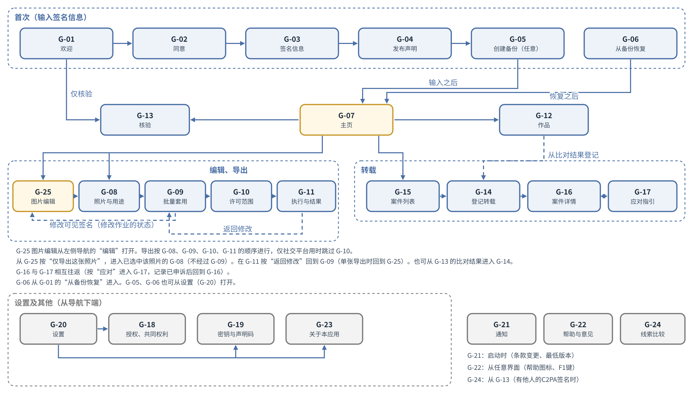
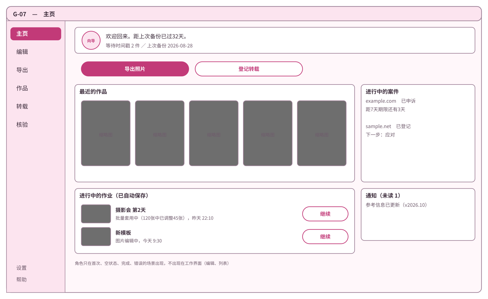
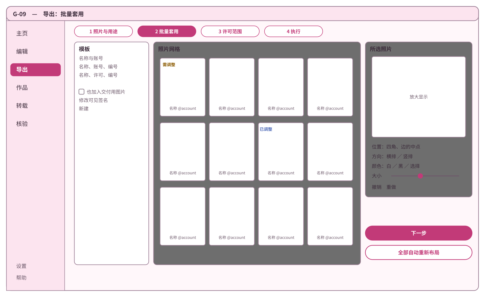
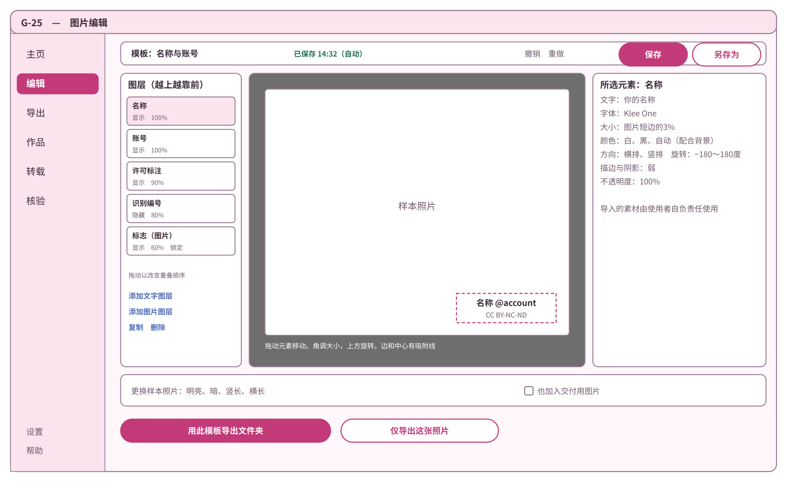
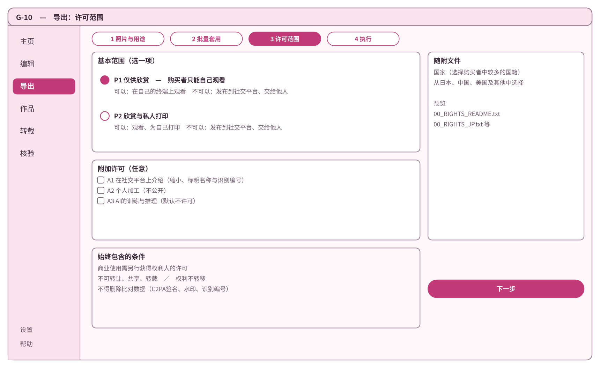
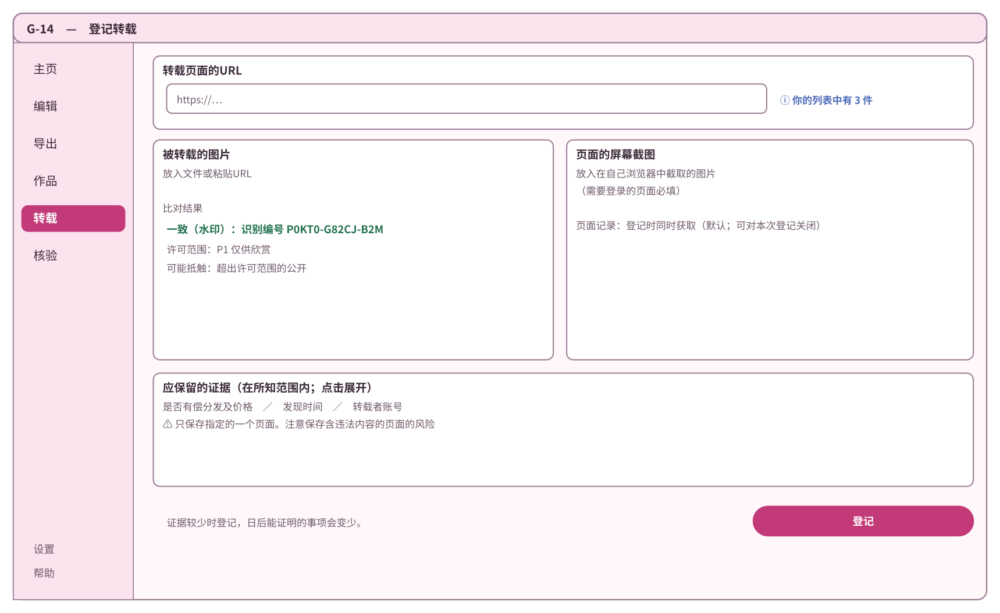
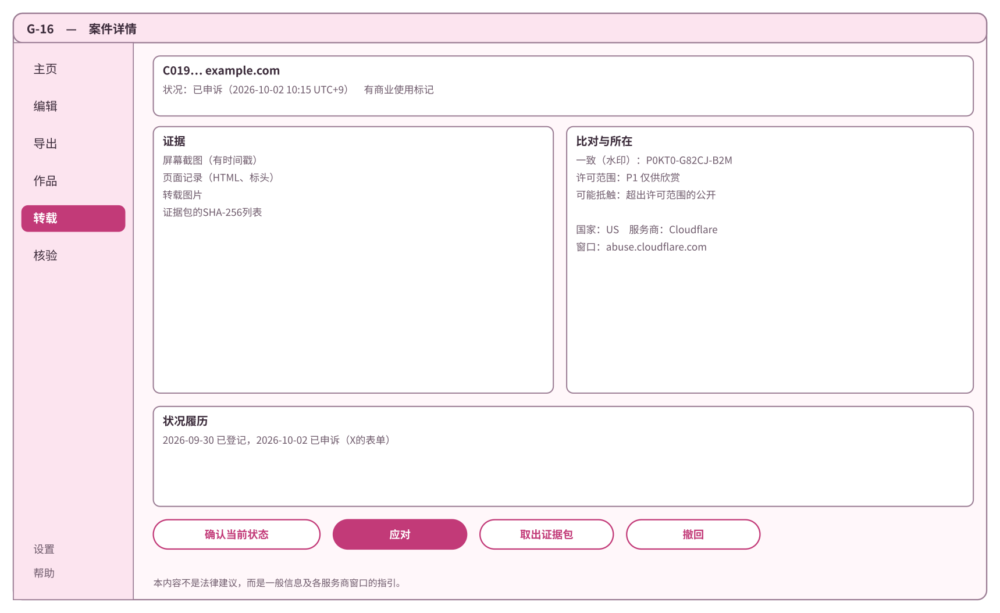

# 基本设计书 第10章 界面与设计

Cosplay照片防盗图工具  第1版（草案）  2026-09-29 · 石川宗  
株式会社流山ソフトウェア開発（NRSD）  
Word版: [10_基本设计书_界面与设计.docx](10_基本设计书_界面与设计.docx)

© 2026 株式会社流山ソフトウェア開発（NRSD）负责开发者　石川宗　本文件的著作权归株式会社流山ソフトウェア開発（NRSD）所有。本文件所引用的第三方标准、软件、法令解说等的权利归各权利人所有。本文件为日文原文的译本，如有不一致，以日文原文为准。

---

## 本文件的定位

- 细化概要设计书第10章。本章把全部各章要求中使用者的操作纳入界面，在其他各章的基本设计之后书写。与第12章“与法务的接点”同时设计（第10章与第12章互相依赖）。
- 承接的决定如下表（设计计划书第2版的决定、待调查、未决，以及项目划分中发现的遗漏）。

|编号|种类|内容|
|---|---|---|
|D-3-3|决定|使用者须能够在不查看GitHub的情况下使用本系统|
|D-8-1|决定|客户端应用应具有良好的外观。外观作为与本系统效力直接相关的要求处理|
|D-8-2|决定|具备图片编辑界面、批量套用及权利文书制作界面。其他界面的构成由设计书决定|
|D-8-3|决定|将在编辑界面中制作的设计作为模板，既能逐张套用，也能按文件夹套用|
|D-8-4|决定|即使在批量套用中，也能按每张照片调整位置、方向及颜色|
|D-8-5|决定|界面的详细内容由设计书决定|
|D-9-8|决定|界面语言为日语、中文及英语，根据要求追加|
|O-07|未决（在基本设计 第10章 DD-10-5“不设与操作系统的集成，以拖放代替”中决定：不设）|各操作系统的集成功能|
|A-13|项目划分中发现的遗漏|面向不看GitHub的使用者的意见受理渠道|
|A-14|项目划分中发现的遗漏|NRSD的立场与使用条款|

- 用语：区分书写“C2PA签名”与“可见签名”（第1章“本文件的定位”）。在界面上，把附上C2PA签名、隐形水印、可见签名、识别编号后输出图片的作业统称为“导出”。把记录（证据包、模板、备份文件）作为文件带出终端的操作称为“取出”，而不称为“导出”（备份文件称为“创建备份”）。
- 参照的内容如下表。

|参照对象|参照的事项|
|---|---|
|第2章 2“C2PA签名所需信息的输入”、4“比对的手段与线索”|C2PA签名所需信息的输入、比对的线索|
|第3章 9“批量处理”、10“输出”|批量处理、输出、核验|
|第4章“图片编辑与批量套用”|可见签名的编辑与批量套用|
|第5章 2“许可范围”|许可范围|
|第6章 2“登记”、4“比对”、6“状况确认”|登记、比对、状况|
|第7章 3“文字的示例”、6“申诉的流程”、7“界线”|申诉的流程、个人信息、指引的界线|
|第8章 5“备份文件”|备份的制作与导入|
|第11章“开发基础”|界面的制作方法（Tauri）、文字文件|
|第12章 6“返回界面的内容”|返回界面的内容|
|法务调查 L-19“字体的许可证”、L-29“设计、角色的委托（日）”|字体的许可、设计与角色的委托|

- 范围：客户端应用的界面。运营者工具的界面在第1章 19“运营者工具”中处理（按照概要设计书对范围的规定）。README、公开页面的构成见第9章 5“获取途径”、第8章“仓库与数据管理”。

## 1. 设计决定的一览

|编号|决定|理由|被否定的方案|
|---|---|---|---|
|DD-10-1|外观为“淡色、圆润的形状与文字、1个向导角色”。角色为NRSD的原创，只在首次的指引、空的状态、完成、错误的场景中出现，不在作业的界面（编辑、一览）中出现|使用者喜欢角色与可爱的东西，外观差的软件不会被使用（D-8-1“客户端应用应具有良好的外观。外观作为与本系统效力直接相关的要求处理”）。若在作业的界面中也出现，会妨碍照片的确认|没有角色（违反D-8-1“客户端应用应具有良好的外观。外观作为与本系统效力直接相关的要求处理”）。已有作品角色风格的方案（自己触及原作的权利。L-29“设计、角色的委托（日）”）|
|DD-10-2|设计（颜色、部件、角色）由NRSD的负责开发者进行，外观的合格与否也由负责开发者判定。易懂性以使用者试用（2.4）判定。将来委托外部设计师时合同的论点放在法务 L-29“设计、角色的委托（日）”中|没有可委托的设计师（2026-09-30，NRSD）。外观是喜好的判断，因此把判定者定为1人|委托外部设计师的方案（第2稿。没有委托对象）。以多数决判定的方案（无法决定）|
|DD-10-3|界面为1个窗口，左侧放置纵向导航（主页、编辑、导出、作品、转载、核验），下端放置设置、帮助。有多个阶段的作业（首次的输入、导出、登记、应对），在窗口中把阶段显示在上方推进|非技术人员能随时看到“现在在哪里，还有几步”。1个窗口不容易显出操作系统的差异|打开多个窗口的方案（会迷路）。全部做成向导的方案（对熟练的使用者太慢）|
|DD-10-4|易读性以WCAG 2.2的AA为标准（文字的对比度4.5:1以上，部件的边界3:1以上，不只以颜色传达含义，文字放大到200%也不崩坏）|对色觉多样性，以及长时间看照片作业的疲劳的考虑。把标准放在外部的规范上就能判定|独自的标准（无法判定）|
|DD-10-5|不设与操作系统的集成（右键菜单等）。以向窗口拖放照片、文件夹代替。界面中图层的排序不使用HTML5的拖放，而以指针的事件（按下、移动、松开）制作|Windows 11新的右键菜单把传统的注册放在“显示更多选项”的深处，macOS需要另外的扩展可执行物，Linux按文件管理软件方式不同，3种操作系统无法得到相同的体验。拖放在3种操作系统上同样运行。若启用接受向窗口放下文件的设置（Tauri的dragDropEnabled），在Windows上界面中HTML5的拖放无法使用（tauri-utils的config.rs中的说明“Disabling it is required to use HTML5 drag and drop on the frontend on Windows”）|只在Windows上注册右键菜单的方案（说明会按操作系统分开）|
|DD-10-6|意见受理渠道，由应用制作意见的文字，使用者以自己的电子邮件发送给NRSD（打开电子邮件软件，或复制文字与收件地址）。应用不自动发送|使用者不看GitHub（D-3-3“使用者须能够在不查看GitHub的情况下使用本系统”）。不设服务器（DD-1-2“NRSD不设服务器，不接收使用者的信息（使用者自行发送的意见电子邮件除外）”），不收集使用者的信息（D-5-1“本系统不确认使用者，不收集使用者的信息。使用本系统不要求登记”）。是否发送、附上什么由使用者决定|GitHub的Issue（让使用者看GitHub）。外部表单服务（会把信息发送给第三方）。从应用自动发送的方案|
|DD-10-7|界面的语言为日语（ja）、中文简体字（zh-Hans）、英语（en）。字形按语言切换字体来配合。繁体字根据要求追加|D-9-8“界面语言为日语、中文及英语，根据要求追加”。中国大陆的使用者使用简体字。即使是同一汉字，在日本与中国字形也不同|中文以1种字体了事的方案（会以日语的字形显示中文）|
|DD-10-8|错误的显示统一为必定显示“发生了什么／原图与记录是否安全／下一步要做的事／编号”4项的形式|非技术人员最先想知道的是“照片是否安全”。编号用于通过意见（DD-10-6“意见由使用者用自己的电子邮件发送”）确定原因|原样显示技术性内容的方案|

## 2. 设计

### 2.1 方向（初步方案）

|要素|方针|
|---|---|
|颜色|以淡粉色为底色，深粉色为主色，蓝色为辅色。持有明亮与暗色2种显示，配合操作系统的设置（也可以在设置中固定）|
|形状|圆角的部件（半径8至12像素），阴影较弱且只有1层|
|文字|圆黑体系（2.2）|
|角色|向导1个。主题的方案：“抱着封蜡（火漆印章）的小生物”（以C2PA签名封印的比喻）。表情6种（普通、高兴、思考中、为难、注意、晚安（离线时））。名字由负责开发者决定|
|照片的显示|在作业的界面中把底色切换为无彩色（灰），不妨碍对照片颜色的判断|
|动效|仅界面的切换与完成的演出。以操作系统的“减弱动态效果”设置，或应用的设置停止|

### 2.2 字体

|用途|日语|中文（简体字）|英语|许可|
|---|---|---|---|---|
|界面的文字|Zen Maru Gothic|Resource Han Rounded CN（资源圆体）|Zen Maru Gothic的西文|均为SIL OFL 1.1（Google Fonts、github.com/CyanoHao/Resource-Han-Rounded）|
|使用者的输入（网名等）|上述字体中没有的文字以操作系统的字体显示|同左|同左|—|
|可见签名|按第4章 DD-4-7“内置字体限于SIL OFL 1.1，且不作修改”（与界面的字体分开）|—|—|—|

- 2种字体的合计大小约18MB（Zen Maru Gothic约3.8MB、Resource Han Rounded CN约14.7MB。第11章 4.3“素材”的实测）。不加修改（不删减字符）地同捆（法务调查 L-19“字体的许可证”）。

### 2.3 颜色

- 颜色全部附上名称定义（下表的“名称”），部件不持有直接的颜色值。表中“明亮显示”“暗色显示”的栏以该颜色涂色。显示值与对底色的对比度（以WCAG的计算式算出）。

|名称|明亮显示|对比度（底色 #FFF7FA）|暗色显示|对比度（底色 #1E1820）|用途|
|---|---|---|---|---|---|
|bg|#FFF7FA|—|#1E1820|—|底色|
|surface|#FFFFFF|—|#2A222D|—|卡片、输入栏|
|text|#3B2B3A|12.5|#F7EAF2|14.9|正文|
|muted|#6E5A6B|6.0|#CDB9C8|9.4|补充|
|primary|#C23A78|4.8|#FF8CC0|8.1|主按钮、选择|
|on-primary|#FFFFFF|5.0（对primary）|#2A0E1C|8.3（对primary）|主按钮的文字|
|accent|#4F6BB8|4.8|#9FB4F2|8.5|链接、信息|
|success|#23724F|5.6|#7ED3A8|9.8|一致、完成|
|warn|#8A5A00|5.6|#F2C265|10.5|注意|
|danger|#B3261E|6.2|#FF8A80|7.6|失败、无法撤销的操作|
|border|#9C7E95|3.4|#8C7389|4.1|输入栏、部件的边界（3:1以上）|
|on-danger|#FFFFFF|6.5（对danger）|#2A0E1C|7.8（对danger）|危险操作按钮的文字|
|work-bg|#6E6E6E|—|#3A3A3A|—|作业界面（编辑、批量套用、照片的显示）的底色。无彩色（2.1“照片的显示”）|
|work-text|#FFFFFF|5.1（对work-bg）|#FFFFFF|11.4（对work-bg）|作业界面底色上的文字|
|work-focus|#FFFFFF的2像素框外侧加#000000的1像素框|5.1（对work-bg，内侧的白）|同左|11.4（对work-bg，内侧的白）|作业界面中的焦点框。在明亮的照片上外侧的黑色可见|

- 在作业界面的底色（work-bg）上，明亮显示accent（#4F6BB8）的焦点框对比度不足（对明亮显示的work-bg #6E6E6E为1.0。暗色显示的accent #9FB4F2对work-bg #3A3A3A为5.6而足够，但为了不因显示的明暗而改变框，两者都统一为work-focus），因此使用work-focus。对比度均以WCAG的计算式算出。
- 不只以颜色传达含义：比对的阶段（第6章 4.1“一致度的显示方式”）、案件的状况、成功与失败，除颜色外，还以按阶段形状不同的标记与文字显示（标记的形状由负责开发者决定，在界面的图例中写明含义）。

### 2.4 判定

|判定的事项|判定者|标准|
|---|---|---|
|外观的合格与否|负责开发者（DD-10-2“设计由NRSD的负责开发者进行并自行判定”）|以明亮、暗色两种显示确认颜色、部件、角色的6种表情、主要界面5个的样本|
|易懂性（首次的输入）|使用者试用|Cosplayer、摄影者5人以上（初始值）参加者中的8成以上（5人时为4人以上），不经说明即可完成C2PA签名所需信息的输入与声明的揭示（G-01“欢迎”、G-02“同意”、G-03“签名信息”、G-04“发布声明”）|
|易懂性（许可范围）|使用者试用|阅读说明者的8成以上正确回答“在所选范围内购买者是否可以发到社交平台”（第5章 2.2“面向非技术人员的说明”）|
|易懂性（导出与登记）|使用者试用|不经说明即可完成1个文件夹的批量导出与1件转载登记者占参加者的8成以上（5人时为4人以上）|
|易读性|负责开发者|在3种操作系统上确认2.3的对比度、文字200%的放大、仅以键盘的操作|

- 试用以能运行的版本（预览版）进行。不让使用者阅读设计书或说明文件来征求意见（让Cosplayer、摄影者阅读文件负担很大，实际的使用方法只能以能运行的版本确认）。预览版是首次的输入、图片编辑、导出、转载登记全部能运行，在试用前分发的版本（与第9章官方的分发分开，只交给试用的参加者。C2PA签名与记录的格式与正式版相同）。与不先进行访谈的D-3-5“不进行访谈，根据可以使用后的指正加以改进”不矛盾。试用的参加者由NRSD委托认识的使用者。根据试用的结果修改之处，记在下一个版本的变更点中。

### 2.5 文字大小与间隔的阶段

|名称|大小（标准时）|用途|
|---|---|---|
|标题1|24像素|界面的标题|
|标题2|18像素|区域的标题|
|正文|15像素|正文、表|
|补充|13像素|说明、注记|
|按钮|15像素（粗体）|按钮的文字|

- 设置的“文字大小”（小、标准、大、特大、最大），把全体设为0.9、1.0、1.2、1.4、2.0倍（初始值）。确认即使在最大（2.0倍）时也不失去内容与功能（WCAG 2.2的1.4.4“文字放大到200%也不失去内容与功能”。只以应用的设置满足，不依赖操作系统的放大）。
- 不启用Tauri界面的放大按键（zoomHotkeysEnabled。Ctrl、Command与−、=）。因为与编辑界面放大、缩小的按键（第4章 9.2“显示”）冲突（tauri-utils的config.rs中的说明）。
- 间隔以4像素为单位，使用4、8、12、16、24、32像素的阶段（初始值）。
- 行高为正文的1.6倍（为了日语、中文的易读性。初始值）。

### 2.6 部件的一览

|部件|内容|规则|
|---|---|---|
|主按钮|界面中唯一的主要操作（“导出”“登记”）|primary的颜色。1个界面1个|
|次按钮|其他的操作|只有边框|
|危险操作的按钮|无法撤销的操作（清除）|danger的颜色。按下后显示确认窗口（3.6）|
|输入栏|文字的输入|栏的上方为名称，下方为说明与错误的文字。必填栏在名称中写明“必填”（不只用标记）|
|选择|单选按钮、复选框、切换|可按的大小为24像素见方以上（2.7）|
|阶段的显示|多个阶段作业的当前阶段|界面的上端。阶段的名称与编号|
|一览（网格）|照片缩小图像的排列|只绘制可见的部分（3.4）|
|一览（表）|案件、作品的排列|排序、筛选|
|通知栏|界面上端的临时通知（3.7）|在关闭之前保留。不自动消失（以免在阅读之前消失）|
|确认窗口|无法撤销的操作之前（3.6）|按钮上写操作的名称而不是“是”（例：“清除”）|
|进度的显示|长处理的进度|第几张、剩余的估计、取消|
|向导|角色（DD-10-1“外观为淡色、圆润，以及一个向导角色”）|仅首次、空的状态、完成、错误的场景|

### 2.7 易读性的标准（WCAG 2.2的AA）

- WCAG 2.2是W3C推荐标准（2023年10月。本文件查看的是2024年12月12日的版本）。本应用满足的主要标准与方法：

|标准|要求|方法|
|---|---|---|
|1.4.3 对比度（最低）|文字与背景的对比度4.5:1以上|以2.3的颜色定义满足|
|1.4.4 调整文字大小|不借助辅助技术放大到200%也不失去内容与功能|2.5的文字大小阶段（最大为2.0倍。只以应用的设置满足）|
|1.4.10 重排|在相当于宽320 CSS像素时，无需纵横两方向的滚动即可显示内容|不满足。本应用是桌面应用，窗口的最小尺寸为1024×700像素（3.3）。在该尺寸下不出现横向滚动。照片的编辑区域在2个方向上移动照片（12“本章声明的缺口”）|
|1.4.11 非文字的对比度|部件与图形边界的对比度3:1以上|2.3的border颜色|
|2.1.1 键盘|全部功能能以键盘操作|在全部界面上确认。照片上的布局能以按键移动（第4章 9.1“选择、移动”）|
|2.4.7 焦点可见|键盘的焦点可见|必定显示焦点框（2像素，accent的颜色。在作业界面中为work-focus的2色框。2.3）|
|2.4.11 焦点不被遮挡（最低）|获得焦点的部件不被作者的内容全部遮挡|通知栏、确认窗口采用不遮挡焦点的布局|
|2.5.8 目标大小（最低）|按下的目标为24×24 CSS像素以上。例外为间隔（24像素的圆不与其他目标重叠）、有相同功能的其他目标、文中的目标、由用户代理决定的目标、不可或缺的情况（W3C的Understanding 2.5.8。滑块等整体视为1个目标）|全部部件为24像素见方以上。编辑界面的手柄（大小、旋转的手柄），即使外观较小，也把可按的范围设为24像素见方，不依赖例外|
|3.3.1 错误的识别、3.3.3 错误的建议|以文字显示输入的错误，并显示修改方法|在输入栏的下方显示错误的文字与修改方法（第2章 2.3“输入的核对”）|

- 出处：W3C的WCAG 2.2。

## 3. 界面的构成

### 3.1 界面的一览

- 设计计划书 D-8-2“具备图片编辑界面、批量套用及权利文书制作界面。其他界面的构成由设计书决定”要求的3个界面，对应以下界面。图片编辑界面为G-25“图片编辑”，批量套用为G-09“导出：批量套用”，权利文书制作界面为G-10“导出：许可范围”。
- 图片编辑界面（G-25“图片编辑”）从左侧导航的“编辑”直接打开。也可以从导出的中途（G-09“导出：批量套用”）打开。

|编号|界面|能做的事|主要出处|
|---|---|---|---|
|G-01|欢迎|选择语言。阅读能做的事与不能做的事（不收集使用者的信息、不代为比对），以及不涉及原作的权利。选择“开始”“仅用于核验”或“从备份恢复”|概要设计书“本系统保护的内容、不保护的内容”，第12章 6“返回界面的内容”|
|G-02|同意|阅读并同意使用条款、隐私政策|第12章 3.1“使用NRSD的服务所必须的内容”|
|G-03|签名信息|输入网名、角色、声明所在账号。按栏显示“用于什么、放在哪里”。密钥、证书、声明码在此时于终端生成|第2章 2“C2PA签名所需信息的输入”|
|G-04|发布声明|复制声明码与声明的文字示例（短、中、长），按照各平台的步骤（图片）揭示|第2章 2.1“输入的步骤”、2.2“揭示声明码处的上限”，第5章 DD-5-6“声明文例准备短、中、长三种”|
|G-05|创建备份|制作备份文件（以口令加密签名密钥与全部记录），选择保存处。查看最后制作的日期|第8章 5“备份文件”|
|G-06|从备份恢复|输入备份文件与口令，导入签名密钥与记录（可拖放）|第8章 5“备份文件”|
|G-07|主页|查看最近的作品、中途的作业（从中断处打开）、进行中的案件、通知、等待可信时间戳的件数、最后创建备份的日期。进入主要的作业|—|
|G-08|导出：照片与用途|选择文件夹（或照片），决定用途（社交平台用／交付用／两者）与拍摄名。选择是否在保存的文件名后附加识别编号（初始值为附加，此后为上次的选择）。选择共同权利人（从已导入的共同权利书面文件的对方中选1人，或无）。从G-25“图片编辑”的“仅导出此照片”进入时，以选中该1张的状态打开|第3章 8.2“系统的差异”，第4章 12“批量套用”|
|G-09|导出：批量套用|对所选文件夹的照片批量套用模板。选择模板（是否也放入交付用按模板决定）。在网格中查看自动布局的结果，按照片修改组的位置、大小、旋转与图层的显示、颜色，并加入仅该照片的图层（第4章 DD-4-3“以图层的组作为布局的单位”）。改变可见签名的内容、格式时，书写仅该照片的图层的内容时，以“修改可见签名”在“修改作业”的状态下打开G-25“图片编辑”（第4章 13.1“图片编辑界面的两种状态”）。即使中途停止，作业也会自动保存|第4章 12“批量套用”、7“放置方式”|
|G-10|导出：许可范围|选择交付用的许可范围（P1、P2，A1至A3）与随附文件的国家（购买者中常见的国籍）。查看能做的事与不能做的事的插图|第5章 2“许可范围”、3“随附文件”|
|G-11|导出：执行与结果|查看进度、失败的一览与对策、输出文件夹、识别编号的一览（可复制）、各输出去向C2PA签名保留情况的说明|第3章 9“批量处理”、10“输出”|
|G-12|作品|一览、检索作品数据（识别编号、拍摄名、日期）。查看作品的详情（C2PA签名、可信时间戳、许可范围、输出的位置）|第3章 7“识别编号与作品数据”|
|G-13|核验|放入任意图片、随附文件，查看C2PA签名、可信时间戳、隐形水印（识别编号）、比对、随附文件哈希的结果。在首次的输入之前也能使用。显示签名者的声明所在账号与预期的声明码，能打开账号|第3章 10.2“使用者的确认”，第2章 4.1“与声明所在账号的比对”，第5章 DD-5-4“随附文件的SHA-256记录在清单中”|
|G-14|登记转载|输入URL、转载图片、屏幕图像、页面的记录、证据的输入栏，查看比对的结果后“登记”|第6章 2“登记”、4“比对”|
|G-15|转载（案件列表）|按转载网站、按状况查看案件。带有商业利用标记的案件排在上方。查看最后确认的日期与可以采取的手段|第6章 6“状况确认”、8“一览与手段”，第7章 6.2“共同的应对与优先”|
|G-16|案件详情|查看证据、比对、运营者确定的结果、状况的履历。“确认当前状态”“应对”“取出证据包”“撤回”|第6章 3“证据的保全”至7|
|G-17|应对指引|选择申请人的立场（著作权人、被摄者、受托代理者），选择窗口，查看必要事项与附加的证据。确认个人信息的指引，复制范本并打开窗口。记录“已申诉”。查看“进一步准备”（任意的登记）|第7章“法律应对指引”，第12章 3.2“使用者的任意（本系统仅作指引）”|
|G-18|授权与共同权利|制作、导入授权书，制作撤销书。制作、导入共同权利的书面文件（以文件交接）|第2章 5“授权与共同权利”|
|G-19|密钥与声明码|声明码、个人根证书与签名用证书的期限、重新生成（输入的变更、个人根证书生成后20年）、密钥的重新生成与声明码的重新揭示（丢失、泄露）、输入变更的履历|第2章 3.4“期限与输入的错误”、6“权利人信息”、7“签名密钥”|
|G-20|设置|本章10的项目|—|
|G-21|通知|查看条款的变更、参考信息的更新、应用的更新、个人根证书的重新生成、备份的建议、空闲容量的通知|第12章 6“返回界面的内容”，第9章 4“更新”，第8章 5“备份文件”、6“容量”|
|G-22|帮助与意见|阅读各界面的帮助与比对的步骤。制作意见的文字，以自己的电子邮件发送|本章6.3、9|
|G-23|关于本应用|版本、代码签名的发行者、不涉及原作的权利、不收集使用者的信息、许可的一览|第9章 3“官方版的证明”，第12章 6“返回界面的内容”|
|G-24|线索比较|被认为是自己作品的图片上有他人的C2PA签名时，并列查看隐形水印、可信时间戳、素材的履历、原图、声明的线索（不作判定）。进入可以采取的手段（G-17“应对指引”）|第2章 4.4“冒充权利人者出现时的线索”，设计计划书 5.5“签名被覆盖时比对的处理”|
|G-25|图片编辑|制作、修改可见签名模板的界面。在样本照片上叠放文字图层（名字、账号、日期、许可标记、识别编号、自由的文字）与图像图层（叠加图像），按图层决定叠放顺序、显示、锁定、不透明度，文字的字体、大小、颜色、方向（横排、竖排、旋转）、描边，作为模板保存。也可以打开1张照片，只对该照片绘入后导出。具有“修改模板”与“修改作业”两种状态，在界面上端显示当前的状态（第4章 13.1“图片编辑界面的两种状态”）。编辑中途的状态自动保存，可以从主页的“中途的作业”打开继续。从左侧导航的“编辑”打开|第4章 2“可见签名的范围”、3“文字图层”、4“组与图层”、5“图像图层”、6“字体与表情符号”、7“放置方式”、8“模板”、9“编辑的操作”、11“作业（编辑中途的状态）”|

### 3.2 转移

|起点|去向|条件|
|---|---|---|
|首次启动|G-01“欢迎”|—|
|G-01“欢迎”|G-02“同意”|“开始”|
|G-01“欢迎”|G-06“从备份恢复”|“从备份恢复”|
|G-01“欢迎”|G-13“核验”|“仅用于核验”|
|G-02“同意”，其次G-03“签名信息”，其次G-04“发布声明”，其次（任意）G-05“创建备份”|G-07“主页”|各阶段可以“返回”。中途停止也保存输入，下次启动时从中断处继续|
|G-13“核验”|G-24“线索比较”|有他人的C2PA签名，且与自己的水印、作品数据有关时|
|G-24“线索比较”|G-17“应对指引”|“查看可以采取的手段”|
|G-07“主页”|G-08“导出：照片与用途”，其次G-09“导出：批量套用”，其次（交付用时）G-10“导出：许可范围”，其次G-11“导出：执行与结果”|仅社交平台用时跳过G-10“导出：许可范围”|
|G-07“主页”、导航|G-12“作品”、G-13“核验”、G-15“转载（案件列表）”|—|
|G-07“主页”|作业停止阶段的界面（G-09“导出：批量套用”、G-10“导出：许可范围”、G-25“图片编辑”等）|“中途的作业”的“从中断处继续”|
|G-07“主页”、导航|G-25“图片编辑”|导航的“编辑”，或主页的“制作可见签名”|
|G-25“图片编辑”|G-08“导出：照片与用途”|“以此模板导出文件夹”（带着所选的模板前进）|
|G-25“图片编辑”|G-08“导出：照片与用途”|“仅导出此照片”（以选中所打开的1张的状态打开。用途、导出的预设、拍摄的名称、文件名中是否附加识别编号、共同权利人、导出目标在此决定。下一步若为交付用则为G-10“导出：许可范围”，仅社交平台用则为G-11“导出：执行与结果”。因是1张，不经过G-09“导出：批量套用”）|
|G-09“导出：批量套用”|G-25“图片编辑”（修改作业的状态）|“修改可见签名”（打开所选的照片。修改的内容立即对该作业生效。以“返回”回到G-09“导出：批量套用”。第4章 13.1“图片编辑界面的两种状态”）|
|G-11“导出：执行与结果”|G-09“导出：批量套用”，或G-25“图片编辑”（修改作业的状态）|在导出前的确认中修改需调整、缺字的照片时（“返回修改”）。批量导出返回G-09“导出：批量套用”，1张的导出返回G-25“图片编辑”|
|启动时|G-07“主页”上端的通知|上次未正常结束时（第4章 11.5“异常结束之后”）。以“从中断处打开”打开作业或模板的草稿|
|G-15“转载（案件列表）”|G-14“登记转载”|“登记转载”|
|G-14“登记转载”|G-16“案件详情”|登记之后|
|G-16“案件详情”|G-17“应对指引”|“应对”|
|G-17“应对指引”|G-16“案件详情”|记录“已申诉”之后|
|G-12“作品”、G-13“核验”|G-14“登记转载”|从比对的结果“登记此转载”（仅在已完成首次的输入时）|
|G-13“核验”|G-03“签名信息”|在首次的输入之前按下“登记此转载”时（登记需要签名信息）|
|设置（G-20“设置”）|G-05“创建备份”、G-06“从备份恢复”、G-18“授权与共同权利”、G-19“密钥与声明码”、G-23“关于本应用”|—|
|任意界面|G-22“帮助与意见”|帮助的标记、F1键|
|启动时|G-21“通知”|条款的变更（需要重新同意时先显示同意的界面）、低于最低版本时（第9章 4“更新”）|

图10-1 界面的转移

- 即使在首次的输入之前，也能使用G-13“核验”、G-22“帮助与意见”、G-23“关于本应用”。在首次的输入之前，从G-13“核验”无法进入G-14“登记转载”，而显示前往G-03“签名信息”的入口（G-13“核验”的出口）。

### 3.3 主要界面的布局（初步方案）

- 窗口的最小尺寸为1024×700像素。比这更小的窗口中，把左侧的导航折叠为只有图标。
- 以下显示各区域的内容。外观最终的绘制由负责开发者的设计（DD-10-2“设计由NRSD的负责开发者进行并自行判定”）进行。图是布局的初步方案，颜色使用2.3“颜色”的定义。

G-07“主页”

|区域|内容|
|---|---|
|上端|角色的一句话（配合时间段与状态）、等待可信时间戳N件、最后创建备份的日期（超过30日则建议）|
|中央上方|2个大按钮：“导出照片”“登记转载”|
|中央|中途的作业（缩小图像、作业的名称、最后编辑的日期时间、当前的阶段。“从中断处继续”）|
|中央|最近的作品（缩小图像横向排列，10件）|
|右|进行中的案件（状况与下一步要做的事的一句话）、通知（未读的数量）|

图10-2 G-07“主页”的布局（初步方案）

G-09“导出：批量套用”

|区域|内容|
|---|---|
|上端|阶段的显示（照片与用途、批量套用、许可范围、执行共4个阶段。强调当前的阶段）|
|左|模板的一览（默认3种与自制）。若作业所用模板的原版本已更新，显示“模板有新版本”与“吸收”（第4章 8.2“版本”）。“修改可见签名”（以修改作业的状态打开G-25“图片编辑”）|
|中央|照片的网格（在缩小图像上叠加显示可见签名）。在“需要调整”的照片上显示注意的标记。在已修改的照片上显示铅笔的标记|
|右|所选照片的放大与调整的工具（组位置的候选、大小、旋转，图层的显示、颜色，加入仅该照片的图层，撤销、重做）。改变要素的文字、字体时，书写仅该照片图层的内容时，以“修改可见签名”打开G-25“图片编辑”|
|下端|“全部自动重新放置”“下一步”|

图10-3 G-09“导出：批量套用”的布局（初步方案）

G-25“图片编辑”

|区域|内容|
|---|---|
|上端|当前的状态（“模板：<名称>”或“作业：<名称>（照片：<文件名>）”。第4章 13.1“图片编辑界面的两种状态”）、保存的状态（“已保存”与时刻。自动保存）、“保存”“另存为”（在修改作业的状态下为“也保存到模板”）、撤销、重做、打开历史的一览|
|左上|模板的一览（修改模板的状态），或作业照片的一览（修改作业的状态）。“打开照片”、导入字体、导入图像的素材|
|左|组的一览与图层的一览。越在上方的图层越在前面绘制。按图层切换显示、隐藏，切换锁定，不透明度。拖动改变叠放顺序。“添加文字图层”“添加图像图层”“复制”“删除”|
|中央|在样本照片上以实际的外观叠加可见签名。要素以拖动移动，以角上的手柄改变大小，以上方的手柄改变旋转。显示向边、中央吸附的线|
|右|所选要素的设置：文字（账号名等）与插入字段的一览、字体、大小、颜色（白、黑、配合背景自动）、方向（横排、竖排）与旋转（−180至180度。第4章 3.2“格式”）、描边与阴影、不透明度、组的放置方式（一处、平铺）。在修改作业的状态下，上端有“此作业的所有照片”“仅此照片”的切换。叠加图像时为图像的选择与带入素材的注意|
|下方|更换样本照片（修改模板的状态。在明亮的照片、暗的照片、竖长、横长上确认外观）。“交付用也放入”的切换。“前后对比”|
|下端|“以此模板导出文件夹”（修改模板的状态）、“仅导出此照片”（在修改作业的状态下为1张照片的作业时）|

图10-7 G-25“图片编辑”的布局（初步方案）

G-10“导出：许可范围”

|区域|内容|
|---|---|
|上|基本范围的2个单选按钮（P1 仅限欣赏／P2 欣赏与私人打印）。各附一句话与插图，以文字显示能做的事与不能做的事|
|中|追加许可的3个复选框（A1 在社交平台上介绍／A2 个人加工／A3 AI的学习、推理）。A3默认不勾选|
|下|把始终包含的条件（商业利用需另行许可、禁止转让、共享、转载、权利不转移、不删除比对数据）作为固定的文字显示|
|右|随附文件的国家（选择购买者中常见的国籍。无默认）与随附文件的预览|

图10-4 G-10“导出：许可范围”的布局（初步方案）

G-14“登记转载”

|区域|内容|
|---|---|
|上|URL栏。粘贴后显示平台的判定与“此网站在您的一览中有N件”的通知|
|中左|转载图片（文件或URL）栏与比对的结果（阶段的标记与文字）|
|中右|屏幕图像栏（需要登录的页面显示必填的标记）、页面的记录（默认取得。“此次登记不取得”的选择）|
|下|应保留证据的输入栏（折叠。“在知道的范围内”）、保存的注意（第12章 6“返回界面的内容”）|
|下端|“登记”（证据较少时，以1行显示此意旨）|

图10-5 G-14“登记转载”的布局（初步方案）

G-16“案件详情”

|区域|内容|
|---|---|
|上|案件的编号、转载目标的域名、状况（标记与文字）、商业利用的标记|
|左|证据的一览（屏幕图像、获取的记录、有无可信时间戳）|
|右|比对的结果（识别编号、许可范围、违反了什么的候选）、谁、在何处（国家、事业者、窗口）|
|下|状况的履历（按日期顺序）|
|下端|“确认当前状态”“应对”“取出证据包”“撤回”。最下部为“这不是法律建议”的常设文字|

图10-6 G-16“案件详情”的布局（初步方案）

### 3.4 大量一览的显示

- 作品（G-12“作品”）与网格（G-09“导出：批量套用”）为只绘制可见行的一览（虚拟一览），缩小图像保存在终端内重复使用。
- ［需实测］作品1万件的一览到最初显示的时间、500张网格的滚动。假设：1秒以内，流畅（每秒60帧左右）。判定：最初的显示在2秒以内，滚动时感觉不到卡顿（在试用中确认）。

### 3.5 各界面的规格

- 显示各界面的目的、主要要素、状态（空、处理中、错误）、出口。入口汇总在3.2“转移”的表中（只有G-01“欢迎”以首次启动为入口，也写在界面的规格中）。有布局图的界面请同时参阅3.3。

#### G-01 欢迎

- 目的：选择语言，阅读本应用能做的事与不能做的事，以及不涉及原作的权利。
- 终端加密的建议：在3个要点之后，放置“记录保存在此电脑中。请启用电脑的加密（Windows的设备加密、BitLocker，macOS的FileVault，Linux的LUKS）”的1行，以及打开各操作系统设置方法的指引（第8章 DD-8-7“记录的加密交给操作系统的全盘加密”）。
- 入口：首次启动。
- 要素：语言的选择（日语、中文、英语），3个要点的文字（不收集、不代为比对、不涉及原作的权利），“开始”“仅用于核验”“从备份恢复”。
- 出口：G-02“同意”、G-13“核验”、G-06“从备份恢复”。

#### G-02 同意

- 目的：同意使用条款与隐私政策（第12章 DD-12-2“使用条款与隐私政策作为定型条款取得同意”）。
- 要素：要点（5行：不涉及原作的权利、不代为比对、使用者的记录在终端上NRSD不接收、不是法律建议、免责的范围）、全文（滚动）、版本与生效日、“同意并继续”与“不同意而继续”2个按钮。在按钮的上方显示“不同意时，不获取NRSD的参考信息（窗口、文字示例、各国法律参照对象的新版本）。使用应用同捆的版本。其他功能可以使用”（第12章 DD-12-3“同意只限制参考信息的获取”）。
- 不同意时：在终端记录未同意，不获取参考信息。在G-20“设置”的“使用条款”与G-21“通知”中放置日后同意的入口。
- 出口：G-03“签名信息”（按任一按钮）。条款变更时，在启动时显示此界面，出口为原来的界面（从G-21“通知”）。

#### G-03 签名信息

- 目的：输入C2PA签名所需的信息（第2章 2“C2PA签名所需信息的输入”）。
- 要素：

|栏|种类|限制|说明的文字（用于什么、放在哪里）|
|---|---|---|---|
|网名|文字|第2章 2.3“输入的核对”|放入证书，与已C2PA签名的图片一同公开。请不要输入真实姓名|
|（仅限没有Secret Service的Linux）保护密钥的口令|隐藏字符，输入2次|12个字符以上（初始值）|以口令加密保存签名密钥。每次启动应用时输入（第2章 7.5“各操作系统的保管方式”）|
|角色|选择（Cosplayer、摄影者、经授权者）|必填|放入图片的记录（清单）|
|声明所在账号|URL（多个。添加、删除）|第2章 2.3“输入的核对”|放入证书并公开。是揭示声明码的账号|

- 状态：按下“生成”后，显示生成密钥与证书期间的进度（数秒）。
- 错误：在栏的下方显示错误的文字（第2章 2.3“输入的核对”）。无法写入密钥存储时显示理由与下一步要做的事（第2章 8“失败的处理”）。
- 出口：G-04“发布声明”。即使中途停止，输入也会保留（第2章 2.1“输入的步骤”）。

#### G-04 发布声明

- 目的：复制声明码与文字示例，揭示在声明所在账号上（第2章 2.2“揭示声明码处的上限”、第5章 6“声明的支援”）。
- 要素：声明码（复制按钮）、文字示例的3档（短、中、长）与3种语言（复制按钮）、各发布网站揭示方法的步骤（图片）、“已揭示”的勾选（任意。应用不确认是否已揭示）。
- 出口：G-05“创建备份”（建议）、G-07“主页”。

#### G-05 创建备份

- 目的：制作备份文件（第8章 5.2“制作方法”）。
- 要素：保存处的选择、口令（输入2次，隐藏字符，强度的参考）、“忘记口令就无法恢复”的确认勾选、“制作”。
- 指引：以1行与图显示“3-2-1”的存放方式（3个副本、2种介质、1个放在远离的地方。第8章 5.6“备份存放方式的指引”）。选择同一电脑中的位置作为保存处时，显示“此电脑损坏时备份也会丢失”。
- 状态：进度（M MB中的N MB，剩余的估计）、完成（保存处与制作的日期时间）。
- 错误：空闲不足，口令过短、为常用口令。
- 出口：G-07“主页”、G-20“设置”。

#### G-06 从备份恢复

- 目的：从备份文件恢复（第8章 5.3“恢复方法（导入）”）。
- 要素：文件的选择（可拖放）、口令、“恢复”。个人根证书不同时的选择（替换、取消。第8章 5.4“合并”）。
- 状态：进度、完成（导入的件数、未通过验证的记录的一览）。
- 错误：口令不对或文件已损坏（第8章 8“失败的处理”）。
- 出口：G-07“主页”。首次启动时从G-01“欢迎”进入的，恢复之后经由G-02“同意”进入G-07“主页”（第12章 DD-12-3“同意只限制参考信息的获取”）。

#### G-07 主页

- 目的：查看最近的作品、中途的作业、进行中的案件、通知，进入主要的作业（布局见3.3）。
- 空的状态（初次使用时）：向导显示“先来导出第一张照片吧”，并显示“导出照片”“制作可见签名”。
- 在中途作业的各行放置“从中断处继续”与其他操作（更名、删除作业。删除作业之前显示确认窗口（3.6））。
- 上次未正常结束时，在上端显示通知，以“从中断处打开”显示最后保存的作业与模板的草稿（3.7、第4章 11.5“异常结束之后”）。
- 出口：G-08“导出：照片与用途”、G-12“作品”、G-13“核验”、G-14“登记转载”、G-15“转载（案件列表）”、G-21“通知”、G-25“图片编辑”，以及中途作业所在阶段的界面。

#### G-08 导出：照片与用途

- 目的：选择照片，决定用途与导出的预设（第4章 12.1“流程”、14.1“导出的预设”）。
- 要素：照片、文件夹的选择（可拖放）、所选的张数与无法读取的照片数、用途（社交平台用、交付用、两者）、导出的预设（可多选）、拍摄的名称、文件名中是否附加识别编号、模板的选择、共同权利人（从已导入的共同权利书面文件的对方中选1人，或无。按作业。第4章 3.1“内容与插入字段”的`{coholder}`）、导出目标的文件夹。
- 1张的导出：从G-25“图片编辑”的“仅导出此照片”进入时，以选中该1张的状态打开，以所打开的作业代替模板的选择。
- 错误：不能选择与原图相同的文件夹作为导出目标（第4章 14.5“放置处与名称”）。
- 出口：G-09“导出：批量套用”。1张的导出中，包含交付用时为G-10“导出：许可范围”，仅社交平台用时为G-11“导出：执行与结果”。

#### G-09 导出：批量套用

- 目的：对全部照片套用可见签名，并按照片修改（第4章 12“批量套用”。布局见3.3）。
- 要素：照片的网格（状态的标记。第4章 12.2“照片的状态”）、按状态的筛选、照片的选择（多张）、一并调整（第4章 12.3“一并调整”）、所选照片的放大与调整的工具、历史的一览、保存的状态。
- 状态：自动布局的进度（第几张）。
- 出口：G-10“导出：许可范围”（有交付用时）、G-11“导出：执行与结果”、G-25“图片编辑”（“修改可见签名”。修改作业的状态）。

#### G-10 导出：许可范围

- 目的：选择交付用的许可范围与随附文件的国家（第5章。布局见3.3）。
- 要素：基本范围（P1、P2）、追加许可（A1、A2、A3）、始终包含的条件的文字、随附文件的国家（多个）、随附文件的预览。
- 出口：G-11“导出：执行与结果”。

#### G-11 导出：执行与结果

- 目的：查看导出的进度与结果（第3章 9“批量处理”、第4章 14“导出”）。
- 要素：进度（第几张、剩余的估计、取消）、结果（导出的张数、失败的一览与理由、打开导出目标）、识别编号的一览（可复制）、各发布网站C2PA签名保留情况的说明（第3章 10.3“在发布网站、云端的保留”）、需调整与缺字照片的确认（导出之前）。
- 出口：G-07“主页”、G-12“作品”、G-09“导出：批量套用”或G-25“图片编辑”（在导出前的确认中按下“返回修改”时。批量导出为G-09“导出：批量套用”，1张的导出为G-25“图片编辑”）。

#### G-12 作品

- 目的：一览、检索导出的作品，查看详情（第3章 7“识别编号与作品数据”）。
- 要素：一览（缩小图像、识别编号、拍摄的名称、日期、可信时间戳的状态）、检索（识别编号、拍摄的名称、日期的范围）、详情（C2PA签名、可信时间戳、许可范围、导出的位置、打开作业）。
- 空的状态：“还没有作品”与通往导出的途径。
- 出口：G-14“登记转载”（从比对的结果）、作业的界面。

#### G-13 核验

- 目的：核验任意的图片、随附文件（第3章 10.2“使用者的确认”、第2章 4.1“与声明所在账号的比对”）。
- 要素：图片、随附文件的放入（可拖放）、结果（C2PA签名验证的文字。第3章 10.2“使用者的确认”的表）、签名者（网名、声明所在账号、预期的声明码、打开账号的按钮）、可信时间戳、水印的识别编号与自己作品数据的比对、比对用哈希的一致度、随附文件哈希的一致。
- 出口：G-24“线索比较”（有他人的C2PA签名且与自己的作品有关时）、G-14“登记转载”（仅在已完成首次的输入（G-03“签名信息”）时。因为登记要以使用者的密钥附加记录电子签名）。在首次的输入之前，代替G-14“登记转载”显示“要登记转载，请先输入签名信息”与前往G-03“签名信息”的入口。

#### G-14 登记转载

- 目的：登记转载，留下证据（第6章 2“登记”。布局见3.3）。
- 要素：URL、转载图片、屏幕图像（截取方法的指引。第6章 2.2.2“屏幕图像截取方法的指引”）、证据用可信时间戳的选择（免费的TSA，或已设置的收费TSA。第6章 3.2“可信时间戳”）、页面的记录（默认在登记的同时取得。在输入URL时，显示IP地址会被对方看到，以及介意时可以使用VPN，并可以选择“此次登记不取得”。获取时不自报本系统。第1章 4.2“与外部的交互”、第6章 2.1“步骤”、DD-6-8“获取的请求不自报本系统之名”）、应保留证据的栏、比对的结果、“登记”。
- 状态：获取的进度、可信时间戳的保留。
- 出口：G-16“案件详情”。

#### G-15 转载（案件列表）

- 目的：查看已登记的案件（第6章 8“一览与手段”）。
- 要素：按转载网站的归并、件数、状况、最后确认的日期、商业利用的标记、筛选（状况）、“登记转载”。
- 空的状态：“没有已登记的转载”与通往登记的途径。
- 出口：G-14“登记转载”、G-16“案件详情”。

#### G-16 案件详情

- 目的：查看案件的证据与状况，选择下一步（第6章。布局见3.3）。
- 要素：案件的编号、转载目标、状况、证据的一览、比对的结果、谁、在何处、状况的履历、程序期限的参考（从申诉之日起算的日期。日本指定事业者的7日通知、美国反通知之后的10至14个工作日等。第7章 6.3“程序期限的显示”）、“确认当前状态”“应对”“取出证据包”“撤回”、不是法律建议的常设文字。
- 出口：G-17“应对指引”。

#### G-17 应对指引

- 目的：选择申请人的立场与窗口，制作申诉的文字（第7章）。
- 要素：申请人立场的选择（著作权人、被摄者、受托代理者。最先选择。第7章 3.4“申请人的立场”）。根据立场，切换显示的窗口种类（著作权、肖像）与范本、确认的文字（第7章 3.2.1“错误、虚假申诉的责任”）。选择被摄者时不显示著作权的范本，而显示肖像、隐私的窗口。窗口的候选（对日本的大规模特定电信服务提供者，先显示依据法律申请的窗口。第7章 2.1“初版窗口的一览（参考信息的初始内容）”）、必要事项与附加的证据、个人信息可能被交给对方的确认勾选（第7章 3.2“关于个人信息会被交给对方的指引”）、错误与虚假申诉的责任以及比对线索的确认勾选（比对结果为“无法确认一致”的案件在上端显示注意。第7章 3.2.1“错误、虚假申诉的责任”）、对方反驳程序的说明（第7章 3.2.2“对方的反驳程序”）、范本（第7章 3.3“范本的内容”。姓名等只在此界面中输入，不保存）、复制文字与打开窗口的按钮、“已申诉”的记录。
- 出口：G-16“案件详情”。

#### G-18 授权与共同权利

- 目的：制作、导入授权书、撤销书、共同权利的书面文件（第2章 5“授权与共同权利”）。
- 要素：制作（对方的声明码、范围、期限、条件的文字）、导入（文件。核对的结果。第2章 5.4“文书的核对”）、一览（有效、期限外、已撤销）。
- 出口：G-20“设置”。

#### G-19 密钥与声明码

- 目的：查看声明码、证书的期限、重新生成、变更的履历（第2章 3.4“期限与输入的错误”、6“权利人信息”、7“签名密钥”）。
- 要素：声明码（复制）、个人根证书与签名用证书的期限、“重新生成”、密钥的重新生成与声明码的重新揭示（丢失、泄露。确认窗口）、变更的履历。
- 出口：G-20“设置”。

#### G-20 设置

- 目的：改变设置（10）。
- 出口：G-05“创建备份”、G-06“从备份恢复”、G-18“授权与共同权利”、G-19“密钥与声明码”、G-23“关于本应用”。

#### G-21 通知

- 目的：查看条款的变更、参考信息的更新、应用的更新、证书的期限、备份的建议、空闲的通知。
- 更新准备就绪时，在通知一览的开头与界面的上端显示“更新已准备就绪。将在关闭时更新”与“立即重启并更新”。在批量处理、登记、备份制作的中途无法按下“立即重启并更新”（第9章 DD-9-5“替换在关闭时或使用者按下按钮时进行”）。
- 要素：通知的一览（未读的标记、日期、种类）。条款的变更显示生效日与变更点的摘要，在生效日之后首次启动时要求重新同意（G-02“同意”。第12章 4.3“变更的步骤”）。
- 出口：各通知的去向界面。

#### G-22 帮助与意见

- 目的：阅读各界面的帮助与比对的步骤，制作意见的文字（6.3、9）。
- 要素：帮助（当前界面的说明）、比对的步骤、意见（种类、正文、附加信息的选择、以电子邮件软件打开、复制）。
- 出口：打开前的原界面（关闭）。

#### G-23 关于本应用

- 目的：查看版本、官方版的证明、许可的一览（第9章 3“官方版的证明”）。
- 要素：版本、代码签名的发行者、分发物SHA-256的确认方法、不涉及原作权利的意旨、不收集使用者信息的意旨、使用条款与隐私政策当前版本的全文及公开页面上过去版本的指引（民法第548条之3的显示。第12章 4.3“变更的步骤”）、本系统的许可与第三方许可的一览、打开操作记录的位置。
- 出口：G-20“设置”（打开前的原界面）、许可的一览与使用条款的全文（在同一界面中的显示）。

#### G-24 线索比较

- 目的：冒充权利人者出现时，并列查看线索（第2章 4.4“冒充权利人者出现时的线索”）。
- 要素：5个线索（隐形水印、可信时间戳、素材的履历、原图、声明）的并列、不作判定的文字、线索的取出、“查看可以采取的手段”。
- 出口：G-17“应对指引”。

#### G-25 图片编辑

- 目的：制作、修改可见签名的模板。修改作业中的可见签名与1张照片的可见签名（第4章。布局见3.3）。
- 状态：“修改模板”与“修改作业”（第4章 13.1“图片编辑界面的两种状态”）。保存（Ctrl+S）与撤销历史的含义按状态依第4章 13.1“图片编辑界面的两种状态”。
- 要素：模板的一览（新建、更名、复制、排序、删除、以`.nrsdtpl`取出、导入。第4章 8.1“管理”、8.3“交接（导出与导入）”。对模板有新版本的作业显示“吸收新版本”。第4章 8.2“版本”）、导入字体（TTF、OTF。导入时显示一次“字体的使用条件由使用者确认”的意旨。第4章 6.4“带入的字体”）、导入图像图层的素材（第4章 5“图像图层”）、图层的一览、组的一览、在样本照片上的显示、所选图层的设置（格式见第4章 3.2“格式”。颜色从色域面、十六进制、从照片拾取、最近使用的颜色、模板的颜色中选择）、组的放置方式（一处、平铺。第4章 7.4“平铺”）、插入字段的一览、历史的一览、显示的操作（第4章 9.2“显示”）、保存的状态、缺字的标记。
- 要素（修改作业的状态）：作业照片的一览、“此作业的所有照片”“仅此照片”的切换、仅该照片图层的添加与内容的输入、“也保存到模板”、“打开照片”（制作1张照片的作业）。
- “以此模板导出文件夹”放在修改模板的状态中，“仅导出此照片”放在修改1张照片作业的状态中。
- 出口：G-08“导出：照片与用途”（以此模板导出文件夹、仅导出此照片）、G-09“导出：批量套用”（从批量套用进入时的“返回”）。

### 3.6 确认窗口的一览

|场景|窗口的文字（要旨）|按钮|
|---|---|---|
|启动时的口令（仅限没有Secret Service的Linux）|请输入打开签名密钥的口令。若忘记，没有备份文件就无法恢复密钥（第2章 7.5“各操作系统的保管方式”）|打开、仅用于核验（不进行C2PA签名）|
|撤回案件|请选择理由（错误、已许可、其他）。将删除证据文件，并留下撤回的记录。若在损害赔偿的请求期间（自知道时起3年等。第1章 8.4“保留与删除”）内可能需要，请先取出证据包|取出证据包、撤回、取消|
|删除模板|从此模板制作的作业不受影响|删除、取消|
|删除作业|删除照片的调整与历史。已导出的图片不会删除|删除、取消|
|全部自动重新放置|调整会消失（可以撤销恢复）|重新放置、取消|
|重新生成密钥（每20年、丢失、泄露的嫌疑）|声明码会改变。请在声明所在账号上揭示新码，并在声明中把旧码作为“旧码（至今日的日期）”保留（泄露嫌疑时请写明“旧码自今日起不再使用”）。旧的图片可以用旧码比对（第2章 3.6“过去的个人根证书”）|重新生成、取消|
|清除此终端的记录|清除签名密钥、作品数据、案件记录与证据、模板、作业、设置。没有备份则无法恢复。请输入确认词（第9章 2.3““清除此终端的记录”的步骤”）|清除（输入确认词后可以按下）、取消（默认）|
|以备份替换|以备份替换当前的记录。先为当前的记录制作备份|制作备份后替换、取消|
|首次的登记（默认取得页面的记录）|在登记的同时取得页面的记录。对方网站能看到您的IP地址|取得并登记、此次登记不取得|
|卸载时清除数据（Windows卸载程序的栏）|清除记录（作品、案件、证据、模板）。没有备份则无法恢复。签名密钥会保留。要同时清除签名密钥，请先使用应用设置中的“清除此终端的记录”（第9章 2.3““清除此终端的记录”的步骤”）|清除、保留|

- 确认窗口的默认按钮不设在无法撤销的一侧（以免按Enter键就被清除）。

### 3.7 通知的一览

|通知|显示的位置|显示的时机|
|---|---|---|
|备份的建议|主页的上端、G-21“通知”|自最后的备份起30日（第8章 5.5“备份的建议”）|
|等待可信时间戳|主页的上端|有保留时（第1章 7.9“离线导出与事后的可信时间戳”）|
|个人根证书的重新生成|G-21“通知”、启动时的窗口（超过20年时）|个人根证书生成后19年（指引在1年内重新生成）与20年（停止C2PA签名，要求重新生成）（第2章 3.4“期限与输入的错误”、8“失败的处理”）|
|上次未正常结束|G-07“主页”的上端|启动时，上次未被正确关闭的情况（第4章 11.5“异常结束之后”）|
|模板有新版本|G-09“导出：批量套用”的左侧、G-25“图片编辑”的上端（修改作业的状态）|作业所复制模板的原版本提升时（第4章 8.2“版本”）|
|参考信息的更新|G-21“通知”|获取了新版本时|
|应用的更新|G-21“通知”与界面的上端|更新准备就绪时（在关闭时或以“立即重启并更新”替换。第9章 4.1“流程与状态”）|
|参考信息已过时|G-21“通知”。期限过后超过30日时也在G-17“应对指引”的上端|参考信息包过了期限时（第8章 3.4“参考信息包”）|
|不支持的CPU|启动时的窗口（打开应用界面之前）|CPU不支持x86-64-v3时。显示“不支持此电脑的CPU”与支持机器的条件（第11章 3.1“支持的操作系统下限”）后结束|
|操作系统加密的建议|G-01“欢迎”|仅首次（第8章 DD-8-7“记录的加密交给操作系统的全盘加密”）|
|条款的变更|启动时的G-02“同意”|生效日之后的首次启动|
|空闲不足|通知栏|空闲不足1GB（第8章 6.1“终端容量的估计”）|
|保存的失败|界面上端的保存状态与通知栏|作业、模板草稿的保存失败时（第4章 11.3“保存的方法”）。无论是否设置了关闭保存状态的显示（10），都必定显示|
|长处理的完成|操作系统的通知|导出、备份的完成（8）|

## 4. 要求与界面的对应

- 对第2章至第9章的各要求，显示使用者的操作与进行该操作的界面。没有使用者操作的要求（内部的处理、NRSD的作业）记为“—”，若有在界面上呈现的内容（结果的显示、指引）则予以显示。

|要求|使用者的操作、在界面上呈现的内容|界面|
|---|---|---|
|R-2-1-1“能从图片的C2PA签名确认签名者（放入证书的信息）”|确认签名者（证书的内容）|G-13“核验”|
|R-2-1-2“对证书的期限、更新以及输入错误有所准备”|证书期限的通知、重新生成、输入的修改|G-19“密钥与声明码”、G-21“通知”|
|R-2-2-1“有让任何人都能通过与声明所在账号的比对来确认签名者与该照片权利人之间关联的手段”|揭示声明码。打开图片签名者的声明所在账号进行比对|G-04“发布声明”、G-13“核验”|
|R-2-2-2“能把原图的持有作为线索使用”|—（导出时记录原图的指纹。可在作品的详情中查看）|G-12“作品”|
|R-2-2-3“对声明所在账号被劫持有所准备”|重新揭示声明码|G-04“发布声明”、G-19“密钥与声明码”|
|R-2-3-1“发生抢先签名、替换签名、反向申诉时，能把比对线索并列显示（不作判定）”|并列查看线索|G-24“线索比较”|
|R-2-3-2“对导入前的照片，明示能出示的线索与不能出示的范围（不能出示的部分在第13章声明）”|阅读关于导入前照片能显示的线索|G-01“欢迎”、G-22“帮助与意见”|
|R-2-3-3“能根据线索知道真正的权利人可采取的手段（第7章）”|查看可以采取的手段|G-24“线索比较”、G-17“应对指引”|
|R-2-4-1“非技术人员能完成C2PA签名所需信息的输入（判定标准在基本设计中规定）”|C2PA签名所需信息的输入|G-02“同意”、G-03“签名信息”、G-04“发布声明”|
|R-2-4-2“能进行授权的授予、范围、期限、撤销”|制作、导入授权书，制作撤销书|G-18“授权与共同权利”|
|R-2-4-3“摄影者与Cosplayer能处理同一张照片”|制作、导入共同权利的书面文件|G-18“授权与共同权利”|
|R-2-5-1“放在图片上（被公开）的范围已确定”|—（在G-03“签名信息”中显示放入证书的范围）|G-03“签名信息”|
|R-2-5-2“真实姓名不会在签名、界面上被无意公开”|—（不设输入真实姓名的栏。7）|全部界面|
|R-2-5-3“变更的履历留在终端上”|查看输入变更的履历|G-19“密钥与声明码”|
|R-2-6-1“被安全地保存，处理中也受保护”|启动时操作系统的使用者认证。没有Secret Service的Linux，为启动时的口令窗口（3.6）与G-03“签名信息”中“以口令保护的保管”的设置|操作系统的界面、启动时的窗口、G-03“签名信息”|
|R-2-6-2“丢失、泄露时能重新生成密钥、重新发布声明，过去签名的处理已确定”|密钥的重新生成与声明码的重新揭示|G-19“密钥与声明码”、G-04“发布声明”|
|R-2-6-3“能在多台终端上使用”|制作备份，在其他终端恢复|G-05“创建备份”、G-06“从备份恢复”|
|R-3-1-1“支持的格式已确定”|不支持格式的指引（HEIC、RAW的转换）|G-08“导出：照片与用途”、G-11“导出：执行与结果”|
|R-3-1-2“能安全处理损坏的图片、巨大的图片、已有签名的图片”|损坏、巨大、已签名图片的通知|G-08“导出：照片与用途”、G-11“导出：执行与结果”|
|R-3-2-1“记录的项目与不记录的项目（个人信息）已确定”|—（不记录的项目。记录的项目可在作品的详情中查看）|G-12“作品”|
|R-3-2-2“遵循的规范版本已确定”|—（规范的版本在G-23“关于本应用”中显示）|G-23“关于本应用”|
|R-3-2-3“是否记录许可范围、可见签名的操作已确定（与第5章同时决定）”|—（许可范围的记录可在作品的详情中查看）|G-12“作品”|
|R-3-3-1“TSA（包括考虑中国国内的TSA）已确定”|C2PA签名的可信时间戳为自动（按DigiCert、GlobalSign、FreeTSA的顺序。第3章 4“可信时间戳”）。证据用收费TSA账号的设置与按案件的选择|G-20“设置”、G-14“登记转载”、G-16“案件详情”|
|R-3-3-2“不通时能挂起、事后补加”|查看可信时间戳保留的件数与事后补加的结果|G-07“主页”、G-12“作品”|
|R-3-4-1“嵌入的信息与强度已确定”|—（水印的ID可在作品的详情中查看）|G-12“作品”|
|R-3-4-2“与图3的“不改变外观的处理”的关系已梳理”|—|—|
|R-3-4-3“能在没有GPU的一般终端上运行（速度的标准在基本设计中规定）”|—（处理的时间在进度中查看）|G-11“导出：执行与结果”|
|R-3-5-1“计算的对象与记录位置已确定”|—|—|
|R-3-6-1“编号唯一地发放，并能写入文件名、配文”|查看、复制、检索识别编号。放入可见签名|G-09“导出：批量套用”、G-11“导出：执行与结果”、G-12“作品”|
|R-3-6-2“作品数据的项目与记录位置已确定”|查看作品数据|G-12“作品”|
|R-3-7-1“以不破坏签名的处理顺序运行”|—|—|
|R-3-7-2“交付用与社交平台用的差别已确定”|选择用途|G-08“导出：照片与用途”|
|R-3-7-3“不改变原图”|—（在G-08“导出：照片与用途”中以一句话显示不改变原图）|G-08“导出：照片与用途”|
|R-3-7-4“去除拍摄信息（位置信息等）”|—（在G-08“导出：照片与用途”中以一句话显示删除拍摄信息）|G-08“导出：照片与用途”|
|R-3-8-1“能应对中断、恢复、部分失败”|中断、恢复，失败的一览与对策|G-11“导出：执行与结果”|
|R-3-8-2“能显示进度与结果”|查看进度与结果|G-11“导出：执行与结果”|
|R-3-9-1“输出的名称与构成已确定”|打开输出文件夹|G-11“导出：执行与结果”|
|R-3-9-2“使用者能自行确认输出”|确认输出|G-13“核验”|
|R-3-9-3“掌握发布网站与云中C2PA签名是否留存，不留存时的处理已确定（根据NRSD的决定，云也列为调查对象）”|阅读各输出去向C2PA签名的保留情况|G-11“导出：执行与结果”|
|R-4-1-1“能放置名称、账号名、日期、叠加图片、许可标注”|放置要素（名字、账号、日期、叠加图像、许可标记、识别编号）|G-25“图片编辑”|
|R-4-1-2“能改变方向（竖排、旋转）与颜色”|改变方向、颜色|G-25“图片编辑”、G-09“导出：批量套用”（按照片的调整）|
|R-4-1-3“所用字体的许可证已确认”|查看同捆字体的许可。导入字体时，查看使用条件由使用者确认的意旨|G-23“关于本应用”、G-25“图片编辑”|
|R-4-1-4“能安全处理导入的素材”|阅读带入素材的注意|G-25“图片编辑”|
|R-4-1-5“能把元素作为图层叠放，处理叠放顺序、显示、锁定、不透明度”|添加图层、改变顺序、隐藏、锁定、改变不透明度|G-25“图片编辑”、G-09“导出：批量套用”（按照片的显示）|
|R-4-2-1“能保存设计并反复使用。能在多台终端上使用”|保存、选择、更名、复制、排序、删除、取出、导入模板（到其他终端以`.nrsdtpl`或备份文件）|G-25“图片编辑”、G-09“导出：批量套用”（选择）|
|R-4-2-2“是否准备默认模板已确定”|选择默认的模板|G-25“图片编辑”、G-09“导出：批量套用”|
|R-4-3-1“能避开被摄主体放置”|查看自动布局的结果|G-09“导出：批量套用”|
|R-4-3-2“即使放不下的图片也不崩坏”|修改“需要调整”的照片|G-09“导出：批量套用”|
|R-4-4-1“能边看预览边修改，并能撤销”|以预览修改、撤销|G-25“图片编辑”、G-09“导出：批量套用”|
|R-4-4-2“不破坏原图”|—（非破坏性）|—|
|R-4-4-3“编辑中途的状态自动保存，之后能从中途继续”|中途停止、从中断处打开、异常结束后恢复|G-07“主页”（中途的作业）、G-09“导出：批量套用”、G-25“图片编辑”|
|R-4-5-1“能对文件夹批量套用，并按照片修改”|对文件夹批量套用，并按照片修改|G-08“导出：照片与用途”、G-09“导出：批量套用”|
|R-4-6-1“能以面向社交平台的尺寸、压缩、色彩空间输出”|选择面向社交平台的尺寸、压缩、色彩空间|G-08“导出：照片与用途”（详细的设置）、G-20“设置”（默认）|
|R-5-1-1“非技术人员能理解其含义并作选择（判定标准在基本设计中规定）”|选择许可范围（说明与插图）|G-10“导出：许可范围”|
|R-5-1-2“为哪张图片选择了哪个许可范围会留下记录”|查看各作品的许可范围|G-12“作品”|
|R-5-1-3“销售后变更的处理已确定”|销售后无法变更的指引|G-10“导出：许可范围”、G-12“作品”|
|R-5-2-1“包含设计计划书9.2的事项”|随附文件的预览|G-10“导出：许可范围”|
|R-5-2-2“能知道是否被改写”|核验随附文件|G-13“核验”|
|R-5-3-1“能知道谁写的、谁确认的、是哪个版本”|查看随附文件的版本|G-10“导出：许可范围”、G-12“作品”|
|R-5-3-2“能把更新送到使用者（参考信息的分发。1-3）”|参考信息更新的通知|G-21“通知”|
|R-5-4-1“有涵盖全部国家的链接，以及决定随附国籍的方法”|选择随附文件的国家|G-10“导出：许可范围”、G-20“设置”（默认）|
|R-5-5-1“能显示声明的文例（3种语言）”|复制声明的文字示例|G-04“发布声明”、G-20“设置”|
|R-5-5-2“能在声明中载明权利性比对所需的信息”|—（在G-04“发布声明”中显示声明码是权利性比对的线索）|G-04“发布声明”|
|R-6-1-1“能以一个按钮登记”|“登记”|G-14“登记转载”|
|R-6-1-2“需要登录的页面，能导入本人获取的内容”|放入屏幕图像|G-14“登记转载”|
|R-6-1-3“登记记录在使用者的终端内，不影响其他使用者的记录”|—（记录在终端，附加记录电子签名）|—|
|R-6-1-4“留有接受第二阶段登记的余地”|—|—|
|R-6-2-1“能留下日后应表明的事项（设计计划书10.3）”|填写证据的输入栏|G-14“登记转载”|
|R-6-2-2“对获取失败、恶意网站有所准备”|获取失败的显示、保存的注意|G-14“登记转载”|
|R-6-3-1“附有可信时间戳，能表明未被篡改”|查看有无可信时间戳|G-16“案件详情”|
|R-6-3-2“能以可交给专家的形式导出”|取出证据包|G-16“案件详情”|
|R-6-4-1“能显示一致度，以及抵触了什么”|查看一致度与违反的候选|G-14“登记转载”、G-16“案件详情”|
|R-6-5-1“使用者能看到已登记转载的后续”|查看状况、确认当前状态|G-15“转载（案件列表）”、G-16“案件详情”|
|R-6-5-2“与申诉的记录相关联”|记录已申诉|G-17“应对指引”|
|R-6-6-1“能撤回错误的登记”|撤回|G-16“案件详情”|
|R-6-6-2“登记了非本人作品的转载时的处理已确定”|在申诉之前查看比对的结果与责任的指引|G-17“应对指引”|
|R-6-7-1“能把已登记的转载汇总成列表，并显示可采取手段的选项（不在使用者之间共享）”|查看按转载网站的一览与可以采取的手段|G-15“转载（案件列表）”|
|R-7-1-1“能知道每个发布网站、服务商的窗口”|选择窗口|G-17“应对指引”|
|R-7-1-2“能跟上窗口的变化（参考信息的分发。1-3）”|参考信息更新的通知|G-21“通知”|
|R-7-2-1“能按国家与语言显示”|选择范本的语言|G-17“应对指引”|
|R-7-2-2“使用者能事先知道申诉时自己的个人信息可能传给对方”|确认个人信息的指引|G-17“应对指引”|
|R-7-3-1“以“所有国家”的框架积累各国法律的参考，并能送到使用者”|阅读各国法律的参照对象|G-17“应对指引”、G-22“帮助与意见”|
|R-7-4-1“能显示步骤”|阅读确定运营者的步骤|G-16“案件详情”、G-17“应对指引”|
|R-7-4-2“已显示调查后仍不明所在时放弃应对（在第13章作为缺口声明）”|阅读所在不明时的指引|G-17“应对指引”|
|R-7-5-1“能了解附上证据包与许可范围、随附文件进行申诉的流程”|查看并取出附加的证据|G-17“应对指引”、G-16“案件详情”|
|R-7-5-2“已显示共同应对、优先处理商业使用的思路”|商业利用的标记、共同应对的思路|G-15“转载（案件列表）”、G-17“应对指引”|
|R-7-6-1“明示不是法律建议，并明示信息的出处”|查看界线的文字与出处|G-16“案件详情”、G-17“应对指引”|
|R-8-1-1“放置软件、公开页面、参考信息，不持有个人信息”|—|—|
|R-8-1-2“改造版的参考信息、更新能与正式版区分”|—（未通过验证的参考信息、更新不予使用的通知）|G-21“通知”|
|R-8-2-1“权利人信息、台账、证据、作品数据的配置已确定”|—（数据的位置可以在设置中查看）|G-20“设置”|
|R-8-2-2“保证不离开终端（使用者导出时除外）”|—（在G-01“欢迎”、G-23“关于本应用”中显示不离开终端）|G-01“欢迎”、G-23“关于本应用”|
|R-8-4-1“能检测篡改，留下履历，能从导出恢复”|从备份恢复|G-06“从备份恢复”|
|R-8-5-1“显示了终端容量的参考值”|空闲容量的通知|G-21“通知”|
|R-8-5-2“从中国大陆也能获取公开仓库的分发物、参考信息”|—（在中国大陆的连接自动使用镜像）|—|
|R-8-7-1“对GitHub无法使用时有所准备”|—（GitHub无法使用期间从镜像获取）|—|
|R-9-1-1“非技术人员能在3种操作系统上安装”|—（安装程序的界面为操作系统标准）|—|
|R-9-1-2“卸载时终端数据的处理已确定”|—（卸载程序的询问）|卸载程序|
|R-9-2-1“能与假应用区分”|查看官方版的识别方法|G-23“关于本应用”|
|R-9-2-2“发布所用的密钥受到保护”|—|—|
|R-9-3-1“无需操作即被更新，收到的内容会被验证”|更新的通知|G-21“通知”|
|R-9-3-2“失败也不损坏，数据会被迁移”|更新失败的通知|G-21“通知”|
|R-9-3-3“对更新途径被劫持有所准备”|—|—|
|R-9-4-1“能从README毫不迷惑地获取。从中国大陆也能获取”|—（README）|—|
|R-9-5-1“附带必要的许可证标注”|查看许可的一览|G-23“关于本应用”|

- 数量：概要设计书第2章至第9章的要求104项（设计计划书第2版中删除了关于私有仓库与接纳使用者的要求4项之后的数量）中，有使用者操作或界面显示的91项（包括操作系统认证的界面与卸载程序），没有界面的13项（内部的处理、NRSD的作业、README）。有操作的要求全部存在于某一界面中。

## 5. 语言

- 文字按语言放在ICU MessageFormat的JSON中（第11章 DD-11-8“国际化通过文字文件进行”），不在界面中直接写入文字。复数、性别的区分以MessageFormat处理。
- 语言的切换：在G-01“欢迎”与G-20“设置”中选择。默认为操作系统的语言（ja、以zh开头的语言，其他为en）。切换不需要重启即可反映。
- 字形：在界面的要素上附加`lang`属性（ja、zh-Hans、en），套用各语言的字体（2.2）。使用者输入的字符串以界面语言的属性显示。
- 日期、时刻、数值：显示以`Intl.DateTimeFormat`、`Intl.NumberFormat`配合界面的语言与地区。记录为UTC的ISO 8601（第1章 10.7“时间”）。与证据相关的时刻，必定在显示的旁边附上时差（例：UTC+9）。
- 用语的统一：以3种语言规定用语集（识别编号、许可范围、随附文件、声明码、案件、转载等），译者遵循它。翻译由NRSD确认（第11章 DD-11-8“国际化通过文字文件进行”）。
- 界面的语言与随附文件的国家是不同的设置（第1章 10.8“语言与国家”）。即使界面是英语，随附文件也可以选择日本的版本。
- 文字的长度：英语比日语长，因此确认按钮与标题在英语的长度下不崩坏（包含在易读性的确认中。2.4）。

## 6. 指引

### 6.1 首次的指引

- G-01“欢迎”、G-02“同意”、G-03“签名信息”、G-04“发布声明”的流程（3.2）。输入之后，建议制作备份（G-05“创建备份”）。
- 在G-01“欢迎”中显示“此应用不收集您的信息。记录全部放在此电脑中。丢失电脑记录也会丢失，因此请制作备份”。
- 原作的权利（第12章 6“返回界面的内容”）：在G-01“欢迎”中使用1个界面，显示以下内容，按下“我知道了”后继续。
  - “此应用保护的，是您拍摄的、被拍摄的照片的权利。”
  - “不处理Cosplay所依据作品（角色等）的权利。与原作品权利人的关系，请您自己确认。”
- 使用条款的同意（G-02“同意”）：以滚动显示全文，即使不读到最后也能同意，但在全文的上方显示要点（5行）。要求的输入只有签名信息（G-03“签名信息”）的网名、角色、声明所在账号。不要求电子邮件及其他登记。
- 声明的刊载（G-04“发布声明”）：声明码的复制按钮、文字示例的3档（短、中、长。包括C2PA的标记不是AI生成标示的说明。第5章 6.1“文字示例的档位”）、X、Instagram、微博、小红书各平台步骤的图片。也显示以置顶帖子代替的方法（第2章 2.2“揭示声明码处的上限”）。显示持续揭示声明码，会成为看到图片的人进行比对的线索。
- SmartScreen等首次警告的指引，是启动应用之前的事，因此放在README中（第9章 2“安装”、5“获取途径”）。

### 6.2 法律的指引

- 按第12章 6“返回界面的内容”的表。在G-16“案件详情”、G-17“应对指引”的最下部始终显示“这不是法律建议”的文字。在G-17“应对指引”中若没有确认个人信息的指引则不显示范本。

### 6.3 错误与帮助

- 错误形式（DD-10-8“统一错误显示的格式”）的示例：

|项目|示例（导出中途空闲容量不足）|
|---|---|
|发生了什么|保存位置的空闲不足，在第12张时停止了。|
|原图与记录是否安全|原来的照片没有改变。已完成的11张可以原样使用。|
|下一步要做的事|腾出空间后请按“从中断处继续”。也可以更改保存位置。|
|编号|STO-031|

- 错误的编号采用第1章 10.3“错误”的形式（分类的3个英文字母与3位数字。例：`STO-031`），一览放在开发方的文件中（随意见发送）。技术性的详细内容（异常的字符串）只写入操作日志，不在界面上显示。
- 失败与连接相关时，显示离线也能做的事（导出可以继续，登记可以记录，获取与可信时间戳可以事后进行）（第1章 7.9“离线导出与事后的可信时间戳”）。
- 帮助：从各界面的“？”打开该界面的说明（简短的文字与图片）。帮助的文字以与界面文字相同的机制持有3种语言，与应用的版本一起更新。窗口、法令等容易变化的内容，不放在帮助中而放在参考信息中（第7章 DD-7-3“窗口、文字、参考法令作为参考信息由NRSD维护”）。
- 帮助的维护：在改变了界面的版本中，以同一版本修改该界面的帮助（列入发布步骤的确认项目。第9章 6.1“步骤”）。

## 7. 对显示的考虑

|信息|处理|
|---|---|
|真实姓名|不设输入栏。申诉范本的姓名栏只在G-17“应对指引”中输入，不保存（第7章 3.1“范本的种类”）|
|签名密钥|不在界面上显示。只在以口令加密的备份中离开终端（第2章 7.1“生成与保管”）|
|备份的口令|输入栏为隐藏字符。不保存|
|公钥的指纹、声明码|是公开的信息，予以显示（G-04“发布声明”、G-19“密钥与声明码”、G-23“关于本应用”）|
|转载页面的内容|不渲染获取的内容（第6章 DD-6-1“转载页面在不执行脚本的情况下获取”）。屏幕图像（使用者截取的）缩小显示|

- 设想向他人展示界面的场景（直播、屏幕共享），在G-20“设置”中放置“显示的考虑”切换（隐藏声明所在账号与案件的URL）。

## 8. 与操作系统的集成

- DD-10-5“不设与操作系统的集成，以拖放代替”。不设右键菜单、文件关联、常驻（通知区域的图标）。
- 向窗口的拖放：把照片、文件夹放到G-07“主页”、G-08“导出：照片与用途”为导出的流程，放到G-13“核验”为核验，放到G-06“从备份恢复”为从备份恢复，放到G-14“登记转载”则放入转载图片、屏幕图像的栏。
- 操作系统的通知：仅在长批量处理完成时使用操作系统的通知（Tauri的通知功能）。

## 9. 意见受理渠道

- G-22“帮助与意见”的“发送意见”：输入种类（运行不正常／难以理解／窗口、文字示例的错误／其他）、正文、附加信息的选择（应用的版本、操作系统、最近错误的编号。默认放入。不附加照片、记录、个人信息）。
- 发送之前，显示“NRSD收到的只有这封电子邮件（电子邮件地址、正文、附加的信息）。仅用于回复与改进”这句话与隐私政策的指引（第12章 5“隐私政策”）。
- 应用制作文字，显示“以电子邮件软件打开”（mailto）或“复制文字与收件地址”。发送的是使用者本人，应用不自动发送（DD-10-6“意见由使用者用自己的电子邮件发送”）。
- NRSD回复收到的电子邮件。受理的参考：7日以内（初始值）回复已收到。除为回复而使用收到的电子邮件地址之外，不使用使用者的信息（第12章 5“隐私政策”）。

## 10. 设置

|区分|项目|默认|
|---|---|---|
|显示|界面的语言|操作系统的语言（5）|
|显示|明亮、暗色显示|配合操作系统|
|显示|文字的大小|标准（小、标准、大、特大、最大。2.5）|
|显示|减弱动效|配合操作系统|
|显示|显示的考虑（隐藏声明所在账号、案件的URL）|关|
|导出|默认的输出文件夹|照片文件夹的旁边|
|导出|社交平台用默认的导出预设|X（长边2048，JPEG 92，sRGB。第4章 14.1“导出的预设”）|
|导出|默认的模板|最后使用的模板（首次为第4章 8.4“默认的模板”的“仅名字”）|
|编辑|撤销的步数|200（50至1,000。第4章 10.4“步数与内存”）|
|编辑|自动保存|始终进行（不可关闭。第4章 11.3“保存的方法”）。只能切换保存状态的显示。关闭显示也会显示保存失败的通知（3.7）|
|导出|AI学习的默认|不许可（第5章“权利文书”的A3）|
|导出|C2PA签名的可信时间戳|自动（免费的TSA。第3章 4“可信时间戳”。不可选择）|
|登记|证据用收费TSA的账号（日本的认定事业者、中国的可信时间戳。第6章 3.2“可信时间戳”）|无（设置后可按案件选择）|
|权利文书|随附文件的国家|无（由使用者选择购买者中常见的国籍。第5章 5“国家”）|
|权利文书|默认的许可范围|P1（每次在G-10“导出：许可范围”中确认）|
|权利文书|声明的文字示例|3档的复制（与G-04“发布声明”相同）|
|签名信息|网名、角色、声明所在账号|可以变更（重新生成签名用证书。期限与个人根证书相同。第2章 3.4“期限与输入的错误”）|
|使用条款|同意的状态，以及同意、撤销同意（第12章 DD-12-3“同意只限制参考信息的获取”）|首次G-02“同意”中的选择|
|签名信息|授权与共同权利、密钥与声明码|前往G-18“授权与共同权利”、G-19“密钥与声明码”|
|数据|终端内数据的位置、创建备份、从备份恢复、备份建议的间隔|30日（初始值）|
|数据|清除此终端的记录（包括签名密钥。需要输入确认词。第9章 2.3““清除此终端的记录”的步骤”）|—|
|更新|更新的获取（不可关闭。在关闭时或以“立即重启并更新”替换。第9章 4.1“流程与状态”）|在关闭时替换|

- 保存：设置作为`settings.json`（附`schema`的版本）放在操作系统按使用者区分的应用数据位置。签名密钥不放入设置（操作系统的密钥存储）。模板包含在备份中，可以在其他终端使用（第4章 R-4-2-1“能保存设计并反复使用。能在多台终端上使用”）。

## 11. 与要求的对应

|要求的编号|要求的内容|本文件中承接的节|
|---|---|---|
|R-10-1-1|外观的方针（可爱、角色）已确定，判定者已决定|1“设计决定的一览”（DD-10-1“外观为淡色、圆润，以及一个向导角色”、DD-10-2“设计由NRSD的负责开发者进行并自行判定”）、2.1“方向（初步方案）”、2.4“判定”|
|R-10-1-2|考虑了易读性（文字的大小、色觉）|1“设计决定的一览”（DD-10-4“易读性以WCAG 2.2的AA为基准”）、2.2“字体”、2.3“颜色”|
|R-10-2-1|全部各章（第2章至第9章）要求中使用者的操作，存在于某一界面中|3“界面的构成”、4“要求与界面的对应”|
|R-10-3-1|能以日、中、英使用|1“设计决定的一览”（DD-10-7“界面语言为日语、中文（简体）、英语”）、5“语言”|
|R-10-3-2|汉字的字形、日期与数值的写法配合语言与国家|1“设计决定的一览”（DD-10-7“界面语言为日语、中文（简体）、英语”）、5“语言”|
|R-10-4-1|在首次时，指引C2PA签名所需信息的输入、声明的刊载、使用条款的同意、不涉及原作的权利（概要设计书“本系统保护的内容、不保护的内容”）|6“指引”|
|R-10-4-2|显示不是法律建议，以及在申诉中个人信息可能被交出（第7章）|6“指引”|
|R-10-4-3|错误与帮助能让非技术人员理解|6“指引”|
|R-10-5-1|不在界面上显示真实姓名与密钥的信息|7“对显示的考虑”|
|R-10-6-1|是否设置已决定|1“设计决定的一览”（DD-10-5“不设与操作系统的集成，以拖放代替”）、8“与操作系统的集成”|
|R-10-7-1|不看GitHub也能传达不足之处（接收方为运营者功能。1-10）|1“设计决定的一览”（DD-10-6“意见由使用者用自己的电子邮件发送”）、9“意见受理渠道”|
|R-10-8-1|设置的项目已决定|10“设置”|

## 12. 本章声明的缺口

- “可爱”是喜好，无法制作被所有人接受的外观。把判定者定为负责开发者1人，只是避免无法决定的状态。
- 使用者的试用人数少（5人以上），不能代表使用者的全体。以能使用之后的意见（D-3-5“不进行访谈，根据可以使用后的指正加以改进”）补充。
- 没有右键菜单，因此无法从文件管理软件直接操作。
- 界面文字的放大，在照片的编辑界面（G-09“导出：批量套用”、G-25“图片编辑”）中会使照片的显示区域变窄。
- 不满足WCAG 2.2的1.4.10“重排”（在相当于宽320 CSS像素时无需两方向的滚动即可显示）。因为作为桌面应用把窗口的最小尺寸定为1024×700像素（2.7）。

## 13. 对其他章、概要设计书的订正

- 在概要设计书的要求R-10-2-1“全章（第2章至第9章）的要求中使用者的操作，存在于某个界面上”中，加入以本章4“要求与界面的对应”的表显示对应的意旨。
- 配合设计计划书第2版，修改了首次的界面（G-02“同意”、G-03“签名信息”、G-04“发布声明”、G-05“创建备份”、G-06“从备份恢复”）、密钥的界面（G-19“密钥与声明码”）、意见受理渠道（9）、线索比较（G-24“线索比较”）。
