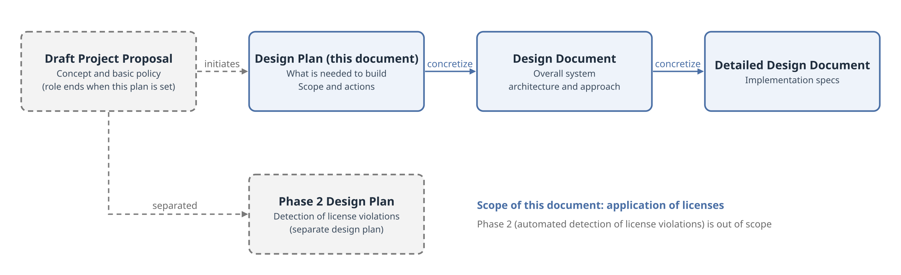
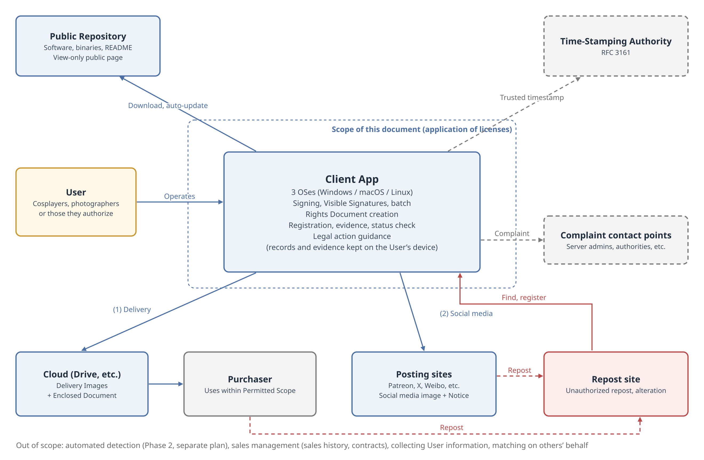
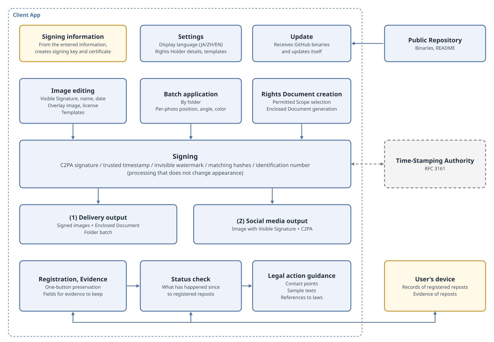
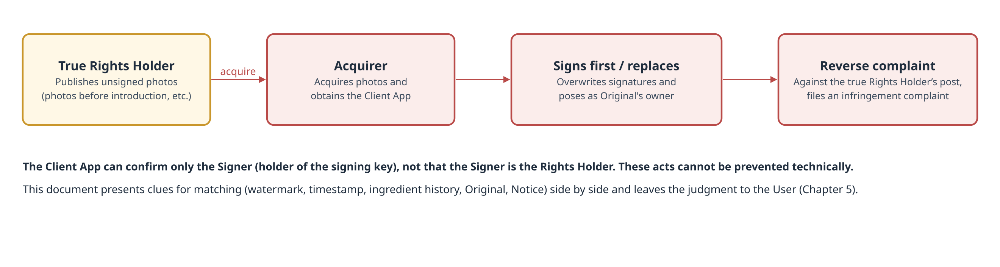
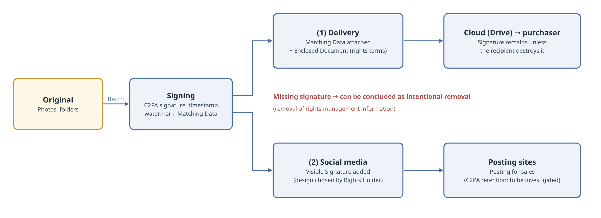
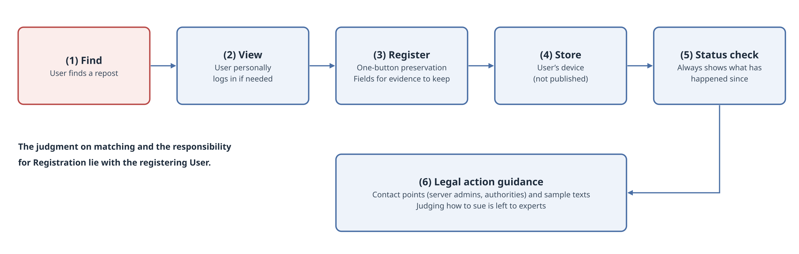
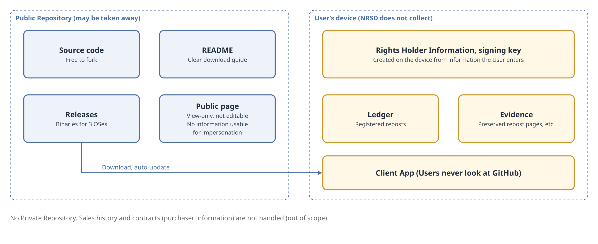

# Anti-Repost Tool for Cosplay Photos: Design Plan

Edition 2 (Draft)　2026-09-29 · Ishikawa Sou (石川宗)  
Nagareyama Software Development Co., Ltd. (NRSD)  
Word version: [Anti-Repost Tool for Cosplay Photos - Design Plan.docx](Anti-Repost%20Tool%20for%20Cosplay%20Photos%20-%20Design%20Plan.docx)

© 2026 Nagareyama Software Development Co., Ltd. (NRSD), Lead Developer: Ishikawa Sou (石川宗)　Copyright in this Design Plan and in the software developed under this Design Plan belongs to Nagareyama Software Development Co., Ltd. (NRSD). However, rights in the third-party standards, algorithms, and software considered for adoption in this Design Plan belong to their respective rights holders (see Chapter 17).

---

## Revision History

|Edition|Date|Description|Author|
|---|---|---|---|
|Edition 1 (Draft)|2026-09-29|Newly created, with the Draft Project Proposal (2026-09-24) as the initiating document|Ishikawa Sou|
|Edition 2 (Draft)|2026-09-29|Revised so that the System collects no User information and completes entirely within the Client App. The certificate for C2PA signatures is created on the device from information entered by the User, and no certificate authority is required. A person posing as the Rights Holder is treated as impossible to exclude, and the System instead presents clues for matching. The Private Repository is abolished; records and evidence are kept on the User’s device. Identification numbers are issued by the Client App and recorded automatically in the C2PA manifest, and the User chooses whether to append them to file names (Chapters 1 to 5, Chapter 7, Chapter 10, and Chapters 12 to 16)|Ishikawa Sou|
|Edition 2 (Draft)|2026-09-30|Corrected the article number in reference [20] of Chapter 18 (the definition of rights management information in the Copyright Act of Japan is Art. 2(1)(xxii) since the 2018 amendment; item (xxi) is technological measures restricting use)|Ishikawa Sou|

## Chapter 1  Position of This Document

### 1.1  Purpose of This Document

This document defines, for the “Anti-Repost Tool for Cosplay Photos” (hereinafter the “System”), what is needed in order to build the System, before the design document is written.

This document lays out, item by item, and settles who the users are, how and when the users use the System, on which platforms it runs, what serves as the development base, and how publication, distribution, and operation are managed.

This document does not specify how the System is to be realized. The means of realization are left to the design document; this document clarifies the matters that the design document shall take as premises and the matters that shall be investigated in detail at the design document stage.

### 1.2  Document Structure

The Draft Project Proposal sets out the document structure of the System as follows.

> This draft proposal is the initiating document for the design plan, and the documentation is organized in the following order. Draft project proposal (this document): concept and basic policy / Design plan: turns this draft proposal into concrete terms and confirms the development scope and actions / Design document: overall system architecture and approach / Detailed design document: implementation specifications for each function
> （Draft Project Proposal, Section 13）

This document is the “design plan” in this structure. Figure 1 shows the relationship between this document and the other documents.

Figure 1  Document structure

The automated detection application described in Section 12 of the Draft Project Proposal as Phase 2 of the System is treated as a design plan separate from this document (see Chapter 13).

### 1.3  Relationship with the Draft Project Proposal

The Draft Project Proposal is the document that prompted the drafting of this document. Upon the establishment of this document, the Draft Project Proposal has fulfilled its role, and its force shall be subordinate to this document.

Where the Draft Project Proposal and this document differ, this document prevails. How each section of the Draft Project Proposal is treated in this document is shown in the comparison table in Chapter 16.

When this document quotes the Draft Project Proposal, it indicates that it is a quotation and states the section quoted.

### 1.4  Classification of Statements

This document classifies each matter as follows.

|Class|Meaning|
|---|---|
|Decided|A matter settled in this document. The design document shall take it as a premise|
|[Design Required]|A matter for which only the requirement is set in this document and whose means of realization the design document must set. No countermeasure exists at present|
|To Be Investigated|A matter for which facts shall be investigated at the design document stage, with the means of realization set according to the results (listed in Chapter 14)|
|Open|A matter whose conclusion is reserved at the stage of this document, or a candidate whose adoption has not been decided (listed in Chapter 15)|
|Deferred to Design Document|A matter whose existence alone is confirmed at the planning stage, with its content set in the design document|

Decisions in each chapter are numbered in the form “D-chapter-sequence” so that they can be referenced from the design document.

### 1.5  Definitions

The terms used in this document have the following meanings.

|Term|Meaning|
|---|---|
|System|The whole system covered by this document, consisting of the Client App and the Public Repository|
|Client App|The software of the System that runs on the User’s device|
|Rights Holders|The authors and subjects of the photographs (as defined in Section 1 of the Draft Project Proposal)|
|Users|Those who use the System: the Rights Holders, or those authorized by either of them (defined in Chapter 3)|
|Signer|A person who holds a signing key and signs images with the Client App|
|Original|Photo data held by the Rights Holder before publication (including RAW, unprocessed data, and unpublished photographs)|
|Matching|Comparing an image with the Rights Holder’s records (Matching Data, Original, Notice, etc.) to obtain clues as to whether it is the same work and who the Rights Holder is. The System provides the means of matching but does not perform matching on anyone’s behalf (Chapter 5)|
|Matching Data|Information attached to an image for matching against the Original, including the C2PA signature (manifest), the invisible watermark, and the identification number|
|Matching hashes|Perceptual hashes and image features. They are not attached to the image but recorded for matching (recorded on the User’s device; the recording format is Open; O-10 “Recording format of work data”)|
|Identification number|A number issued by the Client App for each work and recorded automatically in the C2PA manifest. Whether it is also appended to the saved file name is chosen by the User when saving (the identification number of Section 4 of the Draft Project Proposal; recording in file names is revised by this document; see Chapter 16)|
|Delivery Image|An image delivered to a purchaser through a sale|
|Social Media Image|An image posted to a posting site for the purpose of sales. A Visible Signature is added|
|Visible Signature|A mark placed visibly on an image, such as the Rights Holder’s name, account name, date, overlay image, license statement, or other display|
|Permitted Scope|The scope of use that the Rights Holder licenses to purchasers for Delivery Images|
|Rights Document|A document stating the Permitted Scope and provisions concerning rights|
|Enclosed Document|A Rights Document or other document enclosed with Delivery Images|
|Notice|The Rights Holder’s policy on unauthorized reposting, posted on every site where works are posted (per Section 3 of the Draft Project Proposal)|
|Notice account|The Rights Holder’s own account on a posting site or elsewhere where the Rights Holder posts the Notice|
|Reposter|A person who reposts images against the Rights Holder’s intent|
|Infringer|A person who has published images without the Rights Holder’s permission, or has used images beyond the Permitted Scope, and has caused damage to the Rights Holder, regardless of whether the person is a purchaser|
|Registration|The recording in the Client App of a repost found by a User (corresponding to “reporting” in the Draft Project Proposal)|
|Rights Holder Information|Information showing who the Rights Holder is (handle name, Notice accounts, etc.). The User enters it, and it is recorded in the certificate for C2PA signatures and in images. The System does not collect it|
|Evidence Preservation|Leaving, at the time of Registration, a record to be used for later action|
|Public Repository|The GitHub repository in which the software of the System is published|

## Chapter 2  Purpose and Scope

### 2.1  Purpose

The Draft Project Proposal sets out the purpose of the System as follows.

> The purpose of this proposal is to enable authors and subjects of cosplay photographs (hereinafter the “Rights Holders”) to detect, prove, and take legal action against reposting made against the author’s intent and other unlawful reposting, with minimal burden.
> （Draft Project Proposal, Section 1）

This document inherits this purpose and sets out what the System seeks to protect as follows.

- What the System protects shall be the rights (copyright and portrait rights) that the Rights Holders have in their own photographs.
- The System shall protect those rights through the application of licenses, that is, by putting the Rights Holders in a position to display rights on their photographs, set a Permitted Scope, and assert their rights against use beyond that scope.

The software of the System itself (source code and binaries) is not something the System protects. Even if the software is copied or taken away, the rights of the Rights Holders are not harmed. Impersonation of a Rights Holder by someone else cannot be prevented technically. The System enables Rights Holders to show their rights by presenting clues for matching when impersonation is suspected (see Chapter 5).

### 2.2  Basic Policy

The Draft Project Proposal sets out the basic policy of the System as “detection, proof, and deterrence.”

> At present, it is difficult to technically stop reposts made against the author’s intent, or other unlawful reposting, in themselves. As a preliminary step toward that end, this system is intended for detection, proof, and deterrence.
> （Draft Project Proposal, Section 2）

This document positions deterrence among these as the greatest value of the System. It is considered that showing that the Rights Holder displays rights, states the Permitted Scope, and has the intent and the means to take action when appropriate has the effect of dissuading reposting even before any action is actually taken.

If an actual action does not succeed, it shall be treated as an issue and carried into the next improvement, and matters requiring legal judgment shall be referred to experts (see Chapter 11).

### 2.3  Scope of This Document

The scope of this document is the application of licenses. Specifically, the following matters are within scope.

- Entry of information for C2PA signatures, and presentation of clues for matching (Chapter 5)
- Signing of images, attachment of Matching Data, and addition of Visible Signatures (Chapter 7)
- The image editing screen, batch application, and the Rights Document creation screen (Chapter 8)
- Selection of the Permitted Scope and generation of Enclosed Documents (Chapter 9)
- Registration of reposts by Users themselves, Evidence Preservation, and status checking (Chapter 10)
- Guidance on legal action (Chapter 11)
- Management of the Public Repository, distribution, and updates (Chapter 12)

Figure 2 shows the scope of the System.

Figure 2  Scope of the System

### 2.4  Out of Scope

The following matters are outside the scope of this document.

|Out-of-scope matter|Reason|Treatment|
|---|---|---|
|Automated detection (crawling the network and automatically detecting reposts)|It lies on a different axis from the application of licenses and corresponds to the detection of license violations|Treated as a separate design plan (Chapter 13)|
|Sales management (management of sales history, sales contracts, and purchaser information)|The purpose of the System is to stop rights infringement, not to manage sales|Not handled. Anyone who needs it shall fork the Public Repository and modify it; NRSD takes no part in the results|
|Representation in lawsuits or other legal proceedings, and legal judgment|The System is not a substitute for legal experts|Not performed. Limited to presenting contact points (Chapter 11)|
|Identification of purchasers|As set out in Chapter 9, the party pursued is the Infringer, regardless of whether it is a purchaser|Not performed|
|Collection of User information, and matching on behalf of others|The System provides the means of matching but does not perform matching on anyone’s behalf. It collects no User information and completes within the Client App|Not performed (Chapter 5)|

### 2.5  Limitations Carried Over from the Draft Project Proposal

The following limitation stated in Section 10 of the Draft Project Proposal is carried over into this document.

> This system does not eliminate unauthorized reposting itself, and its effect is limited to photographs posted after the tools are introduced.
> （Draft Project Proposal, Section 10）

- Photographs published before introduction carry no signature or Matching Data. For these photographs, rights shall be shown through preservation of the Original and work registration (per Section 10 of the Draft Project Proposal).
- Photographs published before introduction may become targets of the impersonation described in Chapter 5.

### 2.6  Decisions in This Chapter

|No.|Decision|
|---|---|
|D-2-1|What the System protects shall be the rights (copyright and portrait rights) that the Rights Holders have in their own photographs|
|D-2-2|The scope of the System shall be the application of licenses|
|D-2-3|The greatest value of the System shall be deterrence|
|D-2-4|Automated detection shall be a separate design plan|
|D-2-5|Sales management is not handled. Anyone who needs it shall fork and modify the System, and NRSD takes no part in the results|
|D-2-6|Representation in legal proceedings and legal judgment are not performed|

## Chapter 3  Parties and Users

### 3.1  Parties

The persons related to the System, organized by type of person, fall into the following five types.

|Type|Relationship with the System|Inside or outside the System|
|---|---|---|
|Cosplayer (subject)|Holds portrait rights. Sells and posts photographs|Inside (User)|
|Photographer|Holds copyright (ownership may differ depending on the agreement with the cosplayer)|Inside (User)|
|Reposter|Reposts images against the Rights Holder’s intent. A person who reposts with the Rights Holder’s authorization is not a Reposter and is treated as standing on the Rights Holder’s side|Outside|
|Viewer|Recognizes, on posting sites, whether a photograph is genuine through the caption and the Notice. Signature verification is performed on existing public verification sites [15]|Outside|
|Operator (NRSD, fork operators)|Builds the System and, by design, always exists|Not defined within the System|

In addition, posting sites, operators of repost sites, hosting providers, time-stamping authorities, courts, complaint contact points, and other organizations are involved; these are not persons and are treated as organizations outside the System.

### 3.2  Definition of Users

The Users of the System shall be the Rights Holders of the images and those authorized by either of them. That is, a User shall be a cosplayer, a photographer, or a person authorized by either of them.

This definition is derived from the following reasoning.

- Viewers achieve their purpose through posting sites and existing public verification sites without using the System, and are therefore outside the System.
- The Operator is the maker of the System and need not be defined within the System.
- Those who repost without authorization do not use the System. Those who are authorized stand on the side of the cosplayer or the photographer.
- Therefore, those who use the System are limited to the Rights Holders of the images and those authorized by them.

### 3.3  Profile of Users

Users are treated as having the following characteristics.

- Users are not engineers. The System shall not presuppose an understanding of GitHub, and Users shall be able to use the System without looking at GitHub.
- Users exist across countries. In addition to Japan, China, and English-speaking regions, Users living in countries such as Canada are also assumed.
- Users like characters and cute things. Software that looks unappealing will not be used (see Chapter 8).
- Users post to social media in order to sell photographs, and deliver sold photographs to purchasers by sharing through the cloud (Google Drive, etc.).

#### 3.3.1  Example of a User

The example of one User (a cosplayer living in Canada), confirmed by NRSD in September 2026, is as follows. This is one example of the profile of Users and is one of the grounds for each chapter of this document.

- The User is active in English on a support service (Patreon).
- On posted images, the User places, in handwriting-style lettering, the account name and the locations of the support services (including a support service for China) as a Visible Signature.
- The Visible Signature is placed in the background area where it does not overlap the subject, and its position, orientation (horizontal, or vertical rotated 90 degrees), and color (white or black depending on the background) are adjusted for each photograph.
- Adjusting the Visible Signature one image at a time requires effort.
- The User delivers full-size images to supporters by sharing through the cloud (Google Drive).

### 3.4  Premises

The following matters are treated as premises, without conducting interviews, in building the System.

- The actual delivery (route, format, and size), the actual Visible Signatures, and the rights relationship with the photographer are all treated as being understood by the cosplayer personally.
- If there are deficiencies in the premises, they shall be improved after Users have become able to use the System, upon receiving comments from Users. Conducting interviews while the System cannot be used would not convey to Users what the discussion is about.

### 3.5  Unintended Parties

In addition to those listed in Section 3.1, a person who poses as the Rights Holder may use the System. Such a person cannot be excluded technically. This document sets out, in Chapter 5, how matching is handled when such a person appears.

### 3.6  Decisions in This Chapter

|No.|Decision|
|---|---|
|D-3-1|The Users shall be the Rights Holders of the images (cosplayers and photographers) and those authorized by either of them|
|D-3-2|Viewers and the Operator are not defined within the System|
|D-3-3|Users shall be able to use the System without looking at GitHub|
|D-3-4|The System is built on the premise that delivery, Visible Signatures, and the rights relationship with the photographer are understood by the cosplayer personally|
|D-3-5|No interviews are conducted; improvement is made based on comments after the System becomes usable|
|D-3-6|On the premise that a person posing as the Rights Holder cannot be excluded, how matching is handled is set out in Chapter 5|

## Chapter 4  Overview of the System

### 4.1  Components

The System consists of the following elements.

|Component|Role|
|---|---|
|Client App|Runs on the User’s device and performs signing, Visible Signatures, batch application, creation of Rights Documents, Registration, Evidence Preservation, status checking, and guidance on legal action. Keeps Rights Holder Information, the signing key, work data, records of registered reposts, and evidence on the User’s device|
|Public Repository|Holds the source code, binaries, the README, and the view-only public page|
|External organizations|Time-stamping authorities, posting sites, the cloud, complaint contact points, etc. The System uses them or guides Users to them|

### 4.2  System Blocks

Figure 3 shows the inside of the Client App, divided into groups of functions (blocks). Figure 3 shows the configuration as far as can be conceived at the stage of this document; the approach for each block is set in the design document.

Figure 3  System blocks

|Block|Function|Related chapter|
|---|---|---|
|Signing information|Creates, on the device, the signing key and certificate used for C2PA signatures from information entered by the User|Chapter 5 “Information for C2PA Signatures and Persons Posing as the Rights Holder”|
|Settings|Manages the display language and templates|Chapter 8 “Screens and Usability”, Chapter 9 “Rights Documents and Languages”|
|Update|Receives binaries from the Public Repository and updates the Client App|Chapter 12 “Repository Management, Distribution, and Updates”|
|Image editing|Creates and applies Visible Signatures, names, dates, overlay images, and license statements as templates|Chapter 8 “Screens and Usability”|
|Batch application|Processes by folder and adjusts placement, orientation, and color for each photograph|Chapter 8 “Screens and Usability”|
|Rights Document creation|Selects the Permitted Scope and generates Enclosed Documents|Chapter 9 “Rights Documents and Languages”|
|Signing|Attaches or records C2PA signatures, trusted timestamps, invisible watermarks, matching hashes, and identification numbers|Chapter 7 “Forms of Photographs and Processing Streams”|
|Delivery output|Outputs signed images together with Enclosed Documents as a folder batch|Chapter 7 “Forms of Photographs and Processing Streams”, Chapter 9 “Rights Documents and Languages”|
|Social media output|Outputs images with a Visible Signature, with a C2PA signature attached|Chapter 7 “Forms of Photographs and Processing Streams”|
|Registration and Evidence Preservation|Registers found reposts and preserves evidence (kept on the User’s device)|Chapter 10 “Registration of Reposts, Evidence Preservation, and Status Checking”|
|Status check|Shows what has since happened to registered reposts|Chapter 10 “Registration of Reposts, Evidence Preservation, and Status Checking”|
|Legal action guidance|Shows contact points, sample texts, and references to the laws of each country|Chapter 11 “Scope of Support for Legal Action”|

### 4.3  Usage Scenes

The scenes in which Users use the Client App are as follows.

|Scene|User task|Timing|
|---|---|---|
|Preparation|Enter the information for C2PA signatures and prepare a Visible Signature template|Initially, and whenever changed|
|Notice|Post the Notice on every site where works are posted (per Section 3 of the Draft Project Proposal)|Once per site, initially|
|Sale|Batch-process the folder for delivery and upload it to the cloud together with the Enclosed Documents|Each sale|
|Posting|Create Social Media Images and post them to posting sites|Each posting|
|Registration|Register a repost from the Client App when found|When a repost is found|
|Check|Check the status of registered reposts|At any time|
|Action|Following the guidance, the Rights Holder personally files complaints or takes other action|At the Rights Holder’s discretion|

Section 5 of the Draft Project Proposal provides that immediate action is not required upon confirming a repost. This document carries this over.

> Immediate action is not required upon confirming a repost. Reporting preserves the evidence, and action may be taken collectively at a later date.
> （Draft Project Proposal, Section 5）

## Chapter 5  Information for C2PA Signatures and Persons Posing as the Rights Holder

### 5.1  Information for C2PA Signatures

A C2PA signature is made with an X.509 certificate and the corresponding signing key [1]. The C2PA technical specification does not require any particular qualification of the issuer of the certificate used for signing.

Users do not necessarily know the information needed for a C2PA signature (the contents of a certificate). The System creates the signing key and the certificate inside the Client App from the information the User writes in the input fields (handle name, Notice accounts, etc.).

The System collects no User information. The signing key, the certificate, and the entered information are kept only on the User’s device. The System does not ask for an email address or any other registration in order to be used.

A signature made with a certificate created in this way can be confirmed on existing public verification sites as not tampered with (valid), but the Signer is not shown as vouched for by the C2PA Trust List (trusted) [24].

### 5.2  Persons Posing as the Rights Holder

Anyone can obtain the Client App from the Public Repository and anyone can use it (see Chapter 12). Therefore, a person who possesses another person’s photographs can do the following. Figure 4 shows this flow.

- Apply a C2PA signature, before the Rights Holder does, to photographs the Rights Holder has not yet signed (photographs published before introduction, leaked Originals, etc.).
- Remove or overwrite the C2PA signature in an image the Rights Holder signed, and replace it with the person’s own.
- Based on records made with the System, file a complaint of infringement against the true Rights Holder’s post.

Figure 4  Acts of a person posing as the Rights Holder

These cannot be prevented technically. This document does not aim to prevent them; it aims to present, when they occur, the clues with which the Rights Holder can show their rights.

### 5.3  Identity and Entitlement

In dealing with this problem, this document distinguishes the matters to be confirmed into the following two.

|Distinction|Matter to be confirmed|Clue|
|---|---|---|
|Identity|Who signed|The certificate used for signing (including the information entered by the User)|
|Entitlement|Whether the person who signed is the Rights Holder of the photograph (or a person authorized by the Rights Holder)|Posting the signing key fingerprint or similar on the Notice accounts (to which only the owner can write), and matching it against the certificate|

Identity alone cannot show entitlement, because it cannot prevent a person who has obtained another person’s photographs from signing them first with the person’s own certificate.

The clue for entitlement, matching against the Notice accounts, uses the Notice that Section 3 of the Draft Project Proposal treats as the premise for effectiveness. The Rights Holder posts the Notice on the profile of every site where works are posted. By also posting the signing key fingerprint or similar there, anyone who sees the image can confirm that “the owner of this account is the holder of this signing key.” Because only the owner can write to a profile, a person attempting impersonation cannot pass this check for the true Rights Holder’s account. This does not apply, however, where the impersonator posts the image on their own account and displays their own fingerprint there, or where the true Rights Holder’s account is taken over. In the former case, which account first posted the photo serves as a clue (Section 5.5).

The System provides the means (algorithm) of this matching, but does not perform the matching on anyone’s behalf. The result of matching is judged by the person who performs it.

### 5.4  Proof by Possession of the Original

Possessing the Original (RAW, unprocessed data, and unpublished photographs from the same shoot) may in itself serve as evidence of entitlement. A signature on published images alone loses to whoever signed first, but only the Rights Holder possesses the Original. The design document shall set, as one of the clues for matching, a way of showing possession of the Original.

### 5.5  Handling of Matching When a Signature Has Been Overwritten

When matching an image in which another person has overwritten the C2PA signature with their own, the System presents the following clues side by side and does not decide which party is the Rights Holder.

|Clue|What it shows|
|---|---|
|Invisible watermark|The identification number embedded in the pixels remains even if the C2PA signature is replaced. If it disagrees with the record in the replacing person’s manifest, that is a trace of replacement|
|Trusted timestamp|The record kept on the User’s device (a pair of identification number and trusted timestamp) shows that it precedes the replacing person’s signature, where that is the case|
|Ingredient history|If the replacing person left the original manifest in place, the original Signer is shown|
|Original|Only the Rights Holder possesses RAW files, larger images, and the like|
|Notice|Which signing key matches the Notice on the account where the photograph was first posted|

Judgment and action (see Chapter 11) are left to the User.

### 5.6  To Be Investigated

- For C2PA signing certificates: the requirements that a certificate created on the device must satisfy, and support for the C2PA Trust List (I-01 “C2PA signing certificates”)
- Whether matching between Notice accounts and signing keys is possible on each posting site (I-02 “Matching between Notice accounts and signing keys”)

C2PA operates a Conformance Program, and its C2PA Trust List was launched in mid-2025, replacing the Interim Trust List [24].

### 5.7  Decisions in This Chapter

|No.|Decision|
|---|---|
|D-5-1|The System does not confirm Users and collects no User information. No registration is required in order to use the System|
|D-5-2|The certificate for C2PA signatures is created inside the Client App from information entered by the User. No certificate authority is required|
|D-5-3|Acts of a person posing as the Rights Holder (signing first, replacing signatures, and reverse complaints) are treated as impossible to prevent; clues for matching are presented. No judgment is made|
|D-5-4|Identity and entitlement are treated separately|
|D-5-5|The System provides the means of matching but does not perform matching on anyone’s behalf|

## Chapter 6  Platform and Development Base

### 6.1  Platform

The Client App shall be a desktop application that runs on three operating systems: Windows, macOS, and Linux. Even including the image editing screen, the GUI will not become complex, and support for three operating systems is judged not to impose an excessive burden.

The System shall not be built as a website. Unauthorized reposting is a problem arising from photographs having been put on the web. Putting the System on the web again would make the System itself an unavoidable target of attack.

Section 6 of the Draft Project Proposal provides for integration into the Windows right-click menu. This document extends support to three operating systems; whether to provide OS-specific integration such as right-click menus shall be decided in the design document.

### 6.2  Development Base

The development base shall not be fixed to any specific library in this document. Fixing implementation libraries at the planning stage would only narrow the options and bring no benefit.

Section 6 of the Draft Project Proposal contains the following statement.

> Implemented on the basis of c2pa-python [14].
> （Draft Project Proposal, Section 6）

This statement was not made with the intent of fixing the implementation base. This document does not carry this statement over.

The development base shall be selected in the design document from among those that meet the following conditions.

|Condition|Reason|
|---|---|
|Runs on three operating systems|Per Section 6.1|
|Allows the appearance to be designed freely|Users do not use software that looks unappealing (Chapter 8)|
|Handles image editing well|Required for the image editing screen and batch application (Chapter 8)|
|Can handle C2PA signatures, invisible watermarks, and matching hashes|Required for signing (Chapter 7)|
|Has, or can incorporate, a self-update mechanism|Per Chapter 12|

### 6.3  Candidates for the Development Base

The status of each component as confirmed on September 29, 2026 is as follows.

|Component|Confirmed facts|
|---|---|
|c2pa-python|A component for using c2pa-rs (an implementation in Rust) from Python. MIT License and Apache License 2.0 [14]|
|TrustMark|Implementations exist in Python (using PyTorch), JavaScript (using ONNX, decoding only), and Rust. MIT License [10]|
|PDQ|Official implementations exist in C++, PHP, Python, Java, and WASM. Rust and C# implementations are by third parties. BSD License [12][25]|
|Tauri|The screens are built with HTML and CSS and the processing is written in Rust. Supports Windows, macOS, and Linux, and has a self-update feature. MIT License or Apache License 2.0 [26]|

According to these facts, a configuration in which the screens are built with HTML and CSS so that the appearance can be designed freely, and the processing side uses c2pa-rs and the Rust implementation of TrustMark (a configuration using Tauri), is a candidate that meets the conditions in Section 6.2. However, this is a candidate, and its adoption shall be decided in the design document (see Chapter 15).

Even when the screens are built with HTML and CSS, they are displayed only within the User’s device and are not published on the internet. Therefore, this does not conflict with the policy in Section 6.1 that the System shall not be built as a website.

### 6.4  Decisions in This Chapter

|No.|Decision|
|---|---|
|D-6-1|The Client App shall be a desktop application running on Windows, macOS, and Linux|
|D-6-2|The System shall not be built as a website|
|D-6-3|The development base is not fixed to any specific library in this document. The statement on c2pa-python in Section 6 of the Draft Project Proposal is not carried over|
|D-6-4|The development base shall be selected in the design document from among those meeting the conditions in Section 6.2|

## Chapter 7  Forms of Photographs and Processing Streams

### 7.1  C2PA Signatures

The System shall attach a C2PA signature to every image it outputs.

Section 4 of the Draft Project Proposal provides that information is attached in three layers: the C2PA signature, the invisible watermark, and matching hashes. This document carries this over. Figure 1 in Section 4 of the Draft Project Proposal shows a configuration in which identification numbers and matching hashes are registered as “work data,” but in this document their recording location is the User’s device (D-12-3 “Rights Holder Information, the signing key, work data, the ledger, and evidence are kept on the User’s device; NRSD does not collect them”), and the recording format is left Open (O-10 “Recording format of work data”). Identification numbers are issued by the Client App and recorded automatically in the C2PA manifest. Whether they are also appended to the saved file name is chosen by the User when saving, and the Client App also displays them on screen (D-7-7 “Identification numbers are issued by the Client App and recorded automatically in the C2PA manifest. Whether they are appended to file names is chosen by the User when saving”).

The following table is quoted from the table in Section 4 of the Draft Project Proposal.

|Layer|Content|Function|
|---|---|---|
|C2PA signature [1][3][4]|A digital signature based on an international standard, recording the creator, date and time, and identification number, with a trusted timestamp under RFC 3161 [8]|Detects alteration at the pixel level. Third parties can verify it on existing public verification sites [15]|
|Invisible watermark|Invisible information embedded in the pixels (open-source implementations such as TrustMark are assumed) [9][10][11]|Allows the record of the original to be referenced from the image even if the signature is removed on social media or elsewhere|
|Matching hashes|Perceptual hashes such as PDQ and image features [12][13]|Allows matching of reposted images that have been recompressed, resized, or cropped|

### 7.2  Two Streams

The System provides the following two streams according to the purpose of the photographs. Figure 5 shows the processing streams.

Figure 5  Processing streams

|Item|(1) Delivery|(2) Social media|
|---|---|---|
|Purpose|Deliver images to purchasers through sales|Post to posting sites for the purpose of sales|
|Route|Delivered in folder batches by sharing through the cloud (Google Drive, etc.)|Posted to posting sites (Patreon, X, Weibo, etc.)|
|C2PA signature|Attached|Attached|
|Matching Data|Attached to every image|Attached|
|Visible Signature|Open (O-11 “Visible Signatures on Delivery Images”)|Added (in a design chosen by the Rights Holder)|
|Enclosed Document|Enclosed (Chapter 9)|Not enclosed|
|Survival of the signature|Remains unless the recipient intentionally removes it|May be removed by the posting site (To Be Investigated)|

### 7.3  Delivery Stream

Users deliver sold images directly to purchasers via the cloud. On this route, the signature attached to the image remains unless the recipient intentionally removes it.

Accordingly, if the signature is missing from a delivered image, it can be concluded that the recipient intentionally removed it. The act of removing a signature or watermark may in itself be unlawful as removal of rights management information [16][19][20][27].

If a sold image carries no C2PA signature, the person who purchased it can pose as the Rights Holder. At present, no arrangement concerning rights between Users and purchasers is written down anywhere. The System shall address this by attaching a C2PA signature and Matching Data to Delivery Images and indicating where the rights lie through Enclosed Documents (see Chapter 9).

### 7.4  Social Media Stream

Users post to social media in order to sell photographs. Social Media Images therefore require a Visible Signature indicating where the rights lie. On Social Media Images, it is acceptable for the Rights Holder’s name to be displayed visibly.

The content and design of the Visible Signature shall be chosen by the Rights Holder. Visible Signatures are created and applied through the image editing screen and batch application (see Chapter 8).

Whether posting sites retain or remove C2PA signatures upon upload cannot be known without investigation. It is quite conceivable that some sites remove them. In the social media stream, the System shall provide means of protecting rights through the Visible Signature and the invisible watermark, separately from the C2PA signature.

### 7.5  To Be Investigated

- Whether each posting site and Cloud retains C2PA signatures upon upload (I-03 “Retention of C2PA signatures on posting sites and Cloud”)

### 7.6  Decisions in This Chapter

|No.|Decision|
|---|---|
|D-7-1|A C2PA signature is attached to every image output|
|D-7-2|The three layers of Section 4 of the Draft Project Proposal (C2PA signature, invisible watermark, matching hashes) are carried over|
|D-7-3|Two streams are provided: (1) delivery and (2) social media|
|D-7-4|Matching Data is attached to Delivery Images, and Enclosed Documents are enclosed with them|
|D-7-5|A Visible Signature in a design chosen by the Rights Holder is added to Social Media Images|
|D-7-6|A missing signature is treated as something that can be concluded to be intentional removal by the recipient|
|D-7-7|Identification numbers are issued by the Client App and recorded automatically in the C2PA manifest. Whether they are appended to file names is chosen by the User when saving|

## Chapter 8  Screens and Usability

### 8.1  Appearance

The Client App shall have an appealing appearance. Cosplayers, who are the Users, like characters and cute things. Software that looks unappealing will not be used, however good its functions.

Appearance is treated as a requirement directly tied to the effectiveness of the System. If the System is not used by Users, neither signatures nor Notices are applied, and the deterrence set out in Section 2.2 does not work.

### 8.2  Screens

The Client App shall have the following screens.

|Screen|Purpose|Main requirements|
|---|---|---|
|Image editing screen|Create Visible Signatures for Social Media Images|Names, dates, overlay images, and license statements can be created as templates in a design the Rights Holder likes, and applied|
|Batch application|Process by folder|A template can be applied to the images in a folder in a batch. Placement, orientation, and color can be adjusted for each photograph|
|Rights Document creation screen|Select the Permitted Scope and create Enclosed Documents|How far rights are granted for the images sold can be selected by an easy-to-understand method such as radio buttons|

How Registration (Chapter 10), status checking (Chapter 10), guidance on legal action (Chapter 11), and other functions are organized into screens shall be decided in the design document. The details of each screen shall also be decided in the design document.

### 8.3  Reconciling Editing and Batch Application

A screen for editing images one at a time and a function for applying in batches by folder appear at first to be conflicting requirements. This document reconciles them by saving the design created on the editing screen as a template, which can then be applied either to single images or by folder.

As shown in the example in Section 3.3.1, Users adjust the position, orientation, and color of the Visible Signature for each photograph. Even in batch application, it shall be possible to adjust, for each photograph, placement that avoids the subject and color matched to the background.

### 8.4  Decisions in This Chapter

|No.|Decision|
|---|---|
|D-8-1|The Client App shall have an appealing appearance. Appearance is treated as a requirement directly tied to the effectiveness of the System|
|D-8-2|The image editing screen, batch application, and the Rights Document creation screen are provided. The organization of other screens is decided in the design document|
|D-8-3|A design created on the editing screen becomes a template that can be applied to single images or by folder|
|D-8-4|Even in batch application, placement, orientation, and color can be adjusted for each photograph|
|D-8-5|The details of the screens are decided in the design document|

## Chapter 9  Rights Documents and Languages

### 9.1  Selection of the Permitted Scope

There are different kinds of rights. The Rights Holder shall choose, at the time of sale, how far rights are granted to purchasers for the images sold. The choice is made on the Rights Document creation screen by an easy-to-understand method such as radio buttons (see Chapter 8).

The kinds of rights offered as options shall be decided in the design document.

The Permitted Scope chosen at the time of sale becomes the criterion for judging “what is infringed” by a repost when it is later registered (see Chapter 10).

### 9.2  Enclosed Documents

Images uploaded to the cloud by folder for sale shall be accompanied by an Enclosed Document stating the following.

- Provisions concerning rights (including that rights do not transfer by purchase)
- The Permitted Scope
- A sentence stating that the images must not be passed to others without permission
- What means the Rights Holder may take if the Matching Data is erased and the images are used outside the Permitted Scope
- What acts may give rise to what liability

The Enclosed Document also serves to help those whose understanding of rights is insufficient. It is thought that most purchasers do not believe that purchasing an image gives them its rights as well. The Enclosed Document is treated not as a strongly worded contract but as a statement of facts. Even where there is concern that writing an Enclosed Document may reduce sales, it shall be sufficient for the context of rights to be shown in the delivered directory.

If the sentence in the Enclosed Document stating that the images “must not be passed to others without permission” is lost in the course of passing them on, this is not due to the fault of the Rights Holder.

### 9.3  Countries Covered

The content of Rights Documents differs not by language but by country (jurisdiction). Even within the English-speaking world, the laws of the United States, the United Kingdom, Canada, and Australia differ. Therefore, “English” does not work as a category for Rights Documents.

This document sets out the countries covered by Rights Documents as follows.

- Information covering all countries is published as a link destination.
- Text versions are enclosed only for the nationalities common among purchasers.
- The text is not varied by selecting the purchaser’s country.

The nationalities common among purchasers are assumed to be known by the Rights Holder personally. How far the purchaser’s country can be known on sales platforms such as Patreon will be confirmed by NRSD through actual use (I-07 “Knowing the purchaser’s country”).

### 9.4  Party Pursued

The party pursued under the System is the Infringer who published images and caused damage to the Rights Holder. Whether that person is a purchaser does not matter.

Pursuing the person who purchased an image directly is not realistic, because images can also be copied and passed on by USB and other means. If the Infringer is pursued as such, there is no need to identify purchasers, and the Rights Holder’s effort in selling does not increase.

When a repost occurs, the location of the repost site’s server is taken to be ascertainable by investigation. If it cannot be ascertained even by investigation, action on that repost shall be abandoned.

### 9.5  Approach to Governing Law (Reference)

In drafting the wording of Rights Documents, the following approach is used as a reference. The following is not legal advice, and confirmation by an expert is required before the wording is finalized.

|Layer|Content|Approach to governing law|
|---|---|---|
|Permitted Scope (contract)|What is permitted|It is common for the parties to choose the governing law, and stating the seller’s country as the governing law can be considered. The content of the Permitted Scope itself can be written in a way that does not depend on the country|
|Infringement (use outside the Permitted Scope)|What liability arises|Governed by the laws of the country where protection is claimed (Berne Convention, Article 5(2) [28]). Because where infringement will occur is not known in advance, the country cannot be fixed in advance|

The Berne Convention provides that the enjoyment and exercise of copyright in the countries of the Union shall not be subject to any formality [28]. In addition, Article 12 of the WIPO Copyright Treaty obliges Contracting Parties to provide legal remedies against, among other acts, removing or altering rights management information without authority [27]. The Chinese, US, and Japanese provisions cited in Section 2 of the Draft Project Proposal [16][19][20] all correspond to this.

### 9.6  Example of Application

The approach of this chapter is checked with the following example.

- A cosplayer living in Canada sold images through a US company’s platform (Patreon, etc.) and delivered them via Google Drive.
- The purchaser lived in China.
- The purchaser built a site on a server in China without permission and made the images downloadable by an unspecified number of people.

In this example, the infringement arises from publication on a server in China. Under the approach of this document, this infringement is pursued under Chinese law. Canada and China are both countries of the Berne Union, and works of Canadian authors are also protected in China. The fact that the sales platform belongs to a US company, and that Google Drive was used for delivery, does not determine the law applicable to the infringement.

Matters that may be pursued include copyright infringement (unauthorized publication and distribution), removal of rights management information if the Matching Data was removed [16], and the portrait rights of the subject [17]. Possible steps include identifying the operator by the method in Section 7 of the Draft Project Proposal (ICP registration number [22], etc.), notifying for removal, and filing suit in court where necessary. Work registration [21] may reinforce evidence showing ownership of the rights.

In this example, the contract (Permitted Scope) is considered to function mainly as material that rejects the claim that “having purchased it, I thought I could use it” and shows intent.

These article numbers and procedures are based on the references of the Draft Project Proposal and NRSD’s own research, and confirmation by an expert is required before the wording is finalized.

### 9.7  Display Languages

The display languages of the Client App shall be Japanese, Chinese, and English. If other languages are requested, they shall be added later.

### 9.8  Decisions in This Chapter

|No.|Decision|
|---|---|
|D-9-1|The Rights Holder chooses, at the time of sale, how far rights are granted|
|D-9-2|The Permitted Scope chosen at the time of sale is the criterion for judging what a repost infringes|
|D-9-3|Delivery Images are accompanied by an Enclosed Document stating the matters in Section 9.2|
|D-9-4|The Enclosed Document includes a sentence stating that the images must not be passed to others without permission. Its loss is not due to the fault of the Rights Holder|
|D-9-5|Information covering all countries is published as a link destination, and text versions are enclosed only for the nationalities common among purchasers|
|D-9-6|The party pursued is the Infringer, regardless of whether it is a purchaser|
|D-9-7|The location of the server is taken to be ascertainable by investigation; if it cannot be ascertained, action is abandoned|
|D-9-8|The display languages are Japanese, Chinese, and English, with others added on request|

## Chapter 10  Registration of Reposts, Evidence Preservation, and Status Checking

### 10.1  Positioning

The function by which Users themselves find and register reposts is included within the scope of this document (the application of licenses). If a User who finds their own photographs published without permission cannot assert their rights on the spot, attaching signatures would be meaningless and the System would be of no use.

This function lies on a different axis from automated detection, in which a machine crawls the network and detects reposts (Chapter 13). Registration is an act by which the User personally applies the license.

### 10.2  Registration Flow

Figure 6 shows the registration flow.

Figure 6  Flow of Registration and Evidence Preservation

- The User finds a repost.
- If the page requires login, the User personally logs in and views it. The Client App is not required to retrieve pages that require login.
- The User registers it from the Client App with a single button. Evidence is preserved at the same time as Registration. The User does not need to know what is needed as evidence.
- The registration screen has input fields indicating that “it is advisable to keep this kind of evidence as well.” How much evidence to keep is left to the User personally.
- Preserved evidence is stored on the User’s device.
- The User can always see, from the Client App, what has since happened to registered reposts.
- When taking action, the User follows the guidance on legal action (Chapter 11).

### 10.3  Matters to Be Shown Later

Evidence Preservation means leaving, at the time of discovery, a state in which what was happening at that time can be shown when rights are asserted later. The matters to be shown later are the following five.

|No.|Matter to be shown|What is kept|When it is kept|
|---|---|---|---|
|(1)|That it is one’s own work|C2PA signature, trusted timestamp, Original|At signing (already exists)|
|(2)|When and where it was published|Record of the repost page and its trusted timestamp|At Registration|
|(3)|That it is the same image|Result of matching by watermark and matching hashes|At Registration|
|(4)|Who published it, and where|Information on the server and operator|At Registration|
|(5)|That it is use outside the Permitted Scope|The Permitted Scope chosen at sale, the Enclosed Document, and the Notice|At sale and at Notice (already exists)|

Items (1) and (5) are already at hand from earlier work. Items (2) to (4) cannot be obtained afterward once the repost page is deleted, and must therefore be kept at the time of discovery.

What specifically is to be obtained (screen records, times, addresses, what was missing for each medium, etc.) shall be decided in the design document.

Section 7 of the Draft Project Proposal provides for trusted timestamps as follows. This document carries this over.

> Trusted timestamp: Because git commit dates are self-declared and have no probative value, an RFC 3161 [8] timestamp is obtained for the hash of each saved page, and its certificate is saved together with it.
> （Draft Project Proposal, Section 7）

The country-specific reinforcement of evidence cited in Section 7 of the Draft Project Proposal (electronic evidence recorded on blockchains at Internet Courts in China [18]; notarial deeds or evidence-grade recording services in Japan) and the identification of operators (ICP registration number [22]; WHOIS and ASN lookups [23]) shall be referred to when the design document sets the approach for Evidence Preservation and guidance on legal action.

### 10.4  Responsibility

After recompression or cropping, matching results are no more than probabilistic. However, Registration is performed by a human User. The judgment on matching and the responsibility for Registration shall be borne by the User who registered.

### 10.5  Where Evidence Is Stored

Preserved evidence shall be stored on the User’s device and not published. The System does not collect evidence. When evidence is to be handed to experts or others, the User exports it and hands it over. If evidence is published and the User makes an erroneous Registration or other mistake, the User may in turn be sued.

Sales history and sales contracts (purchaser information) are not handled by the System (Section 2.4).

### 10.6  Sharing the Burden

It is an unreasonable burden for the person who found a repost to follow it alone to its final outcome. The System lightens this burden by listing the reposts the User has registered on the device and presenting their subsequent status and the options for action that can be taken. Which of the options to take is for the User to decide. The idea of automated detection (Chapter 13) comes from the same place.

Repost sites often carry photographs of many Rights Holders, not just one. If other Users can refer to information on repost sites registered by one User, other Rights Holders can more easily find their own photographs. However, this would require collecting User information, which is incompatible with this document’s policy of collecting no User information (Chapter 5). Within the scope of this document, no sharing among Users takes place. Sharing and notification to authors are dealt with in the Phase 2 design plan (see Chapter 13).

### 10.7  Decisions in This Chapter

|No.|Decision|
|---|---|
|D-10-1|Registration of reposts by Users themselves is included within the scope of this document|
|D-10-2|Registration is done from the Client App with a single button, and evidence is preserved at the same time|
|D-10-3|Pages requiring login are obtained by the User personally logging in|
|D-10-4|Input fields indicating evidence that should be kept are provided|
|D-10-5|The specific items to be obtained are decided in the design document|
|D-10-6|The judgment on matching and the responsibility for Registration are borne by the User who registered|
|D-10-7|Evidence is stored on the User’s device and not published. The System does not collect evidence|
|D-10-8|The status of registered reposts can always be seen in the Client App|
|D-10-9|Information on registered reposts is listed on the User’s device, and the options for action are presented. No sharing among Users takes place (dealt with in Phase 2)|

## Chapter 11  Scope of Support for Legal Action

### 11.1  Scope of Support

The System is not a substitute for legal experts and does not judge how rights infringement should be pursued. Section 9 of the Draft Project Proposal, after providing that NRSD’s legal counsel will handle lawsuits concerning the operation of the System, states as follows. This document carries this over.

> However, this does not serve to protect users’ rights. Takedown requests and damage claims against unauthorized reposting must be pursued by each user as the Rights Holder.
> （Draft Project Proposal, Section 9）

On the other hand, it is possible to present contact points. The System shall present the following guidance to Users who have registered reposts. These are general matters whose correctness can be checked by research.

- Complaint contact points (infringement complaint channels of posting sites, authorities in charge of information, server administrators, etc.)
- Sample texts to send to contact points (sample emails to server administrators, etc.)
- References to the laws of each country

Section 8 of the Draft Project Proposal lists where to file as follows. This document carries this over.

> Where to file: Infringement complaint channels of Weibo, Xiaohongshu, Bilibili, and others; DMCA notices to US service providers; and notices to server providers and operators.
> （Draft Project Proposal, Section 8）

### 11.2  References to the Laws of Each Country

The laws of each country shall be accumulated as reference information within a framework covering “all” countries. Because assembling everything at once is not realistic, they shall be added comprehensively as implementation progresses.

### 11.3  Approach to Deterrence

A means of action has no meaning unless it can actually be used. However, having the means ready, together with the intent to take action when appropriate, is in itself a deterrent. The greatest value of the System lies in this deterrence (Section 2.2).

If an actual action does not succeed, it shall be treated as an issue, carried forward, and referred to experts.

### 11.4  Decisions in This Chapter

|No.|Decision|
|---|---|
|D-11-1|How to pursue infringement is not judged|
|D-11-2|Contact points, sample texts, and references to the laws of each country are presented as guidance|
|D-11-3|The laws of each country are accumulated as references within an “all countries” framework and added with each implementation|

## Chapter 12  Repository Management, Distribution, and Updates

### 12.1  Repository Structure

The System provides the Public Repository. No Private Repository is provided. Figure 7 shows the structure.

Figure 7  Public Repository and the User’s device

|Location|What it holds|Published|
|---|---|---|
|Public Repository|Source code, binaries (releases), the README, and the public page|Published. May be taken away|
|User’s device|Rights Holder Information (who the Rights Holder is), the signing key, work data (identification numbers and matching hashes), records of registered reposts (the ledger), and evidence of reposts|Not published. NRSD does not collect them|

There is no problem with the software of the System itself being taken away. What must be protected is the rights of the Rights Holders set out in Section 2.1, and the information for that purpose is kept only on the User’s device.

Forking of a public repository cannot be prevented [29]. In the structure of this document there is no need to prevent the Public Repository from being forked.

### 12.2  Public Page

Viewing of the public page shall not be prevented. The public page shall not be editable, and information that could be used for impersonation shall not be posted on it. The content to be posted on the public page shall be decided in the design document.

### 12.3  Relationship with Fork Operation in the Draft Project Proposal

Section 9 of the Draft Project Proposal provides that those wishing to use the tools fork them and operate them at their own responsibility.

> The tools will be published on GitHub, and those wishing to use them shall fork them and operate their own copies at their own responsibility. NRSD bears no responsibility for the results of the operation of any fork.
> （Draft Project Proposal, Section 9）

This document requires that Users are not engineers and can use the System without looking at GitHub (Chapter 3). Therefore, it is not presupposed that Users themselves fork and operate the System. Forking is done by those who intend to modify the System, and NRSD shall bear no responsibility for the results of the operation of any fork.

Section 1 of the Draft Project Proposal provides that the tools will be released free of charge “within the scope defined by their license.” The scope of publication is defined by the license. Because the information to be protected is kept only on the User’s device, publishing the software does not harm it.

### 12.4  Distribution

Users shall download the Client App from a GitHub link. By writing the README on the top page of the Public Repository in an easy-to-understand way, even Users who do not understand GitHub shall be able to download it.

### 12.5  Updates

The Client App shall incorporate a mechanism that receives updated binaries from the Public Repository and updates itself. Users shall not need to perform any operation for updates.

### 12.6  To Be Investigated

- Whether GitHub (including the public page) can be reached from mainland China (I-04 “Access to GitHub from mainland China”)
- Code signing on macOS and Windows (OS warnings when unsigned, and cost) (I-05 “Code signing”)

### 12.7  Decisions in This Chapter

|No.|Decision|
|---|---|
|D-12-1|The Public Repository is provided. No Private Repository is provided|
|D-12-2|The software is published, and its being taken away is not prevented|
|D-12-3|Rights Holder Information, the signing key, work data, the ledger, and evidence are kept on the User’s device; NRSD does not collect them|
|D-12-4|The public page is viewable and not editable, and information that could be used for impersonation is not posted on it|
|D-12-5|Fork operation by Users themselves is not presupposed|
|D-12-6|Distribution is from a GitHub link, with an easy-to-understand README|
|D-12-7|The Client App receives binaries from the Public Repository and updates itself|

## Chapter 13  Treatment of Phase 2

Section 12 of the Draft Project Proposal provides, as Phase 2, for an autonomous application that crawls the network and automatically detects reposted images and the sites hosting them.

This document treats Phase 2 as a design plan separate from this document. This document deals with the application of licenses, and Phase 2 deals with the detection of license violations, because the two lie on different axes.

The design plan for Phase 2 presupposes the results of Phase 1 based on this document. Since reposts detected in Phase 2 are expected to be registered in the Registration mechanism of Chapter 10, the Registration mechanism shall be designed so as to leave room to accept Registration from automated detection later.

The items for consideration cited in Section 12 of the Draft Project Proposal (handling of social networks requiring login and sites with strong anti-scraping measures, relationship with each site’s terms of service, and crawling load and cost) shall be dealt with in the design plan for Phase 2.

If Phase 2 provides a mechanism by which persons other than the author can inform the author of a repost, it may become necessary to ask for registration of contact details such as an email address. Whether this is needed, the registration screen, and the handling of that information shall be dealt with in the design plan for Phase 2.

|No.|Decision|
|---|---|
|D-13-1|Phase 2 shall be a separate design plan|
|D-13-2|The Registration mechanism shall be designed so as to leave room to accept Registration from automated detection later|
|D-13-3|Registration of contact details for notifying authors is dealt with in the Phase 2 design plan|

## Chapter 14  Matters To Be Investigated

The following matters shall be investigated at the design document stage, and the means of realization shall be set according to the results.

|No.|Matter|Related chapter|Content of investigation|Affects|
|---|---|---|---|---|
|I-01|C2PA signing certificates|Chapter 5 “Information for C2PA Signatures and Persons Posing as the Rights Holder”|The requirements that a certificate created on the device must satisfy, and support for the C2PA Trust List|Display on existing public verification sites|
|I-02|Matching between Notice accounts and signing keys|Chapter 5 “Information for C2PA Signatures and Persons Posing as the Rights Holder”|Whether the signing key fingerprint or similar can be posted on each posting site’s profile and matched|How clues for matching are presented|
|I-03|Retention of C2PA signatures on posting sites and Cloud|Chapter 7 “Forms of Photographs and Processing Streams”|Whether each posting site and Cloud (Google Drive, etc.) retains or removes C2PA signatures upon upload|Means of protection in the social media stream, and treatment of missing signatures (D-7-6 “A missing signature is treated as something that can be concluded to be intentional removal by the recipient”)|
|I-04|Access to GitHub from mainland China|Chapter 12 “Repository Management, Distribution, and Updates”|Whether distribution and updates are possible from mainland China|Routes for distribution and updates|
|I-05|Code signing|Chapter 12 “Repository Management, Distribution, and Updates”|The content of OS warnings for unsigned applications on macOS and Windows, and the cost of signing|Form and cost of distribution|
|I-06|Differences in rights by country|Chapter 9 “Rights Documents and Languages”, Chapter 11 “Scope of Support for Legal Action”|Differences among countries in the protection of copyright, portrait rights, and rights management information|Enclosed Documents, references, and guidance on legal action|
|I-07|Knowing the purchaser’s country|Chapter 9 “Rights Documents and Languages”|How far the purchaser’s country can be known on Patreon and similar platforms (confirmed by NRSD through actual use)|Nationalities of the enclosed texts|
|I-08|Wording of Rights Documents|Chapter 9 “Rights Documents and Languages”|Confirmation by an expert of the wording of Rights Documents and Enclosed Documents|Enclosed Documents|

## Chapter 15  Open Matters

The following matters are those whose conclusion is reserved at the stage of this document, or candidates whose adoption has not been decided.

|No.|Matter|Related chapter|Current status|
|---|---|---|---|
|O-01|How clues for matching are presented|Chapter 5 “Information for C2PA Signatures and Persons Posing as the Rights Holder”|The System does not confirm identity or entitlement (D-5-1 “The System does not confirm Users and collects no User information. No registration is required in order to use the System”). How clues such as matching against Notice accounts are presented is to be decided in the design document according to the results of I-02 “Matching between Notice accounts and signing keys”|
|O-02|Development base|Chapter 6 “Platform and Development Base”|A configuration using Tauri is a candidate. To be decided in the design document|
|O-03|Approach to governing law|Chapter 9 “Rights Documents and Languages”|The approach of separating the Permitted Scope (contract) from infringement is used as a reference. To be decided according to the results of I-06 “Differences in rights by country” and I-08 “Wording of Rights Documents”|
|O-04|Options for the Permitted Scope|Chapter 9 “Rights Documents and Languages”|The options to be offered as kinds of rights are to be decided in the design document|
|O-05|Content of the public page|Chapter 12 “Repository Management, Distribution, and Updates”|Only that it is viewable, not editable, and carries no information usable for impersonation has been set. The content is to be decided in the design document|
|O-06|Sharing of information on repost sites|Chapter 10 “Registration of Reposts, Evidence Preservation, and Status Checking”|Deleted in Edition 2. No sharing among Users takes place (D-10-9 “Information on registered reposts is listed on the User’s device, and the options for action are presented. No sharing among Users takes place (dealt with in Phase 2)”)|
|O-07|OS-specific integration|Chapter 6 “Platform and Development Base”|Whether to provide right-click menus and similar is to be decided in the design document|
|O-08|Issuer of identification numbers|Chapter 7 “Forms of Photographs and Processing Streams”|Decided in Edition 2. The Client App issues them (D-7-7 “Identification numbers are issued by the Client App and recorded automatically in the C2PA manifest. Whether they are appended to file names is chosen by the User when saving”)|
|O-09|NRSD’s license type|Chapter 17 “Third-Party Rights and Licenses”|The Draft Project Proposal states that “the license type is not specified at this time.” To be decided before release|
|O-10|Recording format of work data|Chapter 7 “Forms of Photographs and Processing Streams”|Identification numbers and matching hashes are recorded on the User’s device (D-12-3 “Rights Holder Information, the signing key, work data, the ledger, and evidence are kept on the User’s device; NRSD does not collect them”). The recording format is to be decided in the design document|
|O-11|Visible Signatures on Delivery Images|Chapter 7 “Forms of Photographs and Processing Streams”|Whether to add a Visible Signature to Delivery Images is to be decided|

## Chapter 16  Comparison with the Draft Project Proposal

How each section of the Draft Project Proposal is treated in this document is shown below. “Carried over” means the statement of the Draft Project Proposal is inherited; “Changed” means it is revised by this document; “Separated” means it is moved to a separate design plan.

|Draft Project Proposal|Summary of statement|Treatment|This document|
|---|---|---|---|
|Opening|Ownership of copyright; license type not specified|Carried over|Cover, Chapter 15 “Open Matters” (O-09 “NRSD’s license type”)|
|Section 1|Background and purpose|Carried over (what is protected is made concrete)|Section 2.1 “Purpose”|
|Section 2|Basic policy (detection, proof, deterrence)|Carried over (deterrence is the greatest value)|Section 2.2 “Basic Policy”|
|Section 3|Notice on each posting site|Carried over (used as a clue for matching entitlement)|Section 4.3 “Usage Scenes”, Section 5.3 “Identity and Entitlement”|
|Section 4|Three layers of information, identification numbers, process flow|Carried over (two streams added)|Chapter 7 “Forms of Photographs and Processing Streams”|
|Section 4|Identification numbers recorded in both the C2PA manifest and the file name|Changed (recorded automatically in the manifest; the User chooses whether to append them to file names; the Client App also displays them)|Section 1.5 “Definitions”, Section 7.1 “C2PA Signatures”|
|Section 5|User tasks|Changed (sales, Visible Signatures, and creation of Rights Documents added)|Section 4.3 “Usage Scenes”|
|Section 6|Signing tool (Windows right-click menu)|Changed (extended to three operating systems)|Section 6.1 “Platform”|
|Section 6|Implemented on the basis of c2pa-python|Changed (not fixed)|Section 6.2 “Development Base”|
|Section 6|Accumulating repost pages and images on the public page|Changed (evidence kept on the User’s device)|Section 10.5 “Where Evidence Is Stored”, Chapter 12 “Repository Management, Distribution, and Updates”|
|Section 6|Registration of reports limited to the signer|Changed (Registration is recorded on each User’s own device, so a third party cannot register into another User’s records; persons posing as the Rights Holder are handled through matching)|Chapter 5 “Information for C2PA Signatures and Persons Posing as the Rights Holder”, Chapter 10 “Registration of Reposts, Evidence Preservation, and Status Checking”|
|Section 7|Reporting reposts and preserving evidence|Carried over (storage on the User’s device; items to obtain deferred to the design document)|Chapter 10 “Registration of Reposts, Evidence Preservation, and Status Checking”|
|Section 8|Declaration of rights and legal action|Carried over (support limited to guidance)|Chapter 9 “Rights Documents and Languages”, Chapter 11 “Scope of Support for Legal Action”|
|Section 9|Operation by each party through forks|Changed (fork operation by Users not presupposed)|Section 12.3 “Relationship with Fork Operation in the Draft Project Proposal”|
|Section 9|Handling of lawsuits concerning the operation of the System by legal counsel|Carried over (separate from action against infringement of Users’ rights; not changed by this document)|Section 11.1 “Scope of Support”|
|Section 10|Limitations and notes|Carried over|Section 2.5 “Limitations Carried Over from the Draft Project Proposal”|
|Section 11|Implementation items|Changed (image editing screen, Rights Document creation screen, automatic updates, etc. added)|Chapter 8 “Screens and Usability”, Chapter 12 “Repository Management, Distribution, and Updates”|
|Section 11|Automatic drafting of complaint texts|Changed (made sample texts within the guidance on legal action)|Chapter 11 “Scope of Support for Legal Action”|
|Section 12|Phase 2: automated detection application|Separated|Chapter 13 “Treatment of Phase 2”|
|Section 13|Document structure|Carried over|Section 1.2 “Document Structure”|
|Section 14|Third-party rights and licenses|Carried over (latest terms confirmed)|Chapter 17 “Third-Party Rights and Licenses”|
|Section 15|References|Carried over (additions)|Chapter 18 “References”|

The implementation items in Section 11 of the Draft Project Proposal, as revised by the decisions of this document, are as follows.

|Implementation item|Treatment|
|---|---|
|Signing tool: batch processing of C2PA signatures, trusted timestamps, watermarks, and identification numbers, and the GUI|Carried over (supporting three operating systems)|
|Right-click menu integration (Windows)|Deferred to the design document (O-07 “OS-specific integration”)|
|Reporting tool: URL registration, page saving, trusted timestamps, and matching|Carried over (as Registration, Evidence Preservation, and status checking)|
|Public page: deployment to GitHub Pages and accumulation of report data|Changed (public page view-only; evidence kept on the User’s device)|
|Sample notice texts (English and Chinese)|Carried over|
|Automatic drafting of complaint texts|Changed (sample texts within the guidance)|
|Publication on GitHub and notification to Users|Carried over (including distribution via the README)|
|Image editing screen, batch application|Added|
|Rights Document creation screen and Enclosed Documents|Added|
|Entry of information for C2PA signatures, and presentation of clues for matching|Added|
|Self-update|Added|
|Guidance on legal action and references to the laws of each country|Added|

## Chapter 17  Third-Party Rights and Licenses

Section 14 of the Draft Project Proposal provides as follows concerning the terms of use of third-party components.

> Because the terms of use of third-party components may change, the latest terms shall be confirmed in the design plan.
> （Draft Project Proposal, Section 14）

Accordingly, the results confirmed on September 29, 2026 are shown below. Rights in the standards, algorithms, and software considered for adoption in this document belong to their respective rights holders.

|Component|Rights holder|License / terms of use|Result of confirmation|Ref.|
|---|---|---|---|---|
|C2PA Technical Specification|C2PA (Coalition for Content Provenance and Authenticity)|Terms of use set by C2PA|Latest version is 2.4 (the Draft Project Proposal refers to 2.2)|[1]|
|c2pa-python|Content Authenticity Initiative|MIT License and Apache License 2.0|No change. A component for using c2pa-rs from Python|[14]|
|TrustMark|Adobe|MIT License|No change. Implementations exist in Python, JavaScript, and Rust|[9][10]|
|PDQ|Meta Platforms|BSD License (ThreatExchange repository)|No change|[12][25]|
|RFC 3161, 5280, 8949, 9052|IETF Trust|Terms of use set by the IETF|—|[3][4][5][8]|
|ISO/IEC 19566-5 (JUMBF)|ISO, IEC|Terms of use set by ISO and IEC|—|[6]|
|Tauri (candidate)|Tauri Apps Contributors (The Tauri Programme in the Commons Conservancy)|MIT License or Apache License 2.0|Adoption to be decided in the design document (O-02 “Development base”)|[26]|

Upon release, the license terms and copyright notices of each component shall be bundled with the software, and their compatibility with the license set by NRSD shall be confirmed. If components are added through the selection of the development base (O-02 “Development base”), they shall be added to this table in the design document.

## Chapter 18  References

The numbers in brackets in the text correspond to the following references. References [1] to [23] are carried over from Section 15 of the Draft Project Proposal, and [24] onward were added in this document.

#### Provenance and digital signatures

[1] C2PA, Content Credentials: C2PA Technical Specification, Version 2.2. https://spec.c2pa.org/specifications/specifications/2.2/specs/C2PA_Specification.html (Related: Chapters 7, 17. The latest version as of September 29, 2026 is 2.4)

[2] C2PA Technical Working Group, C2PA Content Credentials Explained: Addressing Common Questions and Updates, September 2025. https://c2pa.org/wp-content/uploads/sites/33/2025/10/content_credentials_wp_0925.pdf (Related: Chapter 7)

[3] IETF RFC 5280, Internet X.509 Public Key Infrastructure Certificate and CRL Profile. https://www.rfc-editor.org/rfc/rfc5280 (Related: Chapters 7, 17)

[4] IETF RFC 9052, CBOR Object Signing and Encryption (COSE): Structures and Process. https://www.rfc-editor.org/rfc/rfc9052 (Related: Chapters 7, 17)

[5] IETF RFC 8949, Concise Binary Object Representation (CBOR). https://www.rfc-editor.org/rfc/rfc8949 (Related: Chapter 17)

[6] ISO/IEC 19566-5, JPEG Systems — Part 5: JPEG Universal Metadata Box Format (JUMBF). (Related: Chapter 17)

[7] NIST FIPS 180-4, Secure Hash Standard (SHS). https://nvlpubs.nist.gov/nistpubs/FIPS/NIST.FIPS.180-4.pdf (Related: Chapter 10)

#### Trusted timestamps

[8] IETF RFC 3161, Internet X.509 Public Key Infrastructure Time-Stamp Protocol (TSP). https://www.rfc-editor.org/rfc/rfc3161 (Related: Chapters 7, 10, 17)

#### Invisible watermarking

[9] T. Bui, S. Agarwal, J. Collomosse, TrustMark: Universal Watermarking for Arbitrary Resolution Images, arXiv:2311.18297. https://arxiv.org/abs/2311.18297 (Related: Chapters 7, 17)

[10] Adobe, TrustMark official implementation (MIT License). https://github.com/adobe/trustmark (Related: Chapters 6, 7, 17)

[11] Content Authenticity Initiative, TrustMark FAQ (status as a C2PA-approved watermarking method). https://opensource.contentauthenticity.org/docs/trustmark/FAQ (Related: Chapter 7)

#### Matching by perceptual hashing

[12] Meta, The TMK+PDQF Video-Hashing Algorithm and the PDQ Image Similarity Algorithm (hashing.pdf). https://github.com/facebook/ThreatExchange/blob/main/hashing/hashing.pdf (Related: Chapters 6, 7, 17)

[13] PDQ & TMK+PDQF – A Test Drive of Facebook’s Perceptual Hashing Algorithms, arXiv:1912.07745. https://arxiv.org/abs/1912.07745 (Related: Chapter 7)

#### Implementation and verification

[14] Content Authenticity Initiative, c2pa-python. https://github.com/contentauth/c2pa-python (Related: Chapters 6, 17)

[15] Content Authenticity Initiative, Content Credentials verification site. https://verify.contentauthenticity.org (Related: Chapters 3, 7)

#### Laws and systems

[16] Copyright Law of the People’s Republic of China (2020 Amendment), Art. 12 (work registration), Art. 51 (rights management information), Art. 54 (damages). WIPO Lex: https://www.wipo.int/wipolex/zh/legislation/details/21065 (Related: Chapters 7, 9)

[17] Civil Code of the People’s Republic of China, Arts. 1018 and 1019 (portrait rights). (Related: Chapter 9)

[18] Provisions of the Supreme People’s Court on Several Issues Concerning the Trial of Cases by Internet Courts (Fa Shi [2018] No. 16), Art. 11. https://www.court.gov.cn/fabu/xiangqing/116981.html (Related: Chapter 10)

[19] 17 U.S.C. §1202 (integrity of copyright management information), §1203 (civil remedies). https://www.law.cornell.edu/uscode/text/17/1202 , https://www.law.cornell.edu/uscode/text/17/1203 (Related: Chapters 7, 9)

[20] Copyright Act of Japan (Act No. 48 of 1970), Art. 2(1)(xxii) (rights management information), Art. 113 (acts deemed infringement). https://laws.e-gov.go.jp/law/345AC0000000048 (Related: Chapters 7, 9)

[21] Copyright Protection Center of China (work registration). https://www.ccopyright.com.cn (Related: Chapter 9)

[22] MIIT ICP/IP Address/Domain Name Filing Management System. https://beian.miit.gov.cn (Related: Chapters 9, 10)

[23] ICANN Lookup (RDAP/WHOIS). https://lookup.icann.org (Related: Chapter 10)

#### References added in this document

[24] C2PA, Conformance Program and C2PA Trust List. https://c2pa.org/conformance/ (Related: Chapter 5)

[25] Meta, ThreatExchange LICENSE (BSD License). https://github.com/facebook/ThreatExchange/blob/main/LICENSE (Related: Chapters 6, 17)

[26] Tauri. https://github.com/tauri-apps/tauri (Related: Chapters 6, 17)

[27] WIPO Copyright Treaty, Article 12 (Obligations concerning Rights Management Information). https://www.wipo.int/wipolex/en/text/295166 (Related: Chapters 7, 9)

[28] Berne Convention for the Protection of Literary and Artistic Works, Article 5. https://www.wipo.int/wipolex/en/text/283698 (Related: Chapter 9)

[29] GitHub Docs, Managing the forking policy for your repository. https://docs.github.com/en/repositories/managing-your-repositorys-settings-and-features/managing-repository-settings/managing-the-forking-policy-for-your-repository (Related: Chapter 12)
