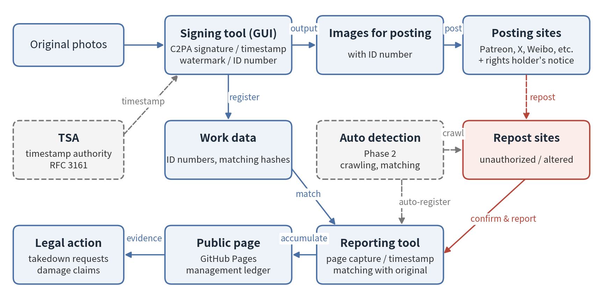
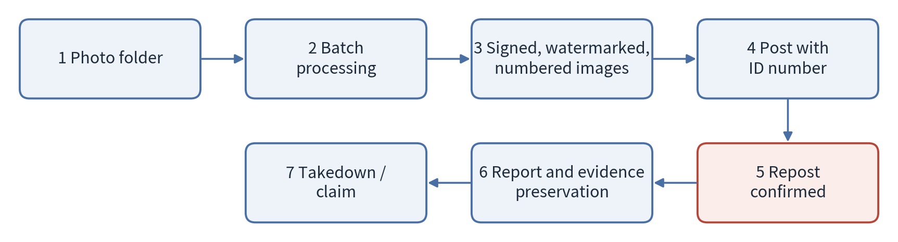

# Anti-Repost Tool for Cosplay Photos: Draft Project Proposal

2026-09-24 · Ishikawa Sou (石川宗)  
Word version: [Anti-Repost Tool for Cosplay Photos - Draft Project Proposal.docx](Anti-Repost%20Tool%20for%20Cosplay%20Photos%20-%20Draft%20Project%20Proposal.docx)

© 2026 Nagareyama Software Development Co., Ltd. (NRSD), Lead Developer: Ishikawa Sou (石川宗)　Copyright in this draft project proposal and in the software developed under this proposal belongs to Nagareyama Software Development Co., Ltd. (NRSD). (The license type is not specified at this time.) However, rights in the third-party standards, algorithms, and software adopted in this proposal belong to their respective rights holders (see Section 14).

---

## 1. Background and Purpose

The purpose of this proposal is to enable authors and subjects of cosplay photographs (hereinafter the “Rights Holders”) to detect, prove, and take legal action against reposting made against the author’s intent and other unlawful reposting, with minimal burden. The tools to be developed will be released free of charge on GitHub within the scope defined by their license.

Cosplay is an activity that requires considerable expense for costumes, wigs, props, international shipping, and the like, and the photographs are both the product of that activity and, in some cases, a source of income for the Rights Holders. Unauthorized reposting, however, is widespread, and not a few reposters regard reposting as mere “sharing.” Because reposters are so numerous, individual Rights Holders are observed to have given up on taking action.

This proposal is intended to reduce the burden of asserting rights, so that even individual Rights Holders can prepare what is needed to assert their rights, and to establish a foundation on which Rights Holders using the same system can act jointly.

## 2. Basic Policy

At present, it is difficult to technically stop reposts made against the author’s intent, or other unlawful reposting, in themselves. As a preliminary step toward that end, this system is intended for detection, proof, and deterrence.

- **Detection**: Mechanically detect images from which a signature or watermark has been removed, or which have been altered.
- **Proof**: Show, in a form verifiable by third parties, that the image is the original first published by the Rights Holder.
- **Deterrence**: By stating rights and the intent to take action in advance, and by posting with an identification number, enable viewers to recognize unauthorized reposts.

Removing a signature or watermark may in itself be unlawful as removal of rights management information [16][19][20]. Accordingly, the signature may also serve as material to establish the intent of the person who removed it.

## 3. Prerequisite for Effectiveness: Notice on Each Posting Site

**The effectiveness of this system is premised on the Rights Holder personally giving notice, on every site where works are posted, of their policy on unauthorized reposting.** Attaching a signature and identification number alone does not indicate to viewers or platforms that the Rights Holder intends to take action.

The notice shall state the following:

- Where the rights lie (copyright and portrait rights)
- That unauthorized reposting and the removal of signatures and watermarks may be unlawful
- That takedown requests and damage claims will be made when unauthorized reposting is confirmed
- The meaning of the identification number and how to confirm that a photograph is genuine
- The work registration number (if obtained)

The notice shall be posted on every site where works are posted, including Patreon, X, Instagram, Weibo, and Xiaohongshu. Without a notice, reposters are left room to claim that they were unaware of the Rights Holder’s wishes or intended only to share. With a notice, reposting becomes an act contrary to the Rights Holder’s express wishes, which is expected to be advantageous in establishing intent and in claims for damages.

## 4. System Overview

Figure 1 shows the system configuration.

Figure 1. System configuration

Each photograph is given information in the following three layers, so that the record of the original can be referenced even if any one layer is removed.

|Layer|Content|Function|
|---|---|---|
|C2PA signature [1][3][4]|A digital signature based on an international standard, recording the creator, date and time, and identification number, with a trusted timestamp under RFC 3161 [8]|Detects alteration at the pixel level. Third parties can verify it on existing public verification sites [15]|
|Invisible watermark|Invisible information embedded in the pixels (open-source implementations such as TrustMark are assumed) [9][10][11]|Allows the record of the original to be referenced from the image even if the signature is removed on social media or elsewhere|
|Matching hashes|Perceptual hashes such as PDQ and image features [12][13]|Allows matching of reposted images that have been recompressed, resized, or cropped|

An identification number is issued for each work and recorded in both the C2PA manifest and the file name. The number in the file name is for the Rights Holder’s reference when posting; even if a platform changes the file name, matching is performed using the manifest and the watermark.

Figure 2 shows the process flow.

Figure 2. Process flow

This processing does not change the appearance of the photographs.

## 5. User Tasks

The tasks to be performed by users are as follows.

|Category|Task|Timing|
|---|---|---|
|Preparation|Drag and drop photographs or a folder onto the tool (execution from the right-click menu shall also be possible)|Each time before posting|
|Posting|Enter the identification number given in the file name in the caption|Each posting|
|Notice|Post a notice stating rights and the intent to take action on the profile of every site where works are posted (prerequisite for the effectiveness of this system; sample texts in English and Chinese will be provided)|Once per site, initially|
|Reporting|When a repost is confirmed, register its URL on the reporting screen|When a repost is confirmed|
|Action|Make takedown requests or damage claims based on the accumulated records|At the Rights Holder’s discretion|

Immediate action is not required upon confirming a repost. Reporting preserves the evidence, and action may be taken collectively at a later date.

## 6. Tool Components

The scope of development by Nagareyama Software Development Co., Ltd. (NRSD) is the signing tool, the reporting tool, and the public page deployed on GitHub, together with the functions linking them.

1. **Signing tool (GUI)**
   - By dragging and dropping photographs or folders, outputs images for posting with a C2PA signature, trusted timestamp, invisible watermark, and identification number.
   - On Windows, registers a “Sign with C2PA and export” item in the Explorer right-click menu.
   - Adds the identification number to the beginning or end of the file name and records the same number in the manifest.
   - Implemented on the basis of c2pa-python [14].
2. **Reporting tool**
   - Provides a screen on which Rights Holders register the URL and image of a confirmed repost.
   - Upon registration, automatically saves the page, applies a trusted timestamp to its hash, and matches it against the original.
3. **Public page (GitHub Pages)**
   - Accumulates reported repost pages and images, each associated with the signer’s work number.
   - Shall function as a management ledger for later legal action.

Registration of reports shall be limited to the signer, and registration by third parties shall not be possible.

## 7. Reporting Reposts and Preserving Evidence

Evidence is automatically preserved upon reporting and given a trusted timestamp, so that it remains a usable record even after the repost page is deleted.

- **Trusted timestamp**: Because git commit dates are self-declared and have no probative value, an RFC 3161 [8] timestamp is obtained for the hash of each saved page, and its certificate is saved together with it.
- **Recording match results**: The watermark is read from the reposted image, and the result of matching it against the original using perceptual hashes is recorded.
- **Country-specific reinforcement of evidence**: In China, the Internet Courts in Hangzhou, Beijing, and Guangzhou accept electronic evidence recorded on blockchains [18], so preservation using a timestamping service within China is considered helpful for local proceedings. In Japan, notarial deeds or evidence-grade recording services may be used.
- **Identifying operators**: For sites in China, the operating entity can be investigated through the ICP registration number [22], which sites are required to display. For sites outside China, the hosting provider is identified through WHOIS and ASN lookups [23], and its abuse contact is notified.

By default, the wording on the public page shall be factual statements such as “Reported by rights holder as unauthorized repost” or “Signature mismatch.”

## 8. Declaration of Rights and Legal Action

Stating rights and the intent to take action in advance, and displaying registration numbers, are prerequisites for deterrence and legal action. None of these requires significant expense.

- **Statement of rights**: State the copyright in the photographs (the portion held or shared under agreement with the photographer) and the portrait rights of the subject. Portrait rights may be asserted by the subject regardless of who took the photograph [17].
- **Statement of legal basis**: Unauthorized reposting may infringe copyright and portrait rights, and removal of a signature or watermark may separately be unlawful as removal of rights management information [16][19][20]. Under Chinese copyright law, punitive damages of not less than one and not more than five times the compensation amount are provided for willful infringement, and the upper limit of statutory damages is 5 million yuan [16]. In the United States, under DMCA Section 1202, statutory damages may in some cases be claimed without proof of actual loss [19].
- **Declaration of intent**: Declare that takedown requests and damage claims will be made when missing or altered signatures, or further distribution, are confirmed. The content of the declaration shall be limited to what can actually be carried out.
- **Display of registration numbers**: Work registration with the Copyright Protection Center of China (中国版权保护中心) may be applied for even after publication, and its registration certificates are widely used in Chinese courts as evidence of ownership. Registration numbers are displayed together with the works [21].
- **Where to file**: Infringement complaint channels of Weibo, Xiaohongshu, Bilibili, and others; DMCA notices to US service providers; and notices to server providers and operators.
- **Joint action**: As the number of Rights Holders using the same system grows, many complaints can be filed against the same reposter or business. China has joint litigation and representative litigation systems, and in Japan, filing numerous small-claims suits may also be an effective means.

Priority shall be given to commercial use, such as merchandising, paid sales, use in advertising, and inclusion in AI training data.

## 9. Operation and Scope of Responsibility

The tools will be published on GitHub, and those wishing to use them shall fork them and operate their own copies at their own responsibility. NRSD bears no responsibility for the results of the operation of any fork.

- **Original version**: Created and published by NRSD. AYA may choose either to join the original version as a project participant or to fork and operate it herself.
- **Fork operation**: The accuracy of the correspondence between signers and reported repost sites shall be ensured by each fork operator.
- **Scope of NRSD’s provision**: The signing tool, the reporting tool, the public page, the functions linking them, and the GUI for obtaining identification numbers. The method of operation shall be at each user’s discretion.

**Scope of legal support**: Any lawsuits concerning the operation of this system will be handled collectively by NRSD’s legal counsel. However, this does not serve to protect users’ rights. Takedown requests and damage claims against unauthorized reposting must be pursued by each user as the Rights Holder.

## 10. Limitations and Notes

This system does not eliminate unauthorized reposting itself, and its effect is limited to photographs posted after the tools are introduced.

- Photographs published before introduction carry no signature or watermark; for these, rights shall be shown through preservation of the original data and work registration.
- With reposters outside Japan, it is expected that the outcome will often be limited to removal. Even in such cases, a record remains that measures to protect the rights were taken.
- For photographs taken by a photographer other than the Rights Holder, ownership of the rights shall be confirmed with the photographer in advance.
- Because the C2PA verification icon may be mistaken for an indication of AI generation, the notice shall explain that it indicates authenticity.

## 11. Implementation Items

NRSD will develop these tools regardless of whether AYA uses them.

- Signing tool: batch processing of C2PA signatures, trusted timestamps, watermarks, and identification numbers, and the GUI
- Right-click menu integration (Windows)
- Reporting tool: URL registration, page saving, trusted timestamps, and matching
- Public page: deployment to GitHub Pages and accumulation of report data
- Sample notice texts (English and Chinese)
- Automatic drafting of complaint texts
- Publication on GitHub and notification to AYA

## 12. Phase 2: Automated Detection Application

As a subsequent plan, an autonomous application shall be developed that crawls the network and automatically detects reposted images and the sites hosting them. While the Phase 1 tools assume reporting after a repost is confirmed, Phase 2 automates detection itself.

- **Crawling**: Regularly crawl image search results and public pages to collect images for matching.
- **Matching**: Match against registered works using watermark readout, perceptual hashes such as PDQ, and image features.
- **Integration**: Automatically register matched images in the Phase 1 reporting tool, through to evidence preservation and trusted timestamps.
- **Items for consideration**: Handling of social networks requiring login and sites with strong anti-scraping measures (such as Weibo and Xiaohongshu), relationship with each site’s terms of service, and crawling load and cost.

## 13. Positioning of This Document and Document Structure

This draft proposal is the initiating document for the design plan, and the documentation is organized in the following order.

1. **Draft project proposal** (this document): concept and basic policy
2. **Design plan**: turns this draft proposal into concrete terms and confirms the development scope and actions
3. **Design document**: overall system architecture and approach
4. **Detailed design document**: implementation specifications for each function

**The design plan shall be issued by Nagareyama Software Development Co., Ltd. (NRSD).**

## 14. Third-Party Rights and Licenses

Rights in the standards, algorithms, and software adopted in this proposal belong to their respective rights holders. NRSD holds rights only in the portions independently developed by NRSD under this proposal; third-party components shall be used in accordance with the licenses or terms of use set by their respective rights holders.

|Component|Rights holder|License / terms of use|Ref.|
|---|---|---|---|
|C2PA Technical Specification|C2PA (Coalition for Content Provenance and Authenticity)|Terms of use set by C2PA|[1]|
|c2pa-python|Content Authenticity Initiative|MIT License and Apache License 2.0|[14]|
|TrustMark|Adobe|MIT License|[9][10]|
|PDQ|Meta Platforms|BSD License (ThreatExchange repository)|[12]|
|RFC 3161, 5280, 8949, 9052|IETF Trust|Terms of use set by the IETF|[3][4][5][8]|
|ISO/IEC 19566-5 (JUMBF)|ISO, IEC|Terms of use set by ISO and IEC|[6]|

Upon release, the license terms and copyright notices of each component shall be bundled with the software, and their compatibility with the license set by NRSD shall be confirmed. Because the terms of use of third-party components may change, the latest terms shall be confirmed in the design plan.

## 15. References (Index of Technical Background and Laws)

The numbers in brackets in the text correspond to the following references.

### Provenance and digital signatures

[1] C2PA, *Content Credentials: C2PA Technical Specification*, Version 2.2. https://spec.c2pa.org/specifications/specifications/2.2/specs/C2PA_Specification.html (Related: Sections 4, 6)

[2] C2PA Technical Working Group, *C2PA Content Credentials Explained: Addressing Common Questions and Updates*, September 2025. https://c2pa.org/wp-content/uploads/sites/33/2025/10/content_credentials_wp_0925.pdf (Related: Section 4)

[3] IETF RFC 5280, *Internet X.509 Public Key Infrastructure Certificate and CRL Profile*. https://www.rfc-editor.org/rfc/rfc5280 (Related: Section 4)

[4] IETF RFC 9052, *CBOR Object Signing and Encryption (COSE): Structures and Process*. https://www.rfc-editor.org/rfc/rfc9052 (Related: Section 4)

[5] IETF RFC 8949, *Concise Binary Object Representation (CBOR)*. https://www.rfc-editor.org/rfc/rfc8949 (Related: Section 4)

[6] ISO/IEC 19566-5, *JPEG Systems — Part 5: JPEG Universal Metadata Box Format (JUMBF)*. (Related: Section 4)

[7] NIST FIPS 180-4, *Secure Hash Standard (SHS)*. https://nvlpubs.nist.gov/nistpubs/FIPS/NIST.FIPS.180-4.pdf (Related: Sections 4, 7)

### Trusted timestamps

[8] IETF RFC 3161, *Internet X.509 Public Key Infrastructure Time-Stamp Protocol (TSP)*. https://www.rfc-editor.org/rfc/rfc3161 (Related: Sections 4, 6, 7)

### Invisible watermarking

[9] T. Bui, S. Agarwal, J. Collomosse, *TrustMark: Universal Watermarking for Arbitrary Resolution Images*, arXiv:2311.18297. https://arxiv.org/abs/2311.18297 (Related: Section 4)

[10] Adobe, TrustMark official implementation (MIT License). https://github.com/adobe/trustmark (Related: Sections 4, 6)

[11] Content Authenticity Initiative, *TrustMark FAQ* (status as a C2PA-approved watermarking method). https://opensource.contentauthenticity.org/docs/trustmark/FAQ (Related: Section 4)

### Matching by perceptual hashing

[12] Meta, *The TMK+PDQF Video-Hashing Algorithm and the PDQ Image Similarity Algorithm* (hashing.pdf). https://github.com/facebook/ThreatExchange/blob/main/hashing/hashing.pdf (Related: Sections 4, 7, 12)

[13] *PDQ & TMK+PDQF – A Test Drive of Facebook’s Perceptual Hashing Algorithms*, arXiv:1912.07745. https://arxiv.org/abs/1912.07745 (Related: Sections 4, 12)

### Implementation and verification

[14] Content Authenticity Initiative, c2pa-python. https://github.com/contentauth/c2pa-python (Related: Section 6)

[15] Content Authenticity Initiative, Content Credentials verification site. https://verify.contentauthenticity.org (Related: Section 4)

### Laws and systems

[16] Copyright Law of the People’s Republic of China (2020 Amendment), Art. 12 (work registration), Art. 51 (rights management information), Art. 54 (damages). WIPO Lex: https://www.wipo.int/wipolex/zh/legislation/details/21065 (Related: Sections 2, 8)

[17] Civil Code of the People’s Republic of China, Arts. 1018 and 1019 (portrait rights). (Related: Section 8)

[18] Provisions of the Supreme People’s Court on Several Issues Concerning the Trial of Cases by Internet Courts (Fa Shi [2018] No. 16), Art. 11. https://www.court.gov.cn/fabu/xiangqing/116981.html (Related: Section 7)

[19] 17 U.S.C. §1202 (integrity of copyright management information), §1203 (civil remedies). https://www.law.cornell.edu/uscode/text/17/1202 , https://www.law.cornell.edu/uscode/text/17/1203 (Related: Sections 2, 8)

[20] Copyright Act of Japan (Act No. 48 of 1970), Art. 2(1)(xxi) (rights management information), Art. 113 (acts deemed infringement). https://laws.e-gov.go.jp/law/345AC0000000048 (Related: Sections 2, 8)

[21] Copyright Protection Center of China (work registration). https://www.ccopyright.com.cn (Related: Section 8)

[22] MIIT ICP/IP Address/Domain Name Filing Management System. https://beian.miit.gov.cn (Related: Section 7)

[23] ICANN Lookup (RDAP/WHOIS). https://lookup.icann.org (Related: Section 7)
