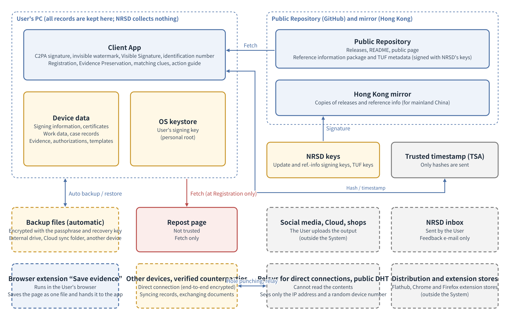
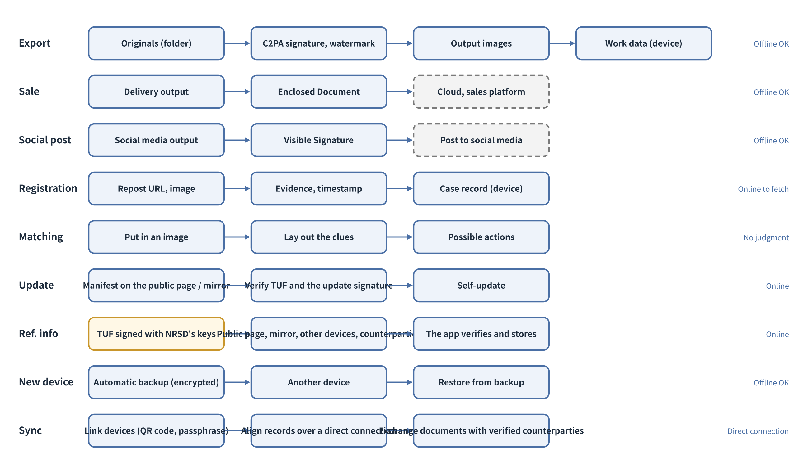
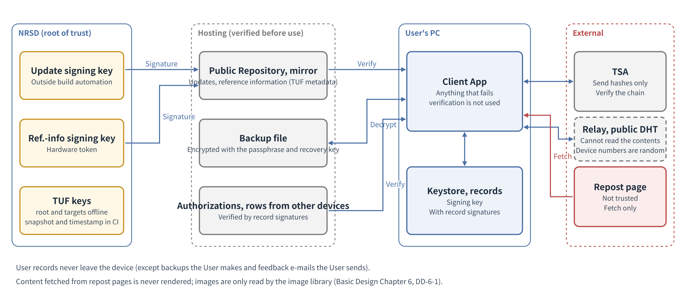

# Basic Design Document Chapter 1: Overall Architecture

Anti-Repost Tool for Cosplay Photos  Edition 1 (Draft)  2026-09-29 · Ishikawa Sou  
Nagareyama Software Development Co., Ltd. (NRSD)  
Word version: [01_Basic Design_Overall Architecture.docx](01_Basic%20Design_Overall%20Architecture.docx)

© 2026 Nagareyama Software Development Co., Ltd. (NRSD), Lead Developer: Ishikawa Sou (石川宗). Copyright in this document belongs to Nagareyama Software Development Co., Ltd. (NRSD). Rights in the third-party standards, software, commentaries on laws, and other materials referred to in this document belong to their respective holders. This is a translation of the Japanese original; where they differ, the Japanese original prevails.

---

## Position of This Document

- Details Chapter 1 of the Outline Design Document. This chapter is the premise for all chapters; the other chapters follow this chapter's structure, data locations, identifiers, trust boundaries, and cross-cutting policies.
- The sections of this chapter follow the 12 sections of arc42, a public template for describing software architecture (goals, constraints, context and scope, solution strategy, building blocks, runtime scenarios, deployment, cross-cutting concepts, decisions, quality requirements, risks, glossary). This chapter is based on the study memo “Chapter 1 Overall Architecture” (NRSD's internal record of study, not distributed with this document; the facts underlying the design are written with their sources in each section of this document).
- The decisions received are as in the following table. The texts of the Design Plan's decisions, items to be investigated, and open items are per Chapter 13, 1.2 “Mapping from Design Plan decisions to the Outline Design Document and basic design” and the destination table of the Outline Design Document (not reproduced in this chapter; only the numbers and the omissions found in the item breakdown are listed).

|Number|Type|Content|
|---|---|---|
|A-6|Omission found in the item breakdown|Preparation against fake apps|
|A-9|Omission found in the item breakdown|Costs, and GitHub capacity limits|
|A-10|Omission found in the item breakdown|Mapping from Design Plan decisions to the design|
|A-14|Omission found in the item breakdown|NRSD's position and the Terms of Use|
|A-17|Omission found in the item breakdown|Cross-border data transfer (the premise disappeared with Edition 2, in which NRSD receives no User information)|

- Notation: “[To be measured]” marks matters confirmed by sending/receiving or by implementation (the assumption and the criterion are written with it). “(initial value)” marks a value set at the start of operation where there is no external figure to base it on.
- Terms are collected in 16 “Glossary”.

## 1. List of Design Decisions

|Number|Decision|Reason|Rejected alternatives|
|---|---|---|---|
|DD-1-1|The System consists of the Client App (including data on the User's device) and the Public Repository (distributions, reference information, public page). NRSD holds keys that sign distributions and reference information|Design Plan D-12-1“The Public Repository is provided. No Private Repository is provided”, D-12-3“Rights Holder Information, the signing key, work data, the ledger, and evidence are kept on the User’s device; NRSD does not collect them”|Keeping records in a private repository (Design Plan Edition 1; this would mean collecting User information)|
|DD-1-2|NRSD runs no always-on servers and has no route for receiving User information (except feedback e-mails Users send themselves; Chapter 10, DD-10-6“Feedback is sent by the User from their own e-mail”, Chapter 12, 5 “Privacy Policy”)|Design Plan D-6-2“The System shall not be built as a website”, D-5-1“The System does not confirm Users and collects no User information. No registration is required in order to use the System”|Placing a server for signing and Registration|
|DD-1-3|Certificates for C2PA signatures are created within the Client App from the information the User enters. No certificate authority is used|Design Plan D-5-2“The certificate for C2PA signatures is created inside the Client App from information entered by the User. No certificate authority is required”. The C2PA technical specification requires no qualification of the certificate issuer|NRSD acting as a certificate authority (a design from the Design Plan Edition 1 stage, which mistook a candidate in the plan for a requirement)|
|DD-1-4|All records (work data, case records, evidence, templates, work sessions, authorizations) are kept on the User's device. Moving devices and preparing for failure are done with backup files the User creates|Design Plan D-10-7“Evidence is stored on the User’s device and not published. The System does not collect evidence”, D-12-3“Rights Holder Information, the signing key, work data, the ledger, and evidence are kept on the User’s device; NRSD does not collect them”|Automatic synchronization (requires an external storage location)|
|DD-1-5|Records requiring integrity (work data, case records and status appends, documents such as authorizations, change history; those held in the chain of 8.3) carry record signatures made with the User's key, and are verified when read|Detects rewriting of records from outside the device (another person touching the device, corrupted files, crafted backup files). Because the record signature is made with the User's own key, the User can rewrite a record and sign it again. What shows third parties (experts, providers) that a record existed at a given time is the trusted timestamp from an external TSA (Chapter 3, 4 “Trusted Timestamps”, Chapter 6, 3.2 “Trusted timestamps”). Work data created offline has no such timestamp until one is added later|Storing without signatures|
|DD-1-6|Reference information (contact points, example texts, references to each country's laws, wording of Enclosed Documents) is placed in the Public Repository and the mirror together with TUF metadata signed with NRSD's keys (Chapter 9, 4.3 “Form of the update manifest (static JSON)”); the app fetches and verifies it|Delivers changes in contact points and laws without waiting for an app update. A route to mainland China (Design Plan I-04“Access to GitHub from mainland China”)|Only embedding it in the app (updates would wait for app updates)|
|DD-1-7|The app can perform C2PA signing, editing, export, and recording of Registrations offline. Timestamps, fetching reference information and updates, and fetching repost pages happen when connected|Work after shooting does not depend on the network|Assuming a permanent connection|
|DD-1-8|The screen (WebView) handles only display and input; text rendering, image processing, file I/O, networking, and key operations all happen in the Rust core. Only permitted commands can be called from the screen|Tauri's security model places a trust boundary between the screen and the core (Tauri's official security guidance). Risks from displaying external text on screen do not reach the core. Rendering in the core gives the same result on all three OSes (Chapter 4, DD-4-5“Text shaping and rendering use the same Rust mechanism for preview and export”)|Processing images on the screen (results differ by OS; weaknesses of the screen reach the records)|
|DD-1-9|All records are saved by writing to a temporary file, flushing it to storage, and then swapping the name|No half-written, broken records remain (quality goal 1)|Overwriting in place|
|DD-1-10|Data is kept in the OS's per-user, non-synchronized location (on Windows, Local AppData). Things that can be regenerated (thumbnails, etc.) go in the OS cache location|Windows Roaming AppData is synchronized on organizational PCs, and several GB of evidence would make it heavy|Placing data in Roaming AppData|
|DD-1-11|Only one instance of the app runs per machine. A second launch brings the first window to the front and exits|Prevents two apps from writing the same record at the same time|Allowing multiple instances with a lock per record (the work-session lock in Chapter 4, 11.7 “Opening at the same time” remains as a supplement to single-instance)|

## 2. Purpose and Quality Goals

### 2.1 Purpose

- The System puts the Rights Holders of cosplay photographs in a position to show their rights in the photographs (C2PA signature, Visible Signature, Enclosed Document), set the Permitted Scope, register reposts and keep evidence, and act when appropriate (Design Plan Chapter 2 “Purpose and Scope”).

### 2.2 Stakeholders

|Party|Relation to the System|Concerns|
|---|---|---|
|Cosplayer (User)|C2PA-signs photographs, sells, posts, and deals with reposts|Little effort, good looks, photographs are not damaged|
|Photographer (User)|Same as above. May hold joint rights with the cosplayer|Credits appear correctly|
|Authorized person (User)|C2PA-signs and posts with the Rights Holder's authorization|The scope of authorization is clear|
|Purchaser (external)|Receives Delivery Images and the Enclosed Document|Knows what is permitted|
|Viewer (external)|Sees posts and tells whether a photograph is genuine|Knows how to check|
|Reposter (counterpart)|Reposts without permission|— (the target of deterrence)|
|Person posing as the Rights Holder (counterpart)|C2PA-signs someone else's photographs first, etc.|— (handled with matching clues; Chapter 2)|
|NRSD (operator)|Builds and distributes the app. Maintains reference information|Protecting keys, keeping costs down, scope of responsibility|
|Legal experts (external)|Receive evidence packages. Check wording|Procedures for verifying evidence|
|Posting sites, Cloud, complaint contact points, distribution and extension stores (Flathub, the Chrome and Firefox extension stores), relays for direct connections and the public DHT (external organizations and infrastructure)|Where images are placed, receivers of complaints, places of distribution, NAT hole punching and relaying, lookup of the peer for passphrase-based connection|—|

### 2.3 Quality goals (in order of priority)

|Order|Goal|ISO/IEC 25010:2023 characteristic|Reason|
|---|---|---|---|
|1|Do not lose or damage Originals and records|Reliability, safety|Photographs are Users' source of income, and evidence is needed for later claims. Once lost, they cannot be recovered|
|2|Non-technical people can use it without getting lost|Usability|If it is not used, deterrence does not work (Design Plan 8.1 “Appearance”)|
|3|Do not collect or leak User information|Security|Design Plan D-5-1“The System does not confirm Users and collects no User information. No registration is required in order to use the System” is the premise of the System|
|4|Output passes third-party verification, and tampering can be detected|Functional suitability|Otherwise the C2PA signature loses its meaning|
|5|Same results on the three OSes|Compatibility, flexibility|Output does not change when Users change devices|

- Performance is met within the range that does not harm the five goals above (14.1).
- When goals conflict, the higher one takes precedence. Example: even if automatic saving (goal 1) increases writes, it takes precedence over speed.

## 3. Constraints

|Type|Constraint|Origin|
|---|---|---|
|Technical|Desktop app for Windows, macOS, and Linux|Design Plan D-6-1“The Client App shall be a desktop application running on Windows, macOS, and Linux”|
|Technical|Not built as a website. No always-on servers|D-6-2“The System shall not be built as a website”, DD-1-2“NRSD has no servers and receives no User information (except feedback e-mails Users send themselves)”|
|Technical|Does not collect User information. Requires no registration|D-5-1“The System does not confirm Users and collects no User information. No registration is required in order to use the System”|
|Technical|Main work can be done offline|DD-1-7“C2PA signing, editing, export, and Registration work offline”|
|Technical|Bundled assets (fonts, models) are under licenses that permit redistribution|Chapter 4, 6 “Fonts and Emoji”, Chapter 11|
|Technical|Supported machines: Windows 10/11 and Linux (glibc 2.35 or later) on CPUs supporting x86-64-v3; macOS 14 or later on Apple CPUs. Intel Macs are not supported|Chapter 11, 3.1 “Minimum supported OS versions” (due to ONNX Runtime support)|
|Organizational|NRSD holds no certificate authority license|NRSD's decision (2026-09-29)|
|Organizational|NRSD is not a lawyer. It makes no legal judgments|Design Plan D-2-6“Representation in legal proceedings and legal judgment are not performed”|
|Organizational|NRSD's development and operations structure is small. As of 2026-09-30, development, design, and operations are all done by one Lead Developer, and there is no commissioned designer (Chapter 10, DD-10-2“Design is done and judged by NRSD's Lead Developer”). Whether to add people is NRSD's decision|—|

## 4. Context and Scope

### 4.1 Components

|Component|Holds|Does not hold|Where it runs|
|---|---|---|---|
|Client App|The User's signing key (OS keystore), certificates, Rights Holder Information (entered values), settings, templates, work sessions, work data, case records, evidence, authorizations, fetched reference information|Other Users' data|The User's PC (Windows, macOS, Linux)|
|Public Repository|Source, releases (distributions), README, public page, reference information package and TUF metadata (Chapter 9, 4.3 “Form of the update manifest (static JSON)”)|Personal information, per-User information|GitHub (public)|
|Hong Kong mirror|Copies of the Public Repository's releases and reference information|Personal information|Object storage (static delivery only)|
|Operator tool|Editing reference information, signing distributions|User information|M-01“Reference Information” runs on NRSD's management PC (network-connected; the reference-information signing key is on a hardware token). M-02“Release Signing” runs on the operator's offline PC (update signing key)|
|Browser extension “Save evidence”|None (it only reads the page; it holds neither settings nor records. Chapter 6, 2.2.2 “Guidance on taking screenshots”)|User information. Sending to sites|The User's browser (Chromium family, Firefox). Installed from the public extension stores (Chapter 9, 2 “Installation”) (NRSD's request, 2026-09-30)|
|NRSD's keys|Update signing key, reference-information signing key (two hardware tokens), TUF keys (root: two keys, and targets, offline; snapshot and timestamp in the CI environment `tuf-online`. Chapter 9, 4.3 “Form of the update manifest (static JSON)”)|User information|The operator's offline PC (update signing key, TUF root and targets), hardware tokens (reference-information signing key; the second root key), the CI environment `tuf-online` (snapshot and timestamp)|

Figure 1-1 Components and connections

- Outside the boundary: Phase 2 (automated detection, including registration of contact details for notifying authors; Design Plan D-13-3“Registration of contact details for notifying authors is dealt with in the Phase 2 design plan”), sales management, rights in source works (Outline Design Document “What the System protects and does not protect”), legal judgment and representation (Chapter 7 “Legal Action Guidance”), collection of User information, and matching or judging on others' behalf (Design Plan D-5-5“The System provides the means of matching but does not perform matching on anyone’s behalf”).

### 4.2 Communication with the outside

- The app itself communicates outside the device only with the parties in the following table. The app sends nothing not in the table (quality goal 3). Transmissions by the OS and screen components—such as mandatory diagnostic data that WebView2 (Windows) sends to Microsoft, and SmartScreen and Gatekeeper checks by the OS—follow each company's policy (Microsoft “WebView2 data and privacy”). The Privacy Policy states this (Chapter 12, 5.2 “List of what is sent outside the device”).

|Party|Method|What is sent|What is received|Timeouts and limits (initial values)|On failure|
|---|---|---|---|---|---|
|Public Repository (GitHub)|HTTPS GET (the request header User-Agent is `c2pa4cosplayer/<version>`; fetching by the update component is per Chapter 9, 4.1)|Fetch requests only|Update manifest (JSON), TUF metadata (`tuf/`), distributables, reference information package|Connect 10 s. Manifest: 120 s total, up to 1 MB; reference information: 120 s total, up to 16 MB in total (Chapter 8, 3.4). Distributables: 30 min total (initial value; so that they can still be fetched over a slow line through the mirror from mainland China), up to 500 MB|Try the mirror. If both fail, retry per the common handling at the end of 4.2 (detection of line recovery and hourly)|
|Hong Kong mirror|HTTPS GET|Same as above|Same as above|Same as above|—|
|Timestamp authority (TSA)|HTTP or HTTPS POST (RFC 3161)|Hash only (timestamp request)|Timestamp response|Connect 10 s, total 30 s, response up to 1 MB|Try the next TSA (Chapter 3, 4 “Trusted Timestamps”). If all fail, hold and attach when connected|
|RDAP|HTTPS GET|Domain name or IP address being looked up|Registration information (JSON)|Connect 10 s, total 30 s, response up to 1 MB|Record as no result, and show how to look it up by hand|
|DNS|Queries A, AAAA, and PTR records with the app's own resolver (hickory-resolver) against the DNS servers configured in the OS (the OS resolver does not return the raw response, so it could not be kept as evidence; Chapter 6, 5 “Who and Where (④)”)|Domain name or IP address being looked up|IP address, reverse-lookup name|Connect 5 s, total 10 s|Record as no result, and show how to look it up by hand|
|Repost page|HTTP or HTTPS GET (only URLs the User registered; only at Registration (default; the User can turn it off for that Registration) and when “Check the current status” is pressed)|Fetch request (the User's IP address is visible to the other party. The System does not identify itself; the request headers User-Agent and Accept-Language match the values of the app's screen component (WebView), and Cookie and Referer are not sent. Chapter 6, DD-6-8“Fetch requests do not identify the System”)|The page's HTML and images|Connect 10 s, total 60 s, up to 50 MB per page, up to 5 redirects|Record that it could not be fetched, and supplement with the User's screen images (Chapter 6)|
|The User's own other devices (same personal root)|Direct connection called by public key (QUIC; iroh; the same mechanism as Syncthing and Delta Chat). A public relay punches the NAT hole, and once connected the communication is direct and end-to-end encrypted. Within the same network no relay is used|Record rows (chains), evidence and asset files, templates, work sessions, device-independent settings, reference information package|Same|Connect 10 s|Continue at the next connection (Chapter 8, 5.4 “Device-to-device synchronization”) (NRSD's request, 2026-09-30)|
|Devices of “confirmed” contacts (Chapter 2, 5.5 “Adding contacts (handover of documents)”)|Same as above|Authorizations, revocations, joint-rights documents, and renewal documents (with record signatures); the reference information package and its version. The User's records are not sent|Same|Same as above|While undeliverable, pass by file (Chapter 2, 5.5 “Adding contacts (handover of documents)”) (NRSD's request, 2026-09-30)|
|Relays for direct connections (public infrastructure; iroh relays)|Assistance with QUIC hole punching, and relaying when a direct connection cannot be made|End-to-end encrypted content (the relay cannot read it). The relay sees only IP addresses and random device numbers|—|—|If the relay is unreachable, the same format works over, in order, a direct connection within the same network, the Cloud sync folder, and files (Chapter 8, 5.4 “Device-to-device synchronization”) (NRSD's request, 2026-09-30)|
|Public DHT (pkarr; BEP 44 signed records)|Publishes and looks up the device's own device number, with a 10-minute expiry, under a key derived from the passphrase (only for passphrase-based connection in Chapter 8, 5.4 “Device-to-device synchronization”)|Device number (signed record)|The peer's device number|Connect 10 s, total 30 s|Show “Cannot connect with the passphrase” and guide to handover by QR code or file|
|E-mail software|Pass a mailto URL to the OS|Feedback text (after the User checks it)|—|—|Allow copying the text and address (Chapter 10, 9 “Feedback Channel”)|
|OS keystore|OS API|Storing and retrieving signing keys|—|—|Chapter 2, 7 “Signing Keys”|

- The System does not communicate directly with posting sites, Cloud, or complaint contact points. Contact points are opened in the OS default browser when the User presses a button.
- Fetching a repost page shows the User's IP address to the other site. This is shown once before fetching (threat in 11.2).
- Common handling: follow the OS proxy settings (Windows WinHTTP, macOS system settings, Linux environment variables) (assuming Users use VPNs or proxies; Chapter 6, 2.2 “Fetching without running scripts”). The TLS trust anchors are the OS verifier (rustls-platform-verifier). Failed fetches of reference information and updates are retried up to 3 times at 1 s, 4 s, and 16 s (with jitter; AWS exponential backoff), and after that continue on line recovery (changes in the OS network state: macOS `NWPathMonitor`, Windows `INetworkListManager` events, Linux NetworkManager's D-Bus `StateChanged`) and with hourly retries. All held processing (attaching timestamps later, fetching reference information and updates, reconciling between devices, backups) resumes through this single queue (“at each connection” means this line-recovery event). Timestamps are not retried but move on to the next TSA; fetching a repost page is retried once. Redirects are followed up to 5 times within the same origin, and TSA POSTs do not follow redirects. Responses are written while streaming and cut off the moment they exceed the limit (the whole is never held in memory). Metered and data-saver connections are detected with OS APIs (Windows `GetConnectionCost`, macOS `NWPath.isExpensive` and `isConstrained`, Linux NetworkManager's `connection.metered`; the same as Windows Update and Chrome).
- Order of sources (common to reference information and the update manifest): the public page, then the Hong Kong mirror. A source that failed, or whose fetched content did not pass verification, is moved to the back, and the next check uses that order (the number of failures is counted).
- Threat T-16 (denial of service): huge responses, repeated redirects, and delayed responses from repost pages. Attacker: malicious sites. Target asset: app core. Remaining gap: —

## 5. Solution Strategy

|Quality goal|Strategy|This chapter / other chapters|
|---|---|---|
|1 Do not lose or damage|Originals are read only. Records are swapped in from temporary files. Work sessions are saved automatically. Backup files (encrypted) are recommended|DD-1-9“Records are written fully to a temporary file and then swapped in”, Chapter 4, 11 “Work Sessions (the State in the Middle of Editing)”, Chapter 8, 5 “Backup Files”|
|2 Easy to use without getting lost|One window, step indicators, a guide character, an error pattern. GitHub is not shown|Chapter 10|
|3 Do not collect or leak|No servers. Outgoing transmissions limited to the table in 4.2. Records kept only on the device. No secrets written to logs|DD-1-2“NRSD has no servers and receives no User information (except feedback e-mails Users send themselves)”, 10.4|
|4 Pass verification|Components following the C2PA specification (c2pa-rs), timestamps, record signatures|Chapter 3, DD-1-5“Device records carry record signatures and are verified”|
|5 Same results|Rendering, color conversion, and export use the same Rust components. OS fonts are not used|DD-1-8“The screen handles only display and input; processing happens in the Rust core”, Chapter 4|

## 6. Contents of the Components

### 6.1 App layers

|Layer|Parts|Responsibility|Not responsible for|
|---|---|---|---|
|Screen|WebView (HTML, CSS, TypeScript)|Display and input. Progress display|Text rendering, image processing, file, network, and key operations|
|Command|Tauri commands|Receives requests from the screen, validates input (10.6), passes them to business components. Long tasks send progress notifications to the screen|Business decisions|
|Business|Signing information, export (signing), editing (rendering), work sessions, Rights Documents, Registration and evidence, matching, reference information, updates, backups, settings|The functions of each chapter|How records are written, network details|
|Foundation|Storage, keystore, networking, image I/O, model execution, timestamps, logs|Cross-cutting functions (10)|Business decisions|

- The mapping to parts (crates) is in Chapter 11, 7.1 “How the Rust components are divided”.

### 6.2 Between the screen and the core

- The screen can call only permitted commands (allowed per window with Tauri capabilities and permissions). File access is limited to the app's data location and files and folders the User chooses each time (Tauri scopes).
- The screen is barred from loading external resources (CSP loads nothing but the app's own resources). External URLs open in the OS default browser when the User presses them.
- Text from outside (repost page titles, file names, template names, reference information text) is displayed only as text and never interpreted as HTML.
- Long tasks (export, Registration, auto-placement, backups) run in background tasks in the core and send progress notifications (which item, estimated remaining time) to the screen. Cancellation from the screen is accepted.
- Permissions for the commands callable from the screen and for the Tauri plugins used (file selection; opening the default browser, mailto, and the log location; OS notifications. Chapter 11, 4.1 “Rust components”) are kept to the minimum per window and per command, and their list is placed in the developer-side documents and checked against the configuration in CI (Chapter 11, 8.1 “On every change”). The boundaries of all blocks (command names, types passed in, types returned, normal-case events that can occur) are defined before implementation in a single “boundary list” document, from which the screen and core types are generated. Changes to a boundary go through a revision of this document (NRSD's request, 2026-09-30).
- The only values passed from the screen to the core at start are three: the WebView's User-Agent, Accept-Language, and the screen language. From the core to the screen, besides the return values of commands, notifications are sent (progress, notices, save state, update ready, start-up prompt, dropped files, events from counterpart devices).
- Threat T-17 (elevation of privilege): external text displayed on screen triggering screen commands. Attacker: a party planting external text. Target asset: screen, core. Remaining gap: —
- Threat T-18 (elevation of privilege): calling commands from the screen that read or write arbitrary files. Attacker: a party who hijacked the screen. Target asset: files on the device. Remaining gap: —

## 7. Runtime Scenarios

- The normal procedure of each scenario and the handling on failure are shown. Details are in each chapter; this chapter shows the order across chapters.
- Start-up order: serially, before showing the screen: CPU check (Chapter 11, 3.1) → single instance (9.3) → if `state/update-pending` exists, swap in the verified distributable (Chapter 9, 4.1) → the in-use mark in `state/` and how the previous run ended (7.8) → settings and the consent record (Chapter 12, 4.3) → migration of record formats (Chapter 9, 4.4) → whether signing information exists (7.1) → screen. After the screen is shown, in the background, in order of priority: cleanup after an abnormal exit → verification from the chain heads → pending timestamps (7.9) → fetching the update manifest and reference information (7.5, 7.6; skipped if done within 24 hours) → checking Originals (Chapter 2, 4.2) → retention sweep (8.4) → automatic backup (Chapter 8, 5.5) → device reconciliation (Chapter 8, 5.4) → deadline notices (Chapter 7, 6.3; those missed while not running, and daily while running) and renewal proposals for authorizations (Chapter 2, 5.1). Background jobs do not run concurrently with each other (a single queue). The 10-second target of 14.1 means “until the screen appears and can be operated” and excludes background jobs (the same division as the start-up of Firefox and VS Code).
- The app has eight states: before first run (7.1 not completed), verify only (using only G-13 without signing information), no consent (Chapter 12, DD-12-3), normal, over 20 years (Chapter 2, 3.4), below the minimum version (Chapter 9, 4.2), migration failed (read-only; Chapter 9, 4.4), and successor (read-only; Chapter 8, 5.3). The screen decides which screens can be opened in each state (Chapter 10, 3.2).

Figure 1-2 Data flows

### 7.1 First run

|Order|Processing|On failure|
|---|---|---|
|1|Choose the language from the OS language (Japanese, Chinese, English; others fall back to English)|—|
|2|Display of and consent to the Terms of Use and Privacy Policy (Chapter 10, G-02“Consent”). The Terms apply to NRSD's service (provision of reference information)|If the User does not consent, reference information is not fetched (only the bundled package is used). C2PA signing, editing, export, Registration, verification, viewing and extracting records, and updates remain available (Chapter 12, DD-12-3“Consent gates only the fetching of reference information”)|
|3|Entering signing information, creating the personal root and the signing certificate, and storing keys (Chapter 2, 2 “Input of Information for C2PA Signatures”)|If the keystore cannot be written, show the reason and do not proceed (signing is impossible without a key)|
|4|Showing the notice code and example texts (G-04“Posting the Notice”)|—|
|5|Detect and propose backup locations (external storage, the User's Cloud sync folder, another device of the same person) and decide on one or more. Hand over the printout of the recovery key (Chapter 10, G-05“Create Backup”). Subsequent backups are automatic (Chapter 8, 5.5 “Backup locations and automatic backups”) (NRSD's request, 2026-09-30)|Proceed without deciding (notify when there has been no location for 7 days)|

### 7.2 Batch export

|Order|Processing|On failure|
|---|---|---|
|1|Choose photos and purpose. Create a work session (Chapter 4, 11 “Work Sessions (the State in the Middle of Editing)”)|Mark unreadable photos and set them aside|
|2|Thumbnails and auto-placement (Chapter 4, 7.2 “Auto-placement”)|—|
|3|Adjustment (Chapter 4, 9 “Editing Operations”). The work session is saved automatically|If saving fails, notify|
|4|Permitted Scope (delivery. Chapter 5)|—|
|5|Export: for each photo, write the output under a temporary name in the processing order (Chapter 3, 8 “Processing Order and Streams”), record the work data, and fix the output name (by this order, no output without a record remains under its final name)|A failure of one photo is listed and the others continue. If stopped midway, what was exported is recorded and export can continue from there|
|6|Timestamps (when there is no connection, hold and attach when connected)|If no TSA responds, hold|

### 7.3 Registering a repost

|Order|Processing|On failure|
|---|---|---|
|1|Enter the URL, the reposted image, and screen images (Chapter 6)|—|
|2|Matching (watermark, hash)|If unreadable, record “cannot be matched”|
|3|Fetch the repost page (done by default at every Registration. The Registration screen shows that the IP address is visible to the other site, and the User can turn it off for that Registration. Chapter 6, 2.1 “Procedure”)|If it cannot be fetched, record that and supplement with screen images|
|4|RDAP and DNS lookups|Record as no result|
|5|Create the case record, record signature, and timestamp of the evidence package|If stopped midway, continue from the state of each step (7.8)|

### 7.4 Matching (when a person posing as the Rights Holder appears)

|Order|Processing|On failure|
|---|---|---|
|1|Put in the image (Chapter 10, G-13“Verify”)|—|
|2|Verify the C2PA signature, read the watermark, compute the matching hash|Show unreadable items as “none”|
|3|Lay out the clues (Chapter 2, 4.4 “Clues when a person posing as the Rights Holder appears”). No judgment|—|

### 7.5 Fetching reference information

|Order|Processing|On failure|
|---|---|---|
|1|At start and every 24 hours (initial value), check the version of the reference information with `reference/latest.json` on the public page (Chapter 8, 3.1 “Structure”). raw.githubusercontent.com is not used (there are reports of blocking and DNS poisoning in mainland China; Research Materials “GitHub and Distribution”). The order of sources follows 4.2 “Communication with the outside”|Try the mirror|
|2|If there is a new version, fetch it and verify the package (the table in Chapter 8, 3.4 “Reference information package”)|If verification fails, do not use it and keep using the local version. A local version past its expiry is kept in use with a notice|
|3|Replace the local version (by the procedure of DD-1-9“Records are written fully to a temporary file and then swapped in”)|—|

- The sources (five) and verification independent of the source follow Chapter 8, 3.4 “Reference information package”.
- Threat T-12 (repudiation): NRSD later denying the content of reference information it distributed. Attacker: NRSD. Target asset: the basis of the User's complaint. Remaining gap: —

### 7.6 Updates

- Follow Chapter 9, 4 “Updates”. Verify both the TUF metadata (Chapter 9, 4.3 “Form of the update manifest (static JSON)”) and the update signature; if either fails, do not apply.

### 7.7 Creating and restoring backups

- Follow Chapter 8, 5 “Backup Files”. The backup file is created under a temporary name and renamed once complete.

### 7.8 Starting after an abnormal exit

|Order|Processing|
|---|---|
|1|At start, check the in-use marker (`state/running` in Chapter 8, 2.1 “Arrangement”). If the previous session was not closed properly, do the following|
|2|Work sessions: confirm they open at the last saved version, and show “Continue from where you left off” (Chapter 4, 11.5 “After abnormal termination”)|
|3|Export: clean up outputs left under temporary names (Chapter 3, 9 “Batch Processing”)|
|4|Registration: continue case records from the step last recorded|
|5|Verify record signatures and report those that do not match|

### 7.9 Offline export and later timestamps

- Export without a timestamp and record “awaiting timestamp” in the work data. When connected, obtain a timestamp for the output's SHA-256 and attach it to the work data (Chapter 3, DD-3-5“Timestamps are taken at C2PA signing, or later when offline”). Home shows the number waiting.

## 8. Data

### 8.1 List of data

- The source, storage location, scope of publication, writer, integrity protection, and backup handling of all data are set in the single table of Chapter 8, 2.1 “Arrangement” (not reproduced in this chapter).

### 8.2 Identifier scheme

|Identifier|Format|Issued by|Uniqueness|
|---|---|---|---|
|Identification number|A 61-bit random number. Placed as-is in the invisible watermark (the data part of TrustMark BCH_5). For display, the 61-bit value is placed in the upper bits and its 4-bit check (CRC-4 with generator polynomial x^4＋x＋1; CRC-4/G-704: initial value 0, no reflection of input or output, most significant bit first) in the lower bits, and the resulting 65 bits are converted 5 bits at a time from the top into 13 Crockford Base32 characters, split 5-5-3 (example: value 0x1604F408204C92C5, check 4 gives `P0KT0-G82CJ-B2M`). Each value has exactly one notation, and a notation whose 4-bit check does not match is invalid and shown as “the identification number may have been mistyped”|App (at export)|See the note below|
|Notice code|Per Chapter 2, 2.4 “How the notice code is made” (`NRSD-` and 20 Crockford Base32 characters; 28 characters)|App (at first input)|With 100 bits, accidental collisions can be ignored|
|Case number|`C` followed by a UUID v7|App|Collisions can be ignored|
|Work session, template, and batch numbers|UUID v7|App|Collisions can be ignored|
|Error number|Category (3 letters) and 3-digit sequence (example: `SIG-012`)|Design (10.3)|—|
|Device number|The first 40 bits of the SHA-256 of the public key (Ed25519) of the device for direct connections, as 8 Crockford Base32 characters. Used in the `device` of record rows, the file names of per-device chains, and the display of the device list|App (at first start; Chapter 2, 7.1 “Generation and storage”)|40 bits. No collision among one person's devices (up to 5)|

- One identification number is issued per work (one exported file). If the same photograph is exported for X, for Instagram, and for delivery, each gets a different identification number, and that they are the same photograph is known from the Original's SHA-256 in the work data. The same identification number is recorded in the invisible watermark, the C2PA manifest, the file name (if the User chooses to append it), the Visible Signature (if the placeholder is used), the work data, and case records. It is the “identification number” of Design Plan 1.5 “Definitions”, and the Draft Project Proposal's “matching number” (a number attached to posts so viewers can identify unauthorized reposts; Sections 2 and 3) and “work number” (a number that links reported reposts to works; Section 6) are the same value.
- Uniqueness: the probability that two 61-bit random numbers collide is about 1 in 50,000 even with 10 million works (n²/2⁶²: 10¹⁴ ÷ 4.6×10¹⁸). At issuance, it is checked against the local work data. Collisions with other Users are not checked because there is no central ledger. In matching, works are distinguished by the pair of identification number and signer.
- Shortening the display to some upper bits would break uniqueness (with 40 bits, 500,000 works collide with about a 10% probability). Because viewers use it as the matching number, it is not shortened.
- A work registration number (the number of a public registration) is not issued by the System; it is treated as a string the User writes in the Notice or the Visible Signature.

### 8.3 Formats and versions

- Records are JSON (RFC 8259; UTF-8, keys in English letters). Each record has a `schema` (for example, work data `nrsd.work/1`, work sessions `nrsd.session/1`). Formats are defined in JSON Schema, draft 2020-12. UUID v7 numbers follow RFC 9562 (May 2024) (NRSD's request, 2026-10-01).
- When a version is raised, the app keeps code that reads the old version and migrates records to the new version at the first start after the app update. A copy of records before migration is kept by the procedure of Chapter 9, 4.4 “Record format migration”.
- When the app reads a record of a newer version than itself, it only reads it without rewriting, and prompts an update.
- Record signatures are made over the JSON normalized with JCS (RFC 8785) with ECDSA P-256 using the signing certificate's key, and placed in the `sig` of each row of the chain (`x5c` carries the signing certificate and the personal root certificate; Chapter 2, DD-2-10“Record signatures use the signing certificate's key with the certificate chain attached”). The `.sig` alongside the chain file is the head record (the `seq` of the last row, the SHA-256 of that row's stored bytes, and a signature of the same form over them), and detects truncation of trailing rows (like a git ref pointing at the head). The `.sig` is rewritten each time a row is appended (the procedure of 10.2). However, authorizations, revocations, and joint-rights documents are exchanged as a single file, so their signatures are placed in `signatures` within the JSON (Chapter 2, 5.3 “Document format”).
- The formats of all records (work data, case records, status appends, work sessions, templates, authorizations, backup manifests, each file of the reference information, settings, change history, past personal roots, the update manifest, and the Enclosed Document JSON) are defined in JSON Schema before implementation and validated at every read and write. Each format version has its own validator and migration. The schemas and test vectors are published on the public page so that third parties (experts) can verify an evidence package without the System (NRSD's request, 2026-09-30). JCS normalization is implemented twice (the component in Chapter 11, 4.1 “Rust components” and a minimal in-house implementation), and CI checks that their outputs agree and that all RFC 8785 test vectors pass (Chapter 11, 8.1 “On every change”).
- List of record formats (`schema` names. The JSON Schema is one file per record in `dev/schemas/<name>.<version>.json`, with `$id` `https://c2pa4cosplayer.nrsd.jp/schema/<name>/<version>`): `nrsd.work/1` (work data), `nrsd.session/1` (work sessions), `nrsd.template/2`, `nrsd.case/1` (case records), `nrsd.status/1` (status appends), `nrsd.grant/1` (authorizations, revocations, joint-rights documents), `nrsd.backup/1` (backup manifest), `nrsd.reference/1` (manifest of the reference information package), `nrsd.settings/1`, `nrsd.history/1` (`identity/history/<device number>.jsonl`), `nrsd.past_root/1`, `nrsd.consent/1`, `nrsd.peers/1`, `nrsd.identity_draft/1`, `nrsd.epoch/1`, `nrsd.chain_heads/1`, `nrsd.export_queue/1`, `nrsd.ers/1` (`state/ers.json`), `nrsd.fetch_state/1`, `nrsd.clock/1` (`state/clock.json`), `nrsd.work_index/1` (`works/index.json`), `nrsd.session_photo/1` (`sessions/*/photos/<number>.json`), `nrsd.session_snapshot/1`, `nrsd.template_local/1` (`templates/*/local.json`), `nrsd.update_manifest/1`, and each file of the reference information (`nrsd.ref.<file name>/1`: `platforms`, `notices`, `terms`, `tsa`, `relays`, `deadlines`, `holidays`, `laws`, `minimum_version`, `vex`, `clearurls`). `history.log` (Chapter 4, 11.3) is one JSON Patch per line per step, in the form of the elements of `history` of `nrsd.session/1`. Deadlines (VTODO) are `.ics`, not JSON. The list is held by core-store (Chapter 11, 7.1), which validates on every read and write.
- A record signature is held per row (one work, one status append, one authorization), and each row includes the hash of the previous row, forming a chain (proof of order and of no gaps). There is one chain per writing device (a chain is always written by exactly one device; the same as Kafka partitions and Syncthing's per-device index); rows of other devices are received as copies through synchronization and shown ordered by clock and monotonic number. A row has the form `prev` (the SHA-256 of the previous row's stored bytes; 64 `0`s for the first row), `seq`, `device` (device number; 8.2), `clock`, body, and `sig`. A corrupted row is moved to `<stream>/quarantine/`, and subsequent rows remain readable with a “chain broken” mark (as git fsck reports a corrupt object and the rest remains readable). Only the corrupted row is quarantined; the others are used, and only that row is restored from a backup. The heads of all record chains are timestamped once a day and at each connection (Chapter 3, 4 “Trusted Timestamps”). Verification at start proceeds from the chain heads (Chapter 8, 4 “Integrity”). Each record holds separately the device clock value, the clock skew at that time, the monotonic number (per-device sequence), and the timestamp (if any) (10.7) (NRSD's request, 2026-09-30).
- Reconciling rows that arrive from another device or a backup (called from Chapter 8, 5.3 “How it is restored (import)” and 5.4 “Device-to-device synchronization”): within the same stream, rows with the same `device` and `seq` are one row (if their contents differ, both are kept and the difference is shown; this does not normally happen). Status appends are ordered per case, and the change history across devices, in time order. Evidence and asset files are matched by their SHA-256 names (identical ones are one). Documents such as authorizations are matched by number.
- The form of record signatures is JWS (RFC 7515) detached: the payload is the JSON normalized with JCS, and the protected header holds `alg: ES256`, `x5c` (the signing certificate and the personal root certificate), and the JAdES (ETSI TS 119 182-1) `sigT` (time of signing). Chain rows, the `signatures` of authorizations, and WACZ signatures all use this same form (the reference information package is signed with NRSD's TUF metadata and does not use JWS; Chapter 8, 3.4 “Reference information package”). Experts can verify with ordinary JWS tools. Long-term validity is the role of ERS (Chapter 3, 4 “Trusted Timestamps”) (NRSD's request, 2026-10-01).

### 8.4 Retention and deletion

- All records are on the User's device and are kept unless the User deletes them. The app deletes only the following automatically: operation logs (90 days; initial value), crash reports (deleted when the User chooses to send or not to send; unchosen ones are kept up to 10 reports or 30 days, as in Mozilla's Crash Reporter), imported assets no longer used (`assets/`; those referenced by no template or work session are deleted at backup consolidation), thumbnails (when a work session is deleted, and the oldest when the cache exceeds 1 GB; Chapter 8, 6.1 “Guide to device capacity”), versions of work session backups beyond 5 (Chapter 4, 11.4 “Version backups”), temporary files left after an abnormal exit (7.8), and copies from record format migration (30 days; Chapter 9, 4.4 “Record format migration”). The User's records (work data, case records, evidence, templates, authorizations) are never deleted automatically.
- Before deleting case records or evidence, the limitation period for damages claims (in Japan and China, 3 years from knowledge and 20 years from the act; in the US, 3 years from accrual; Legal Research L-20“Limitation periods for damages claims (Japan, China, US)”) is shown and exporting is recommended.
- NRSD holds no User data, so no retention or deletion policy arises on NRSD's side.

### 8.5 List of secrets

- The location of each secret and the handling when it leaks are written as a “Secret:” bullet in the section that holds the secret (not reproduced in this section; the list of R-1-2-3 is collected by grep): the User's signing key (Chapter 2, 7.2 “Loss and leaks”), the backup passphrase (Chapter 8, 5.2 “How it is made”), the device key (Chapter 2, 7.2 “Loss and leaks”), paid TSA accounts (Chapter 6, 3.2 “Trusted timestamps”), the reference-information signing key (Chapter 8, 3.4 “Reference information package”), the update signing key (Chapter 9, 3.2 “How to tell”), code-signing and notarization credentials (Chapter 11, 8.3 “Handling of secrets”), the mirror key (Chapter 8, 3.6 “Operation of the Hong Kong mirror”), the GitHub and each provider's accounts (Chapter 8, 3.5 “Protection of the GitHub account and repository”), and the TUF keys (Chapter 9, 4.3 “Form of the update manifest (static JSON)”).

### 8.6 Multilingual file names and characters

- File names are handled in UTF-8 (normalized to NFC). Characters the OS does not allow (on Windows `\ / : * ? " < > |`, etc.) are replaced with `_`.
- Files and folders the app creates within its data location are named with alphanumerics (numbers), and names the User entered are kept inside the JSON. Export output names (using the shoot name and original file name) follow Chapter 3, 10.1 “Names and structure”.
- Output names follow Chapter 3, 10.1 “Names and structure” (delivery uses portable ASCII names; social media names are corrected automatically by the desk check before export) (NRSD's request, 2026-09-30).

## 9. Deployment

### 9.1 Locations per OS

|What is placed|Location (Tauri name)|Windows|macOS|Linux|
|---|---|---|---|---|
|Records, work sessions, evidence, templates, imported assets, settings, fetched reference information|app_local_data_dir|The app's folder under Local AppData|Under ~/Library/Application Support|Under $XDG_DATA_HOME (or ~/.local/share)|
|Thumbnails and other regenerable items|app_cache_dir|Under Local AppData|Under ~/Library/Caches|Under $XDG_CACHE_HOME (or ~/.cache)|
|Operation log|app_log_dir|logs under Local AppData|Under ~/Library/Logs|logs under local_data_dir|
|Signing key|OS keystore|Credential Manager/DPAPI|Keychain|Secret Service (if absent, a key file encrypted with a passphrase under app_local_data_dir; Chapter 2, 7.5 “Storage method per OS”)|

- Source: Tauri's PathResolver documentation.
- Roaming AppData (the Windows location of app_data_dir) is not used (DD-1-10“Data is kept in a per-user location that is not synchronized”).
- The layout within these locations is set in Chapter 8, 2.1 “Arrangement”.
- App identifier: the Tauri identifier (the macOS bundle id) is `jp.nrsd.c2pa4cosplayer`, the product name is `c2pa4cosplayer`, the URL scheme registered with the OS is `c2pa4cosplayer://` (10.10), and the Windows location is `%LOCALAPPDATA%\jp.nrsd.c2pa4cosplayer`. The `<identifier>` of Chapter 8, 2.1 is this value.

### 9.2 Installation

- One distribution per OS (Chapter 9, DD-9-1“One distribution per OS, code-signed”). It is a per-user installation that does not require administrator rights.

### 9.3 Single instance

- Only one instance runs per machine (DD-1-11“Only one instance of the app runs per machine”). Tauri's single-instance plugin (tauri-plugin-single-instance; supports Windows, macOS, and Linux, using DBus on Linux; a second launch notifies the first and exits; the plugin must be registered first) is used. Source: Tauri's official guide (v2.tauri.app/plugin/single-instance).
- If photos or folders are passed to the second launch (such as by dropping files on the window), the first instance receives them.

## 10. Cross-cutting Concepts

### 10.1 Data model

- The entities, what they hold, and their relations follow the table in Chapter 8, 2.1 “Arrangement” and the record items of each chapter (Chapter 3, 7.2 “Work data fields (decision on O-10“Recording format of work data”)”; Chapter 6, 2.4 “Fields of registration data”; Chapter 4, 15 “Data Formats”; Chapter 2, 5.3 “Document format”) (not reproduced in this chapter).

### 10.2 Storage

- All records and output files are written by the procedure of DD-1-9“Records are written fully to a temporary file and then swapped in” (no half-written, broken file is left):

  1. Write under a temporary name in the same folder as the destination. The temporary name is `~$<final name>.tmp` (files beginning with `~$` are not synced by Dropbox or OneDrive, and `.tmp` is not synced by OneDrive: each company's guidance on “files that are not synced”, 2026-10-01. Google Drive has no explicit statement, so for exports into a sync folder one line is shown in G-08: “until completion, the sync software may pick up a file in progress”. Because the name is finalized only after the read-back verification (Chapter 3, 8.1, step 13), a picked-up broken file never gets the official name).

  2. Flush the temporary file to storage (Rust's `File::sync_all`).

  3. Replace the name. On Windows this is done with `MoveFileExW` with the replace-existing and write-through flags (`MOVEFILE_REPLACE_EXISTING`, `MOVEFILE_WRITE_THROUGH`). On macOS and Linux, with `rename`.

  4. On macOS and Linux, also flush the folder to storage (`fsync`).

- Sources: the description of Rust's `std::fs::rename` (which uses `MoveFileExW` on Windows), Microsoft's description of `MoveFileExW`, the description of tempfile's `persist` (which syncs neither contents nor the folder), and the implementation of atomicwrites (replaces after `sync_all`). `ReplaceFileW` is not used, because Microsoft's description says that on partial failure (error 1176) the destination file may be missing.
- Records held in the chain (work data, case records and status appends, documents such as authorizations, change history; 8.3) carry record signatures (DD-1-5“Device records carry record signatures and are verified”). They are verified when read, and if they do not match, they are not used and the User is notified.
- Two processes never write the same record at the same time. Each record has one writer process, and other processes ask the writer.
- The in-use marker of a folder (a work session folder, etc.) is represented by holding `lock` inside it open with an OS file lock (Windows `LockFileEx`, macOS and Linux `flock`; the fd-lock crate). The OS releases it when the process ends (more reliable than recording a PID). If the lock cannot be taken, the folder is opened read-only.
- Checks common to ZIP reading and writing (template handover, backups, evidence packages): abort if a path inside contains `..`, is absolute, or is a symbolic link. The caller passes the limits on the number of entries and the total extracted size, and processing aborts when they are exceeded. Abort if the total extracted size does not match what the local headers inside declare (decompression bombs; 10.6). The individual limits are held by the receiving sections (Chapter 4, 8.3 “Passing on (export and import)”; Chapter 8, 5.3 “How it is restored (import)”).

### 10.3 Errors

- An error has a category and number (8.2), a message for the User, and a message for the log. The message for the User is held under the message-file keys `err.<number>.what`, `.safe`, and `.next` (the three fields of Chapter 10, DD-10-8), and numbers are assigned in the single ledger `dev/errors.yaml` (fields: number, normal path or anomaly detection, category, condition, detection method, handling, effect on the Original and records, message key, name of the failing test). Numbers are sequential per category; retired numbers are not deleted but kept with a `retired` mark and never reused (the same as the registry of rustc error codes and its tidy check). The Rust types (category and number) are generated from the ledger at build time, and CI checks that the type variants match the ledger, the ledger matches the messages in three languages, and the ledger matches the existence of tests (Chapter 11, 8.1).

|Category|Content|
|---|---|
|`IMG`|Image reading and writing|
|`SIG`|C2PA signatures, certificates, keys|
|`TSA`|Timestamps|
|`NET`|Networking|
|`STO`|Storage, capacity|
|`REF`|Reference information|
|`UPD`|Updates|
|`CAS`|Registration, evidence|
|`BAK`|Backup files|
|`INP`|Input validation|
|`SYN`|Direct connections and reconciliation with the User's other devices and confirmed contacts|
|`AUT`|OS user verification|

- Display to the User follows the pattern of Chapter 10, DD-10-8“Error displays follow a uniform pattern” (what happened, whether Originals and records are safe, what to do next, number).
- Events are divided into “normal cases” and “anomaly detections” (NRSD's request, 2026-09-30: detect every error, yet design so that no error is shown).
  - Normal cases: events known to be possible (no connection, insufficient free space, a corrupted image, keystore refusal, a held timestamp, an unsupported format, a User input error, etc.). All are listed, each has its defined handling (stop, skip, hold, retry, show an alternative route), and they are shown to the User as states, not errors (the pattern of Chapter 10, DD-10-8“Error displays follow a uniform pattern” is also used for normal-case notices).
  - Anomaly detections: detections that something that should never happen has happened (a broken invariant, an unexpected return value, inconsistent records). They are errors in the app, and the goal is zero. On detection, err on the side of protecting the Original and records (stop processing, leave nothing half-written), and record it with a number. If an event not in the list occurs, treat it as an anomaly detection and add it to the list. Until it is added, record it under the reserved number per category `<category>-000` (unregistered anomaly detection), and write this number and the place of detection (source file and line) in the `error_number` of the crash report as well.
- The list of numbers (number, normal case or anomaly detection, category, condition under which it occurs, method of detection, message for the User, the app's handling, effect on Originals and records, failing test) is made before implementation and kept in the same three languages as the screen message files (Chapter 11, DD-11-8“Internationalization uses message files”). For each event on the list, a failing test confirms that actually causing it leads to the defined handling (Chapter 13, 5 “List of Measurements and Checks”).
- Crash reports: for anomaly detections and when the app crashes (an OS exception), a report of the same form as Breakpad (Mozilla's Crash Reporter) (a minidump and accompanying information: app version, OS, error number, kind of the last operation) is written to `crashes/` (Chapter 8, 2.1 “Arrangement”). The minidump is made with minidumper (which uses rust-minidump's minidump-writer internally; Chapter 11, 4.1). No photos, records, or personal information are included. The report is kept until the User chooses “send” or “don't send”, and deleted after the choice. Because the minidump is written by a separate process (the crashed process cannot write it itself), the app launches itself at start as a child process with the `--crash-handler` argument, and that process writes it (the same as the crashreporter of Firefox and Chromium). For an anomaly detection (no crash), the same child process is asked to write it. How to ask and how to send: Chapter 10, 9 “Feedback channel” (NRSD's request, 2026-10-01).

### 10.4 Operation log

- Purpose: clues to causes that Users can attach themselves when giving feedback (Chapter 10, 9 “Feedback Channel”). The app never sends it automatically.
- Written: time (UTC), app version, type of operation, error number, counts and durations. The form is JSON Lines (one event per line; tracing's JSON output). Messages are fixed in English. The default level is info. Detail (debug) is switched on for feedback with the environment variable `NRSD_LOG=debug` (the convention of Rust's env_logger).
- Not written: signing keys, passphrases, contents of evidence, contents of repost pages, full paths of photos (file names only), Rights Holder Information, query parts of URLs.
- Size: rotate at 10 MB per file, up to 50 MB in total (initial values). Kept for 90 days (initial value).
- Users can open the log location from settings (to attach it to feedback). The “recent error numbers” attached to feedback text are the newest 10 in the log (initial value; Chapter 10, 9 “Feedback Channel”).
- Threat T-14 (information disclosure): keys, evidence, or personal information appearing in the operation log. Attacker: anyone who sees the log. Target asset: secrets, personal information. Remaining gap: —

### 10.5 Concurrency

- Long tasks (export, auto-placement, Registration, backups) run in background tasks in the core without freezing the screen. They report progress and can be canceled.
- At most one long task of each kind runs at a time (two exports do not run together). Different kinds started by the User can run in parallel (Registration during export). Background automatic processing (held timestamps, fetching reference information and updates, reconciling between devices, backups; the queue of 4.2) runs in a single sequence and does not interfere with processing the User started (7).
- The parallelism of image processing follows the formula in Chapter 4, 14.4 “Large images and parallel processing”.
- The progress and cancellation types are common to all blocks. Progress: which item, total count, estimated remaining time (seconds). Cancellation: cooperative (a long task checks for cancellation at each unit (one photo, one case) and stops without leaving anything half-written; whether the item in progress is completed or discarded is defined per task, and no partial output is left).

### 10.6 Validation of inputs from outside

- Inputs from outside the device (photos, images for image layers, fonts, template files, backups, reference information, updates, repost pages, TSA and RDAP responses, the extension's `.wacz`, update distributions applied by hand, QR code images, and records and documents from other devices and contacts) each have their limits and checks in the section that receives them (Chapter 3, 2 “Input”; Chapter 4, 5 “Image Layers”, 6.4 “Imported fonts”, and 8.3 “Passing on (export and import)”; Chapter 8, 5.3 “How it is restored (import)” and 3.4 “Reference information package”; Chapter 9, 4 “Updates” and 4.5 “Failures and hijacking”; Chapter 6, 2.2 “Fetching without running scripts” and 2.2.2 “Guidance on taking screenshots”; Chapter 3, 4 “Trusted Timestamps”; Chapter 6, 5 “Who and Where (④)”; 10.10 “Forms of URLs and QR codes” of this chapter; Chapter 8, 5.4 “Device-to-device synchronization”). They are not reproduced in this section. No entry point without a limit is created.
- The pixel count of an image is checked from the width and height in the file header before memory is allocated (a precaution against decompression bombs; the width and height limits of Rust's image are strictly enforced).
- Threat T-15 (denial of service): huge images and decompression bombs (images, templates, backup ZIPs). Attacker: the party handing over the file. Target asset: app core. Remaining gap: —

### 10.7 Time

- The device clock is not trusted. Time as evidence is shown with RFC 3161 timestamps.
- Records store UTC in RFC 3339 (the Internet profile of ISO 8601; `2026-10-01T12:34:56Z`); display converts to the User's local time with the offset (for example, UTC+9).
- The clock skew is learned automatically as the difference between the median `genTime` of the responding TSAs and the time of the request (discarding outliers, as in NTP's selection); the last 10 are kept and the latest skew is used. Records made while offline show an “estimated time” corrected by the kept skew, with a mark, and at the next connection timestamps are obtained for all held records and the estimates are replaced by proofs. A monotonic clock (elapsed since start) and the wall clock are held side by side, and if the wall clock is detected going backwards or jumping, subsequent records get a “clock changed” mark. A wall clock earlier than the app's build date and time, or earlier than the previous record, is logged as an anomaly. Users are not asked to correct their clock (certificate validity periods do not depend on the clock; Chapter 2, 3.5 “Fields”) (NRSD's request, 2026-09-30).
- In display, a time proved by a timestamp gets a “verified” mark (the same presentation as Signal's “verified” safety number), and a time from the device clock alone is shown without the mark (NRSD's request, 2026-09-30).

### 10.8 Languages and countries

- The “screen language” and the “target country of Rights Documents” are separate settings (R-1-7-2).
- Screen text is placed in message files per language (Chapter 11, DD-11-8“Internationalization uses message files”), never written directly in the screen.

### 10.9 Version compatibility

- The app version, the record `schema` version, the C2PA specification version (Chapter 3, DD-3-7“The C2PA specification version follows the c2pa-rs version”), and the reference information version are kept separately.

### 10.10 Forms of URLs and QR codes

- URL normalization (common to the URLs of Notice accounts, repost pages, and contact points in the reference information): parse with the WHATWG URL Standard (the url crate); normalize the host name with UTS #46 (IDNA Compatibility Processing), nontransitional, and record it in punycode. Display uses the Unicode form, and a host name that mixes scripts gets a caution (UTS #39). The only two differences by use are: (1) Notice accounts are recorded without the query (after `?`) and the fragment (after `#`). (2) For repost pages, the URL as entered is kept in the record, and for matching and duplicate detection the canonical form with tracking parameters (utm_, fbclid, etc.) removed by the ClearURLs rules (in the reference information package; Chapter 8, 3.4 “Reference information package”) is used. Short URLs are not expanded (NRSD's request, 2026-10-01).
- Posting site detection: the normalized host name and path pattern (the table's `hosts` and `paths`; the row form of Chapter 7, 2.1) are matched against the table in the reference information's `platforms.json` (Chapter 8, 3.4). The table is passed by the caller (the processing in this section does not read the reference information). If nothing matches, it is a general site. The detection is the same for Notice accounts (Chapter 2, 2.3 “Checking inputs”) and repost pages (Chapter 6, 2.1 “Procedure”).
- The app's URL scheme: `c2pa4cosplayer://<kind>?<name>=<value>&…` (the app identifier is in 9.1). The kinds and values are limited to the following four.

|Kind|Value|Used in|
|---|---|---|
|`import`|The location (`path`) of the `.wacz` saved by the browser extension (only under the User's Downloads or the watched folder)|Chapter 6, 2.2.2 “Guidance on taking screenshots” (not carried in QR codes; only through the OS URL scheme)|
|`contact`|Notice code, SHA-256 of the personal root certificate, device public key (base64url)|Chapter 2, 5.5 “Adding contacts (handover of documents)”|
|`link`|The new device's public key (Ed25519) and a one-time random value (16 bytes) (base64url; the same content as Signal's device-linking QR code)|Chapter 8, 5.4 “Device-to-device synchronization”|
|`recovery`|The recovery key string (age's `AGE-SECRET-KEY-1…`, kept as Bech32)|Chapter 8, 5.1 “Format”|

- QR codes: ISO/IEC 18004. Error correction level M. The URL above is carried in byte mode. Images read are PNG or JPEG, up to 20 MB and 8,000 pixels on each side (10.6). The URL read is checked for scheme and kind, and is rejected if the value's form does not match.

### 10.11 PDF documents

- PDF documents (the emergency kit (Chapter 8, 5.1 “Format”) and reports (Chapter 6, 3.4 “Export”)) are made with krilla (export with validation for PDF/A-1 to 4 and PDF/UA-1, tagged PDF, embedded files; confirmed on 2026-10-01 in the docs.rs entries for `Archival` (`A2_U`, `A3_U`), `Validator::Ua`, and `embed`). Before export, krilla's validation (PDF/A-2u or 3u and PDF/UA-1) is run, and if it does not pass, processing stops as an anomaly detection (Chapter 1, 10.3 “Errors”). Text embeds the bundled fonts (Chapter 4, 6.1 “Bundled fonts”), and the output is a tagged PDF with alternative text for headings, paragraphs, tables, and figures. Embedded files (the `manifest-sha256.txt` of PDF/A-3u reports and the ERS EvidenceRecord) are associated with krilla's `EmbeddedFile` (`AssociationKind`). CI also validates with veraPDF (Chapter 11, 8.1 “On every change”).

## 11. Trust and Threats

### 11.1 Trust boundaries

|Boundary|What crosses it|Verification|
|---|---|---|
|Between the screen and the core|Commands and results|Only permitted commands. Inputs validated (DD-1-8“The screen handles only display and input; processing happens in the Rust core”, 10.6)|
|Between the app and the Public Repository or mirror|Updates, reference information|The TUF metadata (with `root.json` held internally; Chapter 9, 4.3 “Form of the update manifest (static JSON)”) is verified, and updates are further verified by the update signature. Not used on failure|
|Between the app and the public DHT|Records of device numbers for passphrase-based connection|The signature under the key derived from the passphrase is checked, and after connecting, SPAKE2 lets through only a peer who knows the passphrase (Chapter 8, 5.4 “Device-to-device synchronization”)|
|Between the app and the TSA|Hashes, timestamp responses|The TSA's certificate chain is verified. Only hashes are sent|
|Between the app and repost pages|Fetched items|Not trusted. Scripts are not run and nothing is rendered (Chapter 6)|
|Between the app and files on the device|Records, evidence|Record signatures and hashes verified when read (DD-1-5“Device records carry record signatures and are verified”)|
|Between the app and other Users|Authorizations, template files|Authorizations: the principal Rights Holder's record signature is verified. Templates: format and size are checked|
|Between the app and the User's own other devices|Record rows, evidence and asset files, templates, work sessions, device-independent settings, reference information package|Mutual signature challenge-response (keys of the same personal root). The record signatures of received rows, the SHA-256 of files, and the TUF metadata of the package are verified (Chapter 8, 5.4 “Device-to-device synchronization”)|
|Between the app and the devices of “confirmed” contacts|Documents, reference information package|Documents by record signature and notice code (Chapter 2, 5.4 “Checking documents”); the package by TUF metadata and version (Chapter 8, 3.4 “Reference information package”). Nothing else is accepted|

Figure 1-3 Trust boundaries

### 11.2 List of threats

- For each element (User, screen, app core, device records, OS keystore, backup files, Public Repository and mirror, TSA, repost pages, NRSD's operator tool and keys), the six STRIDE categories (spoofing, tampering, repudiation, information disclosure, denial of service, elevation of privilege; Microsoft's threat classification) were applied to identify threats.

- Threats (T-1 to T-26) are written as “Threat T-number” bullets in the sections that hold their countermeasures (not reproduced in this section; the list is the table in Chapter 13, 3.1 “Threats and countermeasures” and grep).

## 12. External Dependencies

- The handling when a party the app communicates with outside the device stops follows the “On failure” column of the table in 4.2 (not reproduced in this section). The external parties that NRSD's side depends on are as follows.

|External party|When it stops|
|---|---|
|Code-signing services (Artifact Signing, Apple notarization)|No release is made while signing is impossible (unsigned distributions are not distributed; Chapter 9, DD-9-1“One distribution per OS, code-signed”). Existing Users are not affected|
|Flathub|Updates of the Flatpak version stop. The AppImage (distributed by NRSD itself) continues. The README guides to the AppImage|
|Extension stores (Chrome Web Store, AMO)|Updates and new installs of the extension stop. The manual capture guidance of Chapter 6, 2.2.2 “Guidance on taking screenshots” remains. The app itself is not affected|
|GitHub (where releases and the public page are placed)|Per Chapter 8, 7 “Dependence on GitHub”|
|iroh's public relays (run by n0)|Hole punching and relaying for direct connections stop, and connections with the User's other devices and confirmed contacts are limited to the same network, the Cloud sync folder, and file handover (Chapter 8, 5.4 “Device-to-device synchronization”). Replacement relays are distributed via `relays.json` in the reference information (Chapter 8, 3.4 “Reference information package”)|

## 13. Devices and People

- Loss or failure of the device (R-1-6-1): records and signing keys exist only on the device. Once a backup location is decided at first run, backups are made automatically afterwards, and notification when a location is unreachable also follows Chapter 8, 5.5 “Backup locations and automatic backups”. Importing it on a new device restores the signing key, notice code, and records. Without a backup, the key is remade and the notice code re-posted (Chapter 2, 7 “Signing Keys”).
- Multiple devices (R-1-6-2): the backup file is imported on another device and the same signing key is used (only one notice code is needed). Merging records created on two machines in parallel follows Chapter 8, 5 “Backup Files”.
- Multiple devices (continued): linking devices that share the same personal root and reconciling their records, serving as each other's backup location, and the limit of 5 devices follow Chapter 8, 5.4 “Device-to-device synchronization” and 5.5 “Backup locations and automatic backups” (not reproduced in this chapter).
- Succession: when the User can no longer operate, the person taking over can, with the emergency kit (a single sheet with the recovery key and instructions; the same form as 1Password's Emergency Kit; Chapter 8, 5.1 “Format”) and a backup, use “Open as successor” (read-only) to view, export evidence packages, and regenerate Enclosed Documents (Chapter 8, 5.3 “How it is restored (import)”). Attribution of rights is not judged (D-2-6“Representation in legal proceedings and legal judgment are not performed”) (NRSD's request, 2026-09-30).
- Authorization relationships and transfer of rights (R-1-6-3): issuing and revoking authorizations (Chapter 2, 5 “Authorizations and Joint Rights”). A change of Rights Holder is handled by the new Rights Holder C2PA-signing with their own information. Past work data is not transferred.

## 14. Quality Requirements

### 14.1 Scale and performance targets

- The premises of scale (one batch is about 500 photos as a guide, with no hard limit; photos up to 100 megapixels and 200 MB; evidence 200 cases a year and 20 MB per case) and the processing-time criterion (10 seconds per photo) are held by Chapter 3, 9 “Batch Processing”; Chapter 3, 2 “Input”; Chapter 8, 6.1 “Guide to device capacity”; and Chapter 3, 5 “Invisible Watermark” respectively (not reproduced in this section).

|Item|Target|Basis|
|---|---|---|
|Social media export of 500 images (24 megapixels)|Within 30 minutes (initial value)|[To be measured]|
|App startup|Operable within 10 seconds (until the screen appears and can be operated; background processing is not included. 7)|[To be measured]|

- A “typical PC” has a CPU with 4 or more cores (supporting x86-64-v3, or an Apple CPU), 16 GB of memory, and an SSD (initial value).
- Design handling when targets are missed: if startup exceeds 10 seconds, loading of ONNX Runtime and models and of bundled fonts is deferred until first use (export, opening the editing screen). If exporting 500 images for social media exceeds 30 minutes, the number of images processed simultaneously (Chapter 4, 14.4 “Large images and parallel processing”) and the watermark variant (Chapter 3, 5 “Invisible Watermark”) are reviewed. The same applies if one image exceeds 10 seconds.

### 14.2 Quality scenarios

- How to check that each scenario is met (test procedures and pass criteria) is set in the test documents. This section shows only the scenarios and responses the design must answer for each quality goal.

|Goal|Scenario|Required response|
|---|---|---|
|1|The PC loses power during export|The Original is unchanged. Exported items are recorded and export can continue. Changes to the work session lose at most the last 2 seconds|
|1|The app crashes while saving a record|The record remains as either the previous or the new version; no broken record|
|1|Restoring to another device from a backup file|The signing key and all records return, and all record signatures verify|
|2|A first-time User completes first input and posting the Notice without explanation|4 out of 5 complete them|
|3|Counting what the app sends outside|Only the parties and contents in the table in 4.2|
|4|Checking an exported image on a public verification site|The C2PA signature is shown valid (not shown as trusted; Chapter 2, 3.3 “How validators show it”)|
|4|Changing one pixel of an exported image|Verification shows tampering|
|5|Exporting the same work session on the three OSes|Pixel value differences within 1|

## 15. Risks

- Risks are written as “Risk:” bullets in the sections that prepare for them (not reproduced in this section; the list is by grep).

## 16. Glossary

|Term|Meaning|
|---|---|
|C2PA signature|A cryptographic signature attached to an image (the manifest signature under the C2PA technical specification)|
|Visible Signature|A name or credit drawn into the photograph's pixels (Chapter 4)|
|Record signature|A cryptographic signature attached to work data, case records, authorizations, etc. with the key of the User's signing certificate (8.3; reference information and updates are protected by NRSD's TUF metadata)|
|Code signing|Attaching to distributions a signature that the OS checks (Chapter 9)|
|Update signature|A signature attached to update distributions with NRSD's update signing key (Chapter 9)|
|Personal root|A certificate created on the User's device that issues signing certificates (Chapter 2)|
|Notice code|A short string derived from the fingerprint of the personal root's public key, posted on Notice accounts (Chapter 2)|
|Identification number|The number of each work, placed in the watermark, manifest, etc. (8.2)|
|Work session|The state of editing in progress, gathered together (Chapter 4, 11 “Work Sessions (the State in the Middle of Editing)”)|
|Template|The pattern of groups and layers of a Visible Signature (Chapter 4, 8 “Templates”)|
|Group, layer|The unit of placement of a Visible Signature and the text or image elements within it (Chapter 4, 4 “Groups and Layers”)|
|Work data|The record of an exported work (Chapter 3)|
|Case, case record|A registered repost and its record (Chapter 6)|
|Evidence package|A case's fetched items, screen images, hash list, and timestamp (Chapter 6)|
|Reference information|Contact points, example texts, references to each country's laws, wording of Enclosed Documents (DD-1-6“NRSD signs reference information and places it in the Public Repository and the mirror”)|
|Backup file|A single file containing the signing key and all records, encrypted with a passphrase (Chapter 8)|
|Authorization|A record by which the principal Rights Holder grants authorization (Chapter 2, 5 “Authorizations and Joint Rights”)|
|Emergency kit|A single PDF with the recovery key (QR code and text), the backup locations, how to restore, and instructions for the person taking over (Chapter 8, 5.1 “Format”; the same form as 1Password's Emergency Kit)|
|Device (linked device)|Another device of the User's own that holds the same personal root and connects directly to reconcile records (Chapter 8, 5.4 “Device-to-device synchronization”)|
|Confirmed contact|The device of another User, confirmed by comparing safety numbers. Documents reach it directly (Chapter 2, 5.5 “Adding contacts (handover of documents)”)|
|Safety number|A 60-digit string of numbers made from both parties' personal root public keys and notice codes. Compared on both screens (Chapter 2, 5.5 “Adding contacts (handover of documents)”; the same as Signal)|
|Portable kit|An export for carrying the app's distribution and the reference information package on USB media, etc. (Chapter 9, 5 “Download Routes”)|
|Screen word “Backup”|The name used on screen for the design term “backup” (控え) (Chapter 10, G-05“Create Backup”)|

## 17. Mapping to Requirements

|Requirement number (text in the Outline Design Document)|Sections in this chapter|
|---|---|
|R-1-1-1|4.1 “Components”, 6 “Contents of the Components”|
|R-1-1-2|4.1 “Components”|
|R-1-2-1|8.1 “List of data”|
|R-1-2-2|8.2 “Identifier scheme”, 8.3 “Formats and versions”|
|R-1-2-3|8.5 “List of secrets”|
|R-1-2-4|8.4 “Retention and deletion”|
|R-1-2-5|8.6 “Multilingual file names and characters”|
|R-1-3-1|7 “Runtime Scenarios”|
|R-1-3-2|7 “Runtime Scenarios”, 10.2 “Storage”|
|R-1-3-3|4.2 “Communication with the outside”, 7.9 “Offline export and later timestamps”|
|R-1-4-1|11.1 “Trust boundaries”|
|R-1-4-2|11.2 “List of threats”|
|R-1-5-1|12 “External Dependencies”|
|R-1-6-1|13 “Devices and People”|
|R-1-6-2|13 “Devices and People”|
|R-1-6-3|13 “Devices and People”|
|R-1-7-1|10 “Cross-cutting Concepts”, 14 “Quality Requirements”|
|R-1-7-2|10.8 “Languages and countries”|
|R-1-8-1|18 “Operations”|
|R-1-8-2|18 “Operations”|
|R-1-9-1|4.1 “Components” (Figure 1-1), 7 “Runtime Scenarios” (Figure 1-2), 11.1 “Trust boundaries” (Figure 1-3)|
|R-1-9-2|Chapter 13, 1.2 “Mapping from Design Plan decisions to the Outline Design Document and basic design”|
|R-1-9-3|Outline Design Document 1-9 “Figures and mapping”, 20 “Chapter Dependencies”|
|R-1-10-1|19 “Operator Tool”|
|R-1-10-2|19 “Operator Tool”|

## 18. Operations

### 18.1 NRSD's points of involvement and structure

|Work|Frequency|Owner|
|---|---|---|
|Maintaining reference information (contact points, texts, laws)|Quarterly, and whenever there is a change|NRSD operations (wording of Rights Documents is reviewed by experts; Chapter 5)|
|Receiving feedback (Chapter 10, 9 “Feedback Channel”)|As it comes. Acknowledge within 7 days (initial value)|NRSD operations|
|Releases|As needed|NRSD development|
|Key management (update signing key file and paper backup, the two hardware tokens of the reference-information signing key, the TUF root and targets keys; Chapter 9, 4.3 “Form of the update manifest (static JSON)”)|Checked once a year (initial value). Re-signed before the expiry of the TUF root (1 year) and targets (6 months)|NRSD's representative|
|Checking that the re-signing of the TUF `timestamp.json` (automatic every 3 days by the CI `tuf-online`; Chapter 9, 4.3 “Form of the update manifest (static JSON)”) has not stopped|Weekly (initial value; within the 7-day expiry)|NRSD development|
|Responding to legal proceedings concerning the operation of the System (Section 9 of the Draft Project Proposal, inherited by Design Plan 11.1; separate from dealing with infringement of Users' rights, and not work done for Users)|When it arises|NRSD's retained lawyer|

- Operations, development, and representative are role names; as of 2026-09-30 one Lead Developer holds all of them (3 “Constraints”). A trusted other person is to be the second owner of the GitHub organization (Chapter 8, DD-8-9“Protected by a GitHub organization and immutable releases”). Until a second owner can be appointed, the organization runs with one owner, registers multiple authentication methods, keeps paper recovery codes in a separate place, and keeps a local copy of the Public Repository (Chapter 8, 3.5 “Protection of the GitHub account and repository”). The owner's own second account is not made an owner (free accounts are limited to one per person (GitHub Terms of Service B.3), and GitHub recommends “two or more people”). The risk of being unable to recover the organization is declared as a gap (Chapter 13, H-45“While the GitHub organization has one owner, if that person loses all authentication and recovery methods, the organization cannot be recovered”).
- NRSD does not accept Users, issue certificates, or store records.
- Risk: NRSD's structure is small. Impact: maintenance of keys and reference information stops. Preparation: key backup procedures (Chapter 9). [NRSD's decision] Structure

### 18.2 Operating costs (initial estimate at publication, researched in September 2026)

|Item|Cost|Source|
|---|---|---|
|Apple Developer Program (macOS code signing and notarization)|99 USD per year|Research Materials “GitHub and Distribution”|
|Azure Artifact Signing (Windows code signing)|9.99 USD per month (5,000 signatures). A paid Azure subscription (such as pay-as-you-go) is required; free and trial subscriptions cannot be used|Same as above, Microsoft “Artifact Signing FAQ”|
|GitHub (Public Repository)|Standard Actions runners for public repositories are free|Same as above|
|Hong Kong mirror (object storage)|Outbound transfer free up to 5 GB per month; beyond that, Alibaba Cloud's unit price ([Estimate required]). Formula in Chapter 8, 6.3 “Estimate of mirror cost”|Chapter 8, 6.3 “Estimate of mirror cost”|
|Timestamps (at C2PA signing)|Free TSAs (DigiCert, etc.)|Research Materials “Technical Elements of Signing”|
|Extension store registration|Chrome Web Store developer registration 5 USD (one-time). Firefox's AMO is free|Each company's guidance|
|Hardware token (for the reference-information signing key; one with PIV ECC P-256)|58 USD each for the YubiKey 5 series (Yubico's sales page, September 2026). Two including a spare|Yubico's sales page, Chapter 8, 3.4 “Reference information package”|
|Offline PC for the update signing key|An existing PC is used (buying a new one is NRSD's decision)|Chapter 9, DD-9-4“The update signing key stays outside CI; code-signing credentials are CI secrets”|
|Expert review of Rights Document wording|[Estimate required] per country, each time the wording is revised|Chapter 5|

- Borne by: NRSD (the System is free of charge. As in Legal Research L-10“Handling of legal business (unauthorized practice of law) (Japan)”, not receiving consideration from Users is the premise for staying clear of unauthorized practice of law).

### 18.3 Incidents involving NRSD's keys

|Step|Action|
|---|---|
|1 Notice|Loss of the key file, paper backup, or hardware token, suspected takeover of a PC, or update signatures or reference packages one does not recognize|
|2 Stop|Stop publishing the update manifest and reference packages in the Public Repository (same as step 1 of Chapter 9, 6.5 “When a version with errors has been released”)|
|3 Inform|On the public page, announce the date and time of the incident, the impact (which period's updates and reference information are suspect), and what Users should do (reinstall from the README). App notifications (G-21“Notifications”) are carried in reference packages (Chapter 8, 3.4 “Reference information package”), so during an incident involving the reference-information token keys they are not used; the notification in the first package after the keys are replaced in step 4 informs Users (only when both root keys are lost is it announced in the release notes of the app version with the new `root.json` embedded; Chapter 9, 4.1 “Flow and states” step 6). For an update signing key incident, notify via notifications in a new reference package|
|4 Replace|Keys are replaced by replacing the TUF role keys (Chapter 9, 4.3 “Form of the update manifest (static JSON)”), and no app release is needed. For the reference-information token keys (primary and spare; delegation `reference`), if one is lost the other keeps issuing packages as it is; if both are lost, `targets.json` is re-signed with the offline PC's key to delegate to new token keys. For the root keys (two, threshold 1), if one is lost the remaining key distributes a new version of `root.json` to replace it; only when both are lost is an app version with the new `root.json` embedded distributed with the update signing key. For an incident involving the update signing key (Tauri's update key), existing Users reinstall manually from the README (Chapter 9, 4.5 “Failures and hijacking”). The procedure of raising the “minimum version” with the old key is not used (it cannot be signed when the key is lost, and if leaked an attacker can pre-empt with a large version number)|
|5 Record|Record the course of the incident and the response in the operations record|

- Contact during failures: announce on the public page and in app notifications (Chapter 10, G-21“Notifications”).
- Threat T-8 (elevation of privilege): stealing NRSD's keys. Attacker: insiders, outsiders. Target asset: all Users. Remaining gap: when the keys themselves are stolen (Chapter 13, H-22“If NRSD's keys (update, reference information) are stolen, fake updates or reference information may be distributed”)

## 19. Operator Tool

- A separate executable built on the same base as the Client App, not distributed to Users. Its identifier is `jp.nrsd.c2pa4cosplayer.operator`, and its data location follows the same rule as the User's app (9.1) under this identifier.

|Number|Screen|What it does|
|---|---|---|
|M-01|Reference Information|Editing versions of contact points, texts, each country's laws, and Enclosed Document wording; checking differences from the previous version; fetching IANA's RDAP bootstrap list and showing the difference from the previous version (Chapter 8, 3.4 “Reference information package”); correction marks (Chapter 8, 3.4 “Reference information package”); a warning at 80% of the package budget; signing the `targets.json` of the TUF delegation `reference` (with the primary or spare hardware token; the attestation certificate is attached to the manifest; Chapter 9, 4.3 “Form of the update manifest (static JSON)”) and publishing|
|M-02|Release Signing|Checking distribution hashes and applying the update signature (on the operator's offline PC, using the passphrase-encrypted update signing key; Chapter 9, DD-9-4“The update signing key stays outside CI; code-signing credentials are CI secrets”), and signing the `targets.json` of the TUF delegation `release` and new root versions (the same PC's offline keys; Chapter 9, 4.3 “Form of the update manifest (static JSON)” and 6.1 “Procedure”)|

- M-01 writes the reference information sources and packages into a local copy (clone) of the Public Repository, and the operator opens a pull request with signed commits (the main-branch rules of Chapter 8, 3.5 “Protection of the GitHub account and repository”). The public page (`/rights/`, terms, notifications) is generated by CI from the same sources (Chapter 8, 3.3 “Public page (decision on O-05“Content of the public page”)”).
- Operations using keys are done only on the operator's PCs. M-01“Reference Information” runs on the operator's management PC (network-connected; the reference-information signing key is inside the hardware token, and a PIN is entered at each signing), and M-02“Release Signing” runs on the operator's offline PC (update signing key). CI holds neither key (R-1-10-2). Feedback is received by e-mail and not handled in the operator tool (Chapter 10, 9 “Feedback Channel”).
- Form of the reference information sources: placed in `reference/src/`. Tables (contact points, deadlines, detection, references to laws, notices) are YAML (one table per file; the row key is the number, and texts are in `ja:`, `zh:`, and `en:` fields); long texts (model texts, Enclosed Document wording, Terms, example texts) are Markdown (one document, one language per file); the RDAP bootstrap, ClearURLs, and VEX stay in their own formats. M-01 edits the YAML and Markdown field by field and generates the package (JSON, zstd) and the public page from the same sources (the Markdown + YAML practice of static site generators).
- Carrying out from the offline PC: M-02 writes the update signatures of the distributables, the manifest, and the `release` targets to a USB drive together with `manifest-sha256.txt`. The tools in `tools/` on the publishing PC check the hashes of all files before placing them on GitHub Pages and the mirror (the air-gap practice). The USB drive is wiped on every round trip.

## 20. Chapter Dependencies

- As in the dependency table of Outline Design Document 1-9 “Figures and mapping”. This chapter's DD-1-3 (certificates created on the device) and DD-1-4 (records kept on the device) constrain Chapter 2 “Signing Information and Matching” and Chapter 8 “Repository and Data Management” together. DD-1-8 (division between screen and core) constrains Chapter 10 and Chapter 11.

## 21. Gaps Declared in This Chapter

- The gaps of this chapter follow the table in Chapter 13, 4.1 “Gaps in the mechanism” (the rows whose chapter column is this chapter; with why they cannot be closed, the extent addressed, the remaining risks, and who bears them) (not reproduced in this chapter).

## 22. Corrections to Other Chapters and the Outline Design Document

- Chapter 4, 11.8 “Where kept”: thumbnails are placed not in `sessions/<work session number>/thumbs/` but in the OS cache location (DD-1-10“Data is kept in a per-user location that is not synchronized”).
- Chapter 8, 2.1 “Arrangement”: the location is app_local_data_dir (not Roaming).
- Chapter 10: the division between screen and core in DD-1-8“The screen handles only display and input; processing happens in the Rust core” is a premise of the screen design.
- Chapter 11: tauri-plugin-single-instance is added to the components.
- Chapter 13: the threats are the 26 from T-1“Posing as the Rights Holder to C2PA-sign first or replace the C2PA signature” to T-26“IP addresses and device numbers being visible to the relays for direct connections” (T-24 to T-26 were added on 2026-09-30).
