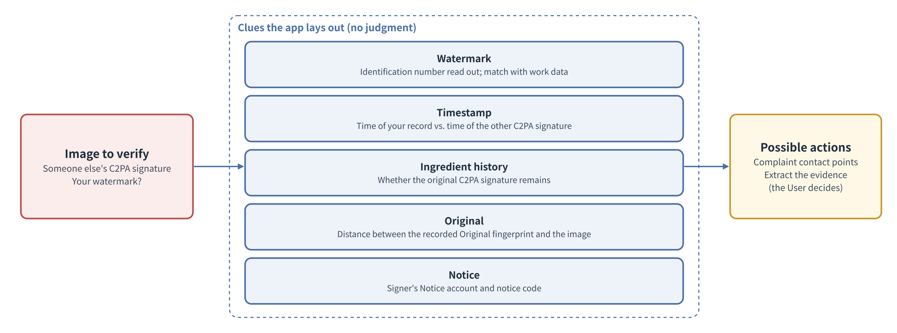

# Basic Design Document Chapter 2: Signing Information and Matching

Anti-Repost Tool for Cosplay Photos  Edition 1 (Draft)  2026-09-29 · Ishikawa Sou  
Nagareyama Software Development Co., Ltd. (NRSD)  
Word version: [02_Basic Design_Signing Information and Matching.docx](02_Basic%20Design_Signing%20Information%20and%20Matching.docx)

© 2026 Nagareyama Software Development Co., Ltd. (NRSD), Lead Developer: Ishikawa Sou (石川宗). Copyright in this document belongs to Nagareyama Software Development Co., Ltd. (NRSD). Rights in the third-party standards, software, commentaries on laws, and other materials referred to in this document belong to their respective holders. This is a translation of the Japanese original; where they differ, the Japanese original prevails.

---

## Position of This Document

- Details Chapter 2 of the Outline Design Document. This chapter sets the input and validation of information for C2PA signatures, how notice codes are made, each field of the personal root and the signing certificate, the means of matching and the clues, the documents for authorizations and joint rights, and the generation, storage, use, and remaking of signing keys. It is designed together with Chapter 8 (device data).
- This chapter is based on the study memo “Study of Chapter 2 Signing Information and Matching and Chapter 8 Repository and Data Management” (NRSD's internal record of study, not distributed with this document; the facts underlying the design are written with their sources in each section of this document).
- The decisions received are as in the following table. The texts of the Design Plan's decisions, items to be investigated, and open items are per Chapter 13, 1.2 “Mapping from Design Plan decisions to the Outline Design Document and basic design” and the destination table of the Outline Design Document (not reproduced in this chapter; only the numbers and the omissions found in the item breakdown are listed).

|Number|Type|Content|
|---|---|---|
|A-4|Omission found in the item breakdown|Correcting wrong Registrations and relieving the impersonated true Rights Holder|
|A-7|Omission found in the item breakdown|Handling of User identity-verification information (the premise disappeared with Edition 2, which dropped identity verification)|
|A-15|Omission found in the item breakdown|Risk of real names appearing in C2PA signatures|

## 1. List of Design Decisions

|Number|Decision|Reason|Rejected alternatives|
|---|---|---|---|
|DD-2-1|The only inputs asked of Users for C2PA signatures are handle name, role, and Notice accounts (any number). No e-mail or other registration is asked for|Design Plan D-5-1“The System does not confirm Users and collects no User information. No registration is required in order to use the System”, D-5-2“The certificate for C2PA signatures is created inside the Client App from information entered by the User. No certificate authority is required”. These are enough for the information placed in the certificate|Registering an e-mail address (the Edition 1 basic design)|
|DD-2-2|The app creates two tiers on the device: a “personal root” (key and self-signed certificate) and a “signing certificate” (end-entity certificate) it issues. C2PA signing is done with the signing certificate|The C2PA specification limits certificates usable for C2PA signing to end-entity certificates. Separating the personal root means the notice code (the personal root's fingerprint) does not change when inputs change|A single self-signed certificate (the notice code would change every time inputs change)|
|DD-2-3|The clue to Entitlement is the notice code posted on the Notice account's profile. The app provides the means of matching (showing the expected notice code, opening the Notice account), and the one who matches judges the result|Design Plan 5.3 “Identity and Entitlement”. Only the owner can write to a profile|NRSD checking the posting of Notices (this would be matching on others' behalf)|
|DD-2-4|When a person posing as the Rights Holder appears, the app lays out the clues of Design Plan 5.5 (invisible watermark, timestamp, ingredient history, Original, Notice) side by side and does not judge|Design Plan D-5-3“Acts of a person posing as the Rights Holder (signing first, replacing signatures, and reverse complaints) are treated as impossible to prevent; clues for matching are presented. No judgment is made”, D-5-5“The System provides the means of matching but does not perform matching on anyone’s behalf”|The app judging “who is the Rights Holder”|
|DD-2-5|Signing keys are kept in the OS keystore. On Windows, stored in Credential Manager with “This PC” persistence. On Linux without Secret Service, in a key file encrypted with a passphrase (age format). Moving devices uses backup files (Chapter 8, 5 “Backup Files”). OS hardware keys (Secure Enclave, TPM) are not used|Records are not gathered outside the device. Hardware keys cannot be extracted, so moving to another device would change the notice code. Windows “roams to other PCs” persistence moves keys on organizational PCs. The Linux kernel keyring is cleared on reboot|Entrusting keys to an outside party. Using hardware keys|
|DD-2-6|Authorizations and joint rights are expressed as document files (JSON and record signature combined into one). The authorized person imports the document and places its summary in the manifest of their outputs|Without servers, third parties can confirm “the principal Rights Holder's authorization”. It can be exchanged as a single file through messaging apps and the like|Managing relationships in an NRSD registry (Edition 1)|
|DD-2-7|The character set of notice codes and identification numbers is Crockford Base32 (without I, L, O, U)|Reduces misreading (1 and I, 0 and O). The first draft did not fix the character set of notice codes|RFC 4648 Base32 (the first draft's wording did not fix the character order)|
|DD-2-8|Handle names are normalized to NFC, and control characters and characters that change text direction are rejected|Prevents display spoofing with direction-changing characters (U+202E, etc.)|Accepting them as they are|
|DD-2-9|The certificate chain of the C2PA signature (COSE `x5chain`) contains the signing certificate followed by the personal root certificate|The notice code is computed from the personal root's public key (2.4). C2PA 2.4, 14.5 “X.509 Certificates” says the certificate of the trust anchor (root) should not be included in `x5chain`. This assumes the verifier already holds the anchor. The System's personal roots are on no one's trust list, so without it no one could compute the notice code from the image. It is not a prohibition (shall not), so it is included with the reason stated. Verifiers do not add a self-signed certificate in `x5chain` to their trust anchors on that basis alone (RFC 9360), so including it does not falsify trust|Not including it (the notice code cannot be computed from the image). Computing from the Authority Key Identifier of the signing certificate (the chain to the root cannot be verified, and others could create certificates with the same value)|
|DD-2-10|Record signatures (work data, case records, authorizations, revocations, joint-rights documents) are made with the signing certificate's key, and the signing certificate and personal root certificate are attached to the record|The personal root certificate's Key Usage is keyCertSign only (3.5), so signing records with the root key would violate the key usage. The signing certificate changes when inputs change or the personal root is remade (3.4), but with the attached chain old records can be verified up to the personal root (including past personal roots; 3.6)|Signing records with the personal root key (second draft; violates key usage)|
|DD-2-11|The personal root is valid from a fixed starting point (2020-01-01) until 40 years after the day the first timestamp was obtained (until then, until 2060; extended with the same key when a timestamp is obtained), independently of the device clock (NRSD's request, 2026-09-30). C2PA signing is stopped for a personal root more than 20 years old, and remaking it is required. The signing certificate expires together with the personal root that issued it. Personal roots from before remaking are kept on the device as “past personal roots” and used to check the User's old outputs, old notice codes, and old records (3.6). As a result, every image's C2PA signature is shown valid by general validators for at least 20 years from signing|The System's TSAs are not on the C2PA TSA trust list, and C2PA 2.x validators ignore their timestamps and check the validity of the signing certificate and personal root against the time of checking (C2PA 2.4, 15.8.2; outside the period, the result is `claimSignature.outsideValidity`, a failure). The specification sets no upper limit on validity periods (14.5.1.1). 20 years is the same length as the longest limitation period for damages claims (Legal Research L-20“Limitation periods for damages claims (Japan, China, US)”, “20 years from the act”). However, the limitation period counts from the act of infringement (the repost), while the System's 20 years count from signing, so for a repost made long after signing the C2PA signature may be shown as failed before the limitation period ends (Chapter 13, H-18“C2PA validators do not treat the System's timestamps as trusted time and check certificate validity at the time of checking; images past the personal root's expiry (40 years from creation) are shown as failed by general validators”). Even then, the RFC 3161 timestamps and work data remain as evidence of the time of signing. Free use of TSAs on the trust list (such as SSL.com) is described as premised on a C2PA conformance record (Chapter 3, 4 “Trusted Timestamps”), and there is no explicit permission for use without registration|Making the signing certificate valid for 1 year and remaking it before expiry (second draft; all images signed before remaking would fail after a year). Using a TSA on the trust list without registration (no basis for meeting its conditions of use)|

## 2. Input of Information for C2PA Signatures

### 2.1 Input procedure

|Step|User operation (app)|App processing|
|---|---|---|
|1|Read and agree to the Terms of Use (Chapter 12 “Interface with Legal”)|Record the agreed version and date/time on the device|
|2|Enter the handle name, role (cosplayer, photographer, authorized person), and Notice account URLs (any number)|Validate input (2.3). Create the personal root key and put it in the keystore (7). Create the notice code (2.4). Create the signing certificate (3)|
|3|Post the notice code on the Notice account's profile (or a pinned post) (example Notice texts are in Chapter 5, 6 “Support for Notices”)|Show on screen how to post it on each posting site|
|4|Decide the backup location (Chapter 8, 5.5 “Backup locations and automatic backups”; can be skipped)|Detect and propose locations, and make backups automatically from then on|

- These are the only inputs asked for. The app does not send inputs outside the device.
- Each input field shows “what it is used for and where it is kept” (Chapter 10, G-03“Signing Information”). The handle name and Notice accounts go into the certificate and are public together with C2PA-signed images. The role goes into the manifest.
- Even if stopped midway, inputs are saved on the device and input can continue at the next start.

### 2.2 Limits of the places where notice codes are posted

|Posting site|Profile limit|Source|A 28-character notice code and a short Notice sentence|
|---|---|---|---|
|X|160 characters|X Help “How to customize your X profile”|Fits|
|Instagram|150 characters|Instagram Help “Add a bio to your Instagram profile”|Fits|
|Xiaohongshu|About 100 characters (no official statement could be confirmed)|Commentary article diantuoyi.com|Fits|
|Weibo|Could not be confirmed|—|[To be measured: check on the edit screen. Assumption: fits in around 70 characters]|

- On posting sites where it does not fit, the Notice and code are placed in a pinned post. Only the owner can pin, so it serves the same role as the profile.

### 2.3 Input validation

|Input|Check (initial values)|When the check fails|
|---|---|---|
|Handle name|1–50 characters. Normalized to NFC. Control characters (U+0000–U+001F, U+007F–U+009F), direction-changing characters (U+202A–U+202E, U+2066–U+2069, U+200E, U+200F), and zero-width characters (U+200B–U+200D, U+FEFF) are rejected. Leading and trailing spaces are removed. The restriction level “Highly Restrictive” of UTS #39 (Unicode Security Mechanisms) (which allows mixing Japanese kanji, kana, and Latin) is the upper limit, and mixtures beyond it (for example, Latin and Cyrillic) are rejected (NRSD's request, 2026-10-01)|Show the reason under the field and do not proceed|
|Role|One of cosplayer, photographer, authorized person. What is entered here is the default role; it can be changed per export work session in G-08, and the manifest (the role in `cawg.identity`) records the role of that work session (for Users who both shoot and cosplay)|—|
|Notice account|A URL starting with `https://`. Up to 500 characters. Up to 10 accounts (initial value; keeps the certificate's SAN and the C2PA `x5chain` small). Normalization and posting site detection follow Chapter 1, 10.10 “Forms of URLs and QR codes”. For major posting sites (X, Instagram, Weibo, Xiaohongshu, Patreon, pixiv, pixivFANBOX, Bilibili), the form is checked and the site is marked (NRSD's request, 2026-09-30). Other host names are accepted with a word of confirmation|`http://` and others are not accepted. For URLs of major posting sites with the wrong form, an example is shown|

- If the same URL is entered twice, it is merged into one.
- There is no real-name field (6). Even if the handle name looks like a real name, no judgment is made. The field description says it is better not to show a real name (A-15“Risk of real names appearing in C2PA signatures”).

### 2.4 How the notice code is made

1. Put the personal root's public key in SubjectPublicKeyInfo DER form.
2. Compute its SHA-256.
3. Take the first 100 bits.
4. Convert to 20 characters in Crockford Base32 (`0123456789ABCDEFGHJKMNPQRSTVWXYZ`) (5 bits at a time, from the top).
5. Prefix `NRSD-` and split the 20 characters with `-` every 5 characters (form: `NRSD-XXXXX-XXXXX-XXXXX-XXXXX`, 28 characters).
- When reading, lowercase is read as uppercase, I and L as 1, and O as 0 (the Crockford Base32 rules).
- Reason for 100 bits: the probability of accidental collision is about 2⁻⁴⁸ even with 100 million Users (n²/2¹⁰¹), which can be ignored. Longer codes use more profile characters (2.2).
- Sample value: at implementation, a value computed from a fixed test key is published in this document and the test documents.

## 3. Certificates

### 3.1 Structure

|Certificate|Contents|Validity period (initial value)|
|---|---|---|
|Personal root|Self-signed. A CA certificate (Basic Constraints cA true). Subject is the handle name|notBefore is the fixed 2020-01-01T00:00:00Z. notAfter is 40 years from the day the first timestamp was obtained (3.4). Until then it is made with the later of 2060-01-01T00:00:00Z and 40 years after the device clock (so that even for a User who starts in 2040 or later, images signed before the first timestamp are shown valid for 20 years from signing; a clock running ahead does no harm), and when the first timestamp is obtained it is remade with the same key, extending only notAfter (the notice code does not change because the key is the same). At that time the signing certificate is also remade with the same key and the same expiry (a new serial number; a `cert` row in the change history). It does not depend on the device clock (NRSD's request, 2026-09-30)|
|Signing certificate|An end-entity certificate issued by the personal root. Follows the C2PA specification requirements (3.2)|Until the issuing personal root expires (same)|

- The key type is ECDSA P-256 (ES256 in C2PA and CAWG).

### 3.2 Requirements for the signing certificate (C2PA specification)

- It is an X.509 certificate. Only end-entity certificates (cA false) can be used for C2PA signing.
- It has Key Usage marked critical, with digitalSignature set. keyCertSign is not set.
- It has Extended Key Usage containing `c2pa-kp-claimSigning` (1.3.6.1.4.1.62558.2.1) and `id-kp-documentSigning` (1.3.6.1.5.5.7.3.36) (the latter for compatibility with older validators). anyExtendedKeyUsage is not included.
- The C2PA Trust List has been limited to `c2pa-kp-claimSigning` certificates since 2.2 (the revision history of the C2PA technical specification 2.2). The System's certificates are not on the Trust List (3.3).
- Source check (2026-09-29, 2026-09-30): in the original text of 14.5.1.1 “General Requirements” of C2PA technical specification 2.4 (the same in 2.2), the signature algorithms (ecdsa-with-SHA256, etc.), curves (prime256v1, etc.), version 3, the relation between Basic Constraints and keyCertSign, the Authority Key Identifier for certificates that are not self-signed (required), the Subject Key Identifier for CA certificates (required), Key Usage (critical recommended, digitalSignature), and Extended Key Usage of end-entity certificates (required, anyExtendedKeyUsage not allowed) were checked. 14.4.1 includes the C2PA Trust List among the trust anchors for `c2pa-kp-claimSigning` (1.3.6.1.4.1.62558.2.1), recommends that users be able to add other anchors, and notes that earlier versions required `id-kp-documentSigning` (1.3.6.1.5.5.7.3.36) and others. The fields in 3.5 conform to these.

### 3.3 How validators show it

- General verification sites show “Valid (not tampered with, but the signer is not vouched for)” (Research Materials “C2PA Certificates and Identity”). The signer field shows the handle name from the certificate.
- 14.4 of C2PA specification 2.4 recommends that validators let users add trust anchors. Users may publish their personal root certificate (optional; the System does not hold it).

### 3.4 Expiry and input errors

- How validators handle expiry: the System's timestamps are not treated as trusted time by C2PA validators (Chapter 3, 4 “Trusted Timestamps”). A validator shows the C2PA signature valid only when the time of checking is within the validity of the signing certificate and the personal root, and fails it with `claimSignature.outsideValidity` otherwise (C2PA 2.4, 15.8.2). Therefore the signing certificate expires together with the personal root, and the personal root is made long-lived (DD-2-11“Certificate validity is long enough that every image is shown valid for 20 years from signing”).
- When the handle name or Notice accounts are corrected, only the signing certificate is remade (it expires with the personal root). The C2PA signatures of images made before the correction remain shown valid with the previous certificate until the personal root expires.
- The User is prompted to remake the personal root 19 years after its creation, and after 20 years C2PA signing stops and export does not start until it is remade (8 “Handling Failures”). As a result, every image is shown valid for at least 20 years from signing (the remaining period of the personal root). Remaking changes the notice code, so the User is guided to re-post it and to keep the old code in the Notice as “old code (until date)” (3.6). Images signed with an old personal root are shown valid until that old personal root expires (40 years after its creation).
- Certificate dates: dates in 2050 and later are written in GeneralizedTime form in X.509 (RFC 5280, 4.1.2.5). rcgen supports this. [To be measured] that c2pa-rs and the parser of the public page's “Check notice code” page can read certificates with notAfter in 2050 or later.
- Images past the old personal root's expiry are shown as failed by general validators (Chapter 13, H-18“C2PA validators do not treat the System's timestamps as trusted time and check certificate validity at the time of checking; images past the personal root's expiry (40 years from creation) are shown as failed by general validators”). The RFC 3161 timestamps and work data remain as evidence of the time of signing.
- The 20 and 19 years (3.4, 8) are counted from the day the first timestamp was obtained (if none, the device clock on the day of creation), which is recorded in `identity/epoch.json` (Chapter 8, 2.1 “Arrangement”). Because the device clock plays no part in judging certificate validity, “not yet valid” cannot occur whatever the clock says (NRSD's request, 2026-09-30).

### 3.5 Fields

|Field|Personal root|Signing certificate|
|---|---|---|
|Version|3|3|
|Serial number|128-bit random number (positive)|128-bit random number (positive)|
|Signature algorithm|ecdsa-with-SHA256|ecdsa-with-SHA256 (signed with the personal root key)|
|Issuer|Same as subject (self-signed)|The personal root's subject|
|Subject|CN = handle name|CN = handle name|
|Validity|Per 3.1 “Structure”|Per 3.1 (same as the personal root)|
|Public key|ECDSA P-256|ECDSA P-256 (a key separate from the personal root)|
|Basic Constraints|critical, cA = true, path length 0|critical, cA = false|
|Key Usage|critical, keyCertSign|critical, digitalSignature|
|Extended Key Usage|None|`c2pa-kp-claimSigning`, `id-kp-documentSigning`|
|Subject Alternative Name|None|URI: Notice accounts (in the order entered)|
|Subject Key Identifier|SHA-1 of the public key (RFC 5280 method 1)|Same|
|Authority Key Identifier|None|The personal root's Subject Key Identifier|

- No organization name, country, or e-mail is placed in the subject (they are not asked for; DD-2-1“The only inputs for C2PA signing are handle name, role, and Notice accounts”).
- Serial numbers are random so that certificates remade under the same personal root do not share numbers.
- Certificates are created with rcgen (Chapter 11, 4.1 “Rust components”). [To be measured] that c2pa-rs creates a C2PA signature with the two-tier certificates and verification yields “valid (signer not on the trust list)”.

### 3.6 Past personal roots

- When the personal root is remade (20-year renewal, loss without a backup, suspected key leak), the certificate of the personal root before remaking (public key only; the private key is deleted), its notice code, the period it was used, and the reason for remaking are kept in `identity/past_roots/` on the device (Chapter 8, 2.1 “Arrangement”). They are included in backup files.
- Uses:

|Situation|How past personal roots are used|
|---|---|
|Importing the User's own old outputs as ingredients (Chapter 3, 2 “Input” ①)|A C2PA signature made under the current personal root or any past personal root is treated as the User's own|
|Verifying (Chapter 10, G-13“Verify”)|For images signed under a past personal root, show “This is a C2PA signature under your previous notice code (period)”|
|Importing authorizations and joint-rights documents (the “Counterparty” row of 5.4 “Checking documents”)|If the document's counterparty notice code matches the current notice code or any past notice code, it is imported as addressed to the User. Documents addressed to an old code marked as suspected of leaking are shown with the mark for the User to confirm|
|Verifying record signatures (Chapter 1, DD-1-5“Device records carry record signatures and are verified”)|Confirm that the personal root in the chain attached to an old record matches the current or a past personal root|

- A past personal root may be added from an old output only when the work data of that output is at hand (the Original's SHA-256 matches) or it is in `past_roots` of a backup. A root taken from anything else is marked “unverifiable past root” and is not used for the “Counterparty” check of 5.4.
- Authorizations and joint-rights documents are not remade after a remaking. The remaking record (the `root` row below) works like a PGP key transition statement: the receiving side follows old code → remaking record → new code, and accepts the past code in the “Counterparty” check of 5.4. If the issuer remade, the old code on the authorized person's outputs is checked against the “old code” in the issuer's Notice. Only for a remaking on “suspected leak”, because the old key cannot be trusted, a proposal is shown to reissue the documents with the new root to confirmed contacts (5.5).
- Notice: the confirmation dialog for remaking (Chapter 10, 3.6 “List of confirmation dialogs”) guides the User to post the new code and keep the old code in the Notice as “old code (until date)”. If the old code remains in the Notice, third parties can match old works against the Notice as well.
- Remaking is kept as one row of the change history (6) (`field` is `root`; the content is the new personal root certificate, the reason, and the date/time; record-signed with the old signing certificate's key, with the chain up to the old personal root attached. DD-2-10), and this row reaches the User's other devices automatically (Chapter 8, 5.4 “Device-to-device synchronization”). Only a remaking for a “suspected leak” is not propagated automatically (a thief could send a fake remaking); the User puts it on the second device by importing a backup or by confirming the safety number (5.5) (NRSD's request, 2026-09-30).

## 4. The Means of Matching and the Clues

### 4.1 Matching with the Notice account

- When an image is put into the “Verify” screen (Chapter 10, G-13“Verify”), the app shows, from the C2PA signature's certificate, the signer's handle name, Notice accounts (SAN), and the expected notice code (computed by the procedure in 2.4 from the personal root certificate placed in `x5chain`; DD-2-9“The personal root certificate is included in x5chain”. For an image whose chain does not end in a self-signed CA certificate (signed by other software), “No notice code (not a signature of the System)” is shown), and a button to open the Notice account.
- The User (or anyone) opens the profile and checks with their own eyes whether the notice code matches. The app does not judge match or mismatch (D-5-5“The System provides the means of matching but does not perform matching on anyone’s behalf”).
- When the UTS #39 skeleton of the signer's handle name (the form with confusable characters replaced by representatives) matches the skeleton of the User's own handle name but the key differs, the caution “a different signer with a similar name” is shown (G-13“Verify”, G-24“Compare Clues”) (NRSD's request, 2026-10-01).
- If the image's personal root matches the User's own (current or past) root and the signing certificate's serial number is in the change history (6; of any device), it is shown as “your earlier signing certificate (period, Notice accounts at the time)”. Other people's images have no history, so the certificate's SAN is shown as is.
- The matching procedure is placed on the public page (the “Check notice code” page of Chapter 8, 3.3 “Public page (decision on O-05“Content of the public page”)”; the content of the procedure is written there) so that those without the app (viewers, providers) can also match.

### 4.2 Original

- At export, the Original's SHA-256 and PDQ are recorded in the work data and timestamped (Chapter 3 “Signing”). In a dispute, the User can show possession of the Original from before the record by presenting a file with the same SHA-256.
- What counts as the Original (Design Plan 1.5 “Definitions”: photo data before publication): for photographers, RAW, data before development, and unpublished photos from the same shoot; for cosplayers, unpublished photos received from the photographer. The photographer's authorization or joint-rights document is not an Original and is shown separately as a clue to the basis of rights (5). Images delivered through sales (which purchasers also have) are not Originals.
- The location of the Original is recorded in the work data, and the existence and SHA-256 of the Original are checked in the background at start and at backup time. A missing or changed Original is marked in G-12“Works”, and one with the same SHA-256 is searched for on the device and in the backup locations. The choice to include the Originals themselves in backups is offered at first run (included by default; Chapter 8, 5.5 “Backup locations and automatic backups”). Re-development is appended to the work data as a “new version of the Original”, and the original SHA-256 is kept too. Both are clues to possession of the Original (NRSD's request, 2026-09-30).
- Linking RAW: at export, if a RAW file with the same base name (`CR2 CR3 NEF ARW RAF ORF RW2 DNG PEF SRW`; the paired name of the camera's DCF) is in the same folder as the input photo, its SHA-256 and location are recorded automatically as “before development” in the “new versions of the Original” column of the work data (the same as Lightroom treating a JPEG and RAW of the same name as a pair). Later, in G-12 “Link Original”, a file or folder can be chosen and matched by the same base name. A folder with only RAW files cannot be exported, as in Chapter 3, 2, and the guidance “develop first” is shown.

### 4.3 Takeover of a Notice account

- A person who takes over the account can rewrite the notice code on the profile to their own. The User who recovers the account re-posts the notice code. The app can show the timestamps of the User's work data (dates before the takeover) as clues. The System does not detect takeovers.

### 4.4 Clues when a person posing as the Rights Holder appears

- When an image thought to be the User's work is put into the “Verify” screen, the app lays out the following side by side. No judgment is made.

Figure 2-1 Matching clues

|Clue|What the app shows|
|---|---|
|Invisible watermark|The identification number read from the image, whether it exists in the User's work data, and whether it conflicts with the manifest's record (the value of `c2pa.soft-binding`)|
|Timestamp|The date/time of the timestamp in the User's work data and the date/time of the timestamp of the image's C2PA signature|
|Ingredient history|Whether the User's C2PA signature remains among the manifest's ingredients|
|Original|The SHA-256 and PDQ of the Original recorded in the User's work data, and the PDQ distance to the image|
|Notice|The Notice account and expected notice code of the image's C2PA signer (4.1), and the User's own notice code|

- Example of presentation: “This image carries your watermark (identification number P0KT0-G82CJ-B2M) and a C2PA signature by another signer (handle name sample_cos). The timestamp of your work data is 2026-09-01, and the timestamp of this image's C2PA signature is 2026-09-15.”
- Actions the User can take based on the clues (complaints, etc.) are shown in Chapter 7 “Legal Action Guidance”.
- The list of clues can be exported in addition to the evidence package (Chapter 6). When extracted on its own, the form follows the report of Chapter 6, 3.4 (TXT and PDF/A-3u).
- Threat T-1 (spoofing): posing as the Rights Holder to C2PA-sign first or replace the C2PA signature. Attacker: a person who obtained someone else's photographs. Target asset: Entitlement. Remaining gap: cannot be prevented (Chapter 13)

### 4.5 Photos before adoption

- Photos published before using the System have no invisible watermark, work data, or timestamp. The clues that can be shown are limited to the Original (4.2) and the fact of publication (dates on posting sites, etc.). This is declared as a gap in Chapter 13 “Design Verification”.

### 4.6 Exporting images that carry someone else's C2PA signature

- The app does not export images carrying a C2PA signature with another person's identity record (CAWG `cawg.identity`, the System's `jp.nrsd.rights`), unless the User has imported an authorization or joint-rights document with that person. This prevents the app itself from being used to replace signatures. Replacement with other software cannot be prevented.
- Images carrying C2PA signatures from cameras or development/editing software (without a person's identity record) can be exported. The previous C2PA signature remains in the history as an ingredient (parentOf) and is not erased (Chapter 3, 2 “Input”). Even when photographers use C2PA-capable cameras or Content Credentials in Lightroom and the like, the images can be exported with the System. Metadata in the ingredient manifests that may contain location, model, and serial numbers is redacted and not made public (Chapter 3, 3.8 “Redaction of ingredient manifests”).

## 5. Authorizations and Joint Rights

### 5.1 Authorization

- Created in the principal Rights Holder's (cosplayer's or photographer's) app. Its contents are as in the table in 5.3.
- The authorized person imports the authorization. A summary of it (the principal Rights Holder's handle name and notice code, scope, expiry, and hash of the authorization) is placed in `jp.nrsd.rights` of the manifest of their outputs, and the authorization itself is attached as an ingredient. Third parties can match against the principal Rights Holder's notice code.
- Revocation: the principal Rights Holder creates a revocation and gives it to the authorized person. There is no central mechanism to tell third parties of revocation (the System does not collect information). The principal Rights Holder announces it in their Notice. The default term is 90 days (initial value; formerly 1 year (NRSD's request, 2026-09-30)); 30 days before the end, the app automatically prepares a renewal document and proposes sending it directly to confirmed contacts (5.5). Revocations also reach confirmed contacts directly, and export under that authorization stops the moment they arrive.

### 5.2 Joint rights (photographer and cosplayer)

- Both parties exchange their notice codes (personal root fingerprints), create a joint-rights document, and both import it.
- How it is made: one party drafts the document, attaches a record signature, and gives it to the other. The other checks the content, adds their own record signature, and returns it. Both import it.
- At export, the person who C2PA-signs is the one operating. The joint rights holder is named in the manifest, with the hash of the joint-rights document (Chapter 3). The joint rights holder's name can be drawn with a Visible Signature placeholder (Chapter 4, 3.1 “Content and placeholders”).
- For photographs where the photographer and the depicted person differ, the attribution of rights is to be confirmed with the photographer in advance (Draft Project Proposal, Section 10). The System records the result of this confirmation as a document and does not judge the attribution of rights itself (Design Plan D-3-4“The System is built on the premise that delivery, Visible Signatures, and the rights relationship with the photographer are understood by the cosplayer personally”).
- If the counterpart does not use the System, the document cannot be made (both signatures are needed). The joint rights holder is not named in the manifest or in IPTC `dc:creator`; it can only be drawn as free text of the Visible Signature (“Photo: @xxx”). G-18 shows “if the counterpart installs this app, the document can be made” (the same line as Instagram collaborative posts requiring both parties' consent).

### 5.3 Document format

- A document is one file (extension `.nrsdgrant`; named `<kind>-<id>.nrsdgrant`), whose content is JSON (`schema: nrsd.grant/1`). The record signature (JWS detached; the payload is the JSON normalized with JCS, with the certificate chain in `x5c`; Chapter 1, 8.3 “Formats and versions”) is placed in `signatures` within the JSON.

|Field|Authorization|Revocation|Joint-rights document|
|---|---|---|---|
|`kind`|`grant`|`revoke`|`co_rights`|
|`id`|UUID v7|UUID v7|UUID v7|
|Issuer|The principal Rights Holder's handle name, signing certificate and personal root certificate, notice code|Same|Both parties' handle names, signing certificates and personal root certificates, notice codes, roles|
|Counterparty|The authorized person's handle name and notice code|The `id` of the authorization, or of the joint-rights document, being revoked (a joint-rights document can be ended by either party; the counterparty is no longer named in subsequent exports, and past outputs are not changed. The same as PGP revocation)|—|
|Scope|All works, or limited by shoot name or period (the shoot name is matched exactly, case-insensitively, after NFC normalization and removal of leading and trailing spaces)|—|All works, or limited by shoot name or period|
|Term|Start and end dates (`YYYY-MM-DD`, calendar days inclusive at both ends; default 90 days. Compared by calendar day with the photo's shooting date (the EXIF date, without offset))|Effective date of revocation (same form)|Start and end dates (same form; none can also be chosen)|
|Condition text|Free text (up to 500 characters)|Reason (optional)|Text on how rights are divided (up to 500 characters)|
|Created at|UTC|UTC|UTC|
|Record signature|The principal Rights Holder's signing certificate key (DD-2-10“Record signatures use the signing certificate's key with the certificate chain attached”)|Same|Both parties' signing certificate keys|
|`renews`|A renewal document is a new authorization with `kind: grant` holding the `id` of the previous authorization in `renews` (as an X.509 renewal is a new certificate; there is no document that only extends the term). The timing of the renewal proposal is in 5.1|—|—|

### 5.4 Checking documents

|What is checked|Method|When it fails|
|---|---|---|
|Format|`schema` and the form of each field|Not imported|
|Record signature|Verify with the signing certificate's public key, and confirm the signing certificate was issued by the personal root certificate (that the certificate was within its validity when the document was made)|Not imported|
|Notice code|Match between the notice code computed from the document's personal root certificate and the notice code written in the document|Not imported|
|Counterparty|The authorization's counterparty notice code matches the importing User's current notice code or a past personal root's notice code (3.6 “Past personal roots”)|Show “not addressed to you” and do not import. Documents addressed to an old code marked as suspected of leaking are shown with the mark for the User to confirm|
|Term|Start and end dates|If outside the term, import it but mark it “outside the term”|

- Imported documents are placed in `approvals/` (Chapter 8, 2.1 “Arrangement”). The check results and import time are recorded.
- Whether the issuer's notice code is posted on the issuer's Notice account is checked by the User (the app shows a button to open the Notice account).
- Only authorizations whose scope (shoot name, period) matches the work session's shoot name and the photos' shooting dates can be chosen in G-08 for export. Export is not possible with an authorization that does not match. Revocation is checked at the start of a batch export; a revocation that arrives midway takes effect from the next export (the same as the handling of certificates in 7.6).

### 5.5 Adding contacts (handover of documents)

- Besides being passed as files (5.1 to 5.4), documents (authorizations, revocations, joint-rights documents, renewal documents) reach the other device directly if the contact has been marked “confirmed” (NRSD's request, 2026-09-30). The flow follows Signal's safety numbers and Magic Wormhole.

|Step|Operation|
|---|---|
|1|In “Add contact” of G-18“Authorizations and Joint Rights”, show your own QR code (`contact` in Chapter 1, 10.10 “Forms of URLs and QR codes”) to the other person to scan. When apart, tell the other person a short passphrase (one number and two words; one-time, expires in 10 minutes)|
|2|The two devices connect directly (the same direct connection as Chapter 8, 5.4). The same safety number appears on both screens. The safety number is made the same way as Signal's: for each person, the SHA-512 of the byte string of “version number 0, the personal root public key (SubjectPublicKeyInfo DER), the notice code” is iterated 5,200 times, and the first 30 bytes are turned into 30 decimal digits. The two people's digits are placed in ascending numeric order into 60 digits, shown as 12 groups of 5. Because it is made from the personal root key, a contact's safety number does not change when devices are replaced|
|3|If they match on comparison, press “Confirmed”. From then on, documents with this contact arrive directly, and received documents go through the checks of 5.4|

- While not connected (the other person's app is not running), documents arrive at the next connection. In a hurry, they can still be passed as files (the format is the same).
- The list of confirmed contacts is in G-18“Authorizations and Joint Rights”. Once a contact is removed, nothing arrives from then on.
- Receiving what arrives: documents from a confirmed contact are imported automatically if they pass the checks of 5.4 (that is what confirming means; the same as Signal attachments). Templates (`.nrsdtpl`) are shown as “received templates” and imported only when the User presses “Import” (the same as receiving by AirDrop; the workspace is not changed without asking).
- Manual entry of notice codes remains, but the default is QR code or passphrase, eliminating typing mistakes.

## 6. Rights Holder Information

- The range made public (R-2-5-1): the certificate's subject (handle name) and SAN (Notice accounts), and the role in the manifest. These are public together with C2PA-signed images. There are no other inputs.
- Real names (R-2-5-2): there is no field for them. No names are placed in certificates or manifests. When the User uses their name in a complaint (Chapter 7), the User enters it themselves and the System does not store it.
- History of changes (R-2-5-3): each time inputs change, the date/time and the before/after values are recorded on the device (including the list of remade certificates). The history is appended to `identity/history/<device number>.jsonl` (a per-device chain; Chapter 8, 2.1 “Arrangement”); a row holds `at` (UTC), `field` (`handle`, `role`, `accounts`, `cert` (remaking of the certificate), or `root` (remaking of the personal root)), `before`, `after`, and `cert_serial` (the serial number of the signing certificate at that time), and the history can be viewed in Chapter 10, G-19“Keys and Notice Code”.

## 7. Signing Keys

### 7.1 Generation and storage

- ECDSA P-256 keys are generated on the device (randomness from the OS cryptographic random source). Two keys are made: the personal root key and the signing certificate key.
- Stored in the OS keystore (7.5). Keys are never shown on screen.
- Keys leave the device only inside backup files encrypted with the User's passphrase (Chapter 8, 5 “Backup Files”).
- The device key (the iroh key for direct connections; Ed25519) is also created at first start and placed in the OS keystore (`device-key` of 7.5). It is not included in backups and not synchronized (one per device). The device number (Chapter 1, 8.2 “Identifier scheme”) is made from this public key, and the same value is used in both the `device` of chains and direct connections (Chapter 8, 5.4).

### 7.2 Loss and leaks

|Event|Procedure|Past C2PA signatures|
|---|---|---|
|Device loss or failure (with a backup)|Import the backup file on the new device. The notice code does not change|Remain valid|
|Device loss or failure (without a backup)|Create a new personal root and re-post the new notice code on the Notice accounts. Keeping the old code in the Notice as “old code (until the date of re-posting)” is recommended. The old personal root certificate can be extracted from the C2PA signature of an old output at hand and added to “past personal roots” (3.6)|Remain valid. If the old code is not kept in the Notice, C2PA signatures by the old notice code's key no longer match the Notice (Chapter 13, H-43“After the notice code is changed (20-year renewal, loss without backup, suspected leak), matching of old works no longer agrees unless the old code is kept in the Notice”). A timestamp earlier than the re-posting is a clue|
|Suspected key leak|Create a new personal root and re-post the notice code. Write in the Notice “the old code is not used after (date)”. The old personal root is kept in “past personal roots” with the mark “suspected leak (date)” (3.6)|C2PA signatures with the leaked key are shown valid by general validators until the old personal root expires (up to 40 years after creation) (there is no revocation mechanism). C2PA signatures with a timestamp later than the date of the suspected leak can be doubted by third parties matching against the Notice. C2PA signatures without a timestamp cannot be told apart as before or after the leak (Chapter 13, H-13“If the device is fully compromised, C2PA signing until the key is remade cannot be prevented; signatures with a leaked key are shown valid until the old personal root expires (up to 40 years)”)|

- No revocation list (CRL) is kept. Re-posting the notice code serves as the notice of revocation to third parties.
- Threat T-4 (spoofing): stealing a User's signing key to C2PA-sign. Attacker: a person who compromised the device. Target asset: Identity. Remaining gap: when the device is fully compromised
- Secret: the device key (the iroh private key for direct connections). Location: the OS keystore (7.5). Not included in backups (one per device). If leaked: another device or contact could be impersonated. Remove that device in G-20 “Devices”, and contacts redo their confirmation
- Secret: the User's signing key. Location: the OS keystore (Windows Credential Manager/DPAPI, macOS Keychain, Linux Secret Service; on Linux without Secret Service, a key file encrypted with a passphrase. Chapter 2, 7.5 “Storage method per OS”). Inside backup files, encrypted with the User's passphrase. If leaked: the User remakes the key and re-posts the notice code (Chapter 2, 7 “Signing Keys”)

### 7.3 Multiple devices

- Import the backup file on another device, or link the devices and reconcile the records (Chapter 8, 5.4 “Device-to-device synchronization”), and use the same personal root and signing certificate (Chapter 1, 13 “Devices and People”). Only the device key (7.1) is separate per device.

### 7.4 Authentication when using the app

- Keys are protected by the OS keystore through the OS user's login (on Windows and Linux Secret Service, they can be read without a confirmation dialog while logged in; on macOS it depends on Keychain permissions; 7.5). No app-specific password is set (not to add burden on non-technical Users). Instead, OS user verification is required just before C2PA signing, creating documents (5), importing a backup (Chapter 8, 5.3), linking a device and marking a contact as confirmed (Chapter 8, 5.4, 5.5), and “Erase this device's records” (Chapter 9, 2.3): on macOS, LocalAuthentication's `LAContext.evaluatePolicy(.deviceOwnerAuthentication)` (Touch ID, or the login password if unavailable); on Windows, `IUserConsentVerifierInterop.RequestVerificationForWindowAsync` (Windows Hello PIN, face, or fingerprint); on Linux, polkit (fprintd fingerprint or PAM password). The initial value is on; it can be turned off in G-20 “Settings”. A batch export asks only once at the start. If the OS does not support it, it is not asked. Automatically running jobs (timestamping the chain heads, attaching pending timestamps, the “Check current state” append, automatic backups) do not ask for user verification and read the OS keystore protected by the login (the same as 1Password's auto-unlock). The same experience as 1Password and Bitwarden (NRSD's request, 2026-10-01). A passphrase is asked only when creating or importing a backup file and on Linux without Secret Service (7.5).

### 7.5 Storage method per OS

|OS|Storage|Settings|Notes|
|---|---|---|---|
|Windows|A generic credential in Credential Manager|Persistence “This PC” (LOCAL_MACHINE). Up to 2,560 bytes per item (Microsoft's CREDENTIAL documentation). A P-256 key (about 140 bytes in PKCS#8) fits|“Roams to other PCs” (ENTERPRISE) is not used because it moves to other PCs with roaming profiles|
|macOS|A generic password item in the Keychain|Readable range limited by the app's code signature|[To be measured] that it can still be read without a confirmation dialog after updating an app signed by the same developer|
|Linux (with Secret Service)|Secret Service (GNOME Keyring, KWallet, etc.; D-Bus)|—|—|
|Linux (without Secret Service)|A key file encrypted with a passphrase (age format, scrypt 2^18) in the app's data location. The rules for accepting the passphrase (15 characters or more; commonly used and weak ones rejected) are the same as for the backup passphrase (Chapter 8, 5.2)|Ask for the passphrase at start|The kernel keyring (keyutils) is not used because it is cleared on reboot (the keyrings documentation on man7.org)|

- Names of keystore items: the service is `jp.nrsd.c2pa4cosplayer`, and the items are `root-key`, `signing-key`, `device-key`, and `tsa-<provider number>` (within the 256-character limit of Windows credential names). The component is the keyring crate (4.2.0; Chapter 11, DD-11-6“Keys are kept in the OS keystore”). On Windows, keyring's Windows store component (windows-native-keyring-store 1.1.0, MIT OR Apache-2.0) is used. This component's default persistence for created credentials is Enterprise (roams to other PCs), and passing `Local` (this PC) in `persistence` when creating an item stores it as LOCAL_MACHINE (the component's source documentation and implementation were checked on 2026-09-30). The System always passes `Local`. The persistence of existing items is read and checked, and recreated if not `Local`.
- OS hardware keys (macOS Secure Enclave, Windows TPM) are not used, because the key cannot be extracted and moving to another device would change the notice code (DD-2-5“Signing keys are kept in the OS keystore; moving uses the backup file”).

### 7.6 Handling during use

- The key is read from the keystore just before signing and erased from memory after use (the zeroize crate). During a batch export it is held until the end of the export and then erased.
- A batch export continues to the end with the signing certificate and key read at its start. Inputs can be corrected and the certificate remade from G-19 and G-20 midway, but that does not affect the export in progress and is used from the next export (one line in G-19 says so). The work data's `signer` (the certificate serial number) keeps which certificate signed.
- Keys are never written to the operation log (Chapter 1, 10.4 “Operation log”).
- When the key cannot be read from the keystore (the OS refused, the key is missing), signing does not start, and the reason and what to do next (check the keystore, restore from a backup) are shown.

## 8. Handling Failures

|Event|How it is reported|What the User does|
|---|---|---|
|Cannot write to the keystore (first run)|Show the reason and do not proceed|Check the OS keystore. On Linux, install Secret Service or choose passphrase-protected storage|
|Cannot read from the keystore|Do not start signing and show the reason (a `SIG` number of Chapter 1, 10.3 “Errors”)|Check, or restore from a backup|
|19 years have passed since the personal root was created|At start, prompt the User to remake it within a year (export is not stopped)|Remake it in one operation; the new notice code is shown|
|20 years have passed since the personal root was created|Stop C2PA signing and do not start export. Show the reason (“Images signed with this key cannot keep 20 years of validity from signing”) and remaking (DD-2-11“Certificate validity is long enough that every image is shown valid for 20 years from signing”)|Remake it in one operation. The User is guided to keep the old code in the Notice (3.6)|
|An imported document fails the check|Do not import and show the reason (5.4)|Check with the counterparty|
|Input fails validation|Show the reason under the field (2.3)|Correct it|

## 9. Relation to the Screens

|Function|Screen|
|---|---|
|Input (2)|Chapter 10, G-03“Signing Information”|
|Posting the Notice (2.2)|Chapter 10, G-04“Posting the Notice”|
|Matching (4)|Chapter 10, G-13“Verify”, G-24“Compare Clues”|
|Authorizations and joint rights (5)|Chapter 10, G-18“Authorizations and Joint Rights”|
|Keys and notice code, history of changes (6, 7)|Chapter 10, G-19“Keys and Notice Code”|
|Adding contacts, direct handover of documents (5.5)|Chapter 10, G-18“Authorizations and Joint Rights”|

## 10. Mapping to Requirements

|Requirement number (text in the Outline Design Document)|Sections in this chapter|
|---|---|
|R-2-1-1|3 “Certificates”|
|R-2-1-2|3.4 “Expiry and input errors”, 2.3 “Input validation”|
|R-2-2-1|2.4 “How the notice code is made”, 4.1 “Matching with the Notice account”|
|R-2-2-2|4.2 “Original”|
|R-2-2-3|4.3 “Takeover of a Notice account”|
|R-2-3-1|4.4 “Clues when a person posing as the Rights Holder appears”, 4.6 “Exporting images that carry someone else's C2PA signature”|
|R-2-3-2|4.5 “Photos before adoption”|
|R-2-3-3|4.4 “Clues when a person posing as the Rights Holder appears”|
|R-2-4-1|2 “Input of Information for C2PA Signatures” (the criterion is the User trial in Chapter 10, 2.4 “Judgment”)|
|R-2-4-2|5.1 “Authorization”, 5.3 “Document format”, 5.4 “Checking documents”|
|R-2-4-3|5.2 “Joint rights (photographer and cosplayer)”|
|R-2-5-1|6 “Rights Holder Information”|
|R-2-5-2|6 “Rights Holder Information”, 2.3 “Input validation”|
|R-2-5-3|6 “Rights Holder Information”|
|R-2-6-1|7.1 “Generation and storage”, 7.5 “Storage method per OS”, 7.6 “Handling during use”|
|R-2-6-2|7.2 “Loss and leaks”|
|R-2-6-3|7.3 “Multiple devices”|

## 11. Gaps Declared in This Chapter

- The gaps of this chapter follow the table in Chapter 13, 4.1 “Gaps in the mechanism” (the rows whose chapter column is this chapter; with why they cannot be closed, the extent addressed, the remaining risks, and who bears them) (not reproduced in this chapter).

## 12. Corrections to Other Chapters and the Outline Design Document

- Chapter 1, 8.2 “Identifier scheme”: state that the character set of notice codes is Crockford Base32 (DD-2-7“Notice codes and identification numbers use Crockford Base32”).
- Chapter 8, 5 “Backup Files”: the format of backup files is age (Chapter 8, DD-8-3“Moving devices and preparing for failure use backup files (age format)”). The first draft's combination of Argon2id and AES-256-GCM is revised.
- Chapter 11, 4.1 “Rust components”: replace argon2 and aes-gcm with age, and add zeroize (2026-10-01: argon2 was added again only for deriving the DHT key from the passphrase; Chapter 8, 5.4. It is not used for key storage).
