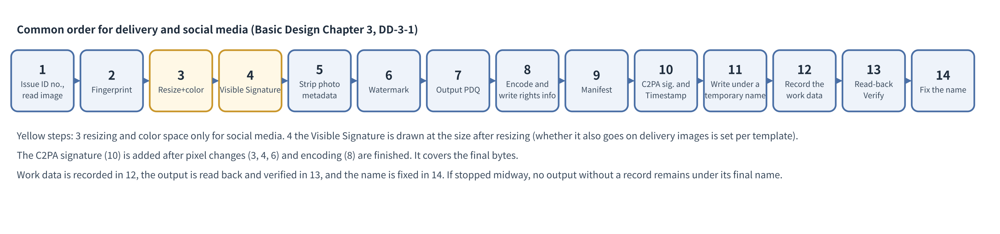

# Basic Design Document Chapter 3: Signing

Anti-Repost Tool for Cosplay Photos  Edition 1 (Draft)  2026-09-29 · Ishikawa Sou  
Nagareyama Software Development Co., Ltd. (NRSD)  
Word version: [03_Basic Design_Signing.docx](03_Basic%20Design_Signing.docx)

© 2026 Nagareyama Software Development Co., Ltd. (NRSD), Lead Developer: Ishikawa Sou (石川宗). Copyright in this document belongs to Nagareyama Software Development Co., Ltd. (NRSD). Rights in the third-party standards, software, commentaries on laws, and other materials referred to in this document belong to their respective holders. This is a translation of the Japanese original; where they differ, the Japanese original prevails.

---

## Position of This Document

- Details Chapter 3 of the Outline Design Document. The chapter name “Signing” is the name of a block in Design Plan 4.2 “System Blocks”, and refers to C2PA signing, trusted timestamps, invisible watermarks, matching hashes, and the assignment and recording of identification numbers. It goes back and forth with Chapter 5 (recording the Permitted Scope) and Chapter 11 (libraries and runtime) (Chapter 3 with Chapter 5, and Chapter 3 with Chapter 11).
- The decisions received are as in the following table (the decisions, items to be investigated, and open items of Design Plan Edition 2, and omissions found in the item breakdown). The texts of the Design Plan's decisions, items to be investigated, and open items are per Chapter 13, 1.2 “Mapping from Design Plan decisions to the Outline Design Document and basic design” and the destination table of the Outline Design Document (not reproduced in this chapter; only the numbers and the omissions found in the item breakdown are listed).

|Number|Type|Content|
|---|---|---|
|A-3|Omission found in the item breakdown|Checking whether C2PA signatures survive on Cloud|
|A-8|Omission found in the item breakdown|Removal of shooting information (location, etc.)|
|A-15|Omission found in the item breakdown|Risk of real names appearing in C2PA signatures|

- The references are as in the following table.

|Reference|What is referred to|
|---|---|
|Research Materials “Technical Elements of Signing”|Facts about the C2PA, TrustMark, and PDQ components|
|Research Materials “Retention of C2PA on Posting Sites and Cloud”|Whether C2PA signatures remain on posting sites and in the cloud|
|Legal Research L-1“Removal or alteration of rights management information (Japan)” to L-4“Protection of rights management information (treaty) (international)”|Removal and alteration of rights management information (Japan, China, the United States, treaties)|
|Chapter 1, 8.2 “Identifier scheme”|Format of identification numbers|
|Chapter 2, 3 “Certificates”|Signing certificate|
|Chapter 11 “Development Base”|Components used for C2PA, watermarks, PDQ, and image reading/writing|

## 1. List of Design Decisions

|Number|Decision|Reason|Rejected alternatives|
|---|---|---|---|
|DD-3-1|The processing order is: “issue the identification number and load; then the Original's fingerprint; then (social media only) resizing and color space conversion; then the Visible Signature (if included; drawn at the size after resizing); then removal of shooting information; then the invisible watermark; then the output's PDQ; then encoding (into JPEG or other bytes) and the file's rights statement (3.6); then creating the manifest; then C2PA signing (with a timestamp; the manifest is embedded in the encoded bytes); then writing under a temporary name; then the output's SHA-256; then recording the work data; then the read-back check; then finalizing the output's name”|C2PA hard binding is computed over the final bytes, so all processing that changes pixels (Visible Signature, resizing, watermark), encoding, and writing XMP are finished before C2PA signing. The watermark is embedded at the final size (resizing does not damage it)|Embedding the watermark first and resizing afterwards|
|DD-3-2|The watermark is TrustMark variant Q with BCH_5 error correction (61 data bits), and the identification number (Chapter 1, 8.2 “Identifier scheme”) goes in the data part. If [To be measured] shows the read rate after social media recompression does not reach the criterion, switch to variant P or C|It is on the C2PA list of soft bindings (com.adobe.trustmark.Q; Research Materials “Technical Elements of Signing”, Section 2). 61 bits hold the identification number, and errors up to 5 bits can be corrected (TrustMark's datalayer.py)|BCH_SUPER (40 bits; the number space becomes narrow and no longer unique; Chapter 1, 8.2 “Identifier scheme”)|
|DD-3-3|The manifest records the User's handle name, identification number, Permitted Scope, hash of the Enclosed Document, joint rights holders, and the presence of the watermark, and does not record names, location, device serial numbers, or e-mail. Author name, copyright notice, and terms of use go in `cawg.metadata`, the author's identity in `cawg.identity`, and the System's own items in `jp.nrsd.rights`|It meets the requirements for rights management information (Legal Research L-1“Removal or alteration of rights management information (Japan)”: information on copyrights and the like used for management by computer) while not making personal information public (A-15“Risk of real names appearing in C2PA signatures”). `c2pa.metadata` in C2PA 2.x allows only fixed fields, and author name and copyright notice cannot be placed there (C2PA specification 2.4, Appendix B.2). This restriction does not apply to `cawg.metadata` (CAWG metadata 1.0)|Putting the author name and the like in `c2pa.metadata` (contrary to the specification)|
|DD-3-4|For the Original, the file's SHA-256 is recorded whether or not its pixels can be read, and the Original's SHA-256 is placed as an ingredient in the manifest|Only the one who has the Original can later present a file with the same SHA-256 (Chapter 2, 4.2 “Original”, proof of possession of the Original). The Original itself is not included in the output|Including a thumbnail of the Original (the Original's content would leak)|
|DD-3-5|The timestamp is obtained at C2PA signing (when online). Offline outputs are C2PA-signed without a timestamp, and at the next connection a timestamp is obtained on the output's SHA-256 and attached to the work data|Reconciles D-7-1“A C2PA signature is attached to every image output” (C2PA signatures on all outputs) with DD-1-7“C2PA signing, editing, export, and Registration work offline” (work can be done offline)|Not C2PA-signing when offline|
|DD-3-6|Whether to put a Visible Signature on Delivery Images (O-11“Visible Signatures on Delivery Images”) is decided by giving each Visible Signature template an “also include on delivery” setting. No app-wide default is set|Whether to include it depends on the Visible Signature's design (size, position, content) (NRSD's decision). Some designs are modest ones for social media only; others may also go on delivery images|Including / not including by app default|
|DD-3-7|The version of the C2PA specification follows the version output by the adopted c2pa-rs version, and is recorded together with the app version. Verification accepts 2.x manifests|Choosing the specification version on our own would diverge from the SDK. 2.4 is the latest (Design Plan Chapter 17 “Third-Party Rights and Licenses”)|—|
|DD-3-8|In output files, separately from the C2PA manifest, the rights fields of IPTC photo metadata (creator, credit, copyright notice, URL of rights information, usage terms, licensing contact) are written as XMP, and EXIF Artist and Copyright are given the same content. They are written before C2PA signing|Photography industry tools (development software, OS file property views) and search (license display in Google Images) read IPTC/XMP/EXIF fields, not C2PA manifests. The Rights Holder is conveyed even to those who do not read C2PA. C2PA hard binding covers the file's bytes, so writing is finished before signing|Writing only inside the manifest (cawg.metadata) (invisible to tools that do not read C2PA)|

## 2. Input

|Input|Handling|
|---|---|
|JPEG, PNG, TIFF, WebP|Read the pixels and process|
|RAW, HEIC, others|Pixels are not read. The SHA-256 is recorded as the Original (Original's fingerprint only). The User is told it cannot be used for output (Chapter 11, DD-11-5“Image reading and writing use the image crate”)|
|Broken images|Skip that one image and show the reason in the list. The batch continues|
|Images too large (over 100 million pixels or over 200 MB)|Skip that one image and show the reason (Chapter 1, 14.1 “Scale and performance targets”)|
|Grayscale, with alpha, CMYK|Grayscale is expanded to RGB for processing, and the output is RGB too (the bit depth is kept). Alpha is kept, and the watermark and Visible Signature go into the RGB planes. For CMYK TIFFs the pixels are not read and only the Original's fingerprint is taken; the User is guided to develop into an sRGB or Adobe RGB photo first|
|Images that already have a C2PA signature|Verify the manifest and handle as follows (Chapter 2, 4.6 “Exporting images that carry someone else's C2PA signature”). ① The User's own C2PA signature (current personal root or a past personal root; Chapter 2, 3.6 “Past personal roots”): import as an ingredient and link the history to the new output. ② A C2PA signature from a camera or development/editing software (C2PA-capable cameras, Content Credentials of Lightroom/Photoshop, etc.) without a person's identity record (CAWG identity record `cawg.identity`, the System's `jp.nrsd.rights`): import as an ingredient (parentOf) and link to the history without erasing the previous C2PA signature. The previous signer is visible to verifiers. Because ingredient manifests are bundled in the output's manifest store and made public, the metadata assertions of ingredient manifests that may contain location, model, and serial numbers (`c2pa.metadata`, and in older versions `stds.exif` and `stds.iptc`) are redacted (3.8 “Redaction of ingredient manifests”). ③ A C2PA signature with another person's identity record, where an authorization or joint-rights document with that person has been imported (Chapter 2, 5 “Authorizations and Joint Rights”): import as an ingredient and name that person. ④ A C2PA signature with another person's identity record, with no relationship: not processed (so the app is not used for prior C2PA signing or replacement; D-5-3“Acts of a person posing as the Rights Holder (signing first, replacing signatures, and reverse complaints) are treated as impossible to prevent; clues for matching are presented. No judgment is made”). The reason “This has someone else's C2PA signature” is shown. ⑤ If the manifest has a code indicating tampering (`claimSignature.mismatch`, `assertion.dataHash.mismatch`, etc.; 10.2): not processed (C2PA-signing over an image whose provenance cannot be confirmed cannot be distinguished from overwriting someone else's C2PA signature). The User is told to process again from the Original. That the signer is not on a trust list (`signingCredential.untrusted`) is not a condition of Valid (C2PA 2.4, 14.3.5 “Valid Manifest”) and is not a reason to stop (the User's own past outputs also have this code). Being outside the certificate's validity (`claimSignature.outsideValidity`) does not indicate tampering; it is handled as in ① to ④, and “The certificate used for signing has expired” is shown (Chapter 2, 3.4 “Expiry and input errors”)|
|Orientation (EXIF Orientation)|Rotate the pixels to the correct orientation before processing, and set Orientation to “as is” in the output|
|Color (ICC profile)|Kept. Photos without an ICC whose EXIF ColorSpace is Uncalibrated and InteropIndex is `R03` are treated as Adobe RGB (the Exif convention; the DCF extended color space). Not converted even if not sRGB (social media output in Chapter 4 is converted to sRGB; Chapter 4, 14.3 “Resizing, color conversion, and JPEG export”)|

- Memory limit: before the pixels are read, an estimate of one image's memory (height × width × bytes per pixel: 4 for 8-bit RGBA, 8 for 16-bit RGBA) is made from the width, height, and bit depth in the header, and the loading limit is set to that value (image's default limit of 512 MiB is not enough for large 16-bit photos. 100 million pixels is about 381 MiB in RGBA8 and about 763 MiB in RGBA16; 60,000,000 pixels is about 229 MiB and about 458 MiB).
- Threat T-19 (elevation of privilege): exploiting vulnerabilities in the app core with malicious fonts or images. Attacker: the party handing over the file. Target asset: app core. Remaining gap: unknown vulnerabilities in components

## 3. C2PA Manifest

### 3.1 Fields recorded

|Assertion|Content|
|---|---|
|c2pa.hash.data|Hard binding over the output's bytes (computed by the SDK)|
|c2pa.actions.v2|The operations in the table in 3.4. Each operation records this app's name and version|
|c2pa.ingredient.v3|Original: relationship parentOf, format (`dc:format`). No thumbnail (DD-3-4“The Original's SHA-256 is recorded and listed as an ingredient”). The ingredient record (ingredient v3) has no fields for SHA-256 or pixel size, so the Original's SHA-256 and pixel size are placed in `jp.nrsd.rights`|
|c2pa.soft-binding|Algorithm `com.adobe.trustmark.Q` (or `com.adobe.trustmark.P` / `.C` if switched after measurement; the names in the C2PA list of soft bindings). The format of the value (`value` in `blocks`) is set by the algorithm (C2PA 2.4, 18.10.2). The System puts in the bit string TrustMark embeds (the 61 bits of the identification number and the error correction code) in the form TrustMark specifies. [To be measured] the form of the value written by the c2pa-rs and TrustMark implementations|
|cawg.metadata|`dc:creator`, `dc:rights`, `xmpRights:UsageTerms`, `xmpRights:WebStatement` (the values are the same as in the table in 3.6 “The file's rights statement (IPTC photo metadata)”)|
|c2pa.metadata|Not recorded (it does not allow author or rights fields; C2PA specification 2.4, Appendix B.2). Only if the shooting date/time is kept, `exif:DateTimeOriginal` (an allowed field) is placed|
|jp.nrsd.rights (the System's own; the label is NRSD's domain nrsd.jp reversed)|Identification number, ISCC (6), the Original's SHA-256 and pixel size, the ID and version of the Permitted Scope, the SHA-256 of the Enclosed Document (delivery only), joint rights holders' handle names, the principal Rights Holder (for outputs of authorized persons), the version of the reference information, the SHA-256 of each wording file of the reference information used, the shoot name (to recover it from the portable name of 10.1; the original file name may contain a real name and the like, so it is not put in the public manifest and is kept only in the work data and `00_INDEX.txt`) (NRSD's request, 2026-09-30)|
|cawg.identity|X.509 (`cawg.x509.cose`). The CAWG signature is made with the signing certificate. Role: photographers `cawg.creator`, cosplayers the custom role `jp.nrsd.subject` (the current version 1.3 of the CAWG identity assertion recommends choosing roles from defined values but also allows other values; checked at cawg.io on 2026-09-30), authorized persons `cawg.publisher`|
|c2pa.thumbnail.claim|A reduced image of the output (a reduction of the output itself, so it is information that may be public; C2PA 2.4, 18.13)|
|(Attributes of the claim)|`claim_generator` = `c2pa4cosplayer/<version>`, `title` = the portable name (10.1; the original name is not included), the ingredient's `instance_id` = `xmp:iid:<UUID v7>` (the form of XMP identifiers)|
|cawg.training-mining|Whether AI training and data mining are allowed. By default all four of `cawg.data_mining`, `cawg.ai_inference`, `cawg.ai_training`, `cawg.ai_generative_training` are `notAllowed`. Changed only if the User chooses in the Permitted Scope (Chapter 5 “Rights Documents”) (sources: cawg.io/training-and-data-mining/1.1/, the description of assertions at opensource.contentauthenticity.org)|

- Claim signature (C2PA signature): the signing certificate (Chapter 2, 3 “Certificates”), ES256. The response of the timestamp (RFC 3161) is included in the C2PA signature (when online).
- The specification recommends letting the creator control which provenance data are included (Research Materials “Technical Elements of Signing”, Section 1). This app uses the table above as the default, and the only thing the User can turn off is “recording of shooting date/time and model” (fields needed to assert rights cannot be turned off).

### 3.2 Fields not recorded

- Names, e-mail, address, location (GPS, place names), device and lens serial numbers, owner names (EXIF Artist and the like are deleted and replaced with the handle name).
- These fields in the manifests of other C2PA signatures imported as ingredients (cameras, development/editing software) are also kept out of the output by the redaction in 3.8.

### 3.3 Language of rights statements

- The copyright notice is in a language-independent form (©, year, handle name).
- The summary of the terms of use defaults to English; if the User's screen language is Japanese or Chinese, a summary in that language is also included (`xmpRights:UsageTerms` can hold several entries with language tags).

### 3.4 Recording of actions

|Processing|Action name|Digital source type (digitalSourceType)|Reason|
|---|---|---|---|
|Opening the Original|`c2pa.opened` (the first action; points by hashed-uri to the Original's ingredient record `c2pa.ingredient.v3`)|None (C2PA 2.4: `c2pa.opened` needs no digital source type)|Shows the relation to the ingredient (the Original). C2PA 2.4 requires a reference to the opened ingredient record in the `ingredients` of `c2pa.opened`|
|Resizing (social media)|`c2pa.resized.proportional`|None (an exempt action)|Resizing that keeps the aspect ratio (a name added in C2PA 2.3). `c2pa.resized` broadly covers changes in size and file size (“Changes to either content dimensions, its file size or both”) and is not an exempt action, so the more limited name is used|
|Drawing the Visible Signature|`c2pa.edited`|`http://cv.iptc.org/newscodes/digitalsourcetype/humanEdits` (changes made by a person with non-generative tools)|The C2PA conformance criteria (asset-rubrics/composables/globals-actions.yml in c2pa-org/conformance-public) require a digital source type for actions not on the exempt list. The specification text requires a digital source type only for `c2pa.created` (18.15.2). The System does not seek conformance (Conformance Program) but follows these criteria. Text and image layers are placed by the User, and auto-placement with u2netp only chooses positions and does not generate pixels, so the generative AI types (`trainedAlgorithmicMedia`, `compositeWithTrainedAlgorithmicMedia`, `compositeSynthetic`) do not apply|
|Invisible watermark|`c2pa.watermarked.bound` (points to `c2pa.soft-binding` with `relatedAssertions` in `parameters`)|None (an exempt action)|C2PA 2.3 (December 2025) added `c2pa.watermarked.bound` for “watermarks that create a soft binding” and `c2pa.watermarked.unbound` for those that do not, and 2.4 deprecated `c2pa.watermarked`. The System's watermark records the identification number in a soft binding, so `.bound` is used. Validators reject with `assertion.action.softBindingMissing` if `.bound` (or the old `c2pa.watermarked`) is present but `c2pa.soft-binding` is absent. If the adopted c2pa-rs version can only write in the 2.2 form, `c2pa.watermarked` is used (DD-3-7“The C2PA specification version follows the c2pa-rs version”)|
|Removal of shooting information and the file's rights statement (the XMP and EXIF of 3.6 “The file's rights statement (IPTC photo metadata)”)|`c2pa.edited.metadata`|None (an exempt action)|A metadata-only change that does not alter pixels|
|Normalizing orientation (when EXIF Orientation is not “as is”)|`c2pa.orientation`|`humanEdits`|Rotates the pixels to the correct orientation (table in 2). Not an exempt action, so a digital source type is given|
|Color space conversion (social media, when not sRGB)|`c2pa.adjustedColor` (`description`: “conversion to sRGB”)|`humanEdits`|The conversion to sRGB of Chapter 4, 14.3 “Resizing, color conversion, and JPEG export”|
|Encoding (step 8 of 8.1; both delivery and social media; includes re-encoding in the same format and format conversion to make a social media JPEG from a non-JPEG Original)|`c2pa.transcoded`|None (an exempt action)|Re-encoding. Falls under the specification's definition “A conversion of one encoding to another, including resolution scaling, bitrate adjustment and encoding format change”|
|Redaction of ingredient manifests (when an ingredient has another C2PA signature)|`c2pa.redacted` (`reason`: `c2pa.PII.present`)|None (an exempt action)|3.8 “Redaction of ingredient manifests”|

- Overall: `allActionsIncluded` of the actions record is set to true (showing that all actions this app performed are recorded; C2PA 2.4, 18.15.3 recommends setting it and says that without it there may be actions not recorded). To make it true, the table above lists all processing this app performs on pixels, format, and metadata (the steps of 8.1). When a step is added, an action is added to this table.
- Sources: C2PA technical specification 2.4, 18.15 “Actions” (checked in the original: deprecation of `c2pa.watermarked`, the definitions of `.bound` and `.unbound`, `c2pa.opened` and the reference to ingredients, `allActionsIncluded`, examples using `humanEdits` as a digital source type), 18.14 “Actions” of 2.2 and the list of actions of 2.3 (that `.bound`, `.unbound`, and `c2pa.resized.proportional` were added in 2.3 was confirmed by comparing the texts of 2.2 and 2.3), and the conformance criteria (globals-actions.yml of conformance-public, obtained 2026-09-30; actions not requiring a digital source type: `c2pa.converted`, `c2pa.published`, `c2pa.repackaged`, `c2pa.transcoded`, `c2pa.resized.proportional`, `c2pa.enhanced`, `c2pa.edited.metadata`, `c2pa.watermarked`, `c2pa.watermarked.bound`, `c2pa.watermarked.unbound`, `c2pa.redacted`). The exempt list may be revised, so it is confirmed that verification with the adopted c2pa-rs version gives no warnings ([To be measured]).
- Source for digital source types: the IPTC Digital Source Type vocabulary (cv.iptc.org/newscodes/digitalsourcetype/, obtained 2026-09-29; `minorHumanEdits` has been retired, and `humanEdits` stands for “corrections and enhancements by a person with non-generative tools”).
- Reason for not giving generative AI types: posting sites may read the C2PA and IPTC digital source type and attach an “AI-generated” label. In China, under the Measures for Labeling AI-Generated Synthetic Content (in force September 1, 2025) and GB 45438-2025, posting sites check AI labels in file metadata. Generative AI types are not given so that Users' photos are not labeled AI-generated (Legal Research L-30“Labeling of AI-generated and synthesized content (China)”).

### 3.5 Where the timestamp is placed

- The timestamp is placed in the unprotected header `sigTst2` (version 2 timestamp) of the C2PA signature (COSE signature), in `tstContainer` form (C2PA technical specification 2.1 and later). The time applies to the signature value. The timestamp request and the verification of the response are done by the in-house implementation described in 4, which is passed to c2pa-rs's signing entry point (the Signer's function that sends the timestamp request), and c2pa-rs places the result in `sigTst2`.

### 3.6 The file's rights statement (IPTC photo metadata)

|IPTC field (2025.1)|XMP field|Content|
|---|---|---|
|Creator|`dc:creator`|Handle name (both, if there is a joint rights holder)|
|Credit Line|`photoshop:Credit`|“{handle name} ({Notice account})” (the first one if there are several Notice accounts)|
|Copyright Notice|`dc:rights`|“© {year} {handle name}” (same as `dc:rights` in cawg.metadata)|
|Web Statement of Rights|`xmpRights:WebStatement`|The URL of rights information on the public page (`/rights/` of Chapter 5, 5 “Countries”)|
|Rights Usage Terms|`xmpRights:UsageTerms`|Summary of the Permitted Scope (per language; 3.3)|
|Licensor (Licensor URL)|`plus:LicensorURL` of `plus:Licensor`|The Notice account URL (where to ask for permission to use; if there are several, all of them as an array of `plus:Licensor`. IPTC's Licensor allows an array)|
|— (EXIF)|EXIF `Artist`, `Copyright` (written in the UTF-8 type of Exif 3.0 (CIPA DC-008-2023). Japanese and Chinese handle names go in. Synchronization with IPTC follows the IPTC-CIPA Photo Metadata Mapping Guidelines. For readers that do not know Exif 3.0, the same XMP fields are authoritative (NRSD's request, 2026-10-01))|Handle name, “© {year} {handle name}”|

- Sources: IPTC Photo Metadata Standard 2025.1 (iptc.org; XMP field names of each field). Google Images uses Web Statement of Rights as required and Creator, Credit Line, Copyright Notice, and Licensor URL as recommended for license display (Google's guide “Image license metadata”).
- Order of writing: after the removal of shooting information (8.4) and before C2PA signing (before “creating the manifest” in DD-3-1“Defines the processing order”). Other existing XMP fields (shooting date/time and those of model names that are kept) are kept.
- Also written on social media images (often removed by posting sites, but for routes where they are not removed and for the User's own checking).
- Fields not written: names, e-mail, address (3.2). The phone and e-mail fields of `plus:Licensor` are not used.

#### 3.6.1 Writing per format

- Components (checked on crates.io on 2026-09-30):

|Format|Where XMP goes|Where EXIF goes|Component|
|---|---|---|---|
|JPEG|APP1 segment (namespace `http://ns.adobe.com/xap/1.0/`)|APP1 segment (`Exif`)|Segments are inserted with img-parts 0.4.0 (reads/writes JPEG, PNG, RIFF chunks; pure Rust; MIT OR Apache-2.0). The EXIF content is made with little_exif 0.6.23 (pure Rust; MIT OR Apache-2.0)|
|PNG|`iTXt` chunk (keyword `XML:com.adobe.xmp`)|`eXIf` chunk|img-parts, little_exif|
|WebP|RIFF `XMP ` chunk|RIFF `EXIF` chunk|img-parts, little_exif|
|TIFF|Tag 700 (XMP)|Tags 315 (Artist), 33432 (Copyright)|Written as custom tags when encoding with the tiff component (used by image)|

- The XMP content (the RDF/XML packet) is made by this app. The fields are only the six in the table above and the shooting fields kept.
- The Rust wrapper of Adobe's XMP Toolkit (xmp_toolkit 1.12.1) is not adopted because it requires building C++ components (the same thinking as Chapter 11, DD-11-15“c2pa-rs does not bring in OpenSSL”).
- [To be measured] That after writing XMP and EXIF, c2pa-rs embeds the manifest, the XMP and EXIF segments remain, and C2PA signature verification passes (four formats).

### 3.7 Embedding per format

|Format|Embedding|
|---|---|
|JPEG|Embedded in APP11 segments (JUMBF) (done by c2pa-rs)|
|PNG|Embedded in a `caBX` chunk (same)|
|TIFF, WebP|Depends on c2pa-rs support (on the c2pa-rs list of supported formats). [To be measured] that embedding and verification work with 16-bit TIFF|

- Placing the manifest in a separate file (`.c2pa`) is not used, because if files get separated along the delivery route only the image is passed on.

### 3.8 Redaction of ingredient manifests

- Ingredient manifests are bundled in the output's manifest collection (Manifest Store) and made public together with the output (`activeManifest` of the ingredient record `c2pa.ingredient.v3`). The `c2pa.metadata` of a camera's C2PA signature may contain location (GPS), model, and serial number (C2PA 2.4, 18.16, Example 16). The removal of shooting information in this document (8.4) covers only the output's EXIF and XMP, so the ingredient manifests also need attention.
- Procedure: when importing as an ingredient, the URIs of the metadata assertions in the ingredient manifest (`c2pa.metadata`, and in older versions `stds.exif` and `stds.iptc`) are listed for redaction (`ManifestDefinition::redactions` in c2pa-rs), and `c2pa.redacted` is added to the output's actions (with those URIs in `redacted` in `parameters`, and `c2pa.PII.present` in `reason`) (C2PA 2.4, 6.8 “Redaction of Assertions”, 18.15.4.2, 18.15.4.7).
- Scope: for all manifests an ingredient brings in (the ingredient's current manifest and the earlier manifests it references as ingredients, traced to the deepest nesting; e.g., importing a Lightroom output also brings the camera's manifest inside it into the output's manifest collection), the metadata assertions are listed for redaction. The manifest collection holds nested manifests flattened side by side, so redaction URIs can point directly to the assertions of each manifest (C2PA 2.4, 6.8, 11 “Manifests”). [To be measured] that c2pa-rs can handle redaction of assertions in deeply nested manifests. If it cannot, that ingredient is not imported, and “The provenance of this photo may contain location information, so please export from the Original” is shown.
- Not redacted: the actions records of ingredient manifests (`c2pa.actions`, `c2pa.actions.v2`; the specification prohibits their redaction), hard bindings, and signers' certificates. The previous signer (a camera manufacturer's certificate, etc.) is visible to verifiers.
- Even if the User chooses to keep “recording of shooting date/time and model” (the note after 3.1), the metadata of ingredient manifests is redacted (redaction has no way to pick out and keep location and serial number field by field; redaction is per assertion). The shooting date/time and model are written by this app in `c2pa.metadata` (`exif:DateTimeOriginal`) of the output's manifest and in the output's EXIF.
- [To be measured] With outputs from C2PA-capable cameras (Leica, Sony, Nikon, etc.) and Lightroom, check which assertions contain location, model, and serial numbers, and revise the list of redaction targets.

## 4. Trusted Timestamps

- TSAs at C2PA signing: timestamps are requested in parallel from the three of DigiCert (timestamp.digicert.com), GlobalSign, and FreeTSA (free, RFC 3161; Research Materials “Technical Elements of Signing”, Section 4) (the request is SHA-256 with a nonce, `certReq` true, no policy specified; the RFC 3161 defaults), and the responses of all TSAs that respond are saved. The one placed in the C2PA signature's `sigTst2` is the first obtained, and the rest are attached to the `tsa` of the work data (NRSD's request, 2026-09-30). Creating requests and verifying responses are implemented in-house (RustCrypto's der, x509-cert, and cms; Chapter 11, 4.1), and the list of TSAs is kept in the reference information's `tsa.json` (a row has `id`, `name`, `url`, `roots` (PEM), `kind` (`free` or `paid`), `auth` (`none` or `basic`), and `order`), with the first version bundled in the app (so that a change in a TSA's URL or anchor does not wait for an app update; the same as Mozilla's distribution of roots). Certificate chains are checked against the trust anchors. The RFC 3161 test vectors are run in CI (Chapter 11, 8.1).
- Paid TSAs (for evidence; Chapter 6, 3.2 “Trusted timestamps”) are handled over the same RFC 3161 HTTP, and those whose `auth` in `tsa.json` is `basic` get HTTP Basic (RFC 7617) authentication. No provider-specific API is used (the accredited timestamps of Amano and Seiko and the trusted timestamp (可信时间戳) of UniTrust are all described by the providers as RFC 3161 compliant; checked 2026-10-01). Accounts (URL, user name, passphrase) are kept in the OS keystore (`tsa-<provider number>` of Chapter 2, 7.5).
- The C2PA TSA trust list (C2PA-TSA-TRUST-LIST.pem in c2pa-org/conformance-public; obtained September 29, 2026; 22 entries) does not include the trust anchors of the three TSAs above. An actual timestamp response from timestamp.digicert.com chained to “DigiCert Trusted Root G4”, not to “DigiCert … Root for C2PA G1” on the list. Using a TSA on the list (SSL.com, etc.) requires a C2PA conformance record (conformance record ID) (SSL.com's guide).
- Therefore, the timestamps are valid as RFC 3161 evidence of time, but are not treated as trusted time by C2PA validators. C2PA 2.4, 15.8.2 says that a timestamp whose TSA certificate cannot be chained to the TSA trust list (or to trust anchors placed in the validator for this purpose) is ignored as `timeStamp.untrusted`, and the validity of the signing certificate is checked against the time of checking. The test settings of the CAI (Content Authenticity Initiative) open-source SDK, the examples in c2patool's documentation, and the default TSA of a C2PA tool for individuals (ProofMode) also use the same general-purpose TSA (timestamp.digicert.com) (c2pa-rs itself has no default TSA). ProofMode makes the end-entity certificate valid for one year and is an example with the same expiry problem; it is not support for the decision to make certificates long-lived (Chapter 2, DD-2-11“Certificate validity is long enough that every image is shown valid for 20 years from signing”). The reasons for making them long-lived are that the specification sets no upper limit and that, unless timestamps are trusted, there is no means of extending validity.
- Using a TSA on the C2PA trust list is described as requiring a C2PA conformance (Conformance Program) record, and the Design Plan has not decided whether NRSD joins it, so this document uses free TSAs. SSL.com's TSA for C2PA (ts-c2pa.ssl.com) also responds to unregistered requests (checked 2026-09-30), but the company's page setting the conditions of the free tier presumes a conformance record, and there is no explicit permission for use without registration, so it is not used. If a TSA appears that is on the trust list and explicitly allows use without registration, it is added at the top of the sources in an app update.
- The expiry problem caused by timestamps not being trusted is handled by making certificates long-lived (Chapter 2, DD-2-11“Certificate validity is long enough that every image is shown valid for 20 years from signing”). What remains is declared as a gap (13).
- Why Chinese TSAs (trusted timestamps) are not used for the timestamp of C2PA signatures: they are paid and require a contract per User (Chapter 6, 3.2 “Trusted timestamps”). [To be measured] whether Users in mainland China can also reach the free TSAs above (if not, it becomes deferral and later attachment (below)).
- Deferral and later attachment (DD-3-5“Timestamps are taken at C2PA signing, or later when offline”): for offline outputs, “no timestamp” is recorded in the work data, and at the next connection a timestamp is obtained on the output's SHA-256 and attached to the work data. The manifest is not rewritten (changing it after the output has been distributed would make it differ from the distributed images).
- The heads of the chains of all records on the device (Chapter 1, 8.3) are timestamped once a day (initial value) and at each connection. One timestamp proves the existence of all records up to that point, and records made offline are all proved at once at the next connection (timestamps per work and per case continue as now) (NRSD's request, 2026-09-30).
- These bundled timestamps are held in the form of RFC 4998 Evidence Record Syntax (ERS) (a hash tree and Archive Timestamps), and the renewal defined by ERS (wrapping old timestamps in a new one) is done automatically one year (initial value) before the expiry of the TSA's certificate and when a hash algorithm weakens. No User operation is needed. Experts can check the chain of proofs with ERS tools (Chapter 6, 3.2) (NRSD's request, 2026-10-01).
- Timestamps for evidence (Chapter 6 “Registration and Evidence Preservation”): the use of trusted timestamps in China (可信时间戳) and of businesses accredited by the Minister for Internal Affairs and Communications (Japan) is set in Chapter 6 “Registration and Evidence Preservation” (paid; [Estimate required]).
- Threat T-10 (spoofing): fake timestamp responses. Attacker: a party in the middle of communication. Target asset: proof of time. Remaining gap: —

## 5. Invisible Watermark

- Method: DD-3-2“The watermark is TrustMark and carries the identification number”. The invisible watermark is put on both social media and Delivery Images (so that a leaked Delivery Image can also be traced).
- Relation to appearance (R-3-4-2): TrustMark changes pixels. The PSNR is about 50 dB on sample images (Research Materials “Technical Elements of Signing”, Section 2), a change hard for the human eye to notice. “This processing makes no change to the appearance of the photo” in Section 4 of the Draft Project Proposal and “processing that makes no change to the appearance” in Figure 3 of the Design Plan are to be read as “processing that makes no visible change” (a correction to the Outline Design Document).
- [To be measured] Read rate: the proportion of images in which the identification number is correctly read after posting to X, Instagram, Weibo, Xiaohongshu, and Patreon and downloading again, and after JPEG quality 70, halving, and 20% cropping. Criterion: 90% or more for each condition. Conditions that are not met are declared as gaps and supplemented by the matching hash (PDQ).
- Reading is tried in the same 8 orientations as PDQ for matching (Chapter 6, 4; G-13), and only in the original orientation for the read-back check (step 13 of 8.1) (TrustMark is not rotation-invariant). The embedding strength is TrustMark's default. ONNX inference uses min(4, number of logical cores) intra-op threads, one shared session, at most two images inferred at the same time (memory limit), released 5 minutes after last use (combined with the memory limit of Chapter 4, 14.4).
- The watermark model and ONNX Runtime are checked at every start against the bundled SHA-256 embedded in the app; if replacement is detected, processing stops as an anomaly detection and no output without a watermark is made (Chapter 11, DD-11-14“Hashes and minimum versions of ONNX Runtime components are checked”). ONNX Runtime is loaded dynamically, and of the watermark and auto-placement models only the one in use is loaded and managed under the memory limit (Chapter 4, 14.4) (NRSD's request, 2026-09-30).
- 16-bit images (TIFF and PNG for delivery): because TrustMark assumes 8-bit RGB, the watermark is embedded in an 8-bit copy, the residual (after embedding − before) is taken, multiplied by 257, and added to the 16-bit pixels (keeping 16 bits). Reading is done after reducing to 8 bits. The read rate is checked in an early prototype of the implementation (Chapter 13, 5.1).
- Processing time criterion (R-3-4-3): the total of C2PA signing, invisible watermark, and hash computation within 10 seconds per image (on the typical PC of Chapter 1, 14.1 “Scale and performance targets”). [To be measured] TrustMark's CPU inference time.
- Risk: TrustMark watermarks unreadable after social media recompression. Impact: fewer matching clues. Preparation: measurement (Chapter 3)

## 6. Matching Hash

- The output's PDQ is always computed and recorded in the work data (the pixels after the watermark and Visible Signature have been added).
- In addition, the ISCC of ISO 24138:2024 (International Standard Content Code; the image Content-Code, Data-Code, and Instance-Code) is computed and recorded in the work data and in `jp.nrsd.rights` of the manifest (iscc-lib). Matching (Chapter 6, 4) uses both PDQ and ISCC. It can be compared directly with posting sites, search, and registration systems that read ISCC. The identification number (the random work number) is unchanged (NRSD's request, 2026-10-01).
- If the Original is in a format whose pixels can be read, the Original's PDQ is also recorded.
- PDQ is recorded only in the work data on the User's device. Matching against other Users' works is not done (no central index is kept; D-5-1“The System does not confirm Users and collects no User information. No registration is required in order to use the System”).
- The guide for a match is a Hamming distance of 31 or less (Research Materials “Technical Elements of Signing”, Section 3). A paper evaluating PDQ (Dalins et al., arXiv:1912.07745) gives 128 as the mean distance between two random images and uses 30 or less as the guide for the same content. The degree of match is shown in Chapter 6 “Registration and Evidence Preservation” as the “match level”.
- Handling rotation and flipping: PDQ can output hashes for the 8 variants of 90-degree rotations and flips (original, 90°, 180°, 270°, vertical flip, horizontal flip, 90° with vertical flip, 90° with horizontal flip) (description of PDQ in facebook/ThreatExchange). Only the hash in the original orientation is recorded in the work data; at matching, the 8 hashes of the reposted image are computed and the minimum distance to the record is taken. Images reposted after rotation or flipping can also be matched.
- ISCC matching is exact equality of the Content-Code (image) (ISO 24138 sets no distance threshold; matching by distance is PDQ's role). The Data-Code and Instance-Code are only recorded and not used for matching (they change with recompression).
- Quality score: PDQ outputs a quality score from 0 to 100 (not similarity, but how much usable structure the image has). Hashes of images with a quality score below 50 (initial value) (nearly single-color images, etc.) are not used for matching, and they are shown as “images not suited to matching”.

## 7. Identification Numbers and Work Data

### 7.1 Identification number

- Issuer: the app (the User's device). At output, a 61-bit random number is created and displayed by the rules of Chapter 1, 8.2 “Identifier scheme”. The “GUI for obtaining identification numbers” in Section 9 of the Draft Project Proposal is satisfied by the app's output screens (Chapter 10, G-11“Export: Run and Results”, G-12“Works”) showing the number so it can be copied. Central issuing is not needed (uniqueness: Chapter 1, 8.2 “Identifier scheme”).
- Recording: always put automatically in the manifest and the invisible watermark. Whether to add it after the saved file name of social media output (`<original name>_<identification number>.<extension>`) is chosen by the User at export (Chapter 10, G-08“Export: Photos and Purpose”; the initial value is to add it, and afterwards the previous choice). Delivery file names always include the identification number (10.1). The app's screens (G-11“Export: Run and Results”, G-12“Works”) always show the identification number. To write the number in a caption, the User copies it from the screen (this app does not post). In hashtag (`#`) form it may be cut at the separator `-` on some posting sites, so Users are guided to write the number as is (without `#`).
- The identification number is the same value as the “matching number” and “work number” of the Draft Project Proposal (Chapter 1, 8.2 “Identifier scheme”).
- An issued number is checked against all work data on the device, and remade if it collides (the probability is small as in Chapter 1, 8.2, but the check costs nothing).
- The identification number put in a file name is the 13 characters without separators (for example, `P0KT0G82CJB2M`). Separators are used only for display.

### 7.2 Work data fields (decision on O-10“Recording format of work data”)

|Field|Content|
|---|---|
|schema|`nrsd.work/1`|
|id|Identification number (61 bits; holds both the 13-character display and hexadecimal)|
|stream|`delivery` / `sns` (social media. The “decide for yourself” preset of Chapter 4, 14.1 is also this, and the Permitted Scope is the social media default “viewing only”)|
|original|The Original's SHA-256, format, pixel size, PDQ (if readable), the Original's location, the SHA-256 of new versions of the Original (re-development) (Chapter 2, 4.2), the shooting date/time (the EXIF shooting date/time; recorded regardless of the setting for keeping it in the output; none if absent. Used for the “date of shooting” in complaint model texts; Chapter 7, 3.3.3)|
|output|The output's SHA-256, format, pixel size, PDQ, ISCC (6), file name (the portable name), the original file name, the mapping if the name was corrected (10.1), the output location (the export folder; used for generating corrected Enclosed Documents (Chapter 5, 2.4) and for the operation that opens the output folder)|
|manifest|A copy of the manifest (the C2PA JUMBF saved as is). Used to look up the manifest on the device when an identification number is read from a watermark (no external lookup mechanism is used)|
|rights|The ID and version of the Permitted Scope, the SHA-256 of the Enclosed Document, the version of the reference information and the SHA-256 of each wording file used (Chapter 5, 4)|
|co_rights|Joint rights holders' handle names and personal root fingerprints, the hash of the joint-rights document|
|signer|Serial of the signing certificate, fingerprint of the personal root|
|tsa|The timestamp responses (at C2PA signing or attached later; all TSAs that responded; 4), status (attached / deferred)|
|app|App version, c2pa-rs version, watermark variant and model version, the name and version of the color conversion component, the PDQ match threshold (a record of the algorithm selection; Overall Implementation Design 2.1)|
|created_at|UTC|
|clock|The device clock value, the clock skew known at that time, the monotonic number (per-device sequence; Chapter 1, 10.7)|
|chain|The hash of the previous row and this row's record signature (Chapter 1, 8.3)|
|duplicate_of|For the second and later occurrences of the same photo (same SHA-256), the identification number of the first (9)|
|correction|The content when a correction of display items (shoot name, joint rights holders, display of the Permitted Scope) is appended as a row of the chain. The fields are the same as the ResourceEvent of `xmpMM:History` in XMP Media Management (ISO 16684-2) (`action` = `edited`, `when`, `softwareAgent`, `changed` = the corrected field and the before/after values). The original row, the manifest, and the Enclosed Document are not changed (NRSD's request, 2026-10-01)|
|ingredients|When an image that already had a C2PA signature is imported as an ingredient, its signer and relationship (table in 2)|
|published|The location of the original post recorded by the User in G-12“Works” (URL, posting site, date of posting; optional, several). Used for the “URL of the original post” in complaint model texts (Chapter 7, 3.3.1, 3.3.3) and for identifying the original post in the “materials confirming that you are the copyright holder, etc.” of Japan's Form A. Appended as a row of the chain like `correction`, and not put in the manifest (this app does not post, so it does not exist at export)|

- Where recorded: `works/<year>/<batch ID>.jsonl` on the device (one work per line; a chain in which each row holds the hash of the previous row and its own record signature; Chapter 1, 8.3) and the head record `.sig` of the chain (Chapter 1, 8.3, Chapter 8, 2.1 “Arrangement”) (NRSD's request, 2026-09-30).

## 8. Processing Order and Streams

### 8.1 Order

|Step|Processing|Delivery|Social media|
|---|---|---|---|
|1|Issue the identification number (61-bit random number; 7.1) and load (normalize orientation). The identification number is decided first because it is used for the Visible Signature placeholder in step 4 (Chapter 4 `{work_id}`) and the watermark in step 6|Done|Done|
|2|The Original's fingerprint (SHA-256, and PDQ if readable)|Done|Done|
|3|Resizing and color space conversion|Not done|Done (Chapter 4, 14.3 “Resizing, color conversion, and JPEG export”)|
|4|Visible Signature (drawn at the size after resizing; drawing before resizing and then shrinking would crush thin outlines; Chapter 4, 14.2 “Processing”)|If the template is set to “also include on delivery” (DD-3-6“Visible Signatures on Delivery Images are decided per template”)|Done (Chapter 4 “Image Editing and Batch Application”)|
|5|Removal of shooting information (the fields of 3.2)|Done|Done|
|6|Invisible watermark|Done|Done|
|7|The output's PDQ|Done|Done|
|8|Encoding (delivery: the quality of 8.5; social media: the JPEG of Chapter 4, 14.3 “Resizing, color conversion, and JPEG export”) and the file's rights statement (3.6)|Done|Done|
|9|Creating the manifest (including the hash of the Enclosed Document)|Done (the Enclosed Document is generated first in Chapter 5 “Rights Documents”)|Done|
|10|C2PA signing and timestamp (the manifest is embedded in the encoded bytes)|Done|Done|
|11|Writing under a temporary name (Chapter 1, 10.2 “Storage”)|Done|Done|
|12|The output's SHA-256, recording the work data with a record signature|Done|Done|
|13|Read-back check: read the output back from its temporary name and verify the C2PA signature, read the watermark (the identification number matches), confirm the presence of the XMP and EXIF rights fields, and recompute the PDQ. If any one fails, the output is not given its final name; the temporary file is deleted and the item is listed as a failure (anomaly detection; Chapter 1, 10.3) (NRSD's request, 2026-09-30)|Done|Done|
|14|Finalizing the output's name (the order of Chapter 1, 7.2 “Batch export”; an output without a record never remains under its official name)|Done|Done|

Figure 3-1 Processing order

### 8.2 Differences between streams

|Item|Delivery|Social media|
|---|---|---|
|Size|Original size|Reduced to suit the posting site (Chapter 4 “Image Editing and Batch Application”)|
|Visible Signature|Depends on the template (DD-3-6“Visible Signatures on Delivery Images are decided per template”)|Yes|
|Enclosed Document|Yes (Chapter 5 “Rights Documents”)|No|
|Permitted Scope in the manifest|The Permitted Scope chosen at sale|The default “viewing only (no reposting)” (Chapter 5 “Rights Documents”)|

### 8.3 The Original is not changed

- Original files are opened read-only and never written to. Outputs are always written to a separate folder. The same folder as the Original cannot be chosen as the output destination.

### 8.4 Removal of shooting information

- Removed: all GPS fields, place names (location fields of XMP and IPTC), device and lens serial numbers, owner names, manufacturer-specific areas (MakerNote; may contain serials and the like).
- Kept (the User can turn off): shooting date/time, camera and lens model names.
- The result of removal is shown in the processing list (“Location information removed”).

### 8.5 Quality of delivery export

- The watermark changes pixels, so delivery images must also be rewritten. For each original format:

|Original format|Export|Reason|
|---|---|---|
|JPEG|JPEG, quality 95 (initial value), no chroma subsampling (4:4:4)|Delivered to purchasers at original size, so higher than social media (quality 92)|
|PNG|PNG (lossless)|—|
|TIFF (8 and 16 bit)|TIFF, the same bit depth, lossless compression (Deflate)|Keeps the precision of development output|
|WebP|WebP (lossless; VP8L)|image's WebP export has lossless only (the note in image's codecs/webp/encoder.rs: “Right now only lossless encoding is supported”; checked 2026-09-30). Suits original-size delivery|

- The color space is kept as is (the embedded ICC is kept). Only social media output is converted to sRGB (Chapter 4, DD-4-12“Colors are converted to sRGB and the sRGB ICC profile is embedded”).

## 9. Batch Processing

- Parallelism: the number of images processed at the same time follows the formula of Chapter 4, 14.4 “Large images and parallel processing”. The number of simultaneous watermark inferences follows 5 “Invisible Watermark”.
- Interruption and resumption: the progress record (identification numbers processed and output hashes) is kept in the work session (Chapter 4, 11 “Work Sessions (the State in the Middle of Editing)”), not in the output folder. On resumption, completed items are skipped (Chapter 4, 14.6 “Interruption and resumption”).
- Partial failure: failed images are listed with reasons and remedies (format conversion, size). Even with failures, the successful ones can be used.
- Progress display: total number of images, number done, estimated remaining time, number of failures (Chapter 10 “Screens and Design”).
- Export can be canceled. Cancellation takes effect at photo boundaries (the one photo in progress is either finished through the name finalization of step 14 or discarded together with its temporary file, leaving no intermediate state). Photos exported up to the cancellation are kept and recorded in the work session.
- After an abnormal exit: outputs left under temporary names are deleted and reconciled with the progress record of the work session (Chapter 1, 7.8 “Starting after an abnormal exit”). Only the names listed in `state/export-queue.json` are deleted; temporary files of other software are not touched (an export's temporary name is written to this queue before the file is created).
- The queue is held in `state/export-queue.json` (the sequence of work session numbers and presets; Chapter 8, 2.1) and survives app exit. It does not start automatically on the next start; Home shows “Resume export (N items)” and the User presses it (the same as resuming a browser download).
- Identification numbers for all photos are issued at the start of the batch (step 1 of 8.1 uses those numbers). The Enclosed Document for delivery (the three files including the list of numbers in `00_RIGHTS.json`) is made once at the beginning of the batch with those numbers, and its hashes are written in each photo's manifest (step 9).
- No limit is set on the number of photos. Identical photos are detected by SHA-256; the same photo is processed once and its output copied, with a single identification number (`duplicate_of` in the work data). Nested folders are accepted and the same nesting is reproduced in the output. Several exports can be queued, and one runs at a time. Interruption and resumption work the same across restarts of the app or the OS (Chapter 4, 11.3, 14.6) (NRSD's request, 2026-09-30).

## 10. Output

### 10.1 Names and structure

- Delivery: under `<output date YYYYMMDD>_<shoot name in ASCII>_delivery/` (or `<output date>_delivery/` if the shoot name cannot be reduced to ASCII), the images, the Enclosed Document (the structure of Chapter 5, 3.1 “Structure”), and the index `00_INDEX.txt` (headings in three languages; sequence number, identification number, original file name, shoot name). Images use Lightroom's delivery sequence form `<shoot name in ASCII>-<3-digit sequence>-<13-character identification number>.<extension>` (`<3-digit sequence>-<identification number>` if there is no shoot name). With ASCII and sequence numbers only, as with camera DCF names, they are not garbled on any OS, in ZIP, or in the Cloud. The shoot name is kept in `00_INDEX.txt`, the work data, `jp.nrsd.rights` of the manifest, and `dc:title` of XMP. The original name may contain a real name and the like, so it is kept only in `00_INDEX.txt` and the work data (NRSD's request, 2026-09-30).
- Social media: under `<output date YYYYMMDD>_<shoot name>_sns/`, a folder per export preset (e.g., `X`, `Instagram`; Chapter 4, 14.1 “Export presets”), with images below it.
- Social media image file names: `<original name>_<identification number>.<extension>`, or `<original name>.<extension>` if the User chose not to add it (7.1). Before export, the paths of all outputs are built on paper and checked against the limits of the three OSes (Windows 260 and 255 per component; macOS 1024 and 255 bytes per component (counted in NFD); Linux 4096 and 255 bytes), reserved names (CON, PRN, AUX, NUL, COM1–9, LPT1–9), trailing dots and spaces, names differing only in case, and NFC/NFD collisions, and offending names are corrected automatically to a safe form (truncation, replacement, sequence numbers). The User is not asked to decide. The corrections are kept in the work session and the work data. On Windows, long paths are handled (`longPathAware`, the `\\?\` prefix) (NRSD's request, 2026-09-30).
- The delivery serial numbers restart from 001 at every export (the folders differ; the same as the start value of Lightroom's “sequence”). If a folder of the same shoot name already exists on the same day, a number is added: `<date>_<shoot name>_delivery_2/`, `_3/` (the same as macOS “copy 2” and Windows “(2)”; ASCII, separated by `_`). The same for social media.
- Names are made in UTF-8 (NFC), and characters unusable on the OS are replaced. Even if the shoot name contains non-alphanumeric characters, the leading date and the trailing `_delivery` / `_sns` are ASCII, so folders can be told apart even if an extraction tool garbles the names.

### 10.2 Checking by the User

- The app has a “Verify” screen; when any image is put in, it shows: the result of C2PA signature verification, the signer (the certificate's handle name, Notice accounts, expected notice code; Chapter 2, 4.1 “Matching with the Notice account”), the timestamp, and the identification number read from the invisible watermark matched against the User's own work data.
- How it looks on general verification sites (Valid but not Trusted; Chapter 2, 3.3 “How validators show it”) is also explained.
- How verification results are shown: the validation status codes returned by c2pa-rs (Section 15 of the C2PA technical specification; each code has a severity of success, informational, or failure) are shown in words as in the following table. The codes themselves are shown only in the details field.

|Status code (examples)|Severity|Words on screen|
|---|---|---|
|`claimSignature.validated`|Success|The C2PA signature is correct|
|`assertion.dataHash.match`|Success|The image has not been changed since signing|
|`assertion.dataHash.mismatch`|Failure|The image has been changed since signing|
|`claimSignature.mismatch`|Failure|The C2PA signature does not match (it may have been rewritten)|
|`signingCredential.trusted`|Success|The signer is on the C2PA trust list|
|`signingCredential.untrusted`|Failure (Table 4 of C2PA 2.4; but not a condition of Valid)|The signer is not on the C2PA trust list. The absence of tampering (Valid) was confirmed, but the signer is not vouched for (not Trusted). Signatures by Users of this app are normally this (Chapter 2, 3.3 “How validators show it”)|
|`claimSignature.outsideValidity`|Failure|The validity of the certificate used for signing had ended at the time of checking (without a trusted timestamp, validators check the period against the time of checking). It does not indicate tampering (Chapter 2, 3.4 “Expiry and input errors”)|
|`claimSignature.insideValidity`|Success|The certificate used for signing is within its validity at the time of checking (or at the time of a trusted timestamp, if any)|
|`timeStamp.validated`|Success|The timestamp is correct|
|`timeStamp.untrusted`|Informational|The timestamp provider is not on the C2PA trust list (4)|

- The codes in the table above were confirmed to exist in the list of validation status codes in C2PA technical specification 2.4 (original text) (2026-09-30; `signingCredential.expired` in the second draft is not a code in the specification and was changed to `claimSignature.outsideValidity`). [To be measured] Check the names and severities of the codes in the table above against the list of codes returned by the adopted c2pa-rs version, and show codes not in the table as “Other” with the code and its English description.

### 10.3 Retention on posting sites and in the cloud

|Destination|Assumption|How to check|
|---|---|---|
|Major social media (Instagram, X, Facebook, TikTok)|C2PA is not retained (I-03“Retention of C2PA signatures on posting sites and Cloud”). Supplemented by the watermark|[To be measured] the read rate of 5|
|Weibo, Xiaohongshu|Assumed not retained (Weibo per reports that it removes EXIF; no public statement found for Xiaohongshu). Supplemented by the watermark|[To be measured] post, retrieve again, and check the presence of C2PA and the read rate of 5|
|Patreon post images|Assumed not retained|[To be measured] post, retrieve again, and compare SHA-256|
|Patreon attachments|Assumed retained (delivered in the original format)|Same|
|Google Drive|Assumed retained (returns the original bytes)|[To be measured] upload to NRSD's Drive, download, and compare SHA-256 (two ways: single-file download and folder zip)|

- That some destinations do not retain it is explained on the app's output screen (“C2PA signatures are removed on social media. The invisible watermark and Visible Signature remain”).

## 11. Handling Failures

|Step|Event|Handling|
|---|---|---|
|Loading|Unsupported format, broken, too large|Exclude that one image and show the reason in the list. Continue with the rest|
|Existing C2PA signature|Verification fails; someone else's signature with no relationship|Not processed (table in 2)|
|Visible Signature|Missing glyphs; does not fit|Ask for confirmation before export (Chapter 4, 16 “Handling Failures”)|
|Watermark|Inference fails|Stop that one image and show the reason (do not output without a watermark, because a matching clue would be missing)|
|C2PA signing|Cannot read the key from the keystore; 20 years have passed since the personal root was created (20 years of validity from signing cannot be kept)|Export does not start (Chapter 2, 8 “Handling Failures”)|
|Timestamp|No TSA responds|C2PA-sign without a timestamp, record “deferred” in the work data, and attach later on connection (4)|
|Export|Cannot write; no space|Stop that one image. Delete the temporary-name file|
|Recording work data|Cannot write|Do not finalize the output's name and delete the temporary file. List that one image as a failure (by the order of Chapter 1, 7.2 “Batch export”, no output remains without a record)|
|Read-back check|One of the C2PA signature, watermark, rights fields, or PDQ does not pass|Stop that one image, delete the temporary file, and list the reason. Record it as an anomaly detection (step 13 of 8.1)|

## 12. Mapping to Requirements

|Requirement number (text in the Outline Design Document)|Sections in this chapter|
|---|---|
|R-3-1-1|2 “Input”|
|R-3-1-2|2 “Input”|
|R-3-2-1|3 “C2PA Manifest”|
|R-3-2-2|3 “C2PA Manifest”|
|R-3-2-3|3 “C2PA Manifest”|
|R-3-3-1|4 “Trusted Timestamps”|
|R-3-3-2|4 “Trusted Timestamps”|
|R-3-4-1|5 “Invisible Watermark”|
|R-3-4-2|5 “Invisible Watermark”|
|R-3-4-3|5 “Invisible Watermark”|
|R-3-5-1|6 “Matching Hash”|
|R-3-6-1|7 “Identification Numbers and Work Data”|
|R-3-6-2|7 “Identification Numbers and Work Data”|
|R-3-7-1|8 “Processing Order and Streams”|
|R-3-7-2|8 “Processing Order and Streams”|
|R-3-7-3|8 “Processing Order and Streams”|
|R-3-7-4|8 “Processing Order and Streams”|
|R-3-8-1|9 “Batch Processing”|
|R-3-8-2|9 “Batch Processing”|
|R-3-9-1|10 “Output”|
|R-3-9-2|10 “Output”|
|R-3-9-3|10 “Output”|

## 13. Gaps Declared in This Chapter

- The gaps of this chapter follow the table in Chapter 13, 4.1 “Gaps in the mechanism” (the rows whose chapter column is this chapter; with why they cannot be closed, the extent addressed, the remaining risks, and who bears them) (not reproduced in this chapter).

## 14. Corrections to Other Chapters and the Outline Design Document

- “Processing that makes no change to the appearance” in Figure 3 (Design Plan) and in Outline Design Document R-3-4-2 is to be read as “processing that makes no visible change”.
- O-10“Recording format of work data” (the format of work data records) and O-11“Visible Signatures on Delivery Images” (Visible Signature on delivery: decided per template) are resolved in this document.
- The note to requirement R-3-9-3 was revised so that, by NRSD's decision, the cloud is also investigated.
- The action name for resizing is changed to `c2pa.resized.proportional`, and a digital source type is given to the Visible Signature action (3.4).
- The place for the interruption and resumption record was changed from the output folder to the work session (consistent with Chapter 4).
