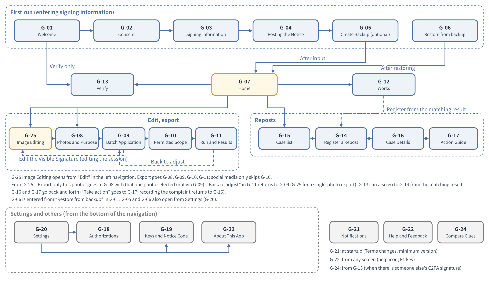
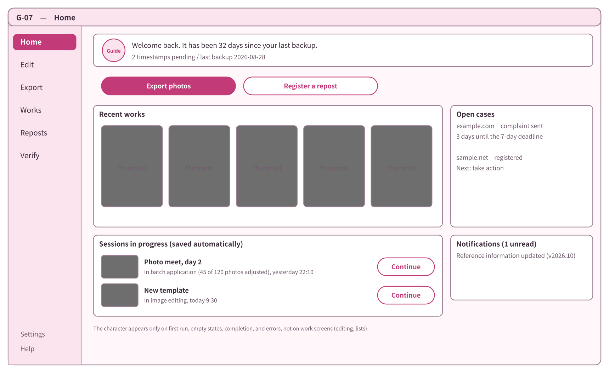
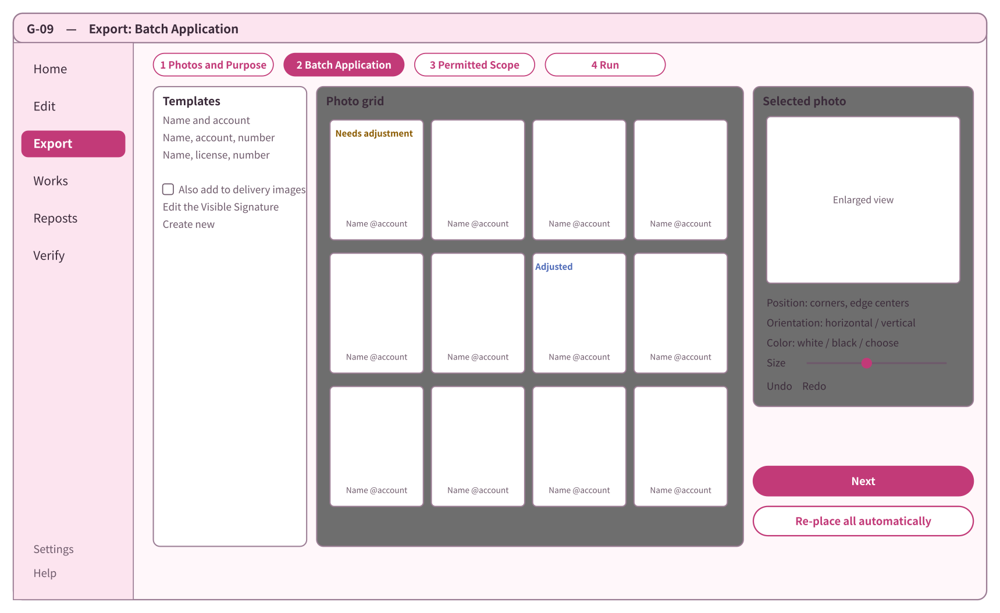
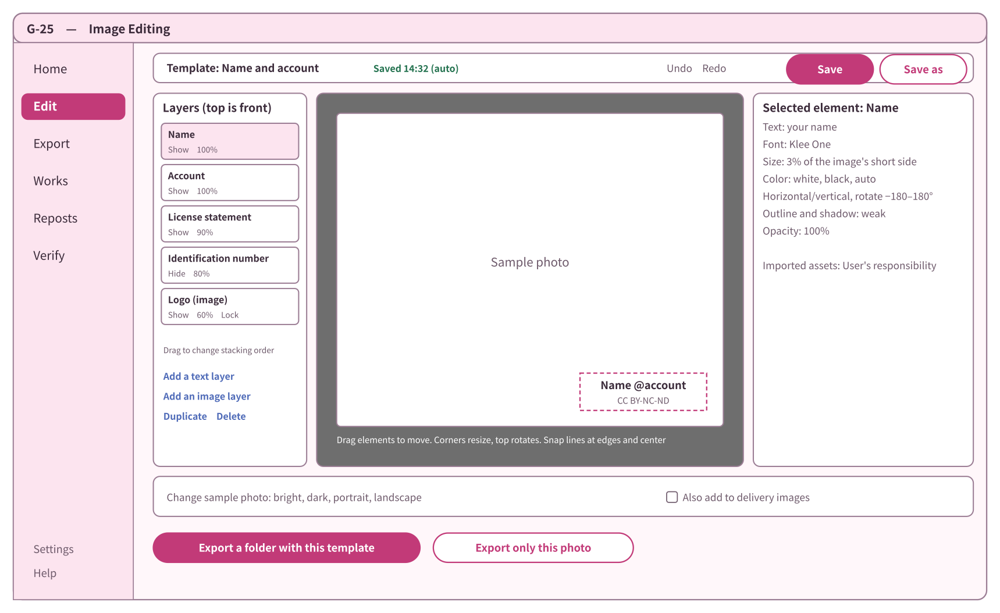
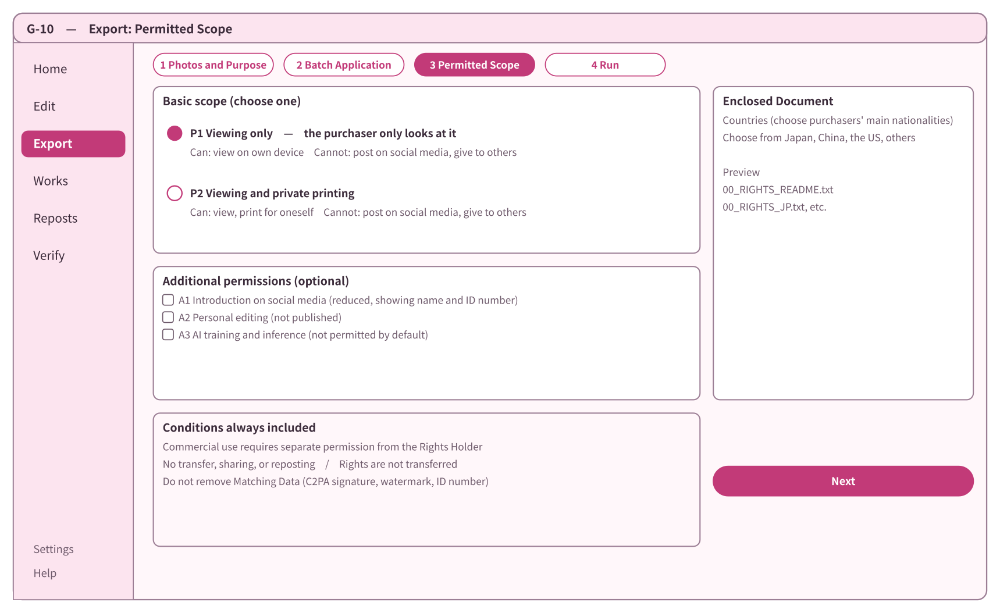
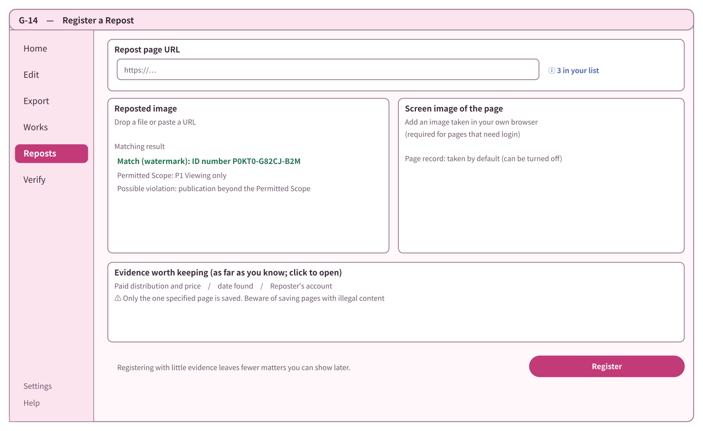
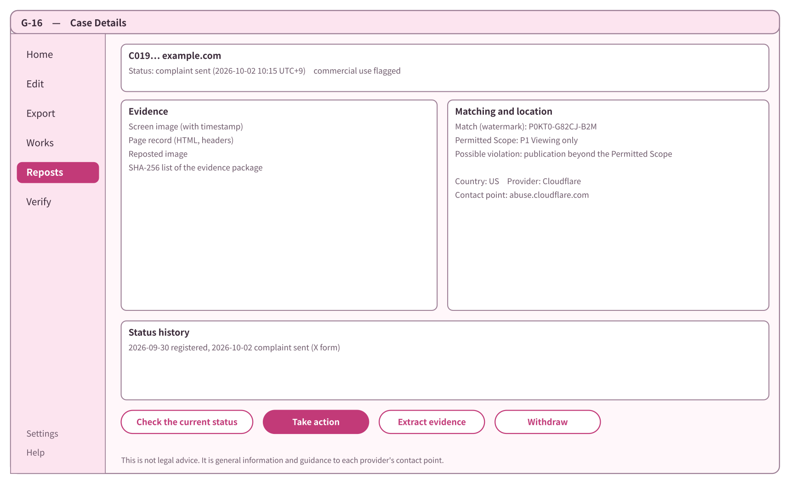

# Basic Design Document Chapter 10: Screens and Design

Anti-Repost Tool for Cosplay Photos  Edition 1 (Draft)  2026-09-29 · Ishikawa Sou  
Nagareyama Software Development Co., Ltd. (NRSD)  
Word version: [10_Basic Design_Screens and Design.docx](10_Basic%20Design_Screens%20and%20Design.docx)

© 2026 Nagareyama Software Development Co., Ltd. (NRSD), Lead Developer: Ishikawa Sou (石川宗). Copyright in this document belongs to Nagareyama Software Development Co., Ltd. (NRSD). Rights in the third-party standards, software, commentaries on laws, and other materials referred to in this document belong to their respective holders. This is a translation of the Japanese original; where they differ, the Japanese original prevails.

---

## Position of This Document

- Details Chapter 10 of the Outline Design Document. This chapter fits the Users' operations of the requirements of all chapters into screens, and is written after the basic design of the other chapters. It is designed together with Chapter 12 “Interface with Legal” (Chapters 10 and 12 depend on each other).
- The decisions received are as in the following table (the decisions, items to be investigated, and open items of Design Plan Edition 2, and omissions found in the item breakdown).

|Number|Type|Content|
|---|---|---|
|D-3-3|Decision|Users shall be able to use the System without looking at GitHub|
|D-8-1|Decision|The Client App shall have an appealing appearance. Appearance is treated as a requirement directly tied to the effectiveness of the System|
|D-8-2|Decision|The image editing screen, batch application, and the Rights Document creation screen are provided. The organization of other screens is decided in the design document|
|D-8-3|Decision|A design created on the editing screen becomes a template that can be applied to single images or by folder|
|D-8-4|Decision|Even in batch application, placement, orientation, and color can be adjusted for each photograph|
|D-8-5|Decision|The details of the screens are decided in the design document|
|D-9-8|Decision|The display languages are Japanese, Chinese, and English, with others added on request|
|O-07|Open (decided in Basic Design Chapter 10, DD-10-5“No OS integration; drag and drop is used instead”: not provided)|OS-specific integration|
|A-13|Omission found in the item breakdown|A feedback channel for Users who do not look at GitHub|
|A-14|Omission found in the item breakdown|NRSD's position and the Terms of Use|

- Terms: “C2PA signature” and “Visible Signature” are written distinctly (Chapter 1, “Position of This Document”). On screen, the work of outputting images with a C2PA signature, invisible watermark, Visible Signature, and identification number is collectively called “export”. The operation of taking records (evidence packages, templates, backup files) outside the device as files is called “extract”, not “export” (for backup files, “create a backup”).
- The references are as in the following table.

|Reference|What is referred to|
|---|---|
|Chapter 2, 2 “Input of Information for C2PA Signatures”, 4 “The Means of Matching and the Clues”|Input of information for C2PA signatures, matching clues|
|Chapter 3, 9 “Batch Processing”, 10 “Output”|Batch processing, output, Verify|
|Chapter 4 “Image Editing and Batch Application”|Editing the Visible Signature and batch application|
|Chapter 5, 2 “Permitted Scope”|Permitted Scope|
|Chapter 6, 2 “Registration”, 4 “Matching”, 6 “Status Checking”|Registration, matching, status|
|Chapter 7, 3 “Model Texts”, 6 “Flow of Complaints”, 7 “Where the Line Is Drawn”|Flow of complaints, personal information, where the guidance draws the line|
|Chapter 8, 5 “Backup Files”|Creating and importing backups|
|Chapter 11 “Development Base”|How screens are built (Tauri), text files|
|Chapter 12, 6 “What Is Returned to the Screens”|What is returned to the screens|
|Legal Research L-19“Font licenses”, L-29“Commissioning design and characters (Japan)”|Font licenses, commissioning design and characters|

- Scope: the screens of the Client App. Screens of the operator tool are dealt with in Chapter 1, 19 “Operator Tool” (as set in the scope of the Outline Design Document). The structure of the README and public page is in Chapter 9, 5 “Download Routes” and Chapter 8 “Repository and Data Management”.

## 1. List of Design Decisions

|Number|Decision|Reason|Rejected alternatives|
|---|---|---|---|
|DD-10-1|The look is “pale colors, rounded shapes and letters, and one guide character”. The character is NRSD's original, and appears only at first-run guidance, empty states, completion, and errors; it does not appear on working screens (editing, lists)|Users like characters and cute things, and software that looks bad is not used (D-8-1“The Client App shall have an appealing appearance. Appearance is treated as a requirement directly tied to the effectiveness of the System”). Showing it even on working screens would get in the way of checking photos|No character (contrary to D-8-1“The Client App shall have an appealing appearance. Appearance is treated as a requirement directly tied to the effectiveness of the System”). A character in the style of an existing work (would touch the rights of original works ourselves; L-29“Commissioning design and characters (Japan)”)|
|DD-10-2|Design (colors, components, character) is done by NRSD's Lead Developer, who also judges whether the look passes. Understandability is judged by User trials (2.4). The contractual issues for commissioning an external designer in the future are placed in Legal L-29“Commissioning design and characters (Japan)”|There is no designer to commission (2026-09-30, NRSD). Look is a matter of taste, so one judge is appointed|Commissioning an external designer (second draft; there is no one to commission). Judging by majority vote (would not be decided)|
|DD-10-3|The screen is one window, with a vertical navigation on the left (Home, Edit, Export, Works, Reposts, Verify) and settings and help at the bottom. Work with several stages (first-run input, export, registration, taking action) proceeds within the window with the stages shown at the top|Non-technical people can always see “where am I now, and how many steps remain”. One window shows fewer OS differences|Opening several windows (confusing). Making everything a wizard (slow for experienced Users)|
|DD-10-4|Readability follows WCAG 2.2 AA (text contrast 4.5:1 or more, component boundaries 3:1 or more, meaning not conveyed by color alone, no breakage with text enlarged to 200%)|Consideration for diversity of color vision and for fatigue from long hours viewing photos. Basing criteria on an external standard makes them judgeable|Custom criteria (cannot be judged)|
|DD-10-5|No OS integration (right-click menus, etc.) is provided. Dragging and dropping photos and folders onto the window takes its place. Reordering of layers within the screen is built with pointer events (press, move, release) rather than HTML5 drag and drop|Windows 11's new right-click menu puts conventional registrations behind “Show more options”, macOS requires a separate extension executable, and Linux differs by file manager, so the three OSes would not give the same experience. Drag and drop works the same on the three OSes. When the setting to accept files dropped onto the window (Tauri's dragDropEnabled) is enabled, HTML5 drag and drop within the screen cannot be used on Windows (the description in config.rs of tauri-utils: “Disabling it is required to use HTML5 drag and drop on the frontend on Windows”)|Registering in the right-click menu on Windows only (explanations would differ by OS)|
|DD-10-6|For the feedback channel, the app composes the feedback text and the User sends it to NRSD by their own e-mail (opening the e-mail software, or copying the text and address). The app does not send automatically|Users do not look at GitHub (D-3-3“Users shall be able to use the System without looking at GitHub”). NRSD has no servers (DD-1-2“NRSD has no servers and receives no User information (except feedback e-mails Users send themselves)”) and does not collect Users' information (D-5-1“The System does not confirm Users and collects no User information. No registration is required in order to use the System”). The User decides whether to send and what to attach|GitHub Issues (shows GitHub to Users). An external form service (sends information to a third party). Sending automatically from the app|
|DD-10-7|The screen languages are Japanese (ja), Simplified Chinese (zh-Hans), and English (en). Glyph shapes are matched by switching fonts per language. Traditional Chinese is added on request|D-9-8“The display languages are Japanese, Chinese, and English, with others added on request”. Users in mainland China use Simplified Chinese. The same kanji differ in glyph shape between Japan and China|Covering Chinese with one font (would display Chinese in Japanese glyph shapes)|
|DD-10-8|Error displays are unified into a form that always shows four things: “what happened / are the Original and records safe / what to do next / code”|What non-technical people want to know first is “are my photos safe”. The code is for identifying the cause through feedback (DD-10-6“Feedback is sent by the User from their own e-mail”)|Showing technical content as is|

## 2. Design

### 2.1 Direction (rough proposal)

|Element|Policy|
|---|---|
|Color|Pale pink as the ground, deep pink as the primary color, blue as the secondary color. Has light and dark modes, following the OS setting (can also be fixed in settings)|
|Shape|Components with rounded corners (radius 8 to 12 pixels), with weak shadows of one level only|
|Text|Rounded gothic type (2.2)|
|Character|One guide. Motif proposal: “a small creature holding a wax seal (sealing stamp)” (a metaphor for sealing by C2PA signature). Six expressions (normal, happy, thinking, troubled, caution, good night (when offline)). The name is decided by the Lead Developer|
|Showing photos|On working screens the ground color switches to achromatic (gray) so as not to disturb judgment of photo colors|
|Motion|Only screen transitions and completion effects. Stopped by the OS's “reduce motion” setting or by the app's setting|

### 2.2 Fonts

|Use|Japanese|Chinese (Simplified)|English|License|
|---|---|---|---|---|
|Screen text|Zen Maru Gothic|Resource Han Rounded CN (资源圆体)|Latin of Zen Maru Gothic|All SIL OFL 1.1 (Google Fonts, github.com/CyanoHao/Resource-Han-Rounded)|
|User input (handle name, etc.)|Characters not in the fonts above are displayed with OS fonts|Same|Same|—|
|Visible Signature|As in Chapter 4, DD-4-7“Bundled fonts are limited to SIL OFL 1.1 and are not modified” (separate from screen fonts)|—|—|—|

- The two fonts total about 18 MB (Zen Maru Gothic about 3.8 MB, Resource Han Rounded CN about 14.7 MB; measured in Chapter 11, 4.3 “Assets”). They are bundled unmodified (without subsetting) (Legal Research L-19“Font licenses”).

### 2.3 Colors

- All colors are defined with names (the “Name” in the table below), and components do not hold direct color values. The “Light mode” and “Dark mode” columns of the table are filled with that color. The values and the contrast ratio against the ground color (computed with the WCAG formula) are shown.

|Name|Light mode|Ratio (ground #FFF7FA)|Dark mode|Ratio (ground #1E1820)|Use|
|---|---|---|---|---|---|
|bg|#FFF7FA|—|#1E1820|—|Ground|
|surface|#FFFFFF|—|#2A222D|—|Cards, input fields|
|text|#3B2B3A|12.5|#F7EAF2|14.9|Body text|
|muted|#6E5A6B|6.0|#CDB9C8|9.4|Supplementary|
|primary|#C23A78|4.8|#FF8CC0|8.1|Primary buttons, selection|
|on-primary|#FFFFFF|5.0 (against primary)|#2A0E1C|8.3 (against primary)|Text on primary buttons|
|accent|#4F6BB8|4.8|#9FB4F2|8.5|Links, information|
|success|#23724F|5.6|#7ED3A8|9.8|Match, completion|
|warn|#8A5A00|5.6|#F2C265|10.5|Caution|
|danger|#B3261E|6.2|#FF8A80|7.6|Failure, irreversible operations|
|border|#9C7E95|3.4|#8C7389|4.1|Boundaries of input fields and components (3:1 or more)|
|on-danger|#FFFFFF|6.5 (against danger)|#2A0E1C|7.8 (against danger)|Text on buttons for dangerous operations|
|work-bg|#6E6E6E|—|#3A3A3A|—|Ground of working screens (editing, batch application, photo display). Achromatic (“Showing photos” in 2.1)|
|work-text|#FFFFFF|5.1 (against work-bg)|#FFFFFF|11.4 (against work-bg)|Text on the ground of working screens|
|work-focus|A 2-pixel #FFFFFF frame with a 1-pixel #000000 frame outside it|5.1 (against work-bg; the inner white)|Same|11.4 (against work-bg; the inner white)|Focus frame on working screens. On bright photos the outer black is visible|

- On the ground of working screens (work-bg), a focus frame in light mode's accent (#4F6BB8) has insufficient contrast (1.0 against light mode's work-bg #6E6E6E; dark mode's accent #9FB4F2 is sufficient at 5.6 against work-bg #3A3A3A, but both are aligned to work-focus so that the frame does not change between modes), so work-focus is used. All ratios were computed with the WCAG formula.
- Meaning is not conveyed by color alone: matching levels (Chapter 6, 4.1 “How the match level is shown”), case status, and success/failure are shown with marks of different shapes per level and text, in addition to color (the shapes of the marks are decided by the Lead Developer, and their meanings are written in a legend on screen).

### 2.4 Judgment

|What is judged|Judge|Criterion|
|---|---|---|
|Whether the look passes|Lead Developer (DD-10-2“Design is done and judged by NRSD's Lead Developer”)|Check samples of colors, components, the character's six expressions, and five main screens in both light and dark modes|
|Understandability (first-run input)|User trials|80% or more of participants (at least 5 cosplayers and photographers, initial value; 4 or more if 5) can complete input of information for C2PA signatures and posting of the Notice (G-01“Welcome”, G-02“Consent”, G-03“Signing Information”, G-04“Posting the Notice”) without explanation|
|Understandability (Permitted Scope)|User trials|80% or more of those who read the explanation correctly answer “whether purchasers may post on social media under the chosen scope” (Chapter 5, 2.2 “Explanation for non-technical people”)|
|Understandability (export and registration)|User trials|80% or more of participants (4 or more if 5) can complete a batch export of one folder and registration of one repost without explanation|
|Readability|Lead Developer|Check the contrast ratios of 2.3, text enlargement to 200%, and keyboard-only operation on the three OSes|

- Trials are done with a working version (preview version). Users are not asked to read design documents or explanatory documents for their opinions (asking cosplayers and photographers to read documents is a heavy burden, and actual usage can only be checked with a working version). The preview version is one in which first-run input, image editing, export, and repost registration all work, distributed before the trial (separate from the official distribution of Chapter 9, given only to trial participants; C2PA signatures and record formats are the same as production). This does not contradict D-3-5“No interviews are conducted; improvement is made based on comments after the System becomes usable”, which does not conduct interviews first. Trial participants are Users NRSD knows and asks. Points fixed as a result of trials are noted in the changes of the next version.

### 2.5 Steps of text size and spacing

|Name|Size (at standard)|Use|
|---|---|---|
|Heading 1|24 pixels|Screen titles|
|Heading 2|18 pixels|Area titles|
|Body|15 pixels|Body text, tables|
|Supplementary|13 pixels|Explanations, notes|
|Button|15 pixels (bold)|Button text|

- The “text size” setting (small, standard, large, extra large, maximum) scales everything by 0.9, 1.0, 1.2, 1.4, and 2.0 (initial values). It is checked that no content or function is lost even at maximum (2.0) (WCAG 2.2 1.4.4 “text can be resized up to 200 percent without loss of content or functionality”; satisfied by the app's setting alone, without relying on OS magnification).
- Tauri's screen zoom keys (zoomHotkeysEnabled; Ctrl/Command with − and =) are not enabled, because they conflict with the zoom keys of the editing screen (Chapter 4, 9.2 “View”) (the description in config.rs of tauri-utils).
- Spacing uses 4 pixels as the unit, with steps of 4, 8, 12, 16, 24, and 32 pixels (initial values).
- Line height is 1.6 times the body text (for readability of Japanese and Chinese; initial value).

### 2.6 List of components

|Component|Content|Rules|
|---|---|---|
|Primary button|The single main operation on a screen (“Export”, “Register”)|primary color. One per screen|
|Secondary button|Other operations|Outline only|
|Dangerous operation button|Irreversible operations (erase)|danger color. Pressing it shows a confirmation dialog (3.6)|
|Input field|Text input|Name above the field, explanation and error text below. Required fields have “required” written in the name (not just a mark)|
|Selection|Radio buttons, checkboxes, toggles|Press targets are 24 pixels square or more (2.7)|
|Stage display|The current stage of multi-stage work|At the top of the screen. Stage names and numbers|
|List (grid)|A row of reduced photo images|Draw only what is visible (3.4)|
|List (table)|Rows of cases and works|Sorting, filtering|
|Notice bar|Temporary notices at the top of the screen (3.7)|Remains until closed. Not dismissed automatically (so it does not disappear before being read)|
|Confirmation dialog|Before irreversible operations (3.6)|The button shows the operation's name rather than “Yes” (e.g., “Erase”)|
|Progress display|Progress of long processing|Which item, estimated remaining time, cancel|
|Guide|The character (DD-10-1“The look is pale colors, rounded shapes, and one guide character”)|Only at first run, empty states, completion, and errors|

### 2.7 Readability criteria (WCAG 2.2 AA)

- WCAG 2.2 is a W3C Recommendation (October 2023; this document looked at the version of December 12, 2024). Main criteria this app meets and how:

|Criterion|Requirement|Method|
|---|---|---|
|1.4.3 Contrast (Minimum)|Text-to-background ratio of 4.5:1 or more|Met by the color definitions of 2.3|
|1.4.4 Resize Text|Text can be enlarged to 200% without assistive technology without loss of content or function|The text size steps of 2.5 (maximum 2.0 times; met by the app's setting alone)|
|1.4.10 Reflow|Content can be presented without scrolling in two dimensions at the equivalent of 320 CSS pixels wide|Not met. This app is a desktop app, and the minimum window size is 1024×700 pixels (3.3). At that size no horizontal scrolling appears. The photo editing area moves photos in two directions (12 “Gaps Declared in This Chapter”)|
|1.4.11 Non-text Contrast|Boundaries of components and graphics at a ratio of 3:1 or more|The border color of 2.3|
|2.1.1 Keyboard|All functionality operable by keyboard|Checked on all screens. Placement on photos can be moved with keys (Chapter 4, 9.1 “Selecting and moving”)|
|2.4.7 Focus Visible|Keyboard focus is visible|Always show a focus frame (2 pixels, accent color; on working screens, the two-color work-focus frame; 2.3)|
|2.4.11 Focus Not Obscured (Minimum)|A focused component is not entirely hidden by author content|Notice bars and confirmation dialogs are arranged so as not to hide focus|
|2.5.8 Target Size (Minimum)|Targets are 24×24 CSS pixels or more. Exceptions: spacing (a 24-pixel circle does not overlap other targets), an equivalent target exists, inline targets, targets determined by the user agent, essential cases (W3C's Understanding 2.5.8; sliders and the like are treated as one target)|24 pixels square or more on all components. Handles on the editing screen (size and rotation handles), even if visually small, have a press area of 24 pixels square, not relying on exceptions|
|3.3.1 Error Identification, 3.3.3 Error Suggestion|Input errors are shown in text with how to fix them|Error text and how to fix it are shown below input fields (Chapter 2, 2.3 “Input validation”)|

- Source: W3C's WCAG 2.2.

## 3. Screen Structure

### 3.1 List of screens

- The three screens required by Design Plan D-8-2“The image editing screen, batch application, and the Rights Document creation screen are provided. The organization of other screens is decided in the design document” correspond to the following screens: the image editing screen is G-25“Image Editing”, batch application is G-09“Export: Batch Application”, and the Rights Document creation screen is G-10“Export: Permitted Scope”.
- The image editing screen (G-25“Image Editing”) is opened directly from “Edit” in the left navigation. It can also be opened in the middle of export (G-09“Export: Batch Application”).

|Number|Screen|What can be done|Main sources|
|---|---|---|---|
|G-01|Welcome|Choose the language. Read what it can and cannot do (does not collect Users' information, does not match on others' behalf) and that it is not involved in the rights of the original works. Choose “Start”, “Use only to verify”, or “Restore from backup”|Outline Design Document “What the System protects and does not protect”, Chapter 12, 6 “What Is Returned to the Screens”|
|G-02|Consent|Read and agree to the Terms of Use and Privacy Policy|Chapter 12, 3.1 “Required for using NRSD's services”|
|G-03|Signing Information|Enter the handle name, role, and Notice accounts. Each field shows “what it is used for and where it is kept”. Keys, certificates, and the notice code are made on the device at this time|Chapter 2, 2 “Input of Information for C2PA Signatures”|
|G-04|Posting the Notice|Copy the notice code and sample Notice texts (short, medium, long) and post following per-platform procedures (images)|Chapter 2, 2.1 “Input procedure”, 2.2 “Limits of the places where notice codes are posted”, Chapter 5, DD-5-6“Notice templates are prepared in three lengths: short, medium, long”|
|G-05|Create Backup|Create a backup file (signing keys and all records encrypted with a passphrase) and choose where to save it. See the date of the last one|Chapter 8, 5 “Backup Files”|
|G-06|Restore from Backup|Enter a backup file and passphrase and import signing keys and records (drag allowed)|Chapter 8, 5 “Backup Files”|
|G-07|Home|See recent works, work in progress (continue), cases in progress, announcements, the number of pending timestamps, and the date of the last backup. Go on to the main work|—|
|G-08|Export: Photos and Purpose|Choose a folder (or photos), and decide the purpose (social media / delivery / both) and shoot name. Choose whether to add the identification number after the saved file name (initial value is to add it; afterwards the previous choice). Choose a joint rights holder (one of the counterparties of imported joint-rights documents, or none). When coming from “Export only this photo” in G-25“Image Editing”, it opens with that one photo selected|Chapter 3, 8.2 “Differences between streams”, Chapter 4, 12 “Batch Application”|
|G-09|Export: Batch Application|Apply a template to the photos of the chosen folder in batch. Choose the template (whether to include on delivery too is per template). See the results of auto-placement in a grid, and per photo adjust the group's position, size, and rotation, and the layers' visibility and color, and add layers for that photo only (Chapter 4, DD-4-3“A group of layers is the unit of placement”). To change the content or formatting of the Visible Signature, or to write the content of a layer for that photo only, “Edit Visible Signature” opens G-25“Image Editing” in the edit-the-work-session state (Chapter 4, 13.1 “Two states of the image editing screen”). Even if stopped midway, the work session is saved automatically|Chapter 4, 12 “Batch Application”, 7 “Placement”|
|G-10|Export: Permitted Scope|Choose the Permitted Scope for delivery (P1, P2, A1 to A3) and the countries of the Enclosed Document (purchasers' common nationalities). See pictures of what can and cannot be done|Chapter 5, 2 “Permitted Scope”, 3 “Enclosed Document”|
|G-11|Export: Run and Results|See progress, the list of failures and remedies, the output folder, the list of identification numbers (copyable), and guidance on how C2PA signatures remain per destination|Chapter 3, 9 “Batch Processing”, 10 “Output”|
|G-12|Works|List and search work data (identification number, shoot name, date). See work details (C2PA signature, timestamp, Permitted Scope, output location)|Chapter 3, 7 “Identification Numbers and Work Data”|
|G-13|Verify|Put in any image or Enclosed Document and see the results for the C2PA signature, timestamp, invisible watermark (identification number), matching, and Enclosed Document hashes. Usable even before first-run input. Shows the signer's Notice accounts and the expected notice code, and can open the account|Chapter 3, 10.2 “Checking by the User”, Chapter 2, 4.1 “Matching with the Notice account”, Chapter 5, DD-5-4“The SHA-256 of the Enclosed Documents is recorded in the manifest”|
|G-14|Register a Repost|Enter the URL, reposted image, screenshot, page record, and evidence input fields, see the matching result, and “Register”|Chapter 6, 2 “Registration”, 4 “Matching”|
|G-15|Reposts (Case List)|See cases by reposting site and by status. Cases with the commercial-use mark come to the top. See the last checked date and possible actions|Chapter 6, 6 “Status Checking”, 8 “List and Means”, Chapter 7, 6.2 “Joint action and priority”|
|G-16|Case Details|See evidence, matching, results of identifying the operator, and status history. “Check current status”, “Take action”, “Extract evidence package”, “Withdraw”|Chapter 6, 3 “Evidence Preservation” to 7|
|G-17|Action Guide|Choose the complainant's standing (copyright holder, subject, authorized agent), choose a contact point, and see the required items and evidence to attach. Confirm the guidance on personal information, copy the model text, and open the contact point. Record “complaint made”. See “To prepare further” (optional registrations)|Chapter 7 “Legal Action Guidance”, Chapter 12, 3.2 “Optional for Users (the System only guides)”|
|G-18|Authorizations and Joint Rights|Create and import authorizations, create revocations. Create and import joint-rights documents (passed as files)|Chapter 2, 5 “Authorizations and Joint Rights”|
|G-19|Keys and Notice Code|Notice code, validity of the personal root and signing certificate, remaking (changes of input, 20 years after the personal root was made), remaking keys and re-posting the notice code (loss, leak), history of changes of input|Chapter 2, 3.4 “Expiry and input errors”, 6 “Rights Holder Information”, 7 “Signing Keys”|
|G-20|Settings|The items of 10 of this chapter|—|
|G-21|Notifications|See changes to the terms, reference information updates, app updates, remaking of the personal root, backup recommendations, and free-space notices|Chapter 12, 6 “What Is Returned to the Screens”, Chapter 9, 4 “Updates”, Chapter 8, 5 “Backup Files”, 6 “Capacity”|
|G-22|Help and Feedback|Read per-screen help and the matching procedure. Compose feedback text and send it by one's own e-mail|6.3 and 9 of this chapter|
|G-23|About This App|Version, code signing publisher, not being involved in the rights of the original works, not collecting Users' information, list of licenses|Chapter 9, 3 “Proof of the Official Version”, Chapter 12, 6 “What Is Returned to the Screens”|
|G-24|Compare Clues|When an image thought to be one's own work has someone else's C2PA signature, see the clues of the invisible watermark, timestamp, ingredient history, Original, and Notice side by side (no judgment). Go on to possible actions (G-17“Action Guide”)|Chapter 2, 4.4 “Clues when a person posing as the Rights Holder appears”, Design Plan 5.5 “Handling of Matching When a Signature Has Been Overwritten”|
|G-25|Image Editing|The screen for creating and editing Visible Signature templates. On a sample photo, stack text layers (name, account, date, license notice, identification number, free text) and image layers (overlay images); decide per layer the stacking order, visibility, lock, and opacity, and the text's font, size, color, direction (horizontal, vertical, rotation), and outline; and save as a template. A single photo can also be opened, drawn on for that photo only, and exported. It has two states, “edit the template” and “edit the work session”, and shows the current state at the top of the screen (Chapter 4, 13.1 “Two states of the image editing screen”). The state in the middle of editing is saved automatically and can be continued from “Work in progress” on Home. Opened from “Edit” in the left navigation|Chapter 4, 2 “Scope of the Visible Signature”, 3 “Text Layers”, 4 “Groups and Layers”, 5 “Image Layers”, 6 “Fonts and Emoji”, 7 “Placement”, 8 “Templates”, 9 “Editing Operations”, 11 “Work Sessions (the State in the Middle of Editing)”|

### 3.2 Transitions

|From|To|Condition|
|---|---|---|
|First start|G-01“Welcome”|—|
|G-01“Welcome”|G-02“Consent”|“Start”|
|G-01“Welcome”|G-06“Restore from Backup”|“Restore from backup”|
|G-01“Welcome”|G-13“Verify”|“Use only to verify”|
|G-02“Consent”, then G-03“Signing Information”, then G-04“Posting the Notice”, then (optional) G-05“Create Backup”|G-07“Home”|“Back” is possible at each step. Even if stopped midway, input is saved and continues at the next start|
|G-13“Verify”|G-24“Compare Clues”|When there is someone else's C2PA signature and it relates to one's own watermark or work data|
|G-24“Compare Clues”|G-17“Action Guide”|“See possible actions”|
|G-07“Home”|G-08“Export: Photos and Purpose”, then G-09“Export: Batch Application”, then (for delivery) G-10“Export: Permitted Scope”, then G-11“Export: Run and Results”|For social media only, G-10“Export: Permitted Scope” is skipped|
|G-07“Home” and navigation|G-12“Works”, G-13“Verify”, G-15“Reposts (Case List)”|—|
|G-07“Home”|The screen of the stage where the work session stopped (G-09“Export: Batch Application”, G-10“Export: Permitted Scope”, G-25“Image Editing”, etc.)|“Continue” in “Work in progress”|
|G-07“Home” and navigation|G-25“Image Editing”|“Edit” in the navigation, or “Create a Visible Signature” on Home|
|G-25“Image Editing”|G-08“Export: Photos and Purpose”|“Export a folder with this template” (proceeds with the chosen template)|
|G-25“Image Editing”|G-08“Export: Photos and Purpose”|“Export only this photo” (opens with the open photo selected. Purpose, export preset, shoot name, whether to add the identification number to the file name, joint rights holder, and export destination are decided here. Next is G-10“Export: Permitted Scope” if delivery, or G-11“Export: Run and Results” if social media only. As it is one photo, G-09“Export: Batch Application” is not passed through)|
|G-09“Export: Batch Application”|G-25“Image Editing” (edit-the-work-session state)|“Edit Visible Signature” (opens the selected photo. Edits take effect in that work session at once. “Back” returns to G-09“Export: Batch Application”; Chapter 4, 13.1 “Two states of the image editing screen”)|
|G-11“Export: Run and Results”|G-09“Export: Batch Application”, or G-25“Image Editing” (edit-the-work-session state)|When fixing photos that need adjustment or have missing glyphs in the pre-export check (“Back to adjust”). Batch exports return to G-09“Export: Batch Application”, single-photo exports to G-25“Image Editing”|
|At start|Notice at the top of G-07“Home”|When the previous session did not end properly (Chapter 4, 11.5 “After abnormal termination”). “Continue” opens the work session or template draft|
|G-15“Reposts (Case List)”|G-14“Register a Repost”|“Register a repost”|
|G-14“Register a Repost”|G-16“Case Details”|After registration|
|G-16“Case Details”|G-17“Action Guide”|“Take action”|
|G-17“Action Guide”|G-16“Case Details”|After recording “complaint made”|
|G-12“Works”, G-13“Verify”|G-14“Register a Repost”|“Register this repost” from the matching result (only if first-run input has been completed)|
|G-13“Verify”|G-03“Signing Information”|When “Register this repost” is pressed before first-run input (registration needs the signing information)|
|Settings (G-20“Settings”)|G-05“Create Backup”, G-06“Restore from Backup”, G-18“Authorizations and Joint Rights”, G-19“Keys and Notice Code”, G-23“About This App”|—|
|Any screen|G-22“Help and Feedback”|Help mark, F1 key|
|At start|G-21“Notifications”|Changes to the terms (if re-consent is needed, the consent screen first), or when below the minimum version (Chapter 9, 4 “Updates”)|

Figure 10-1 Screen transitions

- Even before first-run input, G-13“Verify”, G-22“Help and Feedback”, and G-23“About This App” can be used. From G-13“Verify” before first-run input, one cannot proceed to G-14“Register a Repost”; an entrance to G-03“Signing Information” is shown instead (the exit of G-13“Verify”).

### 3.3 Layout of the main screens (rough proposal)

- The minimum window size is 1024×700 pixels. In windows smaller than this, the left navigation collapses to icons only.
- The following shows the content of each area. The final rendering of the look is done in the Lead Developer's design (DD-10-2“Design is done and judged by NRSD's Lead Developer”). The figures are rough proposals of the layout, and colors use the definitions of 2.3 “Colors”.

G-07“Home”

|Area|Content|
|---|---|
|Top|The character's remark (according to the time of day and state), N pending timestamps, the date of the last backup (recommended after 30 days)|
|Upper center|Two large buttons: “Export photos” and “Register a repost”|
|Center|Work in progress (reduced image, work session name, last edited date/time, current stage; “Continue”)|
|Center|Recent works (reduced images in a row, 10 items)|
|Right|Cases in progress (status and a word on what to do next), announcements (number unread)|

Figure 10-2 Layout of G-07“Home” (rough proposal)

G-09“Export: Batch Application”

|Area|Content|
|---|---|
|Top|Stage display (four stages: photos and purpose, batch application, Permitted Scope, run; the current stage emphasized)|
|Left|List of templates (three defaults and one's own). If the original version of the work session's template has become newer, “The template has a new version” and “Take in” (Chapter 4, 8.2 “Versions”). “Edit Visible Signature” (opens G-25“Image Editing” in the edit-the-work-session state)|
|Center|Grid of photos (reduced images shown with the Visible Signature overlaid). A caution mark on photos that “need adjustment”. A pencil mark on adjusted photos|
|Right|Enlargement of the selected photo and adjustment tools (candidate group positions, size, rotation, layer visibility and color, add a layer for that photo only, undo and redo). To change an element's text or font, or to write the content of a layer for that photo only, “Edit Visible Signature” opens G-25“Image Editing”|
|Bottom|“Re-place everything automatically”, “Next”|

Figure 10-3 Layout of G-09“Export: Batch Application” (rough proposal)

G-25“Image Editing”

|Area|Content|
|---|---|
|Top|Current state (“Template: \<name>” or “Work session: \<name> (Photo: \<file name>)”; Chapter 4, 13.1 “Two states of the image editing screen”), save state (“Saved” and time; saved automatically), “Save”, “Save as” (“Also save to template” in the edit-the-work-session state), undo and redo, open the history list|
|Upper left|List of templates (edit-the-template state), or list of the work session's photos (edit-the-work-session state). “Open photo”, import fonts, import image assets|
|Left|List of groups and list of layers. Higher layers are drawn in front. Per layer, toggles for visibility and lock, and opacity. Drag to change stacking order. “Add text layer”, “Add image layer”, “Duplicate”, “Delete”|
|Center|The Visible Signature overlaid on the sample photo as it will actually look. Elements are moved by dragging, resized with the corner handles, and rotated with the top handle. Snap lines to edges and centers are shown|
|Right|Settings of the selected element: text (account name, etc.) and the placeholder list, font, size, color (white, black, auto to suit the background), direction (horizontal, vertical) and rotation (−180 to 180 degrees; Chapter 4, 3.2 “Formatting”), outline and shadow, opacity, the group's placement (single, tiling). In the edit-the-work-session state, a switch “All photos in this work session” / “This photo only” at the top. For overlay images, choosing the image and cautions on imported assets|
|Bottom area|Change the sample photo (edit-the-template state; check how it looks on bright, dark, portrait, and landscape photos). The “also include on delivery” toggle. “Compare before/after”|
|Bottom|“Export a folder with this template” (edit-the-template state), “Export only this photo” (edit-the-work-session state for a single-photo work session)|

Figure 10-7 Layout of G-25“Image Editing” (rough proposal)

G-10“Export: Permitted Scope”

|Area|Content|
|---|---|
|Upper|Two radio buttons for the basic scope (P1 Viewing only / P2 Viewing and private printing). Each has a sentence and a picture, and what can and cannot be done is shown in text|
|Middle|Three checkboxes for additional permissions (A1 Introducing on social media / A2 Personal editing / A3 AI training and inference). A3 is unchecked by default|
|Lower|The conditions always included (commercial use requires separate permission, no transfer, sharing, or reposting, rights do not transfer, do not remove Matching Data) shown as fixed text|
|Right|Countries of the Enclosed Document (choose purchasers' common nationalities; no default) and a preview of the Enclosed Document|

Figure 10-4 Layout of G-10“Export: Permitted Scope” (rough proposal)

G-14“Register a Repost”

|Area|Content|
|---|---|
|Upper|URL field. On pasting, platform determination and a notice “You have N items from this site in your list”|
|Middle left|Field for the reposted image (file or URL) and the matching result (level mark and text)|
|Middle right|Field for screenshots (a required mark for pages requiring login), page record (taken by default; the option “Do not take it for this registration”)|
|Lower|Input fields for evidence that should be kept (collapsed; “as far as you know”), cautions on saving (Chapter 12, 6 “What Is Returned to the Screens”)|
|Bottom|“Register” (if evidence is scarce, a line saying so)|

Figure 10-5 Layout of G-14“Register a Repost” (rough proposal)

G-16“Case Details”

|Area|Content|
|---|---|
|Upper|Case number, domain of the repost destination, status (mark and text), commercial-use mark|
|Left|List of evidence (screenshots, fetch records, presence of timestamps)|
|Right|Matching result (identification number, Permitted Scope, candidates for what is violated), who and where (country, provider, contact point)|
|Lower|Status history (in date order)|
|Bottom|“Check current status”, “Take action”, “Extract evidence package”, “Withdraw”. At the very bottom, the permanent text “This is not legal advice”|

Figure 10-6 Layout of G-16“Case Details” (rough proposal)

### 3.4 Displaying large lists

- Works (G-12“Works”) and the grid (G-09“Export: Batch Application”) are lists that draw only the visible rows (virtual lists), and reduced images are saved on the device and reused.
- [To be measured] Time to first display of a list of 10,000 works, and scrolling a grid of 500 images. Assumption: within 1 second, smooth (around 60 frames per second). Criterion: first display within 2 seconds, no perceptible stutter when scrolling (checked in trials).

### 3.5 Specifications per screen

- The purpose, main elements, states (empty, processing, error), and exits of each screen are shown. Entrances are summarized in the table of 3.2 “Transitions” (only G-01“Welcome” has first start as its entrance, which is also written in the screen specification). For screens with layout figures, see 3.3 as well.

#### G-01 Welcome

- Purpose: choose the language, and read what this app can and cannot do and that it is not involved in the rights of the original works.
- Recommending device encryption: after the three key points, a line “Records are saved on this PC. Please enable PC encryption (Windows device encryption / BitLocker, macOS FileVault, Linux LUKS)” and guidance on how to open each OS's setting are placed (Chapter 8, DD-8-7“Encryption of records is left to full-disk encryption of the OS”).
- Entrance: first start.
- Elements: language selection (Japanese, Chinese, English), the three key points (does not collect, does not match on others' behalf, not involved in the rights of the original works), “Start”, “Use only to verify”, “Restore from backup”.
- Exits: G-02“Consent”, G-13“Verify”, G-06“Restore from Backup”.

#### G-02 Consent

- Purpose: agree to the Terms of Use and Privacy Policy (Chapter 12, DD-12-2“Terms of Use and Privacy Policy are agreed as standard terms”).
- Elements: key points (five lines: not involved in the rights of the original works, does not match on others' behalf, Users' records are on the device and NRSD does not receive them, not legal advice, scope of disclaimers), full text (scrolling), version and effective date, two buttons “Agree and continue” and “Continue without agreeing”. Above the buttons: “If you do not agree, NRSD's reference information (new versions of contact points, sample texts, and references to each country's law) will not be obtained. The version bundled with the app will be used. Other functions can be used” (Chapter 12, DD-12-3“Consent gates only the fetching of reference information”).
- If not agreed: the fact of not agreeing is recorded on the device, and reference information is not obtained. Entrances to agree later are placed in “Terms of Use” in G-20“Settings” and in G-21“Notifications”.
- Exits: G-03“Signing Information” (with either button). When the terms change, this screen is shown at start, and the exit is the original screen (from G-21“Notifications”).

#### G-03 Signing Information

- Purpose: enter the information for C2PA signatures (Chapter 2, 2 “Input of Information for C2PA Signatures”).
- Elements:

|Field|Kind|Limits|Explanatory text (what it is used for, where it is kept)|
|---|---|---|---|
|Handle name|Text|Chapter 2, 2.3 “Input validation”|Goes into the certificate and is published together with C2PA-signed images. Do not enter your real name|
|(Linux without Secret Service only) Passphrase protecting the key|Masked, entered twice|12 characters or more (initial value)|The signing key is saved encrypted with a passphrase. Enter it each time the app starts (Chapter 2, 7.5 “Storage method per OS”)|
|Role|Selection (cosplayer, photographer, authorized person)|Required|Goes into the image's record (manifest)|
|Notice accounts|URLs (several; add and remove)|Chapter 2, 2.3 “Input validation”|Go into the certificate and are published. These are the accounts where the notice code is posted|

- State: pressing “Create” shows progress (a few seconds) while keys and certificates are made.
- Errors: error text below the field (Chapter 2, 2.3 “Input validation”). If the keystore cannot be written, the reason and what to do next (Chapter 2, 8 “Handling Failures”).
- Exit: G-04“Posting the Notice”. Even if stopped midway, input remains (Chapter 2, 2.1 “Input procedure”).

#### G-04 Posting the Notice

- Purpose: copy the notice code and sample texts and post them on the Notice account (Chapter 2, 2.2 “Limits of the places where notice codes are posted”, Chapter 5, 6 “Support for Notices”).
- Elements: notice code (copy button), three levels of sample texts (short, medium, long) in three languages (copy buttons), per-posting-site procedures (images), a “Posted” check (optional; the app does not check whether it was posted).
- Exits: G-05“Create Backup” (recommended), G-07“Home”.

#### G-05 Create Backup

- Purpose: create a backup file (Chapter 8, 5.2 “How it is made”).
- Elements: choosing the destination, passphrase (entered twice, masked, strength indicator), a confirmation check “If you forget the passphrase, it cannot be restored”, “Create”.
- Guidance: the “3-2-1” way of keeping backups (three copies, two kinds of media, one in a separate place; Chapter 8, 5.6 “Guidance on where to keep backups”) is shown in one line and a figure. When a location on the same PC is chosen as the destination, “If this PC breaks, the backup will be lost too” is shown.
- States: progress (N MB of M MB, estimated remaining time), completion (destination and creation date/time).
- Errors: not enough free space, passphrase too short or commonly used.
- Exits: G-07“Home”, G-20“Settings”.

#### G-06 Restore from Backup

- Purpose: restore from a backup file (Chapter 8, 5.3 “How it is restored (import)”).
- Elements: choosing the file (drag allowed), passphrase, “Restore”. The choice when the personal root differs (replace, cancel; Chapter 8, 5.4 “Merging”).
- States: progress, completion (number imported, list of records that failed verification).
- Errors: wrong passphrase or broken file (Chapter 8, 8 “Handling Failures”).
- Exits: G-07“Home”. When coming from G-01“Welcome” at first start, after restoring it proceeds via G-02“Consent” to G-07“Home” (Chapter 12, DD-12-3“Consent gates only the fetching of reference information”).

#### G-07 Home

- Purpose: see recent works, work in progress, cases in progress, and announcements, and go on to the main work (layout in 3.3).
- Empty state (first use): the guide says “Let's export your first photo”, and shows “Export photos” and “Create a Visible Signature”.
- Each row of work in progress has “Continue” and other operations (rename, delete the work session; a confirmation dialog (3.6) before deleting).
- If the previous session did not end properly, a notice appears at the top, showing the last saved work sessions and template drafts with “Continue” (3.7, Chapter 4, 11.5 “After abnormal termination”).
- Exits: G-08“Export: Photos and Purpose”, G-12“Works”, G-13“Verify”, G-14“Register a Repost”, G-15“Reposts (Case List)”, G-21“Notifications”, G-25“Image Editing”, and the screens of the stages of work in progress.

#### G-08 Export: Photos and Purpose

- Purpose: choose photos and decide the purpose and export presets (Chapter 4, 12.1 “Flow”, 14.1 “Export presets”).
- Elements: choosing photos and folders (drag allowed), the number chosen and the number of unreadable photos, purpose (social media, delivery, both), export presets (several may be chosen), shoot name, whether to add the identification number to the file name, choosing a template, joint rights holder (one of the counterparties of imported joint-rights documents, or none; per work session; `{coholder}` of Chapter 4, 3.1 “Content and placeholders”), export destination folder.
- Single-photo export: when coming from “Export only this photo” in G-25“Image Editing”, it opens with that one photo selected, and the open work session is used instead of choosing a template.
- Errors: the same folder as the Original cannot be chosen as the export destination (Chapter 4, 14.5 “Location and names”).
- Exits: G-09“Export: Batch Application”. For single-photo export, G-10“Export: Permitted Scope” if delivery is included, or G-11“Export: Run and Results” if social media only.

#### G-09 Export: Batch Application

- Purpose: apply the Visible Signature to all photos and adjust per photo (Chapter 4, 12 “Batch Application”; layout in 3.3).
- Elements: photo grid (status marks; Chapter 4, 12.2 “Photo status”), filtering by status, selecting photos (several), adjusting together (Chapter 4, 12.3 “Adjusting together”), enlargement of the selected photo and adjustment tools, history list, save state.
- State: auto-placement progress (which photo).
- Exits: G-10“Export: Permitted Scope” (if there is delivery), G-11“Export: Run and Results”, G-25“Image Editing” (“Edit Visible Signature”; edit-the-work-session state).

#### G-10 Export: Permitted Scope

- Purpose: choose the Permitted Scope for delivery and the countries of the Enclosed Document (Chapter 5; layout in 3.3).
- Elements: basic scope (P1, P2), additional permissions (A1, A2, A3), the text of the conditions always included, countries of the Enclosed Document (several), preview of the Enclosed Document.
- Exit: G-11“Export: Run and Results”.

#### G-11 Export: Run and Results

- Purpose: see the progress and results of export (Chapter 3, 9 “Batch Processing”, Chapter 4, 14 “Export”).
- Elements: progress (which photo, estimated remaining time, cancel), results (number exported, list of failures and reasons, open the export destination), list of identification numbers (copyable), guidance on how C2PA signatures remain per posting site (Chapter 3, 10.3 “Retention on posting sites and in the cloud”), check of photos needing adjustment or with missing glyphs (before export).
- Exits: G-07“Home”, G-12“Works”, G-09“Export: Batch Application” or G-25“Image Editing” (when “Back to adjust” is pressed in the pre-export check; batch exports to G-09“Export: Batch Application”, single-photo exports to G-25“Image Editing”).

#### G-12 Works

- Purpose: list and search exported works and see details (Chapter 3, 7 “Identification Numbers and Work Data”).
- Elements: list (reduced image, identification number, shoot name, date, timestamp status), search (identification number, shoot name, date range), details (C2PA signature, timestamp, Permitted Scope, export location, open the work session).
- Empty state: “No works yet” and a path to export.
- Exits: G-14“Register a Repost” (from the matching result), work session screens.

#### G-13 Verify

- Purpose: check any image or Enclosed Document (Chapter 3, 10.2 “Checking by the User”, Chapter 2, 4.1 “Matching with the Notice account”).
- Elements: putting in images and Enclosed Documents (drag allowed), results (words for C2PA signature verification; the table of Chapter 3, 10.2 “Checking by the User”), signer (handle name, Notice accounts, expected notice code, a button to open the account), timestamp, matching of the watermark's identification number against one's own work data, match level of the matching hash, match of Enclosed Document hashes.
- Exits: G-24“Compare Clues” (when there is someone else's C2PA signature related to one's own work), G-14“Register a Repost” (only if first-run input (G-03“Signing Information”) has been completed, because registration attaches a record signature with the User's key). Before first-run input, instead of G-14“Register a Repost”, “To register a repost, first enter your signing information” and an entrance to G-03“Signing Information” are shown.

#### G-14 Register a Repost

- Purpose: register a repost and keep evidence (Chapter 6, 2 “Registration”; layout in 3.3).
- Elements: URL, reposted image, screenshot (guidance on how to take it; Chapter 6, 2.2.2 “Guidance on taking screenshots”), choice of timestamp for evidence (a free TSA, or a paid TSA that has been set up; Chapter 6, 3.2 “Trusted timestamps”), page record (taken by default together with registration. When the URL is entered, it is shown that the IP address is visible to the other party and that a VPN can be used if this is a concern, and “Do not take it for this registration” can be chosen. Fetching does not identify the System. Chapter 1, 4.2 “Communication with the outside”, Chapter 6, 2.1 “Procedure”, DD-6-8“Fetch requests do not identify the System”), fields for evidence that should be kept, matching result, “Register”.
- States: fetch progress, deferred timestamp.
- Exit: G-16“Case Details”.

#### G-15 Reposts (Case List)

- Purpose: see registered cases (Chapter 6, 8 “List and Means”).
- Elements: groups per reposting site, count, status, last checked date, commercial-use mark, filtering (status), “Register a repost”.
- Empty state: “No registered reposts” and a path to registration.
- Exits: G-14“Register a Repost”, G-16“Case Details”.

#### G-16 Case Details

- Purpose: see the case's evidence and status and choose the next step (Chapter 6; layout in 3.3).
- Elements: case number, repost destination, status, list of evidence, matching result, who and where, status history, guide dates of procedural deadlines (days counted from the date of complaint: the 7-day notification of Japan's designated providers, 10 to 14 business days after a counter-notice in the United States, etc.; Chapter 7, 6.3 “Display of procedural deadlines”), “Check current status”, “Take action”, “Extract evidence package”, “Withdraw”, permanent text that it is not legal advice.
- Exit: G-17“Action Guide”.

#### G-17 Action Guide

- Purpose: choose the complainant's standing and a contact point, and make the complaint text (Chapter 7).
- Elements: choice of the complainant's standing (copyright holder, subject, authorized agent; chosen first; Chapter 7, 3.4 “Standing of the complainant”). Depending on standing, the kinds of contact points shown (copyright, portrait), model texts, and confirmation texts (Chapter 7, 3.2.1 “Liability for mistaken or false complaints”) switch. If subject is chosen, copyright model texts are not shown and portrait/privacy contact points are shown. Candidate contact points (for Japan's Large-Scale Specified Telecommunications Service Providers, the contact point for requests under the law is shown first; Chapter 7, 2.1 “List of contact points in the first edition (initial content of the reference information)”), required items and evidence to attach, a confirmation check that personal information may be passed to the other party (Chapter 7, 3.2 “Guidance that personal information is passed to the other party”), a confirmation check on the liability for mistaken or false complaints and on the matching clues (for cases whose matching result is “A match cannot be confirmed”, a caution at the top; Chapter 7, 3.2.1 “Liability for mistaken or false complaints”), explanation of the other party's counter procedures (Chapter 7, 3.2.2 “The other party's counter procedures”), model text (Chapter 7, 3.3 “Contents of the model texts”; name and the like are entered only on this screen and not saved), buttons to copy the text and open the contact point, recording “complaint made”.
- Exit: G-16“Case Details”.

#### G-18 Authorizations and Joint Rights

- Purpose: create and import authorizations, revocations, and joint-rights documents (Chapter 2, 5 “Authorizations and Joint Rights”).
- Elements: create (the counterparty's notice code, scope, term, condition text), import (file; the result of the check; Chapter 2, 5.4 “Checking documents”), list (valid, outside the term, revoked).
- Exit: G-20“Settings”.

#### G-19 Keys and Notice Code

- Purpose: see the notice code, certificate validity, remaking, and history of changes (Chapter 2, 3.4 “Expiry and input errors”, 6 “Rights Holder Information”, 7 “Signing Keys”).
- Elements: notice code (copy), validity of the personal root and signing certificate, “Remake”, remaking keys and re-posting the notice code (loss, leak; confirmation dialog), history of changes.
- Exit: G-20“Settings”.

#### G-20 Settings

- Purpose: change settings (10).
- Exits: G-05“Create Backup”, G-06“Restore from Backup”, G-18“Authorizations and Joint Rights”, G-19“Keys and Notice Code”, G-23“About This App”.

#### G-21 Notifications

- Purpose: see changes to the terms, reference information updates, app updates, certificate validity, backup recommendations, and free-space notices.
- When an update is ready, “The update is ready. It will be applied when you close the app” and “Restart now to update” are shown at the top of the notification list and at the top of the screen. “Restart now to update” cannot be pressed in the middle of batch processing, registration, or backup creation (Chapter 9, DD-9-5“Replacement happens on close or when the User presses the button”).
- Elements: notification list (unread mark, date, kind). For changes to the terms, the effective date and a summary of the changes are shown, and re-consent is asked at the first start after the effective date (G-02“Consent”; Chapter 12, 4.3 “Procedure for changes”).
- Exits: the destination screen of each notification.

#### G-22 Help and Feedback

- Purpose: read per-screen help and the matching procedure, and compose feedback text (6.3, 9).
- Elements: help (explanation of the current screen), matching procedure, feedback (kind, body, choice of information to attach, open in e-mail software or copy).
- Exit: the screen it was opened from (close).

#### G-23 About This App

- Purpose: see the version, proof of the official version, and the list of licenses (Chapter 9, 3 “Proof of the Official Version”).
- Elements: version, code signing publisher, how to check the SHA-256 of distributables, statement of not being involved in the rights of the original works, statement of not collecting Users' information, full text of the current versions of the Terms of Use and Privacy Policy and guidance to past versions on the public page (the display under Article 548-3 of the Civil Code; Chapter 12, 4.3 “Procedure for changes”), the System's license and the list of third-party licenses, open the location of operation logs.
- Exits: G-20“Settings” (where it was opened from), the list of licenses and full text of the terms (displayed within the same screen).

#### G-24 Compare Clues

- Purpose: see side by side the clues when a person posing as the Rights Holder appears (Chapter 2, 4.4 “Clues when a person posing as the Rights Holder appears”).
- Elements: the five clues (invisible watermark, timestamp, ingredient history, Original, Notice) side by side, text stating no judgment is made, extracting the clues, “See possible actions”.
- Exit: G-17“Action Guide”.

#### G-25 Image Editing

- Purpose: create and edit Visible Signature templates. Edit the Visible Signature within a work session and for a single photo (Chapter 4; layout in 3.3).
- States: “edit the template” and “edit the work session” (Chapter 4, 13.1 “Two states of the image editing screen”). The meaning of Save (Ctrl+S) and of the undo history for each state is as in Chapter 4, 13.1 “Two states of the image editing screen”.
- Elements: list of templates (create new, rename, copy, reorder, delete, extract and import as `.nrsdtpl`; Chapter 4, 8.1 “Management”, 8.3 “Passing on (export and import)”; for work sessions whose template has a new version, “Take in the new version”; Chapter 4, 8.2 “Versions”), import fonts (TTF, OTF; at import, it is shown once that “the conditions for using fonts are for the User to check”; Chapter 4, 6.4 “Imported fonts”), import assets for image layers (Chapter 4, 5 “Image Layers”), layer list, group list, display on the sample photo, settings of the selected layer (formatting in Chapter 4, 3.2 “Formatting”; colors chosen from the color field, hexadecimal, picking from the photo, recently used colors, template colors), the group's placement (single, tiling; Chapter 4, 7.4 “Tiling”), placeholder list, history list, view operations (Chapter 4, 9.2 “View”), save state, missing-glyph marks.
- Elements (edit-the-work-session state): list of the work session's photos, the switch “All photos in this work session” / “This photo only”, adding layers for that photo only and entering their content, “Also save to template”, “Open photo” (creates a single-photo work session).
- “Export a folder with this template” is placed in the edit-the-template state, and “Export only this photo” in the edit-the-work-session state for a single-photo work session.
- Exits: G-08“Export: Photos and Purpose” (Export a folder with this template, Export only this photo), G-09“Export: Batch Application” (“Back” when coming from batch application).

### 3.6 List of confirmation dialogs

|Situation|Text of the dialog (summary)|Buttons|
|---|---|---|
|Passphrase at start (Linux without Secret Service only)|Enter the passphrase to open the signing key. If you forget it, the key cannot be restored without a backup file (Chapter 2, 7.5 “Storage method per OS”)|Open, Use only to verify (no C2PA signing)|
|Withdraw a case|Choose a reason (mistake, already permitted, other). The evidence files are deleted and a record of withdrawal is kept. If they may be needed within the period for claiming damages (3 years from knowledge, etc.; Chapter 1, 8.4 “Retention and deletion”), extract the evidence package first|Extract evidence package, Withdraw, Cancel|
|Delete a template|Work sessions made from this template are not affected|Delete, Cancel|
|Delete a work session|Deletes the photo adjustments and history. Exported images are not deleted|Delete, Cancel|
|Re-place everything automatically|Adjustments will be lost (can be undone)|Re-place, Cancel|
|Remake keys (every 20 years, loss, suspected leak)|The notice code will change. Post the new code on your Notice accounts, and keep the old code in your Notice as “old code (until today's date)” (for a suspected leak, write “the old code is not used from today”). Old images can be matched with the old code (Chapter 2, 3.6 “Past personal roots”)|Remake, Cancel|
|Erase this device's records|Signing keys, work data, case records and evidence, templates, work sessions, and settings are erased. They cannot be restored without a backup. Type the confirmation word (Chapter 9, 2.3 “Procedure for “Erase this device's records””)|Erase (can be pressed after typing the word), Cancel (default)|
|Replace from backup|The current records are replaced with the backup. A backup of the current records is made first|Make a backup and replace, Cancel|
|First registration (page record taken by default)|A record of the page is taken together with registration. The other site can see your IP address|Take and register, Do not take it for this registration|
|Delete data at uninstallation (the Windows uninstaller checkbox)|Records (works, cases, evidence, templates) are erased. They cannot be restored without a backup. Signing keys remain. To erase signing keys too, first use “Erase this device's records” in the app's settings (Chapter 9, 2.3 “Procedure for “Erase this device's records””)|Erase, Keep|

- The default button of a confirmation dialog is never the irreversible side (so that pressing Enter does not erase).

### 3.7 List of notices

|Notice|Where shown|When shown|
|---|---|---|
|Backup recommendation|Top of Home, G-21“Notifications”|30 days after the last backup (Chapter 8, 5.5 “Recommending backups”)|
|Pending timestamps|Top of Home|When there are deferred ones (Chapter 1, 7.9 “Offline export and later timestamps”)|
|Remaking the personal root|G-21“Notifications”, a dialog at start (after 20 years)|19 years after the personal root was made (guidance to remake within a year) and 20 years (C2PA signing stops and remaking is required) (Chapter 2, 3.4 “Expiry and input errors”, 8 “Handling Failures”)|
|The previous session did not end properly|Top of G-07“Home”|At start, when the previous session was not closed properly (Chapter 4, 11.5 “After abnormal termination”)|
|The template has a new version|Left of G-09“Export: Batch Application”, top of G-25“Image Editing” (edit-the-work-session state)|When the original version of the template copied by the work session has gone up (Chapter 4, 8.2 “Versions”)|
|Reference information update|G-21“Notifications”|When a new version has been obtained|
|App update|G-21“Notifications” and the top of the screen|When an update is ready (replaced on closing or with “Restart now to update”; Chapter 9, 4.1 “Flow and states”)|
|Reference information is old|G-21“Notifications”. More than 30 days after expiry, also at the top of G-17“Action Guide”|When the reference information package has expired (Chapter 8, 3.4 “Reference information package”)|
|Unsupported CPU|A dialog at start (before opening the app's screens)|When the CPU does not support x86-64-v3. Shows “The CPU of this PC is not supported” and the conditions of supported machines (Chapter 11, 3.1 “Minimum supported OS versions”), then exits|
|Recommending OS encryption|G-01“Welcome”|First run only (Chapter 8, DD-8-7“Encryption of records is left to full-disk encryption of the OS”)|
|Changes to the terms|G-02“Consent” at start|The first start after the effective date|
|Low free space|Notice bar|Free space under 1 GB (Chapter 8, 6.1 “Guide to device capacity”)|
|Save failure|The save state at the top of the screen and a notice bar|When saving a work session or template draft fails (Chapter 4, 11.3 “How saving works”). Always shown regardless of the setting that turns off the save state display (10)|
|Completion of long processing|OS notification|Completion of export and backups (8)|

## 4. Mapping of Requirements to Screens

- For each requirement of Chapters 2 to 9, the User's operation and the screen where it is done are shown. Requirements with no User operation (internal processing, NRSD's work) are marked “—”, and anything that appears on screen (result displays, guidance) is shown.

|Requirement|User's operation / what appears on screen|Screen|
|---|---|---|
|R-2-1-1“The signer (the information placed in the certificate) can be confirmed from an image's C2PA signature”|Check the signer (content of the certificate)|G-13“Verify”|
|R-2-1-2“There are provisions for certificate expiry and renewal and for input errors”|Notice of certificate validity, remaking, correcting input|G-19“Keys and Notice Code”, G-21“Notifications”|
|R-2-2-1“There is a means by which anyone can confirm the link between the signer and the Rights Holder of the photograph by matching with the Notice account”|Post the notice code. Open the Notice account of an image's signer and match|G-04“Posting the Notice”, G-13“Verify”|
|R-2-2-2“Possession of the Original can be used as a clue”|— (the Original's fingerprint is recorded at export; visible in work details)|G-12“Works”|
|R-2-2-3“There is a provision for when a Notice account is taken over”|Re-post the notice code|G-04“Posting the Notice”, G-19“Keys and Notice Code”|
|R-2-3-1“When prior signing, replacement of signatures, or counter-complaints occur, matching clues can be laid out side by side (without judgment)”|See the clues side by side|G-24“Compare Clues”|
|R-2-3-2“For photographs published before adoption, the clues that can be shown and the range that cannot are stated (what cannot be shown is declared in Chapter 13)”|Read the clues that can be shown for photos from before adoption|G-01“Welcome”, G-22“Help and Feedback”|
|R-2-3-3“From the clues, the true Rights Holder can see what actions are possible (Chapter 7)”|See possible actions|G-24“Compare Clues”, G-17“Action Guide”|
|R-2-4-1“A non-technical person can complete the input of information for C2PA signatures (the criterion is set in the basic design)”|Input of information for C2PA signatures|G-02“Consent”, G-03“Signing Information”, G-04“Posting the Notice”|
|R-2-4-2“Authorizations can be granted, scoped, time-limited, and revoked”|Create and import authorizations, create revocations|G-18“Authorizations and Joint Rights”|
|R-2-4-3“A photographer and a cosplayer can handle the same photograph”|Create and import joint-rights documents|G-18“Authorizations and Joint Rights”|
|R-2-5-1“The range placed on images (made public) is determined”|— (the range that goes into the certificate is shown in G-03“Signing Information”)|G-03“Signing Information”|
|R-2-5-2“Real names are not unintentionally made public in signatures or on screen”|— (no field for real names; 7)|All screens|
|R-2-5-3“The history of changes remains on the device”|See the history of changes of input|G-19“Keys and Notice Code”|
|R-2-6-1“They are stored safely and protected during processing”|OS user authentication at start. On Linux without Secret Service, the passphrase dialog at start (3.6) and the “passphrase-protected storage” setting in G-03“Signing Information”|OS screens, the dialog at start, G-03“Signing Information”|
|R-2-6-2“On loss or leak, the key can be remade and the Notice re-posted, and the handling of past signatures is determined”|Remake keys and re-post the notice code|G-19“Keys and Notice Code”, G-04“Posting the Notice”|
|R-2-6-3“They can be used on multiple devices”|Create a backup and restore on another device|G-05“Create Backup”, G-06“Restore from Backup”|
|R-3-1-1“The supported formats are determined”|Guidance on unsupported formats (converting HEIC and RAW)|G-08“Export: Photos and Purpose”, G-11“Export: Run and Results”|
|R-3-1-2“Broken images, huge images, and images that already have a signature can be handled safely”|Notices about broken, huge, and already signed images|G-08“Export: Photos and Purpose”, G-11“Export: Run and Results”|
|R-3-2-1“The items recorded and the items not recorded (personal information) are determined”|— (fields not recorded; recorded fields are visible in work details)|G-12“Works”|
|R-3-2-2“The version of the specification followed is determined”|— (the specification version is shown in G-23“About This App”)|G-23“About This App”|
|R-3-2-3“Whether to record the Permitted Scope and Visible Signature operations is determined (decided together with Chapter 5)”|— (records of the Permitted Scope are visible in work details)|G-12“Works”|
|R-3-3-1“The TSA (considering TSAs in China as well) is determined”|Timestamps of C2PA signatures are automatic (DigiCert, GlobalSign, FreeTSA in that order; Chapter 3, 4 “Trusted Timestamps”). Setting up accounts of paid TSAs for evidence, and choosing per case|G-20“Settings”, G-14“Register a Repost”, G-16“Case Details”|
|R-3-3-2“When unreachable, timestamps can be held and added later”|See the number of deferred timestamps and the results of later attachment|G-07“Home”, G-12“Works”|
|R-3-4-1“The information embedded and the strength are determined”|— (the watermark ID is visible in work details)|G-12“Works”|
|R-3-4-2“The relationship with “processing that does not change the appearance” in Figure 3 is sorted out”|—|—|
|R-3-4-3“It runs on typical machines without a GPU (the speed criterion is set in the basic design)”|— (processing time is seen in the progress)|G-11“Export: Run and Results”|
|R-3-5-1“What they are computed on and where they are recorded are determined”|—|—|
|R-3-6-1“Numbers are issued uniquely and can be written in file names and captions”|See, copy, and search identification numbers. Put them in the Visible Signature|G-09“Export: Batch Application”, G-11“Export: Run and Results”, G-12“Works”|
|R-3-6-2“The items and recording location of work data are determined”|See work data|G-12“Works”|
|R-3-7-1“Processing runs in an order that does not break the signature”|—|—|
|R-3-7-2“The differences between delivery and social media are determined”|Choose the purpose|G-08“Export: Photos and Purpose”|
|R-3-7-3“The Original is not changed”|— (that the Original is not changed is stated in a word in G-08“Export: Photos and Purpose”)|G-08“Export: Photos and Purpose”|
|R-3-7-4“Shooting information (location, etc.) is removed”|— (removal of shooting information is stated in a word in G-08“Export: Photos and Purpose”)|G-08“Export: Photos and Purpose”|
|R-3-8-1“Interruption, resumption, and partial failure are handled”|Interrupt and resume, list of failures and remedies|G-11“Export: Run and Results”|
|R-3-8-2“Progress and results can be shown”|See progress and results|G-11“Export: Run and Results”|
|R-3-9-1“The names and structure of output are determined”|Open the output folder|G-11“Export: Run and Results”|
|R-3-9-2“Users can check their output themselves”|Check outputs|G-13“Verify”|
|R-3-9-3“Whether C2PA signatures remain on posting sites and Cloud is known, and the handling when they do not is determined (by NRSD's decision Cloud is also investigated)”|Read how C2PA signatures remain per destination|G-11“Export: Run and Results”|
|R-4-1-1“Name, account name, date, overlay image, and license statement can be placed”|Place elements (name, account, date, overlay, license notice, identification number)|G-25“Image Editing”|
|R-4-1-2“Orientation (vertical writing, rotation) and color can be changed”|Change direction and color|G-25“Image Editing”, G-09“Export: Batch Application” (per-photo adjustment)|
|R-4-1-3“The licenses of the fonts used have been checked”|See the licenses of bundled fonts. When importing fonts, see that the conditions of use are for the User to check|G-23“About This App”, G-25“Image Editing”|
|R-4-1-4“Imported assets are handled safely”|Read cautions on imported assets|G-25“Image Editing”|
|R-4-1-5“Elements can be stacked as layers, with stacking order, visibility, locking, and opacity”|Add layers, change order, hide, lock, change opacity|G-25“Image Editing”, G-09“Export: Batch Application” (per-photo visibility)|
|R-4-2-1“Designs can be saved and reused, and used on multiple devices”|Save, choose, rename, copy, reorder, delete, extract, and import templates (to another device via `.nrsdtpl` or backup files)|G-25“Image Editing”, G-09“Export: Batch Application” (choose)|
|R-4-2-2“Whether to provide default templates is determined”|Choose a default template|G-25“Image Editing”, G-09“Export: Batch Application”|
|R-4-3-1“Signatures can be placed avoiding the subject”|See the results of auto-placement|G-09“Export: Batch Application”|
|R-4-3-2“Nothing breaks even for images where the signature does not fit”|Adjust photos that “need adjustment”|G-09“Export: Batch Application”|
|R-4-4-1“Adjustments can be made while viewing a preview, and undone”|Adjust with the preview, undo|G-25“Image Editing”, G-09“Export: Batch Application”|
|R-4-4-2“The Original is not damaged”|— (non-destructive)|—|
|R-4-4-3“The state of editing in progress is saved automatically and can be resumed later”|Stop midway, continue, recover after abnormal termination|G-07“Home” (work in progress), G-09“Export: Batch Application”, G-25“Image Editing”|
|R-4-5-1“Signatures can be applied to a folder in one batch and adjusted per photograph”|Apply to a folder in batch and adjust per photo|G-08“Export: Photos and Purpose”, G-09“Export: Batch Application”|
|R-4-6-1“Images can be output in the size, compression, and color space for social media”|Choose size, compression, and color space for social media|G-08“Export: Photos and Purpose” (detailed settings), G-20“Settings” (defaults)|
|R-5-1-1“A non-technical person can understand the meaning and choose (the criterion is set in the basic design)”|Choose the Permitted Scope (explanations and pictures)|G-10“Export: Permitted Scope”|
|R-5-1-2“Which Permitted Scope was chosen for which image is recorded”|See the Permitted Scope per work|G-12“Works”|
|R-5-1-3“The handling of changes after sale is determined”|Guidance that it cannot be changed after sale|G-10“Export: Permitted Scope”, G-12“Works”|
|R-5-2-1“They include the matters of Design Plan 9.2”|Preview of the Enclosed Document|G-10“Export: Permitted Scope”|
|R-5-2-2“Rewriting can be detected”|Check the Enclosed Document|G-13“Verify”|
|R-5-3-1“Who wrote it, who checked it, and which version it is can be known”|See the version of the Enclosed Document|G-10“Export: Permitted Scope”, G-12“Works”|
|R-5-3-2“Updates can be delivered to Users (distribution of reference information; 1-3)”|Notice of reference information updates|G-21“Notifications”|
|R-5-4-1“There is a link covering all countries and a way to decide the nationalities enclosed”|Choose the countries of the Enclosed Document|G-10“Export: Permitted Scope”, G-20“Settings” (defaults)|
|R-5-5-1“Example Notice texts (three languages) can be shown”|Copy sample Notice texts|G-04“Posting the Notice”, G-20“Settings”|
|R-5-5-2“The information needed for Entitlement matching can be included in the Notice”|— (G-04“Posting the Notice” shows that the notice code is a clue for matching Entitlement)|G-04“Posting the Notice”|
|R-6-1-1“Registration can be done with one button”|“Register”|G-14“Register a Repost”|
|R-6-1-2“For pages that require login, what the User obtained themselves can be imported”|Put in screenshots|G-14“Register a Repost”|
|R-6-1-3“Registrations are recorded on the User's device and do not affect other Users' records”|— (recorded on the device with a record signature)|—|
|R-6-1-4“There is room to accept Registrations from Phase 2”|—|—|
|R-6-2-1“The matters to be shown later (Design Plan 10.3) can be kept”|Fill in the evidence input fields|G-14“Register a Repost”|
|R-6-2-2“There are provisions for failures to obtain and for malicious sites”|Display of fetch failures, cautions on saving|G-14“Register a Repost”|
|R-6-3-1“A timestamp is attached, and it can be shown that nothing was tampered with”|See whether there is a timestamp|G-16“Case Details”|
|R-6-3-2“Evidence can be exported in a form that can be handed to experts”|Extract the evidence package|G-16“Case Details”|
|R-6-4-1“The degree of match and what is violated can be shown”|See the match level and candidates for what is violated|G-14“Register a Repost”, G-16“Case Details”|
|R-6-5-1“The User can see what happened to registered reposts afterward”|See the status, check the current status|G-15“Reposts (Case List)”, G-16“Case Details”|
|R-6-5-2“It is linked to the record of complaints”|Record that a complaint was made|G-17“Action Guide”|
|R-6-6-1“Wrong Registrations can be withdrawn”|Withdraw|G-16“Case Details”|
|R-6-6-2“The handling of registering a repost that is not the User's own work is determined”|See the matching result and guidance on responsibility before complaining|G-17“Action Guide”|
|R-6-7-1“Registered reposts can be gathered into a list and possible actions presented (not shared among Users)”|See the list per reposting site and possible actions|G-15“Reposts (Case List)”|
|R-7-1-1“Contact points per posting site and provider can be known”|Choose a contact point|G-17“Action Guide”|
|R-7-1-2“Changes in contact points can be followed (distribution of reference information; 1-3)”|Notice of reference information updates|G-21“Notifications”|
|R-7-2-1“They can be shown per country and language”|Choose the language of the model text|G-17“Action Guide”|
|R-7-2-2“Users can know in advance that complaints may pass their personal information to the other party”|Confirm the guidance on personal information|G-17“Action Guide”|
|R-7-3-1“References to each country's laws are accumulated in an “all countries” frame and delivered to Users”|Read references to each country's law|G-17“Action Guide”, G-22“Help and Feedback”|
|R-7-4-1“The procedure can be shown”|Read the procedure for identifying the operator|G-16“Case Details”, G-17“Action Guide”|
|R-7-4-2“It is shown that action is abandoned when the location cannot be determined even after investigation (declared as a gap in Chapter 13)”|Read the guidance for when the location is unknown|G-17“Action Guide”|
|R-7-5-1“The flow of complaining with the evidence package, the Permitted Scope, and the Enclosed Document attached can be understood”|See and extract the evidence to attach|G-17“Action Guide”, G-16“Case Details”|
|R-7-5-2“The approach of joint action and of prioritizing commercial use is shown”|Commercial-use mark, the approach to joint action|G-15“Reposts (Case List)”, G-17“Action Guide”|
|R-7-6-1“It is stated explicitly that this is not legal advice, and the sources of information are stated”|See the line-drawing text and sources|G-16“Case Details”, G-17“Action Guide”|
|R-8-1-1“It holds the software, the public page, and reference information, and no personal information”|—|—|
|R-8-1-2“Reference information and updates of modified versions can be distinguished from official ones”|— (notice that reference information and updates failing verification are not used)|G-21“Notifications”|
|R-8-2-1“The placement of Rights Holder Information, ledgers, evidence, and work data is determined”|— (the data location can be seen in settings)|G-20“Settings”|
|R-8-2-2“It is guaranteed that they do not leave the device (except when the User exports them)”|— (that nothing leaves the device is shown in G-01“Welcome” and G-23“About This App”)|G-01“Welcome”, G-23“About This App”|
|R-8-4-1“Tampering can be detected, history remains, and recovery from exports is possible”|Restore from a backup|G-06“Restore from Backup”|
|R-8-5-1“A guide to device capacity is shown”|Notice of free space|G-21“Notifications”|
|R-8-5-2“Distributions and reference information of the Public Repository can be obtained from mainland China as well”|— (connections in mainland China use the mirror automatically)|—|
|R-8-7-1“There is a provision for when GitHub becomes unusable”|— (while GitHub is unavailable, obtained from the mirror)|—|
|R-9-1-1“Non-technical people can install it on the three OSes”|— (installer screens are OS standard)|—|
|R-9-1-2“The handling of device data on uninstall is determined”|— (the uninstaller's question)|Uninstaller|
|R-9-2-1“It can be distinguished from fake apps”|See how to tell the official version|G-23“About This App”|
|R-9-2-2“The keys used for releases are protected”|—|—|
|R-9-3-1“It is updated without User operation, and what is received is verified”|Update notices|G-21“Notifications”|
|R-9-3-2“Failure does not break it, and data is migrated”|Notice of update failure|G-21“Notifications”|
|R-9-3-3“There is a provision for when the update route is taken over”|—|—|
|R-9-4-1“It can be obtained from the README without confusion, including from mainland China”|— (README)|—|
|R-9-5-1“The required license notices are bundled”|See the list of licenses|G-23“About This App”|

- Count: of the 104 requirements of Chapters 2 to 9 of the Outline Design Document (the number after deleting four requirements on the private repository and accepting Users in Design Plan Edition 2), 91 have a User operation or screen display (including OS authentication screens and the uninstaller), and 13 have no screen (internal processing, NRSD's work, README). All requirements with operations exist on some screen.

## 5. Languages

- Texts are placed per language in ICU MessageFormat JSON (Chapter 11, DD-11-8“Internationalization uses message files”), and text is not hard-coded in screens. Plurals and gender are handled with MessageFormat.
- Switching languages: chosen in G-01“Welcome” and G-20“Settings”. The default is the OS language (ja, those beginning with zh, otherwise en). Switching takes effect without restarting.
- Glyph shapes: screen elements carry a `lang` attribute (ja, zh-Hans, en), and the per-language fonts (2.2) are applied. Strings entered by Users are displayed with the screen language's attribute.
- Dates, times, numbers: displayed with `Intl.DateTimeFormat` and `Intl.NumberFormat` according to the screen language and region. Recorded in UTC ISO 8601 (Chapter 1, 10.7 “Time”). Times related to evidence always show the time offset (e.g., UTC+9) beside them.
- Consistent terms: a glossary (identification number, Permitted Scope, Enclosed Document, notice code, case, repost, etc.) is defined in three languages, and translators follow it. Translations are checked by NRSD (Chapter 11, DD-11-8“Internationalization uses message files”).
- The screen language and the countries of the Enclosed Document are separate settings (Chapter 1, 10.8 “Languages and countries”). Even with the screen in English, the Japanese version of the Enclosed Document can be chosen.
- Text length: English is longer than Japanese, so it is checked that buttons and headings do not break at English lengths (included in the readability check; 2.4).

## 6. Guidance

### 6.1 First-run guidance

- The flow of G-01“Welcome”, G-02“Consent”, G-03“Signing Information”, G-04“Posting the Notice” (3.2). After input, creating a backup (G-05“Create Backup”) is recommended.
- G-01“Welcome” shows “This app does not collect your information. All records are kept in this PC. If you lose the PC, you lose the records too, so please create a backup”.
- Rights of the original works (Chapter 12, 6 “What Is Returned to the Screens”): G-01“Welcome” uses one screen, showing the following, and proceeds when “I understand” is pressed.
  - “What this app protects is the rights to the photos you took or appear in.”
  - “It does not handle the rights to the works on which the cosplay is based (characters, etc.). Please check your relationship with the rights holders of the original works yourself.”
- Consent to the Terms of Use (G-02“Consent”): the full text is shown with scrolling; consent is possible without reading to the end, but the key points (five lines) are shown above the full text. The only input asked for is the handle name, role, and Notice accounts of the signing information (G-03“Signing Information”). No e-mail or other registration is asked for.
- Posting the Notice (G-04“Posting the Notice”): a copy button for the notice code, three levels of sample texts (short, medium, long; including the explanation that the C2PA mark is not a label of AI generation; Chapter 5, 6.1 “Levels of sample text”), and procedure images for each platform: X, Instagram, Weibo, Xiaohongshu. How to substitute a pinned post is also shown (Chapter 2, 2.2 “Limits of the places where notice codes are posted”). It is shown that keeping the notice code posted is the clue by which people who see the images can match.
- Guidance on first-time warnings such as SmartScreen concerns the time before the app starts, so it is placed in the README (Chapter 9, 2 “Installation”, 5 “Download Routes”).

### 6.2 Legal guidance

- As in the table of Chapter 12, 6 “What Is Returned to the Screens”. At the very bottom of G-16“Case Details” and G-17“Action Guide”, the text “This is not legal advice” is always shown. G-17“Action Guide” does not display model texts until the guidance on personal information has been confirmed.

### 6.3 Errors and help

- Example of the error form (DD-10-8“Error displays follow a uniform pattern”):

|Item|Example (not enough free space in the middle of export)|
|---|---|
|What happened|There was not enough free space at the save location, and export stopped at the 12th photo.|
|Are the Original and records safe|Your original photos have not been changed. The 11 completed can be used as they are.|
|What to do next|Free up space and press “Continue”. You can also change the save location.|
|Code|STO-031|

- Error codes take the form of Chapter 1, 10.3 “Errors” (three letters of category and three digits; e.g., `STO-031`), and the list is placed in the developer-side documents (sent with feedback). Technical details (exception strings) are written only in the operation log and not shown on screen.
- If a failure relates to the connection, what can be done offline is shown (export can continue, registration can be recorded, and fetching and timestamps can be done later) (Chapter 1, 7.9 “Offline export and later timestamps”).
- Help: from each screen's “?”, the explanation of that screen (short text and images) is opened. Help text has three languages by the same mechanism as the screen texts and is updated with the app version. Content that changes easily, such as contact points and laws, is placed not in help but in the reference information (Chapter 7, DD-7-3“NRSD maintains contact points, texts, and references as reference information”).
- Maintaining help: in a version that changes a screen, that screen's help is fixed in the same version (included in the checklist of the release procedure; Chapter 9, 6.1 “Procedure”).

## 7. Considerations in Display

|Information|Handling|
|---|---|
|Real names|No input field. The name field of complaint model texts is entered only within G-17“Action Guide” and not saved (Chapter 7, 3.1 “Kinds of model text”)|
|Signing keys|Not shown on screen. They leave the device only inside backups encrypted with a passphrase (Chapter 2, 7.1 “Generation and storage”)|
|Backup passphrase|The input field is masked. Not saved|
|Public key fingerprints and notice code|Public information, displayed (G-04“Posting the Notice”, G-19“Keys and Notice Code”, G-23“About This App”)|
|Content of reposted pages|What is fetched is not rendered (Chapter 6, DD-6-1“Repost pages are fetched without running scripts”). Screenshots (taken by the User) are displayed reduced|

- Assuming situations where the screen is shown to others (streaming, screen sharing), G-20“Settings” has a “display consideration” toggle (hiding Notice accounts and case URLs).

## 8. OS Integration

- DD-10-5“No OS integration; drag and drop is used instead”. No right-click menus, file associations, or resident presence (notification area icons).
- Drag and drop onto the window: dropping photos and folders on G-07“Home” or G-08“Export: Photos and Purpose” starts the export flow, on G-13“Verify” verifies, on G-06“Restore from Backup” restores from a backup, and on G-14“Register a Repost” puts them in the reposted image and screenshot fields.
- OS notifications: only for completion of long batch processing (Tauri's notification feature).

## 9. Feedback Channel

- “Send feedback” in G-22“Help and Feedback”: enter the kind (does not work / hard to understand / error in contact points or sample texts / other), body, and choice of information to attach (app version, OS, recent error codes; included by default; photos, records, and personal information are not attached).
- Before sending, the sentence “All NRSD receives is this e-mail (e-mail address, body, attached information). It is used only for replying and improvement” and guidance to the Privacy Policy are shown (Chapter 12, 5 “Privacy Policy”).
- The app composes the text and shows “Open in e-mail software” (mailto) or “Copy text and address”. The one who sends is the User, and the app does not send automatically (DD-10-6“Feedback is sent by the User from their own e-mail”).
- NRSD replies to e-mails received. Guide for acknowledgment: reply within 7 days (initial value). User information is not used other than the e-mail address received for replying (Chapter 12, 5 “Privacy Policy”).

## 10. Settings

|Section|Item|Default|
|---|---|---|
|Display|Screen language|OS language (5)|
|Display|Light / dark mode|Follow the OS|
|Display|Text size|Standard (small, standard, large, extra large, maximum; 2.5)|
|Display|Reduce motion|Follow the OS|
|Display|Display consideration (hide Notice accounts and case URLs)|Off|
|Export|Default output folder|Next to the photo folder|
|Export|Default export preset for social media|X (2048 on the long side, JPEG 92, sRGB; Chapter 4, 14.1 “Export presets”)|
|Export|Default template|The last used template (at first, “Name only” of Chapter 4, 8.4 “Default templates”)|
|Editing|Number of undo steps|200 (50 to 1,000; Chapter 4, 10.4 “Number of steps and memory”)|
|Editing|Automatic saving|Always on (cannot be turned off; Chapter 4, 11.3 “How saving works”). Only the save state display can be toggled. Save failure notices are shown even if the display is turned off (3.7)|
|Export|Default for AI training|Not allowed (A3 of Chapter 5 “Rights Documents”)|
|Export|Timestamps of C2PA signatures|Automatic (free TSAs; Chapter 3, 4 “Trusted Timestamps”; not chosen)|
|Registration|Accounts of paid TSAs for evidence (Japanese accredited providers, Chinese trusted timestamps; Chapter 6, 3.2 “Trusted timestamps”)|None (if set, can be chosen per case)|
|Rights Documents|Countries of the Enclosed Document|None (the User chooses purchasers' common nationalities; Chapter 5, 5 “Countries”)|
|Rights Documents|Default Permitted Scope|P1 (checked every time in G-10“Export: Permitted Scope”)|
|Rights Documents|Sample Notice texts|Copies of the three levels (same as G-04“Posting the Notice”)|
|Signing information|Handle name, role, Notice accounts|Can be changed (the signing certificate is remade; its validity is the same as the personal root's; Chapter 2, 3.4 “Expiry and input errors”)|
|Terms of Use|Consent status, and agreeing or withdrawing consent (Chapter 12, DD-12-3“Consent gates only the fetching of reference information”)|The choice at the first G-02“Consent”|
|Signing information|Authorizations and joint rights, keys and notice code|To G-18“Authorizations and Joint Rights”, G-19“Keys and Notice Code”|
|Data|Location of data on the device, create a backup, restore from a backup, interval of backup recommendations|30 days (initial value)|
|Data|Erase this device's records (including signing keys; typing a confirmation word is required; Chapter 9, 2.3 “Procedure for “Erase this device's records””)|—|
|Updates|Obtaining updates (cannot be turned off; replaced on closing or with “Restart now to update”; Chapter 9, 4.1 “Flow and states”)|Replace on closing|

- Saving: settings are placed as `settings.json` (with a `schema` version) in the OS's per-user app data location. Signing keys are not put in settings (OS keystore). Templates are included in backups and can be used on another device (R-4-2-1“Designs can be saved and reused, and used on multiple devices” of Chapter 4).

## 11. Mapping to Requirements

|Requirement number|Requirement|Sections in this chapter|
|---|---|---|
|R-10-1-1|The policy on look (cute, character) is set and the judge is decided|1 “List of Design Decisions” (DD-10-1“The look is pale colors, rounded shapes, and one guide character”, DD-10-2“Design is done and judged by NRSD's Lead Developer”), 2.1 “Direction (rough proposal)”, 2.4 “Judgment”|
|R-10-1-2|Readability (text size, color vision) is considered|1 “List of Design Decisions” (DD-10-4“Accessibility is based on WCAG 2.2 Level AA”), 2.2 “Fonts”, 2.3 “Colors”|
|R-10-2-1|The Users' operations of the requirements of all chapters (Chapters 2 to 9) exist on some screen|3 “Screen Structure”, 4 “Mapping of Requirements to Screens”|
|R-10-3-1|Usable in Japanese, Chinese, and English|1 “List of Design Decisions” (DD-10-7“Screen languages are Japanese, Chinese (Simplified), and English”), 5 “Languages”|
|R-10-3-2|Kanji glyph shapes and notation of dates and numbers suit the language and country|1 “List of Design Decisions” (DD-10-7“Screen languages are Japanese, Chinese (Simplified), and English”), 5 “Languages”|
|R-10-4-1|At first run, guidance on input of information for C2PA signatures, posting of the Notice, consent to the Terms of Use, and not being involved in the rights of the original works (Outline Design Document “What the System protects and does not protect”)|6 “Guidance”|
|R-10-4-2|Shows that it is not legal advice and that personal information may be passed on in complaints (Chapter 7)|6 “Guidance”|
|R-10-4-3|Errors and help are understandable to non-technical people|6 “Guidance”|
|R-10-5-1|Real names and key information are not shown on screen|7 “Considerations in Display”|
|R-10-6-1|Whether to provide it is decided|1 “List of Design Decisions” (DD-10-5“No OS integration; drag and drop is used instead”), 8 “OS Integration”|
|R-10-7-1|Deficiencies can be reported without looking at GitHub (received by the operator function; 1-10)|1 “List of Design Decisions” (DD-10-6“Feedback is sent by the User from their own e-mail”), 9 “Feedback Channel”|
|R-10-8-1|The setting items are decided|10 “Settings”|

## 12. Gaps Declared in This Chapter

- “Cute” is a matter of taste, and a look accepted by everyone cannot be made. Deciding on one judge, the Lead Developer, only avoids a state of indecision.
- User trials are small (5 or more people) and do not represent all Users. This is supplemented by feedback after the app is usable (D-3-5“No interviews are conducted; improvement is made based on comments after the System becomes usable”).
- With no right-click menu, operations cannot be done directly from file managers.
- Enlarging screen text narrows the photo display area on photo editing screens (G-09“Export: Batch Application”, G-25“Image Editing”).
- WCAG 2.2 1.4.10 “Reflow” (presenting without two-dimensional scrolling at the equivalent of 320 CSS pixels wide) is not met, because as a desktop app the minimum window is 1024×700 pixels (2.7).

## 13. Corrections to Other Chapters and the Outline Design Document

- Add to the Outline Design Document requirement R-10-2-1“The User operations of the requirements of all chapters (Chapters 2 to 9) exist on some screen” that its correspondence is shown in the table of 4 “Mapping of Requirements to Screens” of this chapter.
- In line with Design Plan Edition 2, the first-run screens (G-02“Consent”, G-03“Signing Information”, G-04“Posting the Notice”, G-05“Create Backup”, G-06“Restore from Backup”), the key screen (G-19“Keys and Notice Code”), the feedback channel (9), and clue comparison (G-24“Compare Clues”) were revised.
