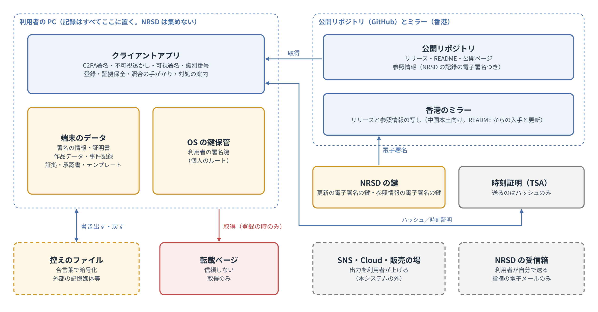
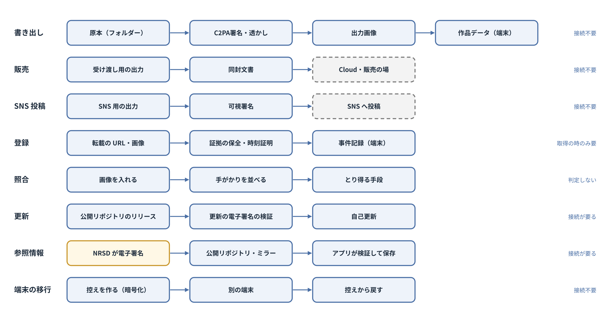
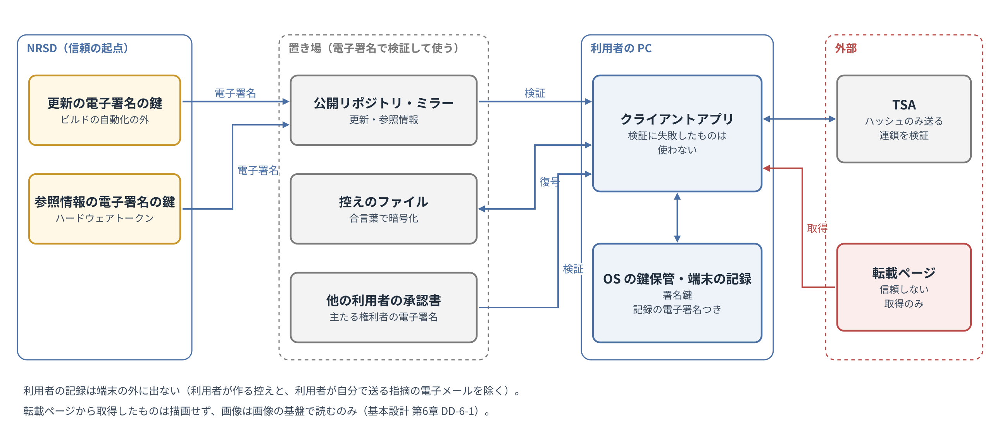

# 基本設計書 第1章 全体構成

コスプレ写真の無断転載対策ツール　第1版（案）　2026-09-29 · 石川宗  
株式会社流山ソフトウェア開発（NRSD）  
Word版: [01_基本設計書_全体構成.docx](01_基本設計書_全体構成.docx)

© 2026 株式会社流山ソフトウェア開発（NRSD）担当開発者　石川宗　本書の著作権は、株式会社流山ソフトウェア開発（NRSD）に帰属します。本書が参照する第三者の規格、ソフトウェア、法令の解説等の権利は、各権利者に帰属します。

---

## 本書の位置付け

- 概要設計書 第1章を詳細化する。本章は全章の前提であり、他の章は本章の構成、データの所在、識別子、信頼の境界、横断の方針に従う。
- 本章の節の立て方は、ソフトの構成を書く公開のひな形 arc42 の12の節（目的と目標、制約、文脈と範囲、解決の方針、構成要素、実行時の場面、配置、横断の考え方、決定、品質の要求、危険、用語集）に倣う。本章は検討メモ「第1章 全体構成の検討」（NRSD の内部の検討の記録であり、本書とともには配らない。設計の根拠となる事実は、本書の各節に出典とともに書いた）に基づく。
- 受ける決定は次の表のとおりである。

|番号|種類|内容|
|---|---|---|
|D-2-1|決定|本システムが守るものは、権利者が自らの写真に対して有する権利（著作権および肖像権）とする|
|D-2-2|決定|本システムの範囲はライセンスの適用とする|
|D-2-3|決定|本システムの最大の価値は抑止とする|
|D-2-4|決定|自動検出は別の設計計画とする|
|D-2-5|決定|販売管理は扱わない。必要とする者はForkして改造するものとし、その結果についてNRSDは関知しない|
|D-2-6|決定|法的手続の代理および法的判断は行わない|
|D-3-2|決定|閲覧者および運営者は、本システムの中で定義しない|
|D-3-3|決定|利用者がGitHubを見ずに本システムを使えることとする|
|D-5-1|決定|本システムは利用者を確かめず、利用者の情報を集めない。本システムを使うために登録を求めない|
|D-5-5|決定|本システムは照合の手段を提供するが、照合を代行しない|
|D-6-1|決定|クライアントアプリは、Windows、macOSおよびLinuxで動作するデスクトップアプリケーションとする|
|D-6-2|決定|本システムはWebサイトとしては構築しない|
|D-12-1|決定|公開リポジトリを設ける。privateリポジトリは設けない|
|D-12-3|決定|権利者情報、署名鍵、作品データ、台帳および証拠は利用者の端末に置き、NRSDは収集しない|
|D-13-1|決定|第2段は別の設計計画とする|
|D-13-3|決定|著作者への通知のための連絡先の登録は、第2段の設計計画で扱う|
|A-6|項目割りで見つけた抜け|偽のアプリへの備え|
|A-9|項目割りで見つけた抜け|費用、および GitHub の容量の制限|
|A-10|項目割りで見つけた抜け|設計計画書の決定から設計への対応表|
|A-14|項目割りで見つけた抜け|NRSD の立場と利用規約|
|A-17|項目割りで見つけた抜け|データの国外移転（第2版で NRSD が利用者の情報を受け取らないこととし、前提がなくなった）|

- 記法：「［要実測］」は、送受信・実装で確かめる事項（想定と判定の基準を併記する）。「（初期値）」は、根拠となる外部の数値がなく、運用の開始時に置く値。
- 用語は 16「用語集」にまとめる。

## 1. 設計上の決定の一覧

|番号|決定|理由|退けた案|
|---|---|---|---|
|DD-1-1|本システムは、クライアントアプリ（利用者の端末のデータを含む）と、公開リポジトリ（配布物、参照情報、公開ページ）で構成する。NRSD は、配布物と参照情報に電子署名を付ける鍵を持つ|設計計画書 D-12-1「公開リポジトリを設ける。privateリポジトリは設けない」、D-12-3「権利者情報、署名鍵、作品データ、台帳および証拠は利用者の端末に置き、NRSDは収集しない」|privateリポジトリに記録を置く案（設計計画書 第1版。利用者の情報を集めることになる）|
|DD-1-2|NRSD は常時稼働のサーバーを持たず、利用者の情報を受け取る経路を持たない（利用者が自分で送る指摘の電子メールを除く。第10章 DD-10-6「指摘は利用者が自分の電子メールで送る」、第12章 5「プライバシーポリシー」）|設計計画書 D-6-2「本システムはWebサイトとしては構築しない」、D-5-1「本システムは利用者を確かめず、利用者の情報を集めない。本システムを使うために登録を求めない」|署名・登録のサーバーを置く案|
|DD-1-3|C2PA署名の証明書は、利用者が入力した情報からクライアントアプリの中で作る。認証局を用いない|設計計画書 D-5-2「C2PA署名の証明書は、利用者が入力した情報からクライアントアプリの中で作る。認証局を要しない」。C2PA の技術仕様は証明書の発行元に資格を求めない|NRSD が認証局となる案（設計計画書 第1版の段階の設計。計画書の候補を必要と取り違えたもの）|
|DD-1-4|記録（作品データ、事件記録、証拠、テンプレート、作業、承認書）はすべて利用者の端末に置く。端末の移行と故障への備えは、利用者が作る控えのファイルで行う|設計計画書 D-10-7「証拠は利用者の端末に保存し、公開しない。本システムは証拠を収集しない」、D-12-3「権利者情報、署名鍵、作品データ、台帳および証拠は利用者の端末に置き、NRSDは収集しない」|自動の同期（外部の置き場が要る）|
|DD-1-5|完全性を要する記録（作品データ、事件記録、承認書）には利用者の鍵で記録の電子署名を付け、読む時に検証する|端末の外からの記録の書き換え（端末に触れた他人、壊れたファイル、細工した控えのファイル）を検出する。電子署名は利用者自身の鍵によるため、利用者は書き換えて署名し直せる。第三者（専門家、事業者）に対し記録がその時点で存在したことを示すのは、外部の TSA の時刻証明による（第3章 4「時刻証明」、第6章 3.2「時刻証明」）。オフラインで作った作品データは、時刻証明を後で付けるまでこれを持たない|電子署名なしで保存する案|
|DD-1-6|参照情報（窓口、文面の例、各国法の参照先、同封文書の文言）は、NRSD の記録の電子署名を付けて公開リポジトリとミラーに置き、アプリが取得して検証する|窓口・法令の変化を、アプリの更新を待たずに届ける。中国本土への経路（設計計画書 I-04「中国本土からのGitHubへの接続」）|アプリに埋め込むだけの案（更新がアプリの更新待ちになる）|
|DD-1-7|アプリはオフラインで、C2PA署名、編集、書き出し、登録の記録を行える。時刻証明、参照情報と更新の取得、転載ページの取得は接続の時に行う|撮影後の作業を回線に依存させない|常時接続を前提にする案|
|DD-1-8|画面（WebView）は表示と入力だけを受け持ち、文字の描画、画像の処理、ファイルの読み書き、通信、鍵の操作はすべて Rust の中心で行う。画面から呼べる命令は許可したものに限る|Tauri の安全の仕組みは画面と中心の間に信頼の境界を置く（Tauri の公式の安全の案内）。画面が外部の文字を表示する時の危険を中心に及ぼさない。描画を中心で行うと、3つの OS で同じ結果になる（第4章 DD-4-5「文字の組み立てと描画はプレビューも書き出しも同じ Rust の仕組みで行う」）|画面で画像を処理する案（OS ごとに結果が違う。画面の弱点が記録に及ぶ）|
|DD-1-9|記録の保存は、全記録について、一時のファイルに書いて記憶媒体に書き切ってから名前を置き換える手順で行う|書きかけで壊れた記録を残さない（品質の目標の1）|そのまま上書きする案|
|DD-1-10|データは OS の利用者ごとの、同期されない場所（Windows は Local の AppData）に置く。作り直せるもの（縮小の画像等）は OS のキャッシュの場所に置く|Windows の Roaming の AppData は組織の PC で同期され、数 GB の証拠を置くと重くなる|Roaming の AppData に置く案|
|DD-1-11|アプリは1台で1つだけ起動する。2つ目の起動は1つ目の窓を前に出して終わる|同じ記録を2つのアプリが同時に書くことを防ぐ|複数の起動を許し、記録ごとに鍵をかける案（第4章 11.7「同時に開く」 の作業の鍵は、単一起動を補うものとして残す）|

## 2. 目的と品質の目標

### 2.1 目的

- 本システムは、コスプレ写真の権利者が、写真に権利を表示し（C2PA署名、可視署名、同封文書）、許可範囲を定め、転載を登録して証拠を残し、しかるべき時に対処できる状態を整える（設計計画書 第2章「目的および範囲」）。

### 2.2 利害関係者

|者|本システムとの関係|関心|
|---|---|---|
|コスプレイヤー（利用者）|写真に C2PA署名し、販売・投稿し、転載に対処する|手間が少ない、見た目が良い、写真を壊さない|
|撮影者（利用者）|同上。コスプレイヤーと共同の権利を持つことがある|クレジットが正しく載る|
|承認を受けた者（利用者）|権利者の承認で C2PA署名・投稿する|承認の範囲が分かる|
|購入者（外）|受け渡し用画像と同封文書を受け取る|何をしてよいかが分かる|
|閲覧者（外）|投稿を見て、正規の写真かを見分ける|確かめ方が分かる|
|転載者（相手）|無断で転載する|—（抑止の対象）|
|権利者を装う者（相手）|他人の写真に先に C2PA署名する等|—（照合の手がかりで対処。第2章）|
|NRSD（運営）|アプリを作り配る。参照情報を保守する|鍵を守る、費用を抑える、責任の範囲|
|法の専門家（外）|証拠一式を受け取る。文言を確かめる|証拠の検証の手順|
|投稿先・Cloud・申立ての窓口（外の組織）|画像の置き場、申立ての受け手|—|

### 2.3 品質の目標（優先の順）

|順|目標|ISO/IEC 25010:2023 の特性|理由|
|---|---|---|---|
|1|原本と記録を失わず、壊さない|信頼性、安全性|写真は利用者の収入源であり、証拠は後の請求に要る。失えば取り返せない|
|2|非技術者が迷わず使える|使い勝手|使われなければ抑止が働かない（設計計画書 8.1「見た目」）|
|3|利用者の情報を集めず、漏らさない|セキュリティ|設計計画書 D-5-1「本システムは利用者を確かめず、利用者の情報を集めない。本システムを使うために登録を求めない」 が本システムの前提|
|4|出力が第三者の検証で通り、改ざんが分かる|機能の適合性|C2PA署名の意味がなくなる|
|5|3つの OS で同じ結果になる|互換性、柔軟性|利用者が端末を替えても、出力が変わらない|

- 性能は、上の5つを損なわない範囲で満たす（14.1）。
- 目標がぶつかる時は、順の上のものを採る。例：自動の保存（目標1）のために書き込みが増えても、速さより優先する。

## 3. 制約

|種類|制約|出どころ|
|---|---|---|
|技術|Windows・macOS・Linux のデスクトップアプリ|設計計画書 D-6-1「クライアントアプリは、Windows、macOSおよびLinuxで動作するデスクトップアプリケーションとする」|
|技術|Web サイトとして作らない。常時稼働のサーバーを持たない|D-6-2「本システムはWebサイトとしては構築しない」、DD-1-2「NRSD はサーバーを持たず、利用者の情報を受け取らない（利用者が自分で送る指摘の電子メールを除く）」|
|技術|利用者の情報を集めない。登録を求めない|D-5-1「本システムは利用者を確かめず、利用者の情報を集めない。本システムを使うために登録を求めない」|
|技術|オフラインで主な作業ができる|DD-1-7「オフラインでも C2PA署名・編集・出力・登録ができる」|
|技術|同梱する素材（フォント、モデル）は再配布を許すライセンスのもの|第4章 6「フォントと絵文字」、第11章|
|技術|動く機械：Windows 10/11 と Linux（glibc 2.35 以上）は x86-64-v3 に対応する CPU、macOS は14以上の Apple の CPU の機械。Intel の Mac は対象外|第11章 3.1「対応する OS の下限」（ONNX ランタイムの対応による）|
|組織|NRSD は認証局の免許を持たない|NRSD の決定（2026-09-29）|
|組織|NRSD は法律家ではない。法的な判断を行わない|設計計画書 D-2-6「法的手続の代理および法的判断は行わない」|
|組織|NRSD の開発と運営の体制は小さい。2026-09-30 時点で、開発・デザイン・運営を担当開発者1人が行い、委託するデザイナーはいない（第10章 DD-10-2「デザインは NRSD の担当開発者が行い、自ら判定する」）。人を増やすかは［NRSD の判断］|—|

## 4. 文脈と範囲

### 4.1 構成要素

|構成要素|持つもの|持たないもの|動く場所|
|---|---|---|---|
|クライアントアプリ|利用者の署名鍵（OS の鍵保管）、証明書、権利者情報（入力した値）、設定、テンプレート、作業、作品データ、事件記録、証拠、承認書、取得した参照情報|他の利用者のデータ|利用者の PC（Windows・macOS・Linux）|
|公開リポジトリ|ソース、リリース（配布物）、README、公開ページ、参照情報（記録の電子署名つき）|個人情報、利用者ごとの情報|GitHub（公開）|
|香港のミラー|公開リポジトリのリリースと参照情報の写し|個人情報|オブジェクトストレージ（静的な配信のみ）|
|運営者ツール|参照情報の編集、配布物への電子署名|利用者の情報|M-01「参照情報」は NRSD の管理用 PC（ネットにつながる。参照情報の電子署名の鍵はハードウェアトークン）。M-02「リリースの電子署名」はネットにつながない運営者の PC（更新の電子署名の鍵）|
|NRSD の鍵|更新の電子署名の鍵、参照情報の電子署名の鍵|利用者の情報|ネットにつながない運営者の PC（更新の電子署名の鍵）、ハードウェアトークン（参照情報の電子署名の鍵）|

図1-1 構成要素とつながり

- 境界の外：第2段（自動検出。著作者への通知のための連絡先の登録を含む。設計計画書 D-13-3「著作者への通知のための連絡先の登録は、第2段の設計計画で扱う」）、販売管理、原作の権利（概要設計書「本システムが守るもの・守らないもの」）、法的判断・代理（第7章「法的対応ガイダンス」）、利用者の情報の収集、照合の代行・判定（設計計画書 D-5-5「本システムは照合の手段を提供するが、照合を代行しない」）。

### 4.2 外部とのやり取り

- アプリ自身が端末の外とやり取りするのは、次の表の相手に限る。表にない送信をアプリはしない（品質の目標の3）。WebView2（Windows）が Microsoft に送る必須の診断データ、OS による SmartScreen・Gatekeeper の確かめ等、OS と画面の部品による送信は各社の方針による（Microsoft「WebView2 のデータとプライバシー」）。プライバシーポリシーにこの旨を記す（第12章 5.2「端末の外への送信の一覧」）。

|相手|方式|送るもの|受け取るもの|時間切れ・上限（初期値）|失敗した時|
|---|---|---|---|---|---|
|公開リポジトリ（GitHub）|HTTPS の GET|取得の要求のみ|更新の案内（JSON）、配布物、参照情報と記録の電子署名|接続10秒。案内・参照情報は全体120秒・1MB まで。配布物は全体30分（初期値。中国本土からミラーを通す遅い回線でも取得できるように）・500MB まで|ミラーを試す。どちらもだめなら次の起動で試す|
|香港のミラー|HTTPS の GET|同上|同上|同上|—|
|時刻証明の事業者（TSA）|HTTP または HTTPS の POST（RFC 3161）|ハッシュのみ（時刻証明の要求）|時刻証明の応答|接続10秒、全体30秒、応答1MB まで|次の TSA を試す（第3章 4「時刻証明」）。全部だめなら保留し、接続の時に付ける|
|RDAP|HTTPS の GET|調べるドメイン名・IP アドレス|登録の情報（JSON）|接続10秒、全体30秒、応答1MB まで|結果なしとして記録し、手で調べる方法を示す|
|DNS|OS の名前解決|調べるドメイン名|IP アドレス|OS の設定による|同上|
|転載ページ|HTTP または HTTPS の GET（利用者が登録した URL のみ。登録の時（既定。利用者はその登録に限り外せる）と「今の状態を確かめる」を押した時だけ）|取得の要求（利用者の IP アドレスが相手に見える。本システムを名乗らず、見出しは WebView の値に揃える。第6章 DD-6-8「取得の要求は本システムを名乗らない」）|ページの HTML と画像|接続10秒、全体60秒、1ページ50MB まで、転送は5回まで|取得できなかったと記録し、利用者の画面の画像で補う（第6章）|
|電子メールのソフト|OS に mailto の URL を渡す|指摘の文面（利用者が確かめてから）|—|—|文面と宛先を写せるようにする（第10章 9「指摘の受け口」）|
|OS の鍵保管|OS の API|署名鍵の保存・取り出し|—|—|第2章 7「署名鍵」|

- 投稿先・Cloud・申立ての窓口とは、本システムは直接やり取りしない。窓口は、利用者が押した時に OS の既定のブラウザで開く。
- 転載ページの取得では、相手のサイトに利用者の IP アドレスが見える。取得の前に一度その旨を示す（11.2 の脅威）。

## 5. 解決の方針

|品質の目標|方針|本書・他の章|
|---|---|---|
|1 失わない・壊さない|原本は読むだけ。記録は一時のファイルから置き換える。作業は自動で保存。控えのファイル（暗号化）を勧める|DD-1-9「記録は一時のファイルに書き切ってから置き換える」、第4章 11「作業（編集の途中の状態）」、第8章 5「控えのファイル」|
|2 迷わず使える|1つの窓、段階の表示、案内役、エラーの型。GitHub を見せない|第10章|
|3 集めない・漏らさない|サーバーを持たない。外への送信を 4.2 の表に限る。記録は端末にのみ置く。記録（ログ）に秘密を書かない|DD-1-2「NRSD はサーバーを持たず、利用者の情報を受け取らない（利用者が自分で送る指摘の電子メールを除く）」、10.4|
|4 検証で通る|C2PA の仕様に従う部品（c2pa-rs）、時刻証明、記録の電子署名|第3章、DD-1-5「端末の記録に記録の電子署名を付けて検証する」|
|5 同じ結果|描画、色の変換、書き出しを Rust の同じ部品で行う。OS のフォントを使わない|DD-1-8「画面は表示と入力だけを受け持ち、処理は Rust の中心で行う」、第4章|

## 6. 構成要素の中身

### 6.1 アプリの層

|層|部品|受け持ち|受け持たないこと|
|---|---|---|---|
|画面|WebView（HTML・CSS・TypeScript）|表示と入力。進みの表示|文字の描画、画像の処理、ファイル・通信・鍵の操作|
|命令|Tauri の命令|画面からの要求を受け、入力を確かめ（10.6）、業務の部品に渡す。長い処理は進みの知らせを画面に送る|業務の判断|
|業務|署名の情報、書き出し（署名処理）、編集（描画）、作業、権利文書、登録と証拠、照合、参照情報、更新、控え、設定|各章の機能|記録の書き方、通信の細部|
|基盤|保存、鍵保管、通信、画像の読み書き、モデルの実行、時刻証明、記録（ログ）|横断の機能（10）|業務の判断|

- 部品（crate）との対応は第11章 7.1「Rust の部品の分け方」。

### 6.2 画面と中心の間

- 画面は、許可した命令だけを呼べる（Tauri の capabilities と permissions で窓ごとに許す）。ファイルの読み書きの範囲は、アプリのデータの場所と、利用者がその都度選んだファイル・フォルダーに限る（Tauri の scopes）。
- 画面は外部の読み込みを禁じる（CSP で、アプリの内の資源以外を読み込まない）。外部の URL は、利用者が押した時に OS の既定のブラウザで開く。
- 外部から来た文字（転載ページの題、ファイル名、テンプレートの名前、参照情報の文）は、文字としてのみ表示し、HTML として解釈しない。
- 長い処理（書き出し、登録、自動配置、控え）は中心の裏の処理で行い、進みの知らせ（何枚目か、残りの見込み）を画面に送る。画面からの取り消しを受け付ける。

## 7. 実行時の場面

- 各場面の正常の手順と、失敗した時の扱いを示す。詳細は各章に置き、本章では章をまたぐ順序を示す。

図1-2 データの流れ

### 7.1 初回の起動

|順|処理|失敗した時|
|---|---|---|
|1|言語を OS の言語から選ぶ（日本語・中国語・英語、他は英語）|—|
|2|利用規約とプライバシーポリシーの表示と同意（第10章 G-02「同意」）。規約は NRSD の役務（参照情報の提供）にかかる|同意しなければ、参照情報を取得しない（同梱の包みだけを使う）。C2PA署名、編集、書き出し、登録、確かめ、記録の閲覧と取り出し、更新は使える（第12章 DD-12-3「同意で止めるのは参照情報の取得だけとする」）|
|3|署名の情報の入力、個人のルートと署名用の証明書の作成、鍵の保存（第2章 2「C2PA署名のための情報の入力」）|鍵保管に書けなければ理由を示し、先へ進めない（鍵がなければ署名できない）|
|4|告知コードと文例の表示（G-04「告知の掲示」）|—|
|5|控えのファイルを作ることを勧める（G-05「控えを作る」）|作らずに進める|

### 7.2 一括の書き出し

|順|処理|失敗した時|
|---|---|---|
|1|写真と用途を選ぶ。作業を作る（第4章 11「作業（編集の途中の状態）」）|読めない写真は印を付けて除ける|
|2|縮小の画像と自動配置（第4章 7.2「自動配置」）|—|
|3|手直し（第4章 9「編集の操作」）。作業は自動で保存|保存に失敗したら知らせる|
|4|許可範囲（受け渡し用。第5章）|—|
|5|書き出し：写真ごとに、処理の順序（第3章 8「処理の順序と系統」）で出力を一時の名前で書き、作品データを記録し、出力の名前を確定する（この順により、記録のない出力が正式の名前で残ることはない）|1枚の失敗は一覧に出して他を続ける。途中で止まれば、書き出し済みは記録済みで、続きから書き出せる|
|6|時刻証明（接続がない時は保留し、接続の時に付ける）|全部の TSA が応じなければ保留|

### 7.3 転載の登録

|順|処理|失敗した時|
|---|---|---|
|1|URL・転載画像・画面の画像を入れる（第6章）|—|
|2|照合（透かし、ハッシュ）|読めなければ「照合できない」と記録|
|3|転載ページの取得（登録のたびに既定で行う。登録の画面に、相手のサイトに IP アドレスが見える旨を示し、利用者はその登録に限り外せる。第6章 2.1「手順」）|取得できなければ記録し、画面の画像で補う|
|4|RDAP・DNS の照会|結果なしとして記録|
|5|事件記録の作成、記録の電子署名、証拠一式の時刻証明|途中で止まれば各段の状態から続ける（8.2）|

### 7.4 照合（権利者を装う者が現れた場合）

|順|処理|失敗した時|
|---|---|---|
|1|画像を入れる（第10章 G-13「確かめる」）|—|
|2|C2PA署名の検証、透かしの読み出し、照合用ハッシュの計算|読めない項目は「なし」と示す|
|3|手がかりを並べる（第2章 4.4「権利者を装う者が現れた場合の手がかり」）。判定はしない|—|

### 7.5 参照情報の取得

|順|処理|失敗した時|
|---|---|---|
|1|起動の時と24時間ごと（初期値）に、公開ページ（GitHub Pages。`https://<組織>.github.io/<リポジトリ>/reference/latest.json`）の参照情報の版を確かめる。raw.githubusercontent.com は使わない（中国本土で遮断・DNS の汚染の報告がある。調査資料「GitHubと配布」）。取得先の並び（公開ページ、次に香港のミラーの `reference/`）は、失敗した取得先を後ろに回す（更新と同じ。第9章 4.3「更新の案内（静的な JSON）の形」）|ミラーを試す|
|2|新しい版があれば取得し、包みの検証（大きさ、電子署名、版の番号が手元より大きいこと、各ファイルの SHA-256、期限）を行う（第8章 3.4「参照情報の包み」）|検証に失敗したら使わず、手元の版を使い続ける。期限を過ぎた手元の版は使い続けつつ知らせる|
|3|手元の版を置き換える（DD-1-9「記録は一時のファイルに書き切ってから置き換える」 の手順）|—|

### 7.6 更新

- 第9章 4「更新」に従う。更新の電子署名を検証し、失敗したら適用しない。

### 7.7 控えの作成と戻し

- 第8章 5「控えのファイル」に従う。控えのファイルは一時の名前で作り、完成してから名前を変える。

### 7.8 異常終了の後の起動

|順|処理|
|---|---|
|1|起動の時に「使用中」の記録を確かめる。前回が正しく閉じられていなければ、次を行う|
|2|作業：最後に保存した版で開けることを確かめ、「続きから開く」を示す（第4章 11.5「異常終了の後」）|
|3|書き出し：一時の名前のまま残った出力を消し、書き出し済みの記録と突き合わせる|
|4|登録：途中の段の事件記録を、記録した段から続ける|
|5|記録の電子署名を検証し、合わないものを知らせる|

### 7.9 オフラインの書き出しと後の時刻証明

- 書き出しは時刻証明なしで行い、作品データに「時刻証明の待ち」と記録する。接続の時に、出力の SHA-256 について時刻証明を取り、作品データに付ける（第3章 DD-3-5「時刻証明は C2PA署名の時点で取り、オフラインの場合は後で取る」）。ホームに待ちの件数を示す。

## 8. データ

### 8.1 データの一覧

|データ|生成元|保存先|公開|書き手|完全性の守り|
|---|---|---|---|---|---|
|原本|利用者（撮影、現像）|利用者の PC（本システムは読むだけ）|非公開|—|—|
|権利者情報（ハンドルネーム、役割、告知先アカウント）|利用者の入力|証明書、端末|証明書に載る範囲は C2PA署名の画像とともに公開|利用者|—|
|利用者の署名鍵|アプリ|OS の鍵保管|秘密|—|—|
|利用者の証明書|アプリ|端末、出力画像のマニフェスト|マニフェストに含まれる|利用者|利用者の鍵|
|出力画像（受け渡し用）|アプリ|利用者の PC から Cloud へ|購入者に配布|利用者|C2PA署名|
|出力画像（SNS用）|アプリ|利用者の PC から投稿先へ|公開|利用者|C2PA署名（投稿先で残らない前提）と不可視透かし|
|作品データ|アプリ|端末|非公開|利用者|記録の電子署名|
|事件記録（登録）|アプリ|端末|非公開|利用者|記録の電子署名|
|証拠（取得物）|アプリ・利用者|端末|非公開|利用者|事件記録にハッシュを記録し、時刻証明を付ける|
|承認書|主たる権利者のアプリ|両者の端末|非公開（承認を受けた者の出力のマニフェストに要旨が載る）|主たる権利者|記録の電子署名|
|テンプレート|利用者|端末|非公開|利用者|—|
|作業（編集の途中の状態）|アプリ（自動で保存）|端末|非公開|利用者|—（写真は複製せず、場所と SHA-256 を記録）|
|持ち込みの素材（フォント、画像）|利用者|端末|非公開|利用者|SHA-256 で参照|
|同封文書|アプリ（参照情報の文言から生成）|出力フォルダー|購入者|利用者|ハッシュをマニフェストに記録（第5章）|
|参照情報|NRSD|公開リポジトリ、ミラー、端末の写し|公開|NRSD|NRSD の記録の電子署名|
|設定|利用者|端末|非公開|利用者|—|
|控えのファイル|アプリ|利用者が選ぶ場所（外部の記憶媒体等）|非公開|利用者|合言葉による暗号化と改ざんの検出（第8章）|
|縮小の画像|アプリ|OS のキャッシュの場所|非公開|アプリ|—（作り直せる）|
|操作の記録（ログ）|アプリ|OS の記録の場所|非公開|アプリ|—|

### 8.2 識別子の体系

|識別子|書式|発行|一意性|
|---|---|---|---|
|識別番号|61ビットの乱数。不可視透かし（TrustMark BCH_5 のデータ部）にそのまま入れる。表示は、61ビットの値を上位に、その値の検査の4ビット（生成多項式 x^4＋x＋1 の CRC-4）を下位に置いた65ビットを、上位から5ビットずつ Crockford Base32 の13文字にし、5・5・3文字に区切る（例：値 0x1604F408204C92C5、検査 4 は `P0KT0-G82CJ-B2M`）。1つの値の表記は1つに決まり、検査の4ビットが合わない表記は無効として「識別番号の打ち間違いの可能性があります」と示す|アプリ（書き出しの時）|下の注記|
|告知コード|利用者の個人のルートの鍵（第2章 3.1「構成」）の公開鍵の SHA-256 の先頭100ビットを Crockford の Base32（第2章 DD-2-7「告知コードと識別番号は Crockford の Base32 にそろえる」）で20文字にし、`NRSD-` を付けて5文字ごとに区切る（28文字）|アプリ（初回の入力の時）|100ビットで偶然の一致を無視できる|
|事件の番号|`C` に続けて UUID v7|アプリ|衝突を無視できる|
|作業・テンプレート・一括処理の番号|UUID v7|アプリ|衝突を無視できる|
|エラーの番号|分類（英字3文字）と連番3桁（例：`SIG-012`）|設計（10.3）|—|

- 識別番号は、作品（書き出した1つのファイル）ごとに1つ発行する。同じ写真を X 用・Instagram 用・受け渡し用に書き出せば、それぞれ別の識別番号になり、同じ写真であることは作品データの原本の SHA-256 で分かる。識別番号は同じ値を不可視透かし、C2PA署名のマニフェスト、ファイル名（利用者が付けることを選んだ場合）、可視署名（差し込みを使った場合）、作品データ、事件記録に記録する。設計計画書 1.5「用語の定義」の「識別番号」であり、企画草案の「照合番号」（投稿に付して閲覧者が無断転載を判別する番号。第2節・第3節）および「作品番号」（報告された転載を作品と対応付ける番号。第6節）も同じ値とする。
- 一意性：61ビットの乱数どうしが重なる確率は、作品が1千万件でも約5万分の1（n²/2⁶²。10¹⁴÷4.6×10¹⁸）である。発行の時に手元の作品データと重ならないことを確かめる。他の利用者との重なりは、中央の台帳を持たないため確かめない。照合では識別番号と署名者の組で作品を区別する。
- 表示を上位の一部のビットに縮めると一意でなくなる（40ビットでは作品50万件で約1割の確率で重なる）。照合番号として閲覧者が使う番号であるため、縮めない。
- 作品登録番号（公的な登記の番号）は本システムが発行する番号ではなく、利用者が告知・可視署名に書く文字列として扱う。

### 8.3 形式と版

- 記録は JSON（UTF-8、キーは英字）。各記録に `schema`（例：作品データは `nrsd.work/1`、作業は `nrsd.session/1`）を持たせる。
- 版を上げる時は、古い版を読む処理をアプリに持たせ、アプリの更新の後の初回の起動で新しい版に移す。移す前の記録の写しは第9章 4.4「記録の形式の移行」の手順で残す。
- アプリは自分より新しい版の記録を読んだら、書き換えずに読むだけにし、更新を促す。
- 記録の電子署名は、JSON を正規化（RFC 8785 JCS）したうえで、署名用の証明書の鍵の ECDSA P-256 で行い、別のファイル（`.sig`）に置く。`.sig` には署名用の証明書と個人のルートの証明書を添える（第2章 DD-2-10「記録の電子署名は署名用の証明書の鍵で付け、証明書の連なりを添える」）。ただし承認書・取り消し書・共同の権利の書面は、1つのファイルで受け渡すため、署名を JSON の中の `signatures` に置く（第2章 5.3「書類の形式」）。

### 8.4 保持と削除

- すべての記録は利用者の端末にあり、利用者が削除しない限り保持する。アプリが自動で削除するのは次のものに限る：操作の記録（90日。初期値）、縮小の画像（作業を消した時と、キャッシュが1GB を超えた時の古いもの。第8章 6.1「端末の容量の目安」）、作業の版の控えのうち5つを超えた古いもの（第4章 11.4「版の控え」）、異常終了の後に残った一時のファイル（7.8）、記録の形式の移行の写し（30日。第9章 4.4「記録の形式の移行」）。利用者の記録（作品データ、事件記録、証拠、テンプレート、承認書）は自動で削除しない。
- 事件記録・証拠の削除の前に、損害賠償の請求の期間（日本・中国とも知った時から3年・行為の時から20年、米国は請求の発生から3年。法務調査 L-20「損害賠償の請求の期間（日・中・米）」）を示し、書き出しを勧める。
- NRSD は利用者のデータを持たないため、NRSD の側の保持・削除の方針は生じない。

### 8.5 秘密情報の一覧

|秘密|置き場|漏れた時|
|---|---|---|
|利用者の署名鍵|OS の鍵保管（Windows 資格情報マネージャー・DPAPI、macOS キーチェーン、Linux Secret Service。Secret Service のない Linux は合言葉で暗号化した鍵のファイル。第2章 7.5「OS ごとの保管の方式」）。控えのファイルの中では利用者の合言葉で暗号化|利用者が鍵を作り直し、告知コードを掲げ替える（第2章 7「署名鍵」）|
|控えのファイルの合言葉|利用者の記憶（アプリは保存しない）|控えのファイルを持つ者に読まれ得る。新しい控えを作り、古い控えを消す|
|参照情報の電子署名の鍵|ハードウェアトークン（NRSD の管理用 PC）|偽の参照情報を配られ得る。新しい公開鍵をアプリの更新で配る（第9章）|
|アプリの更新の電子署名の鍵|Tauri の署名の鍵のファイル（合言葉で暗号化）を、ネットにつながない運営者の PC に置く。紙の控えを金庫に置く（第9章 DD-9-4「更新の電子署名の鍵は CI の外に置き、コード署名の資格は CI の秘密に置く」）|偽の更新を配られ得る。失うと更新を配れない（第9章）|
|コード署名の資格（Windows）|Artifact Signing の署名の権限（Azure の Artifact Signing の署名者の役割を持つ資格。CI の秘密、リリースの環境に限る。第11章 8.3「秘密の扱い」）。証明書そのものはサービスの中にあり、NRSD には渡らない|正しくコード署名された偽の配布物を作られ得る。資格を無効にし、Artifact Signing の窓口に届ける（第13章 H-44「CI・GitHub の組織が乗っ取られると、正しくコード署名された偽の配布物を公式のリリースに置かれ得る」）|
|コード署名の資格（macOS）|Developer ID Application の証明書と秘密鍵（.p12 とその合言葉）、公証に使う App Store Connect の API の鍵。CI の秘密（リリースの環境に限る）。原本は運営者の管理用 PC|正しく署名・公証された偽の配布物を作られ得る。Apple に証明書の失効を求める（第13章 H-44「CI・GitHub の組織が乗っ取られると、正しくコード署名された偽の配布物を公式のリリースに置かれ得る」）|
|香港のミラーの書き込みの鍵|阿里云の RAM の利用者の AccessKey（このバケットへの書き込みだけの権限）。運営者の管理用 PC（第9章 6.1「手順」 の6。写しは運営者が行う）|ミラーの中身を書き換えられ得る。配布物と参照情報は電子署名で検証されるため適用されないが、案内の書き換えは版の照合で防ぐ（第9章 DD-9-2「更新は Tauri の仕組みで取得し、案内と電子署名の版を照らす」）。鍵を無効にし作り直す|
|GitHub の組織の所有者のアカウント|パスキーまたはセキュリティキー（2本以上）、時刻の一回きりの番号、紙の回復の番号（第8章 3.5「GitHub のアカウントとリポジトリの守り」）|公開リポジトリ・リリース・公開ページ（README の SHA-256 を含む）を書き換えられ得る（第13章 H-44「CI・GitHub の組織が乗っ取られると、正しくコード署名された偽の配布物を公式のリリースに置かれ得る」）。GitHub に届け、アカウントを取り戻す|

### 8.6 多言語のファイル名と文字

- ファイル名は UTF-8（NFC に正規化）で扱う。OS で使えない文字（Windows の `\ / : * ? " < > |` 等）は `_` に置き換える。
- アプリのデータの場所の中で本アプリが作るファイルとフォルダーの名前は英数字（番号）とし、利用者の入力した名前は JSON の中に置く。書き出しの出力の名前（撮影の名前、元のファイル名を使う）は第3章 10.1「名前と構成」 による。

## 9. 配置

### 9.1 OS ごとの置き場所

|置くもの|場所（Tauri の呼び名）|Windows|macOS|Linux|
|---|---|---|---|---|
|記録、作業、証拠、テンプレート、持ち込みの素材、設定、取得した参照情報|app_local_data_dir|Local の AppData の下のアプリの番号|~/Library/Application Support の下|$XDG_DATA_HOME（なければ ~/.local/share）の下|
|縮小の画像等、作り直せるもの|app_cache_dir|Local の AppData の下|~/Library/Caches の下|$XDG_CACHE_HOME（なければ ~/.cache）の下|
|操作の記録（ログ）|app_log_dir|Local の AppData の下の logs|~/Library/Logs の下|local_data_dir の下の logs|
|署名鍵|OS の鍵保管|資格情報マネージャー・DPAPI|キーチェーン|Secret Service（ない場合は app_local_data_dir の下の合言葉で暗号化した鍵のファイル。第2章 7.5「OS ごとの保管の方式」）|

- 出典：Tauri の PathResolver の説明。
- Roaming の AppData（app_data_dir の Windows の場所）は使わない（DD-1-10「データは同期されない利用者ごとの場所に置く」）。
- 置き場所の中の配置は第8章 2.1「配置」で定める。

### 9.2 導入

- 配布物は OS ごとに1つ（第9章 DD-9-1「配布物は OS ごとに1つとし、コード署名する」）。管理者の権限を要しない、利用者ごとの導入とする。

### 9.3 単一起動

- 1台で1つだけ起動する（DD-1-11「アプリは1台で1つだけ起動する」）。Tauri の単一起動のプラグイン（tauri-plugin-single-instance。Windows・macOS・Linux に対応し、Linux では DBus を使う。2つ目の起動は1つ目に知らせて終わる。プラグインは最初に登録しなければならない）を使う。出典：Tauri の公式の案内（v2.tauri.app/plugin/single-instance）。
- 2つ目の起動で写真・フォルダーが渡されていれば（ファイルを窓に落とした等）、1つ目がそれを受け取る。

## 10. 横断の考え方

### 10.1 データのモデル

|もの|持つもの|他との関係|
|---|---|---|
|署名の情報|ハンドルネーム、役割、告知先アカウント、証明書、告知コード|作品・承認書・事件の署名者|
|テンプレート|まとまり、層、書式、素材|作業が写しを持つ|
|作業|写真の一覧、手直し、書き出しの型、履歴|1つの作業から作品が生まれる|
|作品（作品データ）|識別番号、原本の SHA-256、出力の SHA-256、PDQ、時刻証明、許可範囲、同封文書のハッシュ|事件から参照される|
|事件（事件記録）|転載の URL、状況の履歴、証拠一式|作品を参照する（照合の結果）|
|証拠|取得物、画面の画像、ハッシュの一覧、時刻証明|事件に属する|
|承認書|主たる権利者、承認を受けた者、範囲、期間|作品の署名者の権利の根拠|
|参照情報|窓口、文面、各国法の参照先、同封文書の文言、版|権利文書・ガイダンスが使う|

### 10.2 保存

- すべての記録は DD-1-9「記録は一時のファイルに書き切ってから置き換える」 の手順で書く：一時のファイルに書く、記憶媒体に書き切る（`File::sync_all`）、名前を置き換える（Windows は `MoveFileExW` に既存の置き換えと書き切りの指定、macOS・Linux は `rename`）、macOS・Linux はフォルダーも書き切る。出典と理由は第4章 11.3「保存の方法」。
- 完全性を要する記録（作品データ、事件記録、承認書）には記録の電子署名を付ける（DD-1-5「端末の記録に記録の電子署名を付けて検証する」）。読む時に検証し、合わなければ使わずに知らせる。
- 同じ記録を2つの処理が同時に書かない。記録ごとに書き手の処理を1つに決め、他の処理は書き手に頼む。

### 10.3 エラー

- エラーは、分類と番号（8.2）、利用者への文、記録（ログ）への文を持つ。

|分類|中身|
|---|---|
|`IMG`|画像の読み書き|
|`SIG`|C2PA署名、証明書、鍵|
|`TSA`|時刻証明|
|`NET`|通信|
|`STO`|保存、容量|
|`REF`|参照情報|
|`UPD`|更新|
|`CAS`|登録、証拠|
|`BAK`|控えのファイル|
|`INP`|入力の確かめ|

- 利用者への表示は第10章 DD-10-8「エラーの表示の型をそろえる」の型（何が起きたか、原本と記録は無事か、次にすること、番号）に従う。
- 番号の一覧（番号、分類、原因、利用者への文、次にすること）は実装の時に作り、画面の文言ファイル（第11章 DD-11-8「国際化は文言ファイルで行う」）と同じ3言語で持つ。

### 10.4 操作の記録（ログ）

- 目的：利用者の指摘（第10章 9「指摘の受け口」）の時に、利用者が自分で添えられる原因の手がかり。アプリは自動では送らない。
- 書くこと：時刻（UTC）、アプリの版、処理の種類、エラーの番号、件数と所要時間。
- 書かないこと：署名鍵、合言葉、証拠の中身、転載ページの中身、写真の場所の全体（ファイル名のみ）、権利者情報、URL の問い合わせの部分。
- 大きさ：1ファイル10MB で切り替え、合計50MB まで（初期値）。保持は90日（初期値）。
- 利用者は、設定から記録の場所を開ける（指摘に添えるため）。

### 10.5 並行処理

- 長い処理（書き出し、自動配置、登録、控え）は中心の裏の処理で行い、画面を止めない。進みを知らせ、取り消せる。
- 1度に動かす長い処理は、種類ごとに1つ（書き出しを2つ同時にしない）。別の種類は並べて動かせる（書き出しの間に登録できる）。
- 画像の処理の並行の数は第4章 14.4「大きな画像と並行の処理」の式による。

### 10.6 外から入るものの確かめ

|入るもの|上限・確かめ（初期値）|章|
|---|---|---|
|写真|1億画素・1枚200MB まで。形式を中身で判定（拡張子ではなく）|第3章、第4章|
|画像の層の画像|20MB、縦横8,000画素まで。PNG・JPEG のみ|第4章 5「画像の層」|
|持ち込みのフォント|50MB まで。TTF・OTF のみ|第4章 6.4「持ち込みのフォント」|
|テンプレートのファイル|ZIP の中のファイル50、展開後の合計100MB まで、名前に `..` を含まない|第4章 8.3「受け渡し（書き出しと取り込み）」|
|控えのファイル|合言葉による暗号の認証で改ざんを検出。展開後の大きさは中の目録と一致すること|第8章 5「控えのファイル」|
|参照情報|1MB まで。記録の電子署名を検証|7.5|
|更新|更新の電子署名を検証|第9章|
|転載ページ|50MB まで、転送5回まで、時間切れ60秒。描画しない、スクリプトを実行しない|第6章 DD-6-1「転載ページはスクリプトを実行せずに取得する」|
|TSA の応答|1MB まで。証明書の連鎖を検証|第3章|
|RDAP の応答|1MB まで|第6章|

- 画像の画素数は、記憶を割り当てる前に、ファイルの見出しの縦横から確かめる（解凍爆弾への備え。Rust の image の縦横の上限は厳格に効く）。

### 10.7 時刻

- 端末の時計は信頼しない。証拠としての時刻は RFC 3161 の時刻証明で示す。
- 記録には UTC の ISO 8601 で書き、表示は利用者の地域の時刻に変換し、時差を添える（例：UTC+9）。

### 10.8 言語と国

- 「画面の言語」と「権利文書の対象国」を別々の設定として持つ（R-1-7-2「画面の言語と権利文書の国が別々に扱われる。」）。
- 画面の文言は言語ごとの文言ファイル（第11章 DD-11-8「国際化は文言ファイルで行う」）に置き、画面に文字を直に書かない。

### 10.9 版の互換性

- アプリの版、記録の `schema` の版、C2PA の仕様の版（第3章 DD-3-7「C2PA の仕様の版は c2pa-rs の版に従う」）、参照情報の版を別々に持つ。

## 11. 信頼と脅威

### 11.1 信頼の境界

|境界|渡るもの|検証|
|---|---|---|
|画面と中心の間|命令と結果|許可した命令のみ。入力を確かめる（DD-1-8「画面は表示と入力だけを受け持ち、処理は Rust の中心で行う」、10.6）|
|アプリと公開リポジトリ・ミラーの間|更新、参照情報|更新は更新の電子署名、参照情報は NRSD の記録の電子署名を検証。失敗したら使わない|
|アプリと TSA の間|ハッシュ、時刻証明の応答|TSA の証明書の連鎖を検証。送るのはハッシュのみ|
|アプリと転載ページの間|取得物|信頼しない。スクリプトを実行せず、描画しない（第6章）|
|アプリと端末のファイルの間|記録、証拠|読む時に記録の電子署名とハッシュを検証（DD-1-5「端末の記録に記録の電子署名を付けて検証する」）|
|アプリと他の利用者の間|承認書、テンプレートのファイル|承認書は主たる権利者の記録の電子署名を検証。テンプレートは形式と大きさを確かめる|

図1-3 信頼の境界

### 11.2 脅威の一覧

- 要素（利用者、画面、アプリの中心、端末の記録、OS の鍵保管、控えのファイル、公開リポジトリ・ミラー、TSA、転載ページ、NRSD の運営者ツールと鍵）ごとに、STRIDE の6つの分類（なりすまし、改ざん、否認、情報の漏れ、使えなくする、権限の昇格。Microsoft の脅威の分類）を当てはめて洗い出した。

|番号|分類|脅威|攻撃する者|狙う資産|対策|残る破れ|
|---|---|---|---|---|---|---|
|T-1|なりすまし|権利者を装って先に C2PA署名する、または C2PA署名を付け替える|他人の写真を入手した者|権利性|照合の手がかり（第2章）|防げない（第13章）|
|T-2|なりすまし|真の権利者の投稿を転載として扱い、事業者に申し立てる|同上|真の権利者の投稿|手がかりと、とり得る手段（第2章、第7章）|本システムの外での申立ては防げない|
|T-3|なりすまし|偽のアプリを配る|第三者|署名鍵、記録|コード署名、公式の入手経路（第9章）|README 以外から入手した利用者|
|T-4|なりすまし|利用者の署名鍵を盗んで C2PA署名する|端末を侵害した者|本人性|OS の鍵保管、鍵の作り直し（第2章）|端末が完全に侵害された場合|
|T-5|情報の漏れ|控えのファイルを盗んで読む|ファイルを入手した者|署名鍵、記録|合言葉による暗号化（第8章）|弱い合言葉|
|T-6|改ざん|端末の記録を書き換える|端末に触れた者|事件記録、証拠|記録の電子署名（DD-1-5「端末の記録に記録の電子署名を付けて検証する」）|署名鍵ごと奪われた場合|
|T-7|なりすまし・改ざん|偽の参照情報・更新を配る|公開リポジトリを乗っ取った者|全利用者|電子署名の検証（第8章 3.4「参照情報の包み」、第9章 4「更新」）|署名鍵そのものの漏れ|
|T-8|権限の昇格|NRSD の鍵を盗む|内部・外部|全利用者|更新の電子署名の鍵はネットにつながない PC、参照情報の電子署名の鍵はハードウェアトークン、どちらもビルドの自動化の外（第9章 DD-9-4「更新の電子署名の鍵は CI の外に置き、コード署名の資格は CI の秘密に置く」）|鍵そのものが盗まれた場合（第13章 H-22「NRSD の鍵（更新・参照情報）が盗まれた場合、偽の更新・参照情報を配られ得る」）|
|T-9|権限の昇格|転載ページの取得で悪性の中身に触れる|悪性のサイト|利用者の端末|スクリプトを実行しない取得（第6章）|利用者自身のブラウザでの閲覧|
|T-10|なりすまし|偽の時刻証明の応答|通信の途中の者|時刻の証明|TSA の証明書の連鎖の検証（第3章）|—|
|T-11|改ざん|取り込むテンプレート・控えのファイルの中身を細工する|ファイルを渡す者|アプリの中心、記録|形式と大きさの確かめ（10.6）。控えは暗号の認証で改ざんを検出|—|
|T-12|否認|NRSD が配った参照情報の中身を後で否定する|NRSD|利用者の申立ての根拠|版と記録の電子署名を利用者の端末に残す（7.5）|—|
|T-13|情報の漏れ|転載ページの取得で、相手のサイトに利用者の IP アドレスが見える|転載サイトの運営者|利用者の所在|登録の時に既定で取得し、登録の前に示す。利用者はその登録に限り外せる（4.2、第6章 2.1「手順」）|取得した場合は見える（第13章 H-26「転載ページの記録を取ると（登録の既定）、相手のサイトに利用者の IP アドレスが見える」）|
|T-14|情報の漏れ|操作の記録（ログ）に鍵・証拠・個人の情報が出る|記録を見た者|秘密、個人の情報|記録に書かない項目を決める（10.4）|—|
|T-15|使えなくする|巨大な画像、解凍爆弾（画像、テンプレート、控えの ZIP）|ファイルを渡す者|アプリの中心|画素数・ファイル数・展開後の大きさの上限（10.6）|—|
|T-16|使えなくする|転載ページの巨大な応答、転送の繰り返し、応答の遅延|悪性のサイト|アプリの中心|時間切れ、大きさの上限、転送の回数の上限（4.2）|—|
|T-17|権限の昇格|画面に表示した外部の文字で画面の命令が動く|外部の文字を仕込む者|画面、中心|外部の文字を HTML として解釈しない、CSP で外部の読み込みを禁じる（6.2）|—|
|T-18|権限の昇格|画面から任意のファイルを読み書きする命令を呼ぶ|画面を乗っ取った者|端末のファイル|命令の許可制、ファイルの範囲の制限（6.2）|—|
|T-19|権限の昇格|悪性のフォント・画像でアプリの中心の脆弱性を突く|ファイルを渡す者|アプリの中心|Rust の部品で読む、形式・大きさを限る（10.6）|部品の未知の脆弱性|
|T-20|改ざん|古い正しい参照情報の包みを返し続け、または古い版に戻す（凍結・版の戻し）|ミラー・通信の経路を乗っ取った者|アプリ（参照情報）|包みの版の番号（手元より古いものを受け付けない）と期限（過ぎたら知らせる）（第8章 3.4「参照情報の包み」）|凍結の間、新しい窓口は届かない|
|T-21|情報の漏れ|転載ページの取得の要求から、証拠を集めていることが転載者に知られる|転載ページの運営者|事件（証拠の保全）|取得の要求で本システムを名乗らない。送った見出しを WARC に残す（第6章 DD-6-8「取得の要求は本システムを名乗らない」）。VPN の案内|IP アドレスは相手に見える（H-26「転載ページの記録を取ると（登録の既定）、相手のサイトに利用者の IP アドレスが見える」）|
|T-22|なりすまし・改ざん|CI または GitHub の組織を乗っ取り、正しくコード署名された偽の配布物を公式のリリースに置き、README の SHA-256 も書き換える|CI・所有者のアカウントを乗っ取った者|新規に入手する利用者|更新の電子署名は CI の外（既存の利用者の更新には効かない）。所有者の二段階の認証と複数の認証の手段、主の枝とタグの規則、改変できないリリース（第8章 3.5「GitHub のアカウントとリポジトリの守り」）。リリースの秘密はリリースの環境に限る（第11章 8.3「秘密の扱い」）|新規の入手者は OS のコード署名と README の SHA-256 でしか見分けられず、両方を奪われると見分けられない（第13章 H-44「CI・GitHub の組織が乗っ取られると、正しくコード署名された偽の配布物を公式のリリースに置かれ得る」）|
|T-23|改ざん|公開ページの「告知コードを確かめる」頁を書き換え、偽の告知コードを示す|GitHub の組織を乗っ取った者|照合する閲覧者|所有者の二段階の認証、主の枝の規則（第8章 3.5「GitHub のアカウントとリポジトリの守り」）。同じ計算はアプリの G-13「確かめる」 で行え、計算の方法を公開している（第2章 2.4「告知コードの作り方」）|組織を奪われた場合（第13章 H-44「CI・GitHub の組織が乗っ取られると、正しくコード署名された偽の配布物を公式のリリースに置かれ得る」）|

## 12. 外部への依存

|外部|止まった時|
|---|---|
|TSA|C2PA署名は続け、時刻証明を保留する。複数の TSA を順に試す（第3章）|
|GitHub|更新と参照情報はミラーから取得する。記録は端末にあるため作業は止まらない|
|香港のミラー|GitHub から取得する|
|投稿先|本システムの外|
|OS の鍵保管|署名できない。理由を示す（第2章）|

## 13. 端末と人

- 端末の紛失・故障（R-1-6-1「端末の紛失・故障に備え、利用者が記録を書き出し、別の端末で取り込める。」）：記録と署名鍵は端末にしかない。利用者が定期に控えのファイル（第8章 5「控えのファイル」）を作り、外部の記憶媒体等に置く。アプリは、控えを作ってから30日（初期値）でホームに勧めを出す。新しい端末で取り込めば、署名鍵・告知コード・記録を取り戻せる。控えがない場合は鍵を作り直し、告知コードを掲げ替える（第2章 7「署名鍵」）。
- 複数の端末（R-1-6-2「1人が複数の端末を使える。」）：控えのファイルを別の端末で取り込み、同じ署名鍵を使う（告知コードが1つで済む）。2台で並行して記録を作った場合の統合は第8章 5「控えのファイル」 による。
- 承認関係と権利の移転（R-1-6-3「権利の移転と終了（承認の取り消しを含む）を扱える。」）：承認書の発行・取り消し（第2章 5「承認と共同の権利」）。権利者の変更は、新しい権利者が自分の情報で C2PA署名する。過去の作品データは移さない。

## 14. 品質の要求

### 14.1 規模と性能の目安

|項目|目安|根拠|
|---|---|---|
|1回の一括処理|1フォルダー最大500枚（初期値）|撮影1回分の納品を想定|
|画像の大きさ|最大1億画素・200MB/枚（初期値）|中判・高画素機の現像の出力を想定|
|1枚あたりの処理時間（C2PA署名、不可視透かし、ハッシュの計算の合計）|一般的な PC の CPU で10秒以内|［要実測］TrustMark の CPU の推論の時間（第3章）|
|500枚（2,400万画素）の SNS 用の書き出し|30分以内（初期値）|［要実測］|
|1利用者の証拠|年間200件、1件あたり20MB 以内（初期値）|端末の容量の目安（第8章 6「容量」）|
|アプリの起動|10秒以内に操作できる（初期値）|［要実測］|

- 「一般的な PC」は、4コア以上の CPU（x86-64-v3 に対応するもの、または Apple の CPU）、16GB の記憶、SSD とする（初期値）。
- 目安を外れた場合の設計の扱い：起動が10秒を超える場合は、ONNX ランタイムとモデル、同梱のフォントの読み込みを、最初に使う時（書き出し、編集の画面を開いた時）まで遅らせる。500枚の SNS 用の書き出しが30分を超える場合は、同時に処理する枚数（第4章 14.4「大きな画像と並行の処理」）と透かしの variant（第3章 5「不可視透かし」）を見直す。1枚あたり10秒を超える場合も同じ。

### 14.2 品質のシナリオ

- 各場面を満たすかの確かめ方（試験の手順と合格の判定）は、試験の文書で定める。本節は、品質の目標ごとに設計が応えるべき場面と応答だけを示す。

|目標|場面|求める応答|
|---|---|---|
|1|書き出しの途中で PC の電源が落ちる|原本は変わらない。書き出し済みは記録され、続きから書き出せる。作業の変更は最後の2秒まで失うだけ|
|1|記録の保存の途中でアプリが落ちる|記録は前の版か新しい版のどちらかで残り、壊れた記録はない|
|1|控えのファイルから別の端末に戻す|署名鍵と全記録が戻り、記録の電子署名がすべて通る|
|2|初めての利用者が、説明なしで初回の入力と告知の掲示を終える|5人中4人が終える|
|3|アプリが外へ送るものを数える|4.2 の表の相手と中身だけ|
|4|書き出した画像を公開の検証サイトで確かめる|C2PA署名が有効と出る（信頼済みとは出ない。第2章 3.3「検証器での見え方」）|
|4|書き出した画像の画素を1つ変える|検証で改ざんが出る|
|5|同じ作業を3つの OS で書き出す|画素の値の差が1以内|
|性能|500枚を X 用に書き出す|30分以内（14.1）|

## 15. 危険

|危険|影響|備え|
|---|---|---|
|縦書きの組版を自作する|作る量が増え、誤りが出やすい|試験の文を決めて確かめる（第4章 3.3「縦書き」）|
|HarfRust、vello_cpu 等の部品が若い|版の上げで壊れる|版を固定し、上げる時に試す（第11章）|
|moxcms の色の正確さ|色がずれる|lcms2 と比べる（第4章 14.2「処理」）|
|TrustMark の透かしが SNS の再圧縮で読めない|照合の手がかりが減る|実測（第3章）|
|GitHub のアカウントの停止|配布が止まる|ミラーと別のホスティング（第8章 7「GitHub への依存」）|
|中国本土から届かない|中国の利用者が入手・更新できない|香港のミラー（README の中国語の節からの直接の入手と、更新・参照情報の取得。第8章 3.6「香港のミラーの運用」、第9章 5「入手経路」）|
|コード署名の評判（Windows の SmartScreen）|初めの頃に警告が出る|案内（第9章）|
|配布物が大きい（フォント約71MB、モデル約70MB（TrustMark 約65MB、u2netp 約4.6MB）、ONNX ランタイム）|入手に時間がかかる|LXGW WenKai は Lite 版を採った（第4章 6.1「同梱のフォント」）。判定300MB 以下（第9章 2.1「OS ごとの配布物」）|
|NRSD の体制が小さい|鍵・参照情報の保守が止まる|鍵の控えの手順（第9章）。［NRSD の判断］体制|

## 16. 用語集

|用語|意味|
|---|---|
|C2PA署名|画像に付ける暗号の署名（C2PA の技術仕様によるマニフェストの署名）|
|可視署名|写真の画素に描き込む名前やクレジット（第4章）|
|記録の電子署名|作品データ・事件記録・承認書・参照情報に付ける暗号の署名|
|コード署名|配布物に OS が確かめる署名を付けること（第9章）|
|更新の電子署名|更新の配布物に NRSD の更新の電子署名の鍵で付ける署名（第9章）|
|個人のルート|利用者の端末で作る、署名用の証明書を発行する証明書（第2章）|
|告知コード|個人のルートの公開鍵の指紋を短くした文字列。告知先アカウントに掲げる（第2章）|
|識別番号|作品ごとの番号。透かし、マニフェスト等に入れる（8.2）|
|作業|編集の途中の状態をまとめたもの（第4章 11「作業（編集の途中の状態）」）|
|テンプレート|可視署名のまとまりと層の型（第4章 8「テンプレート」）|
|まとまり、層|可視署名の配置の単位と、その中の文字・画像の要素（第4章 4「まとまりと層」）|
|作品データ|書き出した作品の記録（第3章）|
|事件、事件記録|登録した転載と、その記録（第6章）|
|証拠一式|事件の取得物、画面の画像、ハッシュの一覧、時刻証明（第6章）|
|参照情報|窓口、文面の例、各国法の参照先、同封文書の文言（DD-1-6「参照情報は NRSD が電子署名して公開リポジトリとミラーに置く」）|
|控えのファイル|署名鍵と全記録を合言葉で暗号化した1つのファイル（第8章）|
|承認書|主たる権利者が承認を与える記録（第2章 5「承認と共同の権利」）|

## 17. 要件との対応

|要件の番号|要件の内容|本書で受ける節|
|---|---|---|
|R-1-1-1|各構成要素が持つもの・持たないものが一意に決まっている|4.1「構成要素」、6「構成要素の中身」|
|R-1-1-2|第2段・販売管理・原作の権利・利用者の情報の収集が境界の外にあることが明示されている|4.1「構成要素」|
|R-1-2-1|全データについて、生成元・保存先・公開/非公開・書き手が決まっている|8.1「データの一覧」|
|R-1-2-2|識別子の体系と、データの形式の版が決まっている|8.2「識別子の体系」、8.3「形式と版」|
|R-1-2-3|秘密情報（利用者の署名鍵、NRSD の鍵）の置き場が一覧になっている|8.5「秘密情報の一覧」|
|R-1-2-4|保持と削除の方針が決まっている|8.4「保持と削除」|
|R-1-2-5|多言語のファイル名・文字を扱える|8.6「多言語のファイル名と文字」|
|R-1-3-1|署名・販売・SNS投稿・登録・更新・参照情報の配布の各流れが、始点から終点まで途切れない|7「実行時の場面」|
|R-1-3-2|部分失敗しても、データの食い違いが残らない|7「実行時の場面」、10.2「保存」|
|R-1-3-3|オフラインでできる作業と、接続が要る作業が区別され、オフライン時は保留できる|4.2「外部とのやり取り」、7.9「オフラインの書き出しと後の時刻証明」|
|R-1-4-1|信頼の境界が図で示されている|11.1「信頼の境界」|
|R-1-4-2|脅威（なりすまし、偽アプリ、鍵の窃取、改ざん）の一覧がある|11.2「脅威の一覧」|
|R-1-5-1|TSA・GitHub・投稿先が止まったときの振る舞いが決まっている|12「外部への依存」|
|R-1-6-1|端末の紛失・故障に備え、利用者が記録を書き出し、別の端末で取り込める|13「端末と人」|
|R-1-6-2|1人が複数の端末を使える|13「端末と人」|
|R-1-6-3|権利の移転と終了（承認の取り消しを含む）を扱える|13「端末と人」|
|R-1-7-1|規模と性能の目安、障害時の扱い、記録（操作ログ）、版の互換性、時刻の扱いが全章で共通|10「横断の考え方」、14「品質の要求」|
|R-1-7-2|画面の言語と権利文書の国が別々に扱われる|10.8「言語と国」|
|R-1-8-1|NRSDの関与点、運用体制、障害時の連絡が決まっている|18「運営」|
|R-1-8-2|運営費用とその負担者が決まっている|18「運営」|
|R-1-9-1|構成図、データの流れ図、信頼の境界図がある|4.1「構成要素」（図1-1）、7「実行時の場面」（図1-2）、11.1「信頼の境界」（図1-3）|
|R-1-9-2|設計計画書の決定番号から本書の要件番号への対応表がある|第13章 1.2「設計計画書の決定から概要設計書・基本設計への対応」|
|R-1-9-3|章の依存表と、基本設計に入る順序がある（下記）|概要設計書 1-9「図と対応」、20「章の依存」|
|R-1-10-1|NRSDがリリース、参照情報の保守、指摘の受け付けを行える|19「運営者ツール」|
|R-1-10-2|運営者機能そのものが、偽の更新・偽の参照情報の経路にならない|19「運営者ツール」|

## 18. 運営

### 18.1 NRSD の関与点と体制

|作業|頻度|担当|
|---|---|---|
|参照情報の保守（窓口・文面・法令）|四半期ごと、および変更の都度|NRSD の運営担当（権利文書の文言は専門家の確認。第5章）|
|指摘の受け付け（第10章 9「指摘の受け口」）|随時。受け取りを7日以内（初期値）に返す|NRSD の運営担当|
|リリース|随時|NRSD の開発担当|
|鍵の管理（更新の電子署名の鍵の鍵のファイルと紙の控え、参照情報の電子署名の鍵のハードウェアトークン）|年1回の確かめ（初期値）|NRSD の代表|

- 担当の運営・開発・代表は役割の名前であり、2026-09-30 時点では担当開発者1人がすべてを兼ねる（3「制約」）。GitHub の組織の所有者は、信頼できる別の人を2人目とする（第8章 DD-8-9「GitHub の組織と改変できないリリースで守る」）。2人目を置けるまでは所有者1人で運用し、認証の手段を複数登録し、回復の番号を紙で別の場所に置き、公開リポジトリの写しを手元に保つ（第8章 3.5「GitHub のアカウントとリポジトリの守り」）。本人の2つ目のアカウントを所有者にしない（無料のアカウントは1人1つ（GitHub の利用規約 B.3）であり、GitHub の勧めは「2人以上の人」である）。組織を回復できない危険は破れとして宣言する（第13章 H-45「GitHub の組織の所有者が1人の間、その者がアカウントの認証の手段と回復の手段をすべて失うと、組織を回復できない」）。
- NRSD は利用者の受け入れ、証明書の発行、記録の保管を行わない。

### 18.2 運営費用（公開の初期の目安・2026年9月調べ）

|項目|費用|出典|
|---|---|---|
|Apple Developer Program（macOS のコード署名・公証）|年99ドル|調査資料「GitHubと配布」|
|Azure Artifact Signing（Windows のコード署名）|月9.99ドル（5,000回）。有料の Azure の契約（従量課金等）が要る。無料・試用の契約では使えない|同上、Microsoft「Artifact Signing FAQ」|
|GitHub（公開リポジトリ）|公開リポジトリの Actions の標準の実行環境は無料|同上|
|香港のミラー（オブジェクトストレージ）|外への転送は月5GB まで無料。超えた分は阿里云の単価（［要見積］）。式は第8章 6.3「ミラーの費用の見積もり」|第8章 6.3「ミラーの費用の見積もり」|
|時刻証明（C2PA署名の時）|無料の TSA（DigiCert 等）|調査資料「署名処理の技術要素」|
|ハードウェアトークン（参照情報の電子署名の鍵。PIV の ECC P-256 を持つもの）|YubiKey 5 の系統で1本58ドル（2026-09 の Yubico の販売の頁）。予備を含めて2本|Yubico の販売の頁、第8章 3.4「参照情報の包み」|
|更新の電子署名の鍵を置くネットにつながない PC|既存の PC を当てる（新たな購入は NRSD の判断）|第9章 DD-9-4「更新の電子署名の鍵は CI の外に置き、コード署名の資格は CI の秘密に置く」|
|権利文書の文言の専門家の確認|［要見積］国ごと、文言の改定の都度|第5章|

- 負担者：NRSD（本システムは無償。法務調査 L-10「法律事務の取扱い（非弁行為）（日）」のとおり、利用者から対価を受けないことが非弁行為の線引きの前提）。

### 18.3 NRSD の鍵の事故

|段|すること|
|---|---|
|1 気付く|鍵のファイル・紙の控え・ハードウェアトークンの紛失、PC の乗っ取りの疑い、身に覚えのない更新の電子署名・参照情報の包み|
|2 止める|公開リポジトリの更新の案内と参照情報の包みの公開を止める（第9章 6.5「誤りのある版を出した時」 の1と同じ）|
|3 知らせる|公開ページで、事故の日時、影響（どの期間の更新・参照情報を疑うか）、利用者がすること（README からの入れ直し）を知らせる。アプリのお知らせ（G-21「お知らせ」）は参照情報の包みに載る（第8章 3.4「参照情報の包み」）ため、参照情報の電子署名の鍵の事故の間は使わず、新しい鍵を入れたアプリの版の変更点（更新の時に示す。第9章 4.1「流れと状態」 の段6）で知らせる。更新の電子署名の鍵の事故では、新しい参照情報の包みのお知らせで知らせる|
|4 入れ替える|新しい鍵を作り、新しい公開鍵を入れたアプリの版を出す。更新の電子署名の鍵の事故では、既存の利用者は README から手動で入れ直す（第9章 4.5「失敗と乗っ取り」）。参照情報の電子署名の鍵の事故では、新しい公開鍵を入れたアプリの版を更新の電子署名の鍵で配り、新しい鍵で電子署名した包み（版の番号は新しい鍵で1から数える）を出す。新しい版のアプリは古い鍵の包みを受け付けない（第8章 3.4「参照情報の包み」）。古い鍵で「最低限の版」を上げる手順は採らない（鍵を失った時は署名できず、漏れた時は攻撃者が大きな版の番号で先回りできるため）|
|5 記録|事故の経緯と対処を運営の記録に残す|

- 障害時の連絡：公開ページとアプリのお知らせ（第10章 G-21「お知らせ」）で知らせる。

## 19. 運営者ツール

- クライアントアプリと同じ基盤で作る別の実行物とし、利用者には配布しない。

|番号|画面|できること|
|---|---|---|
|M-01|参照情報|窓口・文面・各国法・同封文書の文言の版の編集、前の版との違いの確認、記録の電子署名と公開|
|M-02|リリースの電子署名|配布物のハッシュの確認、更新の電子署名（ネットにつながない運営者の PC で、合言葉で暗号化した更新の電子署名の鍵を使う。第9章 DD-9-4「更新の電子署名の鍵は CI の外に置き、コード署名の資格は CI の秘密に置く」）|

- 鍵を使う操作は、運営者の PC でのみ行う。M-01「参照情報」は運営者の管理用 PC（ネットにつながる。参照情報の電子署名の鍵はハードウェアトークンの中にあり、署名のたびに PIN を入れる）で、M-02「リリースの電子署名」はネットにつながない運営者の PC（更新の電子署名の鍵）で行う。CI はどちらの鍵も持たない（R-1-10-2「運営者機能そのものが、偽の更新・偽の参照情報の経路にならない。」）。指摘は電子メールで受け、運営者ツールでは扱わない（第10章 9「指摘の受け口」）。

## 20. 章の依存

- 概要設計書 1-9「図と対応」 の依存表のとおり。本章の DD-1-3（証明書を端末で作る）と DD-1-4（記録を端末に置く）は、第2章「署名の情報と照合」と第8章「リポジトリとデータ管理」を同時に縛る。DD-1-8（画面と中心の分担）は第10章と第11章を縛る。

## 21. 本章で宣言する破れ

- 権利者を装う者による先の C2PA署名・付け替え（T-1「権利者を装って先に C2PA署名する、または C2PA署名を付け替える」）は防げない。照合の手がかりを示すにとどまる。
- 端末が完全に侵害された場合、署名鍵の作り直しまでの C2PA署名は防げない（T-4「利用者の署名鍵を盗んで C2PA署名する」）。
- 控えのファイルを作っていない利用者が端末を失うと、記録と証拠を失う。
- README 以外の経路で入手した偽アプリは防げない（T-3「偽のアプリを配る」）。
- NRSD の鍵（更新・参照情報）が盗まれた場合、鍵の入れ替えまで偽の更新・参照情報を配られ得る（T-8「NRSD の鍵を盗む」、第13章 H-22「NRSD の鍵（更新・参照情報）が盗まれた場合、偽の更新・参照情報を配られ得る」）。
- CI・GitHub の組織が乗っ取られると、正しくコード署名された偽の配布物を公式のリリースに置かれ得る（T-22「CI・GitHub の組織を奪って、正しくコード署名された偽の配布物を公式のリリースに置く」、第13章 H-44「CI・GitHub の組織が乗っ取られると、正しくコード署名された偽の配布物を公式のリリースに置かれ得る」）。
- GitHub の組織の所有者が1人の間、その者が認証と回復の手段をすべて失うと組織を回復できない（第13章 H-45「GitHub の組織の所有者が1人の間、その者がアカウントの認証の手段と回復の手段をすべて失うと、組織を回復できない」）。
- 転載ページの記録を取ると（登録の既定）、相手のサイトに利用者の IP アドレスが見える（T-13「転載ページの取得で、相手のサイトに利用者の IP アドレスが見える」）。

## 22. 他の章・概要設計書への訂正

- 第4章 11.8「置き場」：縮小の画像は `sessions/<作業の番号>/thumbs/` ではなく、OS のキャッシュの場所に置く（DD-1-10「データは同期されない利用者ごとの場所に置く」）。
- 第8章 2.1「配置」：置き場所を app_local_data_dir とする（Roaming にしない）。
- 第10章：DD-1-8「画面は表示と入力だけを受け持ち、処理は Rust の中心で行う」 の画面と中心の分担を画面の設計の前提とする。
- 第11章：tauri-plugin-single-instance を部品に加える。
- 第13章：脅威は T-1「権利者を装って先に C2PA署名する、または C2PA署名を付け替える」 から T-23「公開ページの「告知コードを確かめる」頁を書き換え、偽の告知コードを示す」 までの23件とする。
