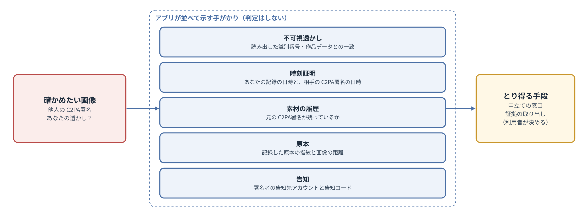

# 基本設計書 第2章 署名の情報と照合

コスプレ写真の無断転載対策ツール　第1版（案）　2026-09-29 · 石川宗  
株式会社流山ソフトウェア開発（NRSD）  
Word版: [02_基本設計書_署名の情報と照合.docx](02_基本設計書_署名の情報と照合.docx)

© 2026 株式会社流山ソフトウェア開発（NRSD）担当開発者　石川宗　本書の著作権は、株式会社流山ソフトウェア開発（NRSD）に帰属します。本書が参照する第三者の規格、ソフトウェア、法令の解説等の権利は、各権利者に帰属します。

---

## 本書の位置付け

- 概要設計書 第2章を詳細化する。本章は、C2PA署名のための情報の入力と確かめ、告知コードの作り方、個人のルートと署名用の証明書の各項目、照合の手段と手がかり、承認と共同の権利の書類、署名鍵の生成・保管・使い方・作り直しを定める。第8章（端末のデータ）と同時に設計する。
- 本章は検討メモ「第2章 署名の情報と照合、第8章 リポジトリとデータ管理の検討」（NRSD の内部の検討の記録であり、本書とともには配らない。設計の根拠となる事実は、本書の各節に出典とともに書いた）に基づく。
- 受ける決定は次の表のとおりである。設計計画書の決定・要調査・未決の文は第13章 1.2「設計計画書の決定から概要設計書・基本設計への対応」と概要設計書の行き先表による（本章には写さず、番号と項目割りの抜けだけを載せる）。

|番号|種類|内容|
|---|---|---|
|A-4|項目割りで見つけた抜け|誤った登録の訂正、および装われた真の権利者の救済|
|A-7|項目割りで見つけた抜け|利用者の本人確認の情報の扱い（第2版で本人確認を行わないこととし、前提がなくなった）|
|A-15|項目割りで見つけた抜け|C2PA署名に本名が載る危険|

## 1. 設計上の決定の一覧

|番号|決定|理由|退けた案|
|---|---|---|---|
|DD-2-1|C2PA署名のために利用者に求める入力は、ハンドルネーム、役割、告知先アカウント（任意の数）のみとする。電子メールその他の登録は求めない|設計計画書 D-5-1「本システムは利用者を確かめず、利用者の情報を集めない。本システムを使うために登録を求めない」、D-5-2「C2PA署名の証明書は、利用者が入力した情報からクライアントアプリの中で作る。認証局を要しない」。証明書に入れる情報がこれで足りる|電子メールの登録（第1版の基本設計）|
|DD-2-2|アプリは、端末の中で「個人のルート」（鍵と自己署名の証明書）と、それが発行する「署名用の証明書」（末端の証明書）の2段を作る。C2PA署名は署名用の証明書で行う|C2PA の仕様は、C2PA署名に使える証明書を末端の証明書に限る。個人のルートを分けると、入力を変えても告知コード（個人のルートの指紋）は変わらない|1枚の自己署名の証明書（入力を変えるたびに告知コードが変わる）|
|DD-2-3|権利性の手がかりは、告知先アカウントのプロフィールに掲げる告知コードとする。アプリは照合の手段（期待される告知コードの表示、告知先アカウントを開くこと）を提供し、結果は照合した者が判断する|設計計画書 5.3「本人性と権利性」。プロフィールには本人しか書き込めない|NRSD が告知の掲示を確かめる案（照合の代行になる）|
|DD-2-4|権利者を装う者が現れた場合、アプリは設計計画書 5.5 の手がかり（不可視透かし、時刻証明、素材の履歴、原本、告知）を並べて示し、判定しない|設計計画書 D-5-3「権利者を装う者による行為（先の署名、署名の付け替えおよび逆の申立て）は防げないものとし、照合の手がかりを示す。判定は行わない」、D-5-5「本システムは照合の手段を提供するが、照合を代行しない」|アプリが「どちらが権利者か」を判定する案|
|DD-2-5|署名鍵は OS の鍵保管に置く。Windows は資格情報マネージャーの「この PC」の保存とする。Secret Service のない Linux は、合言葉で暗号化した鍵のファイル（age の形式）に置く。端末の移行には控えのファイル（第8章 5「控えのファイル」）を使う。OS のハードウェアの鍵（Secure Enclave、TPM）は使わない|記録を端末の外に集めない。ハードウェアの鍵は取り出せず、別の端末へ移すと告知コードが変わる。Windows の「他の PC にも移る」保存は組織の PC で鍵が移る。Linux のカーネルの鍵保管は再起動で消える|鍵を外部に預ける案。ハードウェアの鍵を使う案|
|DD-2-6|承認と共同の権利は、書類のファイル（JSON と記録の電子署名を1つにまとめたもの）で表す。承認を受けた者は書類を取り込み、その出力のマニフェストに書類の要旨を入れる|サーバーなしで、第三者が「主たる権利者の承認」を確かめられる。メッセージのアプリ等でファイル1つとして受け渡せる|NRSD の登録簿で関係を管理する案（第1版）|
|DD-2-7|告知コードと識別番号の文字の並びは、Crockford の Base32（I・L・O・U を使わない）にそろえる|読み誤り（1とI、0とO）を減らす。第1稿は告知コードの文字の並びを決めていなかった|RFC 4648 の Base32（第1稿の書き方では並びが定まらない）|
|DD-2-8|ハンドルネームは NFC に正規化し、制御の文字と文字の向きを変える文字を受け付けない|向きを変える文字（U+202E 等）で表示を偽装されることを防ぐ|そのまま受け付ける案|
|DD-2-9|C2PA署名の証明書の連なり（COSE の `x5chain`）には、署名用の証明書に続けて個人のルートの証明書を入れる|告知コードは個人のルートの公開鍵から計算する（2.4）。C2PA 2.4 の 14.5「X.509 Certificates」は、信頼の起点（ルート）の証明書は `x5chain` に入れないほうがよい（should not）とする。これは検証する側が起点を持っていることを前提にしている。本システムの個人のルートは誰の信頼の一覧にもないため、入れなければ誰も画像から告知コードを計算できない。禁止（shall not）ではないため、理由を示して入れる。検証する側は、`x5chain` の中の自己署名の証明書を、それだけでは信頼の起点に加えない（RFC 9360 の決まり）ため、入れても信頼を偽ることにはならない|入れない案（告知コードを画像から計算できない）。署名用の証明書の Authority Key Identifier から計算する案（ルートの証明書と連なりを検証できず、他人が同じ値を書いた証明書を作れる）|
|DD-2-10|記録の電子署名（作品データ、事件記録、承認書・取り消し書・共同の権利の書面）は、署名用の証明書の鍵で付け、署名用の証明書と個人のルートの証明書を記録に添える|個人のルートの証明書の Key Usage は keyCertSign のみであり（3.5）、ルートの鍵で記録に署名するのは鍵の用途に反する。署名用の証明書は入力の変更や個人のルートの作り直しで替わる（3.4）が、記録に添えた連なりで、古い記録も個人のルート（過去の個人のルートを含む。3.6）まで検証できる|個人のルートの鍵で記録に署名する案（第2稿。鍵の用途に反する）|
|DD-2-11|個人のルートの有効期間は、固定の起点（2020-01-01）から、初めて時刻証明を得た日の40年後までとし（それまでは2060年まで。時刻証明を得た時に同じ鍵で延ばす）、端末の時計に依らない（2026-09-30 NRSD の要求）。作ってから20年を過ぎた個人のルートでは C2PA署名を止め、作り直しを求める。署名用の証明書の期限は、発行した個人のルートの期限と同じにする。作り直す前の個人のルートは「過去の個人のルート」として端末に残し、自分の古い出力・古い告知コード・古い記録の確かめに使う（3.6）。これにより、どの画像の C2PA署名も、署名から少なくとも20年は一般の検証器で有効と示される|本システムの時刻証明の TSA は C2PA の TSA 信頼リストに載らず、C2PA 2.x の検証器はその時刻証明を無視して、確かめた時点の時刻で署名用の証明書と個人のルートの有効期間を見る（C2PA 2.4 の 15.8.2。期間の外なら `claimSignature.outsideValidity` で不合格）。有効期間の上限は仕様にない（14.5.1.1）。20年は、損害賠償の請求の期間の最長（法務調査 L-20「損害賠償の請求の期間（日・中・米）」の「行為の時から20年」）と同じ長さを取った。ただし請求の期間は侵害の行為（転載）の時から数え、本書の20年は署名の時から数えるため、署名から時が経ってからの転載では、請求の期間の終わりより前に C2PA署名が不合格と示され得る（第13章 H-18「C2PA の検証器は本システムの時刻証明を信頼された時刻として扱わず、確かめた時点の時刻で証明書の期限を見る。個人のルートの期限（作ってから40年）を過ぎた画像は、一般の検証器で不合格と示される」）。その場合も、RFC 3161 の時刻証明と作品データは署名の時刻の証拠として残る。信頼リストに載る TSA（SSL.com 等）の無償の利用は C2PA 適合の記録が前提と案内されており（第3章 4「時刻証明」）、登録なしの利用を許す明文がない|署名用の証明書を1年とし期限の前に作り直す案（第2稿。作り直す前の画像がすべて1年で不合格になる）。信頼リストに載る TSA を登録なしで使う案（利用の条件を満たす根拠がない）|

## 2. C2PA署名のための情報の入力

### 2.1 入力の手順

|段|利用者の操作（アプリ）|アプリの処理|
|---|---|---|
|1|利用規約を読み同意する（第12章「法務との接点」）|同意した版と日時を端末に記録する|
|2|ハンドルネーム、役割（コスプレイヤー・撮影者・承認を受けた者）、告知先アカウントの URL（任意の数）を入れる|入力を確かめる（2.3）。個人のルートの鍵を作り、鍵保管に入れる（7）。告知コードを作る（2.4）。署名用の証明書を作る（3）|
|3|告知コードを、告知先アカウントのプロフィール（または固定の投稿）に掲げる（告知の文例は第5章 6「告知の支援」）|投稿先ごとの掲げ方の手順を画面で示す|
|4|控えの置き場を決める（第8章 5.5「控えの置き場と自動の控え」。飛ばせる）|置き場を検出して提案し、以後は自動で控えを作る|

- 求める入力はこれだけである。アプリは入力を端末の外へ送らない。
- 入力欄ごとに「何に使うか・どこに置くか」を示す（第10章 G-03「署名の情報」）。ハンドルネームと告知先アカウントは証明書に入り、C2PA署名した画像とともに公開される。役割はマニフェストに入る。
- 途中でやめても入力は端末に保存し、次の起動で続きから入力できる。

### 2.2 告知コードを掲げる場所の上限

|投稿先|プロフィールの上限|出典|28文字の告知コードと短い告知の一文|
|---|---|---|---|
|X|160文字|X のヘルプ「How to customize your X profile」|収まる|
|Instagram|150文字|Instagram のヘルプ「Add a bio to your Instagram profile」|収まる|
|小紅書|おおむね100字（公式の記載は確認できなかった）|解説記事 diantuoyi.com|収まる|
|微博|確認できなかった|—|［要実測：編集の画面で確かめる。想定：70字前後で収まる］|

- 収まらない投稿先では、固定の投稿（ピン留め）に告知とコードを載せる。固定できるのは本人のみであり、プロフィールと同じ働きをする。

### 2.3 入力の確かめ

|入力|確かめ（初期値）|確かめに通らない時|
|---|---|---|
|ハンドルネーム|1〜50文字。NFC に正規化する。制御の文字（U+0000〜U+001F、U+007F〜U+009F）、文字の向きを変える文字（U+202A〜U+202E、U+2066〜U+2069、U+200E、U+200F）、幅のない文字（U+200B〜U+200D、U+FEFF）を受け付けない。前後の空白を除く。UTS #39（Unicode Security Mechanisms）の restriction level の Highly Restrictive（日本語の漢字・かな・ラテンの混在は許す）を上限とし、超える混在（例：ラテンとキリル）は受け付けない（2026-10-01 NRSD の要求）|理由を欄の下に示し、先へ進めない|
|役割|コスプレイヤー、撮影者、承認を受けた者のいずれか。ここで入れるのは既定の役割で、書き出しの作業ごとに G-08 で変えられ、マニフェスト（`cawg.identity` の役割）にはその作業の役割を書く（撮影もコスプレもする利用者のため）|—|
|告知先アカウント|`https://` で始まる URL。長さ500文字まで。数は10個まで（初期値。証明書の SAN と C2PA の `x5chain` の大きさを抑える）。正規化と投稿先の判定は第1章 10.10「URL と QR の形」による。主な投稿先（X、Instagram、微博、小紅書、Patreon、pixiv、pixivFANBOX、Bilibili）は形を確かめ、投稿先の印を付ける（2026-09-30 NRSD の要求）。それ以外のホスト名は、確かめの一言を示して受け付ける|`http://` 等は受け付けない。形が合わない主な投稿先の URL は、例を示す|

- 同じ URL を2度入れた場合は1つにまとめる。
- 本名の入力欄は持たない（6）。ハンドルネームに本名と思われる形があっても判定はしない。本名を出さない方がよい旨を欄の説明に書く（A-15「C2PA署名に本名が載る危険」）。

### 2.4 告知コードの作り方

1. 個人のルートの公開鍵を、SubjectPublicKeyInfo の DER の形にする。
2. その SHA-256 を計算する。
3. 先頭100ビットを取り出す。
4. Crockford の Base32（`0123456789ABCDEFGHJKMNPQRSTVWXYZ`）で20文字にする（5ビットずつ、上位から）。
5. `NRSD-` を先頭に付け、20文字を5文字ごとに `-` で区切る（形：`NRSD-XXXXX-XXXXX-XXXXX-XXXXX`、28文字）。
- 読み取りの時は、小文字を大文字に、I・L を1に、O を0に読み替える（Crockford の Base32 の決まり）。
- 100ビットの理由：偶然の一致の確率は、利用者が1億人でも約2⁻⁴⁸（n²/2¹⁰¹）であり、無視できる。長くするとプロフィールの文字数を使う（2.2）。
- 見本の値：実装の時に、決まった試験の鍵から計算した値を本書と試験の文書に載せる。

## 3. 証明書

### 3.1 構成

|証明書|中身|有効期間（初期値）|
|---|---|---|
|個人のルート|自己署名。認証局の証明書（Basic Constraints の cA を真）。主体はハンドルネーム|notBefore は固定の 2020-01-01T00:00:00Z。notAfter は初めて時刻証明を得た日（3.4）から40年。それまでは 2060-01-01T00:00:00Z と端末の時計の40年後の遅い方で作り（2040年以降に始めた利用者でも、最初の時刻証明の前に署名した画像が署名から20年は有効と示されるため。時計が進んでいても害はない）、初めて時刻証明を得た時に同じ鍵で notAfter だけを延ばして作り直す（鍵が同じため告知コードは変わらない）。その時、署名用の証明書も同じ鍵で同じ期限に作り直す（通し番号は新しく。変更の履歴に `cert` の行）。端末の時計に依らない（2026-09-30 NRSD の要求）|
|署名用の証明書|個人のルートが発行する末端の証明書。C2PA の仕様の要件（3.2）に従う|発行した個人のルートの期限まで（同）|

- 鍵の種類は ECDSA P-256（C2PA・CAWG の ES256）。

### 3.2 署名用の証明書の要件（C2PA の仕様）

- X.509 の証明書であること。C2PA署名に使えるのは末端の証明書（cA が偽）であること。
- Key Usage を持ち critical とし、digitalSignature を立てる。keyCertSign は立てない。
- Extended Key Usage を持ち、`c2pa-kp-claimSigning`（1.3.6.1.4.1.62558.2.1）と `id-kp-documentSigning`（1.3.6.1.5.5.7.3.36）を入れる（後者は古い検証器との互換のため）。anyExtendedKeyUsage は入れない。
- C2PA Trust List は、2.2 から `c2pa-kp-claimSigning` の証明書に限られた（C2PA 技術仕様 2.2 の改訂の記録）。本システムの証明書は Trust List に載らない（3.3）。
- 出典の確かめ（2026-09-29、2026-09-30）：C2PA 技術仕様 2.4（2.2 も同じ）の 14.5.1.1「General Requirements」の原文で、署名の方式（ecdsa-with-SHA256 等）、曲線（prime256v1 等）、版3、Basic Constraints と keyCertSign の関係、自己署名でない証明書の Authority Key Identifier（必須）、認証局の証明書の Subject Key Identifier（必須）、Key Usage（critical を推奨、digitalSignature）、末端の証明書の Extended Key Usage（必須、anyExtendedKeyUsage は不可）を確かめた。14.4.1 は、`c2pa-kp-claimSigning`（1.3.6.1.4.1.62558.2.1）の信頼の起点に C2PA Trust List を含め、利用者が他の起点を加えられることを推奨し、以前の版が `id-kp-documentSigning`（1.3.6.1.5.5.7.3.36）等を求めていたことを記す。3.5 の各項目はこれに合う。

### 3.3 検証器での見え方

- 一般の検証サイトでは「Valid（改ざんはないが、署名者は保証されていない）」と表示される（調査資料「C2PA証明書と本人性」）。署名者の欄には証明書のハンドルネームが出る。
- C2PA の仕様 2.4 の14.4は、検証器が利用者に信頼の起点を加えさせることを推奨している。利用者は自分の個人のルートの証明書を公開してもよい（任意。本システムは預からない）。

### 3.4 期限と入力の誤り

- 検証器での期限の扱い：本システムの時刻証明は C2PA の検証器で信頼された時刻として扱われない（第3章 4「時刻証明」）。検証器は、確かめた時点の時刻が署名用の証明書と個人のルートの有効期間の中にあるときだけ C2PA署名を有効と示し、外なら `claimSignature.outsideValidity` で不合格とする（C2PA 2.4 の 15.8.2）。このため、署名用の証明書の期限を個人のルートと同じにし、個人のルートを長く取る（DD-2-11「証明書の有効期間は、どの画像も署名から20年は有効と示される長さとする」）。
- ハンドルネーム・告知先アカウントを直した場合は、署名用の証明書だけを作り直す（期限は個人のルートと同じ）。直す前に作った画像の C2PA署名は、直す前の証明書のまま、個人のルートの期限まで有効と示される。
- 個人のルートを作ってから19年で作り直しを案内し、20年を過ぎた個人のルートでは C2PA署名を止め、作り直すまで書き出しを始めない（8「失敗の扱い」）。これにより、どの画像も署名から少なくとも20年（個人のルートの残りの期間）は有効と示される。作り直すと告知コードが変わるため、掲げ替えと、古いコードを告知に「旧コード（日付まで）」として残すことを案内する（3.6）。古い個人のルートで署名した画像は、古い個人のルートの期限（作ってから40年）まで有効と示される。
- 20年・19年（3.4、8）は、初めて時刻証明を得た日（無ければ作った日の端末の時計）を起点に数え、`identity/epoch.json`（第8章 2.1「配置」）に記録する。証明書の有効期間の判定に端末の時計が関わらないため、時計がどうであっても「まだ有効でない」は起きない（2026-09-30 NRSD の要求）。
- 証明書の日付：2050年以降の日付は、X.509 では GeneralizedTime の形で書く（RFC 5280 の 4.1.2.5）。rcgen はこれに対応する。［要実測］notAfter が2050年以降の証明書を、c2pa-rs と公開ページの「告知コードを確かめる」頁の解析器が読めること。
- 古い個人のルートの期限を過ぎた画像は、一般の検証器で不合格と示される（第13章 H-18「C2PA の検証器は本システムの時刻証明を信頼された時刻として扱わず、確かめた時点の時刻で証明書の期限を見る。個人のルートの期限（作ってから40年）を過ぎた画像は、一般の検証器で不合格と示される」）。RFC 3161 の時刻証明と作品データは、署名の時刻の証拠として残る。

### 3.5 各項目

|項目|個人のルート|署名用の証明書|
|---|---|---|
|版|3|3|
|通し番号|128ビットの乱数（正の数）|128ビットの乱数（正の数）|
|署名の方式|ecdsa-with-SHA256|ecdsa-with-SHA256（個人のルートの鍵で署名）|
|発行者|主体と同じ（自己署名）|個人のルートの主体|
|主体|CN＝ハンドルネーム|CN＝ハンドルネーム|
|有効期間|3.1「構成」による|3.1 による（個人のルートと同じ）|
|公開鍵|ECDSA P-256|ECDSA P-256（個人のルートとは別の鍵）|
|Basic Constraints|critical、cA＝真、経路の長さ0|critical、cA＝偽|
|Key Usage|critical、keyCertSign|critical、digitalSignature|
|Extended Key Usage|なし|`c2pa-kp-claimSigning`、`id-kp-documentSigning`|
|Subject Alternative Name|なし|URI：告知先アカウント（入力した順）|
|Subject Key Identifier|公開鍵の SHA-1（RFC 5280 の方法1）|同左|
|Authority Key Identifier|なし|個人のルートの Subject Key Identifier|

- 主体に組織名・国名・電子メールを入れない（入力を求めないため。DD-2-1「C2PA署名のための入力はハンドルネーム・役割・告知先アカウントのみとする」）。
- 通し番号を乱数にするのは、同じ個人のルートで作り直した証明書の番号が重ならないようにするため。
- 証明書は rcgen で作る（第11章 4.1「Rust の部品」）。［要実測］作った2段の証明書で c2pa-rs が C2PA署名を作り、検証で「有効（署名者は信頼の一覧にない）」となること。

### 3.6 過去の個人のルート

- 個人のルートを作り直した場合（20年ごとの作り直し、控えのない紛失、鍵の漏れの疑い）、作り直す前の個人のルートの証明書（公開鍵のみ。秘密鍵は消す）、その告知コード、使っていた期間、作り直しの理由を、端末の `identity/past_roots/` に残す（第8章 2.1「配置」）。控えのファイルに含む。
- 使い道：

|場面|過去の個人のルートの使い方|
|---|---|
|自分の古い出力を素材として取り込む（第3章 2「入力」の ①）|今の個人のルートか過去の個人のルートのどれかで署名された C2PA署名を、自分の C2PA署名として扱う|
|確かめる（第10章 G-13「確かめる」）|過去の個人のルートで署名された画像には「あなたの以前の告知コード（期間）の C2PA署名です」と示す|
|承認書・共同の権利の書面の取り込み（5.4「書類の確かめ」 の「相手」）|書類の相手の告知コードが、今の告知コードか過去の告知コードのどれかと一致すれば、自分宛てとして取り込む。漏れの疑いの印のある古いコード宛ての書類は、印を示して利用者に確かめる|
|記録の電子署名の確かめ（第1章 DD-1-5「端末の記録に記録の電子署名を付けて検証する」）|古い記録に添えた連なりの個人のルートが、今か過去の個人のルートと一致することを確かめる|

- 古い出力から過去の個人のルートを加えられるのは、その出力の作品データが手元にある（原本の SHA-256 が一致する）場合か、控えの `past_roots` にある場合だけとする。それ以外から取り出したルートには「確かめられない過去のルート」の印を付け、5.4 の「相手」の確かめには使わない。
- 承認書・共同の権利の書面は作り直しの後も作り直さない。作り直しの記録（下の `root` の行）が PGP の key transition statement と同じ働きをする：受け取る側は旧コード → 作り直しの記録 → 新コードとたどり、5.4 の「相手」で過去のコードを受ける。発行者が作り直した場合は、承認を受けた者の出力に載る旧コードを発行者の告知の「旧コード」で照らす。「漏れの疑い」の作り直しだけは古い鍵を信用できないため、確認済みの相手（5.5）に新しいルートで書類を再発行する提案を出す。
- 作り直しは変更の履歴（6）の1行（`field` は `root`。中身は新しい個人のルートの証明書、理由、日時。古い署名用の証明書の鍵で記録の電子署名し、古い個人のルートまでの連なりを添える。DD-2-10）として残し、自分の別の端末にはこの行で自動で伝わる（第8章 5.4）。「漏れの疑い」の作り直しだけは自動で伝えず（奪った者が偽の作り直しを流せるため）、控えの取り込みか安全番号の確かめ（5.5）で利用者が2台目に入れる（2026-09-30 NRSD の要求）。
- 告知：作り直しの確かめの窓（第10章 3.6「確かめの窓の一覧」）で、新しいコードを掲げ、古いコードを「旧コード（日付まで）」として告知に残すことを案内する。告知に旧コードが残っていれば、第三者は古い作品も告知と照合できる。

## 4. 照合の手段と手がかり

### 4.1 告知先アカウントとの照合

- 「確かめる」画面（第10章 G-13「確かめる」）に画像を入れると、アプリは C2PA署名の証明書から、署名者のハンドルネーム、告知先アカウント（SAN）、期待される告知コード（`x5chain` に入れた個人のルートの証明書から 2.4 の手順で計算。DD-2-9「x5chain に個人のルートの証明書を入れる」。連なりの最後が自己署名の認証局の証明書でない画像（他のソフトの署名）には「告知コードなし（本システムの署名ではありません）」と示す）を示し、告知先アカウントを開くボタンを示す。
- 利用者（または誰でも）がプロフィールを開き、告知コードが一致するかを自分の目で確かめる。アプリは一致・不一致を判定しない（D-5-5「本システムは照合の手段を提供するが、照合を代行しない」）。
- 署名者のハンドルネームの UTS #39 の skeleton（見分けにくい文字を代表の文字に置き換えた形）が利用者自身のハンドルネームの skeleton と一致し、鍵が違う時は「似た名前の別の署名者です」の注意を出す（G-13「確かめる」、G-24「手がかりの比較」）（2026-10-01 NRSD の要求）。
- 画像の個人のルートが利用者自身の（今か過去の）ルートと一致し、署名用の証明書の通し番号が変更の履歴（6。どの端末の分でも）にあれば、「あなたの以前の署名用の証明書（期間、当時の告知先アカウント）」と示す。他人の画像には履歴が無いため、証明書の SAN をそのまま示す。
- 照合の手順を公開ページに載せ（第8章 3.3「公開ページ」の「告知コードを確かめる」頁。手順の中身はそこに書く）、アプリを持たない者（閲覧者、事業者）も照合できるようにする。

### 4.2 原本

- 書き出しの時に、原本の SHA-256 と PDQ を作品データに記録し、時刻証明を付ける（第3章「署名処理」）。争いの時に、記録より前から原本を持っていたことを、同じ SHA-256 のファイルを示すことで示せる。
- 原本に当たるもの（設計計画書 1.5「用語の定義」：公開前の写真データ）：撮影者は RAW・現像前のデータ・同じ撮影回の未公開の写真。コスプレイヤーは撮影者から受け取った未公開の写真。撮影者の承認書・共同の権利の書面は原本ではなく、権利の根拠の手がかりとして別に示す（5）。販売で受け渡した画像（購入者も持つ）は原本に当たらない。
- 作品データに原本の場所を記録し、起動の時と控えの時に原本の存在と SHA-256 を裏で確かめる。無い・変わった原本は G-12「作品」に印を付け、同じ SHA-256 のものを端末と控えの置き場から探す。原本そのものを控えに含める選択を初回に示す（既定は含める。第8章 5.5）。現像し直しは「原本の新しい版」として作品データに追記し、元の SHA-256 も残す。両方が原本の保有の手がかりになる（2026-09-30 NRSD の要求）。
- RAW の結び付け：書き出しの時、入力の写真と同じフォルダーに同じ基底の名前の RAW（`CR2 CR3 NEF ARW RAF ORF RW2 DNG PEF SRW`。カメラの DCF の対の名前）があれば、その SHA-256 と場所を作品データの「原本の新しい版」の列に「現像前」として自動で記録する（Lightroom が同名の JPEG と RAW を対として扱うのと同じ）。後からは G-12「原本を結び付ける」でファイルかフォルダーを選び、同じ基底の名前で対応付ける。RAW だけのフォルダーは第3章 2 のとおり書き出せず、「現像してから」と案内する。

### 4.3 告知先アカウントの乗っ取り

- 乗っ取った者は、プロフィールの告知コードを自分のものに書き換え得る。取り戻した利用者は、告知コードを掲げ直す。アプリは、利用者の作品データの時刻証明（乗っ取りの前の日時）を手がかりとして示せる。本システムは乗っ取りを検知しない。

### 4.4 権利者を装う者が現れた場合の手がかり

- 「確かめる」画面に、利用者の作品と思われる画像を入れると、アプリは次を並べて示す。判定はしない。

図2-1 照合の手がかり

|手がかり|アプリが示すもの|
|---|---|
|不可視透かし|画像から読み出した識別番号、利用者の作品データにその識別番号があるか、マニフェストの記録（`c2pa.soft-binding` の値）と食い違うか|
|時刻証明|利用者の作品データの時刻証明の日時と、画像の C2PA署名の時刻証明の日時|
|素材の履歴|マニフェストの素材（ingredient）に、利用者の C2PA署名が残っているか|
|原本|利用者の作品データに記録した原本の SHA-256・PDQ と、画像の PDQ の距離|
|告知|画像の C2PA署名の署名者の告知先アカウントと期待される告知コード（4.1）、利用者自身の告知コード|

- 示し方の例：「この画像にはあなたの透かし（識別番号 P0KT0-G82CJ-B2M）があり、別の署名者（ハンドルネーム sample_cos）の C2PA署名が付いています。あなたの作品データの時刻証明は 2026-09-01、この画像の C2PA署名の時刻証明は 2026-09-15 です。」
- 手がかりから利用者がとり得る手段（申立て等）は第7章「法的対応ガイダンス」で示す。
- 手がかりの一覧は、証拠一式（第6章）に加えて書き出せる。単独で取り出す時の形は第6章 3.4 の報告書（TXT・PDF/A-3u）に合わせる。
- 脅威 T-1（なりすまし）：権利者を装って先に C2PA署名する、または C2PA署名を付け替える。攻撃する者：他人の写真を入手した者。狙う資産：権利性。残る破れ：防げない（第13章）

### 4.5 導入前の写真

- 本システムを使う前に公開された写真には、不可視透かし・作品データ・時刻証明がない。示せる手がかりは、原本（4.2）と、公開の事実（投稿先の日時等）に限られる。第13章「設計の検証」で破れとして宣言する。

### 4.6 他人の C2PA署名がある画像を書き出す場合

- アプリは、他の人の身元の記録（CAWG の `cawg.identity`、本システムの `jp.nrsd.rights`）を持つ C2PA署名がある画像を、その者との承認書・共同の権利の書面を取り込んでいる場合を除き、書き出さない。署名の付け替えにアプリ自体を使わせないためである。ただし他のソフトでの付け替えは防げない。
- カメラや現像・編集のソフトの C2PA署名（人の身元の記録を持たないもの）がある画像は、書き出せる。前の C2PA署名は素材（parentOf）として履歴に残り、消えない（第3章 2「入力」）。撮影者が C2PA に対応するカメラや Lightroom 等の Content Credentials を使っても、本システムで書き出せる。素材のマニフェストのうち位置・機種・通し番号を含み得るメタデータは墨消しして公開しない（第3章 3.8「素材のマニフェストの墨消し」）。

## 5. 承認と共同の権利

### 5.1 承認書

- 主たる権利者（コスプレイヤーまたは撮影者）のアプリで作る。記載は 5.3 の表のとおり。
- 承認を受けた者は承認書を取り込む。その出力のマニフェストの `jp.nrsd.rights` に承認書の要旨（主たる権利者のハンドルネームと告知コード、範囲、期限、承認書のハッシュ）を入れ、承認書そのものも素材として添える。第三者は主たる権利者の告知コードと照合できる。
- 取り消し：主たる権利者は取り消し書を作り、承認を受けた者に渡す。取り消しを第三者に知らせる中央の仕組みはない（本システムは情報を集めない）。主たる権利者が告知で知らせる。期限の既定は90日（初期値。旧1年（2026-09-30 NRSD の要求））とし、期限の30日前にアプリが更新の書類を自動で作り、確認済みの相手（5.5）には直接送る提案を出す。取り消し書も確認済みの相手には直接届き、届いた時点でその承認による書き出しが止まる。

### 5.2 共同の権利（撮影者とコスプレイヤー）

- 双方が互いの告知コード（個人のルートの指紋）を交換し、共同の権利の書面を作って双方が取り込む。
- 作り方：一方が書面の下書きを作って記録の電子署名を付け、相手に渡す。相手は中身を確かめて自分の記録の電子署名を加え、戻す。双方が取り込む。
- 書き出しの時、C2PA署名する者は操作した本人。共同の権利者はマニフェストに記名し、共同の権利の書面のハッシュを入れる（第3章）。可視署名の差し込み（第4章 3.1「中身と差し込み」）で共同の権利者の名前を描き込める。
- 撮影者と権利者本人が異なる写真の権利の帰属は、事前に撮影者と確かめるものとする（企画草案第10節）。本システムはこの確認の結果を書面として記録し、権利の帰属そのものを判定しない（設計計画書 D-3-4「受け渡し、可視署名および撮影者との権利関係は、コスプレイヤー本人が把握しているものとして作る」）。
- 相手が本システムを使わない場合、書面は作れない（双方の署名が要る）。マニフェストの共同の権利者・IPTC の `dc:creator` には記名せず、可視署名の自由な文字（「Photo: @xxx」）で描き込めるだけとする。G-18 に「相手が本アプリを入れれば書面を作れます」と案内する（Instagram の共同投稿が双方の承諾を要するのと同じ線）。

### 5.3 書類の形式

- 書類は1つのファイル（拡張子 `.nrsdgrant`。名前は `<kind>-<id>.nrsdgrant`）とし、中身は JSON（`schema: nrsd.grant/1`）とする。記録の電子署名（JWS の detached。本文は JCS で正規化した JSON、`x5c` に証明書の連なり。第1章 8.3）を JSON の中の `signatures` に入れる。

|項目|承認書|取り消し書|共同の権利の書面|
|---|---|---|---|
|`kind`|`grant`|`revoke`|`co_rights`|
|`id`|UUID v7|UUID v7|UUID v7|
|発行者|主たる権利者のハンドルネーム、署名用の証明書と個人のルートの証明書、告知コード|同左|双方のハンドルネーム、署名用の証明書と個人のルートの証明書、告知コード、役割|
|相手|承認を受ける者のハンドルネームと告知コード|取り消す承認書、または共同の権利の書面の `id`（共同の権利の書面はどちらの当事者からでも終わらせられる。以後の書き出しに相手を記名せず、過去の出力は変えない。PGP の失効と同じ）|—|
|範囲|全作品、または撮影の名前・期間で限る（撮影の名前は NFC・前後の空白を除いた、大文字小文字を区別しない完全一致）|—|全作品、または撮影の名前・期間で限る|
|期限|開始日と終了日（`YYYY-MM-DD`、両端を含む暦の日。既定90日。写真の撮影日（EXIF の日付。時差なし）と暦の日で比べる）|取り消しの効力の日（同じ形）|開始日と終了日（同じ形。なしも選べる）|
|条件の文|自由な文（500文字まで）|理由（任意）|権利の分け方の文（500文字まで）|
|作った日時|UTC|UTC|UTC|
|`renews`|更新の書類は `kind: grant` の新しい承認書で、`renews` に前の承認書の `id` を持つ（X.509 の更新が新しい証明書であるのと同じ。期限だけを延ばす書類は持たない）。更新の提案の時機は 5.1|—|—|
|記録の電子署名|主たる権利者の署名用の証明書の鍵（DD-2-10「記録の電子署名は署名用の証明書の鍵で付け、証明書の連なりを添える」）|同左|双方の署名用の証明書の鍵|

### 5.4 書類の確かめ

|確かめること|方法|通らない時|
|---|---|---|
|形式|`schema` と各項目の形|取り込まない|
|記録の電子署名|署名用の証明書の公開鍵で検証し、署名用の証明書が個人のルートの証明書から発行されたことを確かめる（書類を作った時に証明書の有効期間の中であったこと）|取り込まない|
|告知コード|書類の個人のルートの証明書から計算した告知コードと、書類に書かれた告知コードの一致|取り込まない|
|相手|承認書の相手の告知コードが、取り込む利用者の今の告知コード、または過去の個人のルートの告知コード（3.6「過去の個人のルート」）のどれかと一致|「あなた宛てではない」と示して取り込まない。漏れの疑いの印のある古いコード宛ての書類は、印を示して利用者に確かめる|
|期限|開始日と終了日|期限の外なら、取り込むが「期限の外」の印を付ける|

- 取り込んだ書類は `approvals/` に置く（第8章 2.1「配置」）。確かめの結果と取り込んだ日時を記録する。
- 書き出しに使える承認書は、範囲（撮影の名前・期間）が作業の撮影の名前と写真の撮影日に合うものだけを G-08 で選べる。合わない承認書では書き出せない。取り消しは一括の書き出しの開始の時に確かめ、途中で届いた取り消しは次の書き出しから効く（7.6 の証明書の扱いと同じ）。
- 書類の発行者の告知コードが、発行者の告知先アカウントに掲げられているかは、利用者が確かめる（アプリは告知先アカウントを開くボタンを示す）。

### 5.5 相手の追加（書類の受け渡し）

- 書類（承認書、取り消し書、共同の権利の書面、更新の書類）は、ファイルで渡す（5.1〜5.4）ほかに、相手を「確認済み」にしておけば端末から端末へ直接届く（2026-09-30 NRSD の要求）。流れは Signal の安全番号と Magic Wormhole に合わせる。

|段|操作|
|---|---|
|1|G-18「承認と共同の権利」の「相手を追加」で、自分の QR（第1章 10.10「URL と QR の形」の `contact`）を相手に見せて読ませる。離れている時は、短い合い言葉（数字1つと2語。1回限り、10分で消える）を相手に伝える|
|2|2台が直接つながる（第8章 5.4 と同じ直接の接続）。双方の画面に同じ安全番号が出る。安全番号は Signal の安全番号と同じ作り：各自について「版の番号 0、個人のルートの公開鍵（SubjectPublicKeyInfo の DER）、告知コード」を並べたバイト列の SHA-512 を5,200回繰り返し、先頭30バイトを10進の30桁にする。2人分を数の小さい順に並べた60桁を5桁ずつ12の組で示す。個人のルートの鍵から作るため、端末を替えても相手の安全番号は変わらない|
|3|見比べて同じなら「確認済み」を押す。以後、この相手との書類は直接届き、届いた書類は 5.4 の確かめを通る|

- つながらない間（相手が起動していない）は、書類は次につながった時に届く。急ぐ時は今までどおりファイルで渡せる（形式は同じ）。
- 確認済みの相手の一覧は G-18「承認と共同の権利」 に置く。相手を外すと、以後は届かない。
- 届いたものの受け取り：確認済みの相手からの書類は 5.4 の確かめを通れば自動で取り込む（確認済みにした意味。Signal の添付と同じ）。テンプレート（`.nrsdtpl`）は「届いたテンプレート」として示し、利用者が「取り込む」を押した時だけ取り込む（AirDrop の受け取りと同じ。作業の場を勝手に変えない）。
- 告知コードの手入力は残すが、既定は QR か合い言葉とし、打ち間違いの事故を無くす。

## 6. 権利者情報

- 公開される範囲（R-2-5-1）：証明書の主体（ハンドルネーム）と SAN（告知先アカウント）、マニフェストの役割。これらは C2PA署名した画像とともに公開される。それ以外の入力はない。
- 本名（R-2-5-2）：入力欄を持たない。証明書・マニフェストに氏名を載せない。利用者が申立て（第7章）で氏名を使う場合は、利用者自身が入力し、本システムは保存しない。
- 変更の履歴（R-2-5-3）：入力を変えるたびに、端末に変更の日時と前後の値を記録する（作り直した証明書の一覧を含む）。履歴は `identity/history/<端末の番号>.jsonl`（端末ごとの連鎖。第8章 2.1「配置」）に追記し、1行は `at`（UTC）、`field`（`handle`・`role`・`accounts`・`cert`（証明書の作り直し）・`root`（個人のルートの作り直し））、`before`、`after`、`cert_serial`（その時点の署名用の証明書の通し番号）を持ち、第10章 G-19「鍵と告知コード」で見られる。

## 7. 署名鍵

### 7.1 生成と保管

- 端末で ECDSA P-256 の鍵を作る（乱数は OS の暗号用の乱数）。個人のルートの鍵と署名用の証明書の鍵の2つを作る。
- 保管は OS の鍵保管（7.5）。鍵を画面に出さない。
- 端末の外へ出すのは、利用者の合言葉で暗号化した控えのファイル（第8章 5「控えのファイル」）の中だけとする。
- 端末の鍵（直接の接続の iroh の鍵。Ed25519）も初回の起動で作り、OS の鍵保管（7.5 の `device-key`）に置く。控えに含めず、同期もしない（端末ごとに作る）。端末の番号（第1章 8.2「識別子の体系」）はこの公開鍵から作り、連鎖の `device` と直接の接続（第8章 5.4）の両方で同じ値を使う。

### 7.2 紛失・漏れ

|事象|手順|過去の C2PA署名|
|---|---|---|
|端末の紛失・故障（控えあり）|新しい端末で控えのファイルを取り込む。告知コードは変わらない|有効のまま|
|端末の紛失・故障（控えなし）|新しい個人のルートを作り、新しい告知コードを告知先アカウントに掲げ替える。告知には古いコードを「旧コード（掲げ替えの日まで）」として残すことを勧める。古い個人のルートの証明書は、手元に古い出力があればその C2PA署名から取り出して「過去の個人のルート」に加えられる（3.6）|有効のまま。告知に旧コードを残さなければ、古い告知コードの鍵による C2PA署名は告知との照合で一致しなくなる（第13章 H-43「告知コードを掲げ替えた後（20年ごとの作り直し、控えのない紛失、漏れの疑い）、告知に古いコードを残さないと、古い作品の告知コードの照合は一致しなくなる」）。時刻証明が掲げ替えより前であることが手がかりになる|
|鍵の漏れの疑い|新しい個人のルートを作り、告知コードを掲げ替える。告知に「古いコードは（その日付）以降使わない」と書く。古い個人のルートは「過去の個人のルート」に「漏れの疑い（日付）」の印を付けて残す（3.6）|漏れた鍵による C2PA署名は、古い個人のルートの期限（作ってから最長40年）まで一般の検証器で有効と示される（失効の仕組みを持たない）。時刻証明のある C2PA署名は、時刻が漏れの疑いの日付より後なら第三者が告知と照合して疑える。時刻証明のない C2PA署名は、漏れの前か後かを見分けられない（第13章 H-13「端末が完全に侵害された場合、鍵の作り直しまでの C2PA署名は防げない。漏れた鍵による C2PA署名は、古い個人のルートの期限（最長40年）まで有効と示される」）|

- 失効の一覧（CRL）は持たない。告知コードの掲げ替えが、第三者に対する失効の知らせの働きをする。
- 脅威 T-4（なりすまし）：利用者の署名鍵を盗んで C2PA署名する。攻撃する者：端末を侵害した者。狙う資産：本人性。残る破れ：端末が完全に侵害された場合
- 秘密：端末の鍵（直接の接続の iroh の秘密鍵）。置き場：OS の鍵保管（7.5）。控えに含めない（端末ごとに作る）。漏れた時：別の端末・相手を装われ得る。G-20「端末」でその端末を外し、相手は確認をやり直す
- 秘密：利用者の署名鍵。置き場：OS の鍵保管（Windows 資格情報マネージャー・DPAPI、macOS キーチェーン、Linux Secret Service。Secret Service のない Linux は合言葉で暗号化した鍵のファイル。第2章 7.5「OS ごとの保管の方式」）。控えのファイルの中では利用者の合言葉で暗号化。漏れた時：利用者が鍵を作り直し、告知コードを掲げ替える（第2章 7「署名鍵」）

### 7.3 複数の端末

- 控えのファイルを別の端末で取り込むか、端末をリンクして記録を揃え（第8章 5.4「端末どうしの同期」）、同じ個人のルートと署名用の証明書を使う（第1章 13「端末と人」）。端末の鍵（7.1）だけは端末ごとに別とする。

### 7.4 アプリの利用の時の認証

- 鍵は OS の鍵保管が OS の利用者のログインで守る（Windows・Linux の Secret Service は、ログインしていれば確かめの窓を出さずに読める。macOS はキーチェーンの許可による。7.5）。アプリ独自のパスワードは設けない（非技術者の負担を増やさないため）。代わりに、C2PA署名・書類の作成（5）・控えの取り込み（第8章 5.3）・端末のリンクと相手を確認済みにすること（第8章 5.4、5.5）・「この端末の記録を消す」（第9章 2.3）の直前に、OS の本人の確かめを求める：macOS は LocalAuthentication の `LAContext.evaluatePolicy(.deviceOwnerAuthentication)`（Touch ID、無ければログインのパスワード）、Windows は `IUserConsentVerifierInterop.RequestVerificationForWindowAsync`（Windows Hello の PIN・顔・指紋）、Linux は polkit（fprintd の指紋または PAM のパスワード）。初期値は入、G-20「設定」で切れる。一括の書き出しは開始の1回だけ求める。OS が対応しない時は求めない。自動で動く処理（連鎖の先端の時刻証明、時刻証明の後付け、「今の状態を確かめる」の追記、自動の控え）は本人の確かめを求めず、ログインで守られた OS の鍵保管を読む（1Password の自動の解除と同じ）。1Password・Bitwarden と同じ体験（2026-10-01 NRSD の要求）。控えのファイルの作成・取り込みの時と、Secret Service のない Linux（7.5）の時だけ合言葉を求める。

### 7.5 OS ごとの保管の方式

|OS|保管|設定|注意|
|---|---|---|---|
|Windows|資格情報マネージャーの汎用の資格情報|保存の種類は「この PC」（LOCAL_MACHINE）。1件は2,560バイトまで（Microsoft の CREDENTIAL の説明）。P-256 の鍵（PKCS#8 で約140バイト）は収まる|「他の PC にも移る」（ENTERPRISE）は、移動のプロファイルで他の PC に移るため使わない|
|macOS|キーチェーンの汎用のパスワードの項目|アプリのコード署名で読める範囲を限る|［要実測］同じ開発者の署名のアプリの更新の後も、確かめの窓を出さずに読めること|
|Linux（Secret Service あり）|Secret Service（GNOME Keyring、KWallet 等。D-Bus）|—|—|
|Linux（Secret Service なし）|合言葉で暗号化した鍵のファイル（age の形式、scrypt 2^18）をアプリのデータの場所に置く。合言葉の受け付けの規則（15文字以上、よく使われるものと弱いものを拒む）は控えの合言葉（第8章 5.2）と同じ|起動の時に合言葉を求める|カーネルの鍵保管（keyutils）は再起動で消えるため使わない（man7.org の keyrings の説明）|

- 鍵保管の項目の名前：サービスは `jp.nrsd.c2pa4cosplayer`、項目は `root-key`・`signing-key`・`device-key`・`tsa-<事業者の番号>`（Windows の資格情報の名前の上限 256 文字の内）。部品は keyring の crate（4.2.0。第11章 DD-11-6「鍵は OS の鍵保管に置く」）。Windows は keyring の Windows 用の保管の部品（windows-native-keyring-store 1.1.0、MIT OR Apache-2.0）を使う。この部品は、作る資格情報の既定の保存の種類が Enterprise（他の PC にも移る）であり、項目を作る時に `persistence` の指定に `Local`（この PC）を渡すと LOCAL_MACHINE で保存する（部品のソースの説明と実装を 2026-09-30 に確かめた）。本システムは必ず `Local` を渡す。既にある項目の保存の種類は読んで確かめ、`Local` でなければ作り直す。
- ハードウェアの鍵（macOS の Secure Enclave、Windows の TPM）は使わない。鍵を取り出せず、別の端末へ移すと告知コードが変わるため（DD-2-5「署名鍵は OS の鍵保管に置き、移行は控えのファイルで行う」）。

### 7.6 使う時の扱い

- 鍵は署名の直前に鍵保管から読み、使い終えたら記憶から消す（zeroize の crate）。一括の書き出しの間は、書き出しの終わりまで保持し、終わったら消す。
- 一括の書き出しは、開始の時に読んだ署名用の証明書と鍵で最後まで続ける。途中で G-19・G-20 から入力を直して証明書を作り直せるが、進行中の書き出しには効かず、次の書き出しから使う（G-19 にその旨を1行示す）。作品データの `signer`（証明書の通し番号）が、どの証明書で署名したかを残す。
- 鍵を操作の記録（ログ）に書かない（第1章 10.4「操作の記録（ログ）」）。
- 鍵保管から読めない場合（OS が拒否した、鍵がない）、署名を始めず、理由と次にすること（鍵保管の確かめ、控えからの戻し）を示す。

## 8. 失敗の扱い

|事象|知らせ方|利用者がすること|
|---|---|---|
|鍵保管に書けない（初回）|理由を示し、先へ進めない|OS の鍵保管を確かめる。Linux は Secret Service を入れるか、合言葉で守る保管を選ぶ|
|鍵保管から読めない|署名を始めず理由を示す（第1章 10.3「エラー」 の `SIG` の番号）|確かめる、控えから戻す|
|個人のルートを作ってから19年が過ぎた|起動時に、1年の内に作り直すよう案内する（書き出しは止めない）|1操作で作り直し、新しい告知コードを示す|
|個人のルートを作ってから20年が過ぎた|C2PA署名を止め、書き出しを始めない。理由（「この鍵で署名した画像は、署名から20年の有効を保てません」）と作り直しを示す（DD-2-11「証明書の有効期間は、どの画像も署名から20年は有効と示される長さとする」）|1操作で作り直す。古いコードを告知に残すことを案内する（3.6）|
|取り込む書類の確かめに通らない|取り込まずに理由を示す（5.4）|相手に確かめる|
|入力の確かめに通らない|欄の下に理由を示す（2.3）|直す|

## 9. 画面との関係

|機能|画面|
|---|---|
|入力（2）|第10章 G-03「署名の情報」|
|告知の掲示（2.2）|第10章 G-04「告知の掲示」|
|照合（4）|第10章 G-13「確かめる」、G-24「手がかりの比較」|
|承認・共同の権利（5）|第10章 G-18「承認と共同の権利」|
|相手の追加、書類の直接の受け渡し（5.5）|第10章 G-18「承認と共同の権利」|
|鍵と告知コード、変更の履歴（6、7）|第10章 G-19「鍵と告知コード」|

## 10. 要件との対応

|要件の番号（文は概要設計書）|本書で受ける節|
|---|---|
|R-2-1-1|3「証明書」|
|R-2-1-2|3.4「期限と入力の誤り」、2.3「入力の確かめ」|
|R-2-2-1|2.4「告知コードの作り方」、4.1「告知先アカウントとの照合」|
|R-2-2-2|4.2「原本」|
|R-2-2-3|4.3「告知先アカウントの乗っ取り」|
|R-2-3-1|4.4「権利者を装う者が現れた場合の手がかり」、4.6「他人の C2PA署名がある画像を書き出す場合」|
|R-2-3-2|4.5「導入前の写真」|
|R-2-3-3|4.4「権利者を装う者が現れた場合の手がかり」|
|R-2-4-1|2「C2PA署名のための情報の入力」（判定の基準は第10章 2.4「判定」 の利用者の試行）|
|R-2-4-2|5.1「承認書」、5.3「書類の形式」、5.4「書類の確かめ」|
|R-2-4-3|5.2「共同の権利」|
|R-2-5-1|6「権利者情報」|
|R-2-5-2|6「権利者情報」、2.3「入力の確かめ」|
|R-2-5-3|6「権利者情報」|
|R-2-6-1|7.1「生成と保管」、7.5「OS ごとの保管の方式」、7.6「使う時の扱い」|
|R-2-6-2|7.2「紛失・漏れ」|
|R-2-6-3|7.3「複数の端末」|

## 11. 本章で宣言する破れ

- 本章の破れは第13章 4.1「仕組みの破れ」の表（章の欄が本章のもの。なぜ塞げないか・善処した範囲・残る危険・負う者つき）による（本章には写さない）。

## 12. 他の章・概要設計書への訂正

- 第1章 8.2「識別子の体系」：告知コードの文字の並びを Crockford の Base32 と明記する（DD-2-7「告知コードと識別番号は Crockford の Base32 にそろえる」）。
- 第8章 5「控えのファイル」：控えのファイルの形式を age とする（第8章 DD-8-3「端末の移行と故障への備えは控えのファイル（age の形式）で行う」）。第1稿の Argon2id と AES-256-GCM の組み合わせは改める。
- 第11章 4.1「Rust の部品」：argon2、aes-gcm を age に改め、zeroize を加える（2026-10-01：argon2 は合い言葉から DHT の鍵を導く用途でのみ再び加えた。第8章 5.4。鍵の保管には使わない）。
