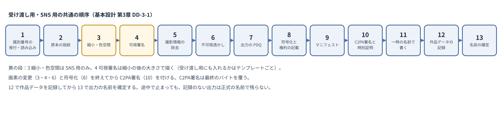

# 基本設計書 第3章 署名処理

コスプレ写真の無断転載対策ツール　第1版（案）　2026-09-29 · 石川宗  
株式会社流山ソフトウェア開発（NRSD）  
Word版: [03_基本設計書_署名処理.docx](03_基本設計書_署名処理.docx)

© 2026 株式会社流山ソフトウェア開発（NRSD）担当開発者　石川宗　本書の著作権は、株式会社流山ソフトウェア開発（NRSD）に帰属します。本書が参照する第三者の規格、ソフトウェア、法令の解説等の権利は、各権利者に帰属します。

---

## 本書の位置付け

- 概要設計書 第3章を詳細化する。章の名前「署名処理」は設計計画書 4.2「システムブロック」 のブロックの名前であり、C2PA署名、時刻証明、不可視透かし、照合用ハッシュ、識別番号の付与と記録を指す。第5章（許可範囲の記録）、第11章（ライブラリ・実行環境）と往復する（第3章と第5章、第3章と第11章）。
- 受ける決定は次の表のとおりである（設計計画書 第2版の決定・要調査・未決、および項目割りで見つけた抜け）。

|番号|種類|内容|
|---|---|---|
|D-7-1|決定|出力するすべての画像にC2PA署名を付与する|
|D-7-2|決定|企画草案第4節の三層（C2PA署名、不可視透かし、照合用ハッシュ）を引き継ぐ|
|D-7-3|決定|①受け渡し用および②SNS用の2つの系統を設ける|
|D-7-4|決定|受け渡し用画像には照合データを付与し、同封文書を同封する|
|D-7-5|決定|SNS用画像には、権利者が選んだデザインの可視署名を入れる|
|D-7-6|決定|署名の欠損は、受け取った側による意図的な除去と断じ得るものとして扱う|
|D-7-7|決定|識別番号は、クライアントアプリが発行し、C2PAマニフェストに自動で記録する。ファイル名の後ろに付けるかは、保存の際に利用者が選ぶ|
|I-03|要調査|投稿先サイトおよびCloudにおけるC2PA署名の保持|
|O-08|未決（設計計画書 第2版で D-7-7「識別番号は、クライアントアプリが発行し、C2PAマニフェストに自動で記録する。ファイル名の後ろに付けるかは、保存の際に利用者が選ぶ」 として決定）|識別番号の発行主体|
|O-10|未決（本書 7.2 で決定）|作品データの記録の形式|
|O-11|未決（本書 DD-3-6「受け渡し用画像の可視署名はテンプレートごとに決める」 で決定）|受け渡し用画像への可視署名|
|A-3|項目割りで見つけた抜け|Cloud での C2PA署名の残存の確認|
|A-8|項目割りで見つけた抜け|撮影情報（位置情報等）の除去|
|A-15|項目割りで見つけた抜け|C2PA署名に本名が載る危険|

- 参照するものは次の表のとおりである。

|参照先|参照する事項|
|---|---|
|調査資料「署名処理の技術要素」|C2PA・TrustMark・PDQ の部品の事実|
|調査資料「投稿先とCloudでのC2PA保持」|投稿先サイトと Cloud で C2PA署名が残るか|
|法務調査 L-1「権利管理情報の除去・改変（日）」 から L-4「権利管理情報の保護（条約）（国際）」 まで|権利管理情報の除去・改変（日本・中国・米国・条約）|
|第1章「全体構成」8.2「識別子の体系」|識別番号の書式|
|第2章「署名の情報と照合」 3「証明書」|署名用の証明書|
|第11章「開発基盤」|C2PA・透かし・PDQ・画像の読み書きに使う部品|

## 1. 設計上の決定の一覧

|番号|決定|理由|退けた案|
|---|---|---|---|
|DD-3-1|処理の順序は「識別番号の発行と読み込み、次に原本の指紋、次に（SNS用のみ）縮小と色空間の変換、次に可視署名（入れる場合。縮小の後の大きさで描く）、次に撮影情報の除去、次に不可視透かし、次に出力の PDQ、次に符号化（JPEG 等のバイトにする）とファイルの権利の記載（3.6）、次にマニフェストの作成、次に C2PA署名（時刻証明つき。マニフェストを符号化したバイトに埋め込む）、次に一時の名前で書く、次に出力の SHA-256、次に作品データの記録、次に出力の名前の確定」とする|C2PA のハードバインディングは最終のバイトに対して計算するため、画素を変える処理（可視署名、縮小、透かし）と符号化と XMP の書き込みはすべて C2PA署名の前に終える。透かしは最終の大きさで入れる（縮小で透かしを傷めない）|透かしを先に入れて後で縮小する案|
|DD-3-2|透かしは TrustMark variant Q、誤り訂正 BCH_5（データ61ビット）とし、データ部に識別番号（第1章 8.2「識別子の体系」）を入れる。［要実測］で SNS の再圧縮後の読み出し率が基準に届かない場合は variant P または C に切り替える|C2PA のソフトバインディングの一覧に載る（com.adobe.trustmark.Q。調査 署名処理 第2節）。61ビットは識別番号を収め、5ビットの誤りまで訂正できる（TrustMark の datalayer.py）|BCH_SUPER（40ビット。番号の空間が狭く一意でなくなる。第1章 8.2「識別子の体系」）|
|DD-3-3|マニフェストには、利用者のハンドルネーム、識別番号、許可範囲、同封文書のハッシュ、共同の権利者、透かしの存在を記録し、氏名・位置情報・機器のシリアル・電子メールは記録しない。著作者名・著作権表示・利用条件は `cawg.metadata` に、著作者の身元は `cawg.identity` に、本システム独自の項目は `jp.nrsd.rights` に置く|権利管理情報としての要件（法務 L-1「権利管理情報の除去・改変（日）」：著作権等に関する情報で、電子計算機による管理に用いられるもの）を満たしつつ、個人情報を公開しない（A-15「C2PA署名に本名が載る危険」）。C2PA 2.x の `c2pa.metadata` は固定の項目のみを許し、著作者名・著作権表示を入れられない（C2PA 仕様 2.4 付録 B.2）。`cawg.metadata` にはこの制限が及ばない（CAWG metadata 1.0）|著作者名等を `c2pa.metadata` に入れる案（仕様に反する）|
|DD-3-4|原本は、画素を読めるかどうかに関わらずファイルの SHA-256 を記録し、マニフェストの素材（ingredient）として原本の SHA-256 を載せる|原本を持つ者だけが、後に同じ SHA-256 のファイルを示せる（第2章 4.2「原本」、原本の保有の証明）。原本そのものは出力に含めない|原本のサムネイルを載せる案（原本の内容が漏れる）|
|DD-3-5|時刻証明は C2PA署名の時点で取得する（オンライン時）。オフラインの出力は時刻証明なしで C2PA署名し、次に接続した時に出力の SHA-256 について時刻証明を取り、作品データに付ける|D-7-1「出力するすべての画像にC2PA署名を付与する」（すべての出力に C2PA署名）と DD-1-7「オフラインでも C2PA署名・編集・出力・登録ができる」（オフラインで作業できる）を両立する|オフラインでは C2PA署名しない案|
|DD-3-6|受け渡し用画像に可視署名を入れるか（O-11「受け渡し用画像への可視署名」）は、可視署名のテンプレートごとに「受け渡し用にも入れる」を持たせて決める。アプリとしての既定は置かない|入れるかどうかは可視署名のデザイン（大きさ・位置・内容）による（NRSD の判断）。SNS 用だけの控えめなデザインもあれば、受け渡し用にも入れてよいデザインもある|アプリとして既定で入れる／入れない案|
|DD-3-7|C2PA の仕様の版は、採用する c2pa-rs の版が出力する版に従い、アプリの版とともに記録する。検証は2.x のマニフェストを受け付ける|仕様の版を自前で選ぶと SDK と食い違う。2.4 が最新（設計計画書 第17章）|—|
|DD-3-8|出力のファイルには、C2PA のマニフェストとは別に、IPTC の写真のメタデータの権利の項目（作者、クレジット、著作権表示、権利情報の URL、利用条件、ライセンスの問い合わせ先）を XMP として書き、EXIF の Artist と Copyright も同じ中身にする。C2PA署名の前に書く|写真の業界の道具（現像ソフト、OS のファイルの属性の表示）と検索（Google 画像検索のライセンスの表示）は、C2PA のマニフェストではなく IPTC・XMP・EXIF の項目を読む。C2PA を読まない相手にも権利者が伝わる。C2PA のハードバインディングはファイルのバイトに掛かるため、署名の前に書き終える|マニフェストの中（cawg.metadata）にだけ書く案（C2PA を読まない道具には見えない）|

## 2. 入力

|入力|扱い|
|---|---|
|JPEG・PNG・TIFF・WebP|画素を読み、処理する|
|RAW・HEIC・その他|画素は読まない。原本として SHA-256 を記録する（原本の指紋のみ）。出力には使えない旨を案内（第11章 DD-11-5「画像の読み書きは image crate で行う」）|
|壊れた画像|その1枚を飛ばし、一覧に理由を出す。一括処理は続ける|
|大きすぎる画像（1億画素超、または200MB超）|その1枚を飛ばし、理由を出す（第1章 14.1「規模と性能の目安」）|
|既に C2PA署名がある画像|マニフェストを検証し、次のとおり扱う（第2章 4.6「他人の C2PA署名がある画像を書き出す場合」）。①自分（今の個人のルート、または過去の個人のルート。第2章 3.6「過去の個人のルート」）の C2PA署名：素材として取り込み、新しい出力に履歴をつなぐ。②カメラ・現像や編集のソフト（C2PA に対応するカメラ、Lightroom・Photoshop の Content Credentials 等）の C2PA署名で、人の身元の記録（CAWG の身元の記録 `cawg.identity`、本システムの `jp.nrsd.rights`）を持たないもの：素材（parentOf）として取り込み、前の C2PA署名を消さずに履歴につなぐ。前の署名者は検証する者に見える。素材のマニフェストは出力のマニフェストの集まりに同梱されて公開されるため、素材のマニフェストのうち位置・機種・通し番号を含み得るメタデータのアサーション（`c2pa.metadata`、旧版の `stds.exif`・`stds.iptc`）を墨消しする（3.8「素材のマニフェストの墨消し」）。③他の人の身元の記録を持つ C2PA署名で、その者との承認書・共同の権利の書面を取り込んでいる（第2章 5「承認と共同の権利」）場合：素材として取り込み、その者を記名する。④他の人の身元の記録を持つ C2PA署名で、関係がない場合：処理しない（先の C2PA署名・付け替えにアプリを使わせないため。D-5-3「権利者を装う者による行為（先の署名、署名の付け替えおよび逆の申立て）は防げないものとし、照合の手がかりを示す。判定は行わない」）。「他の人の C2PA署名があります」と理由を示す。⑤マニフェストに改ざんを示す番号（`claimSignature.mismatch`、`assertion.dataHash.mismatch` 等。10.2）がある場合：処理しない（来歴の確かめられない画像に上から C2PA署名すると、他人の C2PA署名を書き潰す行為と区別できないため）。利用者には、原本から処理し直すよう案内する。署名者が信頼の一覧に無いこと（`signingCredential.untrusted`）は Valid の条件ではなく（C2PA 2.4 の 14.3.5「Valid Manifest」）、処理を止める理由にしない（利用者自身の過去の出力も、この番号を持つ）。証明書の有効期間の外であること（`claimSignature.outsideValidity`）は改ざんを示すものではなく、①〜④のとおり扱い、「署名に使った証明書の期限が切れています」と示す（第2章 3.4「期限と入力の誤り」）|
|向き（EXIF の Orientation）|画素を正しい向きに回してから処理し、出力では Orientation を「そのまま」にする|
|色（ICC プロファイル）|保持する。sRGB でない場合も変換しない（第4章の SNS 用の出力は sRGB に変換。第4章 14.2「処理」）|

## 3. C2PA マニフェスト

### 3.1 記録する項目

|アサーション|中身|
|---|---|
|c2pa.hash.data|出力のバイトに対するハードバインディング（SDK が計算）|
|c2pa.actions.v2|3.4 の表の操作。各操作に本アプリの名前と版を記録する|
|c2pa.ingredient.v3|原本：関係は parentOf、形式（`dc:format`）。サムネイルは付けない（DD-3-4「原本の SHA-256 を記録し、素材として載せる」）。素材の記録（ingredient v3）には SHA-256 と画素の大きさの項目がないため、原本の SHA-256 と画素の大きさは `jp.nrsd.rights` に置く|
|c2pa.soft-binding|アルゴリズム `com.adobe.trustmark.Q`（または実測で切り替えた `com.adobe.trustmark.P`・`.C`。C2PA のソフトバインディングの一覧の名前）。値（`blocks` の `value`）の書式はアルゴリズムが定める（C2PA 2.4 の 18.10.2）。本システムは TrustMark が埋め込むビット列（識別番号の61ビットと誤り訂正の符号）を、TrustMark の定める形で入れる。［要実測］c2pa-rs と TrustMark の実装が書く値の形|
|cawg.metadata|`dc:creator`：ハンドルネーム。`dc:rights`：著作権表示（例：`© 2026 <ハンドルネーム>`）。`xmpRights:UsageTerms`：利用条件の要約（許可範囲の名称、第5章「権利文書」。言語ごとに持てる）。`xmpRights:WebStatement`：権利情報の所在（公開ページの権利情報の URL）|
|c2pa.metadata|記録しない（著作者・権利の項目を許さないため。C2PA 仕様 2.4 付録 B.2）。撮影日時を残す場合のみ `exif:DateTimeOriginal`（許される項目）を置く|
|jp.nrsd.rights（本システム独自。ラベルは NRSD のドメイン nrsd.jp の逆順）|識別番号、原本の SHA-256 と画素の大きさ、許可範囲の ID と版、同封文書の SHA-256（受け渡し用のみ）、共同の権利者のハンドルネーム、主たる権利者（承認を受けた者の出力の場合）、参照情報の版|
|cawg.identity|X.509（`cawg.x509.cose`）。署名用の証明書で CAWG の署名を付ける。役割：撮影者は `cawg.creator`、コスプレイヤーは独自の役割 `jp.nrsd.subject`（CAWG の身元の記録の現行の版1.3 は、役割を定めた値から選ぶことを勧めるが、それ以外の値も許す。2026-09-30 に cawg.io で確かめた）、承認を受けた者は `cawg.publisher`|
|c2pa.thumbnail.claim|出力の縮小画像（出力そのものの縮小なので、公開してよい情報。C2PA 2.4 の 18.13）|
|cawg.training-mining|AI の学習・データマイニングの可否。既定は `cawg.data_mining`・`cawg.ai_inference`・`cawg.ai_training`・`cawg.ai_generative_training` の4つをすべて `notAllowed`。許可範囲（第5章「権利文書」）で利用者が選んだ場合のみ変える（出典：cawg.io/training-and-data-mining/1.1/、opensource.contentauthenticity.org の assertions の説明）|

- クレーム署名（C2PA署名）：署名用の証明書（第2章 3「証明書」）、ES256。時刻証明（RFC 3161）の応答を C2PA署名に含める（オンライン時）。
- 仕様は、来歴データのどれを含めるかを作成者が制御できるようにすることを推奨している（調査 署名処理 第1節）。本アプリは上表を既定とし、利用者が切れるのは「撮影日時・機種の記録」の有無のみとする（権利の主張に要る項目は切らせない）。

### 3.2 記録しない項目

- 氏名、電子メール、住所、位置情報（GPS、場所の名前）、機器・レンズのシリアル番号、所有者名（EXIF の Artist 等は削除し、ハンドルネームに置き換える）。
- 素材として取り込んだ他の C2PA署名（カメラ、現像や編集のソフト）のマニフェストに入っているこれらの項目も、3.8 の墨消しで出力に載せない。

### 3.3 権利表示の言語

- 著作権表示は言語に依らない形式（©、年、ハンドルネーム）。
- 利用条件の要約は英語を既定とし、利用者の画面の言語が日本語・中国語の場合は、その言語の要約も併記する（`xmpRights:UsageTerms` は言語の指定つきで複数を持てる）。

### 3.4 操作の記録

|処理|操作の名前|作り方の種類（digitalSourceType）|理由|
|---|---|---|---|
|原本を開く|`c2pa.opened`（最初の操作。原本の素材の記録 `c2pa.ingredient.v3` を hashed-uri で指す）|付けない（C2PA 2.4：`c2pa.opened` には作り方の種類は要らない）|素材（原本）との関係を示す。C2PA 2.4 は、開いた素材の記録への参照を `c2pa.opened` の `ingredients` に入れることを求める|
|縮小（SNS 用）|`c2pa.resized.proportional`|付けない（免除の操作）|縦横比を保つ縮小（C2PA 2.3 で加わった名前）。`c2pa.resized` は大きさ・ファイルの大きさの変更を広く指し（「Changes to either content dimensions, its file size or both」）、免除の操作ではないため、より限定した名前を使う|
|可視署名を描き込む|`c2pa.edited`|`http://cv.iptc.org/newscodes/digitalsourcetype/humanEdits`（人が生成でない道具で手を加えたもの）|C2PA の適合の判定の基準（c2pa-org/conformance-public の asset-rubrics/composables/globals-actions.yml）は、免除の一覧にない操作に作り方の種類を求める。仕様の本文が必須とするのは `c2pa.created` の作り方の種類だけである（18.15.2）。本システムは適合（Conformance Program）を取らないが、この基準に準じる。文字と画像の層は利用者が置き、自動配置の u2netp は置き場所を選ぶだけで画素を生成しないため、生成 AI の種類（`trainedAlgorithmicMedia`、`compositeWithTrainedAlgorithmicMedia`、`compositeSynthetic`）に当たらない|
|不可視透かし|`c2pa.watermarked.bound`（`parameters` の `relatedAssertions` で `c2pa.soft-binding` を指す）|付けない（免除の操作）|C2PA 2.3（2025年12月）で「ソフトバインディングを作るための透かし」の `c2pa.watermarked.bound` と、作らない透かしの `c2pa.watermarked.unbound` が加わり、2.4 で `c2pa.watermarked` は非推奨とされた。本システムの透かしは識別番号をソフトバインディングに記録するため `.bound` を使う。検証器は、`.bound`（と旧の `c2pa.watermarked`）があるのに `c2pa.soft-binding` が無いと `assertion.action.softBindingMissing` で拒む。採用する c2pa-rs が 2.2 の形でしか書けない版の場合は `c2pa.watermarked` を使う（DD-3-7「C2PA の仕様の版は c2pa-rs の版に従う」）|
|撮影情報の除去と、ファイルの権利の記載（3.6「ファイルの権利の記載（IPTC の写真のメタデータ）」 の XMP・EXIF）|`c2pa.edited.metadata`|付けない（免除の操作）|画素を変えない、メタデータだけの変更|
|向きの正規化（EXIF の Orientation が「そのまま」でない場合）|`c2pa.orientation`|`humanEdits`|画素を正しい向きに回す（2.1 の表）。免除の操作ではないため作り方の種類を付ける|
|色空間の変換（SNS 用で sRGB でない場合）|`c2pa.adjustedColor`（`description` に「sRGB への変換」）|`humanEdits`|第4章 14.2「処理」の sRGB への変換|
|符号化（8.1 の段8。受け渡し用・SNS 用とも。同じ形式の再符号化と、JPEG でない原本から SNS 用の JPEG を作る形式の変換を含む）|`c2pa.transcoded`|付けない（免除の操作）|符号化のし直し。仕様の定義「A conversion of one encoding to another, including resolution scaling, bitrate adjustment and encoding format change」に当たる|
|素材のマニフェストの墨消し（素材に他の C2PA署名がある場合）|`c2pa.redacted`（`reason`：`c2pa.PII.present`）|付けない（免除の操作）|3.8「素材のマニフェストの墨消し」|

- 全体：操作の記録の `allActionsIncluded` を真にする（本アプリの行った操作をすべて記録していることを示す。C2PA 2.4 の18.15.3 は設定を推奨し、無い場合は記録にない操作があり得ると読むとする）。真とするため、上の表は本アプリが画素・形式・メタデータに行うすべての処理（8.1 の段）を挙げる。段を加えた場合は、この表に操作を加える。
- 出典：C2PA 技術仕様 2.4 の18.15「Actions」（原文で確かめた。`c2pa.watermarked` の非推奨、`.bound`・`.unbound` の定義、`c2pa.opened` と素材の参照、`allActionsIncluded`、作り方の種類の例に `humanEdits` を使う例がある）、2.2 の18.14「Actions」と 2.3 の操作の一覧（`.bound`・`.unbound`・`c2pa.resized.proportional` が 2.3 で加わったことを 2.2 と 2.3 の本文の突き合わせで確かめた）、適合の判定の基準（conformance-public の globals-actions.yml。2026-09-30 に取得。作り方の種類を要しない操作：`c2pa.converted`、`c2pa.published`、`c2pa.repackaged`、`c2pa.transcoded`、`c2pa.resized.proportional`、`c2pa.enhanced`、`c2pa.edited.metadata`、`c2pa.watermarked`、`c2pa.watermarked.bound`、`c2pa.watermarked.unbound`、`c2pa.redacted`）。免除の一覧は改訂され得るため、採用する c2pa-rs の版の検証で警告が出ないことを確かめる（［要実測］）。
- 作り方の種類の出典：IPTC Digital Source Type の語彙（cv.iptc.org/newscodes/digitalsourcetype/。2026-09-29に取得。`minorHumanEdits` は廃止され、`humanEdits` が「生成でない道具による、人の手による補正・強化」を表す）。
- 生成 AI の種類を付けない理由：投稿先は C2PA・IPTC の作り方の種類を読んで「AI で作られた」の表示を付けることがある。中国では《人工智能生成合成内容标识办法》（2025年9月1日施行）と GB 45438-2025 により、投稿先がファイルのメタデータの AI の表示を確かめる。利用者の写真が AI 生成と表示されないよう、生成 AI の種類は付けない（法務調査 L-30「AI の生成・合成の表示（中）」）。

### 3.5 時刻証明の置き場

- 時刻証明は、C2PA署名（COSE の署名）の保護されない見出しの `sigTst2`（版2の時刻証明）に、`tstContainer` の形で入れる（C2PA 技術仕様 2.1 以降）。時刻の対象は署名の値である。c2pa-rs に TSA の URL を渡して作らせる。

### 3.6 ファイルの権利の記載（IPTC の写真のメタデータ）

|IPTC の項目（2025.1）|XMP の項目|中身|
|---|---|---|
|Creator|`dc:creator`|ハンドルネーム（共同の権利者がいれば両方）|
|Credit Line|`photoshop:Credit`|「{ハンドルネーム}（{告知先アカウント}）」|
|Copyright Notice|`dc:rights`|「© {年} {ハンドルネーム}」（cawg.metadata の `dc:rights` と同じ）|
|Web Statement of Rights|`xmpRights:WebStatement`|公開ページの権利情報の URL（第5章 5「国」の `/rights/`）|
|Rights Usage Terms|`xmpRights:UsageTerms`|許可範囲の要約（言語ごと。3.3）|
|Licensor（Licensor URL）|`plus:Licensor` の `plus:LicensorURL`|告知先アカウントの URL（利用の許諾を問い合わせる先）|
|—（EXIF）|EXIF の `Artist`、`Copyright`|ハンドルネーム、「© {年} {ハンドルネーム}」|

- 出典：IPTC Photo Metadata Standard 2025.1（iptc.org。各項目の XMP の項目名）。Google 画像検索は、Web Statement of Rights を必須、Creator・Credit Line・Copyright Notice・Licensor URL を推奨として、ライセンスの表示に使う（Google の「画像のライセンスのメタデータ」の案内）。
- 書く順：撮影情報の除去（8.4）の後、C2PA署名の前（DD-3-1「処理の順序を定める」 の「マニフェストの作成」の前）。既存の XMP の他の項目（撮影日時、機種名のうち残すもの）は保つ。
- SNS 用の画像にも書く（投稿先で消えることが多いが、消えない経路と、利用者の手元での確かめのため）。
- 書かない項目：氏名、電子メール、住所（3.2）。`plus:Licensor` の電話・電子メールの欄は使わない。
- 部品（2026-09-30 に crates.io で確かめた）：

|形式|XMP の置き場|EXIF の置き場|部品|
|---|---|---|---|
|JPEG|APP1 の区画（名前空間 `http://ns.adobe.com/xap/1.0/`）|APP1 の区画（`Exif`）|img-parts 0.4.0（JPEG・PNG・RIFF の区画の読み書き、純 Rust、MIT OR Apache-2.0）で区画を入れる。EXIF の中身は little_exif 0.6.23（純 Rust、MIT OR Apache-2.0）で作る|
|PNG|`iTXt` の区画（鍵の語 `XML:com.adobe.xmp`）|`eXIf` の区画|img-parts、little_exif|
|WebP|RIFF の `XMP ` の区画|RIFF の `EXIF` の区画|img-parts、little_exif|
|TIFF|タグ 700（XMP）|タグ 315（Artist）、33432（Copyright）|tiff の部品（image が使う）の符号化の時に独自のタグとして書く|

- XMP の中身（RDF/XML の包み）は本アプリが作る。項目は上の表の6つと、残す撮影の項目のみとする。
- Adobe の XMP Toolkit の Rust の包み（xmp_toolkit 1.12.1）は、C++ の部品のビルドが要るため採らない（第11章 DD-11-15「c2pa-rs は OpenSSL を持ち込まない」と同じ考え）。
- ［要実測］XMP と EXIF を書いた後に c2pa-rs がマニフェストを埋め込み、XMP・EXIF の区画が残り、C2PA署名の検証が通ること（4つの形式）。

### 3.7 形式ごとの埋め込み

|形式|埋め込み|
|---|---|
|JPEG|APP11 の区画（JUMBF）に埋め込む（c2pa-rs が行う）|
|PNG|`caBX` の区画に埋め込む（同）|
|TIFF、WebP|c2pa-rs の対応による（c2pa-rs の対応形式の一覧に載る）。［要実測］16ビットの TIFF で埋め込みと検証ができること|

- 別のファイル（`.c2pa`）にマニフェストを置く方式は使わない。受け渡しの経路でファイルが分かれると、画像だけが渡るため。

### 3.8 素材のマニフェストの墨消し

- 素材のマニフェストは、出力のマニフェストの集まり（Manifest Store）に同梱され、出力とともに公開される（素材の記録 `c2pa.ingredient.v3` の `activeManifest`）。カメラの C2PA署名の `c2pa.metadata` には、位置（GPS）、機種、通し番号が入り得る（C2PA 2.4 の 18.16、例16）。本書の撮影情報の除去（8.4）は出力の EXIF・XMP にしか及ばないため、素材のマニフェストにも手当てが要る。
- 手順：素材として取り込む時に、素材のマニフェストのメタデータのアサーション（`c2pa.metadata`、旧版の `stds.exif`・`stds.iptc`）の URI を墨消しの対象に挙げ（c2pa-rs の `ManifestDefinition::redactions`）、出力の操作の記録に `c2pa.redacted`（`parameters` の `redacted` にその URI、`reason` に `c2pa.PII.present`）を加える（C2PA 2.4 の 6.8「Redaction of Assertions」、18.15.4.2、18.15.4.7）。
- 対象の範囲：素材が持ち込むマニフェストのすべて（素材の今のマニフェストと、それが素材として参照する前のマニフェストを、入れ子の奥までたどったもの。例：Lightroom の出力を取り込むと、その中のカメラのマニフェストも出力のマニフェストの集まりに入る）について、メタデータのアサーションを墨消しの対象に挙げる。マニフェストの集まりは入れ子を平らに並べて持つため、墨消しの URI は各マニフェストのアサーションを直接指せる（C2PA 2.4 の 6.8、11「Manifests」）。［要実測］c2pa-rs が入れ子の奥のマニフェストのアサーションの墨消しを扱えること。扱えない場合、その素材は取り込まず、「この写真の来歴に位置情報が含まれ得るため、原本から書き出してください」と示す。
- 墨消ししないもの：素材のマニフェストの操作の記録（`c2pa.actions`・`c2pa.actions.v2`。仕様が墨消しを禁じる）、ハードバインディング、署名者の証明書。前の署名者（カメラのメーカーの証明書等）は検証する者に見える。
- 利用者が「撮影日時・機種の記録」を残す（3.1 の後の注）を選んだ場合も、素材のマニフェストのメタデータは墨消しする（位置と通し番号を項目ごとに選り分けて残す手段が墨消しにないため。墨消しはアサーションごと）。撮影日時と機種は、出力のマニフェストの `c2pa.metadata`（`exif:DateTimeOriginal`）と出力の EXIF に本アプリが書く。
- ［要実測］C2PA に対応するカメラ（Leica、Sony、Nikon 等）と Lightroom の出力で、どのアサーションに位置・機種・通し番号が入るかを確かめ、墨消しの対象の一覧を改める。

## 4. 時刻証明

- C2PA署名の時の TSA：DigiCert（timestamp.digicert.com）、次にGlobalSign、次にFreeTSA の順に試す（無料、RFC 3161。調査 署名処理 第4節）。
- C2PA の TSA 信頼リスト（c2pa-org/conformance-public の C2PA-TSA-TRUST-LIST.pem。2026年9月29日に取得、22件）には、上の3つの TSA の信頼の起点は載っていない。timestamp.digicert.com に実際に時刻証明を求めた応答は「DigiCert Trusted Root G4」に連なり、一覧にある「DigiCert … Root for C2PA G1」ではなかった。一覧に載る TSA（SSL.com 等）の利用には C2PA 適合の記録（conformance record ID）が要る（SSL.com の案内）。
- したがって、時刻証明は RFC 3161 の時刻の証拠として有効だが、C2PA の検証器では信頼された時刻として扱われない。C2PA 2.4 の 15.8.2 は、TSA の証明書から TSA 信頼リスト（または検証器にこの目的で置かれた信頼の起点）への連なりを作れない時刻証明を `timeStamp.untrusted` として無視し、確かめた時点の時刻で署名用の証明書の有効期間を見るとする。CAI（Content Authenticity Initiative）のオープンソースの SDK の試験の設定と c2patool の文書の例、個人向けの C2PA の道具（ProofMode）の既定の TSA も、同じ一般用の TSA（timestamp.digicert.com）である（c2pa-rs 自体には TSA の既定の値がない）。ProofMode は末端の証明書を1年とし、同じ期限の問題を抱える例であり、証明書を長く取る決定（第2章 DD-2-11「証明書の有効期間は、どの画像も署名から20年は有効と示される長さとする」）の裏付けではない。長く取る理由は、仕様に上限がないことと、時刻証明が信頼されない限り期限の延びる手段がないことである。
- C2PA の信頼リストに載る TSA を使うには C2PA 適合（Conformance Program）の記録が要ると案内されており、NRSD がこれに加わるかは設計計画書で決めていないため、本書は無料の TSA を使う。SSL.com の C2PA 用の TSA（ts-c2pa.ssl.com）は登録なしの要求にも応答する（2026-09-30 に確かめた）が、無償の枠の条件を定める同社の頁は適合の記録を前提とし、登録なしの利用を許す明文はないため、使わない。信頼リストに載り、登録なしの利用を明文で許す TSA が現れた場合は、アプリの更新で取得先の先頭に加える。
- 時刻証明が信頼されないことによる期限の問題は、証明書の有効期間を長く取ることで扱う（第2章 DD-2-11「証明書の有効期間は、どの画像も署名から20年は有効と示される長さとする」）。残る点は破れとして宣言する（13）。
- 中国の TSA（可信时间戳）を C2PA署名の時刻証明に使わない理由：有料であり、利用者ごとの契約が要る（第6章 3.2「時刻証明」）。中国本土の利用者も上の無料の TSA に届くか［要実測］（届かない場合は保留と後付け（下）になる）。
- 保留と後付け（DD-3-5「時刻証明は C2PA署名の時点で取り、オフラインの場合は後で取る」）：オフラインの出力は、作品データに「時刻証明なし」を記録し、次に接続した時に出力の SHA-256 について時刻証明を取り、作品データに付ける。マニフェストは書き換えない（出力を配った後に変えると、配った画像と食い違うため）。
- 証拠用の時刻証明（第6章「登録と証拠保全」）：可信时间戳（中国）、総務大臣認定の事業者（日本）の利用は第6章「登録と証拠保全」で定める（有料。［要見積］）。

## 5. 不可視透かし

- 方式：DD-3-2「透かしは TrustMark とし、識別番号を入れる」。不可視透かしは SNS 用・受け渡し用の両方に入れる（受け渡し用が流出した場合にも辿れる）。
- 外観との関係（R-3-4-2「図3の「外観に変更を加えない処理」との関係が整理されている。」）：TrustMark は画素を変える。例の画像で PSNR 約50dB（調査 署名処理 第2節）であり、人の目では見分けにくい変化である。企画草案第4節の「本処理により、写真の外観に変更は生じません」と設計計画書の図3の「外観に変更を加えない処理」は「見た目に分かる変化を加えない処理」と読み替える（概要設計書への訂正）。
- ［要実測］読み出しの率：X、Instagram、微博、小紅書、Patreon に投稿して再ダウンロードした画像、JPEG 品質70・縮小1/2・切り抜き20%の加工で、識別番号を正しく読める割合。判定：各条件で90%以上。満たさない条件は破れとして宣言し、照合用ハッシュ（PDQ）で補う。
- 処理時間の基準（R-3-4-3「GPUのない一般的な端末で動く（速さの基準は基本設計で定める）。」）：C2PA署名・不可視透かし・ハッシュの計算の合計で、1枚10秒以内（第1章 14.1「規模と性能の目安」の一般的な PC）。［要実測］TrustMark の CPU の推論の時間。

## 6. 照合用ハッシュ

- 出力の PDQ を必ず計算して作品データに記録する（透かし・可視署名を入れた後の画素）。
- 原本が画素を読める形式なら、原本の PDQ も記録する。
- PDQ は利用者の端末の作品データにのみ記録する。他の利用者の作品との照合は行わない（中央の索引を持たない。D-5-1「本システムは利用者を確かめず、利用者の情報を集めない。本システムを使うために登録を求めない」）。
- 一致の目安はハミング距離31以下（調査資料「署名処理の技術要素」第3節）。PDQ を評した論文（Dalins ほか、arXiv:1912.07745）は、無作為の2枚の距離の平均を128とし、30以下を同じ内容とみなす目安としている。一致の度合いは第6章「登録と証拠保全」で「一致度」として示す。
- 回転・反転への対応：PDQ は、90度ずつの回転と反転の8通り（元、90度、180度、270度、上下の反転、左右の反転、90度と上下の反転、90度と左右の反転）のハッシュを出せる（facebook/ThreatExchange の PDQ の説明）。作品データには元の向きのハッシュだけを記録し、照合の時に、転載画像の8通りのハッシュを計算して、記録との距離の最小を採る。回転・反転して転載された画像も照合できる。
- 画質の点：PDQ は0〜100の画質の点（似ているかではなく、画像に使える構造がどれだけあるか）を出す。画質の点が50未満（初期値）の画像（ほぼ一色の画像等）のハッシュは照合に使わず、「照合に向かない画像」と示す。

## 7. 識別番号と作品データ

### 7.1 識別番号

- 発行主体：アプリ（利用者の端末）。出力の時に61ビットの乱数を作り、第1章 8.2「識別子の体系」 の規則で表示する。企画草案第9節の「識別番号を取得するGUI」は、アプリの出力の画面（第10章 G-11「書き出し：実行と結果」、G-12「作品」）が番号を示し写せることで満たす。中央の発行は要らない（一意性は第1章 8.2「識別子の体系」）。
- 記録：マニフェストと不可視透かしには常に自動で入れる。保存するファイル名の後ろに付けるか（`<元の名前>_<識別番号>.<拡張子>`）は、書き出しの時に利用者が選ぶ（第10章 G-08「書き出し：写真と用途」。初期値は付ける、以後は前回の選択）。アプリの画面（G-11「書き出し：実行と結果」、G-12「作品」）は識別番号を常に示す。キャプションに番号を書く場合は、利用者が画面から写して書く（本アプリは投稿しない）。ハッシュタグ（`#`）の形にすると、投稿先によっては区切りの `-` で途切れるため、番号はそのまま（`#` を付けずに）書くことを案内する。
- 識別番号は企画草案の「照合番号」「作品番号」と同じ値である（第1章 8.2「識別子の体系」）。

### 7.2 作品データの項目（O-10「作品データの記録の形式」 の決定）

|項目|内容|
|---|---|
|schema|`nrsd.work/1`|
|id|識別番号（61ビット。表示の13文字と、16進の両方を持つ）|
|stream|`delivery`（受け渡し用）／`sns`|
|original|原本の SHA-256、形式、画素の大きさ、PDQ（読める場合）|
|output|出力の SHA-256、形式、画素の大きさ、PDQ、ファイル名|
|manifest|マニフェストの写し（C2PA の JUMBF をそのまま保存）。透かしから識別番号を読んだ時に、端末の中でマニフェストを引き当てるために使う（外部の照会の仕組みは使わない）|
|rights|許可範囲の ID と版、同封文書の SHA-256、参照情報の版|
|co_rights|共同の権利者のハンドルネームと個人のルートの指紋、共同の権利の書面のハッシュ|
|signer|署名用の証明書のシリアル、個人のルートの指紋|
|tsa|時刻証明の応答（C2PA署名の時または後付け）、状態（付与済み／保留）|
|app|アプリの版、c2pa-rs の版、透かしの variant とモデルの版|
|created_at|UTC|
|ingredients|既に C2PA署名があった画像を素材として取り込んだ場合の、その署名者と関係（2 の表）|

- 記録先：端末の `works/<年>/<一括処理の ID>.jsonl`（1行に1作品）と記録の電子署名（第8章 2.1「配置」）。

## 8. 処理の順序と系統

### 8.1 順序

|段|処理|受け渡し用|SNS用|
|---|---|---|---|
|1|識別番号の発行（61ビットの乱数。7.1）と読み込み（向きの正規化）。識別番号は段4の可視署名の差し込み（第4章 `{work_id}`）と段6の透かしに使うため、最初に決める|行う|行う|
|2|原本の指紋（SHA-256、読めれば PDQ）|行う|行う|
|3|縮小・色空間の変換|行わない|行う（第4章 14.2「処理」）|
|4|可視署名（縮小の後の大きさで描く。縮小の前に描いて縮めると細い縁取りがつぶれるため。第4章 14.2「処理」）|テンプレートが「受け渡し用にも入れる」の場合（DD-3-6「受け渡し用画像の可視署名はテンプレートごとに決める」）|行う（第4章「画像編集と一括適用」）|
|5|撮影情報の除去（3.2 の項目）|行う|行う|
|6|不可視透かし|行う|行う|
|7|出力の PDQ|行う|行う|
|8|符号化（受け渡し用：8.5 の品質、SNS用：第4章 14.3「JPEG の書き出し」 の JPEG）とファイルの権利の記載（3.6）|行う|行う|
|9|マニフェストの作成（同封文書のハッシュを含む）|行う（同封文書は第5章「権利文書」で先に生成）|行う|
|10|C2PA署名と時刻証明（マニフェストを符号化したバイトに埋め込む）|行う|行う|
|11|一時の名前で書く（第1章 10.2「保存」）|行う|行う|
|12|出力の SHA-256、作品データの記録と記録の電子署名|行う|行う|
|13|出力の名前を確定する（第1章 7.2「一括の書き出し」 の順。記録のない出力が正式の名前で残らない）|行う|行う|

図3-1 処理の順序

### 8.2 系統の差

|項目|受け渡し用|SNS用|
|---|---|---|
|大きさ|原寸|投稿先に合わせて縮小（第4章「画像編集と一括適用」）|
|可視署名|テンプレートによる（DD-3-6「受け渡し用画像の可視署名はテンプレートごとに決める」）|あり|
|同封文書|あり（第5章「権利文書」）|なし|
|マニフェストの許可範囲|販売時に選んだ許可範囲|「閲覧のみ（転載禁止）」の既定（第5章「権利文書」）|

### 8.3 原本を変えない

- 原本のファイルは読み取り専用で開き、書き込まない。出力は必ず別のフォルダーに書く。出力先に原本と同じフォルダーを選ばせない。

### 8.4 撮影情報の除去

- 除去：GPS に関するすべての項目、場所の名前（XMP・IPTC の場所の項目）、機器・レンズのシリアル番号、所有者名、メーカー固有の領域（MakerNote。シリアル等を含み得るため）。
- 残す（利用者が切れる）：撮影日時、カメラ・レンズの機種名。
- 除去の結果を処理の一覧で示す（「位置情報を消しました」）。

### 8.5 受け渡し用の書き出しの品質

- 透かしで画素が変わるため、受け渡し用も書き直しが要る。元の形式ごとに次のとおりとする。

|元の形式|書き出し|理由|
|---|---|---|
|JPEG|JPEG、品質95（初期値）、色の間引きなし（4:4:4）|原寸で購入者に渡すため、SNS 用（品質92）より高くする|
|PNG|PNG（劣化なし）|—|
|TIFF（8・16ビット）|TIFF、同じビット数、劣化のない圧縮（Deflate）|現像の出力の精度を保つ|
|WebP|WebP（劣化なし。VP8L）|image の WebP の書き出しは劣化なしのみを持つ（image の codecs/webp/encoder.rs の説明：「Right now only lossless encoding is supported」。2026-09-30 に確かめた）。原寸の受け渡しに合う|

- 色空間は元のまま（埋め込みの ICC を保つ）。SNS 用だけ sRGB に変換する（第4章 DD-4-12「色は sRGB に変換し、sRGB の ICC を埋め込む」）。

## 9. 一括処理

- 並列：同時に処理する枚数は第4章 14.4「大きな画像と並行の処理」の式による。透かしの推論は同時に2枚までに抑える（記憶の上限）。
- 中断と再開：進みの記録（処理済みの識別番号と出力のハッシュ）は作業（第4章 11「作業（編集の途中の状態）」）に置き、出力のフォルダーには置かない。再開の時は済んだ分を飛ばす（第4章 14.6「中断と再開」）。
- 一部失敗：失敗した画像を一覧にし、理由と対処（形式の変換、大きさ）を示す。失敗があっても成功した分は使える。
- 進捗の表示：全体の枚数、済んだ枚数、残りの時間の目安、失敗の数（第10章「画面とデザイン」）。

## 10. 出力

### 10.1 名前と構成

- 受け渡し用：`<出力日 YYYYMMDD>_<撮影名>_delivery/` の下に画像と同封文書（第5章 3.1「構成」 の構成）。
- SNS用：`<出力日 YYYYMMDD>_<撮影名>_sns/` の下に、書き出しの型ごとのフォルダー（例：`X`、`Instagram`。第4章 14.1「書き出しの型」）を作り、その下に画像。
- 画像のファイル名：`<元の名前>_<識別番号>.<拡張子>`、または利用者が付けないことを選んだ場合は `<元の名前>.<拡張子>`（7.1）。
- 名前は UTF-8（NFC）で作り、OS で使えない文字は置き換える。撮影名に英数字以外が含まれる場合も、先頭の日付と末尾の `_delivery`・`_sns` は ASCII のため、展開の道具で名前が化けてもフォルダーを見分けられる。

### 10.2 利用者による確認

- アプリに「確かめる」画面を置き、任意の画像を入れると次を示す：C2PA署名の検証の結果、署名者（証明書のハンドルネーム、告知先アカウント、期待される告知コード。第2章 4.1「告知先アカウントとの照合」）、時刻証明、不可視透かしから読み出した識別番号と自分の作品データとの照合。
- 一般の検証サイトでの見え方（Valid だが Trusted ではない。第2章 3.3「検証器での見え方」）も併せて案内する。
- 検証の結果の示し方：c2pa-rs が返す検証の状態の番号（C2PA 技術仕様の15節。各番号は成功・情報・失敗の重さを持つ）を、次の表のとおり言葉に置き換えて示す。番号そのものは詳細の欄にだけ出す。

|状態の番号（例）|重さ|画面の言葉|
|---|---|---|
|`claimSignature.validated`|成功|C2PA署名は正しい|
|`assertion.dataHash.match`|成功|署名の後に画像は変えられていない|
|`assertion.dataHash.mismatch`|失敗|署名の後に画像が変えられている|
|`claimSignature.mismatch`|失敗|C2PA署名が合わない（書き換えられた可能性）|
|`signingCredential.trusted`|成功|署名者は C2PA の信頼の一覧に載っている|
|`signingCredential.untrusted`|失敗（C2PA 2.4 の表4。ただし Valid の条件ではない）|署名者は C2PA の信頼の一覧に載っていない。改ざんがないこと（Valid）は確かめられたが、署名者は保証されない（Trusted ではない）。本アプリの利用者の署名は通常これになる（第2章 3.3「検証器での見え方」）|
|`claimSignature.outsideValidity`|失敗|署名に使った証明書の有効期間が、確かめた時点で切れている（信頼された時刻証明がない場合、検証器は確かめた時点の時刻で期間を見る）。改ざんを示すものではない（第2章 3.4「期限と入力の誤り」）|
|`claimSignature.insideValidity`|成功|署名に使った証明書は、確かめた時点（信頼された時刻証明があればその時刻）で有効期間の中にある|
|`timeStamp.validated`|成功|時刻証明は正しい|
|`timeStamp.untrusted`|情報|時刻証明の事業者は C2PA の信頼の一覧に載っていない（4）|

- 上の表の番号は C2PA 技術仕様 2.4 の検証の状態の一覧（原文）で実在を確かめた（2026-09-30。第2稿の `signingCredential.expired` は仕様にない番号であり、`claimSignature.outsideValidity` に改めた）。［要実測］採用する c2pa-rs の版が返す番号の一覧で、上の表の番号の名前と重さを確かめ、表にない番号は「その他」として番号と英語の説明を示す。

### 10.3 投稿先・Cloud での残存

|行き先|想定|確かめ方|
|---|---|---|
|主要な SNS（Instagram、X、Facebook、TikTok）|C2PA は残らない（調査 I-03「投稿先サイトおよびCloudにおけるC2PA署名の保持」）。透かしで補う|［要実測］5 の読み出し率|
|微博、小紅書|残らない想定（微博は EXIF を除くとの報道による。小紅書は公開の記載を見つけられなかった）。透かしで補う|［要実測］投稿して再取得し、C2PA の有無と 5 の読み出し率を確かめる|
|Patreon の投稿画像|残らない想定|［要実測］投稿して再取得し、SHA-256 を比べる|
|Patreon の添付ファイル|残る想定（元の形式で配信）|同上|
|Google Drive|残る想定（元のバイトを返す）|［要実測］NRSD の Drive に上げて取り出し、SHA-256 を比べる（1枚のダウンロードとフォルダーの zip の2通り）|

- 残らない行き先があることは、アプリの出力の画面で案内する（「SNS では C2PA署名は消えます。不可視透かしと可視署名は残ります」）。

## 11. 失敗の扱い

|段|事象|扱い|
|---|---|---|
|読み込み|形式が対応しない、壊れている、大きすぎる|その1枚を除き、理由を一覧に出す。他は続ける|
|既存の C2PA署名|検証に失敗、他人の署名で関係がない|処理しない（2 の表）|
|可視署名|字がない、収まらない|書き出しの前に確かめを求める（第4章 16「失敗の扱い」）|
|透かし|推論に失敗|その1枚を止め、理由を出す（透かしなしで出さない。照合の手がかりが欠けるため）|
|C2PA署名|鍵保管から鍵を読めない、個人のルートを作ってから20年が過ぎた（署名から20年の有効を保てない）|書き出しを始めない（第2章 8「失敗の扱い」）|
|時刻証明|全部の TSA が応じない|時刻証明なしで C2PA署名し、作品データに「保留」を記録し、接続の時に後付け（4）|
|書き出し|書き込めない、空きがない|その1枚を止める。一時の名前のファイルは消す|
|作品データの記録|書き込めない|出力の名前を確定せず、一時のファイルを消す。その1枚を失敗として一覧に出す（第1章 7.2「一括の書き出し」 の順により、記録のない出力は残らない）|

## 12. 要件との対応

|要件の番号|要件の内容|本書で受ける節|
|---|---|---|
|R-3-1-1|対応形式が決まっている|2「入力」|
|R-3-1-2|壊れた画像、巨大な画像、既に署名のある画像を安全に扱える|2「入力」|
|R-3-2-1|記録する項目と、記録しない項目（個人情報）が決まっている|3「C2PA マニフェスト」|
|R-3-2-2|準拠する仕様の版が決まっている|3「C2PA マニフェスト」|
|R-3-2-3|許可範囲・可視署名の操作を記録するかが決まっている（第5章と同時に決める）|3「C2PA マニフェスト」|
|R-3-3-1|TSA（中国国内のTSAを含めて検討）が決まっている|4「時刻証明」|
|R-3-3-2|不通時に保留・後付けができる|4「時刻証明」|
|R-3-4-1|埋め込む情報と強度が決まっている|5「不可視透かし」|
|R-3-4-2|図3の「外観に変更を加えない処理」との関係が整理されている|5「不可視透かし」|
|R-3-4-3|GPUのない一般的な端末で動く（速さの基準は基本設計で定める）|5「不可視透かし」|
|R-3-5-1|算出の対象と記録先が決まっている|6「照合用ハッシュ」|
|R-3-6-1|番号が一意に発行され、ファイル名・キャプションに表記できる|7「識別番号と作品データ」|
|R-3-6-2|作品データの項目と記録先が決まっている|7「識別番号と作品データ」|
|R-3-7-1|署名を壊さない処理の順序で動く|8「処理の順序と系統」|
|R-3-7-2|受け渡し用とSNS用の差が決まっている|8「処理の順序と系統」|
|R-3-7-3|原本を変えない|8「処理の順序と系統」|
|R-3-7-4|撮影情報（位置情報等）を除去する|8「処理の順序と系統」|
|R-3-8-1|中断・再開・一部失敗に対応する|9「一括処理」|
|R-3-8-2|進捗と結果を示せる|9「一括処理」|
|R-3-9-1|出力の名前と構成が決まっている|10「出力」|
|R-3-9-2|出力を利用者が自分で確かめられる|10「出力」|
|R-3-9-3|投稿先とCloudでC2PA署名が残るかを把握し、残らない場合の扱いが決まっている（NRSD の決定により Cloud も調査の対象とする）|10「出力」|

## 13. 本章で宣言する破れ

- SNS に投稿した画像の C2PA は残らない。透かしの読み出しが基準に届かない加工（強い切り抜き・縮小）では、照合用ハッシュのみが頼りになる。
- 形式の変換・再圧縮に伴う権利管理情報の除去は、日本ではみなし侵害から除かれ、中国では技術上避けられない除去として除かれ、米国では故意と侵害に結び付くことの認識を要する（法務調査 L-1「権利管理情報の除去・改変（日）」、L-2「権利管理情報の除去・改変（中）」、L-3「権利管理情報の除去・改変（米）」）。このため、受け渡し用画像の C2PA署名の欠損を「意図的な除去」と断じ得る（D-7-6「署名の欠損は、受け取った側による意図的な除去と断じ得るものとして扱う」）のは、日・中・米のいずれでも、形式の変換を伴わない場合に限られる（第13章 H-5「形式の変換・再圧縮に伴う権利管理情報の除去は、日本ではみなし侵害から除かれ、中国では技術上避けられない除去として除かれ、米国では故意と侵害に結び付くことの認識を要する」）。
- 時刻証明は、C2PA の検証器で信頼された時刻として扱われない（C2PA の信頼リストに載る TSA を使わないため。4）。このため、個人のルートの期限（作ってから40年）を過ぎた画像は、一般の検証器で不合格と示される（第2章 3.4「期限と入力の誤り」）。
- オフラインで出力した画像は、マニフェストに時刻証明を持たない（作品データへの後付けのみ）。

## 14. 他の章・概要設計書への訂正

- 図3（設計計画書）と概要設計書 R-3-4-2「図3の「外観に変更を加えない処理」との関係が整理されている。」 の「外観に変更を加えない処理」を「見た目に分かる変化を加えない処理」と読み替える。
- O-10「作品データの記録の形式」（作品データの記録の形式）、O-11「受け渡し用画像への可視署名」（受け渡し用の可視署名：テンプレートごとに決める）を本書で解消。
- 要件 R-3-9-3「投稿先とCloudでC2PA署名が残るかを把握し、残らない場合の扱いが決まっている（NRSD の決定により Cloud も調査の対象とする）」の注記を、NRSD の決定により Cloud も調査の対象とすることに改めた。
- 縮小の操作の名前を `c2pa.resized.proportional` に改め、可視署名の操作に作り方の種類を付ける（3.4）。
- 中断と再開の記録の置き場を、出力のフォルダーから作業に改めた（第4章と整合）。
