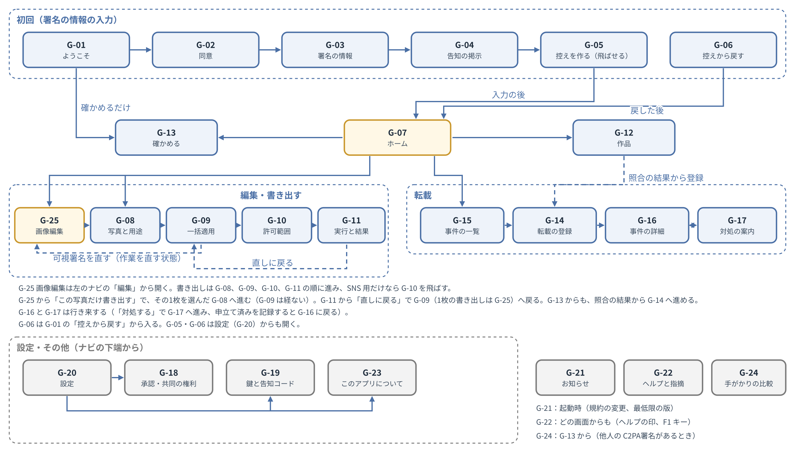
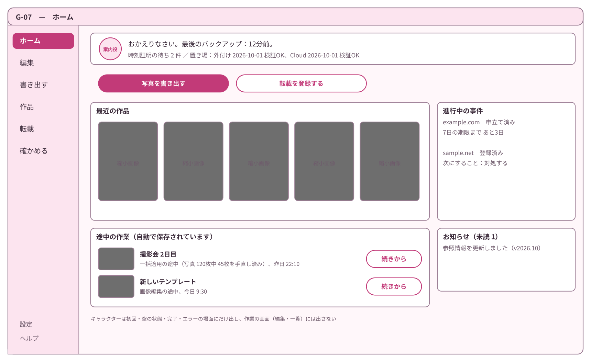
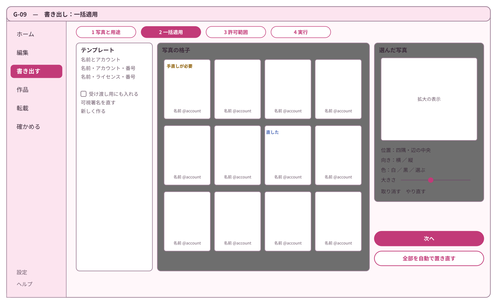
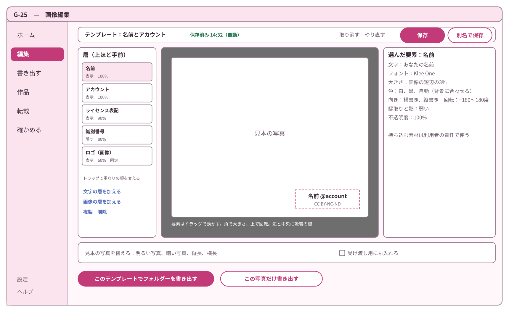
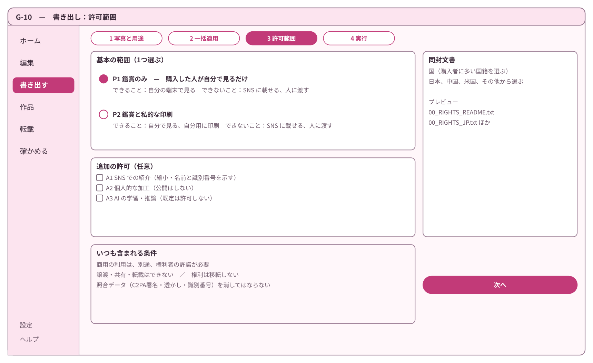
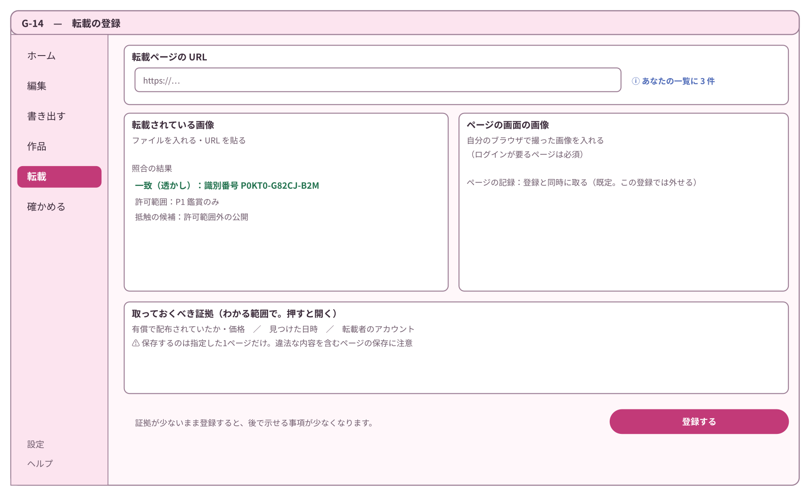
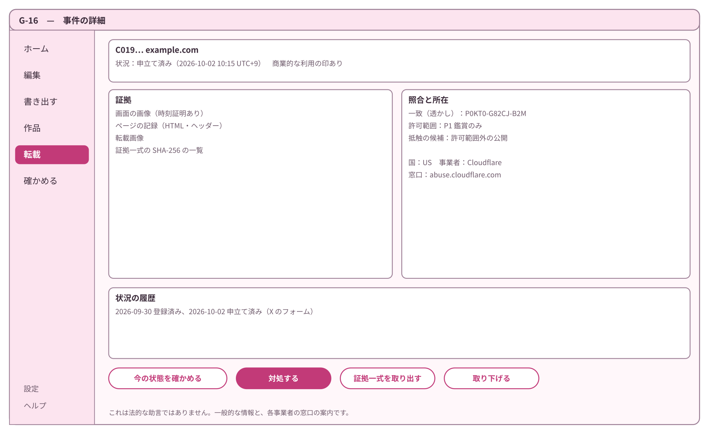

# 基本設計書 第10章 画面とデザイン

コスプレ写真の無断転載対策ツール　第1版（案）　2026-09-29 · 石川宗  
株式会社流山ソフトウェア開発（NRSD）  
Word版: [10_基本設計書_画面とデザイン.docx](10_基本設計書_画面とデザイン.docx)

© 2026 株式会社流山ソフトウェア開発（NRSD）担当開発者　石川宗　本書の著作権は、株式会社流山ソフトウェア開発（NRSD）に帰属します。本書が参照する第三者の規格、ソフトウェア、法令の解説等の権利は、各権利者に帰属します。

---

## 本書の位置付け

- 概要設計書 第10章を詳細化する。全章の要件の利用者の操作を画面に収める章であり、他の章の基本設計の後に書く。第12章「法務との接点」と同時に設計する（第10章と第12章は互いに依存する）。
- 受ける決定は次の表のとおりである（設計計画書 第2版の決定・要調査・未決、および項目割りで見つけた抜け）。設計計画書の決定・要調査・未決の文は第13章 1.2「設計計画書の決定から概要設計書・基本設計への対応」と概要設計書の行き先表による（本章には写さず、番号と項目割りの抜けだけを載せる）。

|番号|種類|内容|
|---|---|---|
|A-13|項目割りで見つけた抜け|GitHub を見ない利用者からの指摘の受け口|
|A-14|項目割りで見つけた抜け|NRSD の立場と利用規約|

- 用語：「C2PA署名」と「可視署名」を書き分ける（第1章「本書の位置付け」）。画面では、C2PA署名・不可視透かし・可視署名・識別番号を付けて画像を出力する作業をまとめて「書き出す」と呼ぶ。記録（証拠一式、テンプレート、控えのファイル）をファイルとして端末の外へ出す操作は「取り出す」と呼び、「書き出す」と呼ばない（控えのファイルは「控えを作る」）。
- 参照するものは次の表のとおりである。

|参照先|参照する事項|
|---|---|
|第2章「署名の情報と照合」 2「C2PA署名のための情報の入力」、4「照合の手段と手がかり」|C2PA署名のための情報の入力、照合の手がかり|
|第3章「署名処理」 9「一括処理」、10「出力」|一括処理、出力、確かめる|
|第4章「画像編集と一括適用」|可視署名の編集と一括適用|
|第5章「権利文書」 2「許可範囲」|許可範囲|
|第6章「登録と証拠保全」 2「登録」、4「照合」、6「状況確認」|登録、照合、状況|
|第7章「法的対応ガイダンス」 3「文面の例」、6「申立ての流れ」、7「線引き」|申立ての流れ、個人情報、ガイダンスの線引き|
|第8章「リポジトリとデータ管理」 5「控えのファイル」|控えの作成と取り込み|
|第11章「開発基盤」|画面の作り方（Tauri）、文言ファイル|
|第12章「法務との接点」 6「画面へ戻すもの」|画面へ戻すもの|
|法務調査 L-19「フォントのライセンス」、L-29「デザイン・キャラクターの委託（日）」|フォントのライセンス、デザイン・キャラクターの委託|

- 範囲：クライアントアプリの画面。運営者ツールの画面は第1章 19「運営者ツール」 で扱う（概要設計書の範囲の定めのとおり）。README・公開ページの構成は第9章 5「入手経路」・第8章「リポジトリとデータ管理」。

## 1. 設計上の決定の一覧

|番号|決定|理由|退けた案|
|---|---|---|---|
|DD-10-1|見た目は「淡い色、丸みのある形と文字、案内役のキャラクター1体」とする。キャラクターは NRSD のオリジナルとし、初回の案内・空の状態・完了・エラーの場面にだけ出し、作業の画面（編集、一覧）には出さない|利用者はキャラクターとかわいいものを好み、見た目の悪いソフトは使われない（D-8-1「クライアントアプリは見た目の良いものとする。見た目は本システムの効力に直結する要件として扱う」）。作業の画面にまで出すと写真の確認の邪魔になる|キャラクターなし（D-8-1「クライアントアプリは見た目の良いものとする。見た目は本システムの効力に直結する要件として扱う」 に反する）。既存の作品のキャラクター風（原作の権利に自ら触れる。L-29「デザイン・キャラクターの委託（日）」）|
|DD-10-2|デザイン（色、部品、キャラクター）は NRSD の担当開発者が行い、見た目の合否も担当開発者が判定する。分かりやすさは利用者の試行（2.4）で判定する。将来に外部のデザイナーへ委託する場合の契約の論点は法務 L-29「デザイン・キャラクターの委託（日）」に置く|委託するデザイナーはいない（2026-09-30、NRSD）。見た目は好みの判断であり、判定者を1人に決める|外部のデザイナーに委託する案（第2稿。委託先がいない）。判定を多数決にする案（決まらない）|
|DD-10-3|画面は1つの窓とし、左に縦のナビ（ホーム、編集、書き出す、作品、転載、確かめる）、下端に設定・ヘルプを置く。複数の段階がある作業（初回の入力、書き出し、登録、対処）は、窓の中で段階を上に示して進める|非技術者が「今どこにいて、あと何段か」を常に見られる。1つの窓なら OS の違いが出にくい|複数の窓を開く案（迷う）。すべてをウィザードにする案（慣れた利用者に遅い）|
|DD-10-4|見やすさは WCAG 2.2 の全達成基準を1件ずつ判定し（A・AA はすべて満たし、AAA は満たすものを列挙する）、2.7 の定義（観点・基準・値・測り方）で判定する（2026-09-30 NRSD の要求）。旧：AA を基準とする（文字のコントラスト4.5:1以上、部品の境界3:1以上、色だけで意味を伝えない、文字を200%まで拡大しても崩れない）|色覚の多様性と、写真を長時間見る作業の疲れへの配慮。基準を外部の規格に置くと判定できる|独自の基準（判定できない）|
|DD-10-5|OS との統合（右クリックのメニュー等）は設けない。窓への写真・フォルダーのドラッグ＆ドロップで代える。画面の中の層の並べ替えは HTML5 のドラッグ＆ドロップを使わず、ポインターのイベント（押す・動かす・離す）で作る|Windows 11 の新しい右クリックのメニューは従来の登録を「その他のオプション」の奥に置く、macOS は拡張の別の実行物が要る、Linux はファイル管理ソフトごとに方式が違い、3つの OS で同じ体験にならない。ドラッグ＆ドロップは3つの OS で同じに動く。窓へのファイルのドロップを受ける設定（Tauri の dragDropEnabled）を有効にすると、Windows では画面の中の HTML5 のドラッグ＆ドロップが使えない（tauri-utils の config.rs の説明「Disabling it is required to use HTML5 drag and drop on the frontend on Windows」）|Windows だけ右クリックに登録する案（OS で説明が分かれる）|
|DD-10-6|指摘の受け口は、アプリが指摘の文面を作り、利用者が自分の電子メールで NRSD に送る（電子メールのソフトを開く、または文面と宛先を写す）。アプリは自動では送らない|利用者は GitHub を見ない（D-3-3「利用者がGitHubを見ずに本システムを使えることとする」）。サーバーを持たず（DD-1-2「NRSD はサーバーを持たず、利用者の情報を受け取らない（利用者が自分で送る指摘の電子メールを除く）」）、利用者の情報を集めない（D-5-1「本システムは利用者を確かめず、利用者の情報を集めない。本システムを使うために登録を求めない」）。送るかどうかと何を添えるかを利用者が決める|GitHub の Issue（利用者に GitHub を見せる）。外部のフォームのサービス（第三者に情報を送ることになる）。アプリから自動で送る案|
|DD-10-7|画面の言語は日本語（ja）、中国語の簡体字（zh-Hans）、英語（en）とする。字形は言語ごとにフォントを切り替えて合わせる。繁体字は要望に応じて加える|D-9-8「画面の言語は日本語、中国語および英語とし、要望に応じて追加する」。中国本土の利用者は簡体字。同じ漢字でも日本と中国で字形が違う|中国語を1つの字体で済ませる案（日本語の字形で中国語を表示してしまう）|
|DD-10-8|エラーの表示は「何が起きたか／原本と記録は無事か／次にすること／番号」の4つを必ず示す型に揃える|非技術者が最初に知りたいのは「写真は無事か」。番号は指摘（DD-10-6「指摘は利用者が自分の電子メールで送る」）で原因を特定するため|技術的な内容をそのまま出す案|

## 2. デザイン

### 2.1 方向（大一案）

|要素|方針|
|---|---|
|色|淡い桃色を地に、濃い桃色を主の色、青を従の色とする。明るい表示と暗い表示の2種を持ち、OS の設定に合わせる（設定で固定もできる）|
|形|角を丸くした部品（半径8〜12画素）、影は弱く1段のみ|
|文字|丸ゴシック系（2.2）|
|キャラクター|案内役1体。モチーフの案：「封蝋（シーリングスタンプ）を抱えた小さな生き物」（C2PA署名による封印の比喩）。表情は6種（ふつう、うれしい、考え中、困った、注意、おやすみ（オフラインの時））。名前は担当開発者が決める|
|写真の見せ方|作業の画面では地の色を無彩色（灰）に切り替え、写真の色の判断を妨げない|
|動き|画面の切り替えと完了の演出のみ。OS の「視差効果を減らす」の設定、またはアプリの設定で止める|

### 2.2 フォント

|用途|日本語|中国語（簡体字）|英語|ライセンス|
|---|---|---|---|---|
|画面の文字|Zen Maru Gothic|Resource Han Rounded CN（资源圆体）|Zen Maru Gothic の欧文|いずれも SIL OFL 1.1（Google Fonts、github.com/CyanoHao/Resource-Han-Rounded）|
|利用者の入力（ハンドルネーム等）|上のフォントに無い文字は OS のフォントで表示する|同左|同左|—|
|可視署名|第4章 DD-4-7「同梱のフォントは SIL OFL 1.1 のものに限り、改変しない」 のとおり（画面のフォントとは別）|—|—|—|

- 2つのフォントの合計の大きさは約18MB（Zen Maru Gothic 約3.8MB、Resource Han Rounded CN 約14.7MB。第11章 4.3「素材」の実測）。改変せず（字を間引かず）同梱する（法務調査 L-19「フォントのライセンス」）。

### 2.3 色

- 色はすべて名前を付けて定義し（下の表の「名前」）、部品は直接の色の値を持たない。表の「明るい表示」「暗い表示」の欄は、その色で塗ってある。値と、地の色に対するコントラスト比（WCAG の計算式で算出）を示す。

|名前|明るい表示|比（地 #FFF7FA）|暗い表示|比（地 #1E1820）|用途|
|---|---|---|---|---|---|
|bg|#FFF7FA|—|#1E1820|—|地|
|surface|#FFFFFF|—|#2A222D|—|カード・入力欄|
|text|#3B2B3A|12.5|#F7EAF2|14.9|本文|
|muted|#6E5A6B|6.0|#CDB9C8|9.4|補足|
|primary|#932C5B|7.2|#FF8CC0|8.1|主のボタン・選択|
|on-primary|#FFFFFF|7.6（primary に対して）|#2A0E1C|8.3（primary に対して）|主のボタンの文字|
|accent|#3B5393|7.0|#9FB4F2|8.5|リンク・情報|
|success|#23724F|5.6|#7ED3A8|9.8|一致・完了|
|warn|#8A5A00|5.6|#F2C265|10.5|注意|
|danger|#A2221B|7.2|#FF8A80|7.6|失敗・取り消せない操作|
|border|#9C7E95|3.4|#8C7389|4.1|入力欄・部品の境界（3:1以上）|
|on-danger|#FFFFFF|7.6（danger に対して）|#2A0E1C|7.8（danger に対して）|危ない操作のボタンの文字|
|work-bg|#595959|—|#3A3A3A|—|作業の画面（編集、一括適用、写真の表示）の地。無彩色（2.1「写真の見せ方」）|
|work-text|#FFFFFF|7.0（work-bg に対して）|#FFFFFF|11.4（work-bg に対して）|作業の画面の地の上の文字|
|work-focus|#FFFFFF の2画素の枠の外側に #000000 の1画素の枠|7.0（work-bg に対して、内側の白）|同左|11.4（work-bg に対して、内側の白）|作業の画面での焦点の枠。明るい写真の上では外側の黒が見える|

- 作業の画面の地（work-bg）の上では、明るい表示の accent（#3B5393）の焦点の枠は比が足りない（明るい表示の work-bg #595959 に対して 1.3。暗い表示の accent #9FB4F2 は work-bg #3A3A3A に対して 5.6 で足りるが、表示の明暗で枠を変えないため両方とも work-focus にそろえる）ため、work-focus を使う。比はいずれも WCAG の計算式で算出した。
- 文字の色は7:1以上（WCAG 2.2 の 1.4.6）とする。2026-10-01 に WCAG の式で primary・accent・danger・work-bg を計算し直し、明るい表示の全部の文字の色が 7:1 以上になった（値は表のとおり）。border（3.4・4.1）は文字でないため 3:1 の基準（1.4.11）で足りる。
- 色だけで意味を伝えない：照合の段階（第6章 4.1「一致度の示し方」）、事件の状況、成功・失敗は、色に加えて、段階ごとに形の違う印と文字で示す（印の形は担当開発者が決め、画面の凡例に意味を書く）。

### 2.4 判定

|判定すること|判定者|基準|
|---|---|---|
|見た目の合否|担当開発者（DD-10-2「デザインは NRSD の担当開発者が行い、自ら判定する」）|色、部品、キャラクター6表情、主な画面5つの見本を、明るい・暗い表示の両方で確かめる|
|分かりやすさ（初回の入力）|利用者の試行|コスプレイヤー・撮影者5人以上（初期値）の参加者の8割以上（5人の場合は4人以上）が、説明なしで C2PA署名のための情報の入力と告知の掲示（G-01「ようこそ」、G-02「同意」、G-03「署名の情報」、G-04「告知の掲示」）を終えられる|
|分かりやすさ（許可範囲）|利用者の試行|説明を読んだ者の8割以上が「選んだ範囲で購入者が SNS に載せてよいか」を正しく答える（第5章 2.2「非技術者向けの説明」）|
|分かりやすさ（書き出しと登録）|利用者の試行|1フォルダーの一括の書き出しと、転載の登録1件を、説明なしで終えられる者が参加者の8割以上（5人の場合は4人以上）|
|見やすさ（2.7 の定義の全項目）|担当開発者と CI|2.7 の各行の測り方による。3つの OS のスクリーンリーダーで全画面の全操作を通す|
|試行の参加者の構成|NRSD|支援の技術（スクリーンリーダーまたは拡大）を日常に使う利用者を1人以上含める（2026-09-30 NRSD の要求）|

- 試行は、動く版（プレビュー版）で行う。利用者に設計書や説明の文書を読ませて意見を求めることはしない（コスプレイヤー・撮影者に文書を読ませるのは負担が大きく、実際の使い方は動く版でしか確かめられない）。プレビュー版は、初回の入力、画像編集、書き出し、転載の登録の一通りが動き、試行の前に配る版とする（第9章の公式の配布とは分け、試行の参加者にだけ渡す。C2PA署名と記録の形式は本番と同じにする）。ヒアリングを先に行わない D-3-5「ヒアリングは行わず、使える状態になった後の指摘により改善する」 と矛盾しない。試行の参加者は NRSD が知り合いの利用者に依頼する。試行の結果で直した点は、次の版の変更点に記す。

### 2.5 文字の大きさと間隔の段階

|名前|大きさ（標準の時）|用途|
|---|---|---|
|見出し1|24画素|画面の題|
|見出し2|18画素|領域の題|
|本文|15画素|本文、表|
|補足|13画素|説明、注記|
|ボタン|15画素（太字）|ボタンの文字|

- 設定の「文字の大きさ」（小・標準・大・特大・最大）は、全体を0.9・1.0・1.2・1.4・2.0倍にする（初期値）。最大（2.0倍）でも内容と機能を失わないことを確かめる（WCAG 2.2 の1.4.4「文字を200%まで拡大しても内容と機能を失わない」。アプリの設定だけで満たし、OS の拡大に頼らない）。
- Tauri の画面の拡大のキー（zoomHotkeysEnabled。Ctrl・Command と −・=）は有効にしない。編集の画面の拡大・縮小のキー（第4章 9.2「表示」）とぶつかるため（tauri-utils の config.rs の説明）。
- 間隔は4画素を単位とし、4・8・12・16・24・32画素の段階を使う（初期値）。
- 行の高さは本文の1.6倍（日本語・中国語の読みやすさのため。初期値）。

### 2.6 部品の一覧

|部品|中身|決まり|
|---|---|---|
|主のボタン|画面で1つだけの主な操作（「書き出す」「登録する」）|primary の色。1画面に1つ|
|従のボタン|他の操作|枠のみ|
|危ない操作のボタン|取り消せない操作（消す）|danger の色。押すと確かめの窓（3.6）|
|入力の欄|文字の入力|欄の上に名前、下に説明と誤りの文。必須の欄は名前に「必須」と書く（印だけにしない）|
|選択|ラジオボタン、チェックボックス、切り替え|押せる大きさは24画素四方以上（2.7）|
|段階の表示|複数の段の作業の今の段|画面の上端。段の名前と番号|
|一覧（格子）|写真の縮小の画像の並び|見えている分だけ描く（3.4）|
|一覧（表）|事件・作品の並び|並べ替え、絞り込み|
|知らせの帯|画面の上端の一時の知らせ（3.7）|閉じるまで残る。自動で消さない（読む前に消えないため）|
|確かめの窓|取り消せない操作の前（3.6）|「はい」ではなく操作の名前をボタンに書く（例：「消す」）|
|進みの表示|長い処理の進み|何枚目か、残りの見込み、取り消し|
|案内役|キャラクター（DD-10-1「見た目は淡い色・丸み・案内役のキャラクター1体とする」）|初回、空の状態、完了、エラーの場面のみ|

### 2.7 見やすさの定義（WCAG 2.2）

- 見やすさを「観点・基準・値・測り方」で定義する。判定はすべて数値か手順で行い、目視だけの判定を残さない（2026-09-30 NRSD の要求。旧：WCAG 2.2 AA の主な基準10件）。

|観点|基準|値|測り方|
|---|---|---|---|
|規格|WCAG 2.2 の全達成基準（A・AA・AAA）を1件ずつ判定|A・AA はすべて満たす。AAA は満たすものを列挙し、満たさないものは理由を書いて破れとして宣言する|達成基準の表（86件）に「満たす（方法）・満たさない（理由）・当たらない」を書き、版ごとに更新する|
|文字の色|1.4.3、1.4.6|本文と補足は7:1以上、大きな文字（24画素以上）は4.5:1以上。作業の画面の地の上も同じ|2.3 の色の定義の値から WCAG の式で算出し、CI で表の全組み合わせを確かめる|
|文字以外の色|1.4.11|部品の境界・印・図の線は3:1以上|同上|
|色だけに頼らない|1.4.1|状態・段階・成否は色に加えて形の違う印と文字で示す|全画面を無彩色にして意味が失われないことを確かめる。1型・2型・3型の色覚の見え方で確かめる|
|文字の大きさ|1.4.4、1.4.12|本文15画素以上。設定で0.9〜2.0倍。行の高さ1.6倍、段落の間隔は文字の大きさの2倍以上。字間・語間を広げても崩れない|2.0倍で全画面を撮り、内容と機能の欠けが無いことを確かめる|
|再配置|1.4.10|窓の最小 1024×700 で横の移動なし。写真の領域は2方向に動く（12 の破れ、第13章 H-41「WCAG 2.2 の 1.4.10「再配置」を満たさず、画面の文字を大きくすると写真の表示の領域が狭まる」）|最小の窓で全画面を確かめる|
|的の大きさ|2.5.8、2.5.5|押せる的は44×44 CSS 画素以上。編集の画面の取っ手も44画素の範囲で押せる|部品の一覧の全部品と全画面の的を CI で測る|
|焦点|2.4.7、2.4.11、2.4.13|焦点の枠は2画素以上、周囲と3:1以上、隠れない|全画面をキーボードだけで巡り、焦点の枠が常に見えることを確かめる。焦点の順序を画面ごとに文書化する|
|キーボード|2.1.1、2.1.2、2.1.4|全機能をキーボードだけで行える。焦点が閉じ込められない。1文字のキーは焦点のある時だけ。編集の画面は位置・大きさ・回転を数で入れる欄を持つ（第4章 9.1）|全画面の全操作をキーボードだけで通す手順を試験の文書に置く|
|名前・役割・値|4.1.2、1.3.1、3.3.2|全部品に名前と役割と状態。写真・案内役・印・色見本に代替の文。入力の欄に見える名前|3つの OS のスクリーンリーダー（Windows ナレーター、macOS VoiceOver、Linux Orca）で全画面の全操作を通す。CI で自動の検査（axe-core の系統）を全画面に回し、違反があれば止める（第11章 8.1）|
|動き|2.3.3、2.2.2|動きは OS の設定とアプリの設定で止まる。自動で動くもの・点滅するものは無い。自動で消える知らせは無い（2.6）|設定を切り替えて確かめる|
|時間の制限|2.2.1、2.2.3|操作に時間の制限を置かない。長い処理は取り消せる|—|
|誤りの防止|3.3.1、3.3.3、3.3.4、3.3.6|入力の誤りは文で示し直し方を示す。取り消せない操作は確かめの窓と操作の名前のボタン。取り消せる操作は取り消しで戻る|確かめの窓の一覧（3.6）と各章の失敗の扱いの節を全件たどる|
|言葉の平易さ|3.1.5、3.1.3、3.1.4|画面の文は中学卒業程度の読みで分かる。専門の語（C2PA署名、マニフェスト、時刻証明、告知コード等）は初出で一文の説明と用語集への導線。略語は使わない|文言ファイルの全文を、文の長さ（1文60字以内）と専門の語の一覧との照合で CI で検査する。利用者の試行の判定（2.4）に加える|
|一貫性|3.2.3、3.2.4、3.2.6|ナビ・ボタンの位置・名前は全画面で同じ。ヘルプの入口は全画面の同じ位置|部品の一覧と画面の仕様で確かめる|
|言語|3.1.1、3.1.2|画面の言語の属性と、利用者の入力の言語の属性（5）|全画面の要素の `lang` を CI で確かめる|
|OS の支援|—|OS の高コントラストの設定（Windows の強制の色、macOS・Linux の相当）と OS の文字の拡大に従う|3つの OS の設定を切り替えて全画面を確かめる|
|判定の相手|2.4|試行の参加者に、支援の技術（スクリーンリーダーまたは拡大）を日常に使う利用者を1人以上含める|試行の記録|
|公開|—|見やすさの方針を OpenACR（米国 GSA の機械が読めるアクセシビリティ適合報告。YAML と HTML）の形で公開ページに載せ、WCAG 2.2 で加わった達成基準は同じ形の追加の表で示す。版ごとに更新し、CI で YAML の形を検証する（2026-10-01 NRSD の要求）（第8章 3.3）|公開ページ|

- 出典：W3C の WCAG 2.2（2024年12月12日の版）。

## 3. 画面の構成

### 3.1 画面の一覧

- 設計計画書 D-8-2「画像編集画面、一括適用および権利文書作成画面を備える。その他の画面の構成は設計書で定める」が求める3つの画面は、次の画面にあたる。画像編集画面は G-25「画像編集」、一括適用は G-09「書き出し：一括適用」、権利文書作成画面は G-10「書き出し：許可範囲」である。
- 画像編集画面（G-25「画像編集」）は左のナビの「編集」から直接開く。書き出しの途中（G-09「書き出し：一括適用」）からも開ける。

|番号|画面|できること|主な出どころ|
|---|---|---|---|
|G-01|ようこそ|言語を選ぶ。できること・できないこと（利用者の情報を集めない、照合を代わりに行わない）、原作の権利に関与しないことを読む。「始める」か「確かめるだけ使う」か「控えから戻す」かを選ぶ|概要設計書「本システムが守るもの・守らないもの」、第12章 6「画面へ戻すもの」|
|G-02|同意|利用規約・プライバシーポリシーを読み同意する|第12章 3.1「NRSD の役務の利用に必須のもの」|
|G-03|署名の情報|ハンドルネーム、役割、告知先アカウントを入れる。欄ごとに「何に使うか・どこに置くか」を示す。鍵・証明書・告知コードはこの時に端末で作られる|第2章 2「C2PA署名のための情報の入力」|
|G-04|告知の掲示|告知コードと告知の文例（短・中・長）を写し、プラットフォームごとの手順（画像）に従って掲示する|第2章 2.1「入力の手順」・2.2「告知コードを掲げる場所の上限」、第5章 DD-5-6「告知文の文例を短・中・長の3段で用意する」|
|G-05|控えを作る|控えのファイル（署名鍵と全記録を合言葉で暗号化したもの）を作り、保存先を選ぶ。最後に作った日を見る|第8章 5「控えのファイル」|
|G-06|控えから戻す|控えのファイルと合言葉を入れ、署名鍵と記録を取り込む（ドラッグ可）|第8章 5「控えのファイル」|
|G-07|ホーム|最近の作品、途中の作業（続きから開く）、進行中の事件、お知らせ、時刻証明の待ちの件数、最後に控えを作った日を見る。主な作業へ進む|—|
|G-08|書き出し：写真と用途|フォルダー（または写真）を選び、用途（SNS 用／受け渡し用／両方）と撮影名を決める。SNS 用の保存するファイル名の後ろに識別番号を付けるかを選ぶ（初期値は付ける、以後は前回の選択。受け渡し用は常に付く。第3章 7.1）。共同の権利者（取り込んだ共同の権利の書面の相手から1人、または無し）を選ぶ。G-25「画像編集」 の「この写真だけ書き出す」から来た時は、その1枚を選んだ状態で開く|第3章 8.2「系統の差」、第4章 12「一括適用」|
|G-09|書き出し：一括適用|選んだフォルダーの写真にテンプレートを一括で当てる。テンプレートを選ぶ（受け渡し用にも入れるかはテンプレートごと）。自動配置の結果を格子で見て、写真ごとにまとまりの位置・大きさ・回転と、層の表示・色を直し、その写真だけの層を加える（第4章 DD-4-3「層をまとめたまとまりを配置の単位とする」）。可視署名の中身・書式を変えるとき、その写真だけの層の中身を書くときは、「可視署名を直す」で G-25「画像編集」を「作業を直す」の状態で開く（第4章 13.1「画像編集の画面の2つの状態」）。途中でやめても作業は自動で保存される|第4章 12「一括適用」、7「置き方」|
|G-10|書き出し：許可範囲|受け渡し用の許可範囲（P1・P2、A1〜A3）と同封文書の国（購入者に多い国籍）を選ぶ。できること・できないことの絵を見る|第5章 2「許可範囲」・3「同封文書」|
|G-11|書き出し：実行と結果|進捗、失敗の一覧と対処、出力フォルダー、識別番号の一覧（写せる）、出力先ごとの C2PA署名の残り方の案内を見る|第3章 9「一括処理」・10「出力」|
|G-12|作品|作品データを一覧・検索する（識別番号、撮影名、日付）。作品の詳細（C2PA署名、時刻証明、許可範囲、出力の場所）を見る|第3章 7「識別番号と作品データ」|
|G-13|確かめる|任意の画像・同封文書を入れ、C2PA署名・時刻証明・不可視透かし（識別番号）・照合・同封文書のハッシュの結果を見る。初回の入力の前でも使える。署名者の告知先アカウントと期待される告知コードを示し、アカウントを開ける|第3章 10.2「利用者による確認」、第2章 4.1「告知先アカウントとの照合」、第5章 DD-5-4「同封文書の SHA-256 をマニフェストに記録する」|
|G-14|転載の登録|URL、転載画像、画面の画像、ページの記録、証拠の入力欄を入れ、照合の結果を見て「登録する」|第6章 2「登録」・4「照合」|
|G-15|転載（事件の一覧）|事件を転載サイトごと・状況ごとに見る。商業的な利用の印つきの事件が上に出る。最後に確かめた日と、とり得る手段を見る|第6章 6「状況確認」・8「一覧と手段」、第7章 6.2「共同での対応と優先」|
|G-16|事件の詳細|証拠、照合、運営者の特定の結果、状況の履歴を見る。「今の状態を確かめる」「対処する」「証拠一式を取り出す」「取り下げる」|第6章 3「証拠の保全」〜7|
|G-17|対処の案内|申し出る者の立場（著作権者・被写体・代理を任された者）を選び、窓口を選び、必要な事項と添付する証拠を見る。個人情報の案内を確認し、ひな形を写して窓口を開く。「申立て済み」を記録する。「さらに備えるには」（任意の登録）を見る|第7章「法的対応ガイダンス」、第12章 3.2「利用者の任意（本システムは案内のみ）」|
|G-18|承認と共同の権利|承認書を作る・取り込む・取り消し書を作る。共同の権利の書面を作る・取り込む（ファイルで受け渡す、または確認済みの相手へ直接届ける）。相手を追加して安全番号で確認済みにする|第2章 5「承認と共同の権利」、5.5「相手の追加（書類の受け渡し）」|
|G-19|鍵と告知コード|告知コード、個人のルートと署名用の証明書の期限、作り直し（入力の変更、個人のルートを作ってから20年）、鍵の作り直しと告知コードの掲げ替え（紛失・漏洩）、入力の変更の履歴|第2章 3.4「期限と入力の誤り」・6「権利者情報」・7「署名鍵」|
|G-20|設定|本章 10 の項目|—|
|G-21|お知らせ|規約の変更、参照情報の更新と訂正、アプリの更新、個人のルートの作り直し、控えの置き場が届かない知らせ、空き容量、手続の期限、部品の脆弱性の勧告を見る（3.7「知らせの一覧」）|第12章 6「画面へ戻すもの」、第9章 4「更新」、第8章 5「控えのファイル」・6「容量」、第7章 6.3、第11章 5.3|
|G-22|ヘルプと指摘|画面ごとのヘルプと照合の手順を読む。指摘の文面を作り、自分の電子メールで送る|本章 6.3・9|
|G-23|このアプリについて|版、コード署名の発行元、原作の権利に関与しないこと、利用者の情報を集めないこと、ライセンスの一覧|第9章 3「公式版の証明」、第12章 6「画面へ戻すもの」|
|G-24|手がかりの比較|自分の作品と思われる画像に他人の C2PA署名があるとき、不可視透かし・時刻証明・素材の履歴・原本・告知の手がかりを並べて見る（判定はしない）。とり得る手段（G-17「対処の案内」）へ進む|第2章 4.4「権利者を装う者が現れた場合の手がかり」、設計計画書 5.5「署名が書き潰された場合の照合の扱い」|
|G-25|画像編集|可視署名のテンプレートを作る・直す画面。見本の写真の上に、文字の層（名前、アカウント、日付、ライセンス表記、識別番号、自由な文字）と画像の層（Overlay 画像）を重ね、層ごとに重なりの順・表示・固定・不透明度、文字のフォント・大きさ・色・向き（横書き・縦書き・回転）・縁取りを決め、テンプレートとして保存する。写真1枚を開いて、その写真だけに描き込んで書き出すこともできる。「テンプレートを直す」と「作業を直す」の2つの状態を持ち、画面の上端に今の状態を示す（第4章 13.1「画像編集の画面の2つの状態」）。編集の途中の状態は自動で保存され、ホームの「途中の作業」から続きを開ける。左のナビの「編集」から開く|第4章 2「可視署名の範囲」、3「文字の層」、4「まとまりと層」、5「画像の層」、6「フォントと絵文字」、7「置き方」、8「テンプレート」、9「編集の操作」、11「作業（編集の途中の状態）」|

### 3.2 遷移

|始点|行き先|条件|
|---|---|---|
|初回の起動|G-01「ようこそ」|—|
|G-01「ようこそ」|G-02「同意」|「始める」|
|G-01「ようこそ」|G-06「控えから戻す」|「控えから戻す」|
|G-01「ようこそ」|G-13「確かめる」|「確かめるだけ使う」|
|G-02「同意」、次に G-03「署名の情報」、次に G-04「告知の掲示」、次に G-05「控えを作る」|G-07「ホーム」|各段で「戻る」ができる。途中でやめても入力を保存し、次の起動で続きから。G-05 は飛ばせる（飛ばすと控えの置き場が無く、第8章 5.5 の7日の知らせがホームに出る）|
|G-13「確かめる」|G-24「手がかりの比較」|他人の C2PA署名があり、自分の透かし・作品データと関わりがある場合|
|G-24「手がかりの比較」|G-17「対処の案内」|「とり得る手段を見る」|
|G-07「ホーム」|G-08「書き出し：写真と用途」、次に G-09「書き出し：一括適用」、次に（受け渡し用なら）G-10「書き出し：許可範囲」、次に G-11「書き出し：実行と結果」|SNS 用だけなら G-10「書き出し：許可範囲」 を飛ばす|
|G-07「ホーム」・ナビ|G-12「作品」、G-13「確かめる」、G-15「転載（事件の一覧）」|—|
|G-07「ホーム」|作業の止まった段の画面（G-09「書き出し：一括適用」、G-10「書き出し：許可範囲」、G-25「画像編集」等）|「途中の作業」の「続きから」|
|G-07「ホーム」・ナビ|G-25「画像編集」|ナビの「編集」、またはホームの「可視署名を作る」|
|G-25「画像編集」|G-08「書き出し：写真と用途」|「このテンプレートでフォルダーを書き出す」（選んだテンプレートを持って進む）|
|G-25「画像編集」|G-08「書き出し：写真と用途」|「この写真だけ書き出す」（開いている1枚を選んだ状態で開く。用途、書き出しの型、撮影の名前、ファイル名に識別番号を付けるか、共同の権利者、書き出し先をここで決める。次は受け渡し用なら G-10「書き出し：許可範囲」、SNS 用だけなら G-11「書き出し：実行と結果」。1枚のため G-09「書き出し：一括適用」 は経ない）|
|G-09「書き出し：一括適用」|G-25「画像編集」（作業を直す状態）|「可視署名を直す」（選んだ写真を開く。直したものはその作業にすぐ効く。「戻る」で G-09「書き出し：一括適用」 に戻る。第4章 13.1「画像編集の画面の2つの状態」）|
|G-11「書き出し：実行と結果」|G-09「書き出し：一括適用」、または G-25「画像編集」（作業を直す状態）|書き出しの前の確かめで、要手直し・字がない写真を直す場合（「直しに戻る」）。一括の書き出しは G-09「書き出し：一括適用」 へ、1枚の書き出しは G-25「画像編集」 へ戻る|
|起動時|G-07「ホーム」 の上端の知らせ|前回が正しく終わらなかった場合（第4章 11.5「異常終了の後」）。「続きから開く」で作業またはテンプレートの下書きを開く|
|G-15「転載（事件の一覧）」|G-14「転載の登録」|「転載を登録」|
|G-14「転載の登録」|G-16「事件の詳細」|登録の後|
|G-16「事件の詳細」|G-17「対処の案内」|「対処する」|
|G-17「対処の案内」|G-16「事件の詳細」|「申立て済み」の記録の後|
|G-12「作品」・G-13「確かめる」|G-14「転載の登録」|照合の結果から「この転載を登録」（初回の入力を終えている場合のみ）|
|G-13「確かめる」|G-03「署名の情報」|初回の入力の前に「この転載を登録」を押した場合（登録には署名の情報が要る）|
|設定（G-20「設定」）|G-05「控えを作る」、G-06「控えから戻す」、G-18「承認と共同の権利」、G-19「鍵と告知コード」、G-23「このアプリについて」|—|
|どの画面|G-22「ヘルプと指摘」|ヘルプの印、F1 キー|
|起動時|G-21「お知らせ」|規約の変更（再同意が要る場合は先に同意の画面）、最低限の版を下回る場合（第9章 4「更新」）|

図10-1 画面の遷移

- 初回の入力の前でも、G-13「確かめる」、G-22「ヘルプと指摘」、G-23「このアプリについて」 は使える。初回の入力の前の G-13「確かめる」 からは G-14「転載の登録」 に進めず、G-03「署名の情報」 への入口を示す（G-13「確かめる」 の出口）。

### 3.3 主な画面の配置（大一案）

- 窓の最小の大きさは 1024×700 画素。これより小さい窓では、左のナビをアイコンのみに畳む。
- 以下は領域ごとの中身を示す。見た目の最終の描画は担当開発者のデザイン（DD-10-2「デザインは NRSD の担当開発者が行い、自ら判定する」）で行う。図は配置の大一案であり、色は 2.3「色」の定義を使う。

G-07「ホーム」 ホーム

|領域|中身|
|---|---|
|上端|キャラクターの一言（時間帯と状態に合わせる）、時刻証明の待ち N 件、「最後のバックアップ：〇分前」と置き場ごとの最後に検証が通った日時（置き場が1つも届かない状態が7日続いた時だけ知らせる。第8章 5.5）|
|中央の上|大きなボタン2つ：「写真を書き出す」「転載を登録する」|
|中央|途中の作業（縮小画像、作業の名前、最後に編集した日時、今の段。「続きから」）|
|中央|最近の作品（縮小画像の横並び、10件）|
|右|進行中の事件（状況と、次にすることの一言）、お知らせ（未読の数）|

図10-2 G-07「ホーム」 の配置（大一案）

G-09「書き出し：一括適用」 書き出し：一括適用

|領域|中身|
|---|---|
|上端|段階の表示（写真と用途、一括適用、許可範囲、実行の4段。今の段を強調する）|
|左|テンプレートの一覧（既定3種と自作）。作業のテンプレートの元の版が新しくなっていれば「テンプレートに新しい版があります」と「取り込む」（第4章 8.2「版」）。「可視署名を直す」（G-25「画像編集」 を作業を直す状態で開く）|
|中央|写真の格子（縮小画像に可視署名を重ねて表示）。「手直しが必要」の写真に注意の印。直した写真に鉛筆の印|
|右|選んだ写真の拡大と、手直しの道具（まとまりの位置の候補・大きさ・回転、層の表示・色、その写真だけの層を加える、取り消し・やり直し）。要素の文字・フォントを変えるとき、その写真だけの層の中身を書くときは「可視署名を直す」で G-25「画像編集」 を開く|
|下端|「全部を自動で置き直す」「次へ」|

図10-3 G-09「書き出し：一括適用」 の配置（大一案）

G-25「画像編集」 画像編集

|領域|中身|
|---|---|
|上端|今の状態（「テンプレート：<名前>」または「作業：<名前>（写真：<ファイル名>）」。第4章 13.1「画像編集の画面の2つの状態」）、保存の状態（「保存済み」と時刻。自動で保存する）、「保存」「別名で保存」（作業を直す状態では「テンプレートにも保存する」）、取り消し・やり直し、履歴の一覧を開く|
|左の上|テンプレートの一覧（テンプレートを直す状態）、または作業の写真の一覧（作業を直す状態）。「写真を開く」、フォントを取り込む、画像の素材を取り込む|
|左|まとまりの一覧と層の一覧。上にある層ほど手前に描く。層ごとに、表示・非表示の切り替え、固定の切り替え、不透明度。ドラッグで重なりの順を変える。「文字の層を加える」「画像の層を加える」「複製」「削除」|
|中央|見本の写真の上に可視署名を実際の見え方で重ねる。要素はドラッグで動かし、角のハンドルで大きさ、上のハンドルで回転を変える。辺・中央への吸着の線を出す|
|右|選んだ要素の設定：文字（アカウント名等）と差し込みの一覧、フォント、大きさ、色（白・黒・背景に合わせて自動）、向き（横書き・縦書き）と回転（−180〜180度。第4章 3.2「書式」）、縁取りと影、不透明度、まとまりの置き方（1か所・敷き詰め）。作業を直す状態では、上端に「この作業のすべての写真」「この写真だけ」の切り替え。Overlay画像の場合は画像の選択と持ち込む素材の注意|
|下|見本の写真を替える（テンプレートを直す状態。明るい写真・暗い写真・縦長・横長で見え方を確かめる）。「受け渡し用にも入れる」の切り替え。「前後を比べる」|
|下端|「このテンプレートでフォルダーを書き出す」（テンプレートを直す状態）、「この写真だけ書き出す」（作業を直す状態で写真1枚の作業の場合）|

図10-7 G-25「画像編集」 の配置（大一案）

G-10「書き出し：許可範囲」 書き出し：許可範囲

|領域|中身|
|---|---|
|上|基本の範囲のラジオボタン2つ（P1 鑑賞のみ／P2 鑑賞と私的な印刷）。それぞれに一文と絵を添え、できることとできないことを文字で示す|
|中|追加の許可のチェックボックス3つ（A1 SNS での紹介／A2 個人的な加工／A3 AI の学習・推論）。A3 は既定で外れている|
|下|常に含む条件（商用は別途の許諾、譲渡・共有・転載の禁止、権利は移転しない、照合データを消さない）を固定の文として表示|
|右|同封文書の国（購入者に多い国籍を選ぶ。既定なし）と、同封文書のプレビュー|

図10-4 G-10「書き出し：許可範囲」 の配置（大一案）

G-14「転載の登録」 転載の登録

|領域|中身|
|---|---|
|上|URL の欄。貼ると、プラットフォームの判定と「このサイトはあなたの一覧に N 件あります」の知らせ|
|中の左|転載画像（ファイルまたは URL）の欄と、照合の結果（段階の印と文字）|
|中の右|画面の画像の欄（ログインが要るページは必須の印）、ページの記録（既定で取る。「この登録では取らない」の選択）|
|下|取っておくべき証拠の入力欄（折りたたみ。「わかる範囲で」）、保存の注意（第12章 6「画面へ戻すもの」）|
|下端|「登録する」（証拠が少ない場合は、その旨を1行で示す）|

図10-5 G-14「転載の登録」 の配置（大一案）

G-16「事件の詳細」 事件の詳細

|領域|中身|
|---|---|
|上|事件の番号、転載先のドメイン、状況（印と文字）、商業的な利用の印|
|左|証拠の一覧（画面の画像、取得の記録、時刻証明の有無）|
|右|照合の結果（識別番号、許可範囲、何に抵触しているかの候補）、誰が・どこで（国、事業者、窓口）|
|下|状況の履歴（日付順）|
|下端|「今の状態を確かめる」「対処する」「証拠一式を取り出す」「取り下げる」。最下部に「法的な助言ではありません」の常設の文|

図10-6 G-16「事件の詳細」 の配置（大一案）

### 3.4 大量の一覧の表示

- 作品（G-12「作品」）と格子（G-09「書き出し：一括適用」）は、見えている行だけを描く一覧（仮想の一覧）とし、縮小画像は端末内に保存して使い回す。
- ［要実測］作品1万件の一覧の最初の表示までの時間、500枚の格子のスクロール。想定：1秒以内、滑らか（毎秒60コマ前後）。判定：最初の表示が2秒以内、スクロールで引っかかりを感じない（試行で確かめる）。

### 3.5 画面ごとの仕様

- 各画面の目的、主な要素、状態（空・処理中・誤り）、出口を示す。入口は 3.2「遷移」の表にまとめる（G-01「ようこそ」 だけは初回の起動が入口であり、画面の仕様にも書く）。配置の図がある画面は 3.3 を合わせて見る。

#### G-01 ようこそ

- 目的：言語を選び、本アプリでできること・できないことと、原作の権利に関与しないことを読む。
- 端末の暗号化の勧め：3つの要点の後に「記録はこの PC に保存されます。PC の暗号化（Windows のデバイスの暗号化・BitLocker、macOS の FileVault、Linux の LUKS）を有効にしてください」の1行と、各 OS の設定の開き方への案内を置く（第8章 DD-8-7「記録の暗号化は OS の全体の暗号化に任せる」）。
- 入口：初回の起動。
- 要素：言語の選択（日本語・中国語・英語）、3つの要点の文（集めない、照合を代行しない、原作の権利に関与しない）、「始める」「確かめるだけ使う」「控えから戻す」。
- 出口：G-02「同意」、G-13「確かめる」、G-06「控えから戻す」。

#### G-02 同意

- 目的：利用規約とプライバシーポリシーに同意する（第12章 DD-12-2「利用規約とプライバシーポリシーは定型約款として同意を得る」）。
- 要素：要点（5行：原作の権利に関与しない、照合を代行しない、利用者の記録は端末にあり NRSD は受け取らない、法的助言でない、免責の範囲）、全文（スクロール）、版と効力の日、「同意して次へ」と「同意せずに次へ」の2つのボタン。ボタンの上に「同意しない場合、NRSD の参照情報（窓口・文例・各国法の参照先の新しい版）を取得しません。アプリに同梱の版を使います。その他の機能は使えます」を示す（第12章 DD-12-3「同意で止めるのは参照情報の取得だけとする」）。
- 同意しない場合：同意しなかったことを端末に記録し、参照情報を取得しない。後で同意する入口を G-20「設定」の「利用規約」と G-21「お知らせ」に置く。
- 出口：G-03「署名の情報」（どちらのボタンでも）。規約の変更の時は、起動の時にこの画面を出し、出口は元の画面とする（G-21「お知らせ」から）。

#### G-03 署名の情報

- 目的：C2PA署名のための情報を入れる（第2章 2「C2PA署名のための情報の入力」）。
- 要素：

|欄|種類|制限|説明の文（何に使うか・どこに置くか）|
|---|---|---|---|
|ハンドルネーム|文字|第2章 2.3「入力の確かめ」|証明書に入り、C2PA署名した画像とともに公開されます。本名は入れないでください|
|（Secret Service のない Linux のみ）鍵を守る合言葉|伏せ字、2回入力|15文字以上（NIST SP 800-63B-4。第8章 5.2 と同じ）|署名鍵を合言葉で暗号化して保存します。アプリを起動するたびに入れます（第2章 7.5「OS ごとの保管の方式」）|
|役割|選択（コスプレイヤー・撮影者・承認を受けた者）|必須|画像の記録（マニフェスト）に入ります|
|告知先アカウント|URL（複数。加える・消す）|第2章 2.3「入力の確かめ」|証明書に入り、公開されます。告知コードを掲げるアカウントです|

- 状態：「作る」を押すと、鍵と証明書を作る間の進み（数秒）を示す。
- 誤り：欄の下に誤りの文（第2章 2.3「入力の確かめ」）。鍵保管に書けなければ理由と次にすること（第2章 8「失敗の扱い」）。
- 出口：G-04「告知の掲示」。途中でやめても入力は残る（第2章 2.1「入力の手順」）。

#### G-04 告知の掲示

- 目的：告知コードと文例を写し、告知先アカウントに掲げる（第2章 2.2「告知コードを掲げる場所の上限」、第5章 6「告知の支援」）。
- 要素：告知コード（写しのボタン）、文例の3段（短・中・長）と3言語（写しのボタン）、投稿先ごとの掲げ方の手順（画像）、「掲げた」のチェック（任意。掲げたかをアプリは確かめない）。
- 出口：G-05「控えを作る」（勧め）、G-07「ホーム」。

#### G-05 控えを作る

- 目的：控えのファイルを作る（第8章 5.2「作り方」）。
- 画面の題は「バックアップ」（Time Machine・Windows のファイル履歴と同じ言葉。設計の用語「控え」は変えない）。
- 要素：置き場を1つ選ぶ（外付けの記憶媒体、Cloud の同期フォルダー、自分の別の端末。届くものを検出して示す。複数も選べる）、緊急キット（1枚の PDF。回復の鍵の QR と文字、置き場、戻し方、引き継ぐ人への手順。第8章 5.1）を印刷する、合言葉（2回入力、伏せ字、強さの推定と解読の時間の目安。第8章 5.2）、原本を含めるか（既定は含める）、「今すぐバックアップ」。以後は1時間ごとと閉じる時に自動（第8章 5.5）（2026-09-30 NRSD の要求）。
- 案内：「3-2-1」の置き方（写しを3つ、2種類の媒体、1つは離れた場所。第8章 5.6「控えの置き方の案内」）を1行と図で示す。同じ PC の中を保存先に選んだ時は「この PC が壊れると控えも失われます」と示す。
- 状態：進み（何 MB 中何 MB、残りの見込み）、完了（保存先と作った日時）。
- 誤り：空きが足りない、合言葉が短い・よく使われるもの。
- 出口：G-07「ホーム」、G-20「設定」。

#### G-06 控えから戻す

- 目的：控えのファイルから戻す（第8章 5.3「戻し方（取り込み）」）。
- 要素：ファイルの選択（ドラッグ可）、合言葉、「戻す」。「緊急キットで戻す」（回復の鍵の QR を読む、または文字を入れる）、「引き継ぎとして開く」（読み取り専用。第8章 5.3）。個人のルートが違う場合の選択（置き換える・やめる。第8章 5.3「戻し方（取り込み）」）。
- 状態：進み、完了（取り込んだ件数、検証に通らなかった記録の一覧）。
- 誤り：合言葉が違うかファイルが壊れている（第8章 8「失敗の扱い」）。
- 出口：G-07「ホーム」。初回の起動で G-01「ようこそ」から来た場合は、戻した後に G-02「同意」を経て G-07「ホーム」 へ進む（第12章 DD-12-3「同意で止めるのは参照情報の取得だけとする」）。

#### G-07 ホーム

- 目的：最近の作品、途中の作業、進行中の事件、お知らせを見て、主な作業へ進む（配置は 3.3）。
- 空の状態（初めて使う時）：案内役が「最初の写真を書き出してみましょう」と示し、「写真を書き出す」「可視署名を作る」を示す。
- 上端に「最後のバックアップ：〇分前」（Time Machine と同じ形）と、置き場ごとの最後に検証が通った日時を示す（第8章 5.5）。
- 途中の作業の各行に「続きから」と、その他の操作（名前を変える、作業を消す。作業を消す前に確かめの窓（3.6）を出す）を置く。
- 前回が正しく終わらなかった場合は、上端に知らせを出し、最後に保存した作業とテンプレートの下書きを「続きから開く」で示す（3.7、第4章 11.5「異常終了の後」）。
- 出口：G-08「書き出し：写真と用途」、G-12「作品」、G-13「確かめる」、G-14「転載の登録」、G-15「転載（事件の一覧）」、G-21「お知らせ」、G-25「画像編集」 と、途中の作業の段の画面。

#### G-08 書き出し：写真と用途

- 目的：写真を選び、用途と書き出しの型を決める（第4章 12.1「流れ」、14.1「書き出しの型」）。
- 要素：写真・フォルダーの選択（ドラッグ可）、選んだ枚数と読めない写真の数、用途（SNS 用・受け渡し用・両方）、書き出しの型（複数選べる）、撮影の名前、ファイル名に識別番号を付けるか、テンプレートの選択、この作業の役割（既定は署名の情報の役割。第2章 2.3）、承認書（役割が承認を受けた者の時に必須。第2章 5.4 の条件（有効で範囲が合う）の承認書から1つ。無ければ書き出せず G-18 へ案内）、共同の権利者（取り込んだ共同の権利の書面の相手から1人、または無し。作業ごと。第4章 3.1「中身と差し込み」 の `{coholder}`）、書き出し先のフォルダー。
- 1枚の書き出し：G-25「画像編集」 の「この写真だけ書き出す」から来た場合は、その1枚を選んだ状態で開き、テンプレートの選択の代わりに開いていた作業を使う。
- 誤り：原本と同じフォルダーを書き出し先に選べない（第4章 14.5「置き場と名前」）。
- 出口：G-09「書き出し：一括適用」。1枚の書き出しでは、受け渡し用を含むなら G-10「書き出し：許可範囲」、SNS 用だけなら G-11「書き出し：実行と結果」。

#### G-09 書き出し：一括適用

- 目的：全部の写真に可視署名を当て、写真ごとに直す（第4章 12「一括適用」。配置は 3.3）。
- 要素：写真の格子（状態の印。第4章 12.2「写真の状態」）、状態での絞り込み、写真の選択（複数）、まとめての手直し（第4章 12.3「まとめての手直し」）、選んだ写真の拡大と手直しの道具、履歴の一覧、保存の状態。
- 状態：自動配置の進み（何枚目か）。
- 出口：G-10「書き出し：許可範囲」（受け渡し用がある場合）、G-11「書き出し：実行と結果」、G-25「画像編集」（「可視署名を直す」。作業を直す状態）。

#### G-10 書き出し：許可範囲

- 目的：受け渡し用の許可範囲と同封文書の国を選ぶ（第5章。配置は 3.3）。
- 要素：基本の範囲（P1・P2）、追加の許可（A1・A2・A3）、常に含む条件の文、同封文書の国（複数）、同封文書のプレビュー。
- 出口：G-11「書き出し：実行と結果」。

#### G-11 書き出し：実行と結果

- 目的：書き出しの進みと結果を見る（第3章 9「一括処理」、第4章 14「書き出し」）。
- 要素：進み（何枚目か、残りの見込み、取り消し）、結果（書き出した枚数、失敗の一覧と理由、書き出し先を開く）、識別番号の一覧（写せる）、投稿先ごとの C2PA署名の残り方の案内（第3章 10.3「投稿先・Cloud での残存」）、要手直し・字がない写真の確かめ（書き出しの前）。
- 出口：G-07「ホーム」、G-12「作品」、G-09「書き出し：一括適用」 または G-25「画像編集」（書き出しの前の確かめで「直しに戻る」を押した場合。一括の書き出しは G-09「書き出し：一括適用」、1枚の書き出しは G-25「画像編集」）。

#### G-12 作品

- 目的：書き出した作品を一覧・検索し、詳細を見る（第3章 7「識別番号と作品データ」）。
- 要素：一覧（縮小の画像、識別番号、撮影の名前、日付、時刻証明の状態）、検索（識別番号、撮影の名前、日付の範囲）、詳細（C2PA署名、時刻証明、許可範囲、書き出しの場所、作業を開く）。
- 各作品の同封文書を当時の版のまま再び作れる。訂正の版が出た時は影響する作品を列挙し、訂正版の同封文書を生成する（第5章 2.4、4）。
- 「画像検索で探す」（Google レンズ、TinEye の頁を開く。写真を上げるのは利用者。第6章 2.1）。撮影名・共同の権利者・許可範囲の表示の訂正（訂正の記録として追記。元の値と日時を履歴に。第3章 7.2）。元の投稿の場所（URL、投稿先、投稿の日。任意、複数）を記録する（第3章 7.2 の `published`。申立てのひな形の「元の投稿の URL」に使う）。
- 空の状態：「まだ作品がありません」と、書き出しへの導線。
- 出口：G-14「転載の登録」（照合の結果から）、作業の画面。

#### G-13 確かめる

- 目的：任意の画像・同封文書を確かめる（第3章 10.2「利用者による確認」、第2章 4.1「告知先アカウントとの照合」）。この画面は記録を残さない（署名の情報の有無に関わらず。Adobe Verify・c2patool と同じく状態を持たない検査）。記録が生まれるのは G-14 の登録からで、それは署名の情報の後にしか進めない（3.2）。
- 要素：画像・同封文書の投入（ドラッグ可）、結果（C2PA署名の検証の言葉。第3章 10.2「利用者による確認」 の表）、署名者（ハンドルネーム、告知先アカウント、期待される告知コード、アカウントを開くボタン）、時刻証明、透かしの識別番号と自分の作品データとの照合、照合用ハッシュの一致度、同封文書のハッシュの一致、取り消し済みの承認書のハッシュを持つ出力の印（第2章 5.1）、署名者のハンドルネームが自分の名前と見分けにくい時の注意（UTS #39 の skeleton。第2章 4.1）。
- 出口：G-24「手がかりの比較」（他人の C2PA署名があり自分の作品と関わる時）、G-14「転載の登録」（初回の入力（G-03「署名の情報」）を終えている場合のみ。登録は利用者の鍵で記録の電子署名を付けるため）。初回の入力の前は、G-14「転載の登録」 の代わりに「転載を登録するには、先に署名の情報を入れてください」と G-03「署名の情報」 への入口を示す。

#### G-14 転載の登録

- 目的：転載を登録し、証拠を残す（第6章 2「登録」。配置は 3.3）。
- 要素：URL、転載画像、画面の画像（撮り方の案内。第6章 2.2.2「画面の画像の撮り方の案内」）、証拠用の時刻証明の選択（無料の TSA、または設定した有料の TSA。第6章 3.2「時刻証明」）、ページの記録（既定で登録と同時に取る。URL を入れた時点で、IP アドレスが相手に見えることと、気になる場合は VPN を使えることを示し、「この登録では取らない」を選べる。取得は本システムを名乗らない。第1章 4.2「外部とのやり取り」、第6章 2.1「手順」、DD-6-8「取得の要求は本システムを名乗らない」）、取っておくべき証拠の欄、照合の結果、「登録する」。
- 状態：取得の進み、時刻証明の保留。
- 出口：G-16「事件の詳細」。

#### G-15 転載（事件の一覧）

- 目的：登録した事件を見る（第6章 8「一覧と手段」）。
- 要素：転載サイトごとの束、件数、状況、最後に確かめた日、商業的な利用の印、絞り込み（状況）、「転載を登録」。
- 空の状態：「登録した転載はありません」と登録への導線。
- 出口：G-14「転載の登録」、G-16「事件の詳細」。

#### G-16 事件の詳細

- 目的：事件の証拠と状況を見て、次の手を選ぶ（第6章。配置は 3.3）。
- 要素：事件の番号、転載先、状況、証拠の一覧、照合の結果、誰が・どこで、状況の履歴、手続の期限の目安（申立ての日から数えた日。日本の指定の事業者の7日の通知、米国の反論の後の10〜14営業日等。第7章 6.3「手続の期限の表示」）、「期限まで〇日」、「予定表に入れる（.ics）」、「今の状態を確かめる」「対処する」「証拠一式を取り出す」「取り下げる」、法的な助言でない旨の常設の文。
- 出口：G-17「対処の案内」。

#### G-17 対処の案内

- 目的：申し出る者の立場と窓口を選び、申立ての文面を作る（第7章）。
- 要素：申し出る者の立場の選択（著作権者・被写体・代理を任された者。最初に選ぶ。第7章 3.4「申し出る者の立場」）。立場により、示す窓口の種類（著作権・肖像）とひな形と確かめの文（第7章 3.2.1「誤った・偽った申立ての責任」）を切り替える。被写体を選んだ場合は著作権のひな形を示さず、肖像・プライバシーの窓口を示す。窓口の候補（日本の大規模特定電気通信役務提供者には、法に基づく申出の窓口を先に示す。第7章 2.1「初版の窓口の一覧（参照情報の初期の中身）」）、必要な事項と添付する証拠、個人情報が相手に渡り得ることの確かめのチェック（第7章 3.2「個人情報が相手に渡ることの案内」）、誤った・偽った申立ての責任と照合の手がかりの確かめのチェック（照合の結果が「一致を確認できません」の事件は上端に注意。第7章 3.2.1「誤った・偽った申立ての責任」）、相手の反論の手続の説明（第7章 3.2.2「相手の反論の手続」）、ひな形（第7章 3.3「ひな形の中身」。氏名等はこの画面でのみ入れ、保存しない）、文面の写しと窓口を開くボタン、「申立て済み」の記録。
- 出口：G-16「事件の詳細」。

#### G-18 承認と共同の権利

- 目的：承認書・取り消し書・共同の権利の書面を作る・取り込む（第2章 5「承認と共同の権利」）。
- 要素：作る（相手の告知コード、範囲、期限、条件の文）、取り込む（ファイル。確かめの結果。第2章 5.4「書類の確かめ」）、一覧（有効・期限の外・取り消し済み）。 「相手を追加」（自分の QR を見せる、相手の QR を読む、または短い合い言葉。つながったら双方に同じ安全番号が出て、見比べて「確認済み」にする。Signal の安全番号と同じ流れ。第2章 5.5）。確認済みの相手の一覧（「この相手を外す」）。確認済みの相手には書類が直接届く。期限の30日前に更新の書類を作って送る提案。
- 出口：G-20「設定」。

#### G-19 鍵と告知コード

- 目的：告知コード、証明書の期限、作り直し、変更の履歴を見る（第2章 3.4「期限と入力の誤り」、6「権利者情報」、7「署名鍵」）。
- 要素：告知コード（写し）、個人のルートと署名用の証明書の期限、「作り直す」、鍵の作り直しと告知コードの掲げ替え（紛失・漏れ。確かめの窓）、変更の履歴。
- 出口：G-20「設定」。

#### G-20 設定

- 目的：設定を変える（10）。
- 出口：G-05「控えを作る」、G-06「控えから戻す」、G-18「承認と共同の権利」、G-19「鍵と告知コード」、G-23「このアプリについて」。

#### G-21 お知らせ

- 目的：規約の変更、参照情報の更新と訂正、アプリの更新、個人のルートの作り直し、控えの置き場が届かない知らせ、空き容量、手続の期限、部品の脆弱性の勧告を見る（3.7「知らせの一覧」）。
- 更新の準備ができた時は、知らせの一覧の先頭と画面の上端に「更新の準備ができました。閉じる時に更新します」と「今すぐ再起動して更新」を示す。一括処理・登録・控えの作成の途中は「今すぐ再起動して更新」を押せない（第9章 DD-9-5「入れ替えは閉じる時か利用者が押した時」）。
- 要素：知らせの一覧（未読の印、日付、種類）。規約の変更は、効力の発生日と変更点の要約を示し、発生日の後の初回の起動で再同意を求める（G-02「同意」。第12章 4.3「変更の手順」）。
- 出口：各知らせの行き先の画面。

#### G-22 ヘルプと指摘

- 目的：画面ごとのヘルプと照合の手順を読み、指摘の文面を作る（6.3、9）。
- 要素：ヘルプ（今の画面の説明）、照合の手順、指摘（種類、本文、添える情報の選択、電子メールのソフトで開く・写す）。
- 出口：開いた元の画面（閉じる）。

#### G-23 このアプリについて

- 目的：版、公式版の証明、ライセンスの一覧を見る（第9章 3「公式版の証明」）。
- 要素：版、コード署名の発行元、配布物の SHA-256 の確かめ方、原作の権利に関与しない旨、利用者の情報を集めない旨、利用規約とプライバシーポリシーの現在の版の全文と公開ページの過去の版への案内（民法第548条の3の表示。第12章 4.3「変更の手順」）、本システムのライセンスと第三者のライセンスの一覧、操作の記録の場所を開く。
- 出口：G-20「設定」（開いた元）、ライセンスの一覧・利用規約の全文（同じ画面の中の表示）。

#### G-24 手がかりの比較

- 目的：権利者を装う者が現れた時の手がかりを並べて見る（第2章 4.4「権利者を装う者が現れた場合の手がかり」）。
- 要素：手がかりの5つ（不可視透かし、時刻証明、素材の履歴、原本、告知）の並び、判定しない旨の文、手がかりの取り出し、「とり得る手段を見る」。
- 出口：G-17「対処の案内」。

#### G-25 画像編集

- 目的：可視署名のテンプレートを作る・直す。作業の中の可視署名と、写真1枚の可視署名を直す（第4章。配置は 3.3）。
- 状態：「テンプレートを直す」と「作業を直す」（第4章 13.1「画像編集の画面の2つの状態」）。保存（Ctrl+S）と取り消しの履歴の意味は状態ごとに第4章 13.1「画像編集の画面の2つの状態」 のとおり。
- 要素：テンプレートの一覧（新しく作る、名前を変える、写す、並べ替える、消す、`.nrsdtpl` で取り出す・取り込む。第4章 8.1「管理」、8.3「受け渡し（書き出しと取り込み）」。テンプレートに新しい版がある作業には「新しい版を取り込む」。第4章 8.2「版」）、フォントを取り込む（TTF・OTF。取り込む時に「フォントの利用の条件は利用者が確かめる」旨を一度示す。第4章 6.4「持ち込みのフォント」）、画像の層の素材を取り込む（第4章 5「画像の層」）、層の一覧、まとまりの一覧、見本の写真の上の表示、選んだ層の設定（書式は第4章 3.2「書式」。色は色の面・16進・写真から拾う・最近使った色・テンプレートの色から選ぶ）、まとまりの置き方（1か所・敷き詰め。第4章 7.4「敷き詰め」）、差し込みの一覧、履歴の一覧、表示の操作（第4章 9.2「表示」）、保存の状態、足りない字の印。
- 要素（作業を直す状態）：作業の写真の一覧、「この作業のすべての写真」「この写真だけ」の切り替え、その写真だけの層の追加と中身の入力、「テンプレートにも保存する」、「写真を開く」（写真1枚の作業を作る）。
- 「このテンプレートでフォルダーを書き出す」はテンプレートを直す状態に、「この写真だけ書き出す」は写真1枚の作業を直す状態に置く。
- 出口：G-08「書き出し：写真と用途」（このテンプレートでフォルダーを書き出す、この写真だけ書き出す）、G-09「書き出し：一括適用」（一括適用から来た場合の「戻る」）。

### 3.6 確かめの窓の一覧

|場面|窓の文（要旨）|ボタン|
|---|---|---|
|起動の時の合言葉（Secret Service のない Linux のみ）|署名鍵を開く合言葉を入れてください。忘れると、控えのファイルがなければ鍵を戻せません（第2章 7.5「OS ごとの保管の方式」）|開く、確かめるだけ使う（C2PA署名をしない）|
|事件を取り下げる|理由（誤り・許諾済みだった・その他）を選んでください。証拠のファイルを消し、取り下げの記録を残します。損害賠償の請求の期間（知った時から3年等。第1章 8.4「保持と削除」）の内に必要になるかもしれない場合は、先に証拠一式を取り出してください|証拠一式を取り出す、取り下げる、やめる|
|テンプレートを消す|このテンプレートから作った作業は影響を受けません|消す、やめる|
|作業を消す|写真の手直しと履歴を消します。書き出した画像は消えません|消す、やめる|
|全部を自動で置き直す|手直しが消えます（取り消しで戻せます）|置き直す、やめる|
|鍵を作り直す（20年ごと、紛失、漏れの疑い）|告知コードが変わります。新しいコードを告知先アカウントに掲げ、古いコードは「旧コード（今日の日付まで）」として告知に残してください（漏れの疑いの場合は「古いコードは今日以降使わない」と書いてください）。古い画像は古いコードで照合できます（第2章 3.6「過去の個人のルート」）|作り直す、やめる|
|この端末の記録を消す|署名鍵・作品データ・事件記録と証拠・テンプレート・作業・設定を消します。控えがなければ戻せません。確かめの語を入力してください（第9章 2.3「「この端末の記録を消す」の手順」）|消す（語の入力の後に押せる）、やめる（既定）|
|控えから置き換える|今の記録を控えで置き換えます。先に今の記録の控えを作ります|控えを作って置き換える、やめる|
|初めての登録（ページの記録を既定で取ること）|登録と同時にページの記録を取ります。相手のサイトにあなたの IP アドレスが見えます|取って登録する、この登録では取らない|
|アンインストールでデータを消す（Windows のアンインストーラの欄）|記録（作品・事件・証拠・テンプレート）を消します。控えがなければ戻せません。署名鍵は残ります。署名鍵も消すには、先にアプリの設定の「この端末の記録を消す」を使ってください（第9章 2.3「「この端末の記録を消す」の手順」）|消す、残す|
|取り消し書を作る|この承認書による相手の書き出しを止めます。取り消しは戻せません。相手には直接届く（確認済みの場合）か、ファイルで渡します|取り消す、やめる|
|確認済みの相手を外す|以後、この相手との書類は直接届きません。取り込んだ書類は残ります|外す、やめる|
|端末を外す|この端末との記録の揃えと控えを止めます。端末の記録は消えません（消すには、その端末で「この端末の記録を消す」）|外す、やめる|
|初回の控えに原本を含める|原本（N 枚、約 M GB）を含めます。初回は時間がかかり、Cloud の同期フォルダーでは容量を使います|含める、含めない|

- 確かめの窓の既定のボタンは、取り消せない側にしない（Enter キーで消えないため）。

### 3.7 知らせの一覧

|知らせ|出す場所|出す時|
|---|---|---|
|控えの置き場が届かない|ホームの上端、G-21「お知らせ」|置き場が1つも届かない状態が7日続いた時（第8章 5.5「控えの置き場と自動の控え」）|
|時刻証明の待ち|ホームの上端|保留がある時（第1章 7.9「オフラインの書き出しと後の時刻証明」）|
|個人のルートの作り直し|G-21「お知らせ」、起動の時の窓（20年を過ぎた時）|個人のルートを作ってから19年（1年の内に作り直すよう案内する）と20年（C2PA署名を止め、作り直しを求める）（第2章 3.4「期限と入力の誤り」、8「失敗の扱い」）|
|前回が正しく終わらなかった|G-07「ホーム」 の上端|起動の時に、前回が正しく閉じられていなかった場合（第4章 11.5「異常終了の後」）|
|テンプレートに新しい版がある|G-09「書き出し：一括適用」 の左、G-25「画像編集」 の上端（作業を直す状態）|作業の写したテンプレートの元の版が上がった時（第4章 8.2「版」）|
|参照情報の更新|G-21「お知らせ」|新しい版を取得した時|
|参照情報の訂正|G-21「お知らせ」（アプリの更新の内容と同じ形の1行）、G-12「作品」|訂正の印の付いた版を取得した時。影響する販売の一覧と「訂正版の同封文書を作る」の1ボタン（第5章 2.4）|
|手続の期限|G-21「お知らせ」、OS の通知、G-16「事件の詳細」|期限の3日前と当日（RFC 5545 の VALARM。第7章 6.3）。起動していなかった分は次の起動で|
|部品の脆弱性の勧告|G-21「お知らせ」、G-23「このアプリについて」|参照情報の包みに CSAF 2.0 の VEX が入った時（当たる・当たらない・直した版。第11章 5.3）|
|異常検出・落ちた時の報告|次の起動の時の窓|報告（第1章 10.3「エラー」）があれば、「中身を見る」「送る（電子メールに添える）」「送らない」を示す（9）|
|アプリの更新|G-21「お知らせ」 と画面の上端|更新の準備ができた時（閉じる時か「今すぐ再起動して更新」で入れ替える。第9章 4.1「流れと状態」）|
|参照情報が古い|G-21「お知らせ」。期限から30日を過ぎたら G-17「対処の案内」 の上端にも|参照情報の包みの期限を過ぎた時（第8章 3.4「参照情報の包み」）|
|対応外の CPU|起動の時の窓（アプリの画面を開く前）|CPU が x86-64-v3 に対応しない時。「この PC の CPU には対応していません」と、対応する機械の条件（第11章 3.1「対応する OS の下限」）を示して終了する|
|OS の暗号化の勧め|G-01「ようこそ」|初回のみ（第8章 DD-8-7「記録の暗号化は OS の全体の暗号化に任せる」）|
|規約の変更|起動の時に G-02「同意」|効力の日の後の初回の起動|
|空きの不足|知らせの帯|空きが1GB 未満（第8章 6.1「端末の容量の目安」）|
|保存の失敗|画面の上端の保存の状態と知らせの帯|作業・テンプレートの下書きの保存に失敗した時（第4章 11.3「保存の方法」）。保存の状態の表示を切る設定（10）にかかわらず必ず出す|
|長い処理の完了|OS の通知|書き出し・控えの完了（8）|

## 4. 要件と画面の対応

- 第2章から第9章までの各要件について、利用者の操作と、それを行う画面を示す。利用者の操作がない要件（内部の処理、NRSD の作業）は「—」とし、画面に表れるもの（結果の表示、案内）があれば示す。

|要件|利用者の操作・画面に表れるもの|画面|
|---|---|---|
|R-2-1-1|署名者（証明書の中身）を確かめる|G-13「確かめる」|
|R-2-1-2|証明書の期限の知らせ、作り直し、入力の直し|G-19「鍵と告知コード」、G-21「お知らせ」|
|R-2-2-1|告知コードを掲げる。画像の署名者の告知先アカウントを開いて照合する|G-04「告知の掲示」、G-13「確かめる」|
|R-2-2-2|—（書き出しの時に原本の指紋を記録。作品の詳細で見られる）|G-12「作品」|
|R-2-2-3|告知コードを掲げ直す|G-04「告知の掲示」、G-19「鍵と告知コード」|
|R-2-3-1|手がかりを並べて見る|G-24「手がかりの比較」|
|R-2-3-2|導入前の写真について示せる手がかりを読む|G-01「ようこそ」、G-22「ヘルプと指摘」|
|R-2-3-3|とり得る手段を見る|G-24「手がかりの比較」、G-17「対処の案内」|
|R-2-4-1|C2PA署名のための情報の入力|G-02「同意」、G-03「署名の情報」、G-04「告知の掲示」|
|R-2-4-2|承認書を作る・取り込む・取り消し書を作る|G-18「承認と共同の権利」|
|R-2-4-3|共同の権利の書面を作る・取り込む|G-18「承認と共同の権利」|
|R-2-5-1|—（証明書に入る範囲を G-03「署名の情報」 で示す）|G-03「署名の情報」|
|R-2-5-2|—（本名を入れる欄を持たない。7）|全画面|
|R-2-5-3|入力の変更の履歴を見る|G-19「鍵と告知コード」|
|R-2-6-1|起動時の OS の利用者認証。Secret Service のない Linux は、起動時の合言葉の窓（3.6）と、G-03「署名の情報」の「合言葉で守る保管」の設定|OS の画面、起動時の窓、G-03「署名の情報」|
|R-2-6-2|鍵の作り直しと告知コードの掲げ替え|G-19「鍵と告知コード」、G-04「告知の掲示」|
|R-2-6-3|控えを作り、別の端末で戻す。端末をリンクして記録を揃える（第8章 5.4）|G-05「控えを作る」、G-06「控えから戻す」、G-20「設定」（端末）|
|R-3-1-1|対応しない形式の案内（HEIC・RAW の変換）|G-08「書き出し：写真と用途」、G-11「書き出し：実行と結果」|
|R-3-1-2|壊れた・巨大な・署名済みの画像の知らせ|G-08「書き出し：写真と用途」、G-11「書き出し：実行と結果」|
|R-3-2-1|—（記録しない項目。記録する項目は作品の詳細で見られる）|G-12「作品」|
|R-3-2-2|—（仕様の版は G-23「このアプリについて」 に示す）|G-23「このアプリについて」|
|R-3-2-3|—（許可範囲の記録は作品の詳細で見られる）|G-12「作品」|
|R-3-3-1|C2PA署名の時刻証明は自動（DigiCert、GlobalSign、FreeTSA の順。第3章 4「時刻証明」）。証拠用の有料の TSA のアカウントの設定と、事件ごとの選択|G-20「設定」、G-14「転載の登録」、G-16「事件の詳細」|
|R-3-3-2|時刻証明の保留の件数と、後付けの結果を見る|G-07「ホーム」、G-12「作品」|
|R-3-4-1|—（透かしの ID は作品の詳細で見られる）|G-12「作品」|
|R-3-4-2|—|—|
|R-3-4-3|—（処理の時間は進捗で見る）|G-11「書き出し：実行と結果」|
|R-3-5-1|—|—|
|R-3-6-1|識別番号を見て写す、検索する。可視署名に入れる|G-09「書き出し：一括適用」、G-11「書き出し：実行と結果」、G-12「作品」|
|R-3-6-2|作品データを見る|G-12「作品」|
|R-3-7-1|—|—|
|R-3-7-2|用途を選ぶ|G-08「書き出し：写真と用途」|
|R-3-7-3|—（原本を変えないことを G-08「書き出し：写真と用途」 に一言で示す）|G-08「書き出し：写真と用途」|
|R-3-7-4|—（撮影情報の除去を G-08「書き出し：写真と用途」 に一言で示す）|G-08「書き出し：写真と用途」|
|R-3-8-1|中断・再開、失敗の一覧と対処|G-11「書き出し：実行と結果」|
|R-3-8-2|進捗と結果を見る|G-11「書き出し：実行と結果」|
|R-3-9-1|出力フォルダーを開く|G-11「書き出し：実行と結果」|
|R-3-9-2|出力を確かめる|G-13「確かめる」|
|R-3-9-3|出力先ごとの C2PA署名の残り方を読む|G-11「書き出し：実行と結果」|
|R-4-1-1|要素（名前、アカウント、日付、Overlay、ライセンス表記、識別番号）を置く|G-25「画像編集」|
|R-4-1-2|向き・色を変える|G-25「画像編集」、G-09「書き出し：一括適用」（写真ごとの手直し）|
|R-4-1-3|同梱のフォントのライセンスを見る。フォントを取り込む時に、利用の条件は利用者が確かめる旨を見る|G-23「このアプリについて」、G-25「画像編集」|
|R-4-1-4|持ち込む素材の注意を読む|G-25「画像編集」|
|R-4-1-5|層を加える、順を変える、隠す、固定する、不透明度を変える|G-25「画像編集」、G-09「書き出し：一括適用」（写真ごとの表示）|
|R-4-2-1|テンプレートを保存する・選ぶ・名前を変える・写す・並べ替える・消す・取り出す・取り込む（自分の別の端末へは同期（第8章 5.4）か控えのファイル、相手へは `.nrsdtpl` のファイルか確認済みの相手への直接の送付。第4章 8.3）|G-25「画像編集」、G-09「書き出し：一括適用」（選ぶ）|
|R-4-2-2|既定のテンプレートを選ぶ|G-25「画像編集」、G-09「書き出し：一括適用」|
|R-4-3-1|自動配置の結果を見る|G-09「書き出し：一括適用」|
|R-4-3-2|「手直しが必要」の写真を直す|G-09「書き出し：一括適用」|
|R-4-4-1|プレビューで直す、取り消す|G-25「画像編集」、G-09「書き出し：一括適用」|
|R-4-4-2|—（非破壊）|—|
|R-4-4-3|途中でやめる、続きから開く、異常終了の後に戻す|G-07「ホーム」（途中の作業）、G-09「書き出し：一括適用」、G-25「画像編集」|
|R-4-5-1|フォルダーに一括で適用し、写真ごとに直す|G-08「書き出し：写真と用途」、G-09「書き出し：一括適用」|
|R-4-6-1|SNS 用の大きさ・圧縮・色空間を選ぶ|G-08「書き出し：写真と用途」（詳細の設定）、G-20「設定」（既定）|
|R-5-1-1|許可範囲を選ぶ（説明と絵）|G-10「書き出し：許可範囲」|
|R-5-1-2|作品ごとの許可範囲を見る|G-12「作品」|
|R-5-1-3|販売後に変えられないことの案内|G-10「書き出し：許可範囲」、G-12「作品」|
|R-5-2-1|同封文書のプレビュー|G-10「書き出し：許可範囲」|
|R-5-2-2|同封文書を確かめる|G-13「確かめる」|
|R-5-3-1|同封文書の版を見る|G-10「書き出し：許可範囲」、G-12「作品」|
|R-5-3-2|参照情報の更新の知らせ|G-21「お知らせ」|
|R-5-4-1|同封文書の国を選ぶ|G-10「書き出し：許可範囲」、G-20「設定」（既定）|
|R-5-5-1|告知の文例を写す|G-04「告知の掲示」、G-20「設定」|
|R-5-5-2|—（告知コードが権利性の照合の手がかりになることを G-04「告知の掲示」 で示す）|G-04「告知の掲示」|
|R-6-1-1|「登録する」|G-14「転載の登録」|
|R-6-1-2|画面の画像を入れる|G-14「転載の登録」|
|R-6-1-3|—（端末に記録し、記録の電子署名を付ける）|—|
|R-6-1-4|—|—|
|R-6-2-1|証拠の入力欄を埋める|G-14「転載の登録」|
|R-6-2-2|取得の失敗の表示、保存の注意|G-14「転載の登録」|
|R-6-3-1|時刻証明の有無を見る|G-16「事件の詳細」|
|R-6-3-2|証拠一式を取り出す|G-16「事件の詳細」|
|R-6-4-1|一致度と抵触の候補を見る|G-14「転載の登録」、G-16「事件の詳細」|
|R-6-5-1|状況を見る、今の状態を確かめる|G-15「転載（事件の一覧）」、G-16「事件の詳細」|
|R-6-5-2|申立て済みを記録する|G-17「対処の案内」|
|R-6-6-1|取り下げる|G-16「事件の詳細」|
|R-6-6-2|申立ての前に照合の結果と責務の案内を見る|G-17「対処の案内」|
|R-6-7-1|転載サイトごとの一覧と、とり得る手段を見る|G-15「転載（事件の一覧）」|
|R-7-1-1|窓口を選ぶ|G-17「対処の案内」|
|R-7-1-2|参照情報の更新の知らせ|G-21「お知らせ」|
|R-7-2-1|ひな形の言語を選ぶ|G-17「対処の案内」|
|R-7-2-2|個人情報の案内を確認する|G-17「対処の案内」|
|R-7-3-1|各国法の参照先を読む|G-17「対処の案内」、G-22「ヘルプと指摘」|
|R-7-4-1|運営者の特定の手順を読む|G-16「事件の詳細」、G-17「対処の案内」|
|R-7-4-2|所在が分からない場合の案内を読む|G-17「対処の案内」|
|R-7-5-1|添付する証拠を見て取り出す|G-17「対処の案内」、G-16「事件の詳細」|
|R-7-5-2|商業的な利用の印、共同での対応の考え方|G-15「転載（事件の一覧）」、G-17「対処の案内」|
|R-7-6-1|線引きの文と出典を見る|G-16「事件の詳細」、G-17「対処の案内」|
|R-8-1-1|—|—|
|R-8-1-2|—（検証に通らない参照情報・更新は使わない旨の知らせ）|G-21「お知らせ」|
|R-8-2-1|—（データの場所を設定で見られる）|G-20「設定」|
|R-8-2-2|—（端末の外に出さないことを G-01「ようこそ」・G-23「このアプリについて」 で示す）|G-01「ようこそ」、G-23「このアプリについて」|
|R-8-4-1|控えから戻す|G-06「控えから戻す」|
|R-8-5-1|空き容量の知らせ|G-21「お知らせ」|
|R-8-5-2|—（中国本土での接続はミラーを自動で使う）|—|
|R-8-7-1|—（GitHub が使えない間はミラーから取得）|—|
|R-9-1-1|—（インストーラの画面は OS 標準）|—|
|R-9-1-2|—（アンインストーラの問い）|アンインストーラ|
|R-9-2-1|公式版の見分け方を見る|G-23「このアプリについて」|
|R-9-2-2|—|—|
|R-9-3-1|更新の知らせ|G-21「お知らせ」|
|R-9-3-2|更新の失敗の知らせ|G-21「お知らせ」|
|R-9-3-3|—|—|
|R-9-4-1|—（README）|—|
|R-9-5-1|ライセンスの一覧を見る|G-23「このアプリについて」|

- 数：概要設計書 第2章から第9章までの要件104件（設計計画書 第2版で、privateリポジトリと利用者の受け入れに関する要件4件を削除した後の数）のうち、利用者の操作または画面の表示があるもの91件（OS の認証の画面とアンインストーラを含む）、画面を持たないもの13件（内部の処理・NRSD の作業・README）。操作のある要件はすべていずれかの画面に存在する。

## 5. 言語

- 文言は ICU MessageFormat の JSON（第11章 DD-11-8「国際化は文言ファイルで行う」）に言語ごとに置き、画面に文字を直書きしない。鍵の付け方は `<画面>.<部品>.<役割>`（例 `g03.handle.label`、`g03.handle.help`、`common.button.cancel`、`err.STO-031.what`）。鍵は英小文字とピリオドだけ、文の中の差し込みは ICU の `{name}`。複数形・性の区別は MessageFormat で扱う。中心が組む定型の文（`00_INDEX.txt` の見出し、報告書と検証の手順書、緊急キット、訂正版の同封文書の見出し。第1章 10.3 の `err.*` を除く）の鍵は `core.<ブロックの名前>.<名前>`（例 `core.sign.index_heading`）とし、同じ文言ファイルに置く。
- 言語の切り替え：G-01「ようこそ」 と G-20「設定」 で選ぶ。既定は OS の言語（ja、zh で始まるもの、それ以外は en）。切り替えは再起動なしで反映する。
- 字形：画面の要素に `lang` 属性（BCP 47（RFC 5646）の言語タグ：ja、zh-Hans、en）を付け、言語ごとのフォント（2.2）を当てる。日付・数値の表記は Unicode CLDR の地域のデータ（`Intl` が使う）による。利用者の入力の文字列は、画面の言語の属性で表示する。
- 日付・時刻・数値：表示は `Intl.DateTimeFormat`・`Intl.NumberFormat` で画面の言語と地域に合わせる。記録は UTC の ISO 8601（第1章 10.7「時刻」）。証拠に関わる時刻は、表示の横に時差（例：UTC+9）を必ず付ける。
- 用語の統一：用語集（識別番号、許可範囲、同封文書、告知コード、事件、転載 等）を3言語で定め、翻訳者はこれに従う。翻訳は NRSD が確かめる（第11章 DD-11-8「国際化は文言ファイルで行う」）。
- 翻訳の受け渡しは XLIFF 2.1（OASIS）で行う。文言の原本は ICU MessageFormat の JSON のまま、CI が XLIFF に変換して翻訳者に渡し、戻った XLIFF を JSON に取り込む（往復で内容が変わらないことを CI で確かめる。第11章 DD-11-8「国際化は文言ファイルで行う」）（2026-10-01 NRSD の要求）。
- 画面の言語と、同封文書の国は別の設定（第1章 10.8「言語と国」）。画面が英語でも同封文書は日本の版を選べる。
- 文字の長さ：英語は日本語より長くなるため、ボタンと見出しは英語の長さで崩れないことを確かめる（見やすさの確認に含める。2.4）。

## 6. 案内

### 6.1 初回の案内

- G-01「ようこそ」、G-02「同意」、G-03「署名の情報」、G-04「告知の掲示」 の流れ（3.2）。入力の後、控え（G-05「控えを作る」）を作ることを勧める。
- G-01「ようこそ」 で「このアプリはあなたの情報を集めません。記録はすべてこの PC の中に置かれます。PC を失うと記録も失われるため、控えを作ってください」と示す。
- 原作の権利（第12章 6「画面へ戻すもの」）：G-01「ようこそ」 で1画面を使い、次を示して「わかりました」を押して進む。
  - 「このアプリが守るのは、あなたが撮った・写った写真の権利です。」
  - 「コスプレの元になった作品（キャラクター等）の権利は扱いません。元の作品の権利者との関係は、あなた自身で確かめてください。」
- 利用規約の同意（G-02「同意」）：全文をスクロールで示し、最後まで読まなくても同意はできるが、要点（5行）を全文の上に示す。求める入力は署名の情報（G-03「署名の情報」）のハンドルネーム・役割・告知先アカウントのみ。電子メールその他の登録は求めない。
- 告知の掲載（G-04「告知の掲示」）：告知コードの写しのボタン、文例の3段（短・中・長。C2PA の印が AI 生成の表示ではないことの説明を含む。第5章 6.1「文例の段」）、X・Instagram・微博・小紅書の各プラットフォームの手順の画像。固定の投稿で代える方法も示す（第2章 2.2「告知コードを掲げる場所の上限」）。告知コードを掲げ続けることが、画像を見た人が照合する手がかりになることを示す。
- SmartScreen 等の初回の警告の案内は、アプリの起動より前の話であるため README に置く（第9章 2「インストール」、5「入手経路」）。

### 6.2 法的な案内

- 第12章 6「画面へ戻すもの」 の表のとおり。G-16「事件の詳細」・G-17「対処の案内」 の最下部に「法的な助言ではありません」の文を常に示す。G-17「対処の案内」 では個人情報の案内の確認がないとひな形を表示しない。

### 6.3 エラーとヘルプ

- エラーの型（DD-10-8「エラーの表示の型をそろえる」）の例：

|項目|例（書き出しの途中で空き容量が足りない）|
|---|---|
|何が起きたか|保存する場所の空きが足りず、12枚目で止まりました。|
|原本と記録は無事か|元の写真は変わっていません。できた11枚はそのまま使えます。|
|次にすること|空きを作ってから「続きから」を押してください。保存先を変えることもできます。|
|番号|STO-031|

- エラーの番号は第1章 10.3「エラー」の形（分類の英字3文字と3桁。例：`STO-031`）とし、一覧を開発側の文書に置く（指摘で送られる）。技術的な詳細（例外の文字列）は操作ログにのみ書き、画面に出さない。
- 失敗が接続に関わる場合は、オフラインでもできること（書き出しは続けられる、登録は記録でき、取得と時刻証明は後で行える）を示す（第1章 7.9「オフラインの書き出しと後の時刻証明」）。
- ヘルプ：各画面の「？」から、その画面の説明（短い文と画像）を開く。ヘルプの文は文言と同じ仕組みで3言語を持ち、アプリの版と一緒に更新する。窓口・法令のように変わりやすい内容は、ヘルプでなく参照情報（第7章 DD-7-3「窓口・文面・参照先は参照情報として NRSD が保守する」）に置く。
- ヘルプの保守：画面を変えた版では、その画面のヘルプを同じ版で直す（リリースの手順の確認項目に入れる。第9章 6.1「手順」）。

## 7. 表示への配慮

|情報|扱い|
|---|---|
|本名|入力の欄を持たない。申立てのひな形の氏名欄は、G-17「対処の案内」 の中でだけ入力し、保存しない（第7章 3.1「ひな形の種類」）|
|署名鍵|画面に出さない。端末の外へは合言葉で暗号化した控えの中でのみ出る（第2章 7.1「生成と保管」）|
|控えの合言葉|入力の欄は伏せ字。保存しない|
|公開鍵の指紋・告知コード|公開の情報であり表示する（G-04「告知の掲示」、G-19「鍵と告知コード」、G-23「このアプリについて」）|
|転載ページの内容|取得したものを描画しない（第6章 DD-6-1「転載ページはスクリプトを実行せずに取得する」）。画面の画像（利用者が撮ったもの）は縮小して表示する|

- 画面を他人に見せる場面（配信・画面共有）を想定し、G-20「設定」 に「表示の配慮」の切り替え（告知先アカウントと事件の URL を伏せる）を置く。

## 8. OS との統合

- DD-10-5「OS との統合は設けず、ドラッグ＆ドロップで代える」。右クリックのメニュー、ファイルの関連付け、常駐（通知領域のアイコン）を設けない。OS に登録する URL の方式（第1章 10.10）はアプリ自身の1つ（ブラウザの拡張からの受け取り）だけで、DD-10-5 が退ける3つに当たらない。
- 窓へのドラッグ＆ドロップ：写真・フォルダーを G-07「ホーム」・G-08「書き出し：写真と用途」 に落とすと書き出しの流れ、G-13「確かめる」 に落とすと確かめる、G-06「控えから戻す」 に落とすと控えから戻す、G-14「転載の登録」 に落とすと転載画像・画面の画像の欄に入る。
- OS の通知：長い処理（書き出し・控え）の完了と、手続の期限（3.7。RFC 5545 の VALARM の時刻）に限って OS の通知を使う（Tauri の通知の機能）（2026-10-01 に 3.7 と揃えた）。

## 9. 指摘の受け口

- G-22「ヘルプと指摘」 の「指摘を送る」：種類（うまく動かない／分かりにくい／窓口・文例の誤り／その他）、本文、添える情報の選択（アプリの版・OS・直近のエラーの番号。既定で入れる。写真・記録・個人情報は添えない）を入れる。
- 送る前に、「NRSD が受け取るのは、この電子メール（電子メールアドレス、本文、添えた情報）だけです。返答と改善のためにだけ使います」の一文とプライバシーポリシーへの案内を示す（第12章 5「プライバシーポリシー」）。
- 異常検出とアプリが落ちた時の報告（第1章 10.3「エラー」の落ちた時の報告）は、次の起動で「報告を送りますか」と尋ね、「中身を見る」「送る（電子メールに添える）」「送らない」を示す。自動では送らない（DD-10-6「指摘は利用者が自分の電子メールで送る」）（2026-10-01 NRSD の要求）。
- アプリは文面を作り、「電子メールのソフトで開く」（mailto）か「文面と宛先を写す」を示す。mailto の URL は 2,000 文字まで（Windows の `ShellExecute` の上限 2,083 文字の内）とし、超える文面は「写す」だけを示す。送るのは利用者自身であり、アプリは自動で送らない（DD-10-6「指摘は利用者が自分の電子メールで送る」）。
- NRSD は届いた電子メールに返答する。受け付けの目安：受け取りを7日以内（初期値）に返す。返答のために受け取った電子メールアドレスを使う以外に、利用者の情報を使わない（第12章 5「プライバシーポリシー」）。

## 10. 設定

|区分|項目|既定|
|---|---|---|
|表示|画面の言語|OS の言語（5）|
|表示|明るい・暗い表示|OS に合わせる|
|表示|文字の大きさ|標準（小・標準・大・特大・最大。2.5）|
|表示|動きを減らす|OS に合わせる|
|表示|表示の配慮（告知先アカウント・事件の URL を伏せる）|切|
|表示|窓の大きさと位置（端末ごと。tauri-plugin-window-state）|前回の値|
|書き出し|既定の出力フォルダー|写真のフォルダーの隣|
|書き出し|SNS 用の既定の書き出しの型。「自分で決める」で作った型は `export.presets` に名前つきで保存し、一覧に並ぶ|X（長辺2048、JPEG 92、sRGB。第4章 14.1「書き出しの型」）|
|書き出し|既定のテンプレート|最後に使ったテンプレート（初回は第4章 8.4「既定のテンプレート」 の「名前だけ」）|
|書き出し|SNS 用のファイル名に識別番号を付けるか（第3章 7.1「識別番号」。作業ごとに G-08 で変えられ、変えた値が次の既定になる）|付ける|
|編集|取り消しの段数|200（50〜1,000。第4章 10.4「段の数と記憶」）|
|編集|自動の保存|常に行う（切れない。第4章 11.3「保存の方法」）。保存の状態の表示のみ切り替えられる。保存の失敗の知らせは表示を切っても出す（3.7）|
|編集|最近使った色（第4章 3.2「書式」の色の選び方）|8つまで|
|署名の情報|告知を掲げたかの印（G-04「告知の掲示」の任意のチェック。アプリは掲げたかを確かめない）|なし|
|書き出し|AI の学習の既定|許可しない（第5章「権利文書」 A3）|
|書き出し|C2PA署名の時刻証明|自動（無料の TSA。第3章 4「時刻証明」。選ばない）|
|登録|証拠用の有料の TSA のアカウント（日本の認定事業者、中国の可信时间戳。第6章 3.2「時刻証明」。URL・利用者名・合言葉は `settings.json` でなく OS の鍵保管の `tsa-<事業者の番号>` に置く。第3章 4、第2章 7.5）|なし（設定した場合、事件ごとに選べる）|
|権利文書|同封文書の国|なし（購入者に多い国籍を利用者が選ぶ。第5章 5「国」）|
|権利文書|既定の許可範囲|P1（毎回 G-10「書き出し：許可範囲」 で確かめる）|
|権利文書|告知の文例|3段の写し（G-04「告知の掲示」 と同じ）|
|署名の情報|ハンドルネーム・役割・告知先アカウント|変更できる（署名用の証明書を作り直す。期限は個人のルートと同じ。第2章 3.4「期限と入力の誤り」）|
|利用規約|同意の状態と、同意する・同意を取り消す（第12章 DD-12-3「同意で止めるのは参照情報の取得だけとする」）|初回の G-02「同意」 の選択|
|署名の情報|承認と共同の権利、鍵と告知コード|G-18「承認と共同の権利」、G-19「鍵と告知コード」 へ|
|更新|従量制・省データの回線では更新の配布物を取得しない（回線の判定は第1章 4.2「外部とのやり取り」）|入|
|データ|「バックアップ」：置き場（複数。外付けの記憶媒体、Cloud の同期フォルダー、別の端末）、1時間ごとと閉じる時の自動（切れない）、緊急キットの印刷、原本を含めるか、「今すぐバックアップ」（第8章 5.5）|初回に決める|
|データ|回復の鍵の公開鍵（端末に依らない。初回に控えの置き場を決めた時に作り、秘密鍵は緊急キットの印刷にだけ置く。「回復の鍵を作り直す」。第8章 5.1）|初回に作る|
|データ|「端末」（第8章 5.4「端末どうしの同期」。一覧に名前・最後に同期した時刻・「この端末を外す」）|—|
|データ|持ち出しキット（アプリと参照情報を USB へ）、ファイルからの参照情報・更新の取り込み（第9章 5、4.5）|—|
|参照情報|自分の別の端末・確認済みの相手と参照情報を渡し合う（第8章 3.4）。直接の接続の中継を使う（切ると同じ網と Cloud の同期フォルダーだけ）|入|
|署名の情報|署名・書類・控えの取り込み・記録の消去の前の OS の本人の確かめ（Touch ID、Windows Hello、polkit。第2章 7.4）|入|
|データ|この端末の記録を消す（署名鍵を含む。確かめの語の入力が要る。第9章 2.3「「この端末の記録を消す」の手順」）|—|
|更新|更新の取得（切れない。入れ替えは閉じる時、または「今すぐ再起動して更新」。第9章 4.1「流れと状態」）|閉じる時に入れ替える|

- 保存：設定は OS の利用者ごとのアプリのデータの場所に `settings.json`（`schema` の版つき）として置く。鍵は本表の区分と項目を英小文字の `区分.項目` で書く（例 `display.language`、`export.default_preset`、`backup.destinations`、`sync.use_relay`）。端末に依らない項目（画面の言語を除く利用者の選択：既定の書き出しの型・テンプレート、許可範囲、同封文書の国、告知の文例、取り消しの段数、AI の学習の既定、自動の保存の表示、回復の鍵の公開鍵、お知らせの既読（お知らせの番号と既読の日時。Feedly・Apple News が端末をまたいで既読を揃えるのと同じ））は、別の端末・控えから来た値のうち新しい方を採る。端末ごとの項目（置き場、表示、鍵の合言葉の有無、中継の使用、端末の一覧、TSA のアカウント）は今の端末のものを残し、鍵に `device.` の接頭辞を付ける。署名鍵は設定に入れない（OS の鍵保管）。テンプレートは控えに含まれ、別の端末で使える（R-4-2-1、第4章 8.3「受け渡し（書き出しと取り込み）」）。

## 11. 要件との対応

|要件の番号（文は概要設計書）|本書で受ける節|
|---|---|
|R-10-1-1|1「設計上の決定の一覧」（DD-10-1「見た目は淡い色・丸み・案内役のキャラクター1体とする」、DD-10-2「デザインは NRSD の担当開発者が行い、自ら判定する」）、2.1「方向（大一案）」、2.4「判定」|
|R-10-1-2|1「設計上の決定の一覧」（DD-10-4「見やすさは WCAG 2.2 の全達成基準で判定する」）、2.2「フォント」、2.3「色」、2.7「見やすさの定義（WCAG 2.2）」|
|R-10-2-1|3「画面の構成」、4「要件と画面の対応」|
|R-10-3-1|1「設計上の決定の一覧」（DD-10-7「画面の言語は日本語・中国語（簡体字）・英語とする」）、5「言語」|
|R-10-3-2|1「設計上の決定の一覧」（DD-10-7「画面の言語は日本語・中国語（簡体字）・英語とする」）、5「言語」|
|R-10-4-1|6「案内」|
|R-10-4-2|6「案内」|
|R-10-4-3|6「案内」|
|R-10-5-1|7「表示への配慮」|
|R-10-6-1|1「設計上の決定の一覧」（DD-10-5「OS との統合は設けず、ドラッグ＆ドロップで代える」）、8「OS との統合」|
|R-10-7-1|1「設計上の決定の一覧」（DD-10-6「指摘は利用者が自分の電子メールで送る」）、9「指摘の受け口」|
|R-10-8-1|10「設定」|

## 12. 本章で宣言する破れ

- 本章の破れは第13章 4.1「仕組みの破れ」の表（章の欄が本章のもの。なぜ塞げないか・善処した範囲・残る危険・負う者つき）による（本章には写さない）。

## 13. 他の章・概要設計書への訂正

- 概要設計書の要件 R-10-2-1の対応を、本章 4「要件と画面の対応」の表で示す旨を加える。
- 設計計画書 第2版に合わせ、初回の画面（G-02「同意」、G-03「署名の情報」、G-04「告知の掲示」、G-05「控えを作る」、G-06「控えから戻す」）、鍵の画面（G-19「鍵と告知コード」）、指摘の受け口（9）、手がかりの比較（G-24「手がかりの比較」）を改めた。
