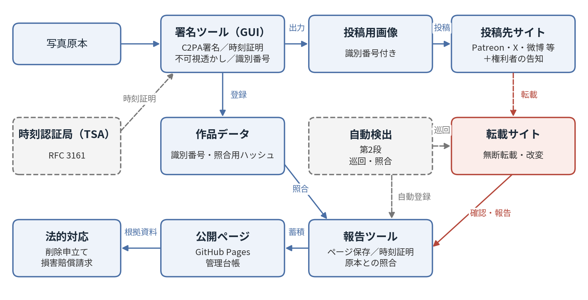
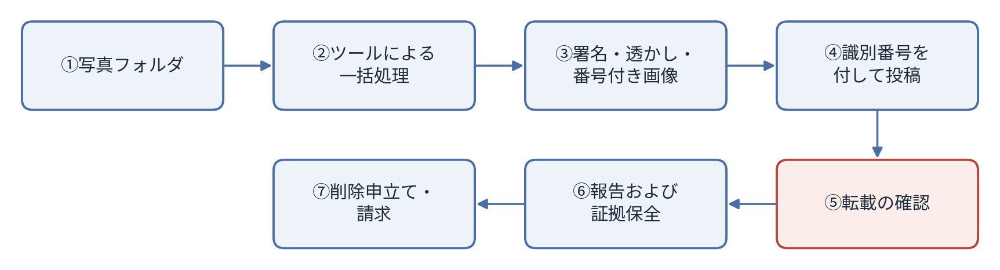

# コスプレ写真の無断転載対策ツール 企画草案

2026-09-24 · 石川宗  
Word版: [コスプレ写真の無断転載対策ツール 企画草案.docx](コスプレ写真の無断転載対策ツール%20企画草案.docx)

© 2026 株式会社流山ソフトウェア開発（NRSD）担当開発者　石川宗　本企画草案、および本企画に基づいて開発するソフトウェアの著作権は、株式会社流山ソフトウェア開発（NRSD）に帰属します。（現時点でのライセンス種別の明記はしない）ただし、本企画において採用する第三者の規格、アルゴリズムおよびソフトウェアの権利は、各権利者に帰属します（第14節参照）。

---

## 1. 背景および目的

本企画は、コスプレ写真の著作者および被写体（以下「権利者」といいます）が、著作者の意図に反した転載その他法に反する転載行為に対し、少ない負担で検出、証明および法的対応を行える状態を整えることを目的とします。開発するツールは、GitHubにおいて、ライセンスの定める範囲で無償での公開をします。

コスプレは、衣装、ウィッグ、小道具、海外からの送料等に相応の費用を要する活動であり、写真はその成果物であると同時に、権利者の収入源となる場合があります。一方で、無断転載は広く行われており、転載者の中には転載を「共有」と認識している者も少なくありません。転載者が多数に及ぶことから、個人の権利者が対応を断念している状況が見受けられます。

本企画は、権利主張に要する負担を軽減し、個人の権利者であっても権利主張に必要な準備を整えられるようにすること、ならびに同一の仕組みを利用する権利者が共同して対応できる基盤を設けることを意図するものとします。

## 2. 基本方針

現状において著作者の意図に反した転載、その他法に反する転載行為そのものを技術的に止めることは難しいですが、本システムはその前段として「検出・証明・抑止」を意図するものとします。

- **検出**：署名もしくは透かしが除去された画像、または改変された画像を機械的に検出します。
- **証明**：権利者が最初に公開した原本であることを、第三者が検証可能な形で示します。
- **抑止**：権利および対処の意思を事前に明示し、照合番号を付して投稿することにより、閲覧者が無断転載であることを判別できるようにします。

署名または透かしを除去する行為は、それ自体が権利管理情報の除去として違法となり得ます［16］［19］［20］。したがって、署名は、除去を行った者の故意を立証する資料ともなり得ます。

## 3. 効力の前提：投稿先ごとの告知

**本システムの効力は、権利者本人が、作品を投稿するすべてのサイトにおいて、無断転載に対する対応方針を告知していることを前提とします。** 署名および照合番号の付与のみでは、閲覧者および各プラットフォームに対し、権利者が対処の意思を有することは示されません。

告知には、次の事項を記載するものとします。

- 権利の所在（著作権および肖像権）
- 無断転載ならびに署名および透かしの除去が違法となり得ること
- 無断転載を確認した場合、削除申立ておよび損害賠償請求を行うこと
- 照合番号の意味および正規の写真であることの確認方法
- 作品登録番号（取得している場合）

告知は、Patreon、X、Instagram、微博、小紅書その他、作品を投稿するすべてのサイトに掲載するものとします。告知がない場合、転載者に対し、権利者の意思を知らなかった、または共有の意図であったとの主張の余地を残すことになります。告知がある場合、転載は権利者の明示の意思に反する行為となり、故意の立証および賠償請求において有利に働くことが期待されます。

## 4. システムの概要

本システムの構成を図1に示します。

図1　システム構成図

各写真には、次の三層により情報を付与し、いずれか一層が除去された場合においても原本の記録を参照できるものとします。

|層|内容|機能|
|---|---|---|
|C2PA署名［1］［3］［4］|国際標準規格に基づく電子署名。作成者、日時および識別番号を記録し、RFC 3161に基づく時刻証明を付与する［8］|画素単位の改変を検知する。既存の公開検証サイトにおいて第三者が検証できる［15］|
|不可視透かし|画素に埋め込む不可視の情報（TrustMark等のオープンソース実装を想定）［9］［10］［11］|SNS等で署名が除去された場合においても、画像から原本の記録を参照できる|
|照合用ハッシュ|PDQ等の知覚ハッシュおよび画像特徴量［12］［13］|再圧縮、縮小または切り抜きが行われた転載画像についても照合できる|

識別番号は作品ごとに発行し、C2PAマニフェストおよびファイル名の双方に記録します。ファイル名の番号は権利者が投稿時に参照するためのものであり、各プラットフォームがファイル名を変更した場合においても、照合はマニフェストおよび透かしにより行います。

処理の流れを図2に示します。

図2　処理の流れ

本処理により、写真の外観に変更は生じません。

## 5. 利用者の作業

利用者が行う作業は、次のとおりとします。

|区分|作業内容|実施時期|
|---|---|---|
|準備|写真またはフォルダをツールにドラッグ＆ドロップする（右クリックメニューからの実行も可能とする）|投稿の都度|
|投稿|ファイル名に付された識別番号をキャプションに記載する|投稿の都度|
|告知|権利および対処の意思を記載した告知文を、作品を投稿するすべてのサイトのプロフィールに掲載する（本システムの効力の前提。英語および中国語の文例を用意する）|サイトごとに初回|
|報告|転載を確認した場合、報告画面に当該URLを登録する|転載の確認時|
|対処|蓄積された記録に基づき、削除申立てまたは損害賠償請求を行う|権利者の判断による|

転載の確認時に即時の対処を要するものではありません。報告を行うことにより証拠が保全され、対処は後日まとめて行うことができます。

## 6. ツールの構成

株式会社流山ソフトウェア開発（NRSD）が開発する範囲は、署名ツール、報告ツールおよびGitHub上に展開する公開ページ、ならびにこれらを連携させる機能とします。

1. **署名ツール（GUI）**
   - 写真またはフォルダのドラッグ＆ドロップにより、C2PA署名、時刻証明、不可視透かしおよび識別番号を付与した投稿用画像を出力します。
   - Windowsにおいては、エクスプローラーの右クリックメニューに「C2PA署名して書き出す」項目を登録します。
   - 識別番号はファイル名の先頭または末尾に付し、同一の番号をマニフェストにも記録します。
   - 実装はc2pa-python［14］を基盤とします。
2. **報告ツール**
   - 権利者が、確認した転載のURLおよび画像を登録する画面を提供します。
   - 登録と同時に、当該ページの保存、ハッシュへの時刻証明の付与および原本との照合を自動で行います。
3. **公開ページ（GitHub Pages）**
   - 報告された転載ページおよび画像を、署名者の作品番号と対応付けて蓄積します。
   - 後日の法的対応のための管理台帳として機能するものとします。

報告の登録は署名者本人に限るものとし、第三者による登録はできないものとします。

## 7. 転載の報告および証拠保全

証拠は報告と同時に自動で保全し、時刻証明を付与することにより、転載ページが削除された後においても使用できる記録とします。

- **時刻証明**：gitのコミット日時は自己申告であり証明力を有しないため、保存したページのハッシュについてRFC 3161［8］に基づくタイムスタンプを取得し、その証明書を併せて保存します。
- **照合結果の記録**：転載画像から透かしを読み出し、知覚ハッシュにより原本と照合した結果を記録します。
- **各国における証拠の補強**：中国においては、杭州、北京および広州のインターネット法院がブロックチェーンに記録された電子証拠を認めている［18］ことから、中国国内の時刻証明サービスによる保全が現地手続きに資するものと考えられます。日本においては、公正証書または法的証拠用の記録サービスの利用が考えられます。
- **運営者の特定**：中国国内のサイトについては、表示が義務付けられているICP備案号［22］により運営主体を調査できます。国外のサイトについては、WHOISおよびASNの調査［23］によりホスティング事業者を特定し、その不正利用対応窓口に通知します。

公開ページの表示文言は、既定において「権利者が無許諾転載として報告」「署名不一致」等の事実の記述とします。

## 8. 権利の表明および法的対応

権利および対処の意思を事前に明示し、登録番号を表記することは、抑止および法的対応の前提となります。これらはいずれも、多額の費用を要するものではありません。

- **権利の明示**：写真の著作権（撮影者との契約により保有または共有する部分）および被写体本人の肖像権を明示します。肖像権は、撮影者が誰であるかにかかわらず本人が主張できます［17］。
- **法的根拠の明示**：無断転載は著作権および肖像権の侵害となり得るほか、署名または透かしの除去は権利管理情報の除去として別途違法となり得ます［16］［19］［20］。中国の著作権法においては、故意の侵害に対し賠償額の1倍以上5倍以下の懲罰的賠償が定められており、法定賠償の上限は500万元とされています［16］。米国においては、DMCA第1202条により、実損害の立証を要せず法定損害賠償を請求できる場合があります［19］。
- **対処の意思表示**：署名の欠損もしくは改変、または拡散が確認された場合には、削除申立ておよび損害賠償請求を行う旨を表明します。表明の内容は、実際に実行できる範囲に限るものとします。
- **登録番号の表記**：中国版权保护中心の作品登記は公表後においても申請でき、その登録証書は中国の裁判所において権利帰属の証拠として広く用いられています。登録番号は作品とともに掲示します［21］。
- **申立て先**：微博、小紅書、Bilibili等の権利侵害申立て窓口、米国の事業者に対するDMCA通知、ならびにサーバー事業者および運営者への通知とします。
- **共同での対応**：同一の仕組みを利用する権利者が多数となることにより、同一の転載者または事業者に対し多数の申立てを行うことが可能となります。中国には共同訴訟および代表人訴訟の制度があり、日本においては多数の少額訴訟の提起も有効な手段となり得ます。

優先して対応する対象は、商品化、有償販売、広告への流用、AI学習用データへの収録等の商業的利用とします。

## 9. 運営および責任の範囲

ツールはGitHubにおいて公開し、利用を希望する者は、これをForkし各自の責任において運営するものとします。NRSDは、各Forkの運営の結果について責任を負いません。

- **原版**：NRSDが作成し公開します。AYA氏は、原版にプロジェクト参加者として参加すること、または自らForkして運営することのいずれかを選択できるものとします。
- **Forkの運営**：署名者と報告された転載サイトとの対応関係の正確性は、各Forkの運営者が担保するものとします。
- **NRSDの提供範囲**：署名ツール、報告ツール、公開ページ、これらの連携機能および識別番号を取得するGUIとします。運用方法は、各利用者の判断によるものとします。

**法的対応の範囲について**：本システムの運用に関する法的訴訟には、弊社の担当弁護士が一括して対応します。ただし、これは利用者の権利を保護するために機能するものではありません。無断転載に対する削除申立ておよび損害賠償請求は、各利用者が権利者として自ら行う必要があります。

## 10. 制約および留意事項

本システムは、無断転載そのものを消滅させるものではなく、その効果はツールの導入後に投稿された写真に限られます。

- 導入前に公開された写真には署名および透かしが付与されないため、原本データの保管および作品登記により権利を示すものとします。
- 国外の転載者に対しては、削除にとどまる場合が多いことが想定されます。ただし、その場合においても、権利保護の措置を講じた記録は残ります。
- 撮影者が権利者本人と異なる写真については、権利の帰属を撮影者と事前に確認するものとします。
- C2PAの確認アイコンはAI生成の表示と誤認される場合があるため、告知文において真正性を示すものであることを説明するものとします。

## 11. 実施項目

AYA氏による利用の有無にかかわらず、NRSDは本ツールを開発します。

- 署名ツール：C2PA署名、時刻証明、透かしおよび識別番号の一括処理ならびにGUI
- 右クリックメニューへの登録（Windows）
- 報告ツール：URLの登録、ページの保存、時刻証明および照合
- 公開ページ：GitHub Pagesへの展開および報告データの蓄積
- 告知文の文例（英語および中国語）
- 申立て文面の自動作成
- GitHubにおける公開およびAYA氏への案内

## 12. 第2段：自動検出アプリケーション

後続の計画として、ネットワーク上を巡回し、無断転載された画像およびその掲載サイトを自動で検出する自律型アプリケーションを開発するものとします。第1段のツールが転載の確認後の報告を前提とするのに対し、第2段は検出そのものを自動化するものです。

- **巡回**：画像検索結果および公開ページを定期的に巡回し、照合対象となる画像を収集します。
- **照合**：透かしの読出し、PDQ等の知覚ハッシュおよび画像特徴量により、登録済みの作品と照合します。
- **連携**：一致した画像を第1段の報告ツールに自動で登録し、証拠保全および時刻証明までを行います。
- **検討事項**：ログインを要するSNSおよびスクレイピング対策の強いサイト（微博、小紅書等）の取扱い、各サイトの利用規約との関係、ならびに巡回に要する負荷および費用。

## 13. 本資料の位置付けおよび文書体系

本企画草案は、設計計画の起案であり、以下の順序で資料を編成する。

1. **企画草案**（本資料）：構想と基本方針
2. **設計計画**：本企画草案を具体化し、開発の範囲と実施内容を確定する
3. **設計書**：システム全体の構成と方式
4. **詳細設計書**：各機能の実装仕様

**設計計画は、株式会社流山ソフトウェア開発（NRSD）が発行する。**

## 14. 第三者の権利およびライセンス

本企画において採用する規格、アルゴリズムおよびソフトウェアの権利は、それぞれの権利者に帰属します。NRSDが権利を有するのは、本企画に基づきNRSDが独自に開発する部分に限られ、第三者の構成要素は、各権利者が定めるライセンスまたは利用条件に従って利用するものとします。

|構成要素|権利者|ライセンス・利用条件|参照|
|---|---|---|---|
|C2PA技術仕様|C2PA（Coalition for Content Provenance and Authenticity）|C2PAの定める利用条件|［1］|
|c2pa-python|Content Authenticity Initiative|MIT License および Apache License 2.0|［14］|
|TrustMark|Adobe|MIT License|［9］［10］|
|PDQ|Meta Platforms|BSD License（ThreatExchangeリポジトリ）|［12］|
|RFC 3161、5280、8949、9052|IETF Trust|IETFの定める利用条件|［3］［4］［5］［8］|
|ISO/IEC 19566-5（JUMBF）|ISO、IEC|ISOおよびIECの定める利用条件|［6］|

公開時には、各構成要素のライセンス条項および著作権表示をソフトウェアに同梱し、NRSDが定めるライセンスとの適合性を確認するものとします。第三者の構成要素の利用条件は変更される場合があるため、設計計画において最新の条件を確認するものとします。

## 15. 参考文献（技術背景および法令の索引）

本文中の［ ］内の番号は、以下の文献に対応します。

### 来歴証明および電子署名

［1］C2PA, *Content Credentials: C2PA Technical Specification*, Version 2.2. https://spec.c2pa.org/specifications/specifications/2.2/specs/C2PA_Specification.html（関連：第4節、第6節）

［2］C2PA Technical Working Group, *C2PA Content Credentials Explained: Addressing Common Questions and Updates*, 2025年9月. https://c2pa.org/wp-content/uploads/sites/33/2025/10/content_credentials_wp_0925.pdf（関連：第4節）

［3］IETF RFC 5280, *Internet X.509 Public Key Infrastructure Certificate and CRL Profile*. https://www.rfc-editor.org/rfc/rfc5280（関連：第4節）

［4］IETF RFC 9052, *CBOR Object Signing and Encryption (COSE): Structures and Process*. https://www.rfc-editor.org/rfc/rfc9052（関連：第4節）

［5］IETF RFC 8949, *Concise Binary Object Representation (CBOR)*. https://www.rfc-editor.org/rfc/rfc8949（関連：第4節）

［6］ISO/IEC 19566-5, *JPEG Systems — Part 5: JPEG Universal Metadata Box Format (JUMBF)*.（関連：第4節）

［7］NIST FIPS 180-4, *Secure Hash Standard (SHS)*. https://nvlpubs.nist.gov/nistpubs/FIPS/NIST.FIPS.180-4.pdf（関連：第4節、第7節）

### 時刻証明

［8］IETF RFC 3161, *Internet X.509 Public Key Infrastructure Time-Stamp Protocol (TSP)*. https://www.rfc-editor.org/rfc/rfc3161（関連：第4節、第6節、第7節）

### 不可視透かし

［9］T. Bui, S. Agarwal, J. Collomosse, *TrustMark: Universal Watermarking for Arbitrary Resolution Images*, arXiv:2311.18297. https://arxiv.org/abs/2311.18297（関連：第4節）

［10］Adobe, TrustMark 公式実装（MITライセンス）. https://github.com/adobe/trustmark（関連：第4節、第6節）

［11］Content Authenticity Initiative, *TrustMark FAQ*（C2PAの承認済み透かし方式としての位置付け）. https://opensource.contentauthenticity.org/docs/trustmark/FAQ（関連：第4節）

### 知覚ハッシュによる照合

［12］Meta, *The TMK+PDQF Video-Hashing Algorithm and the PDQ Image Similarity Algorithm*（hashing.pdf）. https://github.com/facebook/ThreatExchange/blob/main/hashing/hashing.pdf（関連：第4節、第7節、第12節）

［13］*PDQ & TMK+PDQF – A Test Drive of Facebook’s Perceptual Hashing Algorithms*, arXiv:1912.07745. https://arxiv.org/abs/1912.07745（関連：第4節、第12節）

### 実装および検証

［14］Content Authenticity Initiative, c2pa-python. https://github.com/contentauth/c2pa-python（関連：第6節）

［15］Content Authenticity Initiative, Content Credentials 検証サイト. https://verify.contentauthenticity.org（関連：第4節）

### 法令および制度

［16］中华人民共和国著作权法（2020年修正）第12条（作品登記）、第51条（権利管理情報）、第54条（損害賠償）. WIPO Lex: https://www.wipo.int/wipolex/zh/legislation/details/21065（関連：第2節、第8節）

［17］中华人民共和国民法典 第1018条、第1019条（肖像権）.（関連：第8節）

［18］最高人民法院关于互联网法院审理案件若干问题的规定（法释〔2018〕16号）第11条. https://www.court.gov.cn/fabu/xiangqing/116981.html（関連：第7節）

［19］17 U.S.C. §1202（著作権管理情報の保全）、§1203（民事救済）. https://www.law.cornell.edu/uscode/text/17/1202 、https://www.law.cornell.edu/uscode/text/17/1203（関連：第2節、第8節）

［20］著作権法（昭和45年法律第48号）第2条第1項第21号（権利管理情報）、第113条（侵害とみなす行為）. https://laws.e-gov.go.jp/law/345AC0000000048（関連：第2節、第8節）

［21］中国版权保护中心（作品登記）. https://www.ccopyright.com.cn（関連：第8節）

［22］工業和信息化部 ICP/IP地址/域名信息备案管理系统. https://beian.miit.gov.cn（関連：第7節）

［23］ICANN Lookup（RDAP/WHOIS）. https://lookup.icann.org（関連：第7節）
