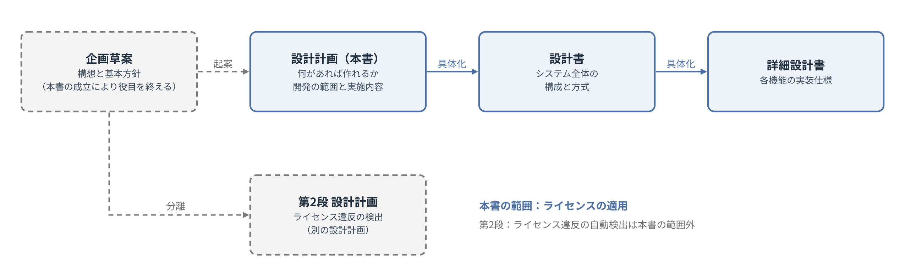
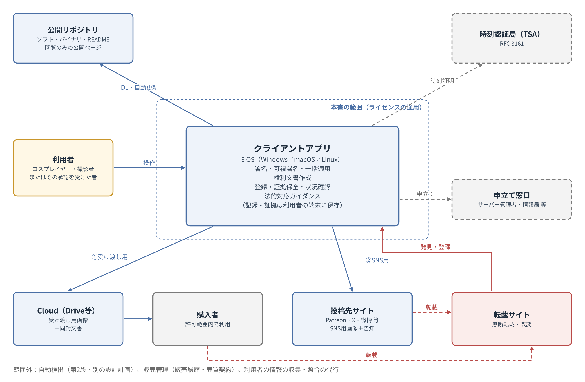
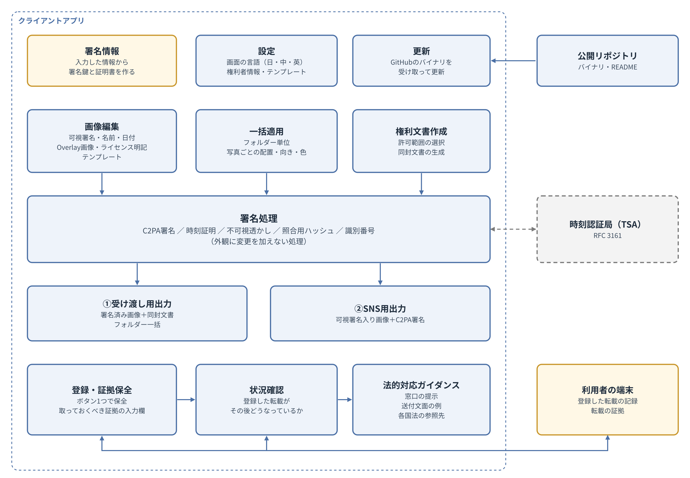
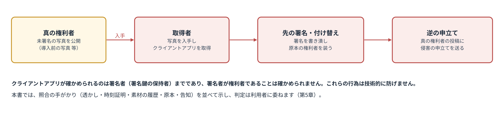
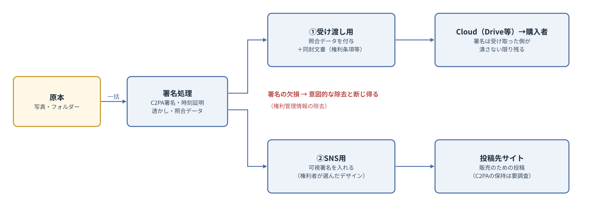
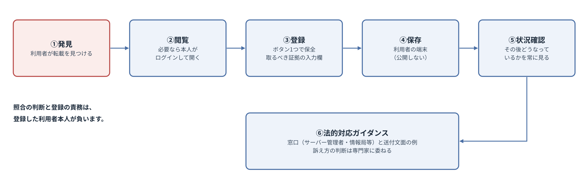
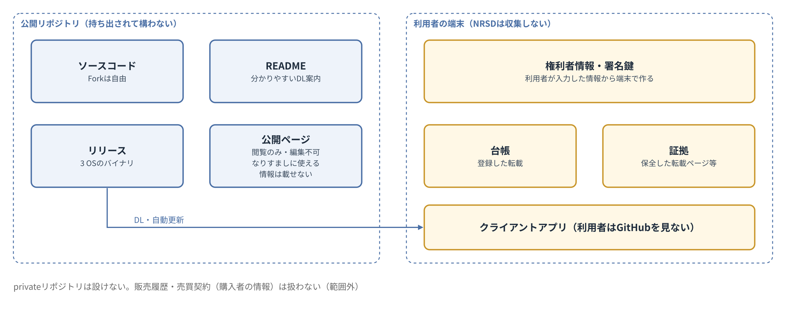

# コスプレ写真の無断転載対策ツール 設計計画書

第2版（案）　2026-09-29 · 石川宗  
株式会社流山ソフトウェア開発（NRSD）  
Word版: [設計計画書.docx](設計計画書.docx)

© 2026 株式会社流山ソフトウェア開発（NRSD）担当開発者　石川宗　本設計計画書、および本設計計画書に基づいて開発するソフトウェアの著作権は、株式会社流山ソフトウェア開発（NRSD）に帰属します。ただし、本設計計画書において採用を検討する第三者の規格、アルゴリズムおよびソフトウェアの権利は、各権利者に帰属します（第17章参照）。

---

## 改訂履歴

|版|日付|内容|作成|
|---|---|---|---|
|第1版（案）|2026-09-29|企画草案（2026-09-24）を起案として新規作成|石川宗|
|第2版（案）|2026-09-29|本システムは利用者の情報を集めず、クライアントアプリの中で完結するものに改めた。C2PA署名の証明書は利用者が入力した情報から端末の中で作るものとし、認証局を要しないこととした。権利者を装う者は排除できないものとし、照合の手がかりを示す扱いとした。privateリポジトリを廃止し、記録および証拠は利用者の端末に置くこととした。識別番号はクライアントアプリが発行し、C2PAマニフェストに自動で記録し、ファイル名に付けるかは利用者が選ぶこととした（第1章から第5章まで、第7章、第10章、第12章から第16章まで）|石川宗|
|第2版（案）|2026-09-30|第18章の参考文献［20］の条項番号を訂正した（著作権法の権利管理情報の定義は、2018年の改正により第2条第1項第22号。第21号は技術的利用制限手段）|石川宗|

## 第1章　本書の位置付け

### 1.1　本書の目的

本書は、「コスプレ写真の無断転載対策ツール」（以下「本システム」といいます）について、設計書を書く前に、何があれば本システムを作れるかを定義するものです。

本書は、利用者は誰か、利用者はどのように、いつ本システムを使うのか、どのプラットフォームで動作させるのか、何を開発基盤とするのか、ならびに公開、配布および運用をどのように管理するのかを、項目ごとに並べて確定させます。

本書は、実現方法を定めるものではありません。実現方法は設計書に譲るものとし、本書は、設計書が前提とすべき事項、および設計書の段階で精細に調査すべき事項を明らかにするものとします。

### 1.2　文書体系

企画草案は、本システムの文書体系を次のとおり定めています。

> 本企画草案は、設計計画の起案であり、以下の順序で資料を編成する。企画草案（本資料）：構想と基本方針　設計計画：本企画草案を具体化し、開発の範囲と実施内容を確定する　設計書：システム全体の構成と方式　詳細設計書：各機能の実装仕様
> （企画草案 第13節）

本書は、この体系における「設計計画」にあたります。本書と各文書の関係を図1に示します。

図1　文書体系

本システムの第2段として企画草案第12節に記載された自動検出アプリケーションは、本書とは別の設計計画として扱います（第13章参照）。

### 1.3　企画草案との関係

企画草案は、本書を起案するための契機となった文書です。本書の成立により、企画草案はその役目を終え、その効力は本書に比して劣後するものとします。

企画草案と本書の記述が異なる場合には、本書の記述が優先します。企画草案の各節が本書においてどのように扱われるかは、第16章の対照表に示します。

本書は、企画草案の記述を引用する場合、引用であることを明示し、引用元の節を付記します。

### 1.4　記述の区分

本書は、各事項を次の区分により記述します。

|区分|意味|
|---|---|
|決定|本書において確定した事項。設計書は、これを前提とする|
|【要設計】|要件のみを本書で定め、その実現方法を設計書で必ず定めなければならない事項。現時点において対策がないもの|
|要調査|設計書の段階で事実を調査し、その結果により実現方法を定める事項（第14章に一覧を示す）|
|未決|本書の段階で結論を保留した事項、および採否の定まっていない候補（第15章に一覧を示す）|
|設計書へ|計画の段階では項目の存在のみを確認し、内容を設計書で定める事項|

各章の決定事項には、「D-章番号-連番」の形式で番号を付し、設計書から参照できるようにします。

### 1.5　用語の定義

本書において使用する用語の意味は、次のとおりとします。

|用語|意味|
|---|---|
|本システム|本書が対象とするシステムの全体。クライアントアプリおよび公開リポジトリからなる|
|クライアントアプリ|利用者の端末において動作する、本システムのソフトウェア|
|権利者|写真の著作者および被写体（企画草案第1節の定義による）|
|利用者|本システムを使う者。権利者、またはそのどちらかに承認を受けた者（第3章で定める）|
|署名者|署名鍵を保持し、クライアントアプリにより画像に署名を行う者|
|原本|権利者が保有する、公開前の写真データ（RAW、未加工のデータおよび未公開の写真を含む）|
|照合|画像と権利者の記録（照合データ、原本、告知等）とを突き合わせ、同一の作品であるか、および誰が権利者であるかの手がかりを得ること。本システムは照合の手段を提供し、照合を代行しない（第5章）|
|照合データ|原本との照合のために画像に付与する情報。C2PA署名（マニフェスト）、不可視透かしおよび識別番号を含む|
|照合用ハッシュ|知覚ハッシュおよび画像特徴量。画像には付与せず、照合のために記録する（記録先は利用者の端末。記録の形式は未決。O-10「作品データの記録の形式」）|
|識別番号|作品ごとにクライアントアプリが発行し、C2PAマニフェストに自動で記録する番号。保存するファイル名の後ろにも付けるかは、保存の際に利用者が選ぶ（企画草案第4節の識別番号。ファイル名への記録は本書で改めた。第16章）|
|受け渡し用画像|販売により購入者に受け渡す画像|
|SNS用画像|販売のために投稿先サイトへ投稿する画像。可視署名を入れる|
|可視署名|画像上に目に見える形で入れる、権利者名、アカウント名、日付、Overlay画像、ライセンス表記その他の表示|
|許可範囲|受け渡し用画像について、権利者が購入者に許諾する利用の範囲|
|権利文書|許可範囲、および権利に関する条項を記載した文書|
|同封文書|受け渡し用画像とともに同封する権利文書その他の文書|
|告知|権利者が、作品を投稿するすべてのサイトに掲載する、無断転載に対する対応方針（企画草案第3節による）|
|告知先アカウント|権利者が告知を掲載する、投稿先サイト等における権利者自身のアカウント|
|転載者|権利者の意図に反して画像を転載する者|
|違法者|権利者の許諾なく画像を公開し、または許可範囲を超えて画像を利用し、権利者に損害を与えた者。購入者であるか否かを問わない|
|登録|利用者が発見した転載を、クライアントアプリに記録すること（企画草案における「報告」にあたる）|
|権利者情報|誰が権利者であるかを示す情報（ハンドルネーム、告知先アカウント等）。利用者が入力し、C2PA署名の証明書および画像に記録する。本システムは収集しない|
|証拠保全|登録と同時に、後日の対処に用いる記録を残すこと|
|公開リポジトリ|本システムのソフトウェアを公開するGitHubリポジトリ|

## 第2章　目的および範囲

### 2.1　目的

企画草案は、本システムの目的を次のとおり定めています。

> 本企画は、コスプレ写真の著作者および被写体（以下「権利者」といいます）が、著作者の意図に反した転載その他法に反する転載行為に対し、少ない負担で検出、証明および法的対応を行える状態を整えることを目的とします。
> （企画草案 第1節）

本書は、この目的を引き継ぎ、本システムが守ろうとするものを次のとおり定めます。

- 本システムが守るものは、権利者が自らの写真に対して有する権利（著作権および肖像権）とします。
- 本システムは、ライセンスの適用、すなわち、権利者が写真に権利を表示し、許可範囲を定め、その範囲を超える利用に対し権利を主張できる状態を整えることにより、その権利を守るものとします。

本システムのソフトウェアそのもの（ソースコードおよびバイナリ）は、本システムが守る対象ではありません。ソフトウェアが複製され、または持ち出された場合においても、権利者の権利は損なわれないためです。何者かが権利者になりすますことは、技術的に防ぐことができません。本システムは、なりすましが疑われる場合に照合の手がかりを示すことにより、権利者が自らの権利を示せるようにします（第5章参照）。

### 2.2　基本方針

企画草案は、本システムの基本方針を「検出・証明・抑止」と定めています。

> 現状において著作者の意図に反した転載、その他法に反する転載行為そのものを技術的に止めることは難しいですが、本システムはその前段として「検出・証明・抑止」を意図するものとします。
> （企画草案 第2節）

本書は、このうち抑止を本システムの最大の価値と位置付けます。権利者が、権利を表示し、許可範囲を明示し、しかるべきときには対処する意思と手段を有していることを示すことが、実際に対処を行う以前から転載を思いとどまらせる効果を持つと考えるためです。

実際の対処が功を奏さなかった場合には、それを課題として次の改善につなげるものとし、法的な判断を要する事項は専門家に相談するものとします（第11章参照）。

### 2.3　本書の範囲

本書が対象とする範囲は、ライセンスの適用とします。具体的には、次の事項を範囲とします。

- C2PA署名のための情報の入力、および照合の手がかりの提示（第5章）
- 画像への署名、照合データの付与および可視署名の付与（第7章）
- 画像編集画面、一括適用および権利文書作成画面（第8章）
- 許可範囲の選択および同封文書の生成（第9章）
- 利用者自身による転載の登録、証拠保全および状況確認（第10章）
- 法的対応のガイダンス（第11章）
- 公開リポジトリの管理、配布および更新（第12章）

本システムの範囲を図2に示します。

図2　システムの範囲

### 2.4　範囲外

次の事項は、本書の範囲外とします。

|範囲外の事項|理由|扱い|
|---|---|---|
|自動検出（ネットワークを巡回し、転載を自動で検出すること）|ライセンスの適用とは軸が異なり、ライセンス違反の検出にあたるため|別の設計計画とする（第13章）|
|販売管理（販売履歴、売買契約および購入者の情報の管理）|本システムの目的は権利侵害を止めることであり、販売管理ではないため|扱わない。必要とする者は、公開リポジトリをForkして改造するものとし、その結果についてNRSDは関知しない|
|訴訟その他の法的手続の代理および法的判断|本システムは、法の専門家に代わるものではないため|行わない。窓口の提示までを行う（第11章）|
|購入者の特定|第9章に定めるとおり、問う相手は違法者であり、購入者であるか否かを問わないため|行わない|
|利用者の情報の収集、および照合の代行|本システムは照合の手段を提供するが、照合を代わりに行わない。利用者の情報を集めず、クライアントアプリの中で完結させるため|行わない（第5章）|

### 2.5　企画草案における制約の継承

企画草案第10節に記載された次の制約は、本書においても引き継ぐものとします。

> 本システムは、無断転載そのものを消滅させるものではなく、その効果はツールの導入後に投稿された写真に限られます。
> （企画草案 第10節）

- 導入前に公開された写真には、署名および照合データが付与されません。これらの写真については、原本の保管および作品登記により権利を示すものとします（企画草案第10節による）。
- 導入前に公開された写真は、第5章に示すなりすましの対象となり得ます。

### 2.6　本章の決定事項

|番号|決定事項|
|---|---|
|D-2-1|本システムが守るものは、権利者が自らの写真に対して有する権利（著作権および肖像権）とする|
|D-2-2|本システムの範囲はライセンスの適用とする|
|D-2-3|本システムの最大の価値は抑止とする|
|D-2-4|自動検出は別の設計計画とする|
|D-2-5|販売管理は扱わない。必要とする者はForkして改造するものとし、その結果についてNRSDは関知しない|
|D-2-6|法的手続の代理および法的判断は行わない|

## 第3章　登場人物および利用者

### 3.1　登場人物

本システムに関係する者を、人の種類により整理すると、次の5種類となります。

|種類|本システムとの関係|本システムの内外|
|---|---|---|
|コスプレイヤー（被写体）|肖像権を有する。写真の販売および投稿を行う|内（利用者）|
|撮影者|著作権を有する（コスプレイヤーとの契約により、帰属が異なり得る）|内（利用者）|
|転載者|権利者の意図に反して画像を転載する。権利者の承認を受けて転載する者は転載者にあたらず、権利者の側に立つ者として扱う|外|
|閲覧者|投稿先サイトにおいて、キャプションおよび告知により正規の写真であるかを判別する。署名の検証は既存の公開検証サイトにより行う［15］|外|
|運営者（NRSD、Forkの運営者）|本システムを作る者であり、設計上常に存在する|システムの中で定義しない|

このほか、投稿先サイト、転載サイトの運営者、ホスティング事業者、時刻認証局、裁判所、申立て窓口その他の組織が関係しますが、これらは人ではなく、本システムの外部にある組織として扱います。

### 3.2　利用者の定義

本システムの利用者は、画像の権利者、およびそのどちらかに承認を受けた者とします。すなわち、利用者は、コスプレイヤー、撮影者、またはそのどちらかに承認を受けた者とします。

この定義は、次の整理により導かれます。

- 閲覧者は、本システムを使わずに、投稿先サイトおよび既存の公開検証サイトにより目的を達するため、本システムの外にあります。
- 運営者は本システムの作り手であり、システムの中で定義する必要はありません。
- 承認を受けずに転載する者は、本システムを使いません。承認を受けた者は、コスプレイヤーまたは撮影者の側に立つ者です。
- したがって、本システムを使う者は、画像の権利者、およびその承認を受けた者に限られます。

### 3.3　利用者の実像

利用者は、次の特徴を有するものとして扱います。

- 利用者は技術者ではありません。GitHubを理解していることを前提とせず、利用者がGitHubを見ずに本システムを使えることを要します。
- 利用者は国をまたいで存在します。日本、中国および英語圏のほか、カナダ等に在住する利用者も想定します。
- 利用者は、キャラクターおよびかわいいものを好みます。見た目の悪いソフトウェアは使われません（第8章参照）。
- 利用者は、写真を販売するためにSNSへ投稿し、販売した写真をCloud（Google Drive等）の共有により購入者に受け渡しています。

#### 3.3.1　利用者の例

NRSDが2026年9月に確認した、ある利用者（カナダに在住するコスプレイヤー）の例は、次のとおりです。これは利用者の実像の一例であり、本書の各章の根拠の一つとします。

- 支援サービス（Patreon）において、英語で活動しています。
- 投稿画像には、手書き風の文字により、アカウント名および支援サービス（中国向けの支援サービスを含む）の所在を、可視署名として入れています。
- 可視署名は、被写体にかからない背景部分に置かれ、写真ごとに位置、向き（横書きまたは90度回転した縦書き）および色（背景に応じた白または黒）が調整されています。
- 可視署名を1枚ごとに調整する作業には手間を要します。
- 支援者には、Cloud（Google Drive）の共有により原寸の画像を受け渡しています。

### 3.4　前提

次の事項は、ヒアリングを行わず、前提として本システムを作るものとします。

- 受け渡しの実際（経路、形式およびサイズ）、可視署名の実際、ならびに撮影者との権利関係は、すべてコスプレイヤー本人が把握しているものとして扱います。
- 前提に不備がある場合には、利用者が本システムを使える状態になった後に、利用者から指摘を受けて改善するものとします。使えない状態でヒアリングを行っても、利用者にとって何の話であるかが伝わらないためです。

### 3.5　意図しない登場人物

第3.1節に挙げた者のほかに、本システムを使い得る者として、権利者を装う者があります。この者を技術的に排除することはできません。本書は、この者が現れた場合の照合の扱いを第5章で定めます。

### 3.6　本章の決定事項

|番号|決定事項|
|---|---|
|D-3-1|利用者は、画像の権利者（コスプレイヤーおよび撮影者）、ならびにそのどちらかに承認を受けた者とする|
|D-3-2|閲覧者および運営者は、本システムの中で定義しない|
|D-3-3|利用者がGitHubを見ずに本システムを使えることとする|
|D-3-4|受け渡し、可視署名および撮影者との権利関係は、コスプレイヤー本人が把握しているものとして作る|
|D-3-5|ヒアリングは行わず、使える状態になった後の指摘により改善する|
|D-3-6|権利者を装う者は排除できないことを前提とし、照合の扱いを第5章で定める|

## 第4章　システムの全体像

### 4.1　構成要素

本システムは、次の要素により構成します。

|構成要素|役割|
|---|---|
|クライアントアプリ|利用者の端末において動作し、署名、可視署名、一括適用、権利文書の作成、登録、証拠保全、状況確認および法的対応のガイダンスを行う。権利者情報、署名鍵、作品データ、登録した転載の記録および証拠を利用者の端末に保存する|
|公開リポジトリ|ソースコード、バイナリ、READMEおよび閲覧のみの公開ページを置く|
|外部の組織|時刻認証局、投稿先サイト、Cloud、申立て窓口等。本システムはこれらを利用し、またはこれらに案内する|

### 4.2　システムブロック

クライアントアプリの内部を、機能のまとまり（ブロック）ごとに図3に示します。図3は、本書の段階で考えられる限りの構成を示すものであり、各ブロックの方式は設計書で定めます。

図3　システムブロック

|ブロック|機能|関連章|
|---|---|---|
|署名情報|利用者が入力した情報から、C2PA署名に用いる署名鍵と証明書を端末の中で作る|第5章「C2PA署名の情報および権利者を装う者」|
|設定|画面の言語およびテンプレートを管理する|第8章「画面および使いやすさ」、第9章「権利文書および言語」|
|更新|公開リポジトリのバイナリを受け取り、クライアントアプリを更新する|第12章「リポジトリの管理、配布および更新」|
|画像編集|可視署名、名前、日付、Overlay画像およびライセンス表記をテンプレートとして作成し、適用する|第8章「画面および使いやすさ」|
|一括適用|フォルダー単位で処理し、写真ごとに配置、向きおよび色を調整する|第8章「画面および使いやすさ」|
|権利文書作成|許可範囲を選択し、同封文書を生成する|第9章「権利文書および言語」|
|署名処理|C2PA署名、時刻証明、不可視透かし、照合用ハッシュおよび識別番号を付与または記録する|第7章「写真の形態および処理系統」|
|受け渡し用出力|署名済みの画像と同封文書をフォルダー一括で出力する|第7章「写真の形態および処理系統」、第9章「権利文書および言語」|
|SNS用出力|可視署名入りの画像にC2PA署名を付与して出力する|第7章「写真の形態および処理系統」|
|登録・証拠保全|発見した転載を登録し、証拠を保全する（利用者の端末に保存する）|第10章「転載の登録、証拠保全および状況確認」|
|状況確認|登録した転載がその後どうなっているかを示す|第10章「転載の登録、証拠保全および状況確認」|
|法的対応ガイダンス|窓口、送付文面の例および各国法の参照先を示す|第11章「法的対応の支援範囲」|

### 4.3　利用の場面

利用者がクライアントアプリを使う場面は、次のとおりとします。

|場面|利用者の作業|実施時期|
|---|---|---|
|準備|C2PA署名のための情報を入力し、可視署名のテンプレートを用意する|初回、および変更の都度|
|告知|作品を投稿するすべてのサイトに告知を掲載する（企画草案第3節による）|サイトごとに初回|
|販売|受け渡し用のフォルダーを一括処理し、同封文書とともにCloudへ上げる|販売の都度|
|投稿|SNS用画像を作成し、投稿先サイトへ投稿する|投稿の都度|
|登録|転載を発見した場合に、クライアントアプリから登録する|転載の発見時|
|確認|登録した転載の状況を確認する|随時|
|対処|ガイダンスに従い、権利者自身が申立てその他の対処を行う|権利者の判断による|

企画草案第5節は、転載の確認時に即時の対処を要しないことを定めています。本書もこれを引き継ぎます。

> 転載の確認時に即時の対処を要するものではありません。報告を行うことにより証拠が保全され、対処は後日まとめて行うことができます。
> （企画草案 第5節）

## 第5章　C2PA署名の情報および権利者を装う者

### 5.1　C2PA署名のための情報

C2PA署名は、X.509形式の証明書と、これに対応する署名鍵により行います［1］。C2PAの技術仕様は、署名に用いる証明書の発行元に特定の資格を求めていません。

利用者は、C2PA署名に必要な情報（証明書の中身）を知っているとは限りません。本システムは、利用者が入力欄に書き込んだ情報（ハンドルネーム、告知先アカウント等）から、署名鍵と証明書をクライアントアプリの中で作るものとします。

本システムは、利用者の情報を集めません。署名鍵、証明書および入力された情報は、利用者の端末の中にのみ置きます。本システムを使うために、電子メールアドレスその他の登録を求めることはしません。

このように作った証明書による署名は、既存の公開検証サイトにおいて、改ざんされていないこと（有効）を確かめられますが、署名者がC2PA信頼リストにより保証されたもの（信頼済み）とは表示されません［24］。

### 5.2　権利者を装う者

クライアントアプリは公開リポジトリから誰でも取得でき、誰でも使えます（第12章参照）。そのため、他人の写真を所有する者は、次の行為を行うことができます。この流れを図4に示します。

- 権利者がまだ署名していない写真（導入前に公開された写真、流出した原本等）に、権利者より先にC2PA署名します。
- 権利者がC2PA署名した画像から署名を除き、または書き潰して、自らの署名に付け替えます。
- 本システムで作った記録をもとに、真の権利者の投稿に対し、権利侵害の申立てを行います。

図4　権利者を装う者による行為

これらを技術的に防ぐことはできません。本書は、これらを防ぐことを目標とせず、これらが起きた場合に、権利者が自らの権利を示すための手がかりを示すことを目標とします。

### 5.3　本人性と権利性

この問題を扱うにあたり、本書は、確かめるべき事項を次の2つに区別します。

|区別|確かめる事項|手がかり|
|---|---|---|
|本人性|誰が署名したか|署名に用いた証明書（利用者が入力した情報を含む）|
|権利性|署名した者が、その写真の権利者（またはその承認を受けた者）であるか|告知先アカウント（本人しか書き込めない）への署名鍵の指紋等の掲示と、証明書との照合|

本人性のみでは権利性を示せません。他人の写真を入手した者が、自らの証明書で先に署名することを防げないためです。

権利性の手がかりとして挙げた告知先アカウントとの照合は、企画草案第3節が効力の前提とする告知を利用するものです。権利者は、作品を投稿するすべてのサイトのプロフィールに告知を掲載します。そこに署名鍵の指紋等を併せて掲示すれば、「このアカウントの保有者が、この署名鍵の保有者である」ことを、画像を見た誰もが照合できます。プロフィールには本人しか書き込めないため、なりすます者は、真の権利者のアカウントについての照合を通過できません。ただし、なりすます者が自らのアカウントに画像を掲載して自らの指紋を掲示する場合、および真の権利者のアカウントが乗っ取られた場合は、この限りではありません。前者については、どのアカウントがその写真を最初に掲載したかが手がかりとなります（第5.5節）。

本システムは、この照合の手段（アルゴリズム）を提供しますが、照合を代わりに行いません。照合の結果を判断するのは、照合を行った者です。

### 5.4　原本の保有による証明

原本（RAW、未加工のデータおよび同じ撮影回の未公開の写真）を保有していることは、それ自体が権利性の証拠となり得ます。公開用の画像のみに対する署名では、先に署名した者に劣後しますが、原本は権利者のみが保有しているためです。設計書は、照合の手がかりの一つとして、原本の保有を示す方法を定めるものとします。

### 5.5　署名が書き潰された場合の照合の扱い

他人がC2PA署名を書き潰して自らの署名を付けた画像について照合を行う場合、本システムは、次の手がかりを並べて示し、どちらが権利者であるかを判定しません。

|手がかり|示すもの|
|---|---|
|不可視透かし|画素に埋め込んだ識別番号は、C2PA署名を付け替えても残る。付け替えた者のマニフェストの記録と食い違えば、付け替えの跡となる|
|時刻証明|利用者の端末に残る記録（識別番号と時刻証明の組）が、付け替えた者の署名より前であれば、そのことを示す|
|素材の履歴|付け替えた者が元のマニフェストを残していれば、元の署名者が示される|
|原本|RAW、より大きい画像等を保有しているのは権利者のみである|
|告知|どちらの署名鍵が、その写真を最初に掲載したアカウントの告知と一致するか|

判定および対処（第11章参照）は、利用者に委ねます。

### 5.6　要調査

- C2PA署名用の証明書について、端末の中で作る証明書が満たすべき要件、およびC2PA信頼リストへの対応（I-01「C2PA署名用の証明書」）
- 告知先アカウントと署名鍵の照合が、各投稿先サイトにおいて可能であるか（I-02「告知先アカウントと署名鍵の照合」）

C2PAは、適合性プログラム（Conformance Program）を運用しており、その信頼リスト（C2PA Trust List）は、2025年半ばに暫定信頼リスト（Interim Trust List）に代わって開始されたものです［24］。

### 5.7　本章の決定事項

|番号|決定事項|
|---|---|
|D-5-1|本システムは利用者を確かめず、利用者の情報を集めない。本システムを使うために登録を求めない|
|D-5-2|C2PA署名の証明書は、利用者が入力した情報からクライアントアプリの中で作る。認証局を要しない|
|D-5-3|権利者を装う者による行為（先の署名、署名の付け替えおよび逆の申立て）は防げないものとし、照合の手がかりを示す。判定は行わない|
|D-5-4|本人性と権利性を区別して扱う|
|D-5-5|本システムは照合の手段を提供するが、照合を代行しない|

## 第6章　プラットフォームおよび開発基盤

### 6.1　プラットフォーム

クライアントアプリは、Windows、macOSおよびLinuxの3つのOSで動作するデスクトップアプリケーションとします。画像編集画面を含めても、GUIが複雑になるものではなく、3つのOSへの対応は過大な負担とならないと判断します。

本システムは、Webサイトとしては構築しないものとします。無断転載は、写真がWebに上げられたことにより起きている問題です。本システムを再びWebに上げれば、本システムそのものが攻撃の対象となることを避けられないためです。

なお、企画草案第6節はWindowsの右クリックメニューへの登録を定めています。本書は、対応OSを3つに広げるものとし、右クリックメニュー等のOSごとの統合機能を設けるかは設計書で定めます。

### 6.2　開発基盤

開発基盤は、本書において特定のライブラリに固定しないものとします。計画の段階で実装のライブラリを固定しても、選択肢を狭めるのみであり、得るものがないためです。

企画草案第6節には次の記述があります。

> 実装はc2pa-python［14］を基盤とします。
> （企画草案 第6節）

この記述は、実装の基盤を固定する意図によるものではありません。本書は、この記述を引き継がないものとします。

開発基盤は、次の条件を満たすものから、設計書において選定します。

|条件|理由|
|---|---|
|3つのOSで動作すること|第6.1節による|
|見た目を自由に作れること|利用者は見た目の悪いソフトウェアを使わないため（第8章）|
|画像編集を扱いやすいこと|画像編集画面および一括適用を要するため（第8章）|
|C2PA署名、不可視透かしおよび照合用ハッシュを扱えること|署名処理を要するため（第7章）|
|自己更新の仕組みを備え、または組み込めること|第12章による|

### 6.3　開発基盤の候補

2026年9月29日に確認した各構成要素の状況は、次のとおりです。

|構成要素|確認した事実|
|---|---|
|c2pa-python|c2pa-rs（Rustによる実装）をPythonから利用するための部品。MIT LicenseおよびApache License 2.0［14］|
|TrustMark|Python（PyTorchを使用）、JavaScript（ONNXを使用、読み出しのみ）およびRustの実装がある。MIT License［10］|
|PDQ|公式にはC++、PHP、Python、JavaおよびWASMの実装がある。RustおよびC#は第三者による実装。BSD License［12］［25］|
|Tauri|画面をHTMLおよびCSSで作り、処理をRustで記述する。Windows、macOSおよびLinuxに対応し、自己更新の機能を備える。MIT LicenseまたはApache License 2.0［26］|

これらの事実によれば、画面をHTMLおよびCSSで作ることにより見た目を自由に作れ、処理側でc2pa-rsおよびTrustMarkのRust実装を用いる構成（Tauriによる構成）が、第6.2節の条件に適う候補となります。ただし、これは候補であり、採否は設計書で定めます（第15章参照）。

画面をHTMLおよびCSSで作る場合においても、画面は利用者の端末の中でのみ表示され、インターネットに公開されるものではありません。したがって、第6.1節の「Webサイトとしては構築しない」とする方針に反するものではありません。

### 6.4　本章の決定事項

|番号|決定事項|
|---|---|
|D-6-1|クライアントアプリは、Windows、macOSおよびLinuxで動作するデスクトップアプリケーションとする|
|D-6-2|本システムはWebサイトとしては構築しない|
|D-6-3|開発基盤は本書で特定のライブラリに固定しない。企画草案第6節のc2pa-pythonに関する記述は引き継がない|
|D-6-4|開発基盤は、第6.2節の条件を満たすものから設計書で選定する|

## 第7章　写真の形態および処理系統

### 7.1　C2PA署名

本システムは、出力するすべての画像にC2PA署名を付与するものとします。

企画草案第4節は、C2PA署名、不可視透かしおよび照合用ハッシュの三層により情報を付与することを定めています。本書はこれを引き継ぎます。なお、企画草案第4節の図1は、識別番号および照合用ハッシュを「作品データ」として登録する構成を示していますが、その記録先は利用者の端末とし（D-12-3「権利者情報、署名鍵、作品データ、台帳および証拠は利用者の端末に置き、NRSDは収集しない」）、記録の形式は未決とします（O-10「作品データの記録の形式」）。識別番号は、クライアントアプリが発行し、C2PAマニフェストに自動で記録します。保存するファイル名の後ろにも付けるかは、保存の際に利用者が選ぶものとし、識別番号はクライアントアプリの画面でも示します（D-7-7「識別番号は、クライアントアプリが発行し、C2PAマニフェストに自動で記録する。ファイル名の後ろに付けるかは、保存の際に利用者が選ぶ」）。

次の表は、企画草案第4節の表を引用したものです。

|層|内容|機能|
|---|---|---|
|C2PA署名［1］［3］［4］|国際標準規格に基づく電子署名。作成者、日時および識別番号を記録し、RFC 3161に基づく時刻証明を付与する［8］|画素単位の改変を検知する。既存の公開検証サイトにおいて第三者が検証できる［15］|
|不可視透かし|画素に埋め込む不可視の情報（TrustMark等のオープンソース実装を想定）［9］［10］［11］|SNS等で署名が除去された場合においても、画像から原本の記録を参照できる|
|照合用ハッシュ|PDQ等の知覚ハッシュおよび画像特徴量［12］［13］|再圧縮、縮小または切り抜きが行われた転載画像についても照合できる|

### 7.2　2つの系統

本システムは、写真の用途により、次の2つの系統を設けます。処理の系統を図5に示します。

図5　処理系統

|項目|①受け渡し用|②SNS用|
|---|---|---|
|目的|販売により購入者に画像を受け渡す|販売のために投稿先サイトへ投稿する|
|経路|Cloud（Google Drive等）の共有により、フォルダー単位で一括して受け渡す|投稿先サイト（Patreon、X、微博等）へ投稿する|
|C2PA署名|付与する|付与する|
|照合データ|すべての画像に付与する|付与する|
|可視署名|未決（O-11「受け渡し用画像への可視署名」）|入れる（権利者が選んだデザイン）|
|同封文書|同封する（第9章）|同封しない|
|署名の残存|受け取った側が意図して除去しない限り残る|投稿先サイトにより除去される可能性がある（要調査）|

### 7.3　受け渡し用の系統

利用者は、販売した画像を、Cloudを経由して購入者に直接受け渡しています。この経路においては、画像に付与した署名は、受け取った側が意図して除去しない限り残ります。

したがって、受け渡した画像から署名が欠損している場合には、受け取った側が意図的に除去したものと断じ得ます。署名または透かしを除去する行為は、それ自体が権利管理情報の除去として違法となり得るものです［16］［19］［20］［27］。

販売した画像にC2PA署名がなければ、画像を購入した者が権利者を装うことができます。現状において、利用者と購入者の間の権利に関する取り決めは、どこにも書かれていません。本システムは、受け渡し用の画像にC2PA署名および照合データを付与し、同封文書により権利の所在を示すことにより、これに対処するものとします（第9章参照）。

### 7.4　SNS用の系統

利用者がSNSへ投稿するのは、写真を販売するためです。そのため、SNS用画像には、権利の所在を示す可視署名を入れることを要します。SNS用画像においては、権利者の名前が目に見えるほど表示されることは差し支えありません。

可視署名の内容およびデザインは、権利者が選ぶものとします。可視署名の作成および適用は、画像編集画面および一括適用により行います（第8章参照）。

投稿先サイトがアップロードの際にC2PA署名を保持するか、または除去するかは、調査しなければわかりません。除去するサイトがあることは十分に考えられます。SNS用の系統においては、C2PA署名とは別に、可視署名および不可視透かしにより権利を保護する手段を提供するものとします。

### 7.5　要調査

- 各投稿先サイトおよびCloudが、アップロードの際にC2PA署名を保持するか（I-03「投稿先サイトおよびCloudにおけるC2PA署名の保持」）

### 7.6　本章の決定事項

|番号|決定事項|
|---|---|
|D-7-1|出力するすべての画像にC2PA署名を付与する|
|D-7-2|企画草案第4節の三層（C2PA署名、不可視透かし、照合用ハッシュ）を引き継ぐ|
|D-7-3|①受け渡し用および②SNS用の2つの系統を設ける|
|D-7-4|受け渡し用画像には照合データを付与し、同封文書を同封する|
|D-7-5|SNS用画像には、権利者が選んだデザインの可視署名を入れる|
|D-7-6|署名の欠損は、受け取った側による意図的な除去と断じ得るものとして扱う|
|D-7-7|識別番号は、クライアントアプリが発行し、C2PAマニフェストに自動で記録する。ファイル名の後ろに付けるかは、保存の際に利用者が選ぶ|

## 第8章　画面および使いやすさ

### 8.1　見た目

クライアントアプリは、見た目の良いものとします。利用者であるコスプレイヤーは、キャラクターおよびかわいいものを好みます。見た目の悪いソフトウェアは、機能が優れていても使われません。

見た目は、本システムの効力に直結する要件として扱います。利用者に使われなければ、署名も告知も付与されず、第2.2節に定めた抑止が働かないためです。

### 8.2　画面

クライアントアプリは、次の画面を備えるものとします。

|画面|目的|主な要件|
|---|---|---|
|画像編集画面|SNS用画像の可視署名を作成する|名前、日付、Overlay画像およびライセンス表記を、権利者の好むデザインでテンプレートとして作成し、適用できる|
|一括適用|フォルダー単位で処理する|テンプレートをフォルダー内の画像に一括で適用できる。写真ごとに配置、向きおよび色を調整できる|
|権利文書作成画面|許可範囲を選び、同封文書を作る|販売する画像にどこまで権利を渡すかを、ラジオボタン等のわかりやすい方法で選べる|

登録（第10章）、状況確認（第10章）および法的対応のガイダンス（第11章）その他の機能を、どのような画面として構成するかは、設計書で定めます。各画面の詳細も、設計書で定めます。

### 8.3　編集と一括適用の両立

画像を1枚ずつ編集できる画面と、フォルダー単位で一括して適用する機能は、一見矛盾する要件です。本書は、編集画面で作成したデザインをテンプレートとして保存し、そのテンプレートを1枚ずつにも、フォルダー単位にも適用できるものとすることにより、両者を両立させます。

第3.3.1節の例に示したとおり、利用者は写真ごとに可視署名の位置、向きおよび色を調整しています。一括適用においても、被写体を避ける配置および背景に合わせた色を、写真ごとに調整できることを要します。

### 8.4　本章の決定事項

|番号|決定事項|
|---|---|
|D-8-1|クライアントアプリは見た目の良いものとする。見た目は本システムの効力に直結する要件として扱う|
|D-8-2|画像編集画面、一括適用および権利文書作成画面を備える。その他の画面の構成は設計書で定める|
|D-8-3|編集画面で作成したデザインをテンプレートとし、1枚ずつにもフォルダー単位にも適用できる|
|D-8-4|一括適用においても、写真ごとに配置、向きおよび色を調整できる|
|D-8-5|画面の詳細は設計書で定める|

## 第9章　権利文書および言語

### 9.1　許可範囲の選択

権利には種類があります。権利者は、販売する画像について、どこまでの権利を購入者に渡すかを、販売の際に選ぶものとします。選択は、権利文書作成画面において、ラジオボタン等のわかりやすい方法により行います（第8章参照）。

選択肢として設ける権利の種類は、設計書で定めます。

販売の際に選んだ許可範囲は、後に転載を登録する際に、その転載が「何に抵触しているか」を判断する基準となります（第10章参照）。

### 9.2　同封文書

販売のためにフォルダー単位でCloudへ上げる画像には、次の事項を記載した同封文書を同封するものとします。

- 権利に関する条項（購入によって権利は移転しない旨を含む）
- 許可範囲
- 画像を他人に無断で授受してはならない旨の一文
- 照合データが消去されたうえで許可範囲の外で利用された場合に、権利者がどのような手段をとる可能性があるか
- どのような行為が、どのような責任を問われる可能性があるか

同封文書は、権利に対する考えが十分でない者を助けるためのものでもあります。購入者の多くは、画像を購入することにより権利まで取得できるとは考えていないと思われます。同封文書は、契約を強く書き立てるものではなく、事実を示すものとして扱います。同封文書を書くことにより売れなくなることを懸念する場合においても、受け渡すディレクトリに権利の文脈が示されていれば足りるものとします。

同封文書のうち「他人に無断で授受してはならない」旨の一文が、授受の過程で欠損した場合には、それは権利者の過失によるものではありません。

### 9.3　対象とする国

権利文書の内容は、言語ではなく国（法域）により異なります。同じ英語圏であっても、米国、英国、カナダおよびオーストラリアでは法が異なります。したがって、「英語」という区分は、権利文書の区分としては成り立ちません。

本書は、権利文書の対象とする国について、次のとおり定めます。

- すべての国を網羅した情報を、リンク先として公開します。
- 購入者に多い国籍の分に限り、テキストの文面として同封します。
- 購入者の国を選んで文面を変えることはしません。

購入者に多い国籍は、権利者自身が把握しているものとします。Patreon等の販売の場において、購入者の国がどの程度わかるかは、NRSDが実際に利用して確認します（I-07「購入者の国の把握」）。

### 9.4　問う相手

本システムにおいて問う相手は、画像を公開して権利者に損害を与えた違法者です。その者が購入者であるか否かは問いません。

画像を購入した者を直接に追及することは現実的ではありません。画像はUSB等によっても複製され、授受され得るためです。違法者をそのまま問うものとすれば、購入者を特定する必要はなくなり、権利者が販売する際の手間も増えません。

転載が起きた場合、転載サイトのサーバーの所在は、調査により判明するものとします。調査しても判明しない場合には、その転載については対処を断念するものとします。

### 9.5　準拠する法の考え方（参考）

権利文書の文言を定めるにあたり、次の考え方を参考とします。以下は法的な助言ではなく、文言を確定する前に専門家の確認を要します。

|層|内容|準拠する法の考え方|
|---|---|---|
|許可範囲（契約）|何を許すか|当事者が準拠法を定めるのが一般的であり、販売者の国を準拠法として明記することが考えられる。許可範囲の内容そのものは、国に依存しない書き方ができる|
|侵害（許可範囲の外の利用）|何に問われるか|保護が要求される国の法による（ベルヌ条約第5条(2)［28］）。侵害がどこで起きるかは事前にわからないため、国を事前に固定できない|

ベルヌ条約は、同盟国において著作権の享有および行使にいかなる方式も要しないことを定めています［28］。また、WIPO著作権条約第12条は、権利管理情報を権限なく除去し、または改変する行為等に対する法的救済を定めることを締約国に義務付けています［27］。企画草案第2節が挙げる中国、米国および日本の規定［16］［19］［20］は、いずれもこれに対応するものです。

### 9.6　適用の例

次の例により、本章の考え方を確認します。

- カナダに在住するコスプレイヤーが、米国の事業者の仕組み（Patreon等）により画像を販売し、Google Driveにより受け渡しました。
- 購入者は中国に在住していました。
- 購入者は、中国のサーバー上に無断でサイトを構築し、画像を不特定多数の者がダウンロードできる状態にしました。

この例において、侵害は中国のサーバーにおいて公開されたことにより生じています。本書の考え方によれば、この侵害は中国の法により問うことになります。カナダおよび中国はいずれもベルヌ条約の同盟国であり、カナダの著作者の著作物も中国において保護されます。販売の仕組みが米国の事業者のものであること、および受け渡しにGoogle Driveを用いたことは、侵害に適用される法を左右しません。

問い得る事項としては、著作権の侵害（無断での公開および配布）、照合データを除去していた場合の権利管理情報の除去［16］、および被写体本人の肖像権［17］が考えられます。対処の手順としては、企画草案第7節の方法（ICP備案号［22］等）による運営者の特定、削除の通知、および必要に応じた法院への提訴が考えられます。作品登記［21］は、権利の帰属を示す証拠を補強するものとなり得ます。

契約（許可範囲）は、この例においては主として、「購入したのだから利用してよいと思った」との主張を退け、故意を示す資料として機能すると考えられます。

これらの条番号および手続は、企画草案の参考文献およびNRSDの調べによるものであり、文言を確定する前に専門家の確認を要します。

### 9.7　画面の言語

クライアントアプリの画面の言語は、日本語、中国語および英語とします。これ以外の言語について要望があった場合には、後に追加するものとします。

### 9.8　本章の決定事項

|番号|決定事項|
|---|---|
|D-9-1|権利者は、販売の際に、どこまで権利を渡すかを選ぶ|
|D-9-2|販売時に選んだ許可範囲を、転載が何に抵触しているかを判断する基準とする|
|D-9-3|受け渡し用画像には、第9.2節に定める事項を記載した同封文書を同封する|
|D-9-4|同封文書に、画像を他人に無断で授受してはならない旨の一文を入れる。その欠損は権利者の過失によるものではない|
|D-9-5|すべての国を網羅した情報をリンク先として公開し、購入者に多い国籍の分に限りテキストの文面を同封する|
|D-9-6|問う相手は違法者とし、購入者であるか否かを問わない|
|D-9-7|サーバーの所在は調査により判明するものとし、判明しない場合は断念する|
|D-9-8|画面の言語は日本語、中国語および英語とし、要望に応じて追加する|

## 第10章　転載の登録、証拠保全および状況確認

### 10.1　位置付け

利用者が自ら転載を発見し、これを登録する機能は、本書の範囲（ライセンスの適用）に含めます。自らの写真が無断で公開されているのを発見した利用者が、その場で権利を主張できなければ、署名を付与した意味がなく、本システムは使い物にならないためです。

この機能は、機械がネットワークを巡回して転載を検出する自動検出（第13章）とは軸が異なります。登録は、利用者自身がライセンスを適用する行為です。

### 10.2　登録の流れ

登録の流れを図6に示します。

図6　登録および証拠保全の流れ

- 利用者が転載を発見します。
- ログインを要するページである場合には、利用者本人がログインして閲覧します。ログインを要するページの取得を、クライアントアプリに求めることはしません。
- 利用者は、クライアントアプリからボタン1つで登録します。登録と同時に証拠が保全されます。利用者は、何が証拠として必要であるかを知っている必要はありません。
- 登録画面には、「こういう証拠も取っておいたほうがよい」ことを示す入力欄を設けます。どこまでの証拠を取るかは、利用者本人に委ねます。
- 保全した証拠は、利用者の端末に保存します。
- 利用者は、登録した転載がその後どうなっているかを、クライアントアプリから常に見ることができます。
- 対処を行う場合には、法的対応のガイダンス（第11章）に従います。

### 10.3　後日に示すべき事項

証拠保全は、後日に権利を主張する際に、そのとき何が起きていたかを示せる状態を、発見したその時点で残すことです。後日に示すべき事項は、次の5つです。

|番号|示すべき事項|残すもの|残す時点|
|---|---|---|---|
|①|自らの作品であること|C2PA署名、時刻証明、原本|署名の時点（既にある）|
|②|いつ、どこで公開されていたか|転載ページの記録およびその時刻証明|登録の時点|
|③|同一の画像であること|透かしおよび照合用ハッシュによる照合の結果|登録の時点|
|④|誰が、どこで公開したか|サーバーおよび運営者に関する情報|登録の時点|
|⑤|許可範囲の外の利用であること|販売時に選んだ許可範囲、同封文書および告知|販売および告知の時点（既にある）|

①および⑤は、それまでの作業により既に手元にあります。②から④までは、転載ページが削除されれば後から取得できないため、発見した時点で残すことを要します。

具体的に何を取得するか（画面の記録、時刻、アドレス、媒体ごとに何が欠けていたか等）は、設計書で定めます。

企画草案第7節は、時刻証明について次のとおり定めています。本書はこれを引き継ぎます。

> 時刻証明：gitのコミット日時は自己申告であり証明力を有しないため、保存したページのハッシュについてRFC 3161［8］に基づくタイムスタンプを取得し、その証明書を併せて保存します。
> （企画草案 第7節）

企画草案第7節が挙げる各国における証拠の補強（中国のインターネット法院におけるブロックチェーンに記録された電子証拠［18］、日本における公正証書または法的証拠用の記録サービス）、および運営者の特定（ICP備案号［22］、WHOISおよびASNの調査［23］）は、設計書において証拠保全および法的対応のガイダンスの方式を定める際に参照するものとします。

### 10.4　責務

照合の結果は、再圧縮または切り抜きの後においては、確率的なものにとどまります。しかし、登録を行うのは人間である利用者です。照合の判断および登録の責務は、登録した利用者本人が負うものとします。

### 10.5　証拠の保存先

保全した証拠は、利用者の端末に保存し、公開しないものとします。本システムは証拠を収集しません。専門家等に証拠を渡す場合は、利用者が書き出して渡します。証拠を公開すると、利用者の側が誤った登録その他の過失を犯した場合に、利用者が逆に訴えられる可能性があるためです。

販売履歴および売買契約（購入者の情報）は、本システムでは扱いません（第2.4節）。

### 10.6　負担の分担

発見した者が、転載のその後の行方まで一人で追うことは、負担として無理があります。本システムは、利用者が登録した転載を端末の中で一覧にまとめ、その後の状況と、とり得る手段の選択肢を示すことにより、この負担を軽くします。とり得る手段のうちどれを講じるかは、利用者が判断します。自動検出（第13章）の発想も、同じところから来ています。

転載サイトは、多くの場合、一人ではなく多数の権利者の写真を掲載しています。ある利用者が登録した転載サイトの情報を他の利用者が参照できれば、他の権利者は自らの写真を見つけやすくなります。しかし、これには利用者の情報を集める必要があり、利用者の情報を集めないとする本書の方針（第5章）と両立しません。本書の範囲では、利用者の間の共有は行わないものとします。共有および著作者への通知は、第2段の設計計画で扱います（第13章参照）。

### 10.7　本章の決定事項

|番号|決定事項|
|---|---|
|D-10-1|利用者自身による転載の登録は、本書の範囲に含める|
|D-10-2|登録はクライアントアプリからボタン1つで行い、同時に証拠を保全する|
|D-10-3|ログインを要するページは、利用者本人がログインして取得する|
|D-10-4|取っておくべき証拠を示す入力欄を設ける|
|D-10-5|取得する具体的な項目は設計書で定める|
|D-10-6|照合の判断および登録の責務は、登録した利用者本人が負う|
|D-10-7|証拠は利用者の端末に保存し、公開しない。本システムは証拠を収集しない|
|D-10-8|登録した転載の状況を、クライアントアプリで常に見られるものとする|
|D-10-9|登録した転載の情報は利用者の端末に一覧としてまとめ、とり得る手段の選択肢を示す。利用者の間の共有は行わない（第2段で扱う）|

## 第11章　法的対応の支援範囲

### 11.1　支援の範囲

本システムは、法の専門家に代わるものではなく、権利侵害をどのように訴えるかの判断を行いません。企画草案第9節は、本システムの運用に関する法的訴訟にNRSDの担当弁護士が対応することを定めたうえで、次のとおり定めています。本書はこれを引き継ぎます。

> ただし、これは利用者の権利を保護するために機能するものではありません。無断転載に対する削除申立ておよび損害賠償請求は、各利用者が権利者として自ら行う必要があります。
> （企画草案 第9節）

一方、窓口を示すことは可能です。本システムは、転載を登録した利用者に対し、次のガイダンスを示すものとします。これらは一般的な事項であり、調べれば正否を確かめられるものです。

- 申立ての窓口（投稿先サイトの権利侵害申立て窓口、情報を所管する当局、サーバーの管理者等）
- 窓口に送付する文面の例（サーバーの管理者に送付する電子メールの例等）
- 各国の法の参照先

企画草案第8節は、申立て先を次のとおり挙げています。本書はこれを引き継ぎます。

> 申立て先：微博、小紅書、Bilibili等の権利侵害申立て窓口、米国の事業者に対するDMCA通知、ならびにサーバー事業者および運営者への通知とします。
> （企画草案 第8節）

### 11.2　各国の法の参照先

各国の法は、「すべて」を網羅する枠により、参照先として情報を蓄積するものとします。一度にすべてを揃えることは現実的ではないため、実装を進めるごとに網羅して加えてゆくものとします。

### 11.3　抑止の考え方

対処の手段は、実際に用いることができなければ意味を持ちません。しかし、しかるべきときには対処するという意思とともに手段を備えていること自体が、抑止となります。本システムの最大の価値は、この抑止にあります（第2.2節）。

実際に対処して功を奏さなかった場合には、それを課題として次につなげ、専門家に相談するものとします。

### 11.4　本章の決定事項

|番号|決定事項|
|---|---|
|D-11-1|訴え方の判断は行わない|
|D-11-2|窓口、送付文面の例および各国の法の参照先をガイダンスとして示す|
|D-11-3|各国の法は「すべて」の枠で参照先として蓄積し、実装ごとに加える|

## 第12章　リポジトリの管理、配布および更新

### 12.1　リポジトリの構成

本システムは、公開リポジトリを設けます。privateリポジトリは設けません。構成を図7に示します。

図7　公開リポジトリと利用者の端末

|置き場|置くもの|公開|
|---|---|---|
|公開リポジトリ|ソースコード、バイナリ（リリース）、READMEおよび公開ページ|公開する。持ち出されて構わない|
|利用者の端末|権利者情報（誰が権利者であるか）、署名鍵、作品データ（識別番号および照合用ハッシュ）、登録した転載の記録（台帳）および転載の証拠|公開しない。NRSDは収集しない|

本システムのソフトウェアそのものを持ち出されることは差し支えありません。守るべきものは、第2.1節に定めた権利者の権利であり、そのための情報は利用者の端末の中にのみ置きます。

なお、公開リポジトリはForkを禁止できません［29］。本書の構成においては、公開リポジトリがForkされることを妨げる必要はありません。

### 12.2　公開ページ

公開ページは、閲覧されることを妨げないものとします。公開ページは編集できないものとし、なりすましに用いることのできる情報は掲載しないものとします。公開ページに掲載する内容は、設計書で定めます。

### 12.3　企画草案におけるFork運営との関係

企画草案第9節は、利用を希望する者がForkし、各自の責任において運営することを定めています。

> ツールはGitHubにおいて公開し、利用を希望する者は、これをForkし各自の責任において運営するものとします。NRSDは、各Forkの運営の結果について責任を負いません。
> （企画草案 第9節）

本書は、利用者が技術者ではなく、GitHubを見ずに本システムを使えることを要件とします（第3章）。したがって、利用者自身がForkして運営することは前提としません。Forkは、本システムを改造しようとする者が行うものとし、NRSDは、各Forkの運営の結果について責任を負わないものとします。

企画草案第1節は、ツールを「ライセンスの定める範囲で」無償で公開すると定めています。公開の範囲はライセンスにより定めるものです。守るべき情報は利用者の端末の中にのみ置かれるため、ソフトウェアを公開しても損なわれません。

### 12.4　配布

利用者は、GitHubのリンクからクライアントアプリをダウンロードするものとします。公開リポジトリのトップページのREADMEをわかりやすく記載することにより、GitHubを理解していない利用者であってもダウンロードできるものとします。

### 12.5　更新

クライアントアプリには、公開リポジトリのバイナリの更新を受け取り、自らを更新する仕組みを組み込むものとします。利用者は、更新のために操作を要しないものとします。

### 12.6　要調査

- 中国本土から、GitHub（公開ページを含む）に接続できるか（I-04「中国本土からのGitHubへの接続」）
- macOSおよびWindowsにおけるコード署名（署名のない場合のOSの警告および費用）（I-05「コード署名」）

### 12.7　本章の決定事項

|番号|決定事項|
|---|---|
|D-12-1|公開リポジトリを設ける。privateリポジトリは設けない|
|D-12-2|ソフトウェアは公開し、持ち出されることを妨げない|
|D-12-3|権利者情報、署名鍵、作品データ、台帳および証拠は利用者の端末に置き、NRSDは収集しない|
|D-12-4|公開ページは閲覧可、編集不可とし、なりすましに用いることのできる情報を掲載しない|
|D-12-5|利用者自身によるFork運営を前提としない|
|D-12-6|GitHubのリンクから配布し、READMEをわかりやすく記載する|
|D-12-7|クライアントアプリは公開リポジトリのバイナリを受け取り自己更新する|

## 第13章　第2段の扱い

企画草案第12節は、第2段として、ネットワークを巡回し、無断転載された画像およびその掲載サイトを自動で検出する自律型アプリケーションを定めています。

本書は、第2段を本書とは別の設計計画として扱います。本書はライセンスの適用を扱い、第2段はライセンス違反の検出を扱います。両者は軸が異なるためです。

第2段の設計計画は、本書に基づく第1段の成果を前提とします。第2段が検出した転載は、第10章の登録の仕組みに登録されることが想定されるため、登録の仕組みは、後に自動検出からの登録を受け付けられる余地を残して設計するものとします。

企画草案第12節が挙げる検討事項（ログインを要するSNSおよびスクレイピング対策の強いサイトの取扱い、各サイトの利用規約との関係、ならびに巡回に要する負荷および費用）は、第2段の設計計画において扱います。

第2段において、著作者以外の者が転載を著作者に知らせる仕組みを設ける場合には、電子メールアドレス等の連絡先の登録を求める必要が生じ得ます。その要否、登録の画面および情報の扱いは、第2段の設計計画において扱います。

|番号|決定事項|
|---|---|
|D-13-1|第2段は別の設計計画とする|
|D-13-2|登録の仕組みは、後に自動検出からの登録を受け付けられる余地を残して設計する|
|D-13-3|著作者への通知のための連絡先の登録は、第2段の設計計画で扱う|

## 第14章　要調査事項

次の事項は、設計書の段階で事実を調査し、その結果により実現方法を定めるものとします。

|番号|事項|関連章|調査の内容|結果が影響する事項|
|---|---|---|---|---|
|I-01|C2PA署名用の証明書|第5章「C2PA署名の情報および権利者を装う者」|端末の中で作る証明書が満たすべき要件、およびC2PA信頼リストへの対応|既存の公開検証サイトにおける表示|
|I-02|告知先アカウントと署名鍵の照合|第5章「C2PA署名の情報および権利者を装う者」|各投稿先サイトのプロフィールに署名鍵の指紋等を掲示し、照合できるか|照合の手がかりの示し方|
|I-03|投稿先サイトおよびCloudにおけるC2PA署名の保持|第7章「写真の形態および処理系統」|各投稿先サイトおよびCloud（Google Drive等）が、アップロードの際にC2PA署名を保持するか、または除去するか|SNS用の系統における保護の手段、および署名の欠損の扱い（D-7-6「署名の欠損は、受け取った側による意図的な除去と断じ得るものとして扱う」）|
|I-04|中国本土からのGitHubへの接続|第12章「リポジトリの管理、配布および更新」|中国本土から、配布および更新が行えるか|配布および更新の経路|
|I-05|コード署名|第12章「リポジトリの管理、配布および更新」|macOSおよびWindowsにおいて、署名のないアプリケーションに対するOSの警告の内容、ならびに署名に要する費用|配布の形態および費用|
|I-06|国ごとの権利の違い|第9章「権利文書および言語」、第11章「法的対応の支援範囲」|各国における著作権、肖像権および権利管理情報の保護の違い|同封文書、参照先および法的対応のガイダンス|
|I-07|購入者の国の把握|第9章「権利文書および言語」|Patreon等において購入者の国がどの程度わかるか（NRSDが実際に利用して確認する）|同封する文面の国籍|
|I-08|権利文書の文言|第9章「権利文書および言語」|権利文書および同封文書の文言についての専門家の確認|同封文書|

## 第15章　未決事項

次の事項は、本書の段階で結論を保留したもの、または採否の定まっていない候補です。

|番号|事項|関連章|現状|
|---|---|---|---|
|O-01|照合の手がかりの示し方|第5章「C2PA署名の情報および権利者を装う者」|本システムは本人性および権利性を確かめない（D-5-1「本システムは利用者を確かめず、利用者の情報を集めない。本システムを使うために登録を求めない」）。告知先アカウントとの照合等の手がかりの示し方を、I-02の結果により設計書で定める|
|O-02|開発基盤|第6章「プラットフォームおよび開発基盤」|Tauriによる構成を候補とする。設計書で定める|
|O-03|準拠する法の考え方|第9章「権利文書および言語」|許可範囲（契約）と侵害とを分ける考え方を参考とする。I-06およびI-08の結果により定める|
|O-04|許可範囲の選択肢|第9章「権利文書および言語」|権利の種類として設ける選択肢を、設計書で定める|
|O-05|公開ページの掲載内容|第12章「リポジトリの管理、配布および更新」|閲覧可、編集不可、なりすましに用いることのできる情報を掲載しないことのみを定めている。内容は設計書で定める|
|O-06|転載サイトの情報の共有|第10章「転載の登録、証拠保全および状況確認」|第2版で削除。利用者の間の共有は行わない（D-10-9「登録した転載の情報は利用者の端末に一覧としてまとめ、とり得る手段の選択肢を示す。利用者の間の共有は行わない（第2段で扱う）」）|
|O-07|OSごとの統合機能|第6章「プラットフォームおよび開発基盤」|右クリックメニュー等を設けるかを設計書で定める|
|O-08|識別番号の発行主体|第7章「写真の形態および処理系統」|第2版で決定。クライアントアプリが発行する（D-7-7「識別番号は、クライアントアプリが発行し、C2PAマニフェストに自動で記録する。ファイル名の後ろに付けるかは、保存の際に利用者が選ぶ」）|
|O-09|NRSDのライセンスの種別|第17章「第三者の権利およびライセンス」|企画草案において「現時点でのライセンス種別の明記はしない」とされている。公開までに定める|
|O-10|作品データの記録の形式|第7章「写真の形態および処理系統」|識別番号および照合用ハッシュは利用者の端末に記録する（D-12-3「権利者情報、署名鍵、作品データ、台帳および証拠は利用者の端末に置き、NRSDは収集しない」）。記録の形式を設計書で定める|
|O-11|受け渡し用画像への可視署名|第7章「写真の形態および処理系統」|受け渡し用画像に可視署名を入れるかを定める|

## 第16章　企画草案との対照

企画草案の各節が本書においてどのように扱われるかを、次に示します。「継承」は企画草案の記述を引き継ぐもの、「変更」は本書により改めるもの、「分離」は別の設計計画に移すものをいいます。

|企画草案|記述の要旨|扱い|本書|
|---|---|---|---|
|冒頭|著作権の帰属、ライセンス種別を明記しないこと|継承|表紙、第15章「未決事項」（O-09「NRSDのライセンスの種別」）|
|第1節|背景および目的|継承（守るものを具体化）|第2.1節「目的」|
|第2節|基本方針（検出・証明・抑止）|継承（抑止を最大の価値とする）|第2.2節「基本方針」|
|第3節|投稿先ごとの告知|継承（権利性の照合の手がかりとする）|第4.3節「利用の場面」、第5.3節「本人性と権利性」|
|第4節|三層による情報の付与、識別番号、処理の流れ|継承（2つの系統を加える）|第7章「写真の形態および処理系統」|
|第4節|識別番号をC2PAマニフェストおよびファイル名の双方に記録する|変更（マニフェストには自動で記録し、ファイル名に付けるかは利用者が選ぶ。番号はクライアントアプリの画面でも示す）|第1.5節「用語の定義」、第7.1節「C2PA署名」|
|第5節|利用者の作業|変更（販売、可視署名、権利文書の作成を加える）|第4.3節「利用の場面」|
|第6節|署名ツール（Windowsの右クリックメニュー）|変更（3つのOSに広げる）|第6.1節「プラットフォーム」|
|第6節|実装はc2pa-pythonを基盤とする|変更（固定しない）|第6.2節「開発基盤」|
|第6節|公開ページに転載ページおよび画像を蓄積する|変更（証拠は利用者の端末に置く）|第10.5節「証拠の保存先」、第12章「リポジトリの管理、配布および更新」|
|第6節|報告の登録は署名者本人に限る|変更（登録は各利用者の端末の中に記録されるため、第三者が他の利用者の記録に登録することは生じない。権利者を装う者は照合で扱う）|第5章「C2PA署名の情報および権利者を装う者」、第10章「転載の登録、証拠保全および状況確認」|
|第7節|転載の報告および証拠保全|継承（保存先を利用者の端末とし、取得項目は設計書へ）|第10章「転載の登録、証拠保全および状況確認」|
|第8節|権利の表明および法的対応|継承（支援の範囲をガイダンスに限る）|第9章「権利文書および言語」、第11章「法的対応の支援範囲」|
|第9節|Forkによる各自の運営|変更（利用者によるFork運営を前提としない）|第12.3節「企画草案におけるFork運営との関係」|
|第9節|本システムの運用に関する法的訴訟への担当弁護士による対応|継承（利用者の権利侵害への対処とは別であり、本書では変更しない）|第11.1節「支援の範囲」|
|第10節|制約および留意事項|継承|第2.5節「企画草案における制約の継承」|
|第11節|実施項目|変更（画像編集画面、権利文書作成画面、自動更新等を加える）|第8章「画面および使いやすさ」、第12章「リポジトリの管理、配布および更新」|
|第11節|申立て文面の自動作成|変更（法的対応のガイダンスにおける文面の例とする）|第11章「法的対応の支援範囲」|
|第12節|第2段：自動検出アプリケーション|分離|第13章「第2段の扱い」|
|第13節|文書体系|継承|第1.2節「文書体系」|
|第14節|第三者の権利およびライセンス|継承（最新の条件を確認）|第17章「第三者の権利およびライセンス」|
|第15節|参考文献|継承（追加）|第18章「参考文献」|

企画草案第11節の実施項目を、本書の決定により改めると、次のとおりとなります。

|実施項目|扱い|
|---|---|
|署名ツール：C2PA署名、時刻証明、透かしおよび識別番号の一括処理ならびにGUI|継承（3つのOSに対応）|
|右クリックメニューへの登録（Windows）|設計書へ（O-07「OSごとの統合機能」）|
|報告ツール：URLの登録、ページの保存、時刻証明および照合|継承（登録、証拠保全および状況確認とする）|
|公開ページ：GitHub Pagesへの展開および報告データの蓄積|変更（公開ページは閲覧のみとし、証拠は利用者の端末に置く）|
|告知文の文例（英語および中国語）|継承|
|申立て文面の自動作成|変更（ガイダンスにおける文面の例）|
|GitHubにおける公開および利用者への案内|継承（READMEによる配布を含む）|
|画像編集画面、一括適用|追加|
|権利文書作成画面および同封文書|追加|
|C2PA署名のための情報の入力、および照合の手がかりの提示|追加|
|自己更新|追加|
|法的対応のガイダンスおよび各国の法の参照先|追加|

## 第17章　第三者の権利およびライセンス

企画草案第14節は、第三者の構成要素の利用条件について、次のとおり定めています。

> 第三者の構成要素の利用条件は変更される場合があるため、設計計画において最新の条件を確認するものとします。
> （企画草案 第14節）

これに従い、2026年9月29日に確認した結果を次に示します。本書において採用を検討する規格、アルゴリズムおよびソフトウェアの権利は、それぞれの権利者に帰属します。

|構成要素|権利者|ライセンス・利用条件|確認結果|参照|
|---|---|---|---|---|
|C2PA技術仕様|C2PA（Coalition for Content Provenance and Authenticity）|C2PAの定める利用条件|最新版は2.4（企画草案は2.2を参照）|［1］|
|c2pa-python|Content Authenticity Initiative|MIT License および Apache License 2.0|変更なし。c2pa-rsをPythonから利用する部品である|［14］|
|TrustMark|Adobe|MIT License|変更なし。Python、JavaScriptおよびRustの実装がある|［9］［10］|
|PDQ|Meta Platforms|BSD License（ThreatExchangeリポジトリ）|変更なし|［12］［25］|
|RFC 3161、5280、8949、9052|IETF Trust|IETFの定める利用条件|—|［3］［4］［5］［8］|
|ISO/IEC 19566-5（JUMBF）|ISO、IEC|ISOおよびIECの定める利用条件|—|［6］|
|Tauri（候補）|Tauri Apps Contributors（The Tauri Programme in the Commons Conservancy）|MIT License または Apache License 2.0|採否は設計書で定める（O-02「開発基盤」）|［26］|

公開時には、各構成要素のライセンス条項および著作権表示をソフトウェアに同梱し、NRSDが定めるライセンスとの適合性を確認するものとします。開発基盤の選定（O-02「開発基盤」）により構成要素が加わった場合には、設計書においてこの表に追加するものとします。

## 第18章　参考文献

本文中の［ ］内の番号は、以下の文献に対応します。［1］から［23］までは企画草案第15節の文献を引き継ぐものであり、［24］以降は本書において追加したものです。

#### 来歴証明および電子署名

［1］C2PA, Content Credentials: C2PA Technical Specification, Version 2.2. https://spec.c2pa.org/specifications/specifications/2.2/specs/C2PA_Specification.html（関連：第7章、第17章。2026年9月29日時点の最新版は2.4）

［2］C2PA Technical Working Group, C2PA Content Credentials Explained: Addressing Common Questions and Updates, 2025年9月. https://c2pa.org/wp-content/uploads/sites/33/2025/10/content_credentials_wp_0925.pdf（関連：第7章）

［3］IETF RFC 5280, Internet X.509 Public Key Infrastructure Certificate and CRL Profile. https://www.rfc-editor.org/rfc/rfc5280（関連：第7章、第17章）

［4］IETF RFC 9052, CBOR Object Signing and Encryption (COSE): Structures and Process. https://www.rfc-editor.org/rfc/rfc9052（関連：第7章、第17章）

［5］IETF RFC 8949, Concise Binary Object Representation (CBOR). https://www.rfc-editor.org/rfc/rfc8949（関連：第17章）

［6］ISO/IEC 19566-5, JPEG Systems — Part 5: JPEG Universal Metadata Box Format (JUMBF).（関連：第17章）

［7］NIST FIPS 180-4, Secure Hash Standard (SHS). https://nvlpubs.nist.gov/nistpubs/FIPS/NIST.FIPS.180-4.pdf（関連：第10章）

#### 時刻証明

［8］IETF RFC 3161, Internet X.509 Public Key Infrastructure Time-Stamp Protocol (TSP). https://www.rfc-editor.org/rfc/rfc3161（関連：第7章、第10章、第17章）

#### 不可視透かし

［9］T. Bui, S. Agarwal, J. Collomosse, TrustMark: Universal Watermarking for Arbitrary Resolution Images, arXiv:2311.18297. https://arxiv.org/abs/2311.18297（関連：第7章、第17章）

［10］Adobe, TrustMark 公式実装（MITライセンス）. https://github.com/adobe/trustmark（関連：第6章、第7章、第17章）

［11］Content Authenticity Initiative, TrustMark FAQ（C2PAの承認済み透かし方式としての位置付け）. https://opensource.contentauthenticity.org/docs/trustmark/FAQ（関連：第7章）

#### 知覚ハッシュによる照合

［12］Meta, The TMK+PDQF Video-Hashing Algorithm and the PDQ Image Similarity Algorithm（hashing.pdf）. https://github.com/facebook/ThreatExchange/blob/main/hashing/hashing.pdf（関連：第6章、第7章、第17章）

［13］PDQ & TMK+PDQF – A Test Drive of Facebook’s Perceptual Hashing Algorithms, arXiv:1912.07745. https://arxiv.org/abs/1912.07745（関連：第7章）

#### 実装および検証

［14］Content Authenticity Initiative, c2pa-python. https://github.com/contentauth/c2pa-python（関連：第6章、第17章）

［15］Content Authenticity Initiative, Content Credentials 検証サイト. https://verify.contentauthenticity.org（関連：第3章、第7章）

#### 法令および制度

［16］中华人民共和国著作权法（2020年修正）第12条（作品登記）、第51条（権利管理情報）、第54条（損害賠償）. WIPO Lex: https://www.wipo.int/wipolex/zh/legislation/details/21065（関連：第7章、第9章）

［17］中华人民共和国民法典 第1018条、第1019条（肖像権）.（関連：第9章）

［18］最高人民法院关于互联网法院审理案件若干问题的规定（法释〔2018〕16号）第11条. https://www.court.gov.cn/fabu/xiangqing/116981.html（関連：第10章）

［19］17 U.S.C. §1202（著作権管理情報の保全）、§1203（民事救済）. https://www.law.cornell.edu/uscode/text/17/1202 、https://www.law.cornell.edu/uscode/text/17/1203（関連：第7章、第9章）

［20］著作権法（昭和45年法律第48号）第2条第1項第22号（権利管理情報）、第113条（侵害とみなす行為）. https://laws.e-gov.go.jp/law/345AC0000000048（関連：第7章、第9章）

［21］中国版权保护中心（作品登記）. https://www.ccopyright.com.cn（関連：第9章）

［22］工業和信息化部 ICP/IP地址/域名信息备案管理系统. https://beian.miit.gov.cn（関連：第9章、第10章）

［23］ICANN Lookup（RDAP/WHOIS）. https://lookup.icann.org（関連：第10章）

#### 本書において追加した文献

［24］C2PA, Conformance Program および C2PA Trust List. https://c2pa.org/conformance/（関連：第5章）

［25］Meta, ThreatExchange LICENSE（BSD License）. https://github.com/facebook/ThreatExchange/blob/main/LICENSE（関連：第6章、第17章）

［26］Tauri. https://github.com/tauri-apps/tauri（関連：第6章、第17章）

［27］WIPO著作権条約（WIPO Copyright Treaty）第12条（権利管理情報に関する義務）. https://www.wipo.int/wipolex/en/text/295166（関連：第7章、第9章）

［28］文学的及び美術的著作物の保護に関するベルヌ条約 第5条. https://www.wipo.int/wipolex/en/text/283698（関連：第9章）

［29］GitHub Docs, Managing the forking policy for your repository. https://docs.github.com/en/repositories/managing-your-repositorys-settings-and-features/managing-repository-settings/managing-the-forking-policy-for-your-repository（関連：第12章）
